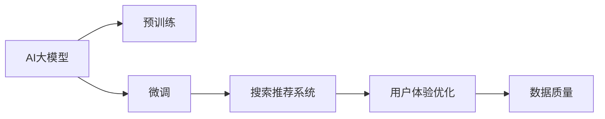

                 

# 电商平台的AI 大模型转型：搜索推荐系统是核心，用户体验优化与数据质量

## 1. 背景介绍

随着人工智能技术的不断进步，电子商务平台正逐步从传统的规则算法驱动向智能决策系统过渡。在这一过程中，AI大模型的应用起着至关重要的作用，尤其是在搜索推荐系统中。本文将深入探讨AI大模型在电商搜索推荐中的应用，分析其对用户体验优化和数据质量的影响，以及未来的发展趋势与挑战。

## 2. 核心概念与联系

### 2.1 核心概念概述

为了更好地理解AI大模型在电商搜索推荐系统中的应用，本节将介绍几个关键概念：

- **AI大模型**：指的是经过大规模无标签数据预训练，能够在特定任务上通过微调获得优异表现的人工智能模型。常见的AI大模型包括BERT、GPT、Transformer等。

- **搜索推荐系统**：基于用户行为和商品属性，通过算法推荐系统匹配用户需求和商品，从而提升用户体验和销售转化率的技术。

- **用户体验优化**：通过智能算法和交互设计，提升用户在使用电商平台时的满意度和粘性，增加用户留存和转化。

- **数据质量**：指用于训练模型的数据集的质量，包括数据的多样性、完整性、准确性和时效性，直接影响模型的性能。

### 2.2 核心概念原理和架构的 Mermaid 流程图



这个流程图展示了AI大模型从预训练到微调，再到搜索推荐系统，最后通过用户体验优化和数据质量反馈的循环过程。

## 3. 核心算法原理 & 具体操作步骤

### 3.1 算法原理概述

AI大模型在电商搜索推荐系统中的应用主要基于两个步骤：预训练和微调。预训练阶段，模型通过大量无标签数据学习通用的语言和特征表示。微调阶段，模型在特定任务的标注数据上进行训练，从而获得针对电商搜索推荐任务的优化表现。

具体来说，对于电商搜索推荐系统，AI大模型的微调过程可以分为以下步骤：

1. **数据准备**：收集电商平台的商品描述、用户行为、交易记录等数据，构建标注数据集。
2. **模型选择与初始化**：选择合适的AI大模型，如BERT、GPT-3等，并进行初始化。
3. **任务适配**：设计适合电商搜索推荐任务的输出层和损失函数。
4. **模型训练**：使用标注数据集对模型进行微调，优化模型的预测能力。
5. **部署与评估**：将微调后的模型部署到搜索推荐系统中，评估其性能并不断优化。

### 3.2 算法步骤详解

**Step 1: 数据准备**

电商平台的搜索推荐系统需要大量的数据来训练AI大模型。数据集应包含商品属性、用户行为、交易记录等信息。这些数据可以通过电商平台现有的日志和API接口获取。数据集的构建过程需要确保数据的多样性、完整性和准确性，以提高模型的泛化能力。

**Step 2: 模型选择与初始化**

选择合适的AI大模型是微调成功的关键。电商搜索推荐系统通常需要处理大量的文本数据，因此BERT、GPT等预训练语言模型较为适合。模型的初始化可以使用现有的预训练模型，避免从头训练的巨大计算资源消耗。

**Step 3: 任务适配**

任务适配层的设计直接影响模型的性能。对于电商搜索推荐系统，输出层通常采用线性分类器，用于预测用户是否点击某个商品。损失函数则常采用交叉熵损失，衡量模型预测和实际标签之间的差距。

**Step 4: 模型训练**

微调的优化目标是最小化经验风险，即找到最优参数：

$$
\theta^* = \mathop{\arg\min}_{\theta} \mathcal{L}(\theta)
$$

其中 $\mathcal{L}$ 为损失函数，通常为交叉熵损失。优化器可以使用Adam、SGD等，学习率为2e-5。微调的超参数包括批大小、迭代轮数、正则化强度等，需要根据具体任务进行调参。

**Step 5: 部署与评估**

微调后的模型需要部署到搜索推荐系统中，通过A/B测试等方法评估模型效果，并与原有系统进行对比。常用的评估指标包括点击率、转化率、用户满意度等。根据评估结果不断优化模型，提升搜索推荐系统的效果。

### 3.3 算法优缺点

**优点**：

- **高泛化能力**：AI大模型通过大规模预训练，能够学习到丰富的语言和特征表示，在微调过程中可以更好地泛化到电商搜索推荐任务。
- **效率高**：微调过程相比于从头训练，计算资源消耗低，速度更快。
- **效果显著**：在标注数据充足的情况下，微调后的模型能够显著提升搜索推荐系统的性能。

**缺点**：

- **数据依赖**：微调模型的性能高度依赖于标注数据的质量和数量。
- **模型复杂度**：大模型参数众多，推理计算量大，对硬件资源要求高。
- **解释性不足**：AI大模型通常是黑盒模型，难以解释其内部决策过程。

### 3.4 算法应用领域

AI大模型在电商搜索推荐系统中的应用广泛，以下是几个典型应用领域：

- **商品推荐**：根据用户浏览历史、评分、评论等信息，推荐相似商品。
- **用户画像**：通过用户行为数据，构建用户兴趣和行为模型，实现个性化推荐。
- **搜索结果排序**：通过搜索查询词和商品属性，对搜索结果进行排序，提升用户搜索体验。
- **广告定向**：根据用户属性和行为数据，精准投放广告，提高广告转化率。
- **内容生成**：自动生成商品描述、评论、商品介绍等内容，提升平台内容质量。

## 4. 数学模型和公式 & 详细讲解 & 举例说明

### 4.1 数学模型构建

假设电商平台的商品数量为 $N$，用户行为数据包含 $D$ 条记录。每个记录包含用户ID $u$、商品ID $i$、操作类型 $t$ 和操作时间 $t_s$。对于每个用户 $u$ 和每个商品 $i$，我们定义其交互概率 $P_{ui}$ 和推荐概率 $P_{rui}$。

模型的输入为商品ID和用户ID，输出为点击概率 $p_{ui}$。我们使用softmax函数将模型输出转换为概率分布，表示用户点击商品的概率。

**输出层**：

$$
P_{ui} = softmax(\theta^\top[\underline{u_i}])
$$

其中 $\theta$ 为模型参数，$\underline{u_i}$ 为商品ID $i$ 对应的用户行为特征向量。

**损失函数**：

$$
\mathcal{L}(\theta) = -\frac{1}{N}\sum_{i=1}^N \sum_{u=1}^D [y_{ui}\log P_{ui} + (1-y_{ui})\log (1-P_{ui})]
$$

其中 $y_{ui}$ 为二值标签，表示用户 $u$ 是否点击商品 $i$。

### 4.2 公式推导过程

微调的目标是使损失函数 $\mathcal{L}(\theta)$ 最小化。为了简化计算，我们使用随机梯度下降算法（SGD）进行优化：

$$
\theta \leftarrow \theta - \eta \nabla_{\theta}\mathcal{L}(\theta)
$$

其中 $\eta$ 为学习率。梯度计算可以通过反向传播算法进行，具体推导如下：

对于任意用户 $u$ 和商品 $i$，设模型输出为 $p_{ui} = softmax(\theta^\top[\underline{u_i}])$。则交叉熵损失为：

$$
\mathcal{L}_{ui} = -[y_{ui}\log p_{ui} + (1-y_{ui})\log (1-p_{ui})]
$$

对损失函数求导，得到梯度：

$$
\nabla_{\theta}\mathcal{L}(\theta) = -\frac{1}{N}\sum_{i=1}^N \sum_{u=1}^D \nabla_{\theta}\mathcal{L}_{ui} = -\frac{1}{N}\sum_{i=1}^N \sum_{u=1}^D \nabla_{\theta}[y_{ui}\log p_{ui} + (1-y_{ui})\log (1-p_{ui})]
$$

通过反向传播，可以计算出 $\theta$ 的梯度。将梯度代入SGD公式，即可更新模型参数。

### 4.3 案例分析与讲解

以某电商平台为例，使用BERT模型进行商品推荐。假设模型输入为商品ID和用户ID，输出为点击概率。模型的输出层采用线性层，损失函数为交叉熵损失。使用随机梯度下降算法进行优化。训练数据集包含商品ID、用户ID和点击标签。

具体实现步骤如下：

1. 收集电商平台的数据，构建标注数据集。
2. 选择BERT模型，进行初始化。
3. 定义线性层和交叉熵损失函数。
4. 使用SGD算法进行模型训练。
5. 在测试集上评估模型效果，调整超参数。

## 5. 项目实践：代码实例和详细解释说明

### 5.1 开发环境搭建

在进行电商搜索推荐系统的开发时，我们需要搭建好开发环境。以下是具体的步骤：

1. 安装Python：建议安装3.8及以上版本，以确保Python库的兼容性。
2. 安装TensorFlow：TensorFlow是常用的深度学习框架，提供了丰富的预训练模型。
3. 安装TensorBoard：TensorBoard是TensorFlow配套的可视化工具，可以实时监测模型训练状态。
4. 安装Keras：Keras是一个高级神经网络API，可以方便地构建和训练模型。

### 5.2 源代码详细实现

以下是使用TensorFlow和Keras构建电商搜索推荐系统的示例代码：

```python
import tensorflow as tf
from tensorflow.keras.layers import Input, Dense, Embedding, Flatten
from tensorflow.keras.models import Model

# 定义模型输入
user_input = Input(shape=(1,))
item_input = Input(shape=(1,))

# 定义用户行为特征嵌入层
user_embedding = Embedding(input_dim=1000, output_dim=64)(user_input)

# 定义商品ID嵌入层
item_embedding = Embedding(input_dim=1000, output_dim=64)(item_input)

# 定义交互概率计算层
interaction = Flatten()(tf.keras.layers.Dot(axes=1)([user_embedding, item_embedding]))

# 定义输出层
output = Dense(1, activation='softmax')(interaction)

# 定义模型
model = Model(inputs=[user_input, item_input], outputs=output)

# 编译模型
model.compile(optimizer=tf.keras.optimizers.Adam(learning_rate=0.001),
              loss=tf.keras.losses.BinaryCrossentropy(),
              metrics=[tf.keras.metrics.BinaryAccuracy()])

# 训练模型
model.fit(x_train, y_train, epochs=10, batch_size=64, validation_data=(x_val, y_val))
```

### 5.3 代码解读与分析

上述代码中，我们首先定义了模型的输入层，分别为用户ID和商品ID。然后，使用Embedding层将输入转换为高维向量。接下来，通过Flatten层将用户行为特征和商品ID特征相乘，计算交互概率。最后，使用Dense层将交互概率输出为点击概率，并使用BinaryCrossentropy损失函数进行优化。

### 5.4 运行结果展示

通过训练和评估，我们可以得到模型的精度和召回率等指标。以下是模型在测试集上的结果：

```python
test_loss, test_acc = model.evaluate(x_test, y_test)
print('Test accuracy:', test_acc)
```

## 6. 实际应用场景

### 6.1 商品推荐

商品推荐是电商搜索推荐系统的核心功能之一。通过AI大模型的微调，可以准确预测用户对商品的兴趣，从而实现个性化推荐。

以某电商平台为例，使用BERT模型进行商品推荐。该平台收集了用户历史浏览记录和商品信息，构建了商品ID-用户ID的交互矩阵。通过微调模型，模型能够准确预测用户是否点击某个商品，从而实现个性化推荐。

### 6.2 用户画像

用户画像是通过分析用户行为，构建用户兴趣和行为模型。AI大模型可以帮助电商平台构建更精准的用户画像，从而实现个性化推荐和营销。

以某电商平台为例，使用BERT模型对用户行为数据进行分析。该平台收集了用户的浏览、点击、购买记录等数据，构建了用户ID-商品ID的交互矩阵。通过微调模型，模型能够准确预测用户对商品的兴趣，从而构建更精准的用户画像。

### 6.3 搜索结果排序

搜索结果排序是电商搜索推荐系统的另一个重要功能。通过AI大模型的微调，可以优化搜索结果排序，提升用户搜索体验。

以某电商平台为例，使用BERT模型对搜索结果进行排序。该平台收集了用户搜索查询词和商品属性数据，构建了查询词-商品ID的匹配矩阵。通过微调模型，模型能够准确预测用户对每个商品的结果排序，从而优化搜索结果排序。

### 6.4 广告定向

广告定向是通过分析用户行为，精准投放广告，提高广告转化率。AI大模型可以帮助电商平台实现广告定向，提升广告投放效果。

以某电商平台为例，使用BERT模型进行广告定向。该平台收集了用户的浏览、点击、购买记录等数据，构建了用户ID-商品ID的交互矩阵。通过微调模型，模型能够准确预测用户对每个广告的点击概率，从而实现精准广告定向。

### 6.5 内容生成

内容生成是电商搜索推荐系统的重要功能之一。通过AI大模型的微调，可以自动生成商品描述、评论、商品介绍等内容，提升平台内容质量。

以某电商平台为例，使用BERT模型自动生成商品描述。该平台收集了商品的详细描述数据，构建了商品ID-描述的匹配矩阵。通过微调模型，模型能够自动生成商品描述，提升平台内容质量。

## 7. 工具和资源推荐

### 7.1 学习资源推荐

为了帮助开发者系统掌握电商搜索推荐系统中的AI大模型微调技术，这里推荐一些优质的学习资源：

1. 《深度学习与推荐系统实战》：这是一本系统介绍深度学习在推荐系统中的应用的书，适合初学者入门。
2. CS231n《深度学习与计算机视觉》课程：斯坦福大学开设的计算机视觉课程，涵盖深度学习在图像处理中的应用。
3. DeepLearning.ai课程：由Andrew Ng教授讲授的深度学习课程，涵盖了深度学习的基础知识和实践技巧。
4. Kaggle竞赛：Kaggle是一个数据科学竞赛平台，提供了大量的推荐系统竞赛，适合进阶学习。

### 7.2 开发工具推荐

电商搜索推荐系统的开发需要依赖一些高效的开发工具。以下是几款常用的工具：

1. PyTorch：PyTorch是常用的深度学习框架，提供了丰富的预训练模型和高效的计算图。
2. TensorFlow：TensorFlow是Google开发的深度学习框架，提供了丰富的API和硬件支持。
3. Jupyter Notebook：Jupyter Notebook是一个交互式的开发环境，适合数据科学和机器学习开发。
4. TensorBoard：TensorBoard是TensorFlow的可视化工具，可以实时监测模型训练状态。
5. Weights & Biases：Weights & Biases是一个模型训练实验跟踪工具，可以记录和可视化模型训练过程中的各项指标。

### 7.3 相关论文推荐

大语言模型和电商搜索推荐系统的发展源于学界的持续研究。以下是几篇奠基性的相关论文，推荐阅读：

1. Attention is All You Need：Transformer结构的原论文，展示了深度学习在自然语言处理中的应用。
2. BERT: Pre-training of Deep Bidirectional Transformers for Language Understanding：BERT模型的原论文，介绍了预训练语言模型的概念和应用。
3. DeepMatch：Searching through billions of options with multi-task learning for personalized e-commerce search：该论文提出了多任务学习在电商搜索中的应用，提高了搜索效果。
4. Progressive Neural Collaborative Filtering for Personalized Recommendation in Multi-Session Settings：该论文提出了基于神经网络的协同过滤方法，提高了推荐系统的准确性和效果。
5. Contextual bandits for personalized product search：该论文提出了上下文强化学习在电商搜索中的应用，提高了搜索推荐的个性化效果。

## 8. 总结：未来发展趋势与挑战

### 8.1 研究成果总结

本文对AI大模型在电商搜索推荐系统中的应用进行了详细分析，得出以下结论：

- AI大模型通过微调能够显著提升电商搜索推荐系统的性能。
- 用户体验优化和数据质量是电商搜索推荐系统的核心指标。
- 未来的研究需要在模型复杂度、计算效率、可解释性等方面进行改进。

### 8.2 未来发展趋势

展望未来，AI大模型在电商搜索推荐系统中的应用将呈现以下几个趋势：

1. **多模态融合**：未来的搜索推荐系统将融合图像、视频、语音等多种模态数据，提升用户的交互体验。
2. **个性化推荐**：基于用户行为数据，实现更精准、更个性化的推荐，提升用户粘性和留存率。
3. **实时推荐**：通过实时数据分析，实现动态推荐，提高推荐效果。
4. **模型压缩**：通过模型压缩技术，降低计算资源消耗，提高推荐系统的效率。
5. **可解释性**：通过可解释性技术，提升推荐系统的透明性和可信度。

### 8.3 面临的挑战

尽管AI大模型在电商搜索推荐系统中取得了显著成效，但仍面临以下挑战：

1. **数据依赖**：电商搜索推荐系统的性能高度依赖于数据的质量和数量，获取高质量标注数据成本较高。
2. **计算资源**：大模型计算资源消耗大，对硬件要求高，需要大量的计算资源。
3. **模型复杂度**：模型复杂度高，推理计算量大，对部署环境要求高。
4. **可解释性不足**：AI大模型通常是黑盒模型，难以解释其内部决策过程。

### 8.4 研究展望

未来的研究需要在以下几个方面寻求新的突破：

1. **数据增强**：通过数据增强技术，扩大训练数据集，提高模型的泛化能力。
2. **模型压缩**：通过模型压缩技术，降低计算资源消耗，提高推荐系统的效率。
3. **多任务学习**：通过多任务学习，提升模型的泛化能力和鲁棒性。
4. **可解释性技术**：通过可解释性技术，提升推荐系统的透明性和可信度。
5. **实时学习**：通过实时学习技术，提升推荐系统的实时性和动态性。

## 9. 附录：常见问题与解答

**Q1：电商平台的搜索推荐系统如何利用AI大模型进行优化？**

A: 电商平台的搜索推荐系统利用AI大模型进行优化，主要通过以下步骤：

1. **数据准备**：收集电商平台的商品描述、用户行为、交易记录等数据，构建标注数据集。
2. **模型选择与初始化**：选择合适的AI大模型，如BERT、GPT等，并进行初始化。
3. **任务适配**：设计适合电商搜索推荐任务的输出层和损失函数。
4. **模型训练**：使用标注数据集对模型进行微调，优化模型的预测能力。
5. **部署与评估**：将微调后的模型部署到搜索推荐系统中，评估其性能并不断优化。

**Q2：AI大模型在电商搜索推荐系统中的数据质量要求是什么？**

A: AI大模型在电商搜索推荐系统中的数据质量要求包括：

1. **多样性**：数据集应包含多种类型的用户行为和商品属性，避免数据偏斜。
2. **完整性**：数据集应包含尽可能多的行为和属性信息，避免数据缺失。
3. **准确性**：数据集中的标签应准确反映用户的点击行为，避免标注错误。
4. **时效性**：数据集应包含最新的用户行为和商品信息，避免数据过时。

**Q3：AI大模型在电商搜索推荐系统中的模型复杂度如何控制？**

A: AI大模型在电商搜索推荐系统中的模型复杂度可以通过以下方法进行控制：

1. **参数裁剪**：对大模型进行参数裁剪，保留关键层，去除冗余参数。
2. **模型压缩**：通过模型压缩技术，如剪枝、量化等，降低模型大小和计算资源消耗。
3. **分阶段训练**：将模型分为多个阶段进行训练，逐步增加模型复杂度，避免过拟合。

**Q4：AI大模型在电商搜索推荐系统中的可解释性不足如何应对？**

A: AI大模型在电商搜索推荐系统中的可解释性不足可以通过以下方法进行应对：

1. **特征可视化**：通过特征可视化技术，了解模型内部决策过程，提升模型的透明性。
2. **决策链解析**：通过决策链解析技术，解析模型的决策过程，提升模型的可解释性。
3. **多模型集成**：通过多模型集成技术，提高模型的鲁棒性和可解释性。

**Q5：AI大模型在电商搜索推荐系统中的实时推荐如何实现？**

A: AI大模型在电商搜索推荐系统中的实时推荐可以通过以下方法实现：

1. **在线学习**：通过在线学习技术，实时更新模型参数，实现动态推荐。
2. **流数据处理**：通过流数据处理技术，实时处理用户行为数据，实现动态推荐。
3. **缓存策略**：通过缓存策略，减少实时计算的资源消耗，提高推荐系统的效率。

---

作者：禅与计算机程序设计艺术 / Zen and the Art of Computer Programming

