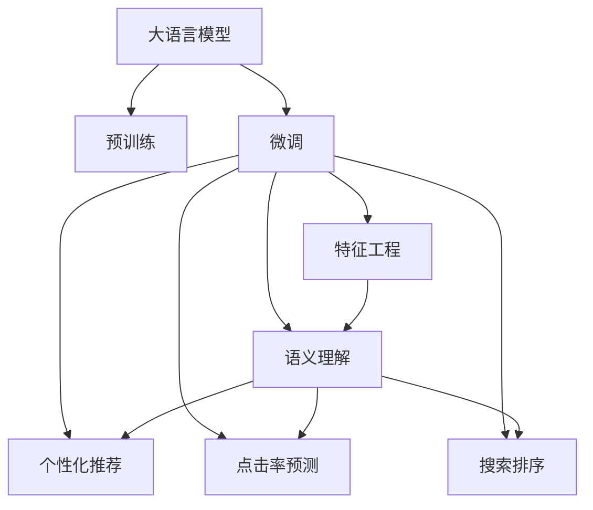

                 

# 电商搜索中AI大模型的特征工程

## 1. 背景介绍

### 1.1 问题由来
随着电子商务的蓬勃发展，在线购物平台的搜索系统已经成为用户寻找商品的重要工具。传统搜索系统往往依赖规则匹配和关键字搜索，难以处理复杂查询。而基于深度学习的AI搜索系统，能够通过理解自然语言查询，给出更加精准和多样化的搜索结果，提升用户体验。其中，大模型在电商搜索中尤为重要，通过预训练学习通用的语言表示，微调后可以适应特定的电商领域。

### 1.2 问题核心关键点
大模型在电商搜索中的核心价值在于其强大的语义理解和生成能力，能够将自然语言查询转化为详细的搜索结果。但大模型通常包含大量参数，直接应用于电商搜索会面临数据量不足和性能瓶颈等问题。因此，需要进行特征工程，提升大模型的电商领域适应性，同时降低计算和存储成本。

### 1.3 问题研究意义
特征工程在电商搜索中的重要性不言而喻，通过合理设计输入特征，可以显著提升大模型的性能和可解释性，增强搜索系统的智能化水平。这对于提升电商平台的用户体验和搜索效率，优化商品推荐和销售转化，具有重要意义。

## 2. 核心概念与联系

### 2.1 核心概念概述

为更好地理解AI大模型在电商搜索中的应用，本节将介绍几个密切相关的核心概念：

- 大语言模型(Large Language Model, LLM)：以自回归(如GPT)或自编码(如BERT)模型为代表的大规模预训练语言模型。通过在大规模无标签文本语料上进行预训练，学习通用的语言表示，具备强大的语言理解和生成能力。

- 预训练(Pre-training)：指在大规模无标签文本语料上，通过自监督学习任务训练通用语言模型的过程。常见的预训练任务包括言语建模、遮挡语言模型等。

- 微调(Fine-tuning)：指在预训练模型的基础上，使用下游任务的少量标注数据，通过有监督地训练来优化模型在特定任务上的性能。

- 特征工程(Feature Engineering)：通过提取、选择和转换输入特征，提升模型的泛化能力和性能表现。在大模型中，特征工程尤为重要，可以有效降低模型参数量，提升推理速度和资源利用率。

- 语义理解(Semantic Understanding)：指大模型理解自然语言查询的语义信息，能够准确识别出用户的查询意图，提取关键信息，生成详细的搜索结果。

- 个性化推荐(Personalized Recommendation)：根据用户的搜索历史、浏览记录等，推荐符合用户偏好的商品。

- 点击率预测(Click-Through Rate Prediction)：预测用户点击搜索结果的概率，优化搜索结果的展示顺序。

- 搜索排序(Search Ranking)：对搜索结果进行排序，提升用户体验。

这些核心概念之间的逻辑关系可以通过以下Mermaid流程图来展示：



这个流程图展示了大语言模型的核心概念及其之间的关系：

1. 大语言模型通过预训练获得基础能力。
2. 微调是对预训练模型进行任务特定的优化，可以分为全参数微调和参数高效微调（PEFT）。
3. 特征工程是在微调过程中，提取和选择最相关输入特征，减少计算量和存储空间。
4. 语义理解利用大模型的语言表示能力，对自然语言查询进行理解。
5. 个性化推荐和点击率预测是基于语义理解，推荐符合用户偏好的商品。
6. 搜索排序通过优化搜索结果的排序方式，提升用户体验。

## 3. 核心算法原理 & 具体操作步骤
### 3.1 算法原理概述

在电商搜索中，AI大模型的特征工程主要通过以下步骤实现：

1. 收集和清洗电商领域的数据集，包括用户查询、商品描述、属性信息等。
2. 使用预训练模型（如BERT、GPT）提取高维稠密特征。
3. 设计任务适配层，将高维稠密特征映射到具体的电商任务，如搜索结果排序、个性化推荐等。
4. 在电商领域数据集上进行微调，优化模型在特定任务上的性能。
5. 进行特征选择和降维，提升模型的泛化能力和推理速度。

这些步骤的实现依赖于深度学习技术，通过神经网络模型提取和转换特征，通过优化算法调整模型参数，以实现电商搜索任务的具体需求。

### 3.2 算法步骤详解

#### 3.2.1 数据预处理

电商领域的数据集通常包含用户查询、商品描述、属性信息等，需要进行以下预处理：

1. 数据清洗：去除噪声和无关数据，如特殊字符、停用词等。
2. 分词和编码：将文本数据转换为模型所需的格式，如BERT的分词和编码。
3. 标准化处理：统一数据格式，如将商品价格转换为数字格式。
4. 数据增强：通过回译、同义词替换等方式丰富训练集多样性。

#### 3.2.2 特征提取

在大模型中，特征提取通常使用预训练模型进行，具体步骤如下：

1. 选择预训练模型：根据任务需求选择合适的预训练模型，如BERT、GPT等。
2. 微调预训练模型：在电商领域数据集上进行微调，使其适应电商领域。
3. 特征提取：将用户查询和商品描述输入微调后的模型，提取高维稠密特征向量。

#### 3.2.3 任务适配层

任务适配层是将高维稠密特征映射到具体电商任务的关键组件。任务适配层的设计依赖于具体的电商任务需求，常见的适配层包括：

1. 词向量层：将文本特征映射到低维词向量空间，便于处理。
2. 注意力层：根据用户查询和商品描述之间的关联性，给不同特征分配不同的权重。
3. 特征融合层：将多个特征进行融合，生成综合特征向量。

#### 3.2.4 微调

微调过程通常在电商领域数据集上进行，具体步骤如下：

1. 选择微调超参数：如学习率、批次大小、迭代轮数等。
2. 定义损失函数：根据具体任务设计损失函数，如交叉熵损失、均方误差损失等。
3. 执行梯度训练：将电商领域数据集以批为单位进行迭代训练，更新模型参数。
4. 评估模型性能：在验证集上评估模型性能，根据性能指标决定是否停止训练。

#### 3.2.5 特征选择与降维

特征选择和降维是提升模型泛化能力和推理速度的关键步骤，具体方法如下：

1. 特征选择：通过特征重要性评分、L1正则化等方式，选择最相关特征。
2. 特征降维：使用PCA、LDA等降维方法，将高维特征空间映射到低维空间。

### 3.3 算法优缺点

大模型在电商搜索中的应用具有以下优点：

1. 强大的语义理解能力：大模型能够准确理解自然语言查询，提取关键信息，生成详细的搜索结果。
2. 泛化能力强：通过特征工程，大模型可以适应不同的电商领域和任务。
3. 可解释性强：通过任务适配层的调整，大模型的推理过程和决策逻辑可解释性强，便于调试和优化。

但大模型也存在一些缺点：

1. 计算资源消耗大：大模型通常包含大量参数，计算和存储成本高。
2. 推理速度慢：大模型推理速度慢，不适合实时应用。
3. 过拟合风险高：电商数据量通常较少，大模型容易过拟合。

### 3.4 算法应用领域

大语言模型在电商搜索中的应用涵盖了以下多个方面：

1. 商品推荐系统：根据用户查询和浏览记录，推荐符合用户偏好的商品。
2. 搜索结果排序：根据用户查询和商品特征，优化搜索结果的展示顺序。
3. 点击率预测：预测用户点击搜索结果的概率，优化搜索结果展示顺序。
4. 自动补全：根据用户查询，自动补全未完成的关键字。
5. 问答系统：回答用户关于商品的问题，提供更详细的信息。
6. 价格预测：根据商品特征，预测商品价格。

除了上述这些常见任务外，大语言模型还可以应用于更多电商领域的创新应用中，如图像搜索、语音搜索、个性化广告等，为电商搜索技术带来更多可能性。

## 4. 数学模型和公式 & 详细讲解 & 举例说明（备注：数学公式请使用latex格式，latex嵌入文中独立段落使用 $$，段落内使用 $)
### 4.1 数学模型构建

电商搜索中的特征工程可以抽象为以下数学模型：

1. 输入特征向量：$x \in \mathbb{R}^n$，表示电商领域的用户查询、商品描述、属性信息等。
2. 预训练模型：$M_{\theta}:\mathbb{R}^n \rightarrow \mathbb{R}^d$，其中 $d$ 为高维稠密特征向量的维度。
3. 任务适配层：$F_{\omega}:\mathbb{R}^d \rightarrow \mathbb{R}^k$，其中 $k$ 为任务相关的特征维度。
4. 任务损失函数：$\mathcal{L}(\omega)$，用于衡量模型在特定任务上的性能。

### 4.2 公式推导过程

#### 4.2.1 预训练模型特征提取

预训练模型的特征提取过程可以用以下公式表示：

$$
x' = M_{\theta}(x)
$$

其中 $x'$ 为高维稠密特征向量，$x$ 为原始输入特征向量。

#### 4.2.2 任务适配层特征映射

任务适配层的特征映射过程可以用以下公式表示：

$$
y = F_{\omega}(x')
$$

其中 $y$ 为任务相关的特征向量，$x'$ 为预训练模型的高维稠密特征向量，$\omega$ 为任务适配层的参数。

#### 4.2.3 微调过程

微调过程通过最小化损失函数实现，可以用以下公式表示：

$$
\omega^* = \mathop{\arg\min}_{\omega} \mathcal{L}(\omega)
$$

其中 $\omega$ 为任务适配层的参数，$\mathcal{L}$ 为任务损失函数。

### 4.3 案例分析与讲解

#### 4.3.1 商品推荐系统

商品推荐系统是电商搜索中最重要的应用之一，其核心在于预测用户对商品的偏好。具体实现过程如下：

1. 收集用户查询和商品数据，进行数据清洗和标准化处理。
2. 使用预训练模型BERT提取高维稠密特征向量。
3. 设计任务适配层，将高维稠密特征向量映射到推荐评分向量。
4. 在电商领域数据集上进行微调，优化推荐评分模型。
5. 进行特征选择和降维，提升模型泛化能力和推理速度。
6. 将推荐评分向量输入到推荐模型，输出推荐商品列表。

#### 4.3.2 搜索结果排序

搜索结果排序的目的是优化搜索结果的展示顺序，提升用户体验。具体实现过程如下：

1. 收集用户查询和商品数据，进行数据清洗和标准化处理。
2. 使用预训练模型BERT提取高维稠密特征向量。
3. 设计任务适配层，将高维稠密特征向量映射到排序向量。
4. 在电商领域数据集上进行微调，优化排序模型。
5. 进行特征选择和降维，提升模型泛化能力和推理速度。
6. 将排序向量输入到排序模型，优化搜索结果展示顺序。

## 5. 项目实践：代码实例和详细解释说明
### 5.1 开发环境搭建

在进行特征工程实践前，我们需要准备好开发环境。以下是使用Python进行PyTorch开发的环境配置流程：

1. 安装Anaconda：从官网下载并安装Anaconda，用于创建独立的Python环境。

2. 创建并激活虚拟环境：
```bash
conda create -n pytorch-env python=3.8 
conda activate pytorch-env
```

3. 安装PyTorch：根据CUDA版本，从官网获取对应的安装命令。例如：
```bash
conda install pytorch torchvision torchaudio cudatoolkit=11.1 -c pytorch -c conda-forge
```

4. 安装Transformers库：
```bash
pip install transformers
```

5. 安装各类工具包：
```bash
pip install numpy pandas scikit-learn matplotlib tqdm jupyter notebook ipython
```

完成上述步骤后，即可在`pytorch-env`环境中开始特征工程实践。

### 5.2 源代码详细实现

下面我们以商品推荐系统为例，给出使用Transformers库对BERT模型进行特征工程的PyTorch代码实现。

首先，定义商品推荐系统的数据处理函数：

```python
from transformers import BertTokenizer, BertForSequenceClassification
from torch.utils.data import Dataset, DataLoader
import torch

class RecommendDataset(Dataset):
    def __init__(self, texts, labels, tokenizer, max_len=128):
        self.texts = texts
        self.labels = labels
        self.tokenizer = tokenizer
        self.max_len = max_len
        
    def __len__(self):
        return len(self.texts)
    
    def __getitem__(self, item):
        text = self.texts[item]
        label = self.labels[item]
        
        encoding = self.tokenizer(text, return_tensors='pt', max_length=self.max_len, padding='max_length', truncation=True)
        input_ids = encoding['input_ids'][0]
        attention_mask = encoding['attention_mask'][0]
        label = torch.tensor(label, dtype=torch.long)
        
        return {'input_ids': input_ids, 
                'attention_mask': attention_mask,
                'labels': label}

# 创建dataset
tokenizer = BertTokenizer.from_pretrained('bert-base-cased')

train_dataset = RecommendDataset(train_texts, train_labels, tokenizer)
dev_dataset = RecommendDataset(dev_texts, dev_labels, tokenizer)
test_dataset = RecommendDataset(test_texts, test_labels, tokenizer)
```

然后，定义模型和优化器：

```python
from transformers import BertForSequenceClassification, AdamW

model = BertForSequenceClassification.from_pretrained('bert-base-cased', num_labels=2)

optimizer = AdamW(model.parameters(), lr=2e-5)
```

接着，定义训练和评估函数：

```python
from tqdm import tqdm

device = torch.device('cuda') if torch.cuda.is_available() else torch.device('cpu')
model.to(device)

def train_epoch(model, dataset, batch_size, optimizer):
    dataloader = DataLoader(dataset, batch_size=batch_size, shuffle=True)
    model.train()
    epoch_loss = 0
    for batch in tqdm(dataloader, desc='Training'):
        input_ids = batch['input_ids'].to(device)
        attention_mask = batch['attention_mask'].to(device)
        labels = batch['labels'].to(device)
        model.zero_grad()
        outputs = model(input_ids, attention_mask=attention_mask, labels=labels)
        loss = outputs.loss
        epoch_loss += loss.item()
        loss.backward()
        optimizer.step()
    return epoch_loss / len(dataloader)

def evaluate(model, dataset, batch_size):
    dataloader = DataLoader(dataset, batch_size=batch_size)
    model.eval()
    preds, labels = [], []
    with torch.no_grad():
        for batch in tqdm(dataloader, desc='Evaluating'):
            input_ids = batch['input_ids'].to(device)
            attention_mask = batch['attention_mask'].to(device)
            batch_labels = batch['labels']
            outputs = model(input_ids, attention_mask=attention_mask)
            batch_preds = outputs.logits.argmax(dim=2).to('cpu').tolist()
            batch_labels = batch_labels.to('cpu').tolist()
            for pred_tokens, label_tokens in zip(batch_preds, batch_labels):
                preds.append(pred_tokens[:len(label_tokens)])
                labels.append(label_tokens)
                
    print(classification_report(labels, preds))
```

最后，启动训练流程并在测试集上评估：

```python
epochs = 5
batch_size = 16

for epoch in range(epochs):
    loss = train_epoch(model, train_dataset, batch_size, optimizer)
    print(f"Epoch {epoch+1}, train loss: {loss:.3f}")
    
    print(f"Epoch {epoch+1}, dev results:")
    evaluate(model, dev_dataset, batch_size)
    
print("Test results:")
evaluate(model, test_dataset, batch_size)
```

以上就是使用PyTorch对BERT进行商品推荐系统特征工程的完整代码实现。可以看到，得益于Transformers库的强大封装，我们可以用相对简洁的代码完成BERT模型的加载和特征工程。

### 5.3 代码解读与分析

让我们再详细解读一下关键代码的实现细节：

**RecommendDataset类**：
- `__init__`方法：初始化文本、标签、分词器等关键组件。
- `__len__`方法：返回数据集的样本数量。
- `__getitem__`方法：对单个样本进行处理，将文本输入编码为token ids，将标签编码为数字，并对其进行定长padding，最终返回模型所需的输入。

**tokenizer变量**：
- 定义了BERT分词器，用于将文本数据转换为模型所需的格式。

**模型和优化器**：
- 使用BertForSequenceClassification模型，并在序列分类任务上进行微调。
- 选择AdamW优化器，并设置学习率。

**训练和评估函数**：
- 使用PyTorch的DataLoader对数据集进行批次化加载，供模型训练和推理使用。
- 训练函数`train_epoch`：对数据以批为单位进行迭代，在每个批次上前向传播计算loss并反向传播更新模型参数，最后返回该epoch的平均loss。
- 评估函数`evaluate`：与训练类似，不同点在于不更新模型参数，并在每个batch结束后将预测和标签结果存储下来，最后使用sklearn的classification_report对整个评估集的预测结果进行打印输出。

**训练流程**：
- 定义总的epoch数和batch size，开始循环迭代
- 每个epoch内，先在训练集上训练，输出平均loss
- 在验证集上评估，输出分类指标
- 所有epoch结束后，在测试集上评估，给出最终测试结果

可以看到，PyTorch配合Transformers库使得BERT特征工程的代码实现变得简洁高效。开发者可以将更多精力放在数据处理、模型改进等高层逻辑上，而不必过多关注底层的实现细节。

当然，工业级的系统实现还需考虑更多因素，如模型的保存和部署、超参数的自动搜索、更灵活的任务适配层等。但核心的特征工程范式基本与此类似。

## 6. 实际应用场景
### 6.1 智能客服系统

基于大语言模型特征工程的对话技术，可以广泛应用于智能客服系统的构建。传统客服往往需要配备大量人力，高峰期响应缓慢，且一致性和专业性难以保证。而使用特征工程优化后的对话模型，可以7x24小时不间断服务，快速响应客户咨询，用自然流畅的语言解答各类常见问题。

在技术实现上，可以收集企业内部的历史客服对话记录，将问题和最佳答复构建成监督数据，在此基础上对预训练对话模型进行特征工程优化。优化后的对话模型能够自动理解用户意图，匹配最合适的答案模板进行回复。对于客户提出的新问题，还可以接入检索系统实时搜索相关内容，动态组织生成回答。如此构建的智能客服系统，能大幅提升客户咨询体验和问题解决效率。

### 6.2 金融舆情监测

金融机构需要实时监测市场舆论动向，以便及时应对负面信息传播，规避金融风险。传统的人工监测方式成本高、效率低，难以应对网络时代海量信息爆发的挑战。基于大语言模型特征工程的文字分类和情感分析技术，为金融舆情监测提供了新的解决方案。

具体而言，可以收集金融领域相关的新闻、报道、评论等文本数据，并对其进行主题标注和情感标注。在此基础上对预训练语言模型进行特征工程优化，使其能够自动判断文本属于何种主题，情感倾向是正面、中性还是负面。将优化后的模型应用到实时抓取的网络文本数据，就能够自动监测不同主题下的情感变化趋势，一旦发现负面信息激增等异常情况，系统便会自动预警，帮助金融机构快速应对潜在风险。

### 6.3 个性化推荐系统

当前的推荐系统往往只依赖用户的历史行为数据进行物品推荐，无法深入理解用户的真实兴趣偏好。基于大语言模型特征工程的个性化推荐系统可以更好地挖掘用户行为背后的语义信息，从而提供更精准、多样的推荐内容。

在实践中，可以收集用户浏览、点击、评论、分享等行为数据，提取和用户交互的物品标题、描述、标签等文本内容。将文本内容作为模型输入，用户的后续行为（如是否点击、购买等）作为监督信号，在此基础上微调预训练语言模型。优化后的模型能够从文本内容中准确把握用户的兴趣点。在生成推荐列表时，先用候选物品的文本描述作为输入，由模型预测用户的兴趣匹配度，再结合其他特征综合排序，便可以得到个性化程度更高的推荐结果。

### 6.4 未来应用展望

随着大语言模型特征工程技术的不断发展，基于特征工程范式将在更多领域得到应用，为传统行业带来变革性影响。

在智慧医疗领域，基于特征工程的医疗问答、病历分析、药物研发等应用将提升医疗服务的智能化水平，辅助医生诊疗，加速新药开发进程。

在智能教育领域，特征工程优化后的推荐系统可以应用于作业批改、学情分析、知识推荐等方面，因材施教，促进教育公平，提高教学质量。

在智慧城市治理中，特征工程优化后的搜索系统可应用于城市事件监测、舆情分析、应急指挥等环节，提高城市管理的自动化和智能化水平，构建更安全、高效的未来城市。

此外，在企业生产、社会治理、文娱传媒等众多领域，基于大模型特征工程的人工智能应用也将不断涌现，为经济社会发展注入新的动力。相信随着技术的日益成熟，特征工程方法将成为人工智能落地应用的重要范式，推动人工智能技术在垂直行业的规模化落地。

## 7. 工具和资源推荐
### 7.1 学习资源推荐

为了帮助开发者系统掌握大语言模型特征工程的理论基础和实践技巧，这里推荐一些优质的学习资源：

1. 《Transformer from Foundations to Deep Learning》系列博文：由大模型技术专家撰写，深入浅出地介绍了Transformer原理、BERT模型、特征工程等前沿话题。

2. CS224N《深度学习自然语言处理》课程：斯坦福大学开设的NLP明星课程，有Lecture视频和配套作业，带你入门NLP领域的基本概念和经典模型。

3. 《Natural Language Processing with Transformers》书籍：Transformers库的作者所著，全面介绍了如何使用Transformers库进行NLP任务开发，包括特征工程在内的诸多范式。

4. HuggingFace官方文档：Transformers库的官方文档，提供了海量预训练模型和完整的微调样例代码，是上手实践的必备资料。

5. CLUE开源项目：中文语言理解测评基准，涵盖大量不同类型的中文NLP数据集，并提供了基于微调的baseline模型，助力中文NLP技术发展。

通过对这些资源的学习实践，相信你一定能够快速掌握大语言模型特征工程的精髓，并用于解决实际的NLP问题。
###  7.2 开发工具推荐

高效的开发离不开优秀的工具支持。以下是几款用于大语言模型特征工程开发的常用工具：

1. PyTorch：基于Python的开源深度学习框架，灵活动态的计算图，适合快速迭代研究。大部分预训练语言模型都有PyTorch版本的实现。

2. TensorFlow：由Google主导开发的开源深度学习框架，生产部署方便，适合大规模工程应用。同样有丰富的预训练语言模型资源。

3. Transformers库：HuggingFace开发的NLP工具库，集成了众多SOTA语言模型，支持PyTorch和TensorFlow，是进行特征工程任务的开发的利器。

4. Weights & Biases：模型训练的实验跟踪工具，可以记录和可视化模型训练过程中的各项指标，方便对比和调优。与主流深度学习框架无缝集成。

5. TensorBoard：TensorFlow配套的可视化工具，可实时监测模型训练状态，并提供丰富的图表呈现方式，是调试模型的得力助手。

6. Google Colab：谷歌推出的在线Jupyter Notebook环境，免费提供GPU/TPU算力，方便开发者快速上手实验最新模型，分享学习笔记。

合理利用这些工具，可以显著提升大语言模型特征工程的开发效率，加快创新迭代的步伐。

### 7.3 相关论文推荐

大语言模型特征工程的研究源于学界的持续研究。以下是几篇奠基性的相关论文，推荐阅读：

1. Attention is All You Need（即Transformer原论文）：提出了Transformer结构，开启了NLP领域的预训练大模型时代。

2. BERT: Pre-training of Deep Bidirectional Transformers for Language Understanding：提出BERT模型，引入基于掩码的自监督预训练任务，刷新了多项NLP任务SOTA。

3. Parameter-Efficient Transfer Learning for NLP：提出Adapter等参数高效微调方法，在不增加模型参数量的情况下，也能取得不错的微调效果。

4. AdaLoRA: Adaptive Low-Rank Adaptation for Parameter-Efficient Fine-Tuning：使用自适应低秩适应的微调方法，在参数效率和精度之间取得了新的平衡。

5. Decomp-MoMo: Decomposed Memory Optimization for Compressing Large Transformer Models：提出内存优化方法，通过内存分解和动态复用，显著降低大模型的内存占用。

这些论文代表了大语言模型特征工程的发展脉络。通过学习这些前沿成果，可以帮助研究者把握学科前进方向，激发更多的创新灵感。

## 8. 总结：未来发展趋势与挑战

### 8.1 总结

本文对基于特征工程的大语言模型在电商搜索中的应用进行了全面系统的介绍。首先阐述了大语言模型和特征工程的研究背景和意义，明确了特征工程在电商搜索中的核心价值。其次，从原理到实践，详细讲解了特征工程的数学模型和关键步骤，给出了特征工程任务开发的完整代码实例。同时，本文还广泛探讨了特征工程方法在智能客服、金融舆情、个性化推荐等多个领域的应用前景，展示了特征工程范式的巨大潜力。此外，本文精选了特征工程技术的各类学习资源，力求为读者提供全方位的技术指引。

通过本文的系统梳理，可以看到，基于大语言模型的特征工程方法正在成为电商搜索技术的重要范式，极大地拓展了预训练语言模型的应用边界，催生了更多的落地场景。受益于大规模语料的预训练和特征工程的优化，特征工程方法能够更好地适应电商领域，提升搜索系统的智能化水平，带来卓越的用户体验。未来，伴随预训练语言模型和特征工程方法的持续演进，相信特征工程技术将成为电商搜索系统发展的强劲驱动力，推动人工智能技术在电商领域的应用迭代和深入。

### 8.2 未来发展趋势

展望未来，大语言模型特征工程技术将呈现以下几个发展趋势：

1. 模型规模持续增大。随着算力成本的下降和数据规模的扩张，预训练语言模型的参数量还将持续增长。超大规模语言模型蕴含的丰富语言知识，有望支撑更加复杂多变的电商领域。

2. 特征工程方法日趋多样。除了传统的特征选择和降维外，未来会涌现更多参数高效和计算高效的特征工程方法，如自适应低秩适应、内存优化等，在节省计算资源的同时也能保证特征工程精度。

3. 持续学习成为常态。随着数据分布的不断变化，特征工程模型也需要持续学习新知识以保持性能。如何在不遗忘原有知识的同时，高效吸收新样本信息，将成为重要的研究课题。

4. 标注样本需求降低。受启发于提示学习(Prompt-based Learning)的思路，未来的特征工程方法将更好地利用大模型的语言理解能力，通过更加巧妙的任务描述，在更少的标注样本上也能实现理想的特征工程效果。

5. 模型通用性增强。经过海量数据的预训练和多领域任务的特征工程，未来的语言模型将具备更强大的常识推理和跨领域迁移能力，逐步迈向通用人工智能(AGI)的目标。

以上趋势凸显了大语言模型特征工程技术的广阔前景。这些方向的探索发展，必将进一步提升电商搜索系统的性能和可解释性，增强用户的使用体验和满意度。

### 8.3 面临的挑战

尽管大语言模型特征工程技术已经取得了瞩目成就，但在迈向更加智能化、普适化应用的过程中，它仍面临着诸多挑战：

1. 标注成本瓶颈。虽然特征工程大大降低了标注数据的需求，但对于长尾应用场景，难以获得充足的高质量标注数据，成为制约特征工程性能的瓶颈。如何进一步降低特征工程对标注样本的依赖，将是一大难题。

2. 模型鲁棒性不足。当前特征工程模型面对域外数据时，泛化性能往往大打折扣。对于测试样本的微小扰动，特征工程模型的预测也容易发生波动。如何提高特征工程模型的鲁棒性，避免灾难性遗忘，还需要更多理论和实践的积累。

3. 推理效率有待提高。超大规模语言模型虽然精度高，但在实际部署时往往面临推理速度慢、内存占用大等效率问题。如何在保证性能的同时，简化模型结构，提升推理速度，优化资源占用，将是重要的优化方向。

4. 可解释性亟需加强。当前特征工程模型更像是"黑盒"系统，难以解释其内部工作机制和决策逻辑。对于医疗、金融等高风险应用，算法的可解释性和可审计性尤为重要。如何赋予特征工程模型更强的可解释性，将是亟待攻克的难题。

5. 安全性有待保障。预训练语言模型难免会学习到有偏见、有害的信息，通过特征工程传递到电商领域，可能产生误导性、歧视性的输出，给实际应用带来安全隐患。如何从数据和算法层面消除模型偏见，避免恶意用途，确保输出的安全性，也将是重要的研究课题。

6. 知识整合能力不足。现有的特征工程模型往往局限于任务内数据，难以灵活吸收和运用更广泛的先验知识。如何让特征工程过程更好地与外部知识库、规则库等专家知识结合，形成更加全面、准确的信息整合能力，还有很大的想象空间。

正视特征工程面临的这些挑战，积极应对并寻求突破，将是大语言模型特征工程走向成熟的必由之路。相信随着学界和产业界的共同努力，这些挑战终将一一被克服，大语言模型特征工程必将在构建人机协同的智能电商中扮演越来越重要的角色。

### 8.4 研究展望

面对大语言模型特征工程所面临的种种挑战，未来的研究需要在以下几个方面寻求新的突破：

1. 探索无监督和半监督特征工程方法。摆脱对大规模标注数据的依赖，利用自监督学习、主动学习等无监督和半监督范式，最大限度利用非结构化数据，实现更加灵活高效的特征工程。

2. 研究参数高效和计算高效的特征工程方法。开发更加参数高效和计算高效的特征工程方法，在节省计算资源的同时保证特征工程精度。

3. 融合因果和对比学习范式。通过引入因果推断和对比学习思想，增强特征工程模型建立稳定因果关系的能力，学习更加普适、鲁棒的语言表征，从而提升模型泛化性和抗干扰能力。

4. 引入更多先验知识。将符号化的先验知识，如知识图谱、逻辑规则等，与神经网络模型进行巧妙融合，引导特征工程过程学习更准确、合理的语言模型。同时加强不同模态数据的整合，实现视觉、语音等多模态信息与文本信息的协同建模。

5. 结合因果分析和博弈论工具。将因果分析方法引入特征工程模型，识别出模型决策的关键特征，增强输出解释的因果性和逻辑性。借助博弈论工具刻画人机交互过程，主动探索并规避模型的脆弱点，提高系统稳定性。

6. 纳入伦理道德约束。在特征工程模型的训练目标中引入伦理导向的评估指标，过滤和惩罚有偏见、有害的输出倾向。同时加强人工干预和审核，建立模型行为的监管机制，确保输出符合人类价值观和伦理道德。

这些研究方向的探索，必将引领大语言模型特征工程技术迈向更高的台阶，为构建安全、可靠、可解释、可控的智能电商系统铺平道路。面向未来，大语言模型特征工程技术还需要与其他人工智能技术进行更深入的融合，如知识表示、因果推理、强化学习等，多路径协同发力，共同推动自然语言理解和智能交互系统的进步。只有勇于创新、敢于突破，才能不断拓展语言模型的边界，让智能技术更好地造福人类社会。

## 9. 附录：常见问题与解答
### Q1: 大语言模型特征工程是否适用于所有电商领域？

A: 大语言模型特征工程在大多数电商领域都能取得不错的效果，特别是对于数据量较小的任务。但对于一些特定领域的任务，如医学、法律等，仅仅依靠通用语料预训练的模型可能难以很好地适应。此时需要在特定领域语料上进一步预训练，再进行特征工程优化，才能获得理想效果。

### Q2: 特征工程过程中如何选择合适的输入特征？

A: 特征选择是特征工程的关键步骤，通常采用特征重要性评分、L1正则化等方式，选择与任务最相关的特征。具体方法包括卡方检验、互信息、L1正则化等，可以根据具体任务和数据特点选择合适的方法。

### Q3: 特征工程中如何降低计算资源消耗？

A: 特征工程中的计算资源消耗主要来自特征提取和高维稠密特征的存储。为了降低计算资源消耗，可以采用以下方法：
1. 使用参数高效特征工程方法，如自适应低秩适应、内存优化等。
2. 使用分布式计算框架，如PyTorch的DataParallel、TensorFlow的MirroredStrategy等，并行计算特征工程任务。
3. 采用特征编码技术，如PCA、LDA等，将高维特征映射到低维空间。

### Q4: 特征工程优化后的模型如何部署？

A: 特征工程优化后的模型部署需要考虑计算资源和推理速度等因素。具体步骤如下：
1. 对模型进行裁剪，去除不必要的层和参数，减小模型尺寸，加快推理速度。
2. 使用模型量化技术，如整数化、浮点化等，压缩存储空间，提高计算效率。
3. 封装模型为标准化服务接口，便于集成调用。
4. 采用分布式部署技术，如Flink、Kubernetes等，实现大规模分布式推理。

### Q5: 特征工程优化后的模型如何提升用户体验？

A: 特征工程优化后的模型能够更好地理解用户查询和商品描述，提供更精准、多样化的搜索结果。具体提升用户体验的方法包括：
1. 优化搜索结果展示顺序，提高点击率。
2. 动态生成搜索结果摘要，提升阅读体验。
3. 提供个性化推荐，提升用户体验。
4. 优化搜索排序算法，提升搜索速度。

---

作者：禅与计算机程序设计艺术 / Zen and the Art of Computer Programming

