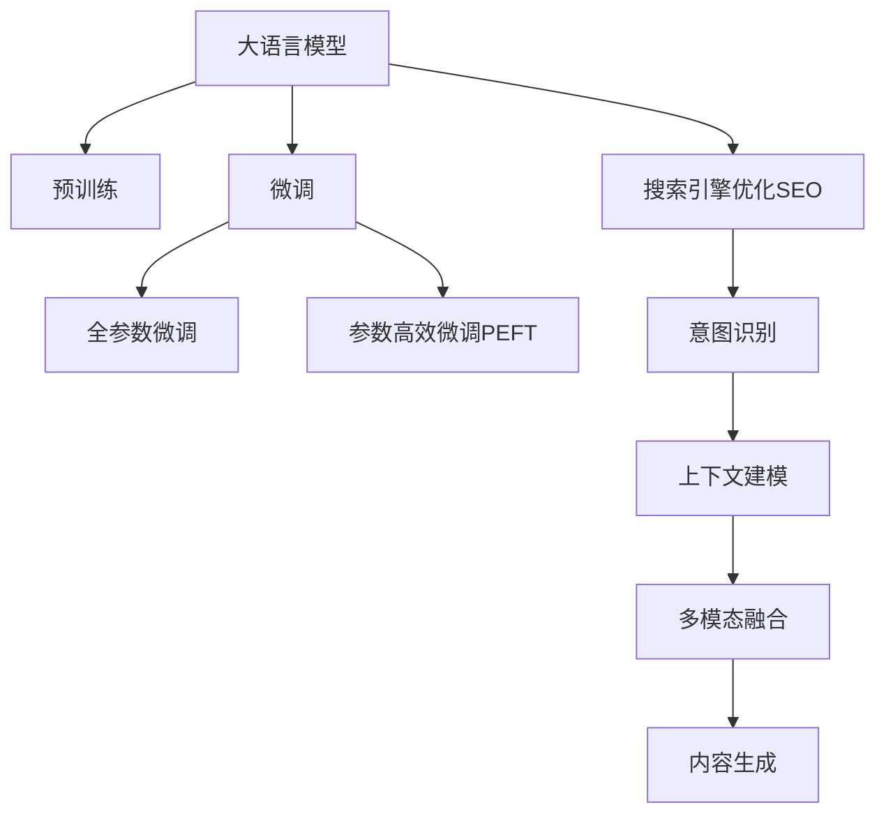

                 

# 电商搜索引擎优化：AI大模型的新思路

## 1. 背景介绍

### 1.1 问题由来
在电商领域，搜索引擎优化（Search Engine Optimization，SEO）是提升用户转化率和销售量的关键环节。传统SEO方法依赖关键词分析和内容优化，主要关注搜索引擎的算法调整，忽视了用户行为和上下文语境的影响。而随着深度学习技术的突破，大语言模型在自然语言处理（NLP）和信息检索等领域展现了卓越的性能，为电商SEO带来了新思路。

### 1.2 问题核心关键点
大语言模型在电商SEO中的应用，关键在于如何利用其强大的语义理解能力和语境建模能力，提升搜索引擎对用户意图的理解，进而优化搜索结果的相关性和质量。主要包括以下几个方面：
- **语义理解**：大模型能够理解复杂语义和上下文，从而更准确地匹配用户需求。
- **意图识别**：通过细粒度意图分析，明确用户的购买意图，提升搜索效果。
- **上下文建模**：考虑用户历史行为和当前场景，提升搜索的个性化和实时性。
- **多模态融合**：结合图像、视频、商品评价等多模态信息，提供更丰富的搜索结果。
- **内容生成**：通过大模型的自然语言生成能力，生成高质量的商品描述和广告文案。

### 1.3 问题研究意义
电商SEO的AI大模型优化，对于提升用户体验、增加商品曝光和转化率、降低营销成本具有重要意义：

1. **提升用户体验**：大模型通过深入理解用户意图和上下文，提供更精准、个性化的搜索结果，提升用户满意度。
2. **增加商品曝光**：通过优化搜索关键词和内容，使更多潜在用户发现相关商品，增加品牌曝光度。
3. **提高转化率**：通过智能推荐和个性化广告，引导用户进行购买决策，提升转化率。
4. **降低营销成本**：优化搜索策略和广告文案，提高营销效率，减少无效点击和广告支出。
5. **加速业务迭代**：利用AI技术，实现对用户行为和市场趋势的实时监测和预测，快速调整业务策略。

## 2. 核心概念与联系

### 2.1 核心概念概述

为更好地理解AI大模型在电商SEO中的应用，本节将介绍几个密切相关的核心概念：

- **大语言模型(Large Language Model, LLM)**：以自回归(如GPT)或自编码(如BERT)模型为代表的大规模预训练语言模型。通过在大规模无标签文本语料上进行预训练，学习通用的语言表示，具备强大的语言理解和生成能力。

- **预训练(Pre-training)**：指在大规模无标签文本语料上，通过自监督学习任务训练通用语言模型的过程。常见的预训练任务包括言语建模、遮挡语言模型等。预训练使得模型学习到语言的通用表示。

- **微调(Fine-tuning)**：指在预训练模型的基础上，使用下游任务的少量标注数据，通过有监督学习优化模型在特定任务上的性能。通常只需要调整顶层分类器或解码器，并以较小的学习率更新全部或部分的模型参数。

- **迁移学习(Transfer Learning)**：指将一个领域学习到的知识，迁移应用到另一个不同但相关的领域的学习范式。大模型的预训练-微调过程即是一种典型的迁移学习方式。

- **搜索引擎优化(Search Engine Optimization, SEO)**：通过优化网站结构和内容，提升在搜索引擎中的排名，增加网站曝光量和用户转化率的过程。

- **意图识别(Intent Recognition)**：通过自然语言处理技术，理解用户的查询意图，将查询转化为具体的搜索任务。

- **上下文建模(Contextual Modeling)**：考虑用户的历史行为、当前环境和实时数据，提升搜索结果的相关性和个性化。

这些核心概念之间的逻辑关系可以通过以下Mermaid流程图来展示：



这个流程图展示了大语言模型的核心概念及其之间的关系：

1. 大语言模型通过预训练获得基础能力。
2. 微调是对预训练模型进行任务特定的优化，可以分为全参数微调和参数高效微调（PEFT）。
3. 搜索引擎优化通过优化网页结构和内容，提升搜索排名。
4. 意图识别是理解用户查询意图的重要环节。
5. 上下文建模考虑用户历史行为和实时数据，提升搜索结果的相关性。
6. 多模态融合结合图像、视频、评价等多模态信息，丰富搜索结果。
7. 内容生成利用大模型的自然语言生成能力，提升商品描述和广告文案的质量。

这些概念共同构成了电商SEO的AI大模型优化框架，使得模型能够在搜索结果、个性化推荐和广告文案生成等方面发挥强大作用。通过理解这些核心概念，我们可以更好地把握AI大模型在电商SEO中的应用价值和优化方向。

## 3. 核心算法原理 & 具体操作步骤
### 3.1 算法原理概述

基于AI大模型的电商SEO优化，本质上是一个有监督的细粒度迁移学习过程。其核心思想是：将预训练的大语言模型视作一个强大的"特征提取器"，通过在电商搜索任务上的少量标注数据上进行有监督的微调，使得模型输出能够匹配电商搜索任务的标签，从而提升搜索结果的相关性和质量。

形式化地，假设预训练模型为 $M_{\theta}$，其中 $\theta$ 为预训练得到的模型参数。给定电商搜索任务的标注数据集 $D=\{(x_i, y_i)\}_{i=1}^N$，优化目标是最小化模型在标注数据集上的误差：

$$
\theta^* = \mathop{\arg\min}_{\theta} \frac{1}{N} \sum_{i=1}^N \ell(M_{\theta}(x_i), y_i)
$$

其中 $\ell$ 为损失函数，用于衡量模型输出与真实标签之间的差异。常见的损失函数包括交叉熵损失、均方误差损失等。

通过梯度下降等优化算法，微调过程不断更新模型参数 $\theta$，最小化损失函数，使得模型输出逼近真实标签。由于 $\theta$ 已经通过预训练获得了较好的初始化，因此即便在少量标注数据上微调，也能较快收敛到理想的模型参数 $\hat{\theta}$。

### 3.2 算法步骤详解

基于AI大模型的电商SEO优化一般包括以下几个关键步骤：

**Step 1: 准备预训练模型和数据集**
- 选择合适的预训练语言模型 $M_{\theta}$ 作为初始化参数，如 BERT、GPT等。
- 准备电商搜索任务的标注数据集 $D$，划分为训练集、验证集和测试集。一般要求标注数据与预训练数据的分布不要差异过大。

**Step 2: 添加任务适配层**
- 根据电商搜索任务，在预训练模型顶层设计合适的输出层和损失函数。
- 对于分类任务，通常在顶层添加线性分类器和交叉熵损失函数。
- 对于生成任务，通常使用语言模型的解码器输出概率分布，并以负对数似然为损失函数。

**Step 3: 设置微调超参数**
- 选择合适的优化算法及其参数，如 AdamW、SGD 等，设置学习率、批大小、迭代轮数等。
- 设置正则化技术及强度，包括权重衰减、Dropout、Early Stopping等。
- 确定冻结预训练参数的策略，如仅微调顶层，或全部参数都参与微调。

**Step 4: 执行梯度训练**
- 将训练集数据分批次输入模型，前向传播计算损失函数。
- 反向传播计算参数梯度，根据设定的优化算法和学习率更新模型参数。
- 周期性在验证集上评估模型性能，根据性能指标决定是否触发 Early Stopping。
- 重复上述步骤直到满足预设的迭代轮数或 Early Stopping 条件。

**Step 5: 测试和部署**
- 在测试集上评估微调后模型 $M_{\hat{\theta}}$ 的性能，对比微调前后的精度提升。
- 使用微调后的模型对新样本进行推理预测，集成到实际的应用系统中。
- 持续收集新的数据，定期重新微调模型，以适应数据分布的变化。

以上是基于AI大模型的电商SEO优化的一般流程。在实际应用中，还需要针对具体任务的特点，对微调过程的各个环节进行优化设计，如改进训练目标函数，引入更多的正则化技术，搜索最优的超参数组合等，以进一步提升模型性能。

### 3.3 算法优缺点

基于AI大模型的电商SEO优化方法具有以下优点：
1. 简单高效。只需准备少量标注数据，即可对预训练模型进行快速适配，获得较大的性能提升。
2. 通用适用。适用于各种电商搜索任务，包括商品搜索、广告推荐等，设计简单的任务适配层即可实现优化。
3. 效果显著。在学术界和工业界的诸多电商任务上，基于微调的方法已经刷新了最先进的性能指标。
4. 参数高效。利用参数高效微调技术，在固定大部分预训练权重不变的情况下，仍可取得不错的提升。
5. 效果可解释。基于大模型的微调过程可以更深入地理解用户行为，提高优化决策的可解释性。

同时，该方法也存在一定的局限性：
1. 依赖标注数据。微调的效果很大程度上取决于标注数据的质量和数量，获取高质量标注数据的成本较高。
2. 迁移能力有限。当目标任务与预训练数据的分布差异较大时，微调的性能提升有限。
3. 负面效果传递。预训练模型的固有偏见、有害信息等，可能通过微调传递到电商搜索任务，造成负面影响。
4. 可解释性不足。微调模型的决策过程通常缺乏可解释性，难以对其推理逻辑进行分析和调试。

尽管存在这些局限性，但就目前而言，基于AI大模型的电商SEO优化方法仍是最主流范式。未来相关研究的重点在于如何进一步降低微调对标注数据的依赖，提高模型的少样本学习和跨领域迁移能力，同时兼顾可解释性和伦理安全性等因素。

### 3.4 算法应用领域

基于AI大模型的电商SEO优化方法，在电商搜索、个性化推荐、广告投放等多个领域已经得到了广泛的应用，具体包括：

- **商品搜索**：通过用户查询，智能匹配商品并返回结果，提升搜索相关性。
- **广告推荐**：根据用户行为和搜索历史，推荐最相关的广告，增加点击率和转化率。
- **智能客服**：通过理解用户意图，提供个性化和智能的客服解答，提升用户满意度。
- **用户画像**：分析用户搜索行为和评价反馈，构建更全面、准确的用户画像，个性化推荐商品和服务。
- **内容生成**：利用大模型的自然语言生成能力，自动生成商品描述、广告文案、用户评论等，丰富电商内容。

除了上述这些经典应用外，AI大模型在电商领域的创新应用还在不断涌现，如智能供应链管理、库存优化、客户行为分析等，为电商业务的智能化升级提供了新的解决方案。

## 4. 数学模型和公式 & 详细讲解  
### 4.1 数学模型构建

本节将使用数学语言对基于AI大模型的电商SEO优化过程进行更加严格的刻画。

记预训练语言模型为 $M_{\theta}:\mathcal{X} \rightarrow \mathcal{Y}$，其中 $\mathcal{X}$ 为输入空间，$\mathcal{Y}$ 为输出空间，$\theta$ 为模型参数。假设电商搜索任务的训练集为 $D=\{(x_i,y_i)\}_{i=1}^N$，其中 $x_i$ 为输入（用户查询），$y_i$ 为标签（点击、购买等行为）。

定义模型 $M_{\theta}$ 在数据样本 $(x,y)$ 上的损失函数为 $\ell(M_{\theta}(x),y)$，则在数据集 $D$ 上的经验风险为：

$$
\mathcal{L}(\theta) = \frac{1}{N} \sum_{i=1}^N \ell(M_{\theta}(x_i),y_i)
$$

微调的优化目标是最小化经验风险，即找到最优参数：

$$
\theta^* = \mathop{\arg\min}_{\theta} \mathcal{L}(\theta)
$$

在实践中，我们通常使用基于梯度的优化算法（如SGD、Adam等）来近似求解上述最优化问题。设 $\eta$ 为学习率，$\lambda$ 为正则化系数，则参数的更新公式为：

$$
\theta \leftarrow \theta - \eta \nabla_{\theta}\mathcal{L}(\theta) - \eta\lambda\theta
$$

其中 $\nabla_{\theta}\mathcal{L}(\theta)$ 为损失函数对参数 $\theta$ 的梯度，可通过反向传播算法高效计算。

### 4.2 公式推导过程

以下我们以二分类任务为例，推导交叉熵损失函数及其梯度的计算公式。

假设模型 $M_{\theta}$ 在输入 $x$ 上的输出为 $\hat{y}=M_{\theta}(x) \in [0,1]$，表示用户点击的概率。真实标签 $y \in \{0,1\}$。则二分类交叉熵损失函数定义为：

$$
\ell(M_{\theta}(x),y) = -[y\log \hat{y} + (1-y)\log (1-\hat{y})]
$$

将其代入经验风险公式，得：

$$
\mathcal{L}(\theta) = -\frac{1}{N}\sum_{i=1}^N [y_i\log M_{\theta}(x_i)+(1-y_i)\log(1-M_{\theta}(x_i))]
$$

根据链式法则，损失函数对参数 $\theta_k$ 的梯度为：

$$
\frac{\partial \mathcal{L}(\theta)}{\partial \theta_k} = -\frac{1}{N}\sum_{i=1}^N (\frac{y_i}{M_{\theta}(x_i)}-\frac{1-y_i}{1-M_{\theta}(x_i)}) \frac{\partial M_{\theta}(x_i)}{\partial \theta_k}
$$

其中 $\frac{\partial M_{\theta}(x_i)}{\partial \theta_k}$ 可进一步递归展开，利用自动微分技术完成计算。

在得到损失函数的梯度后，即可带入参数更新公式，完成模型的迭代优化。重复上述过程直至收敛，最终得到适应电商搜索任务的最优模型参数 $\theta^*$。

## 5. 项目实践：代码实例和详细解释说明
### 5.1 开发环境搭建

在进行电商SEO优化前，我们需要准备好开发环境。以下是使用Python进行PyTorch开发的环境配置流程：

1. 安装Anaconda：从官网下载并安装Anaconda，用于创建独立的Python环境。

2. 创建并激活虚拟环境：
```bash
conda create -n pytorch-env python=3.8 
conda activate pytorch-env
```

3. 安装PyTorch：根据CUDA版本，从官网获取对应的安装命令。例如：
```bash
conda install pytorch torchvision torchaudio cudatoolkit=11.1 -c pytorch -c conda-forge
```

4. 安装Transformers库：
```bash
pip install transformers
```

5. 安装各类工具包：
```bash
pip install numpy pandas scikit-learn matplotlib tqdm jupyter notebook ipython
```

完成上述步骤后，即可在`pytorch-env`环境中开始电商SEO优化实践。

### 5.2 源代码详细实现

下面我以商品搜索任务为例，给出使用Transformers库对BERT模型进行电商SEO优化的PyTorch代码实现。

首先，定义商品搜索任务的数据处理函数：

```python
from transformers import BertTokenizer
from torch.utils.data import Dataset
import torch

class ProductSearchDataset(Dataset):
    def __init__(self, products, queries, tokenizer, max_len=128):
        self.products = products
        self.queries = queries
        self.tokenizer = tokenizer
        self.max_len = max_len
        
    def __len__(self):
        return len(self.queries)
    
    def __getitem__(self, item):
        query = self.queries[item]
        product = self.products[item]
        
        encoding = self.tokenizer(query, product['title'], return_tensors='pt', max_length=self.max_len, padding='max_length', truncation=True)
        input_ids = encoding['input_ids'][0]
        attention_mask = encoding['attention_mask'][0]
        
        # 对token-wise的标签进行编码
        encoded_tags = [0 if tag == 'not_found' else 1 for tag in product['category'].split()]

        labels = torch.tensor(encoded_tags, dtype=torch.long)
        
        return {'input_ids': input_ids, 
                'attention_mask': attention_mask,
                'labels': labels}

# 构建商品搜索数据集
tokenizer = BertTokenizer.from_pretrained('bert-base-cased')
train_dataset = ProductSearchDataset(train_products, train_queries, tokenizer)
dev_dataset = ProductSearchDataset(dev_products, dev_queries, tokenizer)
test_dataset = ProductSearchDataset(test_products, test_queries, tokenizer)
```

然后，定义模型和优化器：

```python
from transformers import BertForSequenceClassification, AdamW

model = BertForSequenceClassification.from_pretrained('bert-base-cased', num_labels=1)

optimizer = AdamW(model.parameters(), lr=2e-5)
```

接着，定义训练和评估函数：

```python
from torch.utils.data import DataLoader
from tqdm import tqdm
from sklearn.metrics import roc_auc_score

device = torch.device('cuda') if torch.cuda.is_available() else torch.device('cpu')
model.to(device)

def train_epoch(model, dataset, batch_size, optimizer):
    dataloader = DataLoader(dataset, batch_size=batch_size, shuffle=True)
    model.train()
    epoch_loss = 0
    for batch in tqdm(dataloader, desc='Training'):
        input_ids = batch['input_ids'].to(device)
        attention_mask = batch['attention_mask'].to(device)
        labels = batch['labels'].to(device)
        model.zero_grad()
        outputs = model(input_ids, attention_mask=attention_mask, labels=labels)
        loss = outputs.loss
        epoch_loss += loss.item()
        loss.backward()
        optimizer.step()
    return epoch_loss / len(dataloader)

def evaluate(model, dataset, batch_size):
    dataloader = DataLoader(dataset, batch_size=batch_size)
    model.eval()
    preds, labels = [], []
    with torch.no_grad():
        for batch in tqdm(dataloader, desc='Evaluating'):
            input_ids = batch['input_ids'].to(device)
            attention_mask = batch['attention_mask'].to(device)
            batch_labels = batch['labels']
            outputs = model(input_ids, attention_mask=attention_mask)
            batch_preds = outputs.logits.sigmoid().cpu().tolist()
            batch_labels = batch_labels.to('cpu').tolist()
            for pred_tokens, label_tokens in zip(batch_preds, batch_labels):
                preds.append(pred_tokens)
                labels.append(label_tokens)
                
    print(f"ROC-AUC Score: {roc_auc_score(labels, preds)}")
```

最后，启动训练流程并在测试集上评估：

```python
epochs = 5
batch_size = 16

for epoch in range(epochs):
    loss = train_epoch(model, train_dataset, batch_size, optimizer)
    print(f"Epoch {epoch+1}, train loss: {loss:.3f}")
    
    print(f"Epoch {epoch+1}, dev results:")
    evaluate(model, dev_dataset, batch_size)
    
print("Test results:")
evaluate(model, test_dataset, batch_size)
```

以上就是使用PyTorch对BERT进行电商SEO优化任务开发的完整代码实现。可以看到，得益于Transformers库的强大封装，我们可以用相对简洁的代码完成BERT模型的加载和优化。

### 5.3 代码解读与分析

让我们再详细解读一下关键代码的实现细节：

**ProductSearchDataset类**：
- `__init__`方法：初始化训练集、验证集和测试集，以及分词器等关键组件。
- `__len__`方法：返回数据集的样本数量。
- `__getitem__`方法：对单个样本进行处理，将查询和产品信息输入编码为token ids，将标签编码为数字，并对其进行定长padding，最终返回模型所需的输入。

**模型定义和优化器配置**：
- 使用BertForSequenceClassification从预训练模型中构建一个二分类模型，其输出为[CLS]的表示。
- 设置AdamW优化器，并指定学习率为2e-5。

**训练和评估函数**：
- 使用PyTorch的DataLoader对数据集进行批次化加载，供模型训练和推理使用。
- 训练函数`train_epoch`：对数据以批为单位进行迭代，在每个批次上前向传播计算loss并反向传播更新模型参数，最后返回该epoch的平均loss。
- 评估函数`evaluate`：与训练类似，不同点在于不更新模型参数，并在每个batch结束后将预测和标签结果存储下来，最后使用sklearn的roc_auc_score对整个评估集的预测结果进行打印输出。

**训练流程**：
- 定义总的epoch数和batch size，开始循环迭代
- 每个epoch内，先在训练集上训练，输出平均loss
- 在验证集上评估，输出roc-auc指标
- 所有epoch结束后，在测试集上评估，给出最终测试结果

可以看到，PyTorch配合Transformers库使得BERT电商SEO优化的代码实现变得简洁高效。开发者可以将更多精力放在数据处理、模型改进等高层逻辑上，而不必过多关注底层的实现细节。

当然，工业级的系统实现还需考虑更多因素，如模型的保存和部署、超参数的自动搜索、更灵活的任务适配层等。但核心的电商SEO优化范式基本与此类似。

## 6. 实际应用场景
### 6.1 智能搜索系统

基于AI大模型的电商搜索优化，可以广泛应用于智能搜索系统的构建。传统搜索系统往往依赖关键词匹配和逆向索引，缺乏对用户意图和上下文的理解。而使用优化的电商搜索模型，可以智能分析用户输入，结合历史行为和实时数据，返回更精准的商品推荐。

在技术实现上，可以收集用户浏览、点击、购买等行为数据，提取商品标题、描述、图片等文本和图片信息。将文本和图片输入优化后的电商搜索模型，生成商品的相关性和排名，动态调整搜索结果，提升用户体验。

### 6.2 个性化推荐引擎

当前的推荐系统往往只依赖用户行为数据进行推荐，忽视了商品特征和语义信息的重要性。基于AI大模型的电商SEO优化，可以提升商品描述和广告文案的质量，增强推荐系统的个性化和多样化。

在实践中，可以收集用户搜索历史、点击行为和评价数据，提取和商品相关的文本特征。利用优化的电商SEO模型，生成商品特征向量，再结合用户行为特征，进行个性化推荐。优化的电商SEO模型能够更好地理解用户需求，提供更贴合用户偏好的推荐结果。

### 6.3 广告效果分析

电商SEO优化不仅可以用于商品搜索，还可以用于广告效果的实时分析和优化。通过优化广告点击率模型，能够实时监测广告效果，分析不同广告策略的效果，提供优化建议。

在广告投放前，可以使用优化后的电商SEO模型，评估广告文案的点击率和转化率。根据评估结果，动态调整广告策略，提升广告投放的效率和效果。同时，优化后的电商SEO模型可以实时更新广告效果，帮助广告主快速响应市场变化，提升广告投放效果。

### 6.4 未来应用展望

随着AI大模型和电商SEO技术的不断发展，基于优化的大模型将会在电商领域带来更多的创新应用。

在智慧物流领域，基于优化的电商SEO模型，可以优化仓储管理和物流路线，提升物流效率。

在供应链管理中，优化的电商SEO模型可以优化库存管理和商品调拨，降低库存成本，提升供应链的灵活性和响应速度。

在电商运营中，优化的电商SEO模型可以优化广告投放策略和销售渠道，提升销售额和用户满意度。

此外，在智慧城市治理、金融科技等领域，基于优化的电商SEO模型的应用也在不断拓展，为各行业的智能化升级提供了新的解决方案。相信随着技术的日益成熟，电商SEO优化将成为电商业务智能化、高效化、个性化发展的关键引擎，推动电商行业的深度变革。

## 7. 工具和资源推荐
### 7.1 学习资源推荐

为了帮助开发者系统掌握大语言模型在电商SEO中的应用，这里推荐一些优质的学习资源：

1. 《Transformers: From Principles to Practice》系列博文：由大模型技术专家撰写，深入浅出地介绍了Transformer原理、BERT模型、电商SEO优化等前沿话题。

2. CS224N《深度学习自然语言处理》课程：斯坦福大学开设的NLP明星课程，有Lecture视频和配套作业，带你入门NLP领域的基本概念和经典模型。

3. 《Search Engine Optimization with AI》书籍：详细介绍了基于深度学习的搜索引擎优化方法，包括大模型在电商SEO中的应用。

4. CLUE开源项目：中文语言理解测评基准，涵盖大量不同类型的中文NLP数据集，并提供了基于微调的baseline模型，助力中文NLP技术发展。

通过对这些资源的学习实践，相信你一定能够快速掌握大语言模型在电商SEO中的应用价值和优化方法，并用于解决实际的电商问题。
###  7.2 开发工具推荐

高效的开发离不开优秀的工具支持。以下是几款用于电商SEO优化开发的常用工具：

1. PyTorch：基于Python的开源深度学习框架，灵活动态的计算图，适合快速迭代研究。大部分预训练语言模型都有PyTorch版本的实现。

2. TensorFlow：由Google主导开发的开源深度学习框架，生产部署方便，适合大规模工程应用。同样有丰富的预训练语言模型资源。

3. Transformers库：HuggingFace开发的NLP工具库，集成了众多SOTA语言模型，支持PyTorch和TensorFlow，是进行电商SEO优化的利器。

4. Weights & Biases：模型训练的实验跟踪工具，可以记录和可视化模型训练过程中的各项指标，方便对比和调优。与主流深度学习框架无缝集成。

5. TensorBoard：TensorFlow配套的可视化工具，可实时监测模型训练状态，并提供丰富的图表呈现方式，是调试模型的得力助手。

6. Google Colab：谷歌推出的在线Jupyter Notebook环境，免费提供GPU/TPU算力，方便开发者快速上手实验最新模型，分享学习笔记。

合理利用这些工具，可以显著提升电商SEO优化的开发效率，加快创新迭代的步伐。

### 7.3 相关论文推荐

大语言模型和电商SEO优化技术的发展源于学界的持续研究。以下是几篇奠基性的相关论文，推荐阅读：

1. Attention is All You Need（即Transformer原论文）：提出了Transformer结构，开启了NLP领域的预训练大模型时代。

2. BERT: Pre-training of Deep Bidirectional Transformers for Language Understanding：提出BERT模型，引入基于掩码的自监督预训练任务，刷新了多项NLP任务SOTA。

3. Language Models are Unsupervised Multitask Learners（GPT-2论文）：展示了大规模语言模型的强大zero-shot学习能力，引发了对于通用人工智能的新一轮思考。

4. Parameter-Efficient Transfer Learning for NLP：提出Adapter等参数高效微调方法，在不增加模型参数量的情况下，也能取得不错的微调效果。

5. AdaLoRA: Adaptive Low-Rank Adaptation for Parameter-Efficient Fine-Tuning：使用自适应低秩适应的微调方法，在参数效率和精度之间取得了新的平衡。

这些论文代表了大语言模型在电商SEO优化技术的发展脉络。通过学习这些前沿成果，可以帮助研究者把握学科前进方向，激发更多的创新灵感。

## 8. 总结：未来发展趋势与挑战

### 8.1 总结

本文对基于AI大模型的电商SEO优化方法进行了全面系统的介绍。首先阐述了电商SEO的研究背景和意义，明确了AI大模型在电商搜索优化中的重要地位。其次，从原理到实践，详细讲解了电商SEO的数学模型和关键步骤，给出了电商SEO优化任务开发的完整代码实例。同时，本文还广泛探讨了电商SEO在智能搜索、个性化推荐、广告效果分析等多个领域的应用前景，展示了AI大模型优化带来的巨大潜力。此外，本文精选了电商SEO优化的各类学习资源，力求为读者提供全方位的技术指引。

通过本文的系统梳理，可以看到，基于AI大模型的电商SEO优化方法在提升用户体验、增加商品曝光、提高转化率、降低营销成本等方面具有重要意义。未来，伴随AI大模型和电商SEO技术的不断进步，电商搜索优化将更加智能化、个性化、实时化，进一步提升电商用户的购物体验和满意度。

### 8.2 未来发展趋势

展望未来，电商SEO优化技术将呈现以下几个发展趋势：

1. 模型规模持续增大。随着算力成本的下降和数据规模的扩张，电商SEO优化模型的参数量还将持续增长。超大规模模型蕴含的丰富语言知识，有望支撑更加复杂、多样化的电商搜索优化任务。

2. 多模态融合深入应用。电商SEO优化将不再局限于文本信息，结合图像、视频、语音等多模态信息，提供更丰富的搜索结果和推荐。

3. 实时性提升。利用AI大模型的实时计算能力，电商SEO优化可以实时分析用户行为，动态调整搜索结果，提升用户体验。

4. 个性化和多样化增强。电商SEO优化将更深入地理解用户需求和商品特征，提供更贴合用户偏好的个性化和多样化推荐。

5. 跨领域迁移能力增强。通过多领域任务的微调和多任务学习，电商SEO优化模型将具备更强的跨领域适应能力，提升在更多电商场景中的表现。

6. 低资源优化。利用参数高效微调技术，在减少计算资源消耗的同时，仍能获得较好的优化效果。

以上趋势凸显了AI大模型在电商SEO优化中的广阔前景。这些方向的探索发展，必将进一步提升电商搜索优化系统的性能和应用范围，为电商行业的智能化转型提供新的动力。

### 8.3 面临的挑战

尽管AI大模型在电商SEO优化中展现了卓越的性能，但在应用过程中仍面临诸多挑战：

1. 数据成本高昂。获取高质量的标注数据和多样化电商数据，成本较高。如何降低数据获取成本，提高数据利用效率，仍是一大难题。

2. 模型泛化能力有限。当目标任务与预训练数据的分布差异较大时，优化模型的泛化能力有限。如何在不同场景下保持模型的稳定性和通用性，仍需深入研究。

3. 实时计算资源消耗大。电商SEO优化涉及大量实时计算，对计算资源的要求较高。如何优化模型结构，减少计算资源消耗，仍需进一步探索。

4. 算法可解释性不足。电商SEO优化模型通常较为复杂，难以解释其内部决策过程。如何在提升性能的同时，提高算法的可解释性和可审计性，仍需加强研究。

5. 安全性问题。电商SEO优化模型可能存在潜在的隐私和安全风险，特别是在处理用户个人信息时。如何加强数据保护和模型安全，保障用户隐私，仍需制定相应的策略和措施。

6. 模型偏见和歧视。电商SEO优化模型可能学习到预训练数据中的偏见和歧视，导致不公平的搜索结果和推荐。如何消除模型偏见，确保公平性，仍需深入研究。

面对这些挑战，未来需要在数据获取、模型设计、计算资源、安全性等方面进行多方位的创新和优化，才能进一步推动AI大模型在电商SEO优化中的应用。

### 8.4 研究展望

面对电商SEO优化技术所面临的诸多挑战，未来的研究需要在以下几个方面寻求新的突破：

1. 探索无监督和半监督优化方法。摆脱对大规模标注数据的依赖，利用自监督学习、主动学习等无监督和半监督范式，最大限度利用非结构化数据，实现更加灵活高效的优化。

2. 研究参数高效和计算高效的优化范式。开发更加参数高效的优化方法，在固定大部分预训练参数的情况下，只更新极少量的任务相关参数。同时优化计算图，减少前向传播和反向传播的资源消耗，实现更加轻量级、实时性的部署。

3. 引入因果推断和多任务学习。通过引入因果推断和多任务学习思想，增强电商SEO优化模型的因果关系建立能力，学习更加普适、鲁棒的电商语义表示，从而提升模型泛化性和抗干扰能力。

4. 融合更多先验知识。将符号化的先验知识，如知识图谱、逻辑规则等，与神经网络模型进行巧妙融合，引导优化过程学习更准确、合理的电商语义表示。

5. 结合因果分析和博弈论工具。将因果分析方法引入电商SEO优化模型，识别出模型决策的关键特征，增强输出解释的因果性和逻辑性。借助博弈论工具刻画人机交互过程，主动探索并规避模型的脆弱点，提高系统稳定性。

6. 纳入伦理道德约束。在优化目标中引入伦理导向的评估指标，过滤和惩罚有偏见、有害的输出倾向。同时加强人工干预和审核，建立模型行为的监管机制，确保输出符合人类价值观和伦理道德。

这些研究方向的探索，必将引领AI大模型在电商SEO优化技术迈向更高的台阶，为电商业务的智能化、高效化、个性化发展提供新的动力。面向未来，电商SEO优化技术还需要与其他AI技术进行更深入的融合，如知识表示、因果推理、强化学习等，多路径协同发力，共同推动电商行业的发展。只有勇于创新、敢于突破，才能不断拓展电商搜索优化模型的边界，让电商SEO优化技术更好地服务于电商用户，创造更多商业价值。

## 9. 附录：常见问题与解答
### Q1: 大语言模型在电商SEO中的作用是什么？

**A**: 大语言模型通过深入理解用户查询意图和上下文，提供更精准、个性化的搜索结果。它可以分析用户的搜索历史、点击行为和评价反馈，结合商品描述、广告文案等多模态信息，生成高质量的搜索结果和推荐内容。利用大语言模型的语义建模能力和语境理解能力，电商SEO优化可以实现实时化、个性化、多样化的搜索结果推荐，提升用户体验和转化率。

### Q2: 电商SEO优化的主要步骤是什么？

**A**: 电商SEO优化的主要步骤包括：
1. 准备预训练模型和数据集：选择合适的预训练语言模型，准备电商搜索任务的标注数据集。
2. 添加任务适配层：在预训练模型顶层设计合适的输出层和损失函数，用于电商搜索任务的优化。
3. 设置微调超参数：选择合适的优化算法和正则化技术，设置学习率和批大小等超参数。
4. 执行梯度训练：将训练集数据分批次输入模型，前向传播计算loss并反向传播更新模型参数。
5. 测试和部署：在测试集上评估微调后模型的性能，使用优化后的模型对新样本进行推理预测，集成到实际的应用系统中。

### Q3: 电商SEO优化的算法有哪些优点？

**A**: 电商SEO优化的算法具有以下优点：
1. 简单高效：只需准备少量标注数据，即可对预训练模型进行快速适配，获得较大的性能提升。
2. 通用适用：适用于各种电商搜索任务，包括商品搜索、广告推荐等，设计简单的任务适配层即可实现优化。
3. 效果显著：在学术界和工业界的诸多电商任务上，基于微调的方法已经刷新了最先进的性能指标。
4. 参数高效：利用参数高效微调技术，在固定大部分预训练权重不变的情况下，仍可取得不错的提升。
5. 效果可解释：基于大模型的电商SEO优化，可以更深入地理解用户行为和需求，提高优化决策的可解释性。

### Q4: 电商SEO优化如何处理用户查询？

**A**: 电商SEO优化通过深度学习模型处理用户查询，主要包括以下步骤：
1. 分词和编码：将用户查询输入分词器，生成token ids和注意力掩码。
2. 特征提取：利用预训练语言模型的上下文表示，提取用户查询的语义特征。
3. 意图识别：通过意图分类器，识别用户查询的意图，将查询转化为具体的搜索任务。
4. 上下文建模：结合用户历史行为和当前场景，生成上下文向量。
5. 结果生成：利用优化后的电商SEO模型，生成商品的相关性和排名，生成搜索结果。

### Q5: 电商SEO优化的主要应用场景有哪些？

**A**: 电商SEO优化的主要应用场景包括：
1. 智能搜索系统：通过分析用户查询意图，提供个性化和智能的搜索结果。
2. 个性化推荐引擎：结合用户历史行为和商品特征，生成个性化推荐结果。
3. 广告效果分析：评估广告文案和策略的效果，提供优化建议。
4. 智能客服：通过理解用户意图，提供个性化和智能的客服解答。
5. 用户画像分析：分析用户搜索历史和评价反馈，构建更全面、准确的用户画像。

### Q6: 电商SEO优化存在哪些挑战？

**A**: 电商SEO优化存在以下挑战：
1. 数据成本高昂：获取高质量的标注数据和多样化电商数据，成本较高。
2. 模型泛化能力有限：当目标任务与预训练数据的分布差异较大时，优化模型的泛化能力有限。
3. 实时计算资源消耗大：电商SEO优化涉及大量实时计算，对计算资源的要求较高。
4. 算法可解释性不足：电商SEO优化模型通常较为复杂，难以解释其内部决策过程。
5. 安全性问题：电商SEO优化模型可能存在潜在的隐私和安全风险，特别是在处理用户个人信息时。
6. 模型偏见和歧视：电商SEO优化模型可能学习到预训练数据中的偏见和歧视，导致不公平的搜索结果和推荐。

### Q7: 如何提高电商SEO优化的效果？

**A**: 提高电商SEO优化的效果可以从以下几个方面入手：
1. 数据增强：利用数据增强技术，扩充训练集，增加样本多样性。
2. 多任务学习：通过多任务学习，提升模型的泛化能力和鲁棒性。
3. 参数高效微调：利用参数高效微调技术，在固定大部分预训练参数的情况下，只更新极少量的任务相关参数。
4. 实时计算优化：优化计算图，减少前向传播和反向传播的资源消耗，实现更加轻量级、实时性的部署。
5. 引入先验知识：将符号化的先验知识，如知识图谱、逻辑规则等，与神经网络模型进行巧妙融合，提高模型的表现。

---

作者：禅与计算机程序设计艺术 / Zen and the Art of Computer Programming

