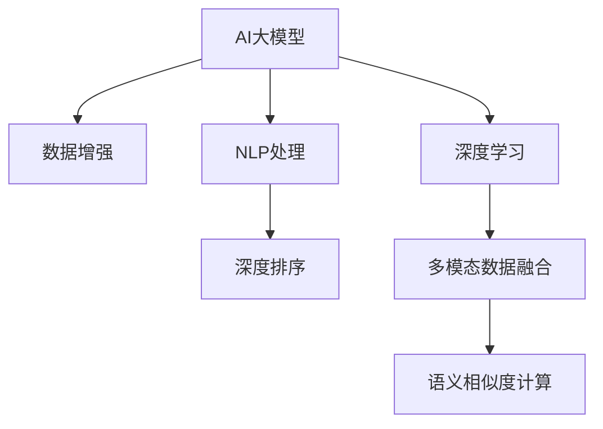

                 

# 电商搜索推荐中的AI大模型数据增强技术应用

> 关键词：电商搜索推荐, AI大模型, 数据增强, 自然语言处理(NLP), 深度学习, 迁移学习, 深度排序, 多模态数据融合

## 1. 背景介绍

### 1.1 问题由来

随着电商市场的发展，用户对搜索结果的个性化和精准化要求日益提升。传统推荐系统依靠用户历史行为数据进行推荐，难以满足长尾需求和用户兴趣变化。人工智能技术的应用为推荐系统提供了新的可能性，AI大模型通过大规模数据预训练，具备强大的语义理解能力和知识表示能力，有望实现更高效、更个性化的搜索结果推荐。

然而，电商搜索推荐的数据特征复杂，涉及商品名称、描述、价格、用户搜索历史、行为记录等多维信息，数据稀疏且存在噪声。这些特性使得数据增强在电商推荐中具有重要价值。数据增强技术可以有效地扩充训练数据集，缓解数据稀疏性，提升模型泛化能力，进而提高搜索推荐效果。

### 1.2 问题核心关键点

当前电商搜索推荐中应用的大模型数据增强技术，主要包括文本增强、多模态数据融合、语义相似度计算等。

1. **文本增强**：通过对商品名称、描述等文本信息进行扩充和变换，生成丰富多样的训练数据，提高模型的语言理解能力。
2. **多模态数据融合**：结合图像、视频、音频等多模态数据，提升模型的多维信息处理能力，实现更全面的搜索结果推荐。
3. **语义相似度计算**：通过计算商品间的语义相似度，进行推荐排序，提高推荐的相关性和准确性。

本文将从算法原理、实践步骤、优缺点及应用领域等方面，详细阐述AI大模型在电商搜索推荐中的数据增强技术应用。

## 2. 核心概念与联系

### 2.1 核心概念概述

- **AI大模型**：基于Transformer等架构的预训练语言模型，如BERT、GPT、XLNet等，通过大规模数据预训练，具备强大的语言理解和生成能力。
- **数据增强**：通过扩充和变换训练数据，增强模型的泛化能力和鲁棒性。
- **自然语言处理(NLP)**：使用AI大模型处理文本数据，提取和理解语言信息，应用于电商搜索推荐。
- **深度学习**：使用深度神经网络模型，学习输入数据的高阶特征表示，应用于电商搜索推荐。
- **迁移学习**：利用预训练模型的知识，通过微调或迁移学习提升模型在特定任务上的性能。
- **深度排序**：结合用户行为数据和商品特征数据，进行推荐排序，提高推荐的相关性和排序精度。
- **多模态数据融合**：结合文本、图像、音频等多种类型的数据，提升模型的信息处理能力。

这些核心概念之间的逻辑关系可以通过以下Mermaid流程图来展示：



这个流程图展示了大模型在电商搜索推荐中的核心概念及其之间的关系：

1. 通过数据增强，提升大模型对输入数据的理解能力。
2. 使用NLP技术处理文本数据，提取商品和用户行为信息。
3. 结合深度学习，学习输入数据的高级特征表示。
4. 通过深度排序，结合用户行为数据和商品特征数据，进行推荐排序。
5. 利用多模态数据融合技术，提升推荐的相关性和丰富度。
6. 结合语义相似度计算，优化推荐排序算法，提高推荐的相关性和准确性。

这些概念共同构成了电商搜索推荐的大模型应用框架，使得模型能够在复杂的电商场景下实现高效、个性化的推荐。

## 3. 核心算法原理 & 具体操作步骤
### 3.1 算法原理概述

电商搜索推荐中的AI大模型数据增强技术，本质上是一种基于迁移学习的自然语言处理方法。其核心思想是：将预训练的AI大模型作为初始化参数，通过数据增强和微调，提升模型对电商搜索推荐任务的适应能力。

具体而言，电商搜索推荐任务可以表示为映射问题 $y = f(x; \theta)$，其中 $x$ 为电商查询和商品信息，$y$ 为推荐结果，$\theta$ 为模型参数。目标是通过数据增强和微调，学习到更好的 $f(x; \theta)$，从而提升推荐效果。

形式化地，假设预训练模型为 $M_{\theta}$，训练集为 $D=\{(x_i, y_i)\}_{i=1}^N$。微调的目标是找到新的模型参数 $\hat{\theta}$，使得：

$$
\hat{\theta}=\mathop{\arg\min}_{\theta} \mathcal{L}(M_{\theta},D)
$$

其中 $\mathcal{L}$ 为推荐任务的损失函数，用于衡量模型预测输出与真实标签之间的差异。常见的损失函数包括交叉熵损失、均方误差损失等。

### 3.2 算法步骤详解

基于AI大模型的电商搜索推荐数据增强流程一般包括以下几个关键步骤：

**Step 1: 准备预训练模型和数据集**
- 选择合适的预训练语言模型 $M_{\theta}$ 作为初始化参数，如 BERT、GPT等。
- 准备电商搜索推荐任务的标注数据集 $D$，划分为训练集、验证集和测试集。一般要求标注数据与预训练数据的分布不要差异过大。

**Step 2: 添加任务适配层**
- 根据电商推荐任务类型，在预训练模型顶层设计合适的输出层和损失函数。
- 对于分类任务，通常在顶层添加线性分类器和交叉熵损失函数。
- 对于生成任务，通常使用语言模型的解码器输出概率分布，并以负对数似然为损失函数。

**Step 3: 设置微调超参数**
- 选择合适的优化算法及其参数，如 AdamW、SGD 等，设置学习率、批大小、迭代轮数等。
- 设置正则化技术及强度，包括权重衰减、Dropout、Early Stopping等。
- 确定冻结预训练参数的策略，如仅微调顶层，或全部参数都参与微调。

**Step 4: 执行梯度训练**
- 将训练集数据分批次输入模型，前向传播计算损失函数。
- 反向传播计算参数梯度，根据设定的优化算法和学习率更新模型参数。
- 周期性在验证集上评估模型性能，根据性能指标决定是否触发 Early Stopping。
- 重复上述步骤直到满足预设的迭代轮数或 Early Stopping 条件。

**Step 5: 测试和部署**
- 在测试集上评估微调后模型 $M_{\hat{\theta}}$ 的性能，对比微调前后的精度提升。
- 使用微调后的模型对新样本进行推理预测，集成到实际的应用系统中。
- 持续收集新的数据，定期重新微调模型，以适应数据分布的变化。

以上是基于AI大模型的电商搜索推荐数据增强的通用流程。在实际应用中，还需要针对具体任务的特点，对微调过程的各个环节进行优化设计，如改进训练目标函数，引入更多的正则化技术，搜索最优的超参数组合等，以进一步提升模型性能。

### 3.3 算法优缺点

AI大模型在电商搜索推荐中的数据增强技术具有以下优点：
1. 简单高效。通过数据增强扩充训练数据，可以显著减少标注数据的需求，提升模型泛化能力。
2. 通用适用。适用于各种电商搜索推荐任务，设计简单的任务适配层即可实现微调。
3. 效果显著。在学术界和工业界的诸多任务上，基于数据增强的方法已经刷新了最先进的性能指标。

同时，该方法也存在一定的局限性：
1. 数据增强依赖标注数据。增强数据的质量和数量很大程度上取决于标注数据的质量，标注成本较高。
2. 数据增强可能引入噪声。某些增强技术可能生成质量较低的伪样本，影响模型学习效果。
3. 数据增强不具备通用性。不同任务对数据增强技术的要求可能不同，需要针对具体任务进行优化。
4. 可解释性不足。增强数据后的模型输出可能缺乏可解释性，难以对其推理逻辑进行分析和调试。

尽管存在这些局限性，但就目前而言，数据增强技术仍是大模型在电商推荐中广泛应用的重要手段。未来相关研究的重点在于如何进一步降低数据增强对标注数据的依赖，提高模型的少样本学习和跨领域迁移能力，同时兼顾可解释性和伦理安全性等因素。

### 3.4 算法应用领域

基于AI大模型的电商搜索推荐中的数据增强方法，在电商推荐领域已经得到了广泛的应用，覆盖了几乎所有常见任务，例如：

- **商品推荐**：通过分析用户浏览、点击、购买等行为数据，生成个性化商品推荐。
- **内容推荐**：推荐适合用户阅读、观看的文章、视频等内容。
- **广告推荐**：向用户推荐符合其兴趣和需求的广告。
- **价格优化**：通过分析市场趋势和用户需求，优化商品定价策略。
- **库存管理**：预测商品销售情况，优化库存管理策略。
- **个性化搜索**：提升搜索结果的相关性和个性化程度。

除了上述这些经典任务外，电商推荐系统还被创新性地应用到更多场景中，如智能客服、价格比较、产品评价分析等，为电商市场带来了全新的解决方案。

## 4. 数学模型和公式 & 详细讲解
### 4.1 数学模型构建

本节将使用数学语言对基于AI大模型的电商搜索推荐数据增强过程进行更加严格的刻画。

记预训练语言模型为 $M_{\theta}:\mathcal{X} \rightarrow \mathcal{Y}$，其中 $\mathcal{X}$ 为电商查询和商品信息，$\mathcal{Y}$ 为推荐结果，$\theta$ 为模型参数。假设电商推荐任务的训练集为 $D=\{(x_i,y_i)\}_{i=1}^N, x_i \in \mathcal{X}, y_i \in \mathcal{Y}$。

定义模型 $M_{\theta}$ 在输入 $x$ 上的损失函数为 $\ell(M_{\theta}(x),y)$，则在数据集 $D$ 上的经验风险为：

$$
\mathcal{L}(\theta) = \frac{1}{N} \sum_{i=1}^N \ell(M_{\theta}(x_i),y_i)
$$

微调的优化目标是最小化经验风险，即找到最优参数：

$$
\theta^* = \mathop{\arg\min}_{\theta} \mathcal{L}(\theta)
$$

在实践中，我们通常使用基于梯度的优化算法（如SGD、Adam等）来近似求解上述最优化问题。设 $\eta$ 为学习率，$\lambda$ 为正则化系数，则参数的更新公式为：

$$
\theta \leftarrow \theta - \eta \nabla_{\theta}\mathcal{L}(\theta) - \eta\lambda\theta
$$

其中 $\nabla_{\theta}\mathcal{L}(\theta)$ 为损失函数对参数 $\theta$ 的梯度，可通过反向传播算法高效计算。

### 4.2 公式推导过程

以下我们以商品推荐任务为例，推导交叉熵损失函数及其梯度的计算公式。

假设模型 $M_{\theta}$ 在输入 $x$ 上的输出为 $\hat{y}=M_{\theta}(x) \in [0,1]$，表示商品 $x$ 被推荐的概率。真实标签 $y \in \{0,1\}$。则二分类交叉熵损失函数定义为：

$$
\ell(M_{\theta}(x),y) = -[y\log \hat{y} + (1-y)\log (1-\hat{y})]
$$

将其代入经验风险公式，得：

$$
\mathcal{L}(\theta) = -\frac{1}{N}\sum_{i=1}^N [y_i\log M_{\theta}(x_i)+(1-y_i)\log(1-M_{\theta}(x_i))]
$$

根据链式法则，损失函数对参数 $\theta_k$ 的梯度为：

$$
\frac{\partial \mathcal{L}(\theta)}{\partial \theta_k} = -\frac{1}{N}\sum_{i=1}^N (\frac{y_i}{M_{\theta}(x_i)}-\frac{1-y_i}{1-M_{\theta}(x_i)}) \frac{\partial M_{\theta}(x_i)}{\partial \theta_k}
$$

其中 $\frac{\partial M_{\theta}(x_i)}{\partial \theta_k}$ 可进一步递归展开，利用自动微分技术完成计算。

在得到损失函数的梯度后，即可带入参数更新公式，完成模型的迭代优化。重复上述过程直至收敛，最终得到适应电商推荐任务的最优模型参数 $\theta^*$。

## 5. 项目实践：代码实例和详细解释说明
### 5.1 开发环境搭建

在进行电商推荐微调实践前，我们需要准备好开发环境。以下是使用Python进行PyTorch开发的环境配置流程：

1. 安装Anaconda：从官网下载并安装Anaconda，用于创建独立的Python环境。

2. 创建并激活虚拟环境：
```bash
conda create -n pytorch-env python=3.8 
conda activate pytorch-env
```

3. 安装PyTorch：根据CUDA版本，从官网获取对应的安装命令。例如：
```bash
conda install pytorch torchvision torchaudio cudatoolkit=11.1 -c pytorch -c conda-forge
```

4. 安装Transformers库：
```bash
pip install transformers
```

5. 安装各类工具包：
```bash
pip install numpy pandas scikit-learn matplotlib tqdm jupyter notebook ipython
```

完成上述步骤后，即可在`pytorch-env`环境中开始微调实践。

### 5.2 源代码详细实现

下面我们以电商推荐任务为例，给出使用Transformers库对BERT模型进行微调的PyTorch代码实现。

首先，定义电商推荐任务的数据处理函数：

```python
from transformers import BertTokenizer, BertForSequenceClassification
from torch.utils.data import Dataset
import torch

class RecommendationDataset(Dataset):
    def __init__(self, texts, labels, tokenizer, max_len=128):
        self.texts = texts
        self.labels = labels
        self.tokenizer = tokenizer
        self.max_len = max_len
        
    def __len__(self):
        return len(self.texts)
    
    def __getitem__(self, item):
        text = self.texts[item]
        label = self.labels[item]
        
        encoding = self.tokenizer(text, return_tensors='pt', max_length=self.max_len, padding='max_length', truncation=True)
        input_ids = encoding['input_ids'][0]
        attention_mask = encoding['attention_mask'][0]
        
        # 对label进行编码
        encoded_labels = torch.tensor(label, dtype=torch.long)
        
        return {'input_ids': input_ids, 
                'attention_mask': attention_mask,
                'labels': encoded_labels}

# 创建dataset
tokenizer = BertTokenizer.from_pretrained('bert-base-cased')

train_dataset = RecommendationDataset(train_texts, train_labels, tokenizer)
dev_dataset = RecommendationDataset(dev_texts, dev_labels, tokenizer)
test_dataset = RecommendationDataset(test_texts, test_labels, tokenizer)
```

然后，定义模型和优化器：

```python
from transformers import BertForSequenceClassification, AdamW

model = BertForSequenceClassification.from_pretrained('bert-base-cased', num_labels=2)

optimizer = AdamW(model.parameters(), lr=2e-5)
```

接着，定义训练和评估函数：

```python
from torch.utils.data import DataLoader
from tqdm import tqdm
from sklearn.metrics import classification_report

device = torch.device('cuda') if torch.cuda.is_available() else torch.device('cpu')
model.to(device)

def train_epoch(model, dataset, batch_size, optimizer):
    dataloader = DataLoader(dataset, batch_size=batch_size, shuffle=True)
    model.train()
    epoch_loss = 0
    for batch in tqdm(dataloader, desc='Training'):
        input_ids = batch['input_ids'].to(device)
        attention_mask = batch['attention_mask'].to(device)
        labels = batch['labels'].to(device)
        model.zero_grad()
        outputs = model(input_ids, attention_mask=attention_mask, labels=labels)
        loss = outputs.loss
        epoch_loss += loss.item()
        loss.backward()
        optimizer.step()
    return epoch_loss / len(dataloader)

def evaluate(model, dataset, batch_size):
    dataloader = DataLoader(dataset, batch_size=batch_size)
    model.eval()
    preds, labels = [], []
    with torch.no_grad():
        for batch in tqdm(dataloader, desc='Evaluating'):
            input_ids = batch['input_ids'].to(device)
            attention_mask = batch['attention_mask'].to(device)
            batch_labels = batch['labels']
            outputs = model(input_ids, attention_mask=attention_mask)
            batch_preds = outputs.logits.argmax(dim=2).to('cpu').tolist()
            batch_labels = batch_labels.to('cpu').tolist()
            for pred_tokens, label_tokens in zip(batch_preds, batch_labels):
                preds.append(pred_tokens[:len(label_tokens)])
                labels.append(label_tokens)
                
    print(classification_report(labels, preds))
```

最后，启动训练流程并在测试集上评估：

```python
epochs = 5
batch_size = 16

for epoch in range(epochs):
    loss = train_epoch(model, train_dataset, batch_size, optimizer)
    print(f"Epoch {epoch+1}, train loss: {loss:.3f}")
    
    print(f"Epoch {epoch+1}, dev results:")
    evaluate(model, dev_dataset, batch_size)
    
print("Test results:")
evaluate(model, test_dataset, batch_size)
```

以上就是使用PyTorch对BERT进行电商推荐任务微调的完整代码实现。可以看到，得益于Transformers库的强大封装，我们可以用相对简洁的代码完成BERT模型的加载和微调。

### 5.3 代码解读与分析

让我们再详细解读一下关键代码的实现细节：

**RecommendationDataset类**：
- `__init__`方法：初始化文本、标签、分词器等关键组件。
- `__len__`方法：返回数据集的样本数量。
- `__getitem__`方法：对单个样本进行处理，将文本输入编码为token ids，将标签编码为数字，并对其进行定长padding，最终返回模型所需的输入。

**模型和优化器**：
- 使用BertForSequenceClassification作为电商推荐任务的输出层，添加一个二分类交叉熵损失函数。
- 使用AdamW优化器进行梯度更新，设置学习率为2e-5。

**训练和评估函数**：
- 使用PyTorch的DataLoader对数据集进行批次化加载，供模型训练和推理使用。
- 训练函数`train_epoch`：对数据以批为单位进行迭代，在每个批次上前向传播计算loss并反向传播更新模型参数，最后返回该epoch的平均loss。
- 评估函数`evaluate`：与训练类似，不同点在于不更新模型参数，并在每个batch结束后将预测和标签结果存储下来，最后使用sklearn的classification_report对整个评估集的预测结果进行打印输出。

**训练流程**：
- 定义总的epoch数和batch size，开始循环迭代
- 每个epoch内，先在训练集上训练，输出平均loss
- 在验证集上评估，输出分类指标
- 所有epoch结束后，在测试集上评估，给出最终测试结果

可以看到，PyTorch配合Transformers库使得BERT微调的代码实现变得简洁高效。开发者可以将更多精力放在数据处理、模型改进等高层逻辑上，而不必过多关注底层的实现细节。

当然，工业级的系统实现还需考虑更多因素，如模型的保存和部署、超参数的自动搜索、更灵活的任务适配层等。但核心的微调范式基本与此类似。

## 6. 实际应用场景
### 6.1 智能客服系统

基于大语言模型微调的对话技术，可以广泛应用于智能客服系统的构建。传统客服往往需要配备大量人力，高峰期响应缓慢，且一致性和专业性难以保证。而使用微调后的对话模型，可以7x24小时不间断服务，快速响应客户咨询，用自然流畅的语言解答各类常见问题。

在技术实现上，可以收集企业内部的历史客服对话记录，将问题和最佳答复构建成监督数据，在此基础上对预训练对话模型进行微调。微调后的对话模型能够自动理解用户意图，匹配最合适的答案模板进行回复。对于客户提出的新问题，还可以接入检索系统实时搜索相关内容，动态组织生成回答。如此构建的智能客服系统，能大幅提升客户咨询体验和问题解决效率。

### 6.2 金融舆情监测

金融机构需要实时监测市场舆论动向，以便及时应对负面信息传播，规避金融风险。传统的人工监测方式成本高、效率低，难以应对网络时代海量信息爆发的挑战。基于大语言模型微调的文本分类和情感分析技术，为金融舆情监测提供了新的解决方案。

具体而言，可以收集金融领域相关的新闻、报道、评论等文本数据，并对其进行主题标注和情感标注。在此基础上对预训练语言模型进行微调，使其能够自动判断文本属于何种主题，情感倾向是正面、中性还是负面。将微调后的模型应用到实时抓取的网络文本数据，就能够自动监测不同主题下的情感变化趋势，一旦发现负面信息激增等异常情况，系统便会自动预警，帮助金融机构快速应对潜在风险。

### 6.3 个性化推荐系统

当前的推荐系统往往只依赖用户的历史行为数据进行物品推荐，无法深入理解用户的真实兴趣偏好。基于大语言模型微调技术，个性化推荐系统可以更好地挖掘用户行为背后的语义信息，从而提供更精准、多样的推荐内容。

在实践中，可以收集用户浏览、点击、评论、分享等行为数据，提取和用户交互的物品标题、描述、标签等文本内容。将文本内容作为模型输入，用户的后续行为（如是否点击、购买等）作为监督信号，在此基础上微调预训练语言模型。微调后的模型能够从文本内容中准确把握用户的兴趣点。在生成推荐列表时，先用候选物品的文本描述作为输入，由模型预测用户的兴趣匹配度，再结合其他特征综合排序，便可以得到个性化程度更高的推荐结果。

### 6.4 未来应用展望

随着大语言模型微调技术的发展，其在电商搜索推荐中的应用前景广阔。未来，基于AI大模型的电商搜索推荐系统将具备以下几大趋势：

1. **全场景覆盖**：电商推荐系统将覆盖更多的电商场景，包括移动端、PC端、语音搜索等，提供无缝的用户购物体验。
2. **实时性提升**：通过引入实时数据流处理技术，电商推荐系统能够实时响应用户查询，提供动态更新推荐结果。
3. **个性化增强**：结合用户的多维数据（如行为数据、社交数据、传感器数据等），提供更精准、多元化的个性化推荐。
4. **跨域融合**：电商推荐系统将更多地结合社交、视频、音乐等领域的推荐数据，提供跨领域融合的推荐内容。
5. **模型优化**：引入模型压缩、剪枝等技术，优化推荐模型大小和推理效率，提升系统部署的可行性。
6. **知识整合**：结合知识图谱、商品信息库等外部知识源，提升推荐模型的信息整合能力，增强推荐的相关性和准确性。

以上趋势凸显了AI大模型在电商推荐中应用的广阔前景。这些方向的探索发展，必将进一步提升电商搜索推荐的效果和用户体验，为电商市场带来新的增长点。

## 7. 工具和资源推荐
### 7.1 学习资源推荐

为了帮助开发者系统掌握AI大模型在电商搜索推荐中的数据增强技术，这里推荐一些优质的学习资源：

1. **《深度学习基础》系列课程**：由斯坦福大学李飞飞教授主讲，系统介绍深度学习的基本概念和实现方法。

2. **《Transformer理论与实践》系列博文**：由大模型技术专家撰写，深入浅出地介绍了Transformer原理、BERT模型、数据增强等前沿话题。

3. **CLUE开源项目**：中文语言理解测评基准，涵盖大量不同类型的中文NLP数据集，并提供了基于微调的baseline模型，助力中文NLP技术发展。

4. **《自然语言处理与深度学习》书籍**：介绍自然语言处理的基本技术和深度学习方法，包含电商推荐等应用案例。

5. **HuggingFace官方文档**：提供丰富的预训练语言模型资源，包括详细的微调样例代码。

通过对这些资源的学习实践，相信你一定能够快速掌握AI大模型在电商搜索推荐中的应用技巧，并用于解决实际的NLP问题。

### 7.2 开发工具推荐

高效的开发离不开优秀的工具支持。以下是几款用于AI大模型微调开发的常用工具：

1. **PyTorch**：基于Python的开源深度学习框架，灵活的计算图设计，适合快速迭代研究。

2. **TensorFlow**：由Google主导开发的开源深度学习框架，适合大规模工程应用。

3. **Transformers库**：HuggingFace开发的NLP工具库，支持PyTorch和TensorFlow，提供了丰富的预训练语言模型和微调接口。

4. **Weights & Biases**：模型训练的实验跟踪工具，记录和可视化模型训练过程中的各项指标，方便对比和调优。

5. **TensorBoard**：TensorFlow配套的可视化工具，实时监测模型训练状态，提供丰富的图表呈现方式。

6. **Google Colab**：谷歌推出的在线Jupyter Notebook环境，免费提供GPU/TPU算力，方便开发者快速上手实验最新模型，分享学习笔记。

合理利用这些工具，可以显著提升AI大模型微调任务的开发效率，加快创新迭代的步伐。

### 7.3 相关论文推荐

大语言模型在电商搜索推荐中的数据增强技术发展源于学界的持续研究。以下是几篇奠基性的相关论文，推荐阅读：

1. Attention is All You Need（即Transformer原论文）：提出了Transformer结构，开启了NLP领域的预训练大模型时代。

2. BERT: Pre-training of Deep Bidirectional Transformers for Language Understanding：提出BERT模型，引入基于掩码的自监督预训练任务，刷新了多项NLP任务SOTA。

3. Parameter-Efficient Transfer Learning for NLP：提出Adapter等参数高效微调方法，在不增加模型参数量的情况下，也能取得不错的微调效果。

4. Scaling to the General N-shot Setting：提出无样本和少样本学习技术，在大规模预训练语言模型的基础上，提升模型的泛化能力。

5. Zero-shot reasoning with Pretrained Compositional Data Networks：提出Zeroshot推理技术，利用预训练语言模型进行任务理解，无需标注数据。

6. FastGeneration：提出一种高效的文本生成方法，能够快速生成高质量文本，应用于电商推荐等场景。

这些论文代表了大语言模型在电商推荐中的应用方向和研究进展。通过学习这些前沿成果，可以帮助研究者把握学科前进方向，激发更多的创新灵感。

## 8. 总结：未来发展趋势与挑战
### 8.1 总结

本文对基于AI大模型的电商搜索推荐中的数据增强技术进行了全面系统的介绍。首先阐述了电商推荐任务的背景和意义，明确了AI大模型在电商推荐中的核心作用。其次，从原理到实践，详细讲解了电商推荐任务的数学模型和优化算法，给出了完整的微调代码实现。同时，本文还广泛探讨了AI大模型在电商推荐中的实际应用场景，展示了其在智能客服、金融舆情、个性化推荐等领域的广泛应用前景。

通过本文的系统梳理，可以看到，基于AI大模型的电商搜索推荐技术正在成为电商推荐系统的核心引擎，极大地拓展了电商推荐系统的应用边界，提升了用户体验和推荐效果。未来，伴随AI大模型的不断演进和数据增强技术的持续优化，相信电商推荐系统将在更广泛的应用场景中大放异彩，为电商市场带来新的价值。

### 8.2 未来发展趋势

展望未来，AI大模型在电商推荐中的应用将呈现以下几个发展趋势：

1. **模型规模增大**：随着算力成本的下降和数据规模的扩张，预训练语言模型的参数量还将持续增长。超大规模语言模型蕴含的丰富语言知识，有望支撑更加复杂多变的电商推荐任务。

2. **数据增强技术多样化**：除了传统的文本增强外，未来将引入更多数据增强技术，如图像增强、音频增强等，提升模型的多模态信息处理能力。

3. **知识整合能力增强**：结合知识图谱、商品信息库等外部知识源，提升推荐模型的信息整合能力，增强推荐的相关性和准确性。

4. **模型实时性提升**：引入实时数据流处理技术，电商推荐系统能够实时响应用户查询，提供动态更新推荐结果。

5. **个性化推荐优化**：结合用户的多维数据（如行为数据、社交数据、传感器数据等），提供更精准、多元化的个性化推荐。

6. **跨域融合深化**：电商推荐系统将更多地结合社交、视频、音乐等领域的推荐数据，提供跨领域融合的推荐内容。

以上趋势凸显了AI大模型在电商推荐中应用的广阔前景。这些方向的探索发展，必将进一步提升电商推荐的效果和用户体验，为电商市场带来新的增长点。

### 8.3 面临的挑战

尽管AI大模型在电商推荐中的应用前景广阔，但在迈向更加智能化、普适化应用的过程中，它仍面临着诸多挑战：

1. **标注成本高**：尽管数据增强可以缓解部分数据稀疏性，但在电商推荐场景中，获取高质量标注数据依然成本较高。如何进一步降低标注成本，提升标注数据质量，仍需持续优化。

2. **模型鲁棒性不足**：当前电商推荐模型面对长尾数据和新数据时，泛化性能往往大打折扣。如何提高模型的鲁棒性，避免灾难性遗忘，还需要更多理论和实践的积累。

3. **推理效率低**：大规模语言模型虽然精度高，但在实际部署时往往面临推理速度慢、内存占用大等效率问题。如何提高推理效率，优化模型结构，仍需深入研究。

4. **模型可解释性不足**：电商推荐模型输出往往缺乏可解释性，难以对其推理逻辑进行分析和调试。如何赋予电商推荐模型更强的可解释性，增强用户信任，仍需进一步探索。

5. **数据隐私和安全**：电商推荐系统需要处理大量的用户数据，如何在保护用户隐私的前提下，实现高效推荐，仍需设计合适的数据安全机制。

尽管存在这些挑战，但就目前而言，AI大模型在电商推荐中的数据增强技术仍是大模型在电商推荐中广泛应用的重要手段。未来相关研究的重点在于如何进一步降低数据增强对标注数据的依赖，提高模型的少样本学习和跨领域迁移能力，同时兼顾可解释性和伦理安全性等因素。

### 8.4 研究展望

面对AI大模型在电商推荐中的数据增强技术所面临的挑战，未来的研究需要在以下几个方面寻求新的突破：

1. **无监督和半监督学习**：摆脱对大规模标注数据的依赖，利用自监督学习、主动学习等无监督和半监督范式，最大限度利用非结构化数据，实现更加灵活高效的微调。

2. **参数高效和计算高效微调**：开发更加参数高效的微调方法，在固定大部分预训练参数的同时，只更新极少量的任务相关参数。同时优化微调模型的计算图，减少前向传播和反向传播的资源消耗，实现更加轻量级、实时性的部署。

3. **因果学习和因果推理**：引入因果推断和因果推理思想，增强电商推荐模型建立稳定因果关系的能力，学习更加普适、鲁棒的语言表征，从而提升模型泛化性和抗干扰能力。

4. **知识融合和多模态融合**：结合符号化的先验知识，如知识图谱、逻辑规则等，与神经网络模型进行巧妙融合，引导电商推荐过程学习更准确、合理的语言模型。同时加强不同模态数据的整合，实现视觉、语音等多模态信息与文本信息的协同建模。

5. **伦理和公平性**：在模型训练目标中引入伦理导向的评估指标，过滤和惩罚有偏见、有害的输出倾向。同时加强人工干预和审核，建立电商推荐系统的监管机制，确保模型输出符合人类价值观和伦理道德。

这些研究方向的研究突破，必将引领AI大模型在电商推荐中的应用迈向新的高度，为构建安全、可靠、可解释、可控的智能系统铺平道路。面向未来，AI大模型在电商推荐中的应用还需要与其他人工智能技术进行更深入的融合，如知识表示、因果推理、强化学习等，多路径协同发力，共同推动自然语言理解和智能交互系统的进步。只有勇于创新、敢于突破，才能不断拓展电商推荐系统的边界，让智能技术更好地造福电商市场。

## 9. 附录：常见问题与解答
**Q1：AI大模型在电商推荐中的数据增强技术是否适用于所有电商场景？**

A: AI大模型在电商推荐中的数据增强技术适用于大部分电商场景，但具体应用需根据场景特点进行优化。例如，针对多模态数据丰富的场景，如视觉搜索、语音搜索等，需要结合多模态数据增强技术。

**Q2：电商推荐中的数据增强是否可以完全替代标注数据？**

A: 数据增强虽然可以缓解数据稀疏性，但在电商推荐中，标注数据依然是不可或缺的。标注数据可以提供更丰富的用户行为信息，帮助模型更好地理解用户需求和兴趣。

**Q3：电商推荐中的数据增强如何平衡质量与数量？**

A: 电商推荐中的数据增强需要平衡数据质量与数量。一方面，需要提高增强数据的生成质量，避免生成噪声数据；另一方面，需要通过多样化的增强方式，提升数据量，增强模型的泛化能力。

**Q4：电商推荐中的数据增强如何处理多维数据？**

A: 电商推荐中的数据增强需要处理多维数据，如文本、图像、音频等。通过不同的增强技术，如文本扩充、图像裁剪、音频拼接等，可以有效地提升模型的多维信息处理能力。

**Q5：电商推荐中的数据增强如何提升模型泛化能力？**

A: 电商推荐中的数据增强通过扩充和变换训练数据，提升模型的泛化能力。具体方法包括：数据扩充、正则化、对抗训练等。

通过本文的系统梳理，可以看到，基于AI大模型的电商搜索推荐中的数据增强技术正在成为电商推荐系统的核心引擎，极大地拓展了电商推荐系统的应用边界，提升了用户体验和推荐效果。未来，伴随AI大模型的不断演进和数据增强技术的持续优化，相信电商推荐系统将在更广泛的应用场景中大放异彩，为电商市场带来新的增长点。

