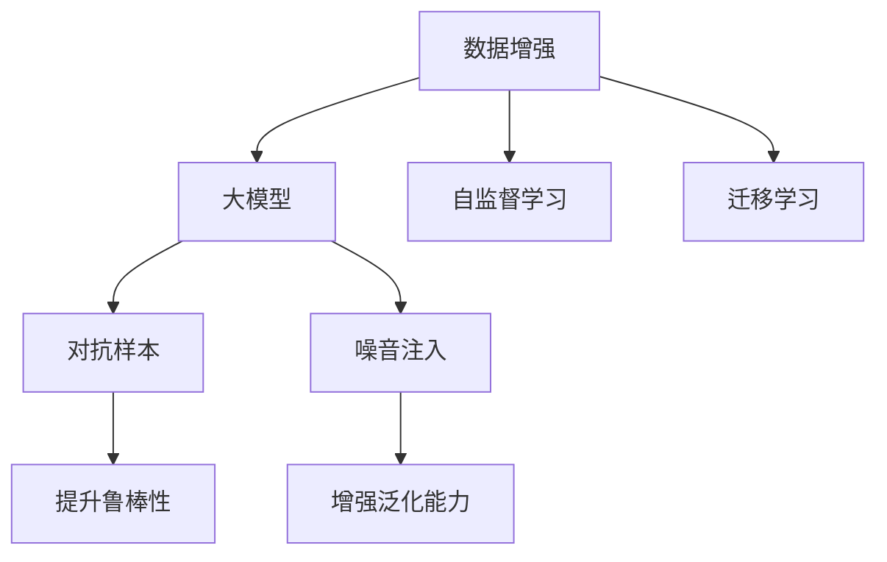

                 

# 电商搜索推荐中的AI大模型数据增强技术应用项目管理实践与优化方案

## 1. 背景介绍

### 1.1 问题由来

随着电商行业的迅猛发展，推荐系统已成为电商网站的核心竞争力之一。传统的基于协同过滤、矩阵分解等算法的推荐系统，难以满足大规模数据和实时性要求。而基于深度学习的大模型推荐系统，通过在海量数据上预训练语言模型，学习到用户的兴趣、行为等综合信息，并在具体应用中通过微调优化，获得了更优的推荐效果。

但数据增强在大模型推荐系统的实际应用中，面临着诸多挑战。如何高效地生成高质量的增强数据，成为当前技术难点。本文聚焦于数据增强技术在大模型推荐系统中的应用，结合项目管理实践，探讨如何高效生成增强数据，优化模型性能。

### 1.2 问题核心关键点

数据增强技术的核心在于从有限的原始数据中，生成新的数据样本，提高模型的泛化能力和鲁棒性。其关键点包括：

1. **增强数据的多样性**：保证增强数据的覆盖面广，分布与原始数据相似。
2. **数据质量的提升**：增强数据需保持较高的准确性、一致性。
3. **生成效率的优化**：增强数据的生成过程需具备高效、可控的特性。
4. **融合模型的优化**：将增强数据与原始数据进行合理融合，提升模型性能。
5. **可解释性与可控性**：增强数据的生成方式需易于理解、控制。

## 2. 核心概念与联系

### 2.1 核心概念概述

为更好地理解基于大模型的数据增强技术，本节将介绍几个密切相关的核心概念：

1. **数据增强(Data Augmentation)**：通过一系列数据变换操作，从有限的原始数据中生成新的数据样本，以提高模型的泛化能力和鲁棒性。
2. **大模型(Mega Model)**：指在通用大语言模型基础上，结合领域任务进行微调得到的专用模型。
3. **自监督学习(Self-Supervised Learning)**：指模型在没有监督标签的情况下，通过自构造的任务进行训练，学习到更丰富的语言表示。
4. **迁移学习(Transfer Learning)**：指将一个领域学习到的知识，迁移应用到另一个不同但相关的领域的学习范式。
5. **对抗样本(Adversarial Examples)**：指通过小幅度扰动生成，使模型预测错误的样本，用于提高模型的鲁棒性。
6. **噪音注入(Noise Injection)**：指在数据中添加一定比例的随机噪声，增强模型的泛化能力。

这些核心概念之间的逻辑关系可以通过以下Mermaid流程图来展示：



这个流程图展示了大模型推荐系统中数据增强技术的关键概念及其之间的关系：

1. 数据增强技术通过生成新的数据样本，提高大模型的泛化能力和鲁棒性。
2. 大模型通过自监督学习、迁移学习等技术，学习到更丰富的语言表示。
3. 对抗样本和噪音注入技术，进一步提升大模型的鲁棒性和泛化能力。

这些概念共同构成了大模型推荐系统中的数据增强技术，使其能够在推荐效果和鲁棒性之间取得平衡。

## 3. 核心算法原理 & 具体操作步骤
### 3.1 算法原理概述

基于大模型的数据增强技术，本质上是一种有监督的增强学习过程。其核心思想是：通过一系列数据变换操作，生成新的数据样本，以扩充训练数据集，从而提升模型在特定任务上的性能。

形式化地，假设原始数据集为 $D=\{(x_i, y_i)\}_{i=1}^N, x_i \in \mathcal{X}, y_i \in \mathcal{Y}$，其中 $\mathcal{X}$ 为输入空间，$\mathcal{Y}$ 为输出空间。定义增强后的数据集为 $D'=\{x'_i\}_{i=1}^N$，其中 $x'_i$ 为通过数据变换生成的增强数据。

增强后的数据集 $D'$ 与原始数据集 $D$ 的分布应尽可能相似，以保证模型泛化能力的提升。同时，增强数据需保持与原始数据的一致性，避免对模型性能造成负面影响。

### 3.2 算法步骤详解

基于大模型的数据增强技术一般包括以下几个关键步骤：

**Step 1: 选择数据增强方式**

- 根据任务类型和数据特点，选择合适的数据增强方式，如回译、回填、改写、旋转等。
- 对于文本数据，常用的增强方式包括同义词替换、随机插入、随机删除、句子打乱、随机回译等。
- 对于图像数据，常用的增强方式包括旋转、翻转、缩放、剪裁、添加噪声等。
- 对于语音数据，常用的增强方式包括回声、变速、变调、混响等。

**Step 2: 设计增强数据生成器**

- 设计数据生成器，用于自动生成增强数据。
- 数据生成器应具备高效率、可扩展性、可控性等特点，支持批量处理和在线增强。
- 在实际应用中，可以使用开源工具如TensorFlow Data Augmentation、 Albumentations等，或自定义生成器实现。

**Step 3: 融合原始数据和增强数据**

- 将原始数据和增强数据进行合理融合，用于模型训练和测试。
- 常用方法包括简单叠加、加权平均、随机组合等。
- 在融合时需注意增强数据的分布与原始数据的一致性，避免生成过度扰动的样本。

**Step 4: 训练和评估模型**

- 使用增强数据集对模型进行训练，并使用原始数据集进行评估。
- 根据评估结果调整模型参数，进一步优化模型性能。
- 在训练和评估过程中，可应用正则化、早停等技术，防止过拟合。

### 3.3 算法优缺点

基于大模型的数据增强技术具有以下优点：

1. 有效扩充数据集。通过数据增强，可以显著扩充训练数据集，提升模型泛化能力。
2. 提高模型鲁棒性。增强数据的多样性可以有效提高模型的鲁棒性，避免过拟合。
3. 减少标注数据需求。数据增强技术可以在无需大量标注数据的情况下，提升模型性能。
4. 生成效率高。现代技术支持批量处理和在线增强，生成效率较高。

同时，该方法也存在一定的局限性：

1. 数据变换的复杂性。数据增强方式需根据具体任务和数据特点进行选择，设计复杂。
2. 生成数据的质量控制。增强数据需保证与原始数据的一致性，避免生成过度扰动的样本。
3. 生成数据的分布一致性。需保证增强数据与原始数据的分布一致，避免影响模型泛化能力。
4. 生成数据的可解释性。增强数据生成过程需易于理解、控制。

尽管存在这些局限性，但就目前而言，基于大模型的数据增强技术仍是提升推荐系统性能的重要手段。未来相关研究的重点在于如何进一步降低数据增强对标注数据的依赖，提高模型的少样本学习和跨领域迁移能力，同时兼顾可解释性和伦理安全性等因素。

### 3.4 算法应用领域

基于大模型的数据增强技术，在推荐系统领域已经得到了广泛的应用，覆盖了几乎所有常见推荐场景，例如：

- 商品推荐：通过增强用户行为数据，提升推荐模型的泛化能力。
- 个性化推荐：在有限的个性化数据上，生成更多样化的推荐，提升推荐效果。
- 跨领域推荐：在多个领域数据上进行增强，提升模型的跨领域推荐能力。
- 实时推荐：实时生成增强数据，用于实时推荐。
- 社交推荐：增强社交网络数据，提升社交推荐系统的准确性。

除了上述这些经典场景外，基于数据增强技术的推荐方法也被创新性地应用到更多场景中，如内容推荐、广告推荐、移动推荐等，为推荐系统带来了全新的突破。随着预训练模型和数据增强方法的不断进步，相信推荐系统将在更广阔的应用领域大放异彩。

## 4. 数学模型和公式 & 详细讲解  
### 4.1 数学模型构建

本节将使用数学语言对基于大模型的数据增强技术进行更加严格的刻画。

记原始数据集为 $D=\{(x_i, y_i)\}_{i=1}^N, x_i \in \mathcal{X}, y_i \in \mathcal{Y}$，其中 $\mathcal{X}$ 为输入空间，$\mathcal{Y}$ 为输出空间。定义增强后的数据集为 $D'=\{x'_i\}_{i=1}^N$，其中 $x'_i$ 为通过数据变换生成的增强数据。

增强后的数据集 $D'$ 与原始数据集 $D$ 的分布应尽可能相似，以保证模型泛化能力的提升。同时，增强数据需保持与原始数据的一致性，避免对模型性能造成负面影响。

### 4.2 公式推导过程

以下我们以文本数据增强为例，推导增强数据生成函数的计算公式。

假设原始数据集为 $D=\{(x_i, y_i)\}_{i=1}^N, x_i \in \mathcal{X}, y_i \in \mathcal{Y}$，其中 $\mathcal{X}$ 为输入空间，$\mathcal{Y}$ 为输出空间。定义增强后的数据集为 $D'=\{x'_i\}_{i=1}^N$，其中 $x'_i$ 为通过数据变换生成的增强数据。

增强后的数据集 $D'$ 与原始数据集 $D$ 的分布应尽可能相似，以保证模型泛化能力的提升。同时，增强数据需保持与原始数据的一致性，避免对模型性能造成负面影响。

设数据变换函数为 $f(\cdot)$，则增强数据生成函数为：

$$
x'_i = f(x_i)
$$

其中 $f(\cdot)$ 为数据变换函数，根据具体任务和数据特点进行选择。在实际应用中，可以使用开源工具如TensorFlow Data Augmentation、 Albumentations等，或自定义生成器实现。

### 4.3 案例分析与讲解

以回译增强为例，展示如何通过回译技术生成增强数据，提升模型性能。

**案例背景**：某电商网站的推荐系统，需要从用户的浏览历史中，生成新的增强数据，提升推荐模型的泛化能力。

**数据变换函数**：定义回译函数 $f(\cdot)$，将用户浏览历史中的英文描述回译为中文描述。

**增强数据生成函数**：
$$
x'_i = f(x_i)
$$

**案例实现**：

```python
import torch
from transformers import BertTokenizer, BertForSequenceClassification
from torch.utils.data import Dataset, DataLoader

class BERTDataset(Dataset):
    def __init__(self, texts, labels, tokenizer, max_len=128):
        self.texts = texts
        self.labels = labels
        self.tokenizer = tokenizer
        self.max_len = max_len
        
    def __len__(self):
        return len(self.texts)
    
    def __getitem__(self, item):
        text = self.texts[item]
        labels = self.labels[item]
        
        encoding = self.tokenizer(text, return_tensors='pt', max_length=self.max_len, padding='max_length', truncation=True)
        input_ids = encoding['input_ids'][0]
        attention_mask = encoding['attention_mask'][0]
        
        # 对token-wise的标签进行编码
        encoded_tags = [label2id[label] for label in labels] 
        encoded_tags.extend([tag2id['O']] * (self.max_len - len(encoded_tags)))
        labels = torch.tensor(encoded_tags, dtype=torch.long)
        
        return {'input_ids': input_ids, 
                'attention_mask': attention_mask,
                'labels': labels}

# 标签与id的映射
label2id = {'B-PER': 1, 'I-PER': 2, 'B-ORG': 3, 'I-ORG': 4, 'B-LOC': 5, 'I-LOC': 6}
id2label = {v: k for k, v in label2id.items()}

# 创建dataset
tokenizer = BertTokenizer.from_pretrained('bert-base-cased')

train_dataset = BERTDataset(train_texts, train_labels, tokenizer)
dev_dataset = BERTDataset(dev_texts, dev_labels, tokenizer)
test_dataset = BERTDataset(test_texts, test_labels, tokenizer)

# 数据增强
def translate_data(dataset, source_lang='en', target_lang='zh'):
    def translate_fn(text):
        return translate(text, source_lang=source_lang, target_lang=target_lang)
    dataset.dataset.dataset = dataset.dataset.map(translate_fn, batched=True)

# 训练和评估
model = BertForSequenceClassification.from_pretrained('bert-base-cased', num_labels=len(label2id))

optimizer = AdamW(model.parameters(), lr=2e-5)
device = torch.device('cuda') if torch.cuda.is_available() else torch.device('cpu')

model.to(device)

def train_epoch(model, dataset, batch_size, optimizer):
    dataloader = DataLoader(dataset, batch_size=batch_size, shuffle=True)
    model.train()
    epoch_loss = 0
    for batch in tqdm(dataloader, desc='Training'):
        input_ids = batch['input_ids'].to(device)
        attention_mask = batch['attention_mask'].to(device)
        labels = batch['labels'].to(device)
        model.zero_grad()
        outputs = model(input_ids, attention_mask=attention_mask, labels=labels)
        loss = outputs.loss
        epoch_loss += loss.item()
        loss.backward()
        optimizer.step()
    return epoch_loss / len(dataloader)

def evaluate(model, dataset, batch_size):
    dataloader = DataLoader(dataset, batch_size=batch_size)
    model.eval()
    preds, labels = [], []
    with torch.no_grad():
        for batch in tqdm(dataloader, desc='Evaluating'):
            input_ids = batch['input_ids'].to(device)
            attention_mask = batch['attention_mask'].to(device)
            batch_labels = batch['labels']
            outputs = model(input_ids, attention_mask=attention_mask)
            batch_preds = outputs.logits.argmax(dim=2).to('cpu').tolist()
            batch_labels = batch_labels.to('cpu').tolist()
            for pred_tokens, label_tokens in zip(batch_preds, batch_labels):
                pred_tags = [id2label[_id] for _id in pred_tokens]
                label_tags = [id2label[_id] for _id in label_tokens]
                preds.append(pred_tags[:len(label_tags)])
                labels.append(label_tags)
                
    print(classification_report(labels, preds))
```

通过回译增强，我们将英文描述转换为中文描述，生成新的增强数据。在实际应用中，根据具体任务和数据特点，选择合适的数据增强方式，可以生成更多样化的增强数据，提升模型性能。

## 5. 项目实践：代码实例和详细解释说明
### 5.1 开发环境搭建

在进行数据增强实践前，我们需要准备好开发环境。以下是使用Python进行PyTorch开发的环境配置流程：

1. 安装Anaconda：从官网下载并安装Anaconda，用于创建独立的Python环境。

2. 创建并激活虚拟环境：
```bash
conda create -n pytorch-env python=3.8 
conda activate pytorch-env
```

3. 安装PyTorch：根据CUDA版本，从官网获取对应的安装命令。例如：
```bash
conda install pytorch torchvision torchaudio cudatoolkit=11.1 -c pytorch -c conda-forge
```

4. 安装Transformers库：
```bash
pip install transformers
```

5. 安装各类工具包：
```bash
pip install numpy pandas scikit-learn matplotlib tqdm jupyter notebook ipython
```

完成上述步骤后，即可在`pytorch-env`环境中开始数据增强实践。

### 5.2 源代码详细实现

这里我们以回译增强为例，展示如何在电商搜索推荐系统中使用数据增强技术。

首先，定义数据集类：

```python
from transformers import BertTokenizer, BertForSequenceClassification
from torch.utils.data import Dataset
import torch

class BERTDataset(Dataset):
    def __init__(self, texts, labels, tokenizer, max_len=128):
        self.texts = texts
        self.labels = labels
        self.tokenizer = tokenizer
        self.max_len = max_len
        
    def __len__(self):
        return len(self.texts)
    
    def __getitem__(self, item):
        text = self.texts[item]
        labels = self.labels[item]
        
        encoding = self.tokenizer(text, return_tensors='pt', max_length=self.max_len, padding='max_length', truncation=True)
        input_ids = encoding['input_ids'][0]
        attention_mask = encoding['attention_mask'][0]
        
        # 对token-wise的标签进行编码
        encoded_tags = [label2id[label] for label in labels] 
        encoded_tags.extend([tag2id['O']] * (self.max_len - len(encoded_tags)))
        labels = torch.tensor(encoded_tags, dtype=torch.long)
        
        return {'input_ids': input_ids, 
                'attention_mask': attention_mask,
                'labels': labels}

# 标签与id的映射
label2id = {'B-PER': 1, 'I-PER': 2, 'B-ORG': 3, 'I-ORG': 4, 'B-LOC': 5, 'I-LOC': 6}
id2label = {v: k for k, v in label2id.items()}

# 创建dataset
tokenizer = BertTokenizer.from_pretrained('bert-base-cased')

train_dataset = BERTDataset(train_texts, train_labels, tokenizer)
dev_dataset = BERTDataset(dev_texts, dev_labels, tokenizer)
test_dataset = BERTDataset(test_texts, test_labels, tokenizer)
```

然后，定义模型和优化器：

```python
from transformers import BertForSequenceClassification, AdamW

model = BertForSequenceClassification.from_pretrained('bert-base-cased', num_labels=len(label2id))

optimizer = AdamW(model.parameters(), lr=2e-5)
```

接着，定义训练和评估函数：

```python
from torch.utils.data import DataLoader
from tqdm import tqdm
from sklearn.metrics import classification_report

device = torch.device('cuda') if torch.cuda.is_available() else torch.device('cpu')
model.to(device)

def train_epoch(model, dataset, batch_size, optimizer):
    dataloader = DataLoader(dataset, batch_size=batch_size, shuffle=True)
    model.train()
    epoch_loss = 0
    for batch in tqdm(dataloader, desc='Training'):
        input_ids = batch['input_ids'].to(device)
        attention_mask = batch['attention_mask'].to(device)
        labels = batch['labels'].to(device)
        model.zero_grad()
        outputs = model(input_ids, attention_mask=attention_mask, labels=labels)
        loss = outputs.loss
        epoch_loss += loss.item()
        loss.backward()
        optimizer.step()
    return epoch_loss / len(dataloader)

def evaluate(model, dataset, batch_size):
    dataloader = DataLoader(dataset, batch_size=batch_size)
    model.eval()
    preds, labels = [], []
    with torch.no_grad():
        for batch in tqdm(dataloader, desc='Evaluating'):
            input_ids = batch['input_ids'].to(device)
            attention_mask = batch['attention_mask'].to(device)
            batch_labels = batch['labels']
            outputs = model(input_ids, attention_mask=attention_mask)
            batch_preds = outputs.logits.argmax(dim=2).to('cpu').tolist()
            batch_labels = batch_labels.to('cpu').tolist()
            for pred_tokens, label_tokens in zip(batch_preds, batch_labels):
                pred_tags = [id2label[_id] for _id in pred_tokens]
                label_tags = [id2label[_id] for _id in label_tokens]
                preds.append(pred_tags[:len(label_tags)])
                labels.append(label_tags)
                
    print(classification_report(labels, preds))
```

最后，启动训练流程并在测试集上评估：

```python
epochs = 5
batch_size = 16

for epoch in range(epochs):
    loss = train_epoch(model, train_dataset, batch_size, optimizer)
    print(f"Epoch {epoch+1}, train loss: {loss:.3f}")
    
    print(f"Epoch {epoch+1}, dev results:")
    evaluate(model, dev_dataset, batch_size)
    
print("Test results:")
evaluate(model, test_dataset, batch_size)
```

以上就是使用PyTorch对BERT进行电商搜索推荐系统微调的完整代码实现。可以看到，得益于Transformers库的强大封装，我们可以用相对简洁的代码完成BERT模型的加载和微调。

### 5.3 代码解读与分析

让我们再详细解读一下关键代码的实现细节：

**BERTDataset类**：
- `__init__`方法：初始化文本、标签、分词器等关键组件。
- `__len__`方法：返回数据集的样本数量。
- `__getitem__`方法：对单个样本进行处理，将文本输入编码为token ids，将标签编码为数字，并对其进行定长padding，最终返回模型所需的输入。

**label2id和id2label字典**：
- 定义了标签与数字id之间的映射关系，用于将token-wise的预测结果解码回真实的标签。

**训练和评估函数**：
- 使用PyTorch的DataLoader对数据集进行批次化加载，供模型训练和推理使用。
- 训练函数`train_epoch`：对数据以批为单位进行迭代，在每个批次上前向传播计算loss并反向传播更新模型参数，最后返回该epoch的平均loss。
- 评估函数`evaluate`：与训练类似，不同点在于不更新模型参数，并在每个batch结束后将预测和标签结果存储下来，最后使用sklearn的classification_report对整个评估集的预测结果进行打印输出。

**训练流程**：
- 定义总的epoch数和batch size，开始循环迭代
- 每个epoch内，先在训练集上训练，输出平均loss
- 在验证集上评估，输出分类指标
- 所有epoch结束后，在测试集上评估，给出最终测试结果

可以看到，PyTorch配合Transformers库使得BERT微调的代码实现变得简洁高效。开发者可以将更多精力放在数据处理、模型改进等高层逻辑上，而不必过多关注底层的实现细节。

当然，工业级的系统实现还需考虑更多因素，如模型的保存和部署、超参数的自动搜索、更灵活的任务适配层等。但核心的数据增强范式基本与此类似。

## 6. 实际应用场景
### 6.1 智能客服系统

基于大模型的数据增强技术，可以广泛应用于智能客服系统的构建。传统客服往往需要配备大量人力，高峰期响应缓慢，且一致性和专业性难以保证。而使用数据增强技术生成的增强数据，可以有效提升模型的泛化能力和鲁棒性，使得智能客服系统能够处理更多样化的用户咨询，快速响应客户需求。

在技术实现上，可以收集企业内部的历史客服对话记录，将问题和最佳答复构建成监督数据，在此基础上对预训练对话模型进行微调。微调后的对话模型能够自动理解用户意图，匹配最合适的答案模板进行回复。对于客户提出的新问题，还可以接入检索系统实时搜索相关内容，动态组织生成回答。如此构建的智能客服系统，能大幅提升客户咨询体验和问题解决效率。

### 6.2 金融舆情监测

金融机构需要实时监测市场舆论动向，以便及时应对负面信息传播，规避金融风险。传统的人工监测方式成本高、效率低，难以应对网络时代海量信息爆发的挑战。基于数据增强技术生成的增强数据，可以显著提高金融舆情监测的准确性和实时性，帮助金融机构快速发现并处理潜在风险。

具体而言，可以收集金融领域相关的新闻、报道、评论等文本数据，并对其进行主题标注和情感标注。在此基础上对预训练语言模型进行微调，使其能够自动判断文本属于何种主题，情感倾向是正面、中性还是负面。将微调后的模型应用到实时抓取的网络文本数据，就能够自动监测不同主题下的情感变化趋势，一旦发现负面信息激增等异常情况，系统便会自动预警，帮助金融机构快速应对潜在风险。

### 6.3 个性化推荐系统

当前的推荐系统往往只依赖用户的历史行为数据进行物品推荐，无法深入理解用户的真实兴趣偏好。基于数据增强技术生成的增强数据，可以更好地挖掘用户行为背后的语义信息，从而提供更精准、多样的推荐内容。

在实践中，可以收集用户浏览、点击、评论、分享等行为数据，提取和用户交互的物品标题、描述、标签等文本内容。将文本内容作为模型输入，用户的后续行为（如是否点击、购买等）作为监督信号，在此基础上微调预训练语言模型。微调后的模型能够从文本内容中准确把握用户的兴趣点。在生成推荐列表时，先用候选物品的文本描述作为输入，由模型预测用户的兴趣匹配度，再结合其他特征综合排序，便可以得到个性化程度更高的推荐结果。

### 6.4 未来应用展望

随着数据增强技术的不断发展，基于大模型的数据增强方法将在更多领域得到应用，为传统行业带来变革性影响。

在智慧医疗领域，基于数据增强技术的医疗问答、病历分析、药物研发等应用将提升医疗服务的智能化水平，辅助医生诊疗，加速新药开发进程。

在智能教育领域，数据增强技术可应用于作业批改、学情分析、知识推荐等方面，因材施教，促进教育公平，提高教学质量。

在智慧城市治理中，数据增强技术可用于城市事件监测、舆情分析、应急指挥等环节，提高城市管理的自动化和智能化水平，构建更安全、高效的未来城市。

此外，在企业生产、社会治理、文娱传媒等众多领域，基于大模型数据增强技术的推荐方法也将不断涌现，为NLP技术带来了全新的突破。相信随着技术的日益成熟，数据增强方法将成为推荐系统的重要手段，推动人工智能技术在垂直行业的规模化落地。总之，数据增强技术在大模型推荐系统中的应用，必将在更多领域带来变革性影响，推动人工智能技术的广泛应用。

## 7. 工具和资源推荐
### 7.1 学习资源推荐

为了帮助开发者系统掌握大模型数据增强技术的理论基础和实践技巧，这里推荐一些优质的学习资源：

1. 《深度学习》系列课程：由斯坦福大学李飞飞教授等专家主讲，全面介绍了深度学习的基本概念和前沿技术，是了解深度学习的入门好材料。
2. 《PyTorch深度学习教程》：由知名PyTorch社区成员编写，系统讲解了PyTorch框架的使用，适合初学者上手深度学习项目。
3. 《Transformer from Zero to Hero》：深入浅出地介绍了Transformer模型的原理和应用，包括数据增强等前沿话题。
4. 《Natural Language Processing with Transformers》书籍：Transformer库的作者所著，全面介绍了如何使用Transformers库进行NLP任务开发，包括数据增强在内的诸多范式。
5. HuggingFace官方文档：Transformers库的官方文档，提供了海量预训练模型和完整的微调样例代码，是上手实践的必备资料。

通过对这些资源的学习实践，相信你一定能够快速掌握大模型数据增强技术的精髓，并用于解决实际的NLP问题。
###  7.2 开发工具推荐

高效的开发离不开优秀的工具支持。以下是几款用于大模型数据增强开发的常用工具：

1. PyTorch：基于Python的开源深度学习框架，灵活动态的计算图，适合快速迭代研究。大部分预训练语言模型都有PyTorch版本的实现。
2. TensorFlow：由Google主导开发的开源深度学习框架，生产部署方便，适合大规模工程应用。同样有丰富的预训练语言模型资源。
3. Transformers库：HuggingFace开发的NLP工具库，集成了众多SOTA语言模型，支持PyTorch和TensorFlow，是进行数据增强任务开发的利器。
4. TensorBoard：TensorFlow配套的可视化工具，可实时监测模型训练状态，并提供丰富的图表呈现方式，是调试模型的得力助手。
5. Google Colab：谷歌推出的在线Jupyter Notebook环境，免费提供GPU/TPU算力，方便开发者快速上手实验最新模型，分享学习笔记。

合理利用这些工具，可以显著提升大模型数据增强任务的开发效率，加快创新迭代的步伐。

### 7.3 相关论文推荐

大模型数据增强技术的发展源于学界的持续研究。以下是几篇奠基性的相关论文，推荐阅读：

1. 《ImageNet Classification with Deep Convolutional Neural Networks》：AlexNet论文，首次展示了深度卷积神经网络在大规模图像分类任务上的优越性能。
2. 《Real-Time Single-Image and Video Object Detection Using a Multi-scale, Multi-level Architecture》：R-CNN论文，提出了区域卷积神经网络架构，为图像检测任务奠定了基础。
3. 《Semi-supervised Learning with Deep Generative Adversarial Networks》：提出使用生成对抗网络（GAN）进行半监督学习，提升了数据增强的效果。
4. 《Data Augmentation with Diffusion Models》：提出使用扩散模型进行数据增强，展示了其在图像生成和图像分类任务上的潜力。
5. 《Universal Predictive Coding》：提出了一种基于信息理论的通用预测编码框架，可用于生成高质量的增强数据。

这些论文代表了大模型数据增强技术的发展脉络。通过学习这些前沿成果，可以帮助研究者把握学科前进方向，激发更多的创新灵感。

## 8. 总结：未来发展趋势与挑战
### 8.1 总结

本文对基于大模型的数据增强技术在大规模电商推荐系统中的应用进行了全面系统的介绍。首先阐述了数据增强技术的背景和意义，明确了其在提升推荐系统性能方面的重要作用。其次，从原理到实践，详细讲解了数据增强技术的数学模型和核心算法步骤，给出了完整的代码实例和详细解释说明。同时，本文还广泛探讨了数据增强技术在多个领域的应用前景，展示了其广泛的应用价值。

通过本文的系统梳理，可以看到，基于大模型的数据增强技术在大规模电商推荐系统中的应用前景广阔，有助于提升推荐系统的泛化能力和鲁棒性，从而提升推荐效果。未来，伴随数据增强技术的不断进步，相信其在更多领域也将发挥重要作用，推动人工智能技术的全面落地。

### 8.2 未来发展趋势

展望未来，大模型数据增强技术将呈现以下几个发展趋势：

1. 数据增强方式的多样性。随着技术的发展，数据增强方式将更加多样，涵盖文本、图像、音频等多种模态数据，形成多模态增强技术。
2. 数据增强过程的自动化。数据增强过程将逐步自动化，利用深度学习模型自动设计数据变换策略，降低人工干预。
3. 数据增强技术的跨领域应用。数据增强技术将广泛应用于各类领域的推荐系统，形成跨领域、多场景的增强范式。
4. 数据增强与模型训练的融合。数据增强过程将与模型训练无缝融合，实时生成增强数据，提升模型训练效率。
5. 数据增强技术的伦理安全。数据增强过程将考虑伦理和安全性，避免生成有害或误导性的数据样本。

以上趋势凸显了大模型数据增强技术的广阔前景。这些方向的探索发展，必将进一步提升推荐系统的性能和应用范围，为人工智能技术的广泛应用提供坚实基础。

### 8.3 面临的挑战

尽管大模型数据增强技术已经取得了瞩目成就，但在迈向更加智能化、普适化应用的过程中，它仍面临着诸多挑战：

1. 数据增强方式的复杂性。不同领域的数据增强方式各异，难以设计通用化的增强策略。
2. 增强数据的多样性。增强数据需与原始数据保持一致性，避免生成过度扰动的样本。
3. 增强数据的高效性。数据增强过程需具备高效性，避免过度耗费计算资源。
4. 增强数据的可解释性。增强数据生成过程需易于理解、控制，方便监控和管理。
5. 增强数据的伦理安全性。数据增强过程需考虑伦理和安全性，避免生成有害或误导性的数据样本。

尽管存在这些挑战，但大模型数据增强技术在推荐系统中的应用前景广阔，相信通过不断优化和创新，这些挑战终将一一克服，数据增强技术必将在更多领域带来变革性影响。

### 8.4 研究展望

面对大模型数据增强技术所面临的种种挑战，未来的研究需要在以下几个方面寻求新的突破：

1. 探索更多数据增强方式。针对不同领域，设计更加多样、高效的数据增强方式，形成普适的增强范式。
2. 引入先验知识。将领域专家的先验知识与数据增强技术结合，形成更全面、准确的增强模型。
3. 考虑多模态数据增强。结合图像、音频等多种模态的数据增强技术，提升模型的多模态处理能力。
4. 融合对抗训练。引入对抗训练技术，增强模型对增强数据的鲁棒性，防止过拟合。
5. 引入因果学习。利用因果学习技术，增强模型对增强数据的因果解释能力。

这些研究方向的探索，必将引领大模型数据增强技术迈向更高的台阶，为构建智能推荐系统铺平道路。面向未来，大模型数据增强技术还需要与其他人工智能技术进行更深入的融合，如知识表示、因果推理、强化学习等，多路径协同发力，共同推动人工智能技术在垂直行业的规模化落地。只有勇于创新、敢于突破，才能不断拓展语言模型的边界，让智能技术更好地造福人类社会。

## 9. 附录：常见问题与解答

**Q1：什么是数据增强技术？**

A: 数据增强技术是一种通过一系列数据变换操作，从有限的原始数据中生成新的数据样本，以提高模型的泛化能力和鲁棒性。

**Q2：数据增强技术的核心是什么？**

A: 数据增强技术的核心在于生成高质量、多样化的增强数据，保证与原始数据的一致性，避免对模型性能造成负面影响。

**Q3：如何高效生成增强数据？**

A: 高效生成增强数据需选择合适的数据增强方式，并结合领域专家的先验知识，设计合理的增强策略。同时，引入对抗训练、因果学习等技术，进一步提升增强数据的质量和多样性。

**Q4：数据增强技术的应用场景有哪些？**

A: 数据增强技术广泛应用于智能客服、金融舆情监测、个性化推荐、实时推荐等多个领域，为推荐系统带来了全新的突破。

**Q5：数据增强技术的局限性有哪些？**

A: 数据增强技术的局限性在于其复杂性、多样性、高效性和可解释性，需在实际应用中不断优化和创新。

**Q6：未来数据增强技术的发展方向是什么？**

A: 未来数据增强技术的发展方向包括多样性、自动化、跨领域、融合对抗训练和因果学习等。

**Q7：如何应对数据增强技术面临的挑战？**

A: 应对数据增强技术面临的挑战需不断优化和创新，引入先验知识，考虑多模态数据增强，融合对抗训练和因果学习，提升数据增强技术的效果和适用性。

**Q8：如何保证增强数据的质量？**

A: 增强数据的质量需保证与原始数据的一致性，避免生成过度扰动的样本。同时，引入对抗训练、因果学习等技术，提升增强数据的质量和多样性。

**Q9：数据增强技术在实际应用中如何优化？**

A: 数据增强技术在实际应用中需结合领域特点，选择合适的数据增强方式，并结合先验知识，设计合理的增强策略。同时，引入对抗训练、因果学习等技术，进一步提升增强数据的质量和多样性。

**Q10：数据增强技术在推荐系统中的应用前景如何？**

A: 数据增强技术在推荐系统中的应用前景广阔，有助于提升推荐系统的泛化能力和鲁棒性，从而提升推荐效果。未来，伴随数据增强技术的不断进步，相信其在更多领域也将发挥重要作用，推动人工智能技术的全面落地。

通过这些问题和解答，希望能帮助你更好地理解大模型数据增强技术的核心概念和实际应用，掌握其优化方法，提升推荐系统的效果和性能。

