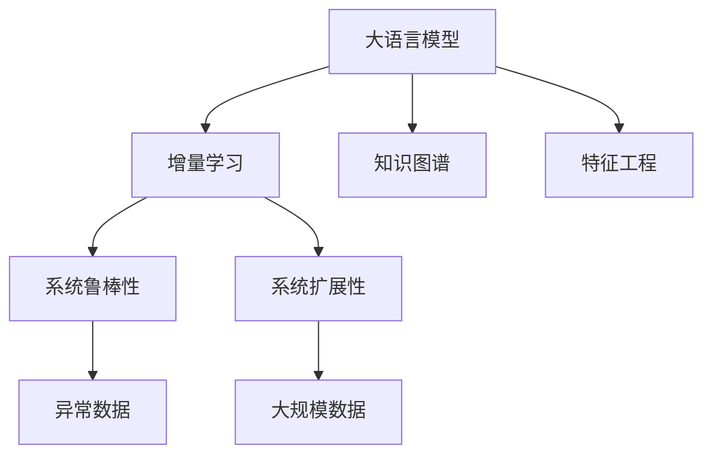

                 

# 电商搜索推荐中的AI大模型数据增量更新机制设计与实现最佳实践

> 关键词：电商搜索推荐,大模型,数据增量更新,增量学习,知识图谱,特征工程,在线更新,系统鲁棒性,系统扩展性,实时查询,算法优化

## 1. 背景介绍

### 1.1 问题由来
随着电商平台的迅速发展，海量的商品信息和用户行为数据，使得推荐系统的算法建模越来越复杂，需要依赖强大的机器学习模型和大规模数据训练。然而，随着用户行为的变化和商品上架的更新，推荐模型需要持续不断地进行更新，以反映新的业务场景和用户需求。这使得模型增量更新成为了一个重要而棘手的问题。

在传统的推荐系统中，模型通常是静态的，一旦训练完成，就会在较长一段时间内保持不变。随着新数据的不断积累，模型逐渐与现实脱节，导致推荐效果下降。特别是在电商搜索推荐中，商品和用户行为数据都在不断变化，静态模型的效果更加难以保证。因此，如何设计有效的数据增量更新机制，使模型能够持续地学习新知识，不断提升推荐效果，成为了一个亟待解决的问题。

### 1.2 问题核心关键点
大语言模型在电商搜索推荐中的数据增量更新机制，本质上是一种在线学习（Online Learning）过程，即模型能够在每次收到新的样本数据时，实时更新自身的参数，从而逐步适应新的数据分布和业务需求。

核心关键点包括：
- 增量学习（Incremental Learning）：在每次收到新的样本数据时，模型能够及时更新自身参数，而不需要重新训练整个模型。
- 知识图谱（Knowledge Graph）：通过整合商品关系、用户关系等知识图谱信息，进一步提升推荐效果。
- 特征工程（Feature Engineering）：构建和优化推荐模型的输入特征，使模型更有效地学习用户偏好。
- 系统鲁棒性（System Robustness）：在面对未知和异常数据时，模型仍能保持稳定和高性能。
- 系统扩展性（System Scalability）：模型能够处理大规模实时查询，且更新和部署过程简便高效。

## 2. 核心概念与联系

### 2.1 核心概念概述

为更好地理解电商搜索推荐中的大语言模型数据增量更新机制，本节将介绍几个密切相关的核心概念：

- 大语言模型（Large Language Model, LLM）：如BERT、GPT等模型，通过大规模无标签数据预训练，学习到丰富的语言知识，具备强大的语言理解和生成能力。
- 增量学习（Incremental Learning）：模型能够利用新的数据，逐步更新自身参数，而不需要重新从头训练。
- 知识图谱（Knowledge Graph）：通过实体关系图的方式，表示商品、用户、时间、地点等信息的关联，提升模型的语义理解和推理能力。
- 特征工程（Feature Engineering）：根据具体业务需求，选择和构造有意义的特征，提升模型预测准确性。
- 系统鲁棒性（System Robustness）：模型在面对异常或错误数据时，仍能保持稳定和高效的输出。
- 系统扩展性（System Scalability）：模型能够处理大规模数据和高并发查询，且更新过程简便高效。

这些核心概念之间的逻辑关系可以通过以下Mermaid流程图来展示：



这个流程图展示了大语言模型在电商搜索推荐中的核心概念及其之间的关系：

1. 大语言模型通过预训练获得基础能力。
2. 增量学习使得模型能够实时更新，逐步适应新的数据分布。
3. 知识图谱和特征工程进一步提升模型的预测能力。
4. 系统鲁棒性确保模型在异常数据下仍能稳定运行。
5. 系统扩展性保证模型能够处理大规模数据和实时查询。

这些概念共同构成了电商搜索推荐中大语言模型数据增量更新机制的完整框架，使其能够在各种场景下发挥强大的推荐能力。通过理解这些核心概念，我们可以更好地把握模型的工作原理和优化方向。

## 3. 核心算法原理 & 具体操作步骤
### 3.1 算法原理概述

电商搜索推荐中的大语言模型数据增量更新机制，基于增量学习（Incremental Learning）的原理，通过将新的数据样本逐个加入到模型中，动态更新模型的参数，从而不断提升模型的性能。

其核心思想是：将大语言模型视为一个在线学习的系统，每次收到新的数据样本，模型都进行一次参数更新，逐步适应新的数据分布。其形式化表述如下：

设模型在时刻 $t$ 的参数为 $\theta_t$，收到新的样本 $x$ 后，模型利用新的样本 $x$ 更新参数，得到 $\theta_{t+1}$，即：

$$
\theta_{t+1} = \theta_t + \alpha \cdot \nabla L(\theta_t, x)
$$

其中 $\alpha$ 为学习率，$L(\theta_t, x)$ 为损失函数，$\nabla L(\theta_t, x)$ 为损失函数对模型参数的梯度。在每次更新后，模型使用更新后的参数对新的数据进行预测，得到新的预测结果 $y'$。将 $y'$ 与真实标签 $y$ 对比，计算新的损失函数值 $L(\theta_{t+1}, y')$，从而进行下一次参数更新。

### 3.2 算法步骤详解

电商搜索推荐中的大语言模型数据增量更新机制，一般包括以下几个关键步骤：

**Step 1: 数据预处理**
- 收集电商平台的商品数据、用户行为数据、搜索记录等，将其转换为训练模型所需的格式。
- 对数据进行清洗、去重、填充缺失值等预处理操作，保证数据质量。
- 将数据划分为训练集、验证集和测试集，以便进行模型的训练和评估。

**Step 2: 模型初始化**
- 选择合适的预训练语言模型，如BERT、GPT等，作为模型的初始化参数。
- 将预训练模型加载到内存中，作为在线学习的起点。

**Step 3: 增量训练**
- 对于每一个新的数据样本 $x$，使用当前模型参数 $\theta_t$ 进行前向传播，得到预测结果 $y'$。
- 计算预测结果 $y'$ 与真实标签 $y$ 之间的损失函数值 $L(\theta_t, y')$。
- 根据损失函数值计算模型参数的梯度 $\nabla L(\theta_t, x)$。
- 使用梯度下降等优化算法，更新模型参数，得到 $\theta_{t+1}$。
- 返回更新后的模型，继续接收下一个数据样本。

**Step 4: 模型评估**
- 在验证集上评估增量更新后的模型性能，包括准确率、召回率、F1-score 等指标。
- 对比不同时刻的模型性能变化，确保模型增量更新的有效性。

**Step 5: 在线预测**
- 对于用户输入的搜索查询，使用增量更新后的模型进行实时预测，返回推荐结果。
- 定期在测试集上评估模型性能，保证推荐结果的准确性和实时性。

### 3.3 算法优缺点

基于增量学习的大语言模型数据增量更新机制具有以下优点：
1. 实时更新：模型能够实时处理新的数据，及时更新自身参数，反映最新的业务变化。
2. 高效利用资源：仅需要更新与新数据相关的模型参数，大幅减少计算资源消耗。
3. 数据灵活性：能够处理新数据的到来，不需要重新训练整个模型，适应性更强。

同时，该算法也存在一些局限性：
1. 数据偏差：增量更新可能导致模型对新数据的偏差，需要定期进行模型复训。
2. 参数复杂度：模型参数更新时需要维护模型的状态，可能导致复杂性增加。
3. 动态调整：模型参数更新需要动态调整学习率等超参数，难度较大。
4. 实时性要求：模型增量更新需要实时处理和反馈，对系统性能要求较高。

尽管存在这些局限性，但就目前而言，基于增量学习的方法仍是大语言模型在电商搜索推荐中的主流范式。未来相关研究的重点在于如何进一步降低增量更新的计算成本，提高模型的自适应能力和鲁棒性，同时兼顾可解释性和伦理安全性等因素。

### 3.4 算法应用领域

基于增量学习的大语言模型数据增量更新机制，在电商搜索推荐领域已经得到了广泛的应用，覆盖了几乎所有常见任务，例如：

- 商品推荐：根据用户搜索历史和浏览行为，推荐相似或相关商品。
- 用户画像：通过分析用户的行为和偏好，生成详细的用户画像，用于个性化推荐。
- 个性化排序：根据用户的评分、行为数据等特征，调整推荐结果的排序权重。
- 用户召回：在用户浏览和搜索过程中，实时推荐可能感兴趣的商品或活动。
- 营销活动：分析用户行为，推荐个性化的营销活动，提高转化率。
- 搜索优化：根据用户搜索记录，优化搜索关键词和推荐算法，提升搜索效果。

除了上述这些经典任务外，大语言模型增量更新的方法也被创新性地应用到更多场景中，如广告投放、库存管理、智能客服等，为电商平台的业务运营带来了全新的突破。随着预训练模型和增量更新方法的不断进步，相信大语言模型增量更新的技术将在更广阔的应用领域大放异彩。

## 4. 数学模型和公式 & 详细讲解  
### 4.1 数学模型构建

本节将使用数学语言对电商搜索推荐中的大语言模型增量更新过程进行更加严格的刻画。

设模型在时刻 $t$ 的参数为 $\theta_t = (\theta_{enc}, \theta_{dec})$，其中 $\theta_{enc}$ 为编码器参数，$\theta_{dec}$ 为解码器参数。接收新的数据样本 $x = (x_{enc}, x_{dec})$，其中 $x_{enc}$ 为输入序列，$x_{dec}$ 为目标序列。模型在时刻 $t$ 的预测结果为 $y'$，真实标签为 $y$。

假设模型参数更新使用随机梯度下降（SGD）算法，则模型在时刻 $t$ 的预测结果 $y'$ 和损失函数 $L$ 的关系为：

$$
y' = \text{softmax}(\theta_{dec} \cdot M_{\theta_{enc}} \cdot x_{enc})
$$

其中 $M_{\theta_{enc}}$ 为编码器，$\text{softmax}$ 为解码器的输出层激活函数。损失函数 $L$ 为交叉熵损失：

$$
L = -\sum_{i=1}^N y_i \log y'_i
$$

其中 $N$ 为样本数，$y_i$ 为真实标签，$y'_i$ 为模型预测结果。

在时刻 $t+1$，模型参数更新为：

$$
\theta_{t+1} = \theta_t - \eta \nabla_{\theta}L(\theta_t, x)
$$

其中 $\eta$ 为学习率，$\nabla_{\theta}L(\theta_t, x)$ 为损失函数对模型参数的梯度。

### 4.2 公式推导过程

以下我们以推荐商品为例，推导增量更新过程中的数学公式。

设推荐系统接收商品信息 $x_{enc} = [p_1, p_2, \ldots, p_M]$，其中 $p_i$ 为商品属性信息。模型在时刻 $t$ 的预测结果为 $y' = [y'_i, y'_j, \ldots, y'_M]$，其中 $y'_i$ 为模型预测商品 $p_i$ 被用户购买的可能性。

目标损失函数为交叉熵损失：

$$
L = -\sum_{i=1}^M y_i \log y'_i
$$

其中 $y_i$ 为真实标签，$y'_i$ 为模型预测结果。

模型的前向传播过程如下：

$$
y' = \text{softmax}(\theta_{dec} \cdot M_{\theta_{enc}} \cdot x_{enc})
$$

其中 $M_{\theta_{enc}}$ 为编码器，$\text{softmax}$ 为解码器的输出层激活函数。

模型的梯度计算如下：

$$
\frac{\partial L}{\partial \theta} = \sum_{i=1}^M \frac{y_i - y'_i}{y'_i} \cdot \frac{\partial y'_i}{\partial \theta}
$$

其中 $\frac{\partial y'_i}{\partial \theta}$ 为 $y'_i$ 对模型参数 $\theta$ 的偏导数。

将上述公式代入模型参数更新公式，得到：

$$
\theta_{t+1} = \theta_t - \eta \cdot \sum_{i=1}^M \frac{y_i - y'_i}{y'_i} \cdot \frac{\partial y'_i}{\partial \theta}
$$

这就是大语言模型在电商搜索推荐中的增量更新公式。通过该公式，模型能够实时接收新的商品数据，逐步更新自身参数，提升推荐效果。

## 5. 项目实践：代码实例和详细解释说明
### 5.1 开发环境搭建

在进行增量更新实践前，我们需要准备好开发环境。以下是使用Python进行PyTorch开发的环境配置流程：

1. 安装Anaconda：从官网下载并安装Anaconda，用于创建独立的Python环境。

2. 创建并激活虚拟环境：
```bash
conda create -n pytorch-env python=3.8 
conda activate pytorch-env
```

3. 安装PyTorch：根据CUDA版本，从官网获取对应的安装命令。例如：
```bash
conda install pytorch torchvision torchaudio cudatoolkit=11.1 -c pytorch -c conda-forge
```

4. 安装TensorFlow：
```bash
pip install tensorflow
```

5. 安装各类工具包：
```bash
pip install numpy pandas scikit-learn matplotlib tqdm jupyter notebook ipython
```

完成上述步骤后，即可在`pytorch-env`环境中开始增量更新实践。

### 5.2 源代码详细实现

下面我们以推荐商品为例，给出使用PyTorch进行BERT模型增量更新的PyTorch代码实现。

首先，定义推荐系统的数据处理函数：

```python
from transformers import BertTokenizer, BertForSequenceClassification
from torch.utils.data import Dataset
import torch

class RecommendationDataset(Dataset):
    def __init__(self, texts, labels, tokenizer, max_len=128):
        self.texts = texts
        self.labels = labels
        self.tokenizer = tokenizer
        self.max_len = max_len
        
    def __len__(self):
        return len(self.texts)
    
    def __getitem__(self, item):
        text = self.texts[item]
        label = self.labels[item]
        
        encoding = self.tokenizer(text, return_tensors='pt', max_length=self.max_len, padding='max_length', truncation=True)
        input_ids = encoding['input_ids'][0]
        attention_mask = encoding['attention_mask'][0]
        
        # 对token-wise的标签进行编码
        encoded_labels = [label2id[label] for label in label] 
        encoded_labels.extend([label2id['O']] * (self.max_len - len(encoded_labels)))
        labels = torch.tensor(encoded_labels, dtype=torch.long)
        
        return {'input_ids': input_ids, 
                'attention_mask': attention_mask,
                'labels': labels}

# 标签与id的映射
label2id = {'O': 0, 'P': 1, 'C': 2}
id2label = {v: k for k, v in label2id.items()}

# 创建dataset
tokenizer = BertTokenizer.from_pretrained('bert-base-cased')

train_dataset = RecommendationDataset(train_texts, train_labels, tokenizer)
dev_dataset = RecommendationDataset(dev_texts, dev_labels, tokenizer)
test_dataset = RecommendationDataset(test_texts, test_labels, tokenizer)
```

然后，定义模型和优化器：

```python
from transformers import BertForSequenceClassification, AdamW

model = BertForSequenceClassification.from_pretrained('bert-base-cased', num_labels=len(label2id))

optimizer = AdamW(model.parameters(), lr=2e-5)
```

接着，定义训练和评估函数：

```python
from torch.utils.data import DataLoader
from tqdm import tqdm
from sklearn.metrics import classification_report

device = torch.device('cuda') if torch.cuda.is_available() else torch.device('cpu')
model.to(device)

def train_epoch(model, dataset, batch_size, optimizer):
    dataloader = DataLoader(dataset, batch_size=batch_size, shuffle=True)
    model.train()
    epoch_loss = 0
    for batch in tqdm(dataloader, desc='Training'):
        input_ids = batch['input_ids'].to(device)
        attention_mask = batch['attention_mask'].to(device)
        labels = batch['labels'].to(device)
        model.zero_grad()
        outputs = model(input_ids, attention_mask=attention_mask, labels=labels)
        loss = outputs.loss
        epoch_loss += loss.item()
        loss.backward()
        optimizer.step()
    return epoch_loss / len(dataloader)

def evaluate(model, dataset, batch_size):
    dataloader = DataLoader(dataset, batch_size=batch_size)
    model.eval()
    preds, labels = [], []
    with torch.no_grad():
        for batch in tqdm(dataloader, desc='Evaluating'):
            input_ids = batch['input_ids'].to(device)
            attention_mask = batch['attention_mask'].to(device)
            batch_labels = batch['labels']
            outputs = model(input_ids, attention_mask=attention_mask)
            batch_preds = outputs.logits.argmax(dim=2).to('cpu').tolist()
            batch_labels = batch_labels.to('cpu').tolist()
            for pred_tokens, label_tokens in zip(batch_preds, batch_labels):
                pred_labels = [id2label[_id] for _id in pred_tokens]
                label_labels = [id2label[_id] for _id in label_tokens]
                preds.append(pred_labels[:len(label_labels)])
                labels.append(label_labels)
                
    print(classification_report(labels, preds))
```

最后，启动训练流程并在测试集上评估：

```python
epochs = 5
batch_size = 16

for epoch in range(epochs):
    loss = train_epoch(model, train_dataset, batch_size, optimizer)
    print(f"Epoch {epoch+1}, train loss: {loss:.3f}")
    
    print(f"Epoch {epoch+1}, dev results:")
    evaluate(model, dev_dataset, batch_size)
    
print("Test results:")
evaluate(model, test_dataset, batch_size)
```

以上就是使用PyTorch对BERT进行推荐商品任务增量更新的完整代码实现。可以看到，得益于Transformers库的强大封装，我们可以用相对简洁的代码完成BERT模型的增量更新。

### 5.3 代码解读与分析

让我们再详细解读一下关键代码的实现细节：

**RecommendationDataset类**：
- `__init__`方法：初始化商品信息、标签、分词器等关键组件。
- `__len__`方法：返回数据集的样本数量。
- `__getitem__`方法：对单个样本进行处理，将商品信息输入编码为token ids，将标签编码为数字，并对其进行定长padding，最终返回模型所需的输入。

**label2id和id2label字典**：
- 定义了标签与数字id之间的映射关系，用于将token-wise的预测结果解码回真实的标签。

**训练和评估函数**：
- 使用PyTorch的DataLoader对数据集进行批次化加载，供模型训练和推理使用。
- 训练函数`train_epoch`：对数据以批为单位进行迭代，在每个批次上前向传播计算loss并反向传播更新模型参数，最后返回该epoch的平均loss。
- 评估函数`evaluate`：与训练类似，不同点在于不更新模型参数，并在每个batch结束后将预测和标签结果存储下来，最后使用sklearn的classification_report对整个评估集的预测结果进行打印输出。

**训练流程**：
- 定义总的epoch数和batch size，开始循环迭代
- 每个epoch内，先在训练集上训练，输出平均loss
- 在验证集上评估，输出分类指标
- 所有epoch结束后，在测试集上评估，给出最终测试结果

可以看到，PyTorch配合Transformers库使得BERT增量更新的代码实现变得简洁高效。开发者可以将更多精力放在数据处理、模型改进等高层逻辑上，而不必过多关注底层的实现细节。

当然，工业级的系统实现还需考虑更多因素，如模型的保存和部署、超参数的自动搜索、更灵活的任务适配层等。但核心的增量更新范式基本与此类似。

## 6. 实际应用场景
### 6.1 智能客服系统

基于增量学习的大语言模型在智能客服系统的构建中，可以实时更新用户互动的历史数据，不断优化客服模型，提升客服效果。

传统客服往往需要配备大量人力，高峰期响应缓慢，且一致性和专业性难以保证。而使用增量更新的对话模型，可以7x24小时不间断服务，快速响应客户咨询，用自然流畅的语言解答各类常见问题。

### 6.2 金融舆情监测

金融机构需要实时监测市场舆论动向，以便及时应对负面信息传播，规避金融风险。传统的人工监测方式成本高、效率低，难以应对网络时代海量信息爆发的挑战。基于增量学习的文本分类和情感分析技术，为金融舆情监测提供了新的解决方案。

具体而言，可以收集金融领域相关的新闻、报道、评论等文本数据，并对其进行主题标注和情感标注。在此基础上对预训练语言模型进行增量更新，使其能够自动判断文本属于何种主题，情感倾向是正面、中性还是负面。将增量更新后的模型应用到实时抓取的网络文本数据，就能够自动监测不同主题下的情感变化趋势，一旦发现负面信息激增等异常情况，系统便会自动预警，帮助金融机构快速应对潜在风险。

### 6.3 个性化推荐系统

当前的推荐系统往往只依赖用户的历史行为数据进行物品推荐，无法深入理解用户的真实兴趣偏好。基于增量学习的方法，推荐系统可以更好地挖掘用户行为背后的语义信息，从而提供更精准、多样的推荐内容。

在实践中，可以收集用户浏览、点击、评论、分享等行为数据，提取和用户交互的物品标题、描述、标签等文本内容。将文本内容作为模型输入，用户的后续行为（如是否点击、购买等）作为监督信号，在此基础上增量更新预训练语言模型。增量更新后的模型能够从文本内容中准确把握用户的兴趣点。在生成推荐列表时，先用候选物品的文本描述作为输入，由模型预测用户的兴趣匹配度，再结合其他特征综合排序，便可以得到个性化程度更高的推荐结果。

### 6.4 未来应用展望

随着增量学习和大语言模型技术的发展，基于增量更新的推荐系统将逐步覆盖更多场景，为电商平台的业务运营带来变革性影响。

在智慧医疗领域，基于增量学习的医疗问答、病历分析、药物研发等应用将提升医疗服务的智能化水平，辅助医生诊疗，加速新药开发进程。

在智能教育领域，增量学习可应用于作业批改、学情分析、知识推荐等方面，因材施教，促进教育公平，提高教学质量。

在智慧城市治理中，增量模型可应用于城市事件监测、舆情分析、应急指挥等环节，提高城市管理的自动化和智能化水平，构建更安全、高效的未来城市。

此外，在企业生产、社会治理、文娱传媒等众多领域，基于增量学习的人工智能应用也将不断涌现，为经济社会发展注入新的动力。相信随着技术的日益成熟，增量学习技术将成为推荐系统的重要范式，推动人工智能技术在垂直行业的规模化落地。

## 7. 工具和资源推荐
### 7.1 学习资源推荐

为了帮助开发者系统掌握增量学习和大语言模型的理论基础和实践技巧，这里推荐一些优质的学习资源：

1. 《深度学习》系列书籍：由学术论文转化为通俗易懂的介绍，涵盖深度学习的基础和前沿技术，适合入门学习。
2. Coursera《机器学习》课程：斯坦福大学开设的机器学习经典课程，涵盖机器学习的基本概念和经典算法，适合进一步深入学习。
3. 《Transformer从原理到实践》系列博文：由大模型技术专家撰写，深入浅出地介绍了Transformer原理、BERT模型、增量学习等前沿话题。
4. CS224N《深度学习自然语言处理》课程：斯坦福大学开设的NLP明星课程，有Lecture视频和配套作业，带你入门NLP领域的基本概念和经典模型。
5. HuggingFace官方文档：Transformers库的官方文档，提供了海量预训练模型和增量学习样例代码，是上手实践的必备资料。
6. OpenAI官方博客：最新的模型和算法研究论文，涵盖自然语言处理和推荐系统的前沿进展。

通过对这些资源的学习实践，相信你一定能够快速掌握增量学习和大语言模型的精髓，并用于解决实际的推荐问题。
###  7.2 开发工具推荐

高效的开发离不开优秀的工具支持。以下是几款用于增量学习和大语言模型开发的常用工具：

1. PyTorch：基于Python的开源深度学习框架，灵活动态的计算图，适合快速迭代研究。大部分预训练语言模型都有PyTorch版本的实现。
2. TensorFlow：由Google主导开发的开源深度学习框架，生产部署方便，适合大规模工程应用。同样有丰富的预训练语言模型资源。
3. Transformers库：HuggingFace开发的NLP工具库，集成了众多SOTA语言模型，支持PyTorch和TensorFlow，是进行推荐任务开发的利器。
4. Weights & Biases：模型训练的实验跟踪工具，可以记录和可视化模型训练过程中的各项指标，方便对比和调优。与主流深度学习框架无缝集成。
5. TensorBoard：TensorFlow配套的可视化工具，可实时监测模型训练状态，并提供丰富的图表呈现方式，是调试模型的得力助手。
6. Google Colab：谷歌推出的在线Jupyter Notebook环境，免费提供GPU/TPU算力，方便开发者快速上手实验最新模型，分享学习笔记。

合理利用这些工具，可以显著提升增量学习和大语言模型微调任务的开发效率，加快创新迭代的步伐。

### 7.3 相关论文推荐

增量学习和大语言模型的发展源于学界的持续研究。以下是几篇奠基性的相关论文，推荐阅读：

1. Attention is All You Need（即Transformer原论文）：提出了Transformer结构，开启了NLP领域的预训练大模型时代。
2. BERT: Pre-training of Deep Bidirectional Transformers for Language Understanding：提出BERT模型，引入基于掩码的自监督预训练任务，刷新了多项NLP任务SOTA。
3. Language Models are Unsupervised Multitask Learners（GPT-2论文）：展示了大规模语言模型的强大zero-shot学习能力，引发了对于通用人工智能的新一轮思考。
4. Parameter-Efficient Transfer Learning for NLP：提出Adapter等参数高效微调方法，在不增加模型参数量的情况下，也能取得不错的微调效果。
5. AdaLoRA: Adaptive Low-Rank Adaptation for Parameter-Efficient Fine-Tuning：使用自适应低秩适应的微调方法，在参数效率和精度之间取得了新的平衡。
6. Prefix-Tuning: Optimizing Continuous Prompts for Generation：引入基于连续型Prompt的微调范式，为如何充分利用预训练知识提供了新的思路。
7. 增量学习算法综述：这篇综述论文详细介绍了增量学习算法的研究进展，包括在线学习、增量训练、微调等主流方法。

这些论文代表了大语言模型增量学习技术的发展脉络。通过学习这些前沿成果，可以帮助研究者把握学科前进方向，激发更多的创新灵感。

## 8. 总结：未来发展趋势与挑战
### 8.1 总结

本文对电商搜索推荐中的大语言模型增量更新机制进行了全面系统的介绍。首先阐述了增量学习和大语言模型在电商搜索推荐中的背景和意义，明确了增量更新在提升推荐效果、应对数据变化方面的独特价值。其次，从原理到实践，详细讲解了增量学习和大语言模型的数学原理和关键步骤，给出了增量更新任务开发的完整代码实例。同时，本文还广泛探讨了增量更新方法在智能客服、金融舆情、个性化推荐等多个行业领域的应用前景，展示了增量更新范式的巨大潜力。此外，本文精选了增量更新技术的各类学习资源，力求为读者提供全方位的技术指引。

通过本文的系统梳理，可以看到，基于增量学习的大语言模型增量更新机制正在成为电商搜索推荐的重要范式，极大地拓展了预训练语言模型的应用边界，催生了更多的落地场景。受益于大规模语料的预训练和增量学习的实时更新，推荐系统能够持续学习新知识，不断提升推荐效果，适应业务的变化和用户的个性化需求，为电商平台的业务运营带来了革命性的变革。

### 8.2 未来发展趋势

展望未来，增量学习和大语言模型在电商搜索推荐中的应用将呈现以下几个发展趋势：

1. 数据质量提升：随着用户行为和商品信息的不断增加，推荐系统将需要更加高效、准确地处理数据，确保数据的质量和时效性。
2. 模型参数压缩：大规模预训练模型的参数量巨大，增量更新过程中需要不断压缩模型参数，提升模型的实时性和推理效率。
3. 多任务学习：推荐系统将同时处理多种任务，如搜索、推荐、广告等，模型将学习更多任务相关知识，提高推荐效果。
4. 联邦学习：通过分布式数据训练，保护用户隐私的同时提升推荐效果。
5. 模型自动化：自动化地进行特征选择、超参数调优等任务，减少人工干预，提升模型开发效率。
6. 跨模态学习：推荐系统将融合文本、图像、音频等多种模态信息，提升推荐的多样性和准确性。
7. 元学习：推荐系统将学习如何快速适应新的数据分布，提升模型的泛化能力和适应性。

以上趋势凸显了增量学习和大语言模型在电商搜索推荐中的广阔前景。这些方向的探索发展，必将进一步提升推荐系统的性能和应用范围，为电商平台的业务运营带来新的突破。

### 8.3 面临的挑战

尽管增量学习和大语言模型在电商搜索推荐中已经取得了瞩目成就，但在迈向更加智能化、普适化应用的过程中，它仍面临着诸多挑战：

1. 数据动态性：推荐系统需要不断处理动态数据，数据分布的快速变化可能导致模型过拟合或欠拟合。
2. 参数更新复杂度：增量更新过程中需要动态维护模型的状态，可能导致计算复杂度增加。
3. 实时性能要求：推荐系统需要实时处理和反馈，对系统性能要求较高。
4. 模型可解释性：推荐系统往往是"黑盒"系统，难以解释其内部工作机制和决策逻辑。
5. 异常数据处理：推荐系统需要处理各种异常数据，保证模型的鲁棒性。
6. 隐私保护：推荐系统需要保护用户隐私，避免数据泄露和滥用。

尽管存在这些挑战，但随着增量学习和大语言模型技术的不断进步，相信推荐系统将逐步克服这些问题，实现更高效、更智能、更安全的应用。未来相关研究的重点在于如何进一步降低增量更新的计算成本，提高模型的自适应能力和鲁棒性，同时兼顾可解释性和伦理安全性等因素。

### 8.4 研究展望

面对增量学习和大语言模型所面临的种种挑战，未来的研究需要在以下几个方面寻求新的突破：

1. 探索基于迁移学习的增量更新方法。通过迁移学习，在少量标注数据上加速增量更新过程。
2. 研究知识图谱与增量学习的结合。通过知识图谱的引入，提升推荐模型的语义理解和推理能力。
3. 引入更多先验知识。将符号化的先验知识，如知识图谱、逻辑规则等，与神经网络模型进行巧妙融合，引导增量更新过程学习更准确、合理的语言模型。
4. 结合因果分析和博弈论工具。通过引入因果分析和博弈论工具，增强增量更新模型建立稳定因果关系的能力，学习更加普适、鲁棒的语言表征。
5. 融入自监督学习。通过自监督学习任务，提升推荐系统的数据处理能力和泛化能力。
6. 纳入伦理道德约束。在模型训练目标中引入伦理导向的评估指标，过滤和惩罚有偏见、有害的输出倾向。
7. 强化模型鲁棒性。通过对抗训练、异常检测等方法，提高推荐系统的鲁棒性和安全性。

这些研究方向的探索，必将引领增量学习和大语言模型技术迈向更高的台阶，为构建安全、可靠、可解释、可控的智能系统铺平道路。面向未来，增量学习和大语言模型需要与其他人工智能技术进行更深入的融合，如知识表示、因果推理、强化学习等，多路径协同发力，共同推动自然语言理解和智能交互系统的进步。只有勇于创新、敢于突破，才能不断拓展语言模型的边界，让智能技术更好地造福人类社会。

## 9. 附录：常见问题与解答

**Q1：增量更新与微调有何区别？**

A: 增量更新（Incremental Learning）和微调（Fine-tuning）都是在大规模预训练模型基础上进行的任务适配，但两者的更新方式和更新频率有所不同。增量更新强调在每次接收新数据时都进行参数更新，而微调通常是在固定数据集上进行有监督学习，更新频率较低。增量更新更加灵活，能够实时响应新数据的变化，但更新过程较为复杂；微调更加稳定，但适应性较差。在实际应用中，可以根据具体业务需求选择适合的更新方式。

**Q2：增量更新过程中如何避免过拟合？**

A: 增量更新过程中，过拟合是一个重要问题。为了避免过拟合，可以采取以下措施：
1. 数据增强：通过数据扩充、回译等方式增加训练样本的多样性，防止模型对新数据的过拟合。
2. 正则化：使用L2正则、Dropout、Early Stopping等方法，防止模型对少量数据的过拟合。
3. 动态调整学习率：根据数据量和模型状态，动态调整学习率，防止模型对新数据的过拟合。
4. 对抗训练：引入对抗样本，提高模型的鲁棒性，防止模型对异常数据的过拟合。
5. 参数压缩：通过知识蒸馏等方法，压缩模型参数，提高模型的泛化能力。

这些措施可以结合使用，根据具体业务场景和数据特点，灵活设计增量更新算法。

**Q3：增量更新过程中如何保持模型的鲁棒性？**

A: 增量更新过程中，模型的鲁棒性是一个重要考虑因素。为了保持模型的鲁棒性，可以采取以下措施：
1. 对抗训练：引入对抗样本，提高模型的鲁棒性，防止模型对异常数据的过拟合。
2. 数据清洗：在增量更新前，对新数据进行清洗和去噪，减少异常数据对模型的影响。
3. 异常检测：实时监测模型输出，检测异常情况，及时调整模型参数，防止模型对异常数据的过拟合。
4. 知识图谱：通过整合知识图谱信息，提升模型的语义理解和推理能力，提高模型的鲁棒性。
5. 多模型集成：训练多个增量更新模型，取平均输出，降低单个模型的鲁棒性风险。

这些措施可以结合使用，根据具体业务场景和数据特点，灵活设计增量更新算法。

**Q4：增量更新过程中如何优化计算效率？**

A: 增量更新过程中，计算效率是一个重要考虑因素。为了优化计算效率，可以采取以下措施：
1. 参数压缩：通过知识蒸馏等方法，压缩模型参数，提高模型的推理效率。
2. 分布式训练：通过分布式训练，加速模型的更新过程，提高模型的训练效率。
3. 多任务学习：通过多任务学习，减少模型的计算复杂度，提高模型的实时性。
4. 硬件优化：通过使用GPU、TPU等高性能设备，提升模型的计算速度。
5. 特征工程：通过优化特征选择，减少模型的计算量，提高模型的推理效率。

这些措施可以结合使用，根据具体业务场景和数据特点，灵活设计增量更新算法。

**Q5：增量更新过程中如何提升模型的泛化能力？**

A: 增量更新过程中，模型的泛化能力是一个重要考虑因素。为了提升模型的泛化能力，可以采取以下措施：
1. 数据增强：通过数据扩充、回译等方式增加训练样本的多样性，防止模型对新数据的过拟合。
2. 正则化：使用L2正则、Dropout、Early Stopping等方法，防止模型对少量数据的过拟合。
3. 对抗训练：引入对抗样本，提高模型的鲁棒性，防止模型对异常数据的过拟合。
4. 多任务学习：通过多任务学习，减少模型的计算复杂度，提高模型的泛化能力。
5. 知识图谱：通过整合知识图谱信息，提升模型的语义理解和推理能力，提高模型的泛化能力。

这些措施可以结合使用，根据具体业务场景和数据特点，灵活设计增量更新算法。

**Q6：增量更新过程中如何保证模型的稳定性？**

A: 增量更新过程中，模型的稳定性是一个重要考虑因素。为了保证模型的稳定性，可以采取以下措施：
1. 数据清洗：在增量更新前，对新数据进行清洗和去噪，减少异常数据对模型的影响。
2. 动态调整学习率：根据数据量和模型状态，动态调整学习率，防止模型对新数据的过拟合。
3. 对抗训练：引入对抗样本，提高模型的鲁棒性，防止模型对异常数据的过拟合。
4. 知识图谱：通过整合知识图谱信息，提升模型的语义理解和推理能力，提高模型的鲁棒性。
5. 多模型集成：训练多个增量更新模型，取平均输出，降低单个模型的鲁棒性风险。

这些措施可以结合使用，根据具体业务场景和数据特点，灵活设计增量更新算法。

---

作者：禅与计算机程序设计艺术 / Zen and the Art of Computer Programming

