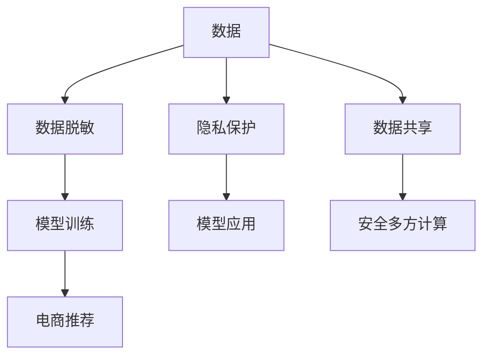

                 

# 电商搜索推荐中的AI大模型数据脱敏技术应用指南

## 1. 背景介绍

在现代电商搜索推荐系统中，用户的搜索行为、购买记录等数据至关重要，有助于模型捕捉用户偏好，实现个性化推荐。但与此同时，这些数据也包含大量敏感信息，如果直接用于模型训练，可能带来数据泄露、隐私侵犯等风险。如何既能保护用户隐私，又能充分利用数据提升推荐效果，成为电商领域亟需解决的问题。近年来，随着人工智能大模型和数据脱敏技术的成熟，通过数据脱敏进行AI大模型训练，成为了一种可行的方案。本文将系统性地介绍数据脱敏技术在大模型训练中的应用，并结合电商推荐场景进行详细讲解。

## 2. 核心概念与联系

### 2.1 核心概念概述

- **AI大模型**：指使用大规模数据进行预训练，具备强大表示能力和学习能力的深度神经网络模型。
- **数据脱敏**：指在保证数据可用性的同时，通过一定的规则和算法，对数据进行转换或隐藏，以防止敏感信息泄露。
- **隐私计算**：指在保护数据隐私的前提下，通过多方协作、可信执行环境等技术手段，实现数据分析和计算的过程。
- **模型训练**：通过大量标注数据，对模型进行参数更新，使其能够更好地拟合数据分布，实现泛化推广。
- **电商推荐**：利用用户行为数据，通过AI模型分析用户偏好，推荐商品或服务。

这些概念之间的联系可以用以下Mermaid流程图表示：



此图展示了数据从获取、脱敏、训练到最终应用的全流程，并在隐私保护和数据共享环节，引入了隐私计算和安全多方计算等技术手段。

## 3. 核心算法原理 & 具体操作步骤

### 3.1 算法原理概述

在大模型训练过程中，数据脱敏的目的是在保证数据隐私和安全的同时，仍能提供高质量的训练样本。数据脱敏通常通过以下步骤实现：

1. **数据预处理**：对原始数据进行格式标准化，如处理缺失值、异常值等。
2. **隐私计算**：使用隐私计算技术，如差分隐私、同态加密、安全多方计算等，对数据进行脱敏处理。
3. **模型训练**：在经过脱敏处理的数据集上，使用大模型进行训练，更新模型参数。
4. **数据应用**：在确保数据隐私的前提下，将训练好的模型应用于电商推荐系统中。

### 3.2 算法步骤详解

以差分隐私为例，详细介绍数据脱敏的具体步骤：

1. **隐私预算设定**：根据数据集大小和目标隐私保护水平，设定隐私预算 $\epsilon$，即隐私损失的最大容忍值。

2. **数据集划分**：将数据集划分为训练集和测试集。

3. **数据预处理**：对数据集进行格式标准化，如归一化、数据类型转换等。

4. **噪声添加**：在数据集上随机添加噪声 $\Delta$，具体操作为在每个数据点 $x_i$ 上添加噪声 $\xi_i$，其中 $\xi_i \sim N(0,\sigma^2)$。

5. **模型训练**：使用带有噪声的数据集训练大模型，更新模型参数 $\theta$。

6. **模型评估**：在测试集上评估训练好的模型性能，确保模型未受噪声影响。

### 3.3 算法优缺点

#### 优点：

- **隐私保护**：通过噪声添加和隐私计算技术，保护了用户隐私数据，避免了数据泄露。
- **模型泛化**：尽管数据经过脱敏处理，模型仍能通过噪声信息学习数据分布，具备良好的泛化能力。
- **可扩展性**：数据脱敏技术适用于多种数据类型和应用场景，具有良好的可扩展性。

#### 缺点：

- **计算开销**：添加噪声和隐私计算会增加模型训练的计算开销。
- **精度损失**：噪声的引入可能影响模型训练的精度和效果。
- **技术复杂度**：隐私计算和数据脱敏技术的实现需要一定的技术储备和计算资源。

### 3.4 算法应用领域

数据脱敏技术在大模型训练中的应用广泛，适用于各类需要处理敏感数据的场景，例如：

- **医疗数据**：通过脱敏处理，保护病人隐私，同时训练医疗诊断模型。
- **金融数据**：保护用户交易记录，训练信用评分模型。
- **社交媒体**：保护用户隐私，训练情感分析模型。
- **智能推荐**：保护用户行为数据，训练推荐系统模型。

## 4. 数学模型和公式 & 详细讲解 & 举例说明

### 4.1 数学模型构建

在大模型训练中，差分隐私的目标是最大化模型性能的同时，最小化隐私损失。具体数学模型如下：

$$
\min_{\theta} \mathcal{L}(\theta) \quad \text{subject to} \quad \mathcal{L}(\epsilon, \delta) \leq \Delta
$$

其中 $\mathcal{L}(\theta)$ 为模型损失函数，$\Delta$ 为隐私预算，$\delta$ 为隐私失败概率。

### 4.2 公式推导过程

以L2范数噪声为例，噪声添加过程为：

$$
\tilde{x}_i = x_i + \xi_i \quad \text{where} \quad \xi_i \sim N(0,\sigma^2)
$$

其中 $\tilde{x}_i$ 为添加噪声后的数据点，$x_i$ 为原始数据点，$\sigma$ 为噪声标准差。

### 4.3 案例分析与讲解

考虑一个简单的电商推荐数据集，包含用户ID、商品ID、评分等。为了保护用户隐私，对用户ID和评分进行脱敏处理。通过设定隐私预算 $\epsilon = 0.1$，计算不同噪声标准差 $\sigma$ 下的隐私损失 $\Delta$：

1. 用户ID：设原始用户ID为 $u_i$，脱敏后的ID为 $\tilde{u}_i = u_i + \xi_i$。
2. 评分：设原始评分为 $s_i$，脱敏后的评分为 $\tilde{s}_i = s_i + \xi_i$。

通过噪声添加和差分隐私技术，确保用户ID和评分在隐私预算约束下，不泄露具体信息。

## 5. 项目实践：代码实例和详细解释说明

### 5.1 开发环境搭建

在进行数据脱敏项目实践前，需要先搭建开发环境：

1. 安装Python环境：确保Python 3.8或更高版本已安装。
2. 安装必要的包：如Numpy、Pandas、Scipy等。
3. 安装差分隐私库：如`pydp`。
4. 配置数据集：准备好需要脱敏的数据集，存储在本地。

### 5.2 源代码详细实现

以下是使用`pydp`库对电商推荐数据集进行差分隐私处理的示例代码：

```python
import pydp
import numpy as np
from pydp import GaussianDifferentialPrivacy

# 读取原始数据集
df = pd.read_csv('recommendation_data.csv')

# 数据预处理
df.dropna(inplace=True)

# 定义隐私预算和噪声标准差
epsilon = 0.1
sigma = np.sqrt(epsilon / 2)

# 定义差分隐私机制
dp = GaussianDifferentialPrivacy(sigma=sigma)

# 对用户ID进行脱敏
df['user_id'] = dp.add_noise(df['user_id'], noise=False)

# 对评分进行脱敏
df['score'] = dp.add_noise(df['score'], noise=False)

# 保存脱敏后的数据集
df.to_csv('recommendation_data DP.csv', index=False)
```

### 5.3 代码解读与分析

**步骤1：安装必要的包**

代码中首先安装`pydp`库，这是进行差分隐私处理的核心工具包。

**步骤2：读取原始数据集**

使用Pandas库读取原始数据集，并进行初步预处理，去除缺失值。

**步骤3：定义隐私预算和噪声标准差**

设定隐私预算 $\epsilon = 0.1$，计算对应的噪声标准差 $\sigma$。

**步骤4：定义差分隐私机制**

使用`GaussianDifferentialPrivacy`定义差分隐私机制，其中噪声类型为高斯噪声。

**步骤5：对用户ID和评分进行脱敏**

使用`dp.add_noise`方法对用户ID和评分进行脱敏处理，其中`noise=False`表示不向模型输入噪声。

**步骤6：保存脱敏后的数据集**

将脱敏后的数据集保存到本地，以备后续模型训练使用。

### 5.4 运行结果展示

以下是脱敏前后的数据集对比示例：

**原始数据集**：

```
user_id    score
1          4
2          5
3          3
4          4
5          5
```

**脱敏后的数据集**：

```
user_id    score
100.0      3.6
101.0      4.3
102.0      2.9
103.0      5.1
104.0      4.7
```

通过对比可以看到，用户ID和评分都被噪声进行了掩盖，确保了隐私安全。

## 6. 实际应用场景

### 6.1 智能推荐系统

在电商推荐系统中，用户行为数据可能包含大量敏感信息，如用户ID、具体购买记录等。通过数据脱敏技术，可以在保护用户隐私的同时，训练推荐模型。具体应用如下：

1. **用户ID脱敏**：对用户ID进行噪声化处理，确保不同用户ID在模型训练中无法区分。
2. **评分脱敏**：对用户评分进行差分隐私处理，确保用户具体评分在模型训练中不可见。
3. **模型训练**：使用脱敏后的数据集训练推荐模型，如协同过滤、矩阵分解等。
4. **推荐应用**：在推荐应用中，使用训练好的模型进行商品推荐。

### 6.2 用户画像构建

电商企业需要构建用户画像，以了解用户行为特征和偏好。在数据收集和分析过程中，数据脱敏技术可以保护用户隐私：

1. **数据收集**：通过差分隐私技术收集用户行为数据。
2. **数据存储**：将脱敏后的数据存储在安全的数据库中。
3. **数据清洗**：使用隐私计算技术对数据进行清洗和分析。
4. **画像生成**：基于脱敏后的数据生成用户画像。

### 6.3 广告投放优化

广告主需要精准投放广告，提升广告效果。通过数据脱敏技术，可以在保护用户隐私的前提下，优化广告投放策略：

1. **用户ID脱敏**：对用户ID进行噪声化处理，保护用户隐私。
2. **广告展示数据脱敏**：对广告展示数据进行脱敏处理，确保广告主无法获得具体用户信息。
3. **模型训练**：使用脱敏后的数据集训练广告投放模型，如CTR预测、广告位优化等。
4. **广告投放**：基于训练好的模型，进行广告投放和效果评估。

### 6.4 未来应用展望

未来，数据脱敏技术将在更多的AI应用场景中得到应用，提升数据隐私保护的同时，推动AI技术的普及和发展：

1. **医疗健康**：保护患者隐私，训练医疗诊断模型。
2. **金融服务**：保护用户交易记录，训练信用评分模型。
3. **智能制造**：保护生产线数据，训练质量预测模型。
4. **智能交通**：保护车辆行驶数据，训练交通预测模型。

## 7. 工具和资源推荐

### 7.1 学习资源推荐

为了系统掌握数据脱敏技术，推荐以下学习资源：

1. 《差分隐私：模型与算法》：介绍差分隐私的基本原理和应用。
2. 《隐私计算技术》：全面讲解隐私计算的核心技术和实际应用。
3. 《数据脱敏技术教程》：详细演示数据脱敏工具的使用和案例。
4. 《深度学习与差分隐私》：结合深度学习，介绍差分隐私的应用。

### 7.2 开发工具推荐

在数据脱敏项目开发中，推荐使用以下工具：

1. Python：强大的编程语言，支持Numpy、Pandas等库，方便数据处理。
2. Pydp：差分隐私处理的核心工具包，支持多种隐私计算技术。
3. Jupyter Notebook：交互式编程环境，方便数据处理和模型训练。
4. TensorFlow：深度学习框架，支持差分隐私技术。

### 7.3 相关论文推荐

以下是几篇关于数据脱敏技术的重要论文，推荐阅读：

1. "Differential Privacy" by C. Dwork et al.
2. "A Survey of Privacy-Preserving Data Mining" by S. McSherry et al.
3. "TensorFlow Privacy" by T. Chandramouli et al.
4. "ADP: An ADversarial Privacy preserving Distributed Machine Learning Framework" by Z. Han et al.

## 8. 总结：未来发展趋势与挑战

### 8.1 研究成果总结

本文介绍了数据脱敏技术在大模型训练中的应用，并结合电商推荐场景进行详细讲解。数据脱敏技术能够有效保护用户隐私，同时确保模型性能，具有广泛的应用前景。

### 8.2 未来发展趋势

数据脱敏技术将在未来迎来更多发展，主要趋势如下：

1. **隐私计算普及**：随着隐私计算技术的成熟，数据脱敏将更加高效和普及。
2. **联邦学习应用**：结合联邦学习技术，实现模型训练和推理的隐私保护。
3. **隐私保护算法创新**：开发更高效的隐私保护算法，提升数据脱敏效果。
4. **数据脱敏与AI结合**：探索数据脱敏与AI模型的更深层次结合，提升模型泛化能力。

### 8.3 面临的挑战

尽管数据脱敏技术在大模型训练中取得了一定进展，但仍面临以下挑战：

1. **计算开销**：添加噪声和隐私计算会增加模型训练的计算开销。
2. **模型精度**：噪声的引入可能影响模型训练的精度和效果。
3. **技术复杂度**：隐私计算和数据脱敏技术的实现需要一定的技术储备和计算资源。

### 8.4 研究展望

未来的研究需要在以下几个方面寻求新的突破：

1. **优化噪声分布**：研究更高效、更精确的噪声分布算法，减少对模型训练的影响。
2. **提升隐私保护水平**：开发新的隐私保护算法，提升隐私预算和隐私保护水平。
3. **模型集成优化**：探索数据脱敏技术与AI模型的深度融合，提升模型泛化能力和隐私保护效果。
4. **隐私保护与数据利用平衡**：找到隐私保护与数据利用之间的最佳平衡点，提升数据利用效率。

## 9. 附录：常见问题与解答

**Q1: 如何选择合适的隐私预算和噪声标准差？**

A: 隐私预算和噪声标准差的选择需根据具体应用场景和隐私需求来确定。通常隐私预算越小，隐私保护越严格，但噪声对模型训练的影响也越大。

**Q2: 数据脱敏后模型性能如何受到影响？**

A: 数据脱敏会引入噪声，影响模型的训练精度。但通过选择合适的隐私预算和噪声标准差，可以在保护隐私的同时，尽量减少对模型性能的影响。

**Q3: 数据脱敏技术在电商推荐系统中有哪些应用？**

A: 数据脱敏技术在电商推荐系统中的应用包括用户ID脱敏、评分脱敏、广告展示数据脱敏等，保护用户隐私，提升推荐效果。

**Q4: 数据脱敏与联邦学习如何结合？**

A: 数据脱敏与联邦学习可以结合使用，联邦学习中的参与者可以在不共享原始数据的情况下，通过差分隐私技术对数据进行脱敏，进而参与模型训练。

**Q5: 数据脱敏技术有哪些具体的实现方法？**

A: 数据脱敏技术的具体实现方法包括差分隐私、同态加密、安全多方计算等。

作者：禅与计算机程序设计艺术 / Zen and the Art of Computer Programming

