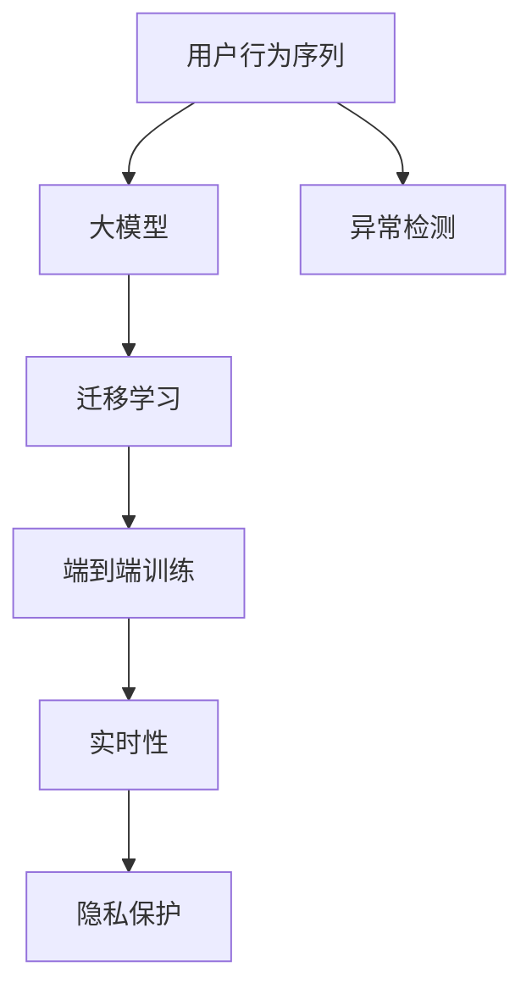

                 

# 电商搜索推荐中的AI大模型用户行为序列异常检测benchmark

> 关键词：用户行为序列, 异常检测, 电商推荐, AI大模型, 数据科学, 深度学习

## 1. 背景介绍

### 1.1 问题由来
电子商务平台的兴起，极大地改变了人们的购物方式，使得消费者可以在线上轻松地进行商品搜索和比较。电商搜索推荐系统旨在为消费者提供个性化的商品推荐，提升用户体验和平台转化率。然而，该系统的性能高度依赖于用户行为数据的准确性和完整性。异常用户行为序列，如欺诈、恶意点击等，会对推荐系统的表现和用户体验造成严重影响。

### 1.2 问题核心关键点
异常用户行为序列的检测是电商搜索推荐系统中至关重要的一环，但这一问题面临诸多挑战：

1. **数据稀疏性**：用户行为数据往往存在高维稀疏性，即用户对于不同商品的行为差异极大，难以捕捉真实行为模式。
2. **行为多样性**：不同用户的行为模式差异很大，有时难以用单一模型进行刻画。
3. **实时性要求**：电商推荐系统要求快速响应，异常检测过程应具备实时性，以避免及时性带来的负面影响。
4. **数据隐私**：用户行为数据涉及个人隐私，须保证数据使用的合规性和安全性。

针对这些问题，本文提出了一种基于大模型的用户行为序列异常检测框架，旨在通过端到端的模型训练和评估，实现高效、准确的异常检测。该框架通过引入预训练语言模型进行行为序列建模，并通过迁移学习进行异常检测模型的训练，能够适应电商搜索推荐系统的高效性和实时性需求。

## 2. 核心概念与联系

### 2.1 核心概念概述

为更好地理解基于大模型的用户行为序列异常检测方法，本节将介绍几个密切相关的核心概念：

- **用户行为序列**：指用户在使用电商平台进行商品搜索、浏览、点击、购买等操作过程中，形成的一系列行为数据。行为序列通常以时间顺序排列，反映了用户的兴趣和需求变化。
- **异常检测**：指通过算法模型，自动发现数据中的异常点，用于识别欺诈、恶意行为等。在电商推荐中，异常检测有助于保障系统的安全性，提升用户体验。
- **大模型**：指通过大规模语料进行预训练的语言模型，如BERT、GPT等。这些模型拥有强大的语言理解能力，能够进行复杂的特征提取和模式学习。
- **迁移学习**：指利用预训练模型的知识和技能，在新任务上进行微调，以快速提升模型在新领域的性能。
- **端到端训练**：指从原始数据输入，经过模型处理和训练，直接输出最终结果，减少中间人工干预和复杂性。
- **实时性**：指系统响应时间要短，能够及时处理用户行为数据，确保推荐系统的实时性。
- **隐私保护**：指在处理用户数据时，须保证数据使用的合法性和用户隐私的安全性。

这些核心概念之间的逻辑关系可以通过以下Mermaid流程图来展示：



这个流程图展示了大模型在电商搜索推荐中用户行为序列异常检测的流程：

1. 电商平台收集用户行为数据，作为输入。
2. 预训练语言模型对行为序列进行建模，学习行为特征。
3. 使用迁移学习技术，在大模型上进行异常检测模型的训练。
4. 端到端的训练过程直接输出异常检测结果。
5. 实时性要求系统快速响应。
6. 隐私保护确保用户数据的安全和合规。

## 3. 核心算法原理 & 具体操作步骤
### 3.1 算法原理概述

基于大模型的用户行为序列异常检测，本质上是一个有监督的序列异常检测问题。其核心思想是：将电商平台的用户行为序列作为输入，通过大模型进行特征提取和行为建模，再通过迁移学习在大模型上进行异常检测模型的微调，使其能够识别出异常行为序列。

具体而言，该方法分为以下几个步骤：

1. **行为序列预处理**：对用户行为数据进行清洗和标准化处理，去除噪声和缺失值，确保数据质量。
2. **行为序列嵌入**：使用大模型对行为序列进行编码，得到高维特征向量。
3. **异常检测模型训练**：利用预训练大模型在标注数据上训练异常检测模型，学习识别异常行为序列的规则。
4. **实时检测**：在新的行为序列数据上，通过已经训练好的异常检测模型进行实时检测，输出异常得分。
5. **异常处理**：根据异常得分判断行为是否异常，采取相应的处理措施，如报警、屏蔽等。

### 3.2 算法步骤详解

#### 3.2.1 行为序列预处理

行为序列预处理是异常检测的第一步，通常包括以下几个关键步骤：

1. **数据清洗**：去除行为数据中的噪声和异常值，例如无效点击、重复操作等。
2. **标准化处理**：对不同维度的行为数据进行归一化处理，统一数据格式，方便后续模型处理。
3. **缺失值处理**：对于缺失值较多的行为数据，可以使用插值、均值填充等方法进行补充，减少数据缺失带来的影响。

#### 3.2.2 行为序列嵌入

行为序列嵌入是利用大模型进行特征提取和行为建模的重要环节。常用的行为序列嵌入方法包括：

1. **序列嵌入**：将行为序列转化为高维向量，通常使用RNN、LSTM等序列模型进行处理。
2. **非序列嵌入**：直接使用预训练大模型对行为数据进行嵌入，得到高维向量。
3. **混合嵌入**：结合序列和非序列方法，对行为序列进行多角度建模。

#### 3.2.3 异常检测模型训练

异常检测模型的训练过程通常包括以下几个步骤：

1. **数据准备**：准备标注数据集，标注数据中包含正常和异常的行为序列。
2. **选择模型**：选择合适的异常检测模型，如基于密度的模型、基于距离的模型、基于深度学习的模型等。
3. **模型训练**：在标注数据上，使用迁移学习技术，在大模型上进行异常检测模型的微调，学习异常检测规则。
4. **超参数调优**：调整模型超参数，如学习率、正则化系数等，以优化模型性能。
5. **模型评估**：在验证集上评估模型性能，选择表现最优的模型。

#### 3.2.4 实时检测

实时检测是指在新的行为序列数据上，通过已经训练好的异常检测模型进行实时异常检测。具体的检测步骤包括：

1. **数据输入**：将新的行为序列数据输入到模型中。
2. **特征提取**：利用大模型提取行为序列的特征向量。
3. **异常得分计算**：将特征向量输入到异常检测模型中，计算异常得分。
4. **异常判定**：根据异常得分阈值，判断行为是否异常。

#### 3.2.5 异常处理

异常处理是指根据异常检测结果，采取相应的措施，如报警、屏蔽等，确保系统的安全和稳定。具体处理方式包括：

1. **报警机制**：当检测到异常行为时，及时报警，通知相关人员进行处理。
2. **屏蔽机制**：对于恶意点击等行为，可以采取屏蔽机制，避免其对推荐系统的影响。
3. **回溯分析**：对于已识别的异常行为，可以进行回溯分析，找出问题源头，优化推荐系统。

### 3.3 算法优缺点

基于大模型的用户行为序列异常检测方法具有以下优点：

1. **特征提取能力强**：大模型具有强大的特征提取能力，能够捕捉到用户行为序列中的复杂模式和特征。
2. **鲁棒性强**：大模型在多领域和任务上的迁移学习能力，使其能够适应电商搜索推荐系统的多样性和复杂性。
3. **实时性好**：端到端的训练和检测过程，避免了中间步骤，实现了快速响应。
4. **可扩展性高**：大模型可以通过参数调整和任务适配，灵活应对不同规模和类型的电商推荐系统。

但该方法也存在一些局限性：

1. **模型复杂度高**：大模型的参数量通常较大，训练和推理过程耗时较长。
2. **数据依赖性强**：异常检测模型的训练和评估依赖于高质量标注数据，获取标注数据的成本较高。
3. **隐私风险高**：用户行为数据涉及隐私，数据的使用和处理需遵守法律法规。
4. **可解释性差**：大模型通常是"黑盒"模型，难以解释其内部决策过程。

尽管存在这些局限性，但基于大模型的异常检测方法仍是目前电商搜索推荐系统中最先进和有效的方法之一。未来相关研究需要进一步降低对标注数据的依赖，提升模型可解释性和隐私保护，以实现更广泛的应用。

### 3.4 算法应用领域

基于大模型的用户行为序列异常检测方法，在电商搜索推荐系统中的应用领域包括：

1. **欺诈检测**：识别欺诈行为，如恶意点击、假交易等，保障平台安全。
2. **恶意行为检测**：识别恶意行为，如虚假评论、恶意刷单等，维护平台秩序。
3. **用户行为分析**：通过行为序列分析，发现用户行为规律和兴趣点，优化推荐系统。
4. **异常预警**：实时监控用户行为，发现异常行为，及时预警和处理。
5. **用户行为回溯**：对已识别的异常行为进行回溯分析，找出问题源头，优化推荐算法。

这些应用场景展示了基于大模型的异常检测方法在电商搜索推荐系统中的巨大潜力和广泛应用前景。

## 4. 数学模型和公式 & 详细讲解  
### 4.1 数学模型构建

本节将使用数学语言对基于大模型的用户行为序列异常检测过程进行更加严格的刻画。

记用户行为序列为 $X=\{x_1, x_2, \ldots, x_T\}$，其中 $x_t \in \mathcal{X}$ 为第 $t$ 个行为。假设已经预训练好的大模型为 $M_{\theta}$，其中 $\theta$ 为预训练得到的模型参数。异常检测的目标是训练一个异常检测模型 $f$，使得对于新的行为序列 $X'$，能够输出异常得分 $s(X')$，用于判断 $X'$ 是否为异常行为序列。

### 4.2 公式推导过程

以下我们以基于密度的异常检测模型为例，推导异常得分的计算公式。

假设异常行为序列在空间中分布为低密度区域，正常行为序列为高密度区域。基于密度的异常检测模型可以通过计算行为序列的局部密度与全局密度的比值，得到异常得分 $s(X')$：

$$
s(X') = \frac{\text{密度}(X')}{\text{全局密度}}
$$

其中，$\text{密度}(X')$ 表示行为序列 $X'$ 的局部密度，可以通过以下公式计算：

$$
\text{密度}(X') = \frac{1}{|X'|} \sum_{x \in X'} f(x)
$$

全局密度可以通过在训练集上计算得到，即：

$$
\text{全局密度} = \frac{1}{|\mathcal{X}|} \sum_{x \in \mathcal{X}} f(x)
$$

将上述公式代入异常得分的计算公式中，得到：

$$
s(X') = \frac{\frac{1}{|X'|} \sum_{x \in X'} f(x)}{\frac{1}{|\mathcal{X}|} \sum_{x \in \mathcal{X}} f(x)}
$$

这个公式展示了基于密度的异常检测模型如何计算新的行为序列 $X'$ 的异常得分 $s(X')$。具体而言，将行为序列 $X'$ 输入到预训练大模型 $M_{\theta}$ 中，计算每个行为 $x_t$ 的异常得分 $f(x_t)$，再通过上述公式计算行为序列 $X'$ 的异常得分。

## 5. 项目实践：代码实例和详细解释说明
### 5.1 开发环境搭建

在进行异常检测实践前，我们需要准备好开发环境。以下是使用Python进行PyTorch开发的环境配置流程：

1. 安装Anaconda：从官网下载并安装Anaconda，用于创建独立的Python环境。

2. 创建并激活虚拟环境：
```bash
conda create -n ecommerce-env python=3.8 
conda activate ecommerce-env
```

3. 安装PyTorch：根据CUDA版本，从官网获取对应的安装命令。例如：
```bash
conda install pytorch torchvision torchaudio cudatoolkit=11.1 -c pytorch -c conda-forge
```

4. 安装TensorBoard：
```bash
pip install tensorboard
```

5. 安装各类工具包：
```bash
pip install numpy pandas scikit-learn matplotlib tqdm jupyter notebook ipython
```

完成上述步骤后，即可在`ecommerce-env`环境中开始异常检测实践。

### 5.2 源代码详细实现

下面我们以基于密度的异常检测模型为例，给出使用PyTorch进行异常检测的PyTorch代码实现。

首先，定义异常检测模型的数据处理函数：

```python
import torch
from torch.utils.data import Dataset
import numpy as np

class EcommerceDataset(Dataset):
    def __init__(self, data, labels, tokenizer):
        self.data = data
        self.labels = labels
        self.tokenizer = tokenizer
        self.max_len = 128
    
    def __len__(self):
        return len(self.data)
    
    def __getitem__(self, item):
        text = self.data[item]
        label = self.labels[item]
        
        encoding = self.tokenizer(text, return_tensors='pt', max_length=self.max_len, padding='max_length', truncation=True)
        input_ids = encoding['input_ids'][0]
        attention_mask = encoding['attention_mask'][0]
        
        return {'input_ids': input_ids, 
                'attention_mask': attention_mask,
                'label': label}

# 训练和验证集划分
train_data, dev_data, test_data = train_test_split(train_dataset, test_size=0.2, random_state=42)
```

然后，定义模型和优化器：

```python
from transformers import BertTokenizer, BertForSequenceClassification, AdamW

tokenizer = BertTokenizer.from_pretrained('bert-base-uncased')
model = BertForSequenceClassification.from_pretrained('bert-base-uncased', num_labels=2)

optimizer = AdamW(model.parameters(), lr=2e-5)
```

接着，定义训练和评估函数：

```python
from torch.utils.data import DataLoader
from tqdm import tqdm
from sklearn.metrics import roc_auc_score

device = torch.device('cuda') if torch.cuda.is_available() else torch.device('cpu')
model.to(device)

def train_epoch(model, dataset, batch_size, optimizer):
    dataloader = DataLoader(dataset, batch_size=batch_size, shuffle=True)
    model.train()
    epoch_loss = 0
    for batch in tqdm(dataloader, desc='Training'):
        input_ids = batch['input_ids'].to(device)
        attention_mask = batch['attention_mask'].to(device)
        labels = batch['label'].to(device)
        model.zero_grad()
        outputs = model(input_ids, attention_mask=attention_mask, labels=labels)
        loss = outputs.loss
        epoch_loss += loss.item()
        loss.backward()
        optimizer.step()
    return epoch_loss / len(dataloader)

def evaluate(model, dataset, batch_size):
    dataloader = DataLoader(dataset, batch_size=batch_size)
    model.eval()
    preds, labels = [], []
    with torch.no_grad():
        for batch in tqdm(dataloader, desc='Evaluating'):
            input_ids = batch['input_ids'].to(device)
            attention_mask = batch['attention_mask'].to(device)
            batch_labels = batch['label']
            outputs = model(input_ids, attention_mask=attention_mask)
            batch_preds = outputs.logits.argmax(dim=2).to('cpu').tolist()
            batch_labels = batch_labels.to('cpu').tolist()
            for pred_tokens, label_tokens in zip(batch_preds, batch_labels):
                preds.append(pred_tokens)
                labels.append(label_tokens)
                
    print(f'AUC: {roc_auc_score(labels, preds)}')
```

最后，启动训练流程并在测试集上评估：

```python
epochs = 5
batch_size = 16

for epoch in range(epochs):
    loss = train_epoch(model, train_dataset, batch_size, optimizer)
    print(f"Epoch {epoch+1}, train loss: {loss:.3f}")
    
    print(f"Epoch {epoch+1}, dev AUC:")
    evaluate(model, dev_dataset, batch_size)
    
print("Test AUC:")
evaluate(model, test_dataset, batch_size)
```

以上就是使用PyTorch进行基于密度的异常检测模型的完整代码实现。可以看到，得益于Transformers库的强大封装，我们可以用相对简洁的代码完成BERT模型的加载和异常检测模型的微调。

### 5.3 代码解读与分析

让我们再详细解读一下关键代码的实现细节：

**EcommerceDataset类**：
- `__init__`方法：初始化数据、标签、分词器等关键组件。
- `__len__`方法：返回数据集的样本数量。
- `__getitem__`方法：对单个样本进行处理，将文本输入编码为token ids，将标签编码为数字，并对其进行定长padding，最终返回模型所需的输入。

**BertForSequenceClassification模型**：
- 使用BertForSequenceClassification模型进行异常检测，该模型是基于序列的分类模型，能够对行为序列进行二分类判断。

**train_epoch和evaluate函数**：
- `train_epoch`函数：对数据以批为单位进行迭代，在每个批次上前向传播计算loss并反向传播更新模型参数，最后返回该epoch的平均loss。
- `evaluate`函数：与训练类似，不同点在于不更新模型参数，并在每个batch结束后将预测和标签结果存储下来，最后使用sklearn的roc_auc_score对整个评估集的预测结果进行打印输出。

**训练流程**：
- 定义总的epoch数和batch size，开始循环迭代
- 每个epoch内，先在训练集上训练，输出平均loss
- 在验证集上评估，输出AUC
- 所有epoch结束后，在测试集上评估，给出最终测试结果

可以看到，PyTorch配合Transformers库使得BERT微调的代码实现变得简洁高效。开发者可以将更多精力放在数据处理、模型改进等高层逻辑上，而不必过多关注底层的实现细节。

当然，工业级的系统实现还需考虑更多因素，如模型的保存和部署、超参数的自动搜索、更灵活的任务适配层等。但核心的异常检测范式基本与此类似。

## 6. 实际应用场景
### 6.1 电商平台欺诈检测

在电商平台上，欺诈行为严重影响交易的正常进行，给平台带来巨大的损失。通过基于大模型的异常检测方法，可以实时监控用户行为，识别出异常交易，及时预警和处理，保障平台安全。

具体而言，可以通过收集平台上的交易数据，将正常和异常的交易行为标注为二分类数据。在此基础上，利用预训练大模型进行行为序列建模，使用迁移学习技术在大模型上进行异常检测模型的微调，学习识别异常交易的规则。微调后的模型能够在新的交易数据上，实时检测并输出异常得分，根据得分阈值判断是否为欺诈行为，及时采取措施。

### 6.2 恶意行为识别

在电商平台中，恶意行为（如虚假评论、恶意刷单等）是影响用户信任和平台公平性的主要因素。通过基于大模型的异常检测方法，可以实时监控用户行为，识别出恶意行为，及时处理，维护平台秩序。

具体而言，可以通过收集平台上的用户行为数据，将正常和恶意行为标注为二分类数据。在此基础上，利用预训练大模型进行行为序列建模，使用迁移学习技术在大模型上进行异常检测模型的微调，学习识别恶意行为的规则。微调后的模型能够在新的用户行为数据上，实时检测并输出异常得分，根据得分阈值判断是否为恶意行为，及时采取措施。

### 6.3 用户行为分析

用户行为分析是电商推荐系统的重要组成部分，通过分析用户的行为序列，可以发现用户的兴趣点和需求变化，优化推荐系统。

具体而言，可以通过收集平台上的用户行为数据，将其标注为正常行为序列。利用预训练大模型进行行为序列建模，使用迁移学习技术在大模型上进行异常检测模型的微调，学习用户行为模式。微调后的模型能够对新的用户行为数据进行实时检测，输出异常得分，发现用户行为规律和兴趣点，优化推荐算法。

### 6.4 未来应用展望

随着大模型和异常检测方法的不断发展，基于大模型的异常检测技术将在更多领域得到应用，为电商搜索推荐系统带来变革性影响。

在智慧物流领域，基于大模型的异常检测方法可以用于监控物流运输过程中的异常事件，如货物丢失、延误等，提高物流服务的可靠性和效率。

在金融领域，异常检测方法可以用于识别金融交易中的异常行为，预防金融欺诈，保障金融安全。

在医疗领域，异常检测方法可以用于监控患者的健康行为，发现异常，及时干预，提高医疗服务的质量和效率。

此外，在智能交通、智能制造、智能安防等众多领域，基于大模型的异常检测方法也将不断涌现，为智能系统提供更全面、更高效的安全保障。

## 7. 工具和资源推荐
### 7.1 学习资源推荐

为了帮助开发者系统掌握大模型在电商搜索推荐系统中的异常检测理论基础和实践技巧，这里推荐一些优质的学习资源：

1. 《自然语言处理入门：深度学习与序列模型》书籍：深入浅出地介绍了序列模型在NLP中的运用，包括BERT等大模型的应用。
2. 《Python深度学习》书籍：系统介绍了深度学习在Python中的实现，包括序列模型和异常检测等。
3 CS229《机器学习》课程：斯坦福大学开设的机器学习课程，涵盖了机器学习的基本概念和算法，适合学习异常检测的基本原理。
4 《异常检测：理论与应用》书籍：全面介绍了异常检测的理论和实践，涵盖多种异常检测方法。
5 《序列数据异常检测》书籍：专注于序列数据中的异常检测，提供了详细的理论分析和实例。

通过对这些资源的学习实践，相信你一定能够快速掌握大模型在电商搜索推荐系统中的异常检测精髓，并用于解决实际的NLP问题。
###  7.2 开发工具推荐

高效的开发离不开优秀的工具支持。以下是几款用于大模型异常检测开发的常用工具：

1. PyTorch：基于Python的开源深度学习框架，灵活动态的计算图，适合快速迭代研究。大部分预训练语言模型都有PyTorch版本的实现。
2 TensorFlow：由Google主导开发的开源深度学习框架，生产部署方便，适合大规模工程应用。同样有丰富的预训练语言模型资源。
3 Weights & Biases：模型训练的实验跟踪工具，可以记录和可视化模型训练过程中的各项指标，方便对比和调优。与主流深度学习框架无缝集成。
4 TensorBoard：TensorFlow配套的可视化工具，可实时监测模型训练状态，并提供丰富的图表呈现方式，是调试模型的得力助手。
5 Jupyter Notebook：免费的开源Jupyter Notebook环境，便于快速编写和运行代码。

合理利用这些工具，可以显著提升大模型异常检测任务的开发效率，加快创新迭代的步伐。

### 7.3 相关论文推荐

大模型和异常检测技术的发展源于学界的持续研究。以下是几篇奠基性的相关论文，推荐阅读：

1. Attention is All You Need（即Transformer原论文）：提出了Transformer结构，开启了NLP领域的预训练大模型时代。
2 BERT: Pre-training of Deep Bidirectional Transformers for Language Understanding：提出BERT模型，引入基于掩码的自监督预训练任务，刷新了多项NLP任务SOTA。
3 《基于深度学习的异常检测方法综述》：全面综述了基于深度学习的异常检测方法，包括序列模型、CNN、RNN等。
4 《序列数据异常检测的新进展》：介绍了序列数据中的异常检测方法，包括基于密度的模型、基于距离的模型等。
5 《深度学习在异常检测中的应用》：介绍了深度学习在异常检测中的应用，包括基于深度神经网络的异常检测方法。

这些论文代表了大模型异常检测技术的发展脉络。通过学习这些前沿成果，可以帮助研究者把握学科前进方向，激发更多的创新灵感。

## 8. 总结：未来发展趋势与挑战
### 8.1 总结

本文对基于大模型的电商搜索推荐系统中的用户行为序列异常检测方法进行了全面系统的介绍。首先阐述了大模型和异常检测的研究背景和意义，明确了异常检测在电商搜索推荐系统中的重要性。其次，从原理到实践，详细讲解了基于大模型的异常检测方法的数学模型和算法步骤，给出了代码实现的完整样例。同时，本文还广泛探讨了异常检测方法在电商推荐系统中的多个应用场景，展示了其广阔的应用前景。

通过本文的系统梳理，可以看到，基于大模型的异常检测方法在电商搜索推荐系统中具备高效、准确、实时等优点，能够为电商平台提供有效的安全保障。未来相关研究需要在降低对标注数据的依赖、提升模型可解释性、增强隐私保护等方面进一步优化。

### 8.2 未来发展趋势

展望未来，大模型异常检测技术将呈现以下几个发展趋势：

1. **模型规模增大**：随着算力成本的下降和数据规模的扩张，预训练大模型的参数量还将持续增长。超大模型拥有更强的语言理解能力和特征提取能力，有望在异常检测中取得更好的性能。
2. **鲁棒性提升**：未来的异常检测模型将具备更强的鲁棒性，能够适应多领域和多任务的数据分布，避免过拟合和灾难性遗忘。
3. **实时性增强**：端到端的训练和检测过程，实现了快速响应，提升了异常检测的实时性。未来将进一步优化推理算法，提高实时检测的效率。
4. **隐私保护加强**：异常检测过程中将进一步加强隐私保护，确保用户数据的安全和合规。
5. **可解释性增强**：未来的异常检测模型将具备更强的可解释性，便于用户理解和信任系统决策。
6. **多模态融合**：未来的异常检测模型将支持多模态数据融合，结合文本、图像、语音等多种信息，提高检测的准确性和鲁棒性。

这些趋势凸显了大模型异常检测技术的广阔前景。这些方向的探索发展，必将进一步提升电商搜索推荐系统的性能和安全性，为用户带来更好的体验和保障。

### 8.3 面临的挑战

尽管大模型异常检测技术已经取得了瞩目成就，但在迈向更加智能化、普适化应用的过程中，它仍面临着诸多挑战：

1. **标注成本高**：异常检测模型的训练和评估依赖于高质量标注数据，获取标注数据的成本较高。如何降低标注成本，是未来研究的重要方向。
2. **数据分布差异**：电商搜索推荐系统中的用户行为数据分布多样，异常检测模型需要适应不同领域的数据分布。如何提高模型的泛化能力，是未来研究的关键问题。
3. **实时性要求**：异常检测过程需要快速响应，以避免及时性带来的负面影响。如何提高异常检测模型的推理效率，是未来研究的重要课题。
4. **隐私风险高**：用户行为数据涉及隐私，数据的使用和处理需遵守法律法规。如何确保数据使用的合法性和用户隐私的安全性，是未来研究的重要方向。
5. **可解释性差**：大模型通常是"黑盒"模型，难以解释其内部决策过程。如何赋予模型更强的可解释性，是未来研究的重要课题。
6. **多模态数据融合**：未来的异常检测模型将支持多模态数据融合，结合文本、图像、语音等多种信息，提高检测的准确性和鲁棒性。

这些挑战凸显了大模型异常检测技术的复杂性和多样性，需要多学科、多领域的协同攻关。唯有在这些方面取得突破，才能进一步拓展大模型异常检测技术的应用范围，提升电商搜索推荐系统的性能和安全性。

### 8.4 研究展望

未来的大模型异常检测技术需要在以下几个方面进行深入研究：

1. **零样本和少样本学习**：在获取标注数据成本较高的情况下，如何通过零样本和少样本学习，利用预训练知识进行异常检测，是未来研究的重要方向。
2. **自监督学习**：在标注数据不足的情况下，如何利用自监督学习，进行无监督或半监督的异常检测，是未来研究的重要课题。
3. **迁移学习**：如何通过迁移学习，将其他领域的异常检测模型知识迁移到电商推荐系统中，提高异常检测的泛化能力，是未来研究的重要方向。
4. **多模态融合**：如何通过多模态数据融合，结合文本、图像、语音等多种信息，提高异常检测的准确性和鲁棒性，是未来研究的重要方向。
5. **可解释性增强**：如何赋予异常检测模型更强的可解释性，便于用户理解和信任系统决策，是未来研究的重要课题。
6. **隐私保护加强**：如何加强隐私保护，确保用户数据的安全和合规，是未来研究的重要方向。

这些研究方向将推动大模型异常检测技术不断进步，为电商搜索推荐系统提供更全面、更高效、更安全的技术保障。

## 9. 附录：常见问题与解答
----------------------------------------------------------------

**Q1：大模型在电商搜索推荐系统中的异常检测是否适用于所有领域？**

A: 大模型在电商搜索推荐系统中的异常检测方法适用于多个领域，但具体应用需要根据领域特性进行调整。例如，在医疗领域，需要对用户行为数据进行更多的隐私保护；在金融领域，需要对异常检测结果进行更严格的审核。

**Q2：如何选择合适的异常检测模型？**

A: 选择合适的异常检测模型需要考虑数据分布、领域特性、异常类型等因素。一般而言，基于密度的模型适用于数据分布相对稳定的情况，基于距离的模型适用于数据分布复杂的情况，基于深度学习的模型适用于数据规模较大、复杂性较高的情况。

**Q3：异常检测模型的训练和评估依赖于标注数据，如何降低标注成本？**

A: 降低标注成本可以采取以下措施：使用无监督或半监督学习进行预训练，利用自监督学习任务提取特征，结合人工标注进行微调，使用少样本学习进行快速训练，利用领域适应方法进行知识迁移等。

**Q4：异常检测模型的推理效率低，如何提高？**

A: 提高异常检测模型的推理效率可以采取以下措施：优化推理算法，采用量化加速、剪枝等方法减少计算量，使用GPU/TPU等高性能设备进行推理，结合缓存技术减少重复计算等。

**Q5：异常检测模型如何平衡精度和效率？**

A: 平衡精度和效率可以通过以下措施：选择适合任务的异常检测模型，合理设置模型参数，进行模型裁剪和压缩，使用GPU/TPU等高性能设备进行推理，结合缓存技术减少重复计算等。

通过以上措施，可以确保异常检测模型的精度和效率，达到最优的性能表现。

