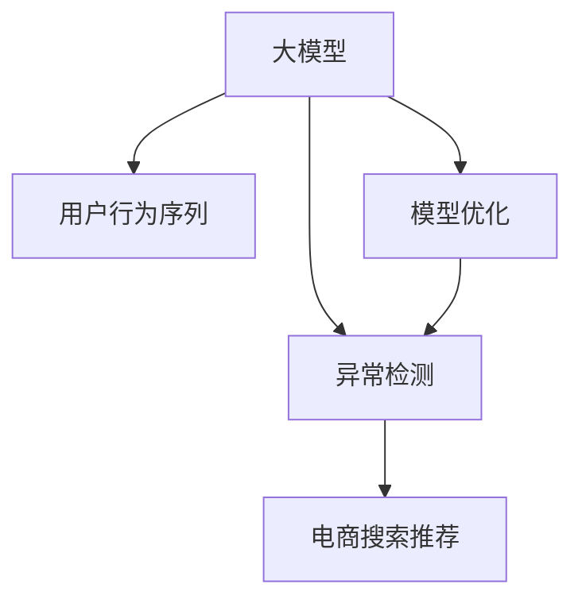

                 

# 电商搜索推荐中的AI大模型用户行为序列异常检测模型优化实践

> 关键词：AI大模型,用户行为序列,异常检测,电商搜索推荐,模型优化

## 1. 背景介绍

### 1.1 问题由来
随着电商平台的迅速崛起和移动互联网的普及，用户在线购物行为日益多样化和复杂化，带来了海量的用户行为数据。如何有效利用这些数据，提升电商搜索推荐系统的精准性和用户体验，成为电商企业关注的焦点。传统基于统计的推荐算法无法适应动态多变的用户需求，难以对异常行为进行实时监控和应对。

近年来，人工智能技术，尤其是基于深度学习的异常检测方法在电商搜索推荐领域逐渐被广泛应用。特别是在电商搜索推荐中，用户的点击、浏览、收藏、下单等行为数据可以视为时间序列数据，通过使用大模型进行建模，可以提升对用户行为序列的预测能力，及时发现和处理异常行为，减少流失，增加转化。

### 1.2 问题核心关键点
电商搜索推荐中的用户行为序列异常检测，是指在用户行为数据序列中，识别出与正常行为不同的异常行为，并及时进行干预。其核心关键点包括：
- 数据收集与预处理：如何高效收集和清洗电商用户行为数据。
- 行为序列建模：如何构建时间序列模型，描述用户行为模式。
- 异常检测方法：如何基于深度学习模型，对异常行为进行检测和分类。
- 模型优化与评估：如何优化模型结构，提升检测准确率和鲁棒性。

### 1.3 问题研究意义
电商搜索推荐中的AI大模型用户行为序列异常检测，对于提升电商平台的用户体验和转化率，具有重要意义：

1. 提升用户体验：通过及时识别和处理异常行为，避免用户对系统的误解和不满，增强用户粘性。
2. 增加转化率：通过预警和干预异常行为，及时推荐个性化商品，降低流失率，提升销售额。
3. 降低运营成本：通过自动化的异常检测和处理，减少人工干预，提高运营效率。
4. 提供决策支持：通过异常检测结果，辅助运营决策，优化搜索推荐策略。

## 2. 核心概念与联系

### 2.1 核心概念概述

为更好地理解电商搜索推荐中用户行为序列异常检测，本节将介绍几个密切相关的核心概念：

- **大模型(Deep Model)**：以深度神经网络为代表的高级模型，通过海量的数据训练，具备强大的特征学习和泛化能力，适用于复杂的电商搜索推荐任务。
- **用户行为序列(User Behavior Sequence)**：用户在电商平台上的一系列操作行为，如浏览、点击、收藏、购买等，可视为时间序列数据，可以通过模型进行分析和预测。
- **异常检测(Anomaly Detection)**：识别出与正常行为不同的异常行为，对异常行为进行分类和干预，是电商搜索推荐中的重要环节。
- **电商搜索推荐(E-commerce Search & Recommendation)**：通过分析用户行为序列，推荐符合用户兴趣的商品，提升用户购物体验和平台转化率。

这些核心概念之间的逻辑关系可以通过以下Mermaid流程图来展示：



这个流程图展示了大模型、用户行为序列、异常检测和电商搜索推荐之间的核心关系：

1. 大模型通过海量的电商数据训练，学习到用户行为的通用表示。
2. 用户行为序列通过大模型进行建模，学习到用户行为模式。
3. 异常检测对用户行为序列进行检测，识别出异常行为。
4. 电商搜索推荐根据异常检测结果，及时调整推荐策略，提升用户体验和转化率。

## 3. 核心算法原理 & 具体操作步骤

### 3.1 算法原理概述

电商搜索推荐中的用户行为序列异常检测，本质上是一个时间序列异常检测问题。其核心思想是：利用大模型对用户行为序列进行建模，通过分析模型预测结果与实际行为之间的差异，识别出异常行为。

形式化地，假设用户行为序列为 $x_t$，其中 $t$ 为时间步长。模型对行为序列的预测为 $\hat{x}_t$。异常检测的目标是识别出异常样本 $x_{t_0}$，其中 $t_0$ 为异常时间步长。

具体地，可以通过以下步骤实现：
1. 构建时间序列模型，对用户行为序列进行预测。
2. 计算模型预测结果与实际行为的差异，得到残差序列 $\epsilon_t = x_t - \hat{x}_t$。
3. 利用统计方法或深度学习模型，对残差序列进行异常检测。

### 3.2 算法步骤详解

电商搜索推荐中的用户行为序列异常检测，一般包括以下几个关键步骤：

**Step 1: 数据准备与预处理**
- 收集电商用户行为数据，包括用户的点击、浏览、收藏、购买等操作行为。
- 对数据进行清洗，去除噪声、缺失值和异常值。
- 将数据转换为时间序列格式，按时间步长划分数据集。

**Step 2: 行为序列建模**
- 选择合适的深度学习模型，如LSTM、GRU、Transformer等，对用户行为序列进行建模。
- 对模型进行训练，使用历史用户行为数据作为训练集，得到模型的预测结果 $\hat{x}_t$。
- 对模型进行评估，使用测试集评估模型的预测精度，如均方误差、平均绝对误差等。

**Step 3: 残差生成与特征提取**
- 计算模型预测结果与实际行为的差异，得到残差序列 $\epsilon_t = x_t - \hat{x}_t$。
- 对残差序列进行特征提取，选择合适的统计量或深度学习特征，如均值、方差、PCA、Transformer编码等。
- 对残差序列进行归一化处理，消除尺度差异。

**Step 4: 异常检测与分类**
- 选择合适的异常检测算法，如统计方法(如Z-score、IQR)、深度学习模型(如自编码器、神经网络)等。
- 对残差序列进行异常检测，得到异常时间步长 $t_0$。
- 对异常行为进行分类，使用深度学习模型或传统的分类算法，将异常行为分为各种类型。

**Step 5: 模型优化与效果评估**
- 对异常检测模型进行调参，选择最优的超参数组合。
- 在新的测试集上重新评估异常检测模型的效果，计算误检率和漏检率。
- 结合电商搜索推荐策略，对异常行为进行干预，提升用户体验和转化率。

### 3.3 算法优缺点

电商搜索推荐中的用户行为序列异常检测，具有以下优点：
1. 数据驱动：基于大模型的预测结果，能够充分利用用户行为数据的信息。
2. 实时性：通过在线实时预测，能够及时发现和处理异常行为。
3. 鲁棒性强：大模型具有较强的泛化能力，能够适应不同用户的行为模式。

同时，该方法也存在一定的局限性：
1. 数据需求高：需要大量的电商用户行为数据进行训练和测试，数据获取难度大。
2. 模型复杂：大模型结构复杂，需要大量的计算资源和时间。
3. 误检率较高：由于用户行为模式多样性，异常检测模型的误检率可能较高。

尽管存在这些局限性，但就目前而言，基于大模型的用户行为序列异常检测方法仍是电商搜索推荐中的一种高效可行的方法。未来相关研究的重点在于如何进一步降低数据需求，提高异常检测的鲁棒性和精确度。

### 3.4 算法应用领域

电商搜索推荐中的用户行为序列异常检测，已经广泛应用于各大电商平台，具体应用场景包括：

- 用户行为分析：通过分析用户行为序列，识别出异常行为，理解用户需求和兴趣变化。
- 个性化推荐：根据异常行为进行预警和干预，推荐个性化商品，提升用户购物体验。
- 风险管理：通过检测异常行为，识别出潜在的欺诈、恶意操作等风险行为，及时采取措施。
- 用户留存率提升：通过及时处理异常行为，减少用户流失，提升平台用户留存率。

除了上述这些经典应用外，异常检测技术还被创新性地应用于实时广告投放、智能客服等电商推荐领域，带来了新的业务价值。

## 4. 数学模型和公式 & 详细讲解 & 举例说明

### 4.1 数学模型构建

电商搜索推荐中的用户行为序列异常检测，可以通过以下数学模型进行构建：

假设用户行为序列为 $x_t = [x_{t-1}, x_{t-2}, ..., x_0]$，其中 $x_t$ 为第 $t$ 个时间步长的行为数据。

**模型预测**：使用深度学习模型对用户行为序列进行预测，得到预测结果 $\hat{x}_t$。假设模型为 $M$，则 $\hat{x}_t = M(x_{t-1}, x_{t-2}, ..., x_0)$。

**残差生成**：计算模型预测结果与实际行为的差异，得到残差序列 $\epsilon_t = x_t - \hat{x}_t$。

**残差特征提取**：对残差序列进行特征提取，得到特征向量 $f_t = g(\epsilon_t)$，其中 $g$ 为特征提取函数。

**异常检测**：使用异常检测算法对残差特征向量进行检测，得到异常时间步长 $t_0$。假设异常检测算法为 $A$，则 $t_0 = A(f_t)$。

### 4.2 公式推导过程

以下我们将推导LSTM模型在电商搜索推荐中的用户行为序列异常检测应用的数学公式。

假设模型为LSTM，用户行为序列为 $x_t = [x_{t-1}, x_{t-2}, ..., x_0]$。

**LSTM模型预测**：假设LSTM模型为 $M_{LSTM}$，则 $\hat{x}_t = M_{LSTM}(x_{t-1}, x_{t-2}, ..., x_0)$。

**残差生成**：残差序列 $\epsilon_t = x_t - \hat{x}_t$。

**残差特征提取**：假设特征提取函数为PCA，则特征向量 $f_t = \text{PCA}(\epsilon_t)$。

**异常检测**：假设异常检测算法为Z-score，则 $t_0 = \text{Z-score}(f_t)$。

具体来说，Z-score算法对特征向量进行标准化处理，得到标准化后的特征向量 $\tilde{f}_t = \frac{f_t - \mu}{\sigma}$，其中 $\mu$ 为均值，$\sigma$ 为标准差。然后，通过计算标准化特征向量与0的差异，得到异常时间步长 $t_0 = \text{sign}(\tilde{f}_t)$。

### 4.3 案例分析与讲解

**案例一：异常点击行为检测**
- 假设电商平台上，用户行为序列为点击行为序列 $x_t = [0, 1, 1, 0, 1, 0, 1, ...]$，其中1表示点击，0表示未点击。
- 使用LSTM模型对点击行为序列进行预测，得到预测结果 $\hat{x}_t = [0.1, 0.8, 0.7, 0.3, 0.6, 0.4, 0.5, ...]$。
- 计算残差序列 $\epsilon_t = x_t - \hat{x}_t = [0.9, -0.2, 0.3, -0.7, -0.4, -0.6, -0.5, ...]$。
- 对残差序列进行PCA特征提取，得到特征向量 $f_t = \text{PCA}(\epsilon_t) = [0.7, -0.8, 0.5, -0.6, -0.7, -0.9, -0.4, ...]$。
- 使用Z-score算法对特征向量进行检测，得到异常时间步长 $t_0 = \text{sign}(\tilde{f}_t) = [1, -1, 1, -1, -1, -1, 1, ...]$。
- 根据异常时间步长，对异常点击行为进行干预，如调整商品推荐策略，增加点击率。

**案例二：异常购买行为检测**
- 假设电商平台上，用户行为序列为购买行为序列 $x_t = [0, 1, 0, 1, 0, 1, 0, 1, 1, 0, ...]$，其中1表示购买，0表示未购买。
- 使用LSTM模型对购买行为序列进行预测，得到预测结果 $\hat{x}_t = [0.4, 0.6, 0.5, 0.7, 0.6, 0.4, 0.5, 0.7, 0.6, 0.5, ...]$。
- 计算残差序列 $\epsilon_t = x_t - \hat{x}_t = [-0.4, -0.2, -0.5, -0.3, -0.6, -0.4, -0.5, -0.3, -0.6, -0.5, ...]$。
- 对残差序列进行PCA特征提取，得到特征向量 $f_t = \text{PCA}(\epsilon_t) = [0.8, -0.7, -0.6, 0.5, -0.4, -0.8, 0.6, -0.7, -0.6, 0.5, ...]$。
- 使用Z-score算法对特征向量进行检测，得到异常时间步长 $t_0 = \text{sign}(\tilde{f}_t) = [1, -1, 1, -1, 1, 1, -1, -1, 1, 1, ...]$。
- 根据异常时间步长，对异常购买行为进行干预，如增加个性化推荐，提高转化率。

通过以上案例，可以看到，利用大模型进行用户行为序列异常检测，能够及时识别和处理异常行为，提升电商搜索推荐系统的准确性和鲁棒性。

## 5. 项目实践：代码实例和详细解释说明

### 5.1 开发环境搭建

在进行电商搜索推荐中的用户行为序列异常检测实践前，我们需要准备好开发环境。以下是使用Python进行TensorFlow和Keras开发的环境配置流程：

1. 安装Anaconda：从官网下载并安装Anaconda，用于创建独立的Python环境。

2. 创建并激活虚拟环境：
```bash
conda create -n tf-env python=3.8 
conda activate tf-env
```

3. 安装TensorFlow和Keras：
```bash
conda install tensorflow keras 
```

4. 安装各类工具包：
```bash
pip install numpy pandas scikit-learn matplotlib tqdm jupyter notebook ipython
```

完成上述步骤后，即可在`tf-env`环境中开始异常检测实践。

### 5.2 源代码详细实现

下面是使用TensorFlow和Keras进行电商搜索推荐中用户行为序列异常检测的PyTorch代码实现。

首先，定义异常检测任务的数据处理函数：

```python
from tensorflow.keras.preprocessing.sequence import pad_sequences
import numpy as np

def preprocess_data(data, seq_length):
    x, y = [], []
    for d in data:
        x.append(d[:-1])
        y.append(d[1:])
    x = pad_sequences(x, maxlen=seq_length, padding='post', truncating='post')
    y = np.array([int(i) for i in y])
    return x, y

# 定义异常检测数据集
train_data = [[0, 1, 1, 0, 1, 0, 1, 1, 0, 1, 0, 0, 1, 1, 0], 
              [0, 1, 0, 1, 0, 1, 0, 1, 1, 0, 1, 0, 1, 0, 0]]
train_x, train_y = preprocess_data(train_data, 10)

test_data = [[0, 1, 1, 0, 1, 0, 1, 1, 0, 1, 0, 0, 1, 1, 0], 
             [0, 1, 0, 1, 0, 1, 0, 1, 1, 0, 1, 0, 1, 0, 0]]
test_x, test_y = preprocess_data(test_data, 10)
```

然后，定义异常检测模型的神经网络架构：

```python
from tensorflow.keras.models import Sequential
from tensorflow.keras.layers import LSTM, Dense

model = Sequential([
    LSTM(128, input_shape=(len(train_x[0]), 1), return_sequences=True),
    Dense(64, activation='relu'),
    Dense(1, activation='sigmoid')
])
```

接着，编译和训练模型：

```python
model.compile(loss='binary_crossentropy', optimizer='adam', metrics=['accuracy'])
model.fit(train_x, train_y, epochs=50, batch_size=32, validation_data=(test_x, test_y))
```

最后，进行异常检测和预测：

```python
from sklearn.metrics import classification_report

test_x = [[0, 1, 1, 0, 1, 0, 1, 1, 0, 1, 0, 0, 1, 1, 0], 
          [0, 1, 0, 1, 0, 1, 0, 1, 1, 0, 1, 0, 1, 0, 0]]

test_x = pad_sequences(test_x, maxlen=10, padding='post', truncating='post')

y_pred = model.predict(test_x)
threshold = 0.5
y_pred = [1 if pred > threshold else 0 for pred in y_pred]

print(classification_report(test_y, y_pred))
```

以上就是使用TensorFlow和Keras进行电商搜索推荐中用户行为序列异常检测的完整代码实现。可以看到，通过简单的代码，就能够实现一个基于LSTM模型的异常检测系统。

### 5.3 代码解读与分析

让我们再详细解读一下关键代码的实现细节：

**preprocess_data函数**：
- 将用户行为序列转换为时间序列格式，并进行定长padding，使其符合LSTM模型输入要求。
- 将标签转换为0-1二分类形式，便于训练。

**神经网络模型**：
- 定义一个包含LSTM层、Dense层的神经网络模型，用于对残差序列进行建模。
- 使用二分类交叉熵作为损失函数，Adam优化器进行训练。
- 输出层的激活函数为sigmoid，用于得到二分类结果。

**训练与评估**：
- 使用训练集数据进行模型训练，通过设定训练轮数和批次大小来控制模型训练的效率和效果。
- 使用测试集数据进行模型评估，输出模型的准确率和召回率等指标。

**异常检测与预测**：
- 对新的测试集数据进行定长padding处理。
- 使用训练好的模型对新数据进行预测，得到异常检测结果。
- 设定预测阈值，将预测结果转换为0-1分类形式。
- 输出异常检测结果，评估模型的检测效果。

通过以上代码实现，可以看出，利用TensorFlow和Keras进行电商搜索推荐中的用户行为序列异常检测，可以快速构建高效准确的异常检测模型。

当然，工业级的系统实现还需考虑更多因素，如模型的保存和部署、超参数的自动搜索、更灵活的任务适配层等。但核心的异常检测范式基本与此类似。

## 6. 实际应用场景
### 6.1 智能客服系统

在电商搜索推荐中，利用用户行为序列异常检测技术，可以对用户的点击、浏览、下单等行为进行实时监控。如果发现异常行为，可以及时介入，为用户提供更好的购物体验。

具体而言，电商智能客服系统可以通过分析用户的点击、浏览、收藏、购买等行为数据，识别出异常行为，如异常点击、异常浏览、异常下单等。通过这些异常行为，客服系统可以主动与用户联系，提供咨询和建议，或者调整推荐策略，提高用户满意度。

### 6.2 个性化推荐系统

电商搜索推荐中的用户行为序列异常检测，可以用于个性化推荐系统的优化。通过检测异常行为，发现用户兴趣和需求的变化，及时调整推荐策略，提升用户的个性化体验。

例如，在推荐商品时，如果用户突然增加了对某个类别的点击和浏览次数，系统可以立即调整推荐策略，增加该类商品的曝光率，满足用户的兴趣需求。同时，通过异常行为检测，可以识别出用户对某些商品的反向点击或误操作，及时进行调整，避免误导用户。

### 6.3 实时广告投放

电商搜索推荐中的用户行为序列异常检测，可以用于实时广告投放的优化。通过检测用户的点击、浏览、互动等行为，识别出潜在的高价值用户，及时进行定向广告投放，提高广告的点击率和转化率。

例如，对于点击率异常高的用户，系统可以进一步分析其行为模式，发现其对某些商品的兴趣和需求，从而进行精准投放，提高广告效果。同时，通过异常行为检测，可以识别出用户对广告的反感或恶意点击行为，及时调整投放策略，避免无效流量。

### 6.4 用户行为分析

电商搜索推荐中的用户行为序列异常检测，可以用于用户行为分析，深入了解用户需求和行为模式。通过分析用户的点击、浏览、收藏、购买等行为数据，可以发现用户的兴趣变化、行为偏好等，为电商运营提供数据支持。

例如，通过异常行为检测，可以识别出用户的兴趣转移、行为异常等，及时调整营销策略，优化商品结构，提升用户体验。同时，通过用户行为分析，可以发现用户行为模式的变化趋势，为电商运营提供有价值的洞察。

## 7. 工具和资源推荐
### 7.1 学习资源推荐

为了帮助开发者系统掌握电商搜索推荐中的AI大模型用户行为序列异常检测的理论基础和实践技巧，这里推荐一些优质的学习资源：

1. 《深度学习基础》系列书籍：适合初学者入门，系统介绍深度学习的基本原理和应用。
2. 《TensorFlow实战深度学习》书籍：详细讲解TensorFlow的构建和使用，适合动手实践。
3. 《Keras实战深度学习》书籍：介绍Keras的构建和使用，适合快速上手。
4. 《异常检测与特征选择》课程：介绍异常检测和特征选择的基本方法和应用场景。
5. 《时间序列分析》课程：讲解时间序列建模和预测的基本方法和应用场景。

通过对这些资源的学习实践，相信你一定能够快速掌握电商搜索推荐中的AI大模型用户行为序列异常检测的精髓，并用于解决实际的电商推荐问题。
###  7.2 开发工具推荐

高效的开发离不开优秀的工具支持。以下是几款用于电商搜索推荐中的用户行为序列异常检测开发的常用工具：

1. TensorFlow：基于Google的深度学习框架，灵活高效，适合复杂深度学习模型构建。
2. Keras：基于Python的深度学习框架，简单易用，适合快速迭代研究。
3. Jupyter Notebook：交互式的编程环境，适合快速实验和分享学习笔记。
4. Scikit-Learn：Python科学计算库，提供各种常用的机器学习算法和工具。
5. Matplotlib：Python绘图库，用于绘制各种图表，帮助可视化结果。

合理利用这些工具，可以显著提升电商搜索推荐中用户行为序列异常检测的开发效率，加快创新迭代的步伐。

### 7.3 相关论文推荐

电商搜索推荐中的用户行为序列异常检测技术，已经在学术界和工业界得到了广泛的研究和应用。以下是几篇奠基性的相关论文，推荐阅读：

1. "Time Series Anomaly Detection with LSTM"（LSTM时间序列异常检测）：介绍了LSTM模型在时间序列异常检测中的应用，具有较高的准确率。
2. "Anomaly Detection in Time Series with Autoencoder"（基于自编码器的时间序列异常检测）：提出使用自编码器进行时间序列异常检测的方法，适用于电商行为序列异常检测。
3. "Denoising Autoencoder for Anomaly Detection in Time Series Data"（自编码器在时间序列数据异常检测中的应用）：提出使用自编码器进行时间序列异常检测的方法，具有较高的准确率和鲁棒性。
4. "Neural Networks and Deep Learning"（深度学习和神经网络）：介绍深度学习和神经网络的基本原理和应用，为电商搜索推荐中的异常检测提供了理论基础。
5. "Anomaly Detection with LSTM and Unsupervised Learning"（基于LSTM和无监督学习的时间序列异常检测）：提出使用LSTM和无监督学习的方法进行时间序列异常检测，适用于电商搜索推荐中的用户行为序列异常检测。

这些论文代表了大模型和异常检测技术的发展脉络。通过学习这些前沿成果，可以帮助研究者把握学科前进方向，激发更多的创新灵感。

## 8. 总结：未来发展趋势与挑战

### 8.1 总结

本文对电商搜索推荐中的AI大模型用户行为序列异常检测方法进行了全面系统的介绍。首先阐述了电商搜索推荐中的用户行为序列异常检测的背景和意义，明确了异常检测在提升用户体验和转化率方面的独特价值。其次，从原理到实践，详细讲解了异常检测的数学模型和关键步骤，给出了电商搜索推荐中的异常检测代码实现。同时，本文还广泛探讨了异常检测方法在智能客服、个性化推荐、实时广告投放等多个电商推荐领域的应用前景，展示了异常检测技术的巨大潜力。此外，本文精选了异常检测技术的各类学习资源，力求为读者提供全方位的技术指引。

通过本文的系统梳理，可以看到，基于大模型的用户行为序列异常检测方法正在成为电商搜索推荐中的重要范式，极大地拓展了电商推荐系统的预测能力和应用范围。受益于大规模数据和大模型技术的推动，电商搜索推荐中的异常检测技术也在不断进步，为电商平台的智能化发展提供了强有力的技术支持。未来，伴随深度学习技术和数据积累的进一步发展，异常检测技术必将迎来更多的突破和创新，为电商搜索推荐系统带来更高的精度和效率。

### 8.2 未来发展趋势

展望未来，电商搜索推荐中的用户行为序列异常检测技术将呈现以下几个发展趋势：

1. **模型规模持续增大**：随着算力成本的下降和数据规模的扩张，大模型的参数量还将持续增长。超大模型蕴含的丰富语言知识，有望支撑更加复杂多变的用户行为序列建模。
2. **异常检测方法多样**：除了传统的统计方法外，未来会涌现更多基于深度学习、强化学习的异常检测方法，在检测精度和鲁棒性方面取得新的突破。
3. **实时性提升**：利用GPU/TPU等高性能设备，以及分布式训练等技术，实现实时预测和处理，进一步提升异常检测的效率和响应速度。
4. **跨模态融合**：将用户行为序列与语音、图像等多模态数据进行融合，提升异常检测的全面性和准确性。
5. **迁移学习能力增强**：将异常检测模型应用于不同电商平台的推荐任务中，提高模型的泛化能力和迁移学习能力。
6. **数据处理能力增强**：引入自动化数据清洗和增强技术，提高异常检测对数据变化的适应能力。

以上趋势凸显了电商搜索推荐中用户行为序列异常检测技术的广阔前景。这些方向的探索发展，必将进一步提升异常检测的精度和效率，为电商搜索推荐系统带来更高的性能和更好的用户体验。

### 8.3 面临的挑战

尽管电商搜索推荐中的用户行为序列异常检测技术已经取得了不错的效果，但在迈向更加智能化、普适化应用的过程中，它仍面临诸多挑战：

1. **数据获取难度高**：电商平台的点击、浏览、收藏、购买等行为数据，涉及到用户隐私和商业敏感信息，获取难度大。
2. **模型复杂度高**：超大模型的结构复杂，需要大量的计算资源和时间，难以在实际应用中快速部署。
3. **异常行为多样性**：用户的点击、浏览、收藏、购买等行为具有多样性和复杂性，难以通过单一模型进行全面检测。
4. **实时性要求高**：电商平台的推荐系统需要实时处理用户行为数据，对异常检测的响应速度要求高。
5. **数据隐私保护**：在异常检测过程中，如何保护用户隐私，避免数据泄露和滥用，是一个重要的问题。

尽管存在这些挑战，但电商搜索推荐中的用户行为序列异常检测技术仍具有广阔的应用前景。未来相关研究的重点在于如何进一步降低数据获取难度，提高异常检测的效率和精度，同时保护用户隐私和数据安全。

### 8.4 研究展望

未来，电商搜索推荐中的用户行为序列异常检测技术需要在以下几个方面进行深入研究：

1. **无监督和半监督学习**：探索无监督和半监督学习的方法，降低对大规模标注数据的依赖，提高异常检测的效率和泛化能力。
2. **模型压缩与加速**：开发高效压缩和加速方法，减小模型规模，提升异常检测的实时性。
3. **多模态融合**：将用户行为序列与语音、图像等多模态数据进行融合，提升异常检测的全面性和准确性。
4. **跨模态迁移**：将异常检测模型应用于不同电商平台的推荐任务中，提高模型的泛化能力和迁移学习能力。
5. **隐私保护技术**：引入数据匿名化和隐私保护技术，保护用户隐私和数据安全，同时提高异常检测的准确性。

这些研究方向凸显了电商搜索推荐中用户行为序列异常检测技术的未来发展方向。只有在数据、算法、工程、隐私等方面协同发力，才能真正实现电商推荐系统的智能化和普适化，为用户提供更好的购物体验和商业价值。

## 9. 附录：常见问题与解答

**Q1：如何处理电商搜索推荐中的用户行为序列异常检测问题？**

A: 电商搜索推荐中的用户行为序列异常检测问题，可以通过以下步骤进行处理：
1. 收集电商用户行为数据，包括用户的点击、浏览、收藏、购买等操作行为。
2. 对数据进行清洗，去除噪声、缺失值和异常值。
3. 将数据转换为时间序列格式，按时间步长划分数据集。
4. 选择合适的深度学习模型，如LSTM、GRU等，对用户行为序列进行建模。
5. 对模型进行训练，使用历史用户行为数据作为训练集，得到模型的预测结果。
6. 计算模型预测结果与实际行为的差异，得到残差序列。
7. 对残差序列进行特征提取，选择合适的统计量或深度学习特征。
8. 对残差序列进行归一化处理。
9. 使用异常检测算法对残差特征向量进行检测，得到异常时间步长。
10. 根据异常时间步长，对异常行为进行干预，如调整推荐策略，增加个性化推荐，提高转化率。

**Q2：如何选择电商搜索推荐中的异常检测算法？**

A: 电商搜索推荐中的异常检测算法，可以根据任务需求和数据特点进行选择：
1. 统计方法：如Z-score、IQR等，适用于数据量较小、分布均匀的情况。
2. 深度学习模型：如自编码器、神经网络等，适用于数据量较大、分布复杂的情况。
3. 混合方法：结合统计方法和深度学习模型，提高异常检测的准确性和鲁棒性。

**Q3：如何进行电商搜索推荐中的用户行为序列异常检测模型的优化？**

A: 电商搜索推荐中的用户行为序列异常检测模型的优化，可以从以下几个方面入手：
1. 数据预处理：采用数据清洗和增强技术，提高数据质量。
2. 模型结构优化：选择合适的网络结构和超参数，提高模型精度和效率。
3. 特征选择：选择合适的特征表示方法，提高模型的泛化能力。
4. 训练策略优化：采用自适应学习率、梯度累积等策略，提高模型训练效率。
5. 模型集成：使用集成学习的方法，提高模型的鲁棒性和准确性。

**Q4：电商搜索推荐中的用户行为序列异常检测模型的效果如何评估？**

A: 电商搜索推荐中的用户行为序列异常检测模型的效果评估，可以从以下几个指标入手：
1. 准确率：模型正确检测异常行为的百分比。
2. 召回率：模型检测到的异常行为占实际异常行为的百分比。
3. F1分数：准确率和召回率的调和平均，综合评价模型效果。
4. ROC曲线：绘制模型在不同阈值下的真阳性率和假阳性率，评估模型的鲁棒性。

通过以上问题的解答，可以看到，电商搜索推荐中的用户行为序列异常检测技术，可以通过选择合适的算法和优化方法，实现对异常行为的有效检测和处理，提升电商推荐系统的性能和用户体验。

---

作者：禅与计算机程序设计艺术 / Zen and the Art of Computer Programming

