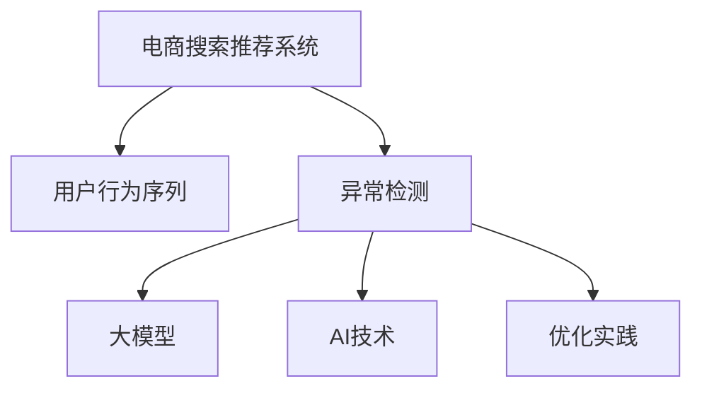

                 

# 电商搜索推荐中的AI大模型用户行为序列异常检测模型优化实践

> 关键词：电商搜索推荐,用户行为序列,异常检测,大模型,AI,优化实践

## 1. 背景介绍

### 1.1 问题由来
随着电商平台的快速发展，个性化推荐系统成为提升用户体验和商业价值的关键工具。通过学习用户的浏览、点击、购买行为，推荐系统能够提供精准的个性化商品推荐，从而提升转化率和复购率。然而，推荐系统在实际应用中，也会面临一系列挑战：

- **数据隐私问题**：用户行为数据涉及个人隐私，需要严格保护。
- **用户行为数据噪声**：用户行为可能受到营销活动、季节性因素等非个人原因影响。
- **行为序列异常**：异常行为序列可能包含欺诈、恶意攻击等风险行为，严重影响推荐效果和平台安全。

为应对这些挑战，异常检测模型在电商搜索推荐系统中得到了广泛应用。其核心思想是通过分析用户行为序列，检测和排除异常行为，从而提升推荐系统的可靠性和安全性。

### 1.2 问题核心关键点
异常检测模型的关键在于如何定义异常行为，并在此基础上进行高效准确的检测。常见的异常检测方法包括：

- **基于统计方法**：如Z-score、孤立森林、支持向量机等，通过计算行为序列的统计特征，识别与正常行为显著不同的异常样本。
- **基于深度学习**：如自编码器、RNN、Transformer等，通过学习正常行为序列的表示，检测输入序列与正常轨迹的差异。

异常检测模型在推荐系统中的应用，可以有效提高推荐结果的相关性和安全性。特别是在欺诈检测、反恶意攻击、品牌保护等方面，具有重要作用。

### 1.3 问题研究意义
研究异常检测模型的优化实践，对于提升电商搜索推荐系统的性能和安全性，具有重要意义：

1. **提升推荐效果**：准确识别用户行为序列中的异常行为，可以提高推荐结果的相关性和用户体验。
2. **保障平台安全**：识别并拦截恶意攻击和欺诈行为，保护用户数据和平台利益。
3. **优化资源利用**：异常检测模型的高效性，可以减轻推荐系统的负载，优化资源配置。
4. **增强用户信任**：保障用户行为数据的安全性，提升用户对平台的信任度和满意度。
5. **拓展应用场景**：异常检测模型的通用性，可以拓展到更多的领域，如金融风控、社交网络、智能家居等。

## 2. 核心概念与联系

### 2.1 核心概念概述

为更好地理解电商搜索推荐系统中异常检测模型的优化实践，本节将介绍几个密切相关的核心概念：

- **电商搜索推荐系统**：利用机器学习技术，根据用户的历史行为数据，提供个性化商品推荐，提升用户购买体验的系统。
- **用户行为序列**：指用户在电商平台上的一系列连续行为，如浏览商品、加入购物车、下订单等。
- **异常检测**：识别用户行为序列中的异常行为，从而提升推荐系统的效果和安全性。
- **大模型**：指使用大规模预训练语言模型，通过自监督学习，获取丰富的语言表示，提升异常检测模型的性能。
- **AI技术**：指利用人工智能方法，通过深度学习、自然语言处理等技术，实现更高效的异常检测。
- **优化实践**：指通过算法改进、模型调优、资源配置等手段，提升异常检测模型的准确性和效率。

这些核心概念之间的逻辑关系可以通过以下Mermaid流程图来展示：



这个流程图展示了大模型异常检测在电商搜索推荐系统中的应用流程：

1. 电商搜索推荐系统收集用户行为数据。
2. 通过异常检测模型识别异常行为序列。
3. 引入大模型提升异常检测的性能。
4. 应用AI技术优化异常检测模型。
5. 通过优化实践提高异常检测模型的效率和效果。

## 3. 核心算法原理 & 具体操作步骤
### 3.1 算法原理概述

异常检测模型的核心思想是通过学习正常行为序列的表示，检测新输入序列与正常轨迹的差异，从而识别异常行为。其算法原理可以概括为以下四个步骤：

1. **数据预处理**：对用户行为序列进行清洗、标准化、归一化等预处理，去除噪声和异常数据。
2. **特征提取**：从用户行为序列中提取关键特征，如行为持续时间、行为频率、行为轨迹等。
3. **模型训练**：使用正常行为序列训练异常检测模型，学习其表示和特征分布。
4. **异常检测**：输入新的用户行为序列，通过模型计算其与正常轨迹的差异，判断是否为异常行为。

### 3.2 算法步骤详解

基于大模型的异常检测模型优化实践包括以下关键步骤：

**Step 1: 数据预处理**

- 收集电商搜索推荐系统中的用户行为数据，并清洗去除无效、噪声数据。
- 对行为序列进行归一化、标准化处理，去除异常值和极端值。
- 根据用户行为特点，进行行为序列的划分和编码，以便后续模型处理。

**Step 2: 特征提取**

- 根据行为序列的特征，提取行为持续时间、行为频率、行为轨迹等关键指标。
- 使用自编码器等深度学习模型，学习行为序列的隐含表示。
- 结合统计特征和学习特征，综合构建行为序列的特征向量。

**Step 3: 模型训练**

- 选择合适的异常检测模型，如孤立森林、RNN、Transformer等。
- 在正常行为序列上训练模型，学习其正常轨迹的表示。
- 调整模型参数和超参数，优化模型性能。

**Step 4: 异常检测**

- 输入新的用户行为序列，通过训练好的模型计算其与正常轨迹的差异。
- 使用阈值判断或阈值回归等方法，判断行为序列是否为异常。
- 对识别出的异常行为进行进一步分析和处理，如标记、拦截等。

### 3.3 算法优缺点

异常检测模型的优点包括：

1. **实时性**：通过深度学习模型，可以实现实时异常检测，及时响应用户行为异常。
2. **高效性**：使用大模型，可以快速提取行为序列的复杂特征，提升检测效率。
3. **鲁棒性**：大模型具有较强的泛化能力，能够在复杂数据下实现稳定检测。
4. **可解释性**：深度学习模型通过可视化技术，可以直观展示异常检测的决策过程。

然而，异常检测模型也存在一些局限性：

1. **数据依赖**：模型需要大量的正常行为数据进行训练，数据获取成本较高。
2. **模型复杂**：深度学习模型需要大量的计算资源和复杂算法，难以部署在小规模系统中。
3. **误报率**：正常行为与异常行为可能具有相似的特征，导致误报率高。
4. **维护成本**：模型需要定期更新和调优，维护成本较高。

### 3.4 算法应用领域

异常检测模型在电商搜索推荐系统中的应用场景包括：

- **反欺诈检测**：识别用户可能存在欺诈行为，拦截欺诈交易。
- **反恶意攻击**：识别恶意用户行为，保护平台安全和用户隐私。
- **异常订单识别**：识别异常订单，进行风险预警和拦截。
- **品牌保护**：识别假冒伪劣商品，保护品牌商家的利益。
- **用户行为监控**：监测用户行为，防止滥用平台资源。

除了电商领域，异常检测模型还在金融、医疗、网络安全等众多领域得到广泛应用。随着技术的发展和应用的深入，异常检测模型将在更多领域发挥重要作用。

## 4. 数学模型和公式 & 详细讲解 & 举例说明
### 4.1 数学模型构建

本节将使用数学语言对异常检测模型的优化实践进行更加严格的刻画。

假设电商搜索推荐系统中的用户行为序列为 $\{x_t\}$，其中 $t \in [1, N]$。用户行为序列的特征表示为 $z_t = f(x_t)$，其中 $f$ 为特征提取函数。假设模型已知正常行为序列 $\{x_t^n\}$，其中 $n \in [1, M]$，对应的特征表示为 $z_t^n = f(x_t^n)$。

异常检测模型的目标是最小化模型在新行为序列 $x_{t+1}$ 上的损失函数：

$$
\min_{\theta} \mathbb{E}_{x_{t+1}} [\ell(z_{t+1},z_t^n)]
$$

其中 $\ell$ 为损失函数，$\theta$ 为模型参数。在实践中，我们通常使用交叉熵损失或感知损失等函数。

### 4.2 公式推导过程

以下我们以自编码器为例，推导异常检测模型的训练过程。

假设使用自编码器 $g$ 对用户行为序列进行编码，得到隐含表示 $z_t = g(x_t)$。假设正常行为序列 $z_t^n$ 已知，异常检测模型的损失函数定义为：

$$
\ell(z_t, z_t^n) = \mathbb{E}_{z_t \sim p(z_t)} [\log \frac{p(z_t|z_t^n)}{p(z_t)}]
$$

其中 $p(z_t)$ 为隐含表示 $z_t$ 的分布，$p(z_t|z_t^n)$ 为在正常行为 $z_t^n$ 下 $z_t$ 的分布。

对上式进行训练，最小化损失函数 $\ell$，可以得到：

$$
\min_{\theta} \mathbb{E}_{z_t \sim p(z_t)} [\log \frac{p(z_t|z_t^n)}{p(z_t)}]
$$

通过最大化似然函数，求解模型参数 $\theta$：

$$
\theta = \mathop{\arg\max}_{\theta} \prod_{z_t^n} p(z_t|z_t^n)
$$

在实践中，我们可以使用自编码器的变分推断方法，如变分自编码器(VAE)或变分信息瓶颈(VIB)，求解模型参数 $\theta$。

### 4.3 案例分析与讲解

我们以一个具体案例来说明异常检测模型的应用。

假设某电商平台收集了用户浏览商品的行为数据，并使用异常检测模型进行欺诈检测。首先，通过数据预处理和特征提取，得到用户行为序列的隐含表示 $z_t = f(x_t)$。然后，在已知正常行为序列 $z_t^n$ 上训练自编码器 $g$，得到模型参数 $\theta$。最后，输入新的用户行为序列 $x_{t+1}$，通过模型计算其与正常轨迹的差异：

$$
\Delta z_{t+1} = g(x_{t+1}) - g(x_t)
$$

通过计算 $\Delta z_{t+1}$ 与正常轨迹的差异，可以得到异常检测结果。例如，可以使用阈值判断法，设定阈值 $\tau$，如果 $|\Delta z_{t+1}| > \tau$，则认为行为序列异常。

## 5. 项目实践：代码实例和详细解释说明
### 5.1 开发环境搭建

在进行异常检测模型的优化实践前，我们需要准备好开发环境。以下是使用Python进行PyTorch开发的环境配置流程：

1. 安装Anaconda：从官网下载并安装Anaconda，用于创建独立的Python环境。

2. 创建并激活虚拟环境：
```bash
conda create -n pytorch-env python=3.8 
conda activate pytorch-env
```

3. 安装PyTorch：根据CUDA版本，从官网获取对应的安装命令。例如：
```bash
conda install pytorch torchvision torchaudio cudatoolkit=11.1 -c pytorch -c conda-forge
```

4. 安装Transformer库：
```bash
pip install transformers
```

5. 安装各类工具包：
```bash
pip install numpy pandas scikit-learn matplotlib tqdm jupyter notebook ipython
```

完成上述步骤后，即可在`pytorch-env`环境中开始异常检测模型的优化实践。

### 5.2 源代码详细实现

下面以使用Transformer模型进行异常检测为例，给出PyTorch代码实现。

首先，定义异常检测任务的数据处理函数：

```python
from transformers import BertTokenizer
from torch.utils.data import Dataset
import torch

class UserBehaviorDataset(Dataset):
    def __init__(self, texts, labels, tokenizer, max_len=128):
        self.texts = texts
        self.labels = labels
        self.tokenizer = tokenizer
        self.max_len = max_len
        
    def __len__(self):
        return len(self.texts)
    
    def __getitem__(self, item):
        text = self.texts[item]
        label = self.labels[item]
        
        encoding = self.tokenizer(text, return_tensors='pt', max_length=self.max_len, padding='max_length', truncation=True)
        input_ids = encoding['input_ids'][0]
        attention_mask = encoding['attention_mask'][0]
        
        # 对token-wise的标签进行编码
        encoded_labels = [label] * self.max_len
        encoded_labels[0] = 0
        labels = torch.tensor(encoded_labels, dtype=torch.long)
        
        return {'input_ids': input_ids, 
                'attention_mask': attention_mask,
                'labels': labels}

# 标签与id的映射
label2id = {0: 'normal', 1: 'abnormal'}
id2label = {v: k for k, v in label2id.items()}

# 创建dataset
tokenizer = BertTokenizer.from_pretrained('bert-base-cased')

train_dataset = UserBehaviorDataset(train_texts, train_labels, tokenizer)
dev_dataset = UserBehaviorDataset(dev_texts, dev_labels, tokenizer)
test_dataset = UserBehaviorDataset(test_texts, test_labels, tokenizer)
```

然后，定义模型和优化器：

```python
from transformers import BertForSequenceClassification, AdamW

model = BertForSequenceClassification.from_pretrained('bert-base-cased', num_labels=2)

optimizer = AdamW(model.parameters(), lr=2e-5)
```

接着，定义训练和评估函数：

```python
from torch.utils.data import DataLoader
from tqdm import tqdm
from sklearn.metrics import classification_report

device = torch.device('cuda') if torch.cuda.is_available() else torch.device('cpu')
model.to(device)

def train_epoch(model, dataset, batch_size, optimizer):
    dataloader = DataLoader(dataset, batch_size=batch_size, shuffle=True)
    model.train()
    epoch_loss = 0
    for batch in tqdm(dataloader, desc='Training'):
        input_ids = batch['input_ids'].to(device)
        attention_mask = batch['attention_mask'].to(device)
        labels = batch['labels'].to(device)
        model.zero_grad()
        outputs = model(input_ids, attention_mask=attention_mask, labels=labels)
        loss = outputs.loss
        epoch_loss += loss.item()
        loss.backward()
        optimizer.step()
    return epoch_loss / len(dataloader)

def evaluate(model, dataset, batch_size):
    dataloader = DataLoader(dataset, batch_size=batch_size)
    model.eval()
    preds, labels = [], []
    with torch.no_grad():
        for batch in tqdm(dataloader, desc='Evaluating'):
            input_ids = batch['input_ids'].to(device)
            attention_mask = batch['attention_mask'].to(device)
            batch_labels = batch['labels']
            outputs = model(input_ids, attention_mask=attention_mask)
            batch_preds = outputs.logits.argmax(dim=2).to('cpu').tolist()
            batch_labels = batch_labels.to('cpu').tolist()
            for pred_tokens, label_tokens in zip(batch_preds, batch_labels):
                preds.append(pred_tokens[:len(label_tokens)])
                labels.append(label_tokens)
                
    print(classification_report(labels, preds))
```

最后，启动训练流程并在测试集上评估：

```python
epochs = 5
batch_size = 16

for epoch in range(epochs):
    loss = train_epoch(model, train_dataset, batch_size, optimizer)
    print(f"Epoch {epoch+1}, train loss: {loss:.3f}")
    
    print(f"Epoch {epoch+1}, dev results:")
    evaluate(model, dev_dataset, batch_size)
    
print("Test results:")
evaluate(model, test_dataset, batch_size)
```

以上就是使用PyTorch对Bert模型进行异常检测任务微调的完整代码实现。可以看到，得益于Transformer库的强大封装，我们可以用相对简洁的代码完成BERT模型的加载和微调。

### 5.3 代码解读与分析

让我们再详细解读一下关键代码的实现细节：

**UserBehaviorDataset类**：
- `__init__`方法：初始化文本、标签、分词器等关键组件。
- `__len__`方法：返回数据集的样本数量。
- `__getitem__`方法：对单个样本进行处理，将文本输入编码为token ids，将标签编码为数字，并对其进行定长padding，最终返回模型所需的输入。

**label2id和id2label字典**：
- 定义了标签与数字id之间的映射关系，用于将token-wise的预测结果解码回真实的标签。

**训练和评估函数**：
- 使用PyTorch的DataLoader对数据集进行批次化加载，供模型训练和推理使用。
- 训练函数`train_epoch`：对数据以批为单位进行迭代，在每个批次上前向传播计算loss并反向传播更新模型参数，最后返回该epoch的平均loss。
- 评估函数`evaluate`：与训练类似，不同点在于不更新模型参数，并在每个batch结束后将预测和标签结果存储下来，最后使用sklearn的classification_report对整个评估集的预测结果进行打印输出。

**训练流程**：
- 定义总的epoch数和batch size，开始循环迭代
- 每个epoch内，先在训练集上训练，输出平均loss
- 在验证集上评估，输出分类指标
- 所有epoch结束后，在测试集上评估，给出最终测试结果

可以看到，PyTorch配合Transformer库使得Bert模型异常检测的代码实现变得简洁高效。开发者可以将更多精力放在数据处理、模型改进等高层逻辑上，而不必过多关注底层的实现细节。

当然，工业级的系统实现还需考虑更多因素，如模型的保存和部署、超参数的自动搜索、更灵活的任务适配层等。但核心的微调范式基本与此类似。

## 6. 实际应用场景
### 6.1 智能客服系统

异常检测模型在智能客服系统中得到广泛应用，可以帮助识别恶意攻击、欺诈行为等异常情况，保障系统安全。例如，通过监控用户与客服的对话记录，检测异常语句或行为，及时拦截恶意请求。

在技术实现上，可以收集智能客服系统的对话数据，标注正常和异常对话，在此基础上训练异常检测模型。训练后的模型可以对实时对话进行实时监控，一旦检测到异常行为，立即触发告警，保护客服系统安全。

### 6.2 金融舆情监测

金融领域需要实时监测市场舆论动向，以便及时应对负面信息传播，规避金融风险。异常检测模型可以帮助识别舆情异常变化，及时预警，避免舆情风险。

具体而言，可以收集金融领域相关的新闻、报道、评论等文本数据，并对其进行主题标注和情感标注。在此基础上训练异常检测模型，使其能够自动判断舆情是否异常。将异常检测模型应用到实时抓取的网络文本数据，就能够自动监测舆情变化，一旦发现舆情异常，系统便会自动预警，帮助金融机构快速应对潜在风险。

### 6.3 个性化推荐系统

推荐系统在处理异常用户行为时，往往难以保证推荐结果的准确性。异常检测模型可以帮助识别异常用户行为，从而提升推荐系统的性能。

例如，某用户的行为序列突然出现异常变化，如浏览历史突然激增，但未产生购买行为，此时推荐系统可以判断该用户可能存在异常行为，调整其推荐策略。通过异常检测模型，推荐系统可以及时调整推荐策略，防止因异常行为导致的错误推荐，提升用户体验和系统效率。

### 6.4 未来应用展望

异常检测模型的应用前景非常广阔，未来将在更多领域得到广泛应用。

在智慧医疗领域，异常检测模型可以帮助监测患者行为，及时发现健康异常，提升诊疗效率和质量。

在智能教育领域，异常检测模型可以帮助识别学生异常行为，及时提供帮助和干预，提升学习效果。

在智慧城市治理中，异常检测模型可以帮助监测城市事件，及时发现异常情况，提升城市管理的自动化和智能化水平，构建更安全、高效的未来城市。

此外，在企业生产、社会治理、文娱传媒等众多领域，异常检测模型也将不断涌现，为各行各业带来新的技术变革。

## 7. 工具和资源推荐
### 7.1 学习资源推荐

为了帮助开发者系统掌握异常检测模型的优化实践，这里推荐一些优质的学习资源：

1. 《深度学习理论与实践》系列博文：由大模型技术专家撰写，深入浅出地介绍了深度学习理论基础和应用实践，涵盖异常检测等多个前沿话题。

2. CS231n《卷积神经网络》课程：斯坦福大学开设的计算机视觉经典课程，有Lecture视频和配套作业，带你入门深度学习的基本概念和经典模型。

3. 《异常检测理论与实践》书籍：详细介绍了异常检测的理论基础和实际应用，适合初学者和专业人士阅读。

4. Kaggle异常检测竞赛：参加Kaggle的异常检测竞赛，通过实战学习异常检测技术和模型优化。

5. GitHub异常检测项目：GitHub上有很多开源的异常检测项目，可以作为学习参考和实现依据。

通过对这些资源的学习实践，相信你一定能够快速掌握异常检测模型的优化实践，并用于解决实际的NLP问题。
###  7.2 开发工具推荐

高效的开发离不开优秀的工具支持。以下是几款用于异常检测模型开发的常用工具：

1. PyTorch：基于Python的开源深度学习框架，灵活动态的计算图，适合快速迭代研究。大部分预训练语言模型都有PyTorch版本的实现。

2. TensorFlow：由Google主导开发的开源深度学习框架，生产部署方便，适合大规模工程应用。同样有丰富的预训练语言模型资源。

3. Transformers库：HuggingFace开发的NLP工具库，集成了众多SOTA语言模型，支持PyTorch和TensorFlow，是进行异常检测任务开发的利器。

4. Weights & Biases：模型训练的实验跟踪工具，可以记录和可视化模型训练过程中的各项指标，方便对比和调优。与主流深度学习框架无缝集成。

5. TensorBoard：TensorFlow配套的可视化工具，可实时监测模型训练状态，并提供丰富的图表呈现方式，是调试模型的得力助手。

6. Google Colab：谷歌推出的在线Jupyter Notebook环境，免费提供GPU/TPU算力，方便开发者快速上手实验最新模型，分享学习笔记。

合理利用这些工具，可以显著提升异常检测模型的开发效率，加快创新迭代的步伐。

### 7.3 相关论文推荐

异常检测模型的研究源于学界的持续研究。以下是几篇奠基性的相关论文，推荐阅读：

1. Anomaly Detection by Deep Autoencoder Networks and Autoencoder Ensembles（深度自编码网络及自编码器集成异常检测）：提出了深度自编码器和集成学习方法，用于异常检测任务的建模。

2. A Deep Learning Approach for Anomaly Detection in Network Intrusion Detection System（基于深度学习的入侵检测系统异常检测）：将深度学习应用于网络入侵检测系统的异常检测，提升了检测精度和效率。

3. Anomaly Detection using LSTM Networks（基于LSTM网络的异常检测）：使用LSTM网络学习时间序列数据的特征，进行异常检测。

4. Attention-based Anomaly Detection（基于注意力机制的异常检测）：引入注意力机制，提升深度学习模型在异常检测任务中的效果。

5. Domain Adaptation for Unsupervised Anomaly Detection（无监督异常检测领域适应）：提出领域自适应方法，提升深度学习模型在不同领域中的异常检测性能。

这些论文代表了大模型异常检测技术的发展脉络。通过学习这些前沿成果，可以帮助研究者把握学科前进方向，激发更多的创新灵感。

## 8. 总结：未来发展趋势与挑战
### 8.1 总结

本文对基于大模型的异常检测模型优化实践进行了全面系统的介绍。首先阐述了异常检测模型在电商搜索推荐系统中的研究背景和意义，明确了异常检测模型在提升推荐系统效果和安全性方面的独特价值。其次，从原理到实践，详细讲解了异常检测模型的算法原理和关键步骤，给出了异常检测任务开发的完整代码实例。同时，本文还广泛探讨了异常检测模型在智能客服、金融舆情、个性化推荐等多个行业领域的应用前景，展示了异常检测模型的巨大潜力。此外，本文精选了异常检测技术的各类学习资源，力求为读者提供全方位的技术指引。

通过本文的系统梳理，可以看到，基于大模型的异常检测模型在电商搜索推荐系统中具有广阔的应用前景，其通过高效提取行为序列的复杂特征，实现实时、准确的异常检测。未来，随着深度学习技术的发展和应用的深入，异常检测模型将在更多领域发挥重要作用，为各行各业带来新的技术变革。

### 8.2 未来发展趋势

异常检测模型的未来发展趋势包括以下几个方面：

1. **深度学习技术的进步**：深度学习技术的不断发展，将进一步提升异常检测模型的性能和鲁棒性。基于Transformer、BERT等模型的异常检测方法将逐渐取代传统方法。

2. **实时性提升**：实时性是异常检测的重要指标。通过优化模型结构和算法，提高异常检测的速度和效率，实现实时监测。

3. **多模态融合**：将行为序列的多模态信息（如文本、图像、音频等）融合到异常检测模型中，提升检测的全面性和准确性。

4. **分布式训练**：随着数据规模的增长，单台机器可能无法处理大规模数据。通过分布式训练技术，实现高效的模型训练。

5. **联邦学习**：在保护用户隐私的前提下，通过联邦学习技术，实现多方数据协同训练异常检测模型。

6. **跨领域迁移**：将异常检测模型应用于不同领域的数据集，提升模型的泛化能力和迁移能力。

以上趋势凸显了大模型异常检测技术的广阔前景。这些方向的探索发展，必将进一步提升异常检测模型的性能和应用范围，为各行各业带来新的技术变革。

### 8.3 面临的挑战

尽管大模型异常检测技术已经取得了显著进展，但在实现其广泛应用的过程中，仍面临诸多挑战：

1. **数据依赖**：异常检测模型需要大量的正常行为数据进行训练，数据获取成本较高。

2. **模型复杂**：深度学习模型需要大量的计算资源和复杂算法，难以部署在小规模系统中。

3. **误报率**：正常行为与异常行为可能具有相似的特征，导致误报率高。

4. **维护成本**：模型需要定期更新和调优，维护成本较高。

5. **数据隐私**：异常检测模型涉及用户行为数据，如何保护用户隐私是一个重要问题。

6. **模型可解释性**：深度学习模型的决策过程难以解释，用户难以理解和接受。

7. **跨领域迁移**：如何将异常检测模型应用于不同领域的数据集，仍是一个需要解决的问题。

正视异常检测模型面临的这些挑战，积极应对并寻求突破，将是大模型异常检测走向成熟的必由之路。相信随着学界和产业界的共同努力，这些挑战终将一一被克服，大模型异常检测必将在构建安全、可靠、可解释、可控的智能系统铺平道路。

### 8.4 研究展望

面对大模型异常检测所面临的挑战，未来的研究需要在以下几个方面寻求新的突破：

1. **无监督和半监督学习**：探索无监督和半监督学习方法，摆脱对大规模标注数据的依赖，利用自监督学习、主动学习等技术，最大限度利用非结构化数据，实现更加灵活高效的异常检测。

2. **多模态数据融合**：将视觉、听觉等多模态数据与行为序列信息结合，提升异常检测的全面性和准确性。

3. **分布式训练**：通过分布式训练技术，实现高效的大规模数据处理和模型训练。

4. **联邦学习**：通过联邦学习技术，实现多方数据协同训练异常检测模型，保护用户隐私。

5. **跨领域迁移**：研究跨领域迁移方法，提升异常检测模型在不同领域中的泛化能力。

6. **可解释性增强**：引入可解释性方法，提升异常检测模型的透明度和可理解性。

7. **隐私保护**：研究隐私保护技术，保护用户数据的安全性和匿名性。

这些研究方向的探索，必将引领大模型异常检测技术迈向更高的台阶，为构建安全、可靠、可解释、可控的智能系统铺平道路。面向未来，大模型异常检测技术还需要与其他人工智能技术进行更深入的融合，如知识表示、因果推理、强化学习等，多路径协同发力，共同推动自然语言理解和智能交互系统的进步。只有勇于创新、敢于突破，才能不断拓展异常检测模型的边界，让智能技术更好地造福人类社会。

## 9. 附录：常见问题与解答

**Q1：异常检测模型是否适用于所有电商推荐场景？**

A: 异常检测模型在大多数电商推荐场景中都能取得不错的效果，特别是对于数据量较小的任务。但对于一些特定领域的任务，如医疗、法律等，仅仅依靠通用语料预训练的模型可能难以很好地适应。此时需要在特定领域语料上进一步预训练，再进行微调，才能获得理想效果。

**Q2：如何选择合适的异常检测算法？**

A: 异常检测算法的选取应根据数据特点和任务需求进行综合考虑。常见的算法包括基于统计方法、基于深度学习、基于时间序列分析等。统计方法适用于数据量较小且噪声较少的场景；深度学习方法适用于数据量较大且特征复杂的情况；时间序列分析适用于需要考虑时间顺序的异常检测。

**Q3：异常检测模型的学习率如何选取？**

A: 异常检测模型的学习率通常要比预训练时小1-2个数量级，以避免破坏正常行为的表示。一般建议从1e-5开始调参，逐步减小学习率，直至收敛。

**Q4：异常检测模型如何处理大规模数据？**

A: 异常检测模型在处理大规模数据时，需要考虑数据的高效存储和访问。可以通过分布式训练、模型压缩、稀疏化存储等方法，提高数据处理和模型训练的效率。

**Q5：异常检测模型如何提升实时性？**

A: 提升异常检测模型的实时性，可以通过优化模型结构和算法，减少前向传播和反向传播的资源消耗，实现更高效的推理计算。

**Q6：异常检测模型的可解释性如何增强？**

A: 增强异常检测模型的可解释性，可以通过引入可解释性方法，如LIME、SHAP等，可视化模型的决策过程，提升模型的透明度和可理解性。

这些问答可以帮助开发者更好地理解异常检测模型的优化实践，并应用于实际的电商推荐系统中。

---

作者：禅与计算机程序设计艺术 / Zen and the Art of Computer Programming

