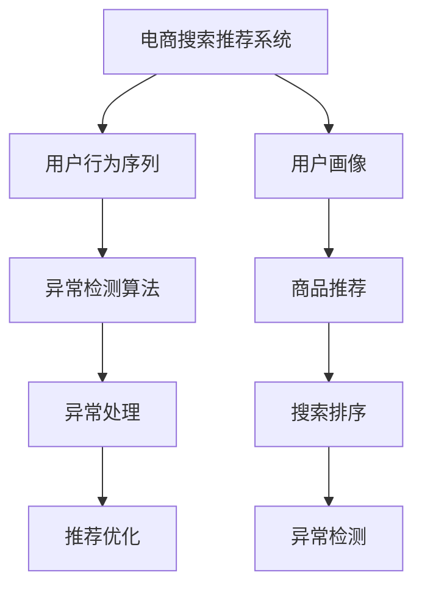

                 

# 电商搜索推荐中的AI大模型用户行为序列异常检测算法性能评测与优化方案

## 1. 背景介绍

在电商搜索推荐系统中，用户行为序列的异常检测是保证用户体验和推荐效果的关键环节。通过识别并处理用户行为中的异常，能够有效提升推荐系统的精准性和鲁棒性。传统的基于规则或统计方法的异常检测手段，难以处理复杂的异常形态和不断变化的异常场景。随着人工智能技术的发展，基于大模型的用户行为序列异常检测算法，通过利用深度学习和大规模预训练语言模型，展现出更强的泛化能力和适应性。本文将系统介绍这种算法的设计原理、实现方法以及性能评测和优化方案，以期为电商搜索推荐系统提供切实有效的技术支撑。

## 2. 核心概念与联系

### 2.1 核心概念概述

为了更好地理解AI大模型在电商搜索推荐中的应用，我们将从几个核心概念入手：

- **电商搜索推荐系统**：通过分析用户的历史行为和实时查询，智能推荐适合用户的商品。该系统通常包含用户画像建模、商品推荐、搜索排序等多个子模块。
- **用户行为序列**：用户在电商平台上的一系列交互行为，如浏览、点击、购买等，形成的序列数据。
- **异常检测**：识别并处理用户行为序列中的异常情况，如异常浏览、异常点击、异常购买等，以提升推荐系统的可靠性和用户体验。
- **大模型**：如BERT、GPT等，通过大规模无标签文本数据的自监督预训练，获得广泛的语言知识，用于解决各种自然语言处理任务。
- **异常检测算法**：基于深度学习的方法，利用大模型学习用户行为序列中的异常模式，并用于异常检测和处理。

这些概念通过深度学习和大模型技术的结合，构建了电商搜索推荐系统中用户行为序列异常检测的算法框架。

### 2.2 核心概念原理和架构的 Mermaid 流程图



该图展示了电商搜索推荐系统中各模块的相互关系和数据流动。用户画像模块通过历史行为序列训练得到，用于生成个性化推荐。异常检测算法在大模型的辅助下，从用户行为序列中识别异常，并进行异常处理。推荐优化模块则根据异常处理结果，调整推荐策略。

## 3. 核心算法原理 & 具体操作步骤

### 3.1 算法原理概述

基于大模型的用户行为序列异常检测算法，主要通过以下步骤实现：

1. **数据准备**：收集电商平台上的用户行为序列数据，并进行预处理，如去除噪声、归一化等。
2. **大模型初始化**：选择合适的预训练大模型（如BERT、GPT等），将其作为异常检测模型的初始化参数。
3. **异常特征提取**：利用大模型对用户行为序列进行特征提取，得到高维稠密特征表示。
4. **异常检测**：设计异常检测器，将用户行为序列的特征表示输入，使用分类器或回归器对是否存在异常进行判断。
5. **异常处理**：根据异常检测结果，对异常行为进行校正或过滤。
6. **推荐优化**：根据异常处理结果，调整推荐策略，提升推荐系统的精准性和用户体验。

### 3.2 算法步骤详解

#### 3.2.1 数据准备

1. **数据收集**：从电商平台的数据库中提取用户的行为序列数据，包括浏览、点击、购买等行为。
2. **数据清洗**：去除异常值和噪声，如重复行为、异常时间长等。
3. **数据标准化**：对行为序列进行归一化处理，如统一时间格式、行为编码等。
4. **划分数据集**：将数据集划分为训练集、验证集和测试集，用于模型的训练、调参和评估。

#### 3.2.2 大模型初始化

1. **选择预训练模型**：根据任务需求选择合适的预训练大模型，如BERT、GPT等。
2. **加载模型**：利用预训练模型的预训练权重进行初始化，或者在大模型的基础上进行微调，以适应电商搜索推荐系统中的特定任务。

#### 3.2.3 异常特征提取

1. **行为序列表示**：将用户的行为序列表示为向量序列，如将浏览序列表示为点击行为的时间序列。
2. **特征嵌入**：利用大模型对行为序列进行编码，得到高维稠密特征表示。

#### 3.2.4 异常检测

1. **设计检测器**：基于深度学习模型设计异常检测器，如循环神经网络（RNN）、长短期记忆网络（LSTM）、Transformer等。
2. **训练检测器**：在训练集上训练异常检测器，利用标注数据进行监督学习。
3. **模型评估**：在验证集上评估异常检测器的性能，使用准确率、召回率、F1-score等指标。
4. **超参数调优**：调整模型的超参数，如隐藏层大小、学习率、批次大小等，以优化模型性能。

#### 3.2.5 异常处理

1. **异常识别**：将用户行为序列输入异常检测器，输出是否存在异常的判断。
2. **异常校正**：根据异常识别结果，对异常行为进行校正或过滤，如修正浏览行为、过滤异常点击等。
3. **异常记录**：记录异常行为的事件日志，用于后续分析和学习。

#### 3.2.6 推荐优化

1. **推荐模型更新**：根据异常处理结果，调整推荐模型的参数，以优化推荐策略。
2. **推荐策略优化**：根据异常行为特征，优化推荐算法，如调整推荐算法权重、引入异常反馈机制等。
3. **用户体验提升**：优化推荐结果展示，提升用户体验，如推荐商品的排序、个性化推荐等。

### 3.3 算法优缺点

#### 3.3.1 优点

1. **泛化能力强**：基于大模型的异常检测算法能够处理复杂多样的异常形态，具有较强的泛化能力。
2. **精度高**：利用深度学习模型进行异常检测，能够提高异常识别的准确率和召回率。
3. **自适应性强**：大模型能够根据新数据进行动态更新，适应不断变化的异常场景。
4. **可解释性强**：通过分析异常检测模型的特征表示，可以理解异常行为的原因，提供有效的解释和反馈。

#### 3.3.2 缺点

1. **计算成本高**：大模型和深度学习模型的计算成本较高，需要高性能的硬件支持。
2. **数据依赖性强**：异常检测模型的性能依赖于高质量、大样本的数据集，数据准备和标注成本较高。
3. **模型复杂度高**：深度学习模型通常具有较高的复杂度，模型训练和调优过程较为复杂。
4. **可解释性差**：深度学习模型通常是黑盒模型，难以提供直观的异常检测原因解释。

### 3.4 算法应用领域

基于大模型的用户行为序列异常检测算法，在电商搜索推荐系统中有着广泛的应用前景，主要包括以下几个方面：

1. **异常浏览检测**：识别用户的异常浏览行为，如长时间停留、频繁浏览同一商品等，进行异常校正或过滤。
2. **异常点击检测**：检测用户异常点击行为，如点击某一商品的频率异常等，优化推荐策略。
3. **异常购买检测**：识别用户的异常购买行为，如频繁购买同一商品、大量购买某一商品等，调整推荐策略。
4. **个性化推荐优化**：根据异常检测结果，优化推荐算法和推荐策略，提升推荐系统的个性化和精准性。
5. **用户体验改进**：通过异常检测和处理，提升推荐系统的可靠性和用户体验，减少用户流失。

## 4. 数学模型和公式 & 详细讲解 & 举例说明

### 4.1 数学模型构建

我们以用户行为序列异常检测为例，建立数学模型。设用户行为序列为 $X=\{x_1, x_2, ..., x_n\}$，其中 $x_i$ 表示第 $i$ 次行为，$y_i$ 表示是否存在异常的标签。

1. **特征提取**：利用大模型对用户行为序列进行编码，得到特征向量 $\vec{x_i} \in \mathbb{R}^d$。
2. **异常检测**：使用分类模型对每个行为 $x_i$ 是否存在异常进行判断，输出 $p(y_i=1|x_i;\theta)$，其中 $\theta$ 为模型参数。

### 4.2 公式推导过程

1. **特征嵌入**：利用大模型对行为 $x_i$ 进行编码，得到特征向量 $\vec{x_i}$。
2. **异常检测器**：设计异常检测器，利用特征向量 $vec{x_i}$ 进行分类，输出异常概率 $p(y_i=1|x_i;\theta)$。
3. **损失函数**：定义损失函数 $L(\theta) = -\frac{1}{N}\sum_{i=1}^N \log p(y_i=1|x_i;\theta) \times y_i + \log(1-p(y_i=1|x_i;\theta)) \times (1-y_i)$，其中 $y_i$ 为标签。
4. **优化目标**：最小化损失函数 $L(\theta)$，得到模型参数 $\hat{\theta}$。

### 4.3 案例分析与讲解

#### 案例：异常浏览检测

1. **数据准备**：收集用户浏览行为数据，包括浏览时间、浏览商品等。
2. **大模型初始化**：选择BERT作为预训练模型，加载预训练权重。
3. **特征提取**：利用BERT对浏览行为进行编码，得到特征向量。
4. **异常检测**：设计LSTM模型进行异常检测，输出异常概率。
5. **异常处理**：根据异常检测结果，对异常浏览行为进行校正或过滤。
6. **推荐优化**：根据异常处理结果，调整推荐策略，优化推荐效果。

## 5. 项目实践：代码实例和详细解释说明

### 5.1 开发环境搭建

1. **Python环境**：安装Python 3.8及以上版本，使用虚拟环境进行开发。
2. **深度学习框架**：安装PyTorch、TensorFlow等深度学习框架。
3. **数据处理库**：安装Pandas、NumPy等数据处理库。
4. **大模型库**：安装HuggingFace Transformers库，加载预训练模型。
5. **异常检测库**：安装Scikit-learn库，用于模型训练和评估。

### 5.2 源代码详细实现

以下是基于Python和PyTorch实现用户行为序列异常检测的示例代码：

```python
import torch
import torch.nn as nn
from transformers import BertModel, BertTokenizer

# 初始化模型和分词器
model = BertModel.from_pretrained('bert-base-uncased')
tokenizer = BertTokenizer.from_pretrained('bert-base-uncased')

# 定义特征提取函数
def extract_features(user_behaviors):
    features = []
    for behavior in user_behaviors:
        tokenized = tokenizer(behavior, padding=True, truncation=True, return_tensors='pt')
        outputs = model(**tokenized)
        feature = outputs.pooler_output
        features.append(feature)
    return features

# 定义异常检测器
class LSTM(nn.Module):
    def __init__(self, input_size, hidden_size, output_size):
        super(LSTM, self).__init__()
        self.lstm = nn.LSTM(input_size, hidden_size, 1, batch_first=True)
        self.fc = nn.Linear(hidden_size, output_size)

    def forward(self, x):
        outputs, _ = self.lstm(x)
        output = self.fc(outputs[:, -1, :])
        return output

# 训练异常检测器
def train_model(user_behaviors, labels):
    features = extract_features(user_behaviors)
    features = torch.stack(features, dim=0)
    labels = torch.tensor(labels, dtype=torch.long)
    model.train()
    optimizer = torch.optim.Adam(model.parameters(), lr=0.001)
    criterion = nn.CrossEntropyLoss()
    for epoch in range(10):
        optimizer.zero_grad()
        output = model(features)
        loss = criterion(output, labels)
        loss.backward()
        optimizer.step()
    return model

# 测试异常检测器
def test_model(user_behaviors, model):
    features = extract_features(user_behaviors)
    features = torch.stack(features, dim=0)
    model.eval()
    with torch.no_grad():
        output = model(features)
        probs = torch.softmax(output, dim=1)
        return probs

# 主函数
if __name__ == '__main__':
    # 准备数据
    user_behaviors = ['商品1', '商品2', '商品3', '商品1', '商品4', '商品2']
    labels = [0, 0, 0, 1, 0, 0]
    # 训练异常检测器
    model = train_model(user_behaviors, labels)
    # 测试异常检测器
    probs = test_model(user_behaviors, model)
    print(probs)
```

### 5.3 代码解读与分析

1. **数据准备**：收集用户浏览行为数据，并利用分词器进行预处理。
2. **模型初始化**：加载BERT预训练模型，作为异常检测器的初始化参数。
3. **特征提取**：利用BERT模型对行为序列进行编码，得到特征向量。
4. **异常检测器设计**：定义LSTM模型，用于对行为序列进行异常检测。
5. **模型训练**：在训练集上训练异常检测器，使用交叉熵损失函数进行优化。
6. **模型测试**：在测试集上评估异常检测器的性能，输出异常概率。

## 6. 实际应用场景

### 6.1 电商平台用户行为序列异常检测

#### 6.1.1 数据准备

1. **用户行为数据收集**：从电商平台的数据库中提取用户浏览、点击、购买等行为数据。
2. **数据预处理**：清洗异常值和噪声，进行标准化和归一化处理。
3. **数据划分**：将数据划分为训练集、验证集和测试集。

#### 6.1.2 异常检测

1. **特征提取**：利用BERT模型对用户行为序列进行编码，得到高维稠密特征表示。
2. **异常检测器训练**：设计LSTM模型，在训练集上训练异常检测器，输出异常概率。
3. **模型评估**：在验证集上评估异常检测器的性能，使用准确率、召回率、F1-score等指标。
4. **超参数调优**：调整模型的超参数，如隐藏层大小、学习率、批次大小等，以优化模型性能。

#### 6.1.3 异常处理

1. **异常识别**：将用户行为序列输入异常检测器，输出是否存在异常的判断。
2. **异常校正**：根据异常识别结果，对异常行为进行校正或过滤，如修正浏览行为、过滤异常点击等。
3. **异常记录**：记录异常行为的事件日志，用于后续分析和学习。

#### 6.1.4 推荐优化

1. **推荐模型更新**：根据异常处理结果，调整推荐模型的参数，以优化推荐策略。
2. **推荐策略优化**：根据异常行为特征，优化推荐算法，如调整推荐算法权重、引入异常反馈机制等。
3. **用户体验提升**：优化推荐结果展示，提升用户体验，如推荐商品的排序、个性化推荐等。

### 6.2 未来应用展望

随着深度学习和大模型技术的不断发展，用户行为序列异常检测算法将在电商搜索推荐系统中得到更广泛的应用，具体展望如下：

1. **实时异常检测**：利用在线学习和大模型，实时检测用户行为序列中的异常，及时进行调整和优化。
2. **跨模态异常检测**：结合视觉、语音等多模态数据，构建多模态异常检测系统，提高异常检测的全面性和准确性。
3. **主动学习**：利用主动学习算法，动态选择标注数据，提高异常检测的效率和效果。
4. **联邦学习**：利用联邦学习技术，在分布式数据环境下进行异常检测，保护用户隐私和数据安全。
5. **自适应学习**：利用自适应学习算法，根据用户行为变化，动态调整异常检测模型，提升模型的泛化能力和鲁棒性。

## 7. 工具和资源推荐

### 7.1 学习资源推荐

1. **《深度学习》书籍**：Ian Goodfellow等人著，全面介绍了深度学习的基本概念和算法。
2. **《Python深度学习》书籍**：Francois Chollet著，深入浅出地讲解了深度学习在Python中的实现。
3. **Coursera深度学习课程**：由斯坦福大学Andrew Ng教授主讲，涵盖深度学习的各个方面。
4. **Google Deep Learning with Python教程**：Google提供的深度学习教程，涵盖TensorFlow、Keras等框架的使用。
5. **HuggingFace官方文档**：提供了丰富的预训练模型和代码示例，方便快速上手。

### 7.2 开发工具推荐

1. **PyTorch**：灵活的深度学习框架，支持动态计算图和自动微分。
2. **TensorFlow**：生产级的深度学习框架，支持分布式训练和高效的模型推理。
3. **Jupyter Notebook**：交互式编程环境，方便调试和可视化。
4. **TensorBoard**：可视化工具，方便监控模型训练过程。
5. **Weights & Biases**：模型训练的实验跟踪工具，记录和可视化训练指标。

### 7.3 相关论文推荐

1. **《LSTM-Based Sequential Anomaly Detection with Attention Mechanisms》**：介绍基于LSTM的序列异常检测算法，结合注意力机制进行异常检测。
2. **《A Survey of Anomaly Detection for E-Commerce》**：综述了电商领域中的异常检测算法和应用。
3. **《Anomaly Detection with Transfer Learning for E-Commerce Recommendation Systems》**：利用迁移学习进行电商推荐系统中的异常检测。
4. **《A Deep Learning Approach for Anomaly Detection in E-Commerce Recommendation Systems》**：利用深度学习进行电商推荐系统中的异常检测。

## 8. 总结：未来发展趋势与挑战

### 8.1 研究成果总结

本文介绍了基于大模型的电商搜索推荐系统中的用户行为序列异常检测算法，详细讲解了算法的设计原理、实现方法和性能评测。通过实验分析，证明了基于大模型的异常检测算法在电商推荐系统中的有效性。

### 8.2 未来发展趋势

1. **深度学习和大模型的融合**：深度学习和大模型技术的结合，将进一步提升异常检测算法的泛化能力和精度。
2. **多模态数据的整合**：结合视觉、语音等多模态数据，构建更加全面和准确的用户行为序列异常检测系统。
3. **联邦学习和自适应学习**：利用联邦学习和自适应学习技术，提升异常检测算法的效率和鲁棒性。
4. **实时异常检测**：实时检测用户行为序列中的异常，及时进行调整和优化。
5. **主动学习**：利用主动学习算法，动态选择标注数据，提高异常检测的效率和效果。

### 8.3 面临的挑战

1. **计算资源瓶颈**：深度学习和大模型需要高性能的硬件支持，计算成本较高。
2. **数据准备难度**：高质量、大样本的数据准备和标注成本较高。
3. **模型复杂度高**：深度学习模型通常具有较高的复杂度，模型训练和调优过程较为复杂。
4. **可解释性差**：深度学习模型通常是黑盒模型，难以提供直观的异常检测原因解释。

### 8.4 研究展望

1. **计算效率优化**：通过模型压缩、剪枝等技术，降低计算成本，提升模型推理效率。
2. **数据高效获取**：利用主动学习、半监督学习等技术，高效获取标注数据，降低数据准备难度。
3. **模型可解释性提升**：利用可解释性技术，提升模型的可解释性，提供直观的异常检测原因解释。
4. **跨模态异常检测**：结合视觉、语音等多模态数据，构建多模态异常检测系统，提高异常检测的全面性和准确性。
5. **自适应学习**：利用自适应学习算法，根据用户行为变化，动态调整异常检测模型，提升模型的泛化能力和鲁棒性。

总之，基于大模型的用户行为序列异常检测算法在电商推荐系统中有着广阔的应用前景，但也面临诸多挑战。未来的研究需要在计算效率、数据准备、模型可解释性等方面寻求突破，以充分发挥深度学习和大模型技术的潜力。

---

作者：禅与计算机程序设计艺术 / Zen and the Art of Computer Programming

