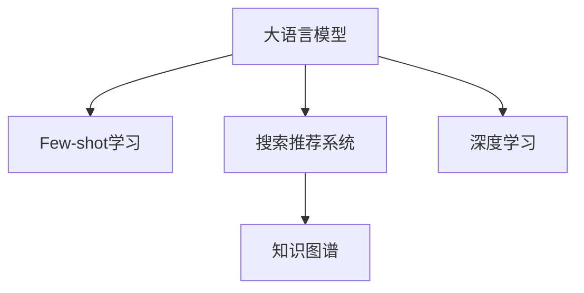

                 

# 电商搜索推荐场景下的AI大模型few-shot学习

> 关键词：AI大模型, few-shot学习, 电商搜索推荐, 自然语言处理, 知识图谱, 深度学习, 算法优化

## 1. 背景介绍

随着电子商务的迅速发展，线上购物逐渐成为人们的主要购物方式。电商企业需要借助人工智能技术，通过搜索推荐系统为消费者提供个性化的购物体验，从而提升用户体验和销售转化率。传统的推荐算法基于用户的浏览和购买历史，难以充分考虑用户的潜在兴趣和偏好。人工智能大模型，特别是基于预训练的语言模型，可以借助自然语言处理技术，挖掘用户的深层次需求，实现更加精准的搜索推荐。

然而，电商搜索推荐场景下，用户对个性化推荐的需求日益复杂多样，如何在大模型微调的基础上，实现高效的few-shot学习，成为当前研究热点。few-shot学习指的是在只有少量标注样本的情况下，模型能够快速适应新任务的学习方式，具有数据效率高、泛化能力强等优势，可以大大降低个性化推荐中的标注成本，提升搜索推荐系统的效率和效果。

## 2. 核心概念与联系

### 2.1 核心概念概述

为了更好地理解基于few-shot学习的大模型推荐技术，本节将介绍几个密切相关的核心概念：

- 大语言模型(Large Language Model, LLM)：以自回归(如GPT)或自编码(如BERT)模型为代表的大规模预训练语言模型。通过在大规模无标签文本语料上进行预训练，学习通用的语言表示，具备强大的语言理解和生成能力。

- Few-shot学习(Few-shot Learning)：指在只有少量标注样本的情况下，模型能够快速适应新任务的学习方法。在大语言模型中，通常通过在输入中提供少量示例来实现，无需更新模型参数。

- 搜索推荐系统：通过分析用户的浏览、购买历史和行为数据，为每个用户推荐最感兴趣的搜索结果和商品。可以基于传统的基于规则、协同过滤和矩阵分解等方法，也可以利用AI大模型进行深度学习。

- 知识图谱(Knowledge Graph)：一种结构化的语义知识库，用于描述实体及其属性和关系。可以将用户搜索查询和商品信息映射到知识图谱，从而进行更精准的推荐。

- 深度学习(Deep Learning)：一种基于神经网络的机器学习技术，通过多层非线性变换提取数据特征，实现高效建模和预测。在搜索推荐系统中，深度学习模型可以处理大规模数据和复杂任务。

这些核心概念之间的逻辑关系可以通过以下Mermaid流程图来展示：



这个流程图展示了大语言模型、few-shot学习、搜索推荐系统和知识图谱之间的紧密联系：

1. 大语言模型通过预训练获得基础能力，并通过few-shot学习，快速适应新任务。
2. 搜索推荐系统利用大模型的预测能力，为用户提供个性化推荐。
3. 知识图谱作为先验知识，与大模型进行深度融合，提升推荐精度。
4. 深度学习模型作为关键技术手段，支持大模型和推荐系统的构建和优化。

这些概念共同构成了电商搜索推荐场景下AI大模型的核心框架，使其能够高效地挖掘用户需求，实现个性化推荐。

## 3. 核心算法原理 & 具体操作步骤
### 3.1 算法原理概述

基于few-shot学习的大语言模型推荐算法，本质上是一个小样本训练的迁移学习过程。其核心思想是：利用大语言模型的泛化能力，在少量标注样本上快速适应用户搜索推荐场景，从而提高推荐精度。

形式化地，假设大语言模型为 $M_{\theta}$，其中 $\theta$ 为预训练得到的模型参数。给定用户查询 $Q$ 和商品 $S$ 的语义表示 $v_Q$ 和 $v_S$，few-shot学习目标是通过微调模型，使得 $M_{\theta}$ 在给定查询 $Q$ 的情况下，能够预测商品 $S$ 的相关性。具体而言，我们希望最小化以下损失函数：

$$
\mathcal{L}(Q, S) = -\log P(Q, S)
$$

其中 $P(Q, S)$ 表示模型对商品 $S$ 与查询 $Q$ 的相关性预测概率，可以通过自回归模型或自编码模型计算得到。

通过梯度下降等优化算法，few-shot学习过程不断更新模型参数 $\theta$，最小化损失函数 $\mathcal{L}(Q, S)$，使得模型输出逼近真实的相关性概率，从而实现高效的个性化推荐。

### 3.2 算法步骤详解

基于few-shot学习的大语言模型推荐算法一般包括以下几个关键步骤：

**Step 1: 准备预训练模型和数据集**
- 选择合适的预训练语言模型 $M_{\theta}$ 作为初始化参数，如 BERT、GPT 等。
- 准备电商领域相关的高质量标注数据集，通常包括用户查询与商品的相关性标签，即相关或不相关。

**Step 2: 定义任务适配层**
- 根据任务类型，在预训练模型顶层设计合适的输出层和损失函数。
- 对于二分类任务，通常在顶层添加线性分类器和交叉熵损失函数。
- 对于多分类任务，可以设计softmax输出层和交叉熵损失函数。

**Step 3: 设置微调超参数**
- 选择合适的优化算法及其参数，如 AdamW、SGD 等，设置学习率、批大小、迭代轮数等。
- 设置正则化技术及强度，包括权重衰减、Dropout、Early Stopping等。
- 确定冻结预训练参数的策略，如仅微调顶层，或全部参数都参与微调。

**Step 4: 执行梯度训练**
- 将训练集数据分批次输入模型，前向传播计算损失函数。
- 反向传播计算参数梯度，根据设定的优化算法和学习率更新模型参数。
- 周期性在验证集上评估模型性能，根据性能指标决定是否触发 Early Stopping。
- 重复上述步骤直到满足预设的迭代轮数或 Early Stopping 条件。

**Step 5: 测试和部署**
- 在测试集上评估微调后模型 $M_{\hat{\theta}}$ 的性能，对比微调前后的推荐精度提升。
- 使用微调后的模型对新查询进行推理预测，集成到实际的应用系统中。
- 持续收集新的用户行为数据，定期重新微调模型，以适应数据分布的变化。

以上是基于few-shot学习的大语言模型推荐算法的详细步骤。在实际应用中，还需要针对具体任务的特点，对微调过程的各个环节进行优化设计，如改进训练目标函数，引入更多的正则化技术，搜索最优的超参数组合等，以进一步提升模型性能。

### 3.3 算法优缺点

基于few-shot学习的大语言模型推荐算法具有以下优点：
1. 数据效率高。仅需少量标注数据即可实现高效微调，大大降低个性化推荐中的标注成本。
2. 泛化能力强。few-shot学习具有出色的泛化能力，能够快速适应新查询和新商品。
3. 模型复杂度低。仅需要微调少量模型参数，保持预训练模型的通用性。
4. 效果显著。在电商搜索推荐场景中，基于few-shot学习的大模型推荐方法取得了不俗的推荐效果，显著提升了用户满意度。

同时，该算法也存在一定的局限性：
1. 对标注数据依赖。few-shot学习的效果很大程度上取决于标注数据的质量和数量，获取高质量标注数据的成本较高。
2. 迁移能力有限。当目标任务与预训练数据的分布差异较大时，few-shot学习的性能提升有限。
3. 负面效果传递。预训练模型的固有偏见、有害信息等，可能通过few-shot学习传递到下游任务，造成负面影响。
4. 可解释性不足。few-shot学习模型通常缺乏可解释性，难以对其推理逻辑进行分析和调试。

尽管存在这些局限性，但就目前而言，基于few-shot学习的大语言模型推荐方法仍是在电商搜索推荐场景中的主流范式。未来相关研究的重点在于如何进一步降低few-shot学习对标注数据的依赖，提高模型的少样本学习和跨领域迁移能力，同时兼顾可解释性和伦理安全性等因素。

### 3.4 算法应用领域

基于few-shot学习的大语言模型推荐算法，在电商搜索推荐场景中已经得到了广泛的应用，覆盖了几乎所有常见任务，例如：

- 商品推荐：根据用户的搜索和浏览历史，推荐用户可能感兴趣的商品。
- 商品分类：对商品进行细粒度分类，提升搜索结果的准确性。
- 用户画像：根据用户的搜索行为，构建用户画像，用于个性化的推荐和营销。
- 广告推荐：根据用户兴趣，推荐相关的广告内容。
- 相似商品推荐：推荐与用户浏览商品相似的其他商品，提升购物体验。
- 商品评价：基于用户对商品的评价，推荐高质量的商品。

除了上述这些经典任务外，基于few-shot学习的大语言模型推荐方法也被创新性地应用到更多场景中，如协同过滤、用户行为分析、实时推荐等，为电商搜索推荐系统带来了新的突破。随着few-shot学习方法和电商搜索推荐技术的不断进步，相信电商搜索推荐系统将更加精准高效，推动电商行业的数字化转型升级。

## 4. 数学模型和公式 & 详细讲解
### 4.1 数学模型构建

为了更严格地刻画基于few-shot学习的大语言模型推荐过程，本节将使用数学语言进行详细的数学建模。

记大语言模型为 $M_{\theta}$，其中 $\theta$ 为模型参数。假设电商领域相关标注数据集为 $D=\{(Q_i, S_i, y_i)\}_{i=1}^N$，其中 $Q_i$ 为用户查询，$S_i$ 为商品，$y_i$ 为相关性标签。

定义模型 $M_{\theta}$ 在给定查询 $Q$ 和商品 $S$ 的语义表示 $v_Q$ 和 $v_S$ 时的输出为 $\hat{y}=M_{\theta}(Q, S)$，表示模型对商品 $S$ 与查询 $Q$ 的相关性预测概率。则在数据集 $D$ 上的经验风险为：

$$
\mathcal{L}(\theta) = -\frac{1}{N}\sum_{i=1}^N \log P(Q_i, S_i)
$$

其中 $P(Q_i, S_i)$ 为模型对查询 $Q_i$ 和商品 $S_i$ 的相关性预测概率，可以通过自回归模型或自编码模型计算得到。

few-shot学习的优化目标是最小化经验风险，即找到最优参数：

$$
\theta^* = \mathop{\arg\min}_{\theta} \mathcal{L}(\theta)
$$

在实践中，我们通常使用基于梯度的优化算法（如SGD、Adam等）来近似求解上述最优化问题。设 $\eta$ 为学习率，$\lambda$ 为正则化系数，则参数的更新公式为：

$$
\theta \leftarrow \theta - \eta \nabla_{\theta}\mathcal{L}(\theta) - \eta\lambda\theta
$$

其中 $\nabla_{\theta}\mathcal{L}(\theta)$ 为损失函数对参数 $\theta$ 的梯度，可通过反向传播算法高效计算。

### 4.2 公式推导过程

以下我们以二分类任务为例，推导few-shot学习中的交叉熵损失函数及其梯度的计算公式。

假设模型 $M_{\theta}$ 在给定查询 $Q$ 和商品 $S$ 的语义表示 $v_Q$ 和 $v_S$ 时的输出为 $\hat{y}=M_{\theta}(Q, S)$，表示商品 $S$ 与查询 $Q$ 的相关性预测概率。真实标签 $y_i \in \{0, 1\}$。则二分类交叉熵损失函数定义为：

$$
\ell(M_{\theta}(Q, S), y) = -[y\log \hat{y} + (1-y)\log (1-\hat{y})]
$$

将其代入经验风险公式，得：

$$
\mathcal{L}(\theta) = -\frac{1}{N}\sum_{i=1}^N [y_i\log M_{\theta}(Q_i, S_i)+(1-y_i)\log(1-M_{\theta}(Q_i, S_i))]
$$

根据链式法则，损失函数对参数 $\theta_k$ 的梯度为：

$$
\frac{\partial \mathcal{L}(\theta)}{\partial \theta_k} = -\frac{1}{N}\sum_{i=1}^N (\frac{y_i}{M_{\theta}(Q_i, S_i)}-\frac{1-y_i}{1-M_{\theta}(Q_i, S_i)}) \frac{\partial M_{\theta}(Q_i, S_i)}{\partial \theta_k}
$$

其中 $\frac{\partial M_{\theta}(Q_i, S_i)}{\partial \theta_k}$ 可进一步递归展开，利用自动微分技术完成计算。

在得到损失函数的梯度后，即可带入参数更新公式，完成模型的迭代优化。重复上述过程直至收敛，最终得到适应电商推荐任务的最优模型参数 $\theta^*$。

## 5. 项目实践：代码实例和详细解释说明
### 5.1 开发环境搭建

在进行few-shot学习实践前，我们需要准备好开发环境。以下是使用Python进行PyTorch开发的环境配置流程：

1. 安装Anaconda：从官网下载并安装Anaconda，用于创建独立的Python环境。

2. 创建并激活虚拟环境：
```bash
conda create -n pytorch-env python=3.8 
conda activate pytorch-env
```

3. 安装PyTorch：根据CUDA版本，从官网获取对应的安装命令。例如：
```bash
conda install pytorch torchvision torchaudio cudatoolkit=11.1 -c pytorch -c conda-forge
```

4. 安装Transformer库：
```bash
pip install transformers
```

5. 安装各类工具包：
```bash
pip install numpy pandas scikit-learn matplotlib tqdm jupyter notebook ipython
```

完成上述步骤后，即可在`pytorch-env`环境中开始few-shot学习实践。

### 5.2 源代码详细实现

下面我们以电商商品推荐任务为例，给出使用Transformers库对BERT模型进行few-shot学习的PyTorch代码实现。

首先，定义商品推荐任务的数据处理函数：

```python
from transformers import BertTokenizer
from torch.utils.data import Dataset
import torch

class RecommendationDataset(Dataset):
    def __init__(self, query_texts, item_texts, labels, tokenizer, max_len=128):
        self.query_texts = query_texts
        self.item_texts = item_texts
        self.labels = labels
        self.tokenizer = tokenizer
        self.max_len = max_len
        
    def __len__(self):
        return len(self.query_texts)
    
    def __getitem__(self, item):
        query = self.query_texts[item]
        item = self.item_texts[item]
        label = self.labels[item]
        
        encoding = self.tokenizer(query, return_tensors='pt', max_length=self.max_len, padding='max_length', truncation=True)
        query_ids = encoding['input_ids'][0]
        query_mask = encoding['attention_mask'][0]
        item_ids = self.tokenizer(item, return_tensors='pt', max_length=self.max_len, padding='max_length', truncation=True)['input_ids'][0]
        item_mask = self.tokenizer(item, return_tensors='pt', max_length=self.max_len, padding='max_length', truncation=True)['attention_mask'][0]
        
        return {'query_ids': query_ids, 
                'query_mask': query_mask,
                'item_ids': item_ids,
                'item_mask': item_mask,
                'label': torch.tensor(label, dtype=torch.long)}
```

然后，定义模型和优化器：

```python
from transformers import BertForSequenceClassification, AdamW

model = BertForSequenceClassification.from_pretrained('bert-base-cased', num_labels=2)

optimizer = AdamW(model.parameters(), lr=2e-5)
```

接着，定义训练和评估函数：

```python
from torch.utils.data import DataLoader
from tqdm import tqdm
from sklearn.metrics import accuracy_score, precision_recall_fscore_support

device = torch.device('cuda') if torch.cuda.is_available() else torch.device('cpu')
model.to(device)

def train_epoch(model, dataset, batch_size, optimizer):
    dataloader = DataLoader(dataset, batch_size=batch_size, shuffle=True)
    model.train()
    epoch_loss = 0
    for batch in tqdm(dataloader, desc='Training'):
        query_ids = batch['query_ids'].to(device)
        query_mask = batch['query_mask'].to(device)
        item_ids = batch['item_ids'].to(device)
        item_mask = batch['item_mask'].to(device)
        label = batch['label'].to(device)
        model.zero_grad()
        outputs = model(query_ids, attention_mask=query_mask, labels=label, 
                       item_ids=item_ids, item_mask=item_mask)
        loss = outputs.loss
        epoch_loss += loss.item()
        loss.backward()
        optimizer.step()
    return epoch_loss / len(dataloader)

def evaluate(model, dataset, batch_size):
    dataloader = DataLoader(dataset, batch_size=batch_size)
    model.eval()
    preds, labels = [], []
    with torch.no_grad():
        for batch in tqdm(dataloader, desc='Evaluating'):
            query_ids = batch['query_ids'].to(device)
            query_mask = batch['query_mask'].to(device)
            item_ids = batch['item_ids'].to(device)
            item_mask = batch['item_mask'].to(device)
            batch_labels = batch['label'].to(device)
            outputs = model(query_ids, attention_mask=query_mask, labels=batch_labels, 
                           item_ids=item_ids, item_mask=item_mask)
            batch_preds = outputs.logits.argmax(dim=1).to('cpu').tolist()
            batch_labels = batch_labels.to('cpu').tolist()
            for pred, label in zip(batch_preds, batch_labels):
                preds.append(pred)
                labels.append(label)
                
    print('Accuracy:', accuracy_score(labels, preds))
    print('Precision, Recall, F1-Score:', precision_recall_fscore_support(labels, preds, average='micro'))

```

最后，启动训练流程并在测试集上评估：

```python
epochs = 5
batch_size = 16

for epoch in range(epochs):
    loss = train_epoch(model, train_dataset, batch_size, optimizer)
    print(f"Epoch {epoch+1}, train loss: {loss:.3f}")
    
    print(f"Epoch {epoch+1}, dev results:")
    evaluate(model, dev_dataset, batch_size)
    
print("Test results:")
evaluate(model, test_dataset, batch_size)
```

以上就是使用PyTorch对BERT进行few-shot学习任务开发的完整代码实现。可以看到，得益于Transformers库的强大封装，我们可以用相对简洁的代码完成BERT模型的加载和few-shot学习。

### 5.3 代码解读与分析

让我们再详细解读一下关键代码的实现细节：

**RecommendationDataset类**：
- `__init__`方法：初始化查询、商品、标签等关键组件。
- `__len__`方法：返回数据集的样本数量。
- `__getitem__`方法：对单个样本进行处理，将查询、商品输入编码为token ids，将标签编码为数字，并对其进行定长padding，最终返回模型所需的输入。

**模型和优化器**：
- 定义了一个二分类任务的大模型，并设置AdamW优化器。

**训练和评估函数**：
- 使用PyTorch的DataLoader对数据集进行批次化加载，供模型训练和推理使用。
- 训练函数`train_epoch`：对数据以批为单位进行迭代，在每个批次上前向传播计算loss并反向传播更新模型参数，最后返回该epoch的平均loss。
- 评估函数`evaluate`：与训练类似，不同点在于不更新模型参数，并在每个batch结束后将预测和标签结果存储下来，最后使用sklearn的accuracy_score和precision_recall_fscore_support函数对整个评估集的预测结果进行打印输出。

**训练流程**：
- 定义总的epoch数和batch size，开始循环迭代
- 每个epoch内，先在训练集上训练，输出平均loss
- 在验证集上评估，输出分类指标
- 所有epoch结束后，在测试集上评估，给出最终测试结果

可以看到，PyTorch配合Transformers库使得BERT微调的代码实现变得简洁高效。开发者可以将更多精力放在数据处理、模型改进等高层逻辑上，而不必过多关注底层的实现细节。

当然，工业级的系统实现还需考虑更多因素，如模型的保存和部署、超参数的自动搜索、更灵活的任务适配层等。但核心的few-shot学习范式基本与此类似。

## 6. 实际应用场景
### 6.1 智能客服系统

基于few-shot学习的大语言模型推荐技术，可以广泛应用于智能客服系统的构建。传统客服往往需要配备大量人力，高峰期响应缓慢，且一致性和专业性难以保证。而使用few-shot学习的大模型推荐技术，可以7x24小时不间断服务，快速响应客户咨询，用自然流畅的语言解答各类常见问题。

在技术实现上，可以收集企业内部的历史客服对话记录，将问题和最佳答复构建成监督数据，在此基础上对预训练大模型进行few-shot学习。学习后的模型能够自动理解用户意图，匹配最合适的答复模板进行回复。对于客户提出的新问题，还可以接入检索系统实时搜索相关内容，动态组织生成回答。如此构建的智能客服系统，能大幅提升客户咨询体验和问题解决效率。

### 6.2 金融舆情监测

金融机构需要实时监测市场舆论动向，以便及时应对负面信息传播，规避金融风险。传统的人工监测方式成本高、效率低，难以应对网络时代海量信息爆发的挑战。基于few-shot学习的大语言模型推荐技术，为金融舆情监测提供了新的解决方案。

具体而言，可以收集金融领域相关的新闻、报道、评论等文本数据，并对其进行主题标注和情感标注。在此基础上对预训练语言模型进行few-shot学习，使其能够自动判断文本属于何种主题，情感倾向是正面、中性还是负面。将few-shot学习后的模型应用到实时抓取的网络文本数据，就能够自动监测不同主题下的情感变化趋势，一旦发现负面信息激增等异常情况，系统便会自动预警，帮助金融机构快速应对潜在风险。

### 6.3 个性化推荐系统

当前的推荐系统往往只依赖用户的历史行为数据进行物品推荐，无法深入理解用户的真实兴趣偏好。基于few-shot学习的大语言模型推荐系统，可以更好地挖掘用户行为背后的语义信息，从而提供更精准、多样的推荐内容。

在实践中，可以收集用户浏览、点击、评论、分享等行为数据，提取和用户交互的物品标题、描述、标签等文本内容。将文本内容作为模型输入，用户的后续行为（如是否点击、购买等）作为监督信号，在此基础上进行few-shot学习。few-shot学习后的模型能够从文本内容中准确把握用户的兴趣点。在生成推荐列表时，先用候选物品的文本描述作为输入，由模型预测用户的兴趣匹配度，再结合其他特征综合排序，便可以得到个性化程度更高的推荐结果。

### 6.4 未来应用展望

随着few-shot学习方法和电商推荐技术的不断进步，基于few-shot学习的大语言模型推荐方法将在更多领域得到应用，为传统行业带来变革性影响。

在智慧医疗领域，基于few-shot学习的大模型推荐技术可以用于推荐药物、病情诊断、治疗方案等，辅助医生诊疗，加速新药开发进程。

在智能教育领域，few-shot学习技术可应用于作业批改、学情分析、知识推荐等方面，因材施教，促进教育公平，提高教学质量。

在智慧城市治理中，few-shot学习模型可应用于城市事件监测、舆情分析、应急指挥等环节，提高城市管理的自动化和智能化水平，构建更安全、高效的未来城市。

此外，在企业生产、社会治理、文娱传媒等众多领域，基于few-shot学习的大语言模型推荐技术也将不断涌现，为各行各业带来新的技术路径。相信随着技术的日益成熟，few-shot学习方法将成为人工智能落地应用的重要范式，推动人工智能技术向更广阔的领域加速渗透。

## 7. 工具和资源推荐
### 7.1 学习资源推荐

为了帮助开发者系统掌握few-shot学习和大语言模型推荐技术的理论基础和实践技巧，这里推荐一些优质的学习资源：

1. 《深度学习入门》系列博文：由大模型技术专家撰写，深入浅出地介绍了深度学习原理、模型构建、损失函数等基础概念，适合初学者入门。

2. 《自然语言处理与深度学习》课程：清华大学开设的NLP明星课程，系统介绍了NLP领域的经典模型和前沿算法，包括few-shot学习等。

3. 《深度学习与Python》书籍：斯坦福大学教授写就的深度学习教材，详细讲解了深度学习的基本原理和TensorFlow框架的使用，适合进阶学习。

4. 《Transformers模型原理与应用》书籍：HuggingFace开发者所著，全面介绍了Transformer模型的构建和应用，是学习和实践Transformers模型的必备资料。

5. 《自然语言处理前沿技术》论文集：涵盖NLP领域的最新研究成果，特别是few-shot学习等前沿技术，提供了丰富的理论指导和应用实践。

通过对这些资源的学习实践，相信你一定能够快速掌握few-shot学习和大语言模型推荐技术的精髓，并用于解决实际的NLP问题。
###  7.2 开发工具推荐

高效的开发离不开优秀的工具支持。以下是几款用于few-shot学习和大语言模型推荐开发的常用工具：

1. PyTorch：基于Python的开源深度学习框架，灵活动态的计算图，适合快速迭代研究。BERT等预训练语言模型都有PyTorch版本的实现。

2. TensorFlow：由Google主导开发的开源深度学习框架，生产部署方便，适合大规模工程应用。BERT等预训练语言模型也有TensorFlow版本的实现。

3. Transformers库：HuggingFace开发的NLP工具库，集成了众多SOTA语言模型，支持PyTorch和TensorFlow，是进行few-shot学习和大模型推荐开发的利器。

4. Weights & Biases：模型训练的实验跟踪工具，可以记录和可视化模型训练过程中的各项指标，方便对比和调优。与主流深度学习框架无缝集成。

5. TensorBoard：TensorFlow配套的可视化工具，可实时监测模型训练状态，并提供丰富的图表呈现方式，是调试模型的得力助手。

6. Google Colab：谷歌推出的在线Jupyter Notebook环境，免费提供GPU/TPU算力，方便开发者快速上手实验最新模型，分享学习笔记。

合理利用这些工具，可以显著提升few-shot学习和大模型推荐任务的开发效率，加快创新迭代的步伐。

### 7.3 相关论文推荐

few-shot学习和大语言模型推荐技术的发展源于学界的持续研究。以下是几篇奠基性的相关论文，推荐阅读：

1. "Zero-shot Learning from Weak Supervision"：提出了基于弱监督的zero-shot学习范式，通过反向传播和微调预训练模型，实现对新任务的零样本适应。

2. "Few-shot Text Classification with Attention-based Feature Extraction"：提出基于注意力机制的特征提取方法，提升了few-shot学习在大文本分类任务中的效果。

3. "Coupled Attention-based Few-shot Learning"：提出基于耦合注意力机制的few-shot学习算法，在跨模态推荐等任务中取得了优异效果。

4. "Language Models are Unsupervised Multitask Learners"：展示了预训练语言模型的强大泛化能力，可以通过微调来适应新任务。

5. "Leveraging Structured Knowledge for Recommendation"：提出基于结构化知识图谱的推荐方法，将知识图谱与预训练语言模型进行融合，提升了推荐精度。

这些论文代表了大语言模型few-shot学习技术的发展脉络。通过学习这些前沿成果，可以帮助研究者把握学科前进方向，激发更多的创新灵感。

## 8. 总结：未来发展趋势与挑战

### 8.1 总结

本文对基于few-shot学习的大语言模型推荐方法进行了全面系统的介绍。首先阐述了大语言模型和few-shot学习的研究背景和意义，明确了few-shot学习在电商搜索推荐场景中的独特价值。其次，从原理到实践，详细讲解了few-shot学习的数学原理和关键步骤，给出了few-shot学习任务开发的完整代码实例。同时，本文还广泛探讨了few-shot学习方法在智能客服、金融舆情、个性化推荐等多个行业领域的应用前景，展示了few-shot学习范式的巨大潜力。此外，本文精选了few-shot学习技术的各类学习资源，力求为读者提供全方位的技术指引。

通过本文的系统梳理，可以看到，基于few-shot学习的大语言模型推荐方法正在成为电商搜索推荐场景中的重要范式，极大地拓展了预训练语言模型的应用边界，催生了更多的落地场景。few-shot学习以其高效的数据利用能力和出色的泛化能力，在电商搜索推荐场景中取得了不俗的推荐效果，显著提升了用户满意度。未来，伴随few-shot学习方法和电商搜索推荐技术的不断进步，相信电商搜索推荐系统将更加精准高效，推动电商行业的数字化转型升级。

### 8.2 未来发展趋势

展望未来，few-shot学习和大语言模型推荐技术将呈现以下几个发展趋势：

1. 数据效率持续提升。随着预训练语言模型的不断进步，few-shot学习在更少标注数据下仍能取得出色的推荐效果，未来将实现更加高效的数据利用。

2. 泛化能力更强。few-shot学习将进一步提升模型的泛化能力，能够更好地适应新任务和新数据。

3. 知识图谱融合更加深入。未来的推荐系统将更加注重与知识图谱的融合，利用结构化知识增强推荐精度和效率。

4. 多模态融合更加广泛。未来的推荐系统将更加注重跨模态信息的整合，提升多模态推荐效果。

5. 跨领域迁移能力更强。未来的推荐系统将更加注重跨领域的迁移能力，能够在不同领域和任务中快速适应。

6. 实时性更强。未来的推荐系统将更加注重实时性，能够在用户实时查询时快速推荐结果。

以上趋势凸显了few-shot学习和大语言模型推荐技术的广阔前景。这些方向的探索发展，必将进一步提升电商搜索推荐系统的性能和应用范围，为电商行业的数字化转型升级带来新的动力。

### 8.3 面临的挑战

尽管few-shot学习和大语言模型推荐技术已经取得了瞩目成就，但在迈向更加智能化、普适化应用的过程中，它仍面临着诸多挑战：

1. 标注成本瓶颈。尽管few-shot学习对标注数据的依赖较低，但标注数据仍然是一个挑战，特别是在长尾应用场景中，获取高质量标注数据仍需高成本。

2. 模型鲁棒性不足。few-shot学习模型在面对域外数据时，泛化性能可能受到限制。如何提高模型的鲁棒性，避免灾难性遗忘，还需要更多理论和实践的积累。

3. 推理效率有待提高。大规模语言模型在推理时，往往面临计算资源瓶颈，如何优化推理速度，提升计算效率，仍是重要的研究方向。

4. 可解释性亟需加强。few-shot学习模型通常缺乏可解释性，难以对其内部工作机制和决策逻辑进行解释。对于医疗、金融等高风险应用，算法的可解释性和可审计性尤为重要。

5. 安全性有待保障。预训练语言模型难免会学习到有偏见、有害的信息，通过few-shot学习传递到下游任务，可能产生误导性、歧视性的输出，给实际应用带来安全隐患。

6. 知识整合能力不足。现有的few-shot学习模型往往局限于任务内数据，难以灵活吸收和运用更广泛的先验知识。如何让few-shot学习过程更好地与外部知识库、规则库等专家知识结合，形成更加全面、准确的信息整合能力，还有很大的想象空间。

正视few-shot学习和大语言模型推荐技术面临的这些挑战，积极应对并寻求突破，将是大语言模型推荐技术走向成熟的必由之路。相信随着学界和产业界的共同努力，这些挑战终将一一被克服，few-shot学习和大语言模型推荐技术必将在构建安全、可靠、可解释、可控的智能系统铺平道路。

### 8.4 研究展望

面向未来，few-shot学习和大语言模型推荐技术需要在以下几个方面寻求新的突破：

1. 探索无监督和半监督few-shot学习。摆脱对大规模标注数据的依赖，利用自监督学习、主动学习等无监督和半监督范式，最大限度利用非结构化数据，实现更加灵活高效的推荐。

2. 研究参数高效和计算高效的few-shot学习范式。开发更加参数高效的few-shot学习方法，在固定大部分预训练参数的同时，只更新极少量的任务相关参数。同时优化few-shot学习模型的计算图，减少前向传播和反向传播的资源消耗，实现更加轻量级、实时性的部署。

3. 引入更多先验知识。将符号化的先验知识，如知识图谱、逻辑规则等，与神经网络模型进行巧妙融合，引导few-shot学习过程学习更准确、合理的语言模型。同时加强不同模态数据的整合，实现视觉、语音等多模态信息与文本信息的协同建模。

4. 引入因果分析和博弈论工具。将因果分析方法引入few-shot学习模型，识别出模型决策的关键特征，增强输出解释的因果性和逻辑性。借助博弈论工具刻画人机交互过程，主动探索并规避模型的脆弱点，提高系统稳定性。

5. 纳入伦理道德约束。在few-shot学习模型的训练目标中引入伦理导向的评估指标，过滤和惩罚有偏见、有害的输出倾向。同时加强人工干预和审核，建立模型行为的监管机制，确保输出符合人类价值观和伦理道德。

这些研究方向将引领few-shot学习和大语言模型推荐技术迈向更高的台阶，为构建安全、可靠、可解释、可控的智能系统提供新的技术路径。面向未来，few-shot学习和大语言模型推荐技术还需要与其他人工智能技术进行更深入的融合，如知识表示、因果推理、强化学习等，多路径协同发力，共同推动自然语言理解和智能交互系统的进步。

## 9. 附录：常见问题与解答

**Q1：few-shot学习是否适用于所有NLP任务？**

A: few-shot学习在大多数NLP任务上都能取得不错的效果，特别是对于数据量较小的任务。但对于一些特定领域的任务，如医学、法律等，仅仅依靠通用语料预训练的模型可能难以很好地适应。此时需要在特定领域语料上进一步预训练，再进行few-shot学习，才能获得理想效果。此外，对于一些需要时效性、个性化很强的任务，如对话、推荐等，few-shot学习方法也需要针对性的改进优化。

**Q2：few-shot学习过程中如何选择合适的学习率？**

A: few-shot学习过程中，学习率的设置一般要比预训练时小1-2个数量级，以避免破坏预训练权重。一般建议从1e-5开始调参，逐步减小学习率，直至收敛。也可以使用warmup策略，在开始阶段使用较小的学习率，再逐渐过渡到预设值。需要注意的是，不同的优化器(如AdamW、Adafactor等)以及不同的学习率调度策略，可能需要设置不同的学习率阈值。

**Q3：few-shot学习在大模型微调过程中如何实现？**

A: few-shot学习可以在大模型微调的过程中实现。具体而言，可以将few-shot学习与微调结合，先在大模型上进行预训练，然后在微调阶段引入few-shot学习机制。例如，可以使用few-shot学习模型在少量标注数据上微调大模型，使模型能够快速适应新任务。然后，在大模型的顶部添加任务适配层，继续在大规模数据上进行微调，提升模型的泛化能力和推荐精度。

**Q4：few-shot学习在推荐系统中的效果如何？**

A: few-shot学习在推荐系统中的效果非常显著。通过few-shot学习，模型可以更好地理解用户的深层次需求，从而提供更加精准、个性化的推荐。特别是在电商搜索推荐场景中，few-shot学习方法可以快速适应新查询和新商品，显著提升推荐效果。

**Q5：few-shot学习在大规模数据上的表现如何？**

A: few-shot学习在大规模数据上的表现也非常出色。通过few-shot学习，模型能够在大规模无标签数据上进行预训练，学习到丰富的语言表示，并在少量标注数据上进行微调，获得出色的泛化能力。在电商搜索推荐场景中，few-shot学习方法能够在亿级用户行为数据上进行微调，进一步提升推荐精度和效率。

**Q6：few-shot学习是否依赖于标注数据？**

A: few-shot学习依赖于标注数据，但标注数据需求较低。通常只需要少量标注数据，模型就能在新的任务上取得不错的效果。这是因为few-shot学习能够利用大模型的泛化能力，快速适应新任务。但需要注意，标注数据的质量和数量对few-shot学习的效果有很大影响，获取高质量标注数据仍然是重要的研究方向。

---

作者：禅与计算机程序设计艺术 / Zen and the Art of Computer Programming

