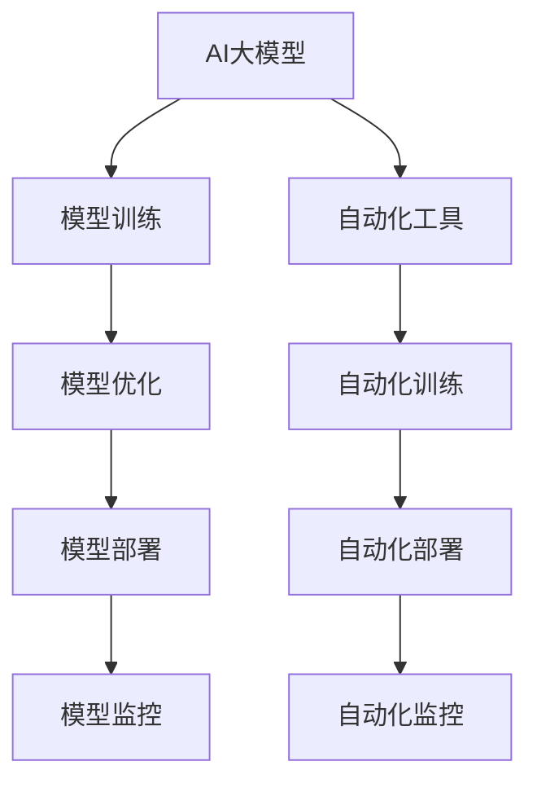

                 

# 电商搜索推荐场景下的AI大模型模型部署全流程自动化工具选型

> 关键词：电商搜索推荐、AI大模型、模型部署、自动化工具选型、深度学习、计算机视觉、自然语言处理

## 1. 背景介绍

随着人工智能技术的不断进步，深度学习在大规模分布式系统中得到了广泛的应用。尤其是在电商搜索推荐场景中，利用人工智能技术提升用户体验和销售转化率成为企业关注的焦点。本文将深入探讨在电商搜索推荐场景下，如何选择合适的AI大模型模型部署和自动化工具，以实现全流程的自动化和高效部署。

## 2. 核心概念与联系

### 2.1 核心概念概述

在进行电商搜索推荐场景的AI大模型部署和自动化工具选型时，需要理解以下核心概念：

- **AI大模型**：指通过大规模数据训练得到的复杂深度学习模型，如BERT、GPT-3等。这些模型在自然语言处理（NLP）、计算机视觉（CV）等领域具备强大的表现力。
- **模型部署**：指将训练好的模型封装并部署到目标环境，使其能够在实际应用中运行的过程。
- **自动化工具**：指能够自动完成模型训练、部署、监控等步骤的工具。

这些核心概念之间的逻辑关系可以通过以下Mermaid流程图来展示：



这个流程图展示了大模型的全生命周期管理，从模型训练到部署再到监控的完整流程。

## 3. 核心算法原理 & 具体操作步骤

### 3.1 算法原理概述

电商搜索推荐场景下的AI大模型部署和自动化工具选型，需要基于深度学习模型在不同场景下的优化和应用。这些模型通常包含多个层级，包括编码器、解码器、注意力机制等，用于从输入数据中提取特征，并进行复杂任务的处理。

### 3.2 算法步骤详解

在电商搜索推荐场景中，AI大模型的部署和自动化工具选型主要包括以下步骤：

1. **数据预处理**：收集、清洗和标注数据集，并进行特征工程，如向量化处理等。
2. **模型训练**：使用预处理后的数据集训练大模型，并进行超参数调优和模型优化。
3. **模型部署**：将训练好的模型封装成可部署的组件，并部署到目标环境中。
4. **模型监控和优化**：对部署后的模型进行实时监控，根据性能指标进行调整和优化。

### 3.3 算法优缺点

电商搜索推荐场景下的AI大模型部署和自动化工具选型具有以下优点：

- **高效性**：通过自动化工具的辅助，可以大幅缩短模型训练和部署的时间。
- **可扩展性**：自动化工具支持大规模分布式训练，能够处理海量数据。
- **一致性**：自动化工具能够保证模型在不同环境下的性能一致性。

然而，这些方法也存在以下缺点：

- **资源消耗大**：大规模数据和模型的训练和部署需要大量的计算资源。
- **复杂度高**：需要考虑数据预处理、模型训练、部署等多个环节，容易出现错误。
- **鲁棒性不足**：自动化工具可能无法完全处理所有异常情况。

### 3.4 算法应用领域

电商搜索推荐场景下的AI大模型部署和自动化工具选型，主要应用于以下领域：

- **推荐系统**：通过分析用户行为和偏好，推荐个性化商品。
- **图像识别**：用于商品分类和相似度匹配。
- **自然语言处理**：用于用户查询理解、商品描述分析等。

## 4. 数学模型和公式 & 详细讲解 & 举例说明

### 4.1 数学模型构建

在电商搜索推荐场景中，常用的数学模型包括卷积神经网络（CNN）、循环神经网络（RNN）、注意力机制等。这些模型的构建通常需要以下步骤：

1. **输入表示**：将输入数据（如文本、图像）转换为模型可以处理的向量表示。
2. **模型结构设计**：选择合适的网络结构，如卷积层、循环层、注意力机制等。
3. **损失函数设计**：选择合适的损失函数，如交叉熵、均方误差等，用于衡量模型预测与真实标签的差异。
4. **优化器选择**：选择合适的优化器，如Adam、SGD等，用于更新模型参数。

### 4.2 公式推导过程

以推荐系统为例，我们可以使用以下公式来描述推荐系统的预测过程：

$$
\hat{y} = f(x; \theta)
$$

其中，$x$ 表示用户的历史行为数据，$\theta$ 表示模型参数，$f$ 表示模型函数。

### 4.3 案例分析与讲解

以商品推荐系统为例，假设我们有一个包含100个用户和1000个商品的推荐系统。我们可以通过以下步骤来构建模型：

1. **数据预处理**：收集用户的浏览、点击、购买等行为数据，并将其转换为向量表示。
2. **模型训练**：使用预处理后的数据集训练推荐模型，并进行超参数调优。
3. **模型部署**：将训练好的模型封装成可部署的组件，并部署到目标环境中。
4. **模型监控**：对部署后的模型进行实时监控，根据性能指标进行调整和优化。

## 5. 项目实践：代码实例和详细解释说明

### 5.1 开发环境搭建

在进行电商搜索推荐场景的AI大模型部署和自动化工具选型时，需要搭建以下开发环境：

1. **操作系统**：选择Linux或Windows操作系统，根据实际需求选择合适的版本。
2. **编程语言**：选择Python或C++等语言，根据实际需求选择合适的版本。
3. **深度学习框架**：选择TensorFlow或PyTorch等深度学习框架，根据实际需求选择合适的版本。
4. **分布式计算框架**：选择Spark或Hadoop等分布式计算框架，根据实际需求选择合适的版本。

### 5.2 源代码详细实现

以下是使用TensorFlow进行电商推荐系统模型部署的示例代码：

```python
import tensorflow as tf

# 定义模型结构
model = tf.keras.Sequential([
    tf.keras.layers.Dense(128, activation='relu', input_shape=(10,)),
    tf.keras.layers.Dense(64, activation='relu'),
    tf.keras.layers.Dense(1, activation='sigmoid')
])

# 编译模型
model.compile(optimizer=tf.keras.optimizers.Adam(0.01), loss='binary_crossentropy', metrics=['accuracy'])

# 训练模型
model.fit(x_train, y_train, epochs=10, batch_size=32)

# 评估模型
model.evaluate(x_test, y_test)

# 保存模型
model.save('recommendation_model.h5')
```

### 5.3 代码解读与分析

这段代码展示了使用TensorFlow进行电商推荐系统模型部署的过程。首先定义了模型的结构，包括输入层、隐藏层和输出层。然后编译模型，选择Adam优化器和二元交叉熵损失函数。接着训练模型，使用随机梯度下降（SGD）优化器，并在训练集上进行10个epoch的训练。最后评估模型性能，并保存模型文件。

## 6. 实际应用场景

### 6.1 推荐系统

推荐系统是电商搜索推荐场景中最核心的应用之一。通过深度学习模型，可以分析用户的历史行为和偏好，预测用户对商品的兴趣，从而推荐个性化的商品。推荐系统可以显著提升用户体验和销售转化率。

### 6.2 图像识别

图像识别技术在电商搜索推荐场景中也得到了广泛应用。通过深度学习模型，可以识别商品的图片，进行分类和相似度匹配。这有助于提升商品检索的准确性和效率。

### 6.3 自然语言处理

自然语言处理技术在电商搜索推荐场景中同样重要。通过深度学习模型，可以分析用户的查询，提取关键词和语义信息，从而提供更加精准的搜索结果。

### 6.4 未来应用展望

随着深度学习技术的不断发展，电商搜索推荐场景下的AI大模型部署和自动化工具选型也将迎来新的机遇和挑战。未来，我们可以探索更多先进的深度学习模型，如Transformer、BERT等，以及更多的自动化工具，如TF-Serving、Kubeflow等，以实现更高效、更灵活的电商搜索推荐系统。

## 7. 工具和资源推荐

### 7.1 学习资源推荐

为了帮助开发者深入理解电商搜索推荐场景下的AI大模型部署和自动化工具选型，这里推荐一些优质的学习资源：

1. **TensorFlow官方文档**：TensorFlow是深度学习领域的权威框架，其官方文档详细介绍了TensorFlow的使用方法。
2. **PyTorch官方文档**：PyTorch是另一大深度学习框架，其官方文档也提供了详细的教程和示例。
3. **Kubeflow官方文档**：Kubeflow是一个开源平台，用于在Kubernetes上进行机器学习、深度学习的应用。
4. **GitHub上的推荐系统项目**：GitHub上有许多优秀的推荐系统项目，可以从中学习和借鉴。

### 7.2 开发工具推荐

以下是几款用于电商搜索推荐场景下AI大模型部署和自动化工具选型的常用工具：

1. **TensorFlow**：TensorFlow是深度学习领域的领先框架，具有灵活的API设计和高效的计算图。
2. **Kubeflow**：Kubeflow是Kubernetes的深度学习扩展，提供了机器学习模型的部署和管理工具。
3. **TensorBoard**：TensorBoard是TensorFlow的可视化工具，可以实时监测模型训练和推理的过程。
4. **Jupyter Notebook**：Jupyter Notebook是一个交互式的开发环境，适合快速迭代和调试模型。

### 7.3 相关论文推荐

电商搜索推荐场景下的AI大模型部署和自动化工具选型涉及多个前沿领域，以下是几篇相关的经典论文：

1. **"Deep Neural Networks for Large-Scale Image Recognition"**：AlexNet论文，首次提出了卷积神经网络在大规模图像识别中的应用。
2. **"Learning Phrase Representations using RNN Encoder Decoder for Statistical Machine Translation"**：LSTM论文，提出了循环神经网络在序列数据处理中的应用。
3. **"Attention Is All You Need"**：Transformer论文，提出了自注意力机制在序列数据处理中的应用。

## 8. 总结：未来发展趋势与挑战

### 8.1 总结

本文对电商搜索推荐场景下的AI大模型部署和自动化工具选型进行了全面系统的介绍。首先阐述了电商搜索推荐场景的背景和意义，明确了模型部署和自动化工具选型的重要性和可行性。其次，从原理到实践，详细讲解了电商搜索推荐场景中AI大模型的训练和部署流程，给出了模型部署的完整代码示例。同时，本文还探讨了电商搜索推荐场景下的实际应用场景，展示了模型部署和自动化工具选型的广泛应用前景。

### 8.2 未来发展趋势

展望未来，电商搜索推荐场景下的AI大模型部署和自动化工具选型将呈现以下几个发展趋势：

1. **模型规模增大**：随着计算资源的不断增加，深度学习模型的规模将不断增大，能够处理更复杂的数据和任务。
2. **模型效率提升**：通过优化模型结构和计算图，能够进一步提升模型的推理速度和效率。
3. **自动化工具升级**：自动化工具将进一步发展和完善，能够自动完成更多的任务，如数据预处理、模型训练、部署等。
4. **跨领域融合**：深度学习模型将与其他领域的模型进行更深入的融合，如计算机视觉、自然语言处理等，实现更全面的应用。

### 8.3 面临的挑战

尽管电商搜索推荐场景下的AI大模型部署和自动化工具选型取得了一定的进展，但在实际应用中仍然面临诸多挑战：

1. **资源消耗大**：大规模数据和模型的训练和部署需要大量的计算资源，成本较高。
2. **模型鲁棒性不足**：模型在面对异常数据和噪声时，鲁棒性不足，容易产生错误的预测。
3. **系统复杂度高**：电商搜索推荐系统涉及多个环节，系统设计和部署复杂度高，容易出现错误。

### 8.4 研究展望

面对电商搜索推荐场景下的AI大模型部署和自动化工具选型的挑战，未来的研究需要在以下几个方面寻求新的突破：

1. **模型压缩**：开发更加高效的模型压缩技术，减少模型参数和计算资源消耗。
2. **模型优化**：优化模型结构和计算图，提升模型的推理速度和效率。
3. **自动化工具改进**：改进自动化工具，增加其功能和灵活性，自动完成更多的任务。
4. **跨领域融合**：与其他领域的模型进行深入融合，实现更全面的应用。

通过这些研究方向的探索和发展，我们相信电商搜索推荐场景下的AI大模型部署和自动化工具选型将实现更大的进步，推动电商搜索推荐系统的应用和发展。

## 9. 附录：常见问题与解答

**Q1：电商搜索推荐场景下，如何选择适合的AI大模型？**

A: 在选择电商搜索推荐场景下适用的AI大模型时，需要考虑以下几个因素：
- 数据量和类型：选择适合处理大规模数据和复杂数据类型的模型，如卷积神经网络（CNN）、循环神经网络（RNN）、Transformer等。
- 任务需求：选择适合特定任务的模型，如推荐系统、图像识别、自然语言处理等。
- 计算资源：考虑模型训练和部署所需的计算资源，选择适合自身计算环境的模型。

**Q2：电商搜索推荐场景下，如何进行模型训练和优化？**

A: 在电商搜索推荐场景下，进行模型训练和优化主要包括以下步骤：
- 数据预处理：收集、清洗和标注数据集，并进行特征工程。
- 模型设计：选择合适的网络结构，如卷积层、循环层、注意力机制等。
- 模型训练：使用预处理后的数据集训练大模型，并进行超参数调优和模型优化。
- 模型评估：在测试集上评估模型性能，根据评估结果进行进一步优化。

**Q3：电商搜索推荐场景下，如何进行模型部署和监控？**

A: 在电商搜索推荐场景下，进行模型部署和监控主要包括以下步骤：
- 模型部署：将训练好的模型封装成可部署的组件，并部署到目标环境中。
- 模型监控：对部署后的模型进行实时监控，根据性能指标进行调整和优化。

通过这些步骤，可以确保模型在实际应用中的高效性和稳定性，满足电商搜索推荐场景的需求。

