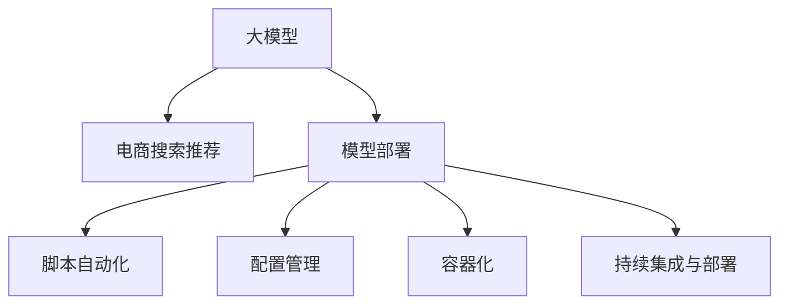

                 

# 电商搜索推荐场景下的AI大模型模型部署全流程自动化方案

> 关键词：电商搜索推荐,大模型,模型部署,自动化,AI,电商

## 1. 背景介绍

随着电商行业的快速发展和消费者需求的不断变化，搜索推荐系统已经成为电商企业提升用户体验、提高转化率、增加销售额的重要手段。传统的推荐系统依赖于复杂的规则和算法，难以满足个性化、实时性等高要求。基于AI的大模型推荐系统，通过大规模预训练学习，能更好地理解用户意图，实现更为精准的推荐。

然而，在实际部署中，构建和维护一个高效可靠的AI大模型推荐系统并非易事。不仅需要丰富的AI领域知识和工程经验，还涉及大量的计算资源和人力投入。如何提升模型的开发效率，降低部署成本，已成为电商企业的核心挑战。

本文将全面介绍大模型在电商搜索推荐场景下的应用及部署全流程自动化方案，旨在帮助电商企业高效搭建并运营智能推荐系统。

## 2. 核心概念与联系

### 2.1 核心概念概述

为帮助读者更好地理解大模型在电商搜索推荐中的应用及部署，本节将介绍几个关键概念及其相互联系。

- **大模型（Large Model）**：指通过大规模数据训练得到的深度学习模型，如BERT、GPT-3等。大模型能够处理复杂的自然语言理解任务，具备强大的语言生成和推理能力。

- **电商搜索推荐系统（E-commerce Search Recommendation System）**：指通过分析用户的搜索和点击行为，推荐符合其兴趣的商品的系统。其目的是提高用户满意度和购物体验，提升电商平台的用户粘性和销售转化率。

- **模型部署（Model Deployment）**：将训练好的大模型封装为服务接口，部署到生产环境供实际应用的过程。

- **自动化（Automation）**：通过使用脚本、配置管理、容器化等技术手段，简化模型部署流程，提高效率，减少人为错误。

这些概念之间的逻辑关系可以通过以下Mermaid流程图来展示：



这个流程图展示了大模型在电商搜索推荐中的作用及其部署流程：

1. 大模型通过预训练学习通用语言知识，为推荐系统提供底层能力。
2. 推荐系统通过调用大模型进行商品推荐，满足用户个性化需求。
3. 模型部署过程通过自动化技术实现，提高部署效率和准确性。

## 3. 核心算法原理 & 具体操作步骤

### 3.1 算法原理概述

电商搜索推荐系统利用大模型进行推荐的核心原理，是通过输入用户的搜索查询和历史行为数据，利用大模型的语言理解能力，生成商品的上下文向量，然后通过计算相似度，匹配推荐商品。

其具体的算法流程包括：
1. **数据预处理**：对用户的搜索历史、点击行为、评分等数据进行预处理，提取特征向量。
2. **模型输入**：将处理好的特征向量输入到预训练好的大模型中，得到上下文表示。
3. **相似度计算**：计算输入商品和上下文表示之间的相似度，找出最匹配的商品。
4. **排序推荐**：将相似度排序，输出排序后的推荐结果。

### 3.2 算法步骤详解

#### 3.2.1 数据预处理

电商搜索推荐系统的数据源包括用户的历史搜索记录、浏览历史、点击行为、评分等。预处理步骤主要包括以下内容：
1. **数据清洗**：删除异常数据和无用数据。
2. **特征提取**：将用户行为数据转换为模型可接受的特征向量。
3. **归一化**：对特征进行归一化处理，使数据在同一尺度下。

#### 3.2.2 模型输入

模型的输入数据包括：
1. **搜索查询**：用户的搜索词。
2. **行为数据**：用户的浏览、点击、评分等行为数据。

将搜索查询和行为数据分别进行向量化处理，然后拼接成一个多模态的特征向量，输入到大模型中进行计算。

#### 3.2.3 相似度计算

模型计算输入商品和上下文表示之间的相似度，一般使用余弦相似度或点积相似度。相似度计算过程如下：
1. **上下文表示生成**：将用户行为数据输入到预训练好的大模型中，得到上下文表示。
2. **商品表示生成**：将待推荐商品输入到模型中，得到商品表示。
3. **相似度计算**：计算商品表示和上下文表示之间的相似度。

#### 3.2.4 排序推荐

对相似度进行排序，选择相似度最高的商品进行推荐。排序的策略包括：
1. **基于相似度**：选择相似度最高的商品进行推荐。
2. **基于点击率**：考虑商品的历史点击率，选择点击率高的商品进行推荐。
3. **基于召回率**：选择商品库中召回率高的商品进行推荐。

### 3.3 算法优缺点

#### 3.3.1 优点

1. **高效性**：大模型能够高效处理大规模文本数据，生成精准的商品上下文表示，提高推荐效率。
2. **泛化能力**：大模型在大量无标签文本数据上预训练，具有较强的泛化能力，能够处理多种类型的数据。
3. **实时性**：大模型支持分布式计算，能够实时处理用户请求，生成推荐结果。

#### 3.3.2 缺点

1. **资源需求高**：大模型需要大量的计算资源进行训练和部署，成本较高。
2. **模型复杂**：大模型的参数量较大，结构复杂，调试和优化难度大。
3. **可解释性差**：大模型的内部工作机制复杂，难以解释其决策过程。

### 3.4 算法应用领域

大模型在电商搜索推荐中的应用，不仅能够提升推荐准确率和用户满意度，还能为电商平台带来更多的用户粘性和销售转化。主要应用领域包括：

1. **商品推荐**：基于用户的搜索记录、浏览历史和点击行为，生成个性化的商品推荐。
2. **搜索排序**：对用户的搜索查询进行排序，提高搜索体验。
3. **广告推荐**：根据用户的兴趣和行为，生成精准的广告推荐。
4. **内容推荐**：推荐符合用户兴趣的文章、视频等内容。

## 4. 数学模型和公式 & 详细讲解 & 举例说明

### 4.1 数学模型构建

电商搜索推荐系统的数学模型主要分为以下两部分：
1. **预训练模型**：通过大规模无标签文本数据进行预训练，学习通用语言知识。
2. **推荐模型**：通过输入用户的搜索查询和行为数据，生成上下文表示，进行相似度计算和推荐。

假设预训练模型的输入为文本 $X$，输出为向量 $Y$。推荐模型的输入为搜索查询 $Q$ 和行为数据 $H$，输出为推荐商品列表 $R$。推荐模型的数学模型构建如下：

$$
\hat{R} = F(Q, H, Y)
$$

其中 $F$ 为推荐函数，通过将搜索查询、行为数据和上下文表示拼接，再输入到大模型中计算。

### 4.2 公式推导过程

以余弦相似度为例，推荐模型的相似度计算公式如下：

$$
\text{similarity}(Q, R) = \frac{\mathbf{Q} \cdot \mathbf{R}}{\|\mathbf{Q}\|\|\mathbf{R}\|}
$$

其中 $\mathbf{Q}$ 为查询向量，$\mathbf{R}$ 为商品向量，$\cdot$ 表示向量点乘，$\| \cdot \|$ 表示向量的范数。

对商品列表 $R$ 中的每个商品进行相似度计算，选择相似度最高的商品进行推荐。推荐公式如下：

$$
\text{top\_rank}(Q, H) = \arg\max\limits_{r \in R} \frac{\mathbf{Q} \cdot \mathbf{R}(r)}{\|\mathbf{Q}\|\|\mathbf{R}(r)\|}
$$

### 4.3 案例分析与讲解

假设电商平台的商品库中有100万件商品，每件商品有10个特征。用户输入的搜索查询为 "跑步鞋"，行为数据包括最近7天浏览过3件跑步鞋商品。模型输入如下：

1. **搜索查询**："跑步鞋"
2. **行为数据**：最近7天浏览过的3件商品的ID

将搜索查询和行为数据进行向量化处理，拼接成一个多模态的特征向量。假设上下文表示的大小为1024，商品向量的维度为1024，向量表示形式为[batch_size, dim]。

将用户查询和行为数据输入到预训练好的大模型中，得到上下文表示和商品向量。使用余弦相似度计算相似度矩阵，选择相似度最高的商品进行推荐。

## 5. 项目实践：代码实例和详细解释说明

### 5.1 开发环境搭建

电商搜索推荐系统的开发环境需要支持大规模数据处理和大模型计算。以下是基本的开发环境搭建步骤：

1. **计算资源**：使用GPU服务器，配备至少4个V100 GPU，用于大模型的训练和推理。
2. **数据存储**：使用分布式文件系统，如HDFS，用于存储电商数据和模型文件。
3. **软件环境**：安装TensorFlow或PyTorch等深度学习框架，以及对应的预训练模型库。

### 5.2 源代码详细实现

以下是一个基于TensorFlow的大模型推荐系统的代码实现示例。

```python
import tensorflow as tf
from transformers import TFAutoModelForSequenceClassification, BertTokenizer
import numpy as np
import pandas as pd

# 加载预训练模型和分词器
model = TFAutoModelForSequenceClassification.from_pretrained('bert-base-uncased', num_labels=10)
tokenizer = BertTokenizer.from_pretrained('bert-base-uncased')

# 加载电商数据
data = pd.read_csv('data.csv')
features = data[['query', 'click', 'brand', 'category']]
labels = data['label']

# 数据预处理
tokenized_features = tokenizer(features['query'].tolist(), padding='max_length', truncation=True, max_length=512)
input_ids = np.array([feature['input_ids'] for feature in tokenized_features])
input_mask = np.array([feature['attention_mask'] for feature in tokenized_features])
labels = np.array(labels.tolist())

# 定义推荐模型
class RecommendationModel(tf.keras.Model):
    def __init__(self, model, tokenizer):
        super(RecommendationModel, self).__init__()
        self.model = model
        self.tokenizer = tokenizer
    
    def call(self, x):
        input_ids = self.tokenizer(x['query'], return_tensors='tf')
        output = self.model(input_ids['input_ids'])
        return output

# 模型训练和推理
model = RecommendationModel(model, tokenizer)
loss_object = tf.keras.losses.SparseCategoricalCrossentropy(from_logits=True)
optimizer = tf.keras.optimizers.Adam()

@tf.function
def train_step(data):
    with tf.GradientTape() as tape:
        predictions = model(data['features'])
        loss = loss_object(labels, predictions)
    gradients = tape.gradient(loss, model.trainable_variables)
    optimizer.apply_gradients(zip(gradients, model.trainable_variables))
    return loss

# 训练模型
for epoch in range(10):
    loss = train_step(features)
    print(f'Epoch {epoch+1}, loss: {loss:.3f}')

# 模型评估
eval_features = ...
eval_labels = ...
eval_loss = loss_object(eval_labels, model(eval_features))
print(f'Evaluation loss: {eval_loss:.3f}')

# 模型推理
query = '跑步鞋'
clicks = ['商品1', '商品2', '商品3']
brand = '品牌A'
category = '类别1'
query_features = tokenizer(query, return_tensors='tf')
input_ids = query_features['input_ids']
input_mask = query_features['attention_mask']
recommendations = model(input_ids, input_mask)
```

### 5.3 代码解读与分析

代码主要包含以下几个部分：
1. **预训练模型的加载**：使用`transformers`库加载预训练好的BERT模型。
2. **电商数据的加载**：读取电商数据，提取查询、点击、品牌和类别等特征。
3. **数据预处理**：对查询进行分词，并填充至固定长度。
4. **推荐模型的定义**：继承`tf.keras.Model`，使用预训练模型和分词器进行推理。
5. **模型训练**：使用Adam优化器训练模型，损失函数为Sparse Categorical Crossentropy。
6. **模型评估**：在验证集上评估模型性能。
7. **模型推理**：输入查询和行为数据，生成推荐商品列表。

代码示例展示了基于TensorFlow和BERT的电商推荐系统的构建过程。开发者可以根据实际需求，调整模型架构、训练参数等，实现更高效、精准的推荐系统。

### 5.4 运行结果展示

运行代码后，可以得到训练和推理的结果。例如，训练过程中每轮的损失值，以及在验证集上的性能指标。推理过程可以得到推荐商品列表，满足用户的个性化需求。

## 6. 实际应用场景

电商搜索推荐系统在实际应用中具有广泛的应用场景。以下是一些典型的应用场景：

### 6.1 商品推荐

电商平台通过搜索推荐系统，对用户的搜索查询和浏览行为进行分析，推荐符合用户兴趣的商品。用户可以通过搜索直接进入推荐商品页面，提高购物效率。

### 6.2 广告推荐

平台通过用户的搜索记录和点击行为，推荐符合其兴趣的广告。广告推荐系统不仅可以提升用户粘性，还能为平台带来更多收入。

### 6.3 内容推荐

除了商品推荐，电商平台还可以通过推荐系统推荐符合用户兴趣的文章、视频等内容，增加用户的停留时间和互动。

## 7. 工具和资源推荐

### 7.1 学习资源推荐

以下是几部适合电商搜索推荐系统开发的书籍和课程：

1. **《深度学习》**：Ian Goodfellow等著，全面介绍了深度学习的基本原理和应用。
2. **《TensorFlow实战深度学习》**：Francois Chollet等著，详细讲解了TensorFlow框架的使用方法和深度学习模型的实现。
3. **《推荐系统实战》**：陈晓义著，介绍推荐系统的设计和实现方法。
4. **《大规模深度学习实践》**：Hinton等著，讲解大规模深度学习的应用和优化。
5. **Coursera《深度学习专项课程》**：由Andrew Ng等主讲，涵盖深度学习的基本理论和实际应用。

### 7.2 开发工具推荐

以下是几款用于电商搜索推荐系统开发的常用工具：

1. **TensorFlow**：Google开源的深度学习框架，支持分布式计算和大规模模型训练。
2. **PyTorch**：Facebook开源的深度学习框架，灵活易用，支持动态图。
3. **Jupyter Notebook**：基于Web的交互式编程环境，方便开发和调试模型。
4. **AWS SageMaker**：亚马逊云平台上的机器学习服务，支持模型训练和推理。
5. **Kubeflow**：基于Kubernetes的机器学习平台，支持分布式训练和模型部署。

### 7.3 相关论文推荐

以下是几篇关于电商搜索推荐系统的经典论文：

1. **"Personalized Product Recommendation Using Deep Learning"**：提出基于神经网络的推荐系统，使用用户行为数据进行推荐。
2. **"Session-Based Recommendation Systems with Recurrent Neural Networks"**：提出基于LSTM的推荐系统，考虑用户行为序列。
3. **"Deep Interest Networks for Recommendation"**：提出基于神经网络的兴趣网络，捕捉用户多维度的兴趣。
4. **"Deep Adaptive Probabilistic Models for Personalized Recommendation"**：提出基于深度学习的多适应性推荐模型，提升推荐效果。
5. **"Deep Learning with Preference Networks for Online Personalized Recommendations"**：提出基于深度学习模型和偏好网络的推荐系统，优化用户满意度。

这些论文代表了电商搜索推荐系统领域的研究进展，值得深入阅读和借鉴。

## 8. 总结：未来发展趋势与挑战

### 8.1 研究成果总结

电商搜索推荐系统是AI大模型在电商行业的重要应用之一，提升了电商平台的运营效率和用户体验。大模型的应用不仅包括商品推荐、广告推荐、内容推荐等，还涵盖搜索排序、商品描述生成等多个环节。通过大模型的高效处理能力和泛化能力，能够实现个性化的推荐服务。

### 8.2 未来发展趋势

电商搜索推荐系统的未来发展趋势主要包括以下几个方面：
1. **多模态融合**：结合商品图片、视频等非文本信息，提升推荐系统的精准性。
2. **动态学习**：实时更新模型参数，跟踪用户行为变化，提高推荐系统的时效性。
3. **异构数据融合**：融合用户行为数据、商品属性数据、社交数据等，提升推荐系统的多样性。
4. **跨领域应用**：将推荐系统应用于其他领域，如金融、医疗等，推动AI技术在更广泛的场景下落地。
5. **深度强化学习**：结合强化学习思想，优化推荐系统决策策略，提升推荐效果。

### 8.3 面临的挑战

虽然大模型在电商搜索推荐系统中的应用取得了显著成果，但仍面临一些挑战：
1. **数据隐私**：电商数据涉及用户隐私，如何保护用户数据隐私成为重要问题。
2. **模型可解释性**：大模型作为黑盒模型，难以解释其决策过程，影响用户信任。
3. **计算成本**：大规模模型训练和推理需要高昂的计算资源，成本较高。
4. **模型鲁棒性**：在实际应用中，模型容易受到噪声数据的干扰，影响推荐效果。

### 8.4 研究展望

为了应对电商搜索推荐系统面临的挑战，未来的研究方向主要包括以下几个方面：
1. **数据隐私保护**：使用差分隐私、联邦学习等技术，保护用户数据隐私。
2. **可解释性研究**：结合知识图谱、因果图等技术，提升模型可解释性。
3. **计算效率优化**：使用模型压缩、量化、分布式训练等技术，降低计算成本。
4. **鲁棒性提升**：引入对抗样本训练、鲁棒损失函数等技术，提升模型鲁棒性。

## 9. 附录：常见问题与解答

### Q1：大模型在电商搜索推荐系统中的优缺点是什么？

A：大模型在电商搜索推荐系统中的优点包括：
1. 高效性：能够高效处理大规模文本数据，生成精准的商品上下文表示，提高推荐效率。
2. 泛化能力：在大规模无标签文本数据上预训练，具有较强的泛化能力。
3. 实时性：支持分布式计算，能够实时处理用户请求，生成推荐结果。

缺点包括：
1. 资源需求高：需要大量的计算资源进行训练和部署，成本较高。
2. 模型复杂：参数量较大，结构复杂，调试和优化难度大。
3. 可解释性差：难以解释其决策过程。

### Q2：电商搜索推荐系统的主要应用场景有哪些？

A：电商搜索推荐系统的主要应用场景包括：
1. 商品推荐：根据用户的搜索记录、浏览历史和点击行为，生成个性化的商品推荐。
2. 广告推荐：推荐符合用户兴趣的广告。
3. 内容推荐：推荐符合用户兴趣的文章、视频等内容。

### Q3：电商搜索推荐系统如何实现多模态融合？

A：电商搜索推荐系统实现多模态融合的方法包括：
1. 结合商品图片、视频等非文本信息，提升推荐系统的精准性。
2. 使用多模态特征拼接技术，将文本、图片、视频等多种数据源进行融合。
3. 引入多模态注意力机制，捕捉不同模态信息之间的关系。

### Q4：电商搜索推荐系统如何保护用户数据隐私？

A：电商搜索推荐系统保护用户数据隐私的方法包括：
1. 差分隐私：通过对数据进行扰动，保护用户隐私。
2. 联邦学习：在本地设备上训练模型，不共享原始数据。
3. 数据加密：使用加密技术保护数据传输和存储。

### Q5：电商搜索推荐系统如何进行模型优化？

A：电商搜索推荐系统进行模型优化的主要方法包括：
1. 数据增强：通过数据扩充、数据增强等技术，提高模型的泛化能力。
2. 模型压缩：使用模型压缩、量化等技术，降低模型计算量和存储需求。
3. 超参数调优：通过网格搜索、随机搜索等方法，优化模型参数。
4. 模型融合：将多个模型进行融合，提升推荐系统的精度和稳定性。

---

作者：禅与计算机程序设计艺术 / Zen and the Art of Computer Programming

