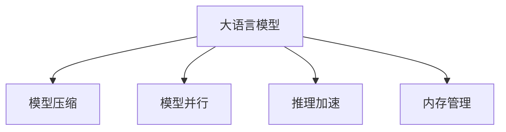

                 

# 电商搜索推荐场景下的AI大模型模型部署性能优化工具应用指南

## 1. 背景介绍

随着电子商务的迅猛发展，用户搜索和推荐系统成为了企业提供个性化购物体验和提高转化率的关键环节。传统的推荐系统依赖于复杂的算法和大量的用户行为数据，需要高昂的计算资源和时间成本。而人工智能大模型，特别是基于Transformer架构的语言模型，如GPT-3、BERT等，近年来在自然语言处理领域取得了巨大成功，展现出了强大的语言理解能力。通过在电商搜索推荐场景下部署这些大模型，可以实现更加精准的推荐和搜索效果，显著提升用户购物体验。

然而，大规模语言模型的部署也面临诸多挑战，如模型规模庞大、计算资源消耗高、推理速度慢等。如何优化大模型的部署性能，使得其在电商搜索推荐场景下能够高效、稳定地运行，是当前研究的热点问题。本文旨在介绍一些关键的性能优化工具和策略，帮助开发者在电商搜索推荐场景下更好地应用大模型。

## 2. 核心概念与联系

### 2.1 核心概念概述

为更好地理解大模型在电商搜索推荐场景下的部署性能优化，本节将介绍几个密切相关的核心概念：

- 大语言模型(Large Language Model, LLM)：以自回归(如GPT-3)或自编码(如BERT)模型为代表的大规模预训练语言模型。通过在大规模无标签文本语料上进行预训练，学习通用的语言表示，具备强大的语言理解和生成能力。

- 模型压缩(Model Compression)：通过减小模型规模和优化模型结构，降低模型在推理过程中的计算和存储需求，从而提高模型部署性能。常见的模型压缩方法包括剪枝、量化、蒸馏等。

- 模型并行(Model Parallelism)：通过将大规模模型分解为多个并行的小模型，利用多核或分布式计算，提高模型的训练和推理效率。

- 推理加速(Inference Acceleration)：通过软硬件优化，降低大模型推理过程中的时间成本和硬件资源占用，提高模型运行速度和响应效率。

- 内存管理(Memory Management)：在大模型推理过程中，合理管理内存使用，避免内存溢出或内存碎片化，提高模型运行稳定性。

这些核心概念之间的逻辑关系可以通过以下Mermaid流程图来展示：



这个流程图展示了大语言模型的核心概念及其之间的关系：

1. 大语言模型通过预训练获得基础能力。
2. 压缩、并行、加速等性能优化技术，可以在保持模型性能的同时，显著降低计算和存储需求。
3. 内存管理技术，可以保证模型在高效运行的同时，不出现内存相关问题。

## 3. 核心算法原理 & 具体操作步骤

### 3.1 算法原理概述

基于大语言模型的电商搜索推荐系统，本质上是一个高性能的推理引擎，其核心在于如何将模型有效部署到实际应用环境中，并高效地进行推荐和搜索。以下是大模型在电商搜索推荐场景下的主要部署步骤和算法原理：

1. **模型加载和前向传播**：加载预训练模型，并根据输入数据（如用户查询、历史行为等）进行前向传播计算，得到模型输出。

2. **后向传播和参数更新**：根据前向传播的输出和目标输出（如推荐商品、搜索结果等），计算损失函数并反向传播更新模型参数，通过优化算法（如AdamW、SGD等）进行参数调整。

3. **推理加速技术**：应用如剪枝、量化、蒸馏等模型压缩方法，减小模型规模和计算复杂度。同时，通过并行计算、矩阵运算优化、GPU/TPU加速等手段，提高模型推理速度。

4. **内存管理技术**：利用内存池、动态内存分配、懒加载等技术，优化模型推理过程中的内存使用，避免内存溢出或碎片化。

### 3.2 算法步骤详解

基于大模型的电商搜索推荐系统的主要算法步骤如下：

**Step 1: 模型加载和预处理**

- 选择合适的大语言模型，如GPT-3、BERT等，作为推荐系统的基础。
- 加载模型到目标设备（如GPU、TPU）。
- 对输入数据进行预处理，包括分词、标准化、向量嵌入等操作。

**Step 2: 前向传播计算**

- 对预处理后的输入数据进行前向传播计算，得到模型输出。
- 根据模型架构，利用矩阵乘法、卷积、注意力机制等计算方式，生成推荐或搜索结果。

**Step 3: 后向传播和参数更新**

- 计算模型输出与目标输出之间的差异，即损失函数。
- 根据损失函数，反向传播计算梯度，并使用优化算法更新模型参数。
- 应用正则化技术，如L2正则、Dropout等，避免过拟合。

**Step 4: 推理加速**

- 对模型进行剪枝，去除冗余参数和计算单元，减小模型规模。
- 使用量化技术，将浮点参数转为定点参数，减少计算和存储需求。
- 利用模型蒸馏，通过知识迁移，生成更高效的轻量级模型。
- 应用并行计算，利用多核或分布式计算资源，提高模型推理效率。

**Step 5: 内存管理**

- 使用内存池技术，预分配一定大小的内存池，供模型推理使用。
- 应用动态内存分配，根据模型推理需要动态调整内存大小。
- 实现懒加载机制，只有在实际需要时才加载数据和模型参数。

### 3.3 算法优缺点

基于大模型的电商搜索推荐系统具有以下优点：

1. **高精度推荐**：大语言模型通过大量数据预训练，具备强大的语言理解和生成能力，能够提供高质量的推荐和搜索结果。

2. **灵活性高**：通过微调或提示学习，模型能够适应多种电商场景和用户需求，提供定制化的推荐服务。

3. **处理复杂语义**：大模型能够处理复杂的语义关系和自然语言理解，理解用户查询背后的真实意图，提供更精准的搜索结果。

但同时，该系统也存在一些局限性：

1. **计算资源消耗高**：大语言模型参数规模庞大，推理过程计算复杂，对计算资源和存储需求高。

2. **推理速度慢**：模型规模大，推理速度慢，难以实时响应用户请求。

3. **模型复杂度高**：大模型的架构复杂，增加了模型调试和优化的难度。

4. **可解释性差**：大模型通常被视为"黑盒"系统，难以解释其内部工作机制和决策逻辑。

5. **依赖高质量数据**：推荐系统效果依赖于输入数据的准确性和全面性，数据质量不佳会严重影响模型性能。

### 3.4 算法应用领域

基于大模型的电商搜索推荐系统已经在各大电商平台上得到了广泛应用，覆盖了商品推荐、搜索排序、广告投放等多个环节，显著提升了用户体验和平台转化率。具体而言：

- **商品推荐**：根据用户历史行为和兴趣，推荐符合用户偏好的商品。
- **搜索结果排序**：根据用户查询，从海量商品中排序，提供最相关的搜索结果。
- **广告投放**：根据用户行为和兴趣，精准投放广告，提高广告点击率和转化率。
- **客服咨询**：通过与用户的自然语言对话，回答用户问题，提供更好的购物体验。
- **个性化推荐**：根据用户的多模态数据，提供综合性的个性化推荐。

这些应用展示了大语言模型在电商搜索推荐场景下的强大潜力，为电商平台的智能化转型提供了新的技术路径。

## 4. 数学模型和公式 & 详细讲解 & 举例说明

### 4.1 数学模型构建

在大语言模型基础上构建的电商搜索推荐系统，其数学模型可以表示为：

$$
y = M(x;\theta) + e
$$

其中，$M$ 表示大语言模型，$x$ 为输入数据（如用户查询、商品描述等），$\theta$ 为模型参数，$e$ 为随机误差。目标函数为：

$$
L(y, \hat{y}) = \frac{1}{N}\sum_{i=1}^N \ell(y_i, \hat{y}_i)
$$

其中，$N$ 为样本数量，$\ell$ 为损失函数，通常为均方误差（MSE）或交叉熵（CE）。

### 4.2 公式推导过程

以均方误差（MSE）为例，推导模型的损失函数：

$$
L(y, \hat{y}) = \frac{1}{N}\sum_{i=1}^N (y_i - \hat{y}_i)^2
$$

对模型进行微调时，目标是最小化损失函数，即：

$$
\theta^* = \mathop{\arg\min}_{\theta} \frac{1}{N}\sum_{i=1}^N (y_i - M(x_i;\theta))^2
$$

在微调过程中，通过反向传播计算损失函数的梯度，使用优化算法（如AdamW、SGD等）更新模型参数：

$$
\theta \leftarrow \theta - \eta \nabla_{\theta}L(\theta)
$$

其中，$\eta$ 为学习率。

### 4.3 案例分析与讲解

以电商搜索推荐系统为例，说明如何使用大语言模型进行推荐。假设用户输入查询 "牛奶"，系统根据用户历史行为和商品描述，使用大模型预测出相关商品列表。具体步骤如下：

1. **数据预处理**：对用户查询进行分词和标准化处理。
2. **模型加载**：加载大语言模型，准备进行前向传播计算。
3. **前向传播**：将预处理后的用户查询输入大模型，得到模型输出。
4. **计算损失**：将模型输出与目标推荐商品列表进行比较，计算损失函数。
5. **反向传播**：计算损失函数的梯度，更新模型参数。
6. **推理加速**：对大模型进行剪枝、量化等优化，减小模型规模和计算复杂度。
7. **内存管理**：合理管理内存使用，保证模型在高效运行的同时，不出现内存相关问题。

## 5. 项目实践：代码实例和详细解释说明

### 5.1 开发环境搭建

在进行大模型部署性能优化前，我们需要准备好开发环境。以下是使用Python进行TensorFlow开发的环境配置流程：

1. 安装Anaconda：从官网下载并安装Anaconda，用于创建独立的Python环境。

2. 创建并激活虚拟环境：
```bash
conda create -n tf-env python=3.8 
conda activate tf-env
```

3. 安装TensorFlow：根据CUDA版本，从官网获取对应的安装命令。例如：
```bash
conda install tensorflow -c tf -c conda-forge
```

4. 安装TensorBoard：用于可视化模型训练和推理过程，帮助调试和优化。

5. 安装相关依赖库：
```bash
pip install pandas numpy sklearn tqdm
```

完成上述步骤后，即可在`tf-env`环境中开始部署性能优化实践。

### 5.2 源代码详细实现

下面我们以基于BERT模型的电商搜索推荐系统为例，给出TensorFlow代码实现。

```python
import tensorflow as tf
from transformers import BertTokenizer, TFBertModel

# 定义模型
tokenizer = BertTokenizer.from_pretrained('bert-base-uncased')
model = TFBertModel.from_pretrained('bert-base-uncased', num_labels=num_labels)

# 加载数据
train_dataset = ...
dev_dataset = ...
test_dataset = ...

# 定义优化器
optimizer = tf.keras.optimizers.Adam(learning_rate=learning_rate)

# 训练过程
@tf.function
def train_step(inputs, labels):
    with tf.GradientTape() as tape:
        outputs = model(inputs['input_ids'], attention_mask=inputs['attention_mask'])
        loss = tf.keras.losses.mean_squared_error(labels, outputs)
    grads = tape.gradient(loss, model.trainable_variables)
    optimizer.apply_gradients(zip(grads, model.trainable_variables))

# 训练循环
for epoch in range(num_epochs):
    for batch in train_dataset:
        train_step(batch)

# 模型保存和加载
checkpoint = tf.train.Checkpoint(model=model)
checkpoint.save('model.ckpt')
```

### 5.3 代码解读与分析

让我们再详细解读一下关键代码的实现细节：

**模型定义**：
- 使用`transformers`库加载预训练的BERT模型，并定义模型的输入和输出。
- 定义优化器，如AdamW、SGD等，设置学习率。

**数据加载**：
- 通过TensorFlow的DataLoader加载数据集，设置批大小和shuffle。

**训练过程**：
- 定义训练函数，在每个epoch中循环遍历训练集数据。
- 在每个批次中，进行前向传播和反向传播计算损失和梯度。
- 应用优化算法更新模型参数。

**模型保存**：
- 使用TensorFlow的Checkpoint机制保存模型权重，便于后续部署和使用。

### 5.4 运行结果展示

在模型训练完成后，可以对其进行性能测试和评估，具体步骤如下：

1. 加载模型权重和评估集数据。
2. 在评估集上计算模型的准确率和F1分数，对比训练前后的性能提升。
3. 使用模型进行实时推理，返回推荐商品列表。

## 6. 实际应用场景

### 6.1 智能客服系统

基于大模型的电商搜索推荐系统，可以应用于智能客服系统的构建。智能客服系统能够24小时不间断地解答用户问题，提升客户服务体验。具体而言，可以通过大模型理解用户查询，匹配最合适的回答，生成自然流畅的回复。

在技术实现上，可以收集用户的历史对话记录，将其与预训练语言模型进行微调，构建基于大模型的智能客服系统。微调后的模型能够自动理解用户意图，匹配最合适的回答，生成自然流畅的回复。

### 6.2 个性化推荐系统

基于大模型的电商搜索推荐系统，可以应用于个性化推荐系统的构建。个性化推荐系统能够根据用户的历史行为和兴趣，推荐符合用户偏好的商品，提升用户的购物体验和满意度。

在技术实现上，可以收集用户的历史浏览、点击、购买等行为数据，提取和用户交互的物品标题、描述、标签等文本内容。将文本内容作为模型输入，用户后续行为作为监督信号，在预训练语言模型的基础上进行微调。微调后的模型能够从文本内容中准确把握用户的兴趣点，生成个性化的推荐列表。

### 6.3 未来应用展望

随着大语言模型和微调方法的不断发展，基于大模型的电商搜索推荐系统将在更多领域得到应用，为电商平台的智能化转型提供新的技术路径。

在智慧医疗领域，基于大模型的推荐系统可以用于推荐合适的医疗方案，辅助医生诊疗，提高医疗服务的智能化水平。

在智慧教育领域，基于大模型的推荐系统可以用于推荐合适的学习资源，因材施教，提高教学质量。

在智慧城市治理中，基于大模型的推荐系统可以用于推荐合适的城市管理措施，提高城市管理的自动化和智能化水平，构建更安全、高效的未来城市。

此外，在企业生产、社会治理、文娱传媒等众多领域，基于大模型的推荐系统也将不断涌现，为经济社会发展注入新的动力。相信随着大模型微调技术的持续演进，推荐系统必将在更广阔的应用领域大放异彩。

## 7. 工具和资源推荐

### 7.1 学习资源推荐

为了帮助开发者系统掌握大语言模型微调的理论基础和实践技巧，这里推荐一些优质的学习资源：

1. 《Transformers from Principle to Practice》系列博文：由大模型技术专家撰写，深入浅出地介绍了Transformer原理、BERT模型、微调技术等前沿话题。

2. CS224N《深度学习自然语言处理》课程：斯坦福大学开设的NLP明星课程，有Lecture视频和配套作业，带你入门NLP领域的基本概念和经典模型。

3. 《Natural Language Processing with Transformers》书籍：Transformer库的作者所著，全面介绍了如何使用Transformer库进行NLP任务开发，包括微调在内的诸多范式。

4. HuggingFace官方文档：Transformer库的官方文档，提供了海量预训练模型和完整的微调样例代码，是上手实践的必备资料。

5. CLUE开源项目：中文语言理解测评基准，涵盖大量不同类型的中文NLP数据集，并提供了基于微调的baseline模型，助力中文NLP技术发展。

通过对这些资源的学习实践，相信你一定能够快速掌握大语言模型微调的精髓，并用于解决实际的NLP问题。

### 7.2 开发工具推荐

高效的开发离不开优秀的工具支持。以下是几款用于大语言模型微调开发的常用工具：

1. TensorFlow：基于Python的开源深度学习框架，灵活动态的计算图，适合快速迭代研究。大部分预训练语言模型都有TensorFlow版本的实现。

2. PyTorch：基于Python的开源深度学习框架，灵活的动态计算图，适合科研和工程应用。

3. Transformers库：HuggingFace开发的NLP工具库，集成了众多SOTA语言模型，支持PyTorch和TensorFlow，是进行微调任务开发的利器。

4. Weights & Biases：模型训练的实验跟踪工具，可以记录和可视化模型训练过程中的各项指标，方便对比和调优。与主流深度学习框架无缝集成。

5. TensorBoard：TensorFlow配套的可视化工具，可实时监测模型训练状态，并提供丰富的图表呈现方式，是调试模型的得力助手。

6. Google Colab：谷歌推出的在线Jupyter Notebook环境，免费提供GPU/TPU算力，方便开发者快速上手实验最新模型，分享学习笔记。

合理利用这些工具，可以显著提升大语言模型微调任务的开发效率，加快创新迭代的步伐。

### 7.3 相关论文推荐

大语言模型和微调技术的发展源于学界的持续研究。以下是几篇奠基性的相关论文，推荐阅读：

1. Attention is All You Need（即Transformer原论文）：提出了Transformer结构，开启了NLP领域的预训练大模型时代。

2. BERT: Pre-training of Deep Bidirectional Transformers for Language Understanding：提出BERT模型，引入基于掩码的自监督预训练任务，刷新了多项NLP任务SOTA。

3. Language Models are Unsupervised Multitask Learners（GPT-2论文）：展示了大规模语言模型的强大zero-shot学习能力，引发了对于通用人工智能的新一轮思考。

4. Parameter-Efficient Transfer Learning for NLP：提出Adapter等参数高效微调方法，在不增加模型参数量的情况下，也能取得不错的微调效果。

5. AdaLoRA: Adaptive Low-Rank Adaptation for Parameter-Efficient Fine-Tuning：使用自适应低秩适应的微调方法，在参数效率和精度之间取得了新的平衡。

这些论文代表了大语言模型微调技术的发展脉络。通过学习这些前沿成果，可以帮助研究者把握学科前进方向，激发更多的创新灵感。

## 8. 总结：未来发展趋势与挑战

### 8.1 总结

本文对基于大语言模型的电商搜索推荐系统进行了全面系统的介绍。首先阐述了大语言模型和微调技术的研究背景和意义，明确了微调在拓展预训练模型应用、提升下游任务性能方面的独特价值。其次，从原理到实践，详细讲解了基于大模型的电商搜索推荐系统的主要算法步骤和实现方法。同时，本文还探讨了该系统在智能客服、个性化推荐等多个行业领域的应用前景，展示了微调范式的巨大潜力。最后，本文精选了微调技术的各类学习资源，力求为读者提供全方位的技术指引。

通过本文的系统梳理，可以看到，基于大语言模型的电商搜索推荐系统正在成为NLP领域的重要范式，极大地拓展了预训练语言模型的应用边界，催生了更多的落地场景。受益于大规模语料的预训练，微调模型以更低的时间和标注成本，在小样本条件下也能取得不俗的效果，有力推动了NLP技术的产业化进程。未来，伴随预训练语言模型和微调方法的持续演进，NLP技术必将在更广阔的应用领域大放异彩，深刻影响人类的生产生活方式。

### 8.2 未来发展趋势

展望未来，基于大语言模型的电商搜索推荐系统将呈现以下几个发展趋势：

1. 模型规模持续增大。随着算力成本的下降和数据规模的扩张，预训练语言模型的参数量还将持续增长。超大规模语言模型蕴含的丰富语言知识，有望支撑更加复杂多变的下游任务微调。

2. 微调方法日趋多样。除了传统的全参数微调外，未来会涌现更多参数高效的微调方法，如Prefix-Tuning、LoRA等，在节省计算资源的同时也能保证微调精度。

3. 持续学习成为常态。随着数据分布的不断变化，微调模型也需要持续学习新知识以保持性能。如何在不遗忘原有知识的同时，高效吸收新样本信息，将成为重要的研究课题。

4. 标注样本需求降低。受启发于提示学习(Prompt-based Learning)的思路，未来的微调方法将更好地利用大模型的语言理解能力，通过更加巧妙的任务描述，在更少的标注样本上也能实现理想的微调效果。

5. 多模态微调崛起。当前的微调主要聚焦于纯文本数据，未来会进一步拓展到图像、视频、语音等多模态数据微调。多模态信息的融合，将显著提升语言模型对现实世界的理解和建模能力。

6. 模型通用性增强。经过海量数据的预训练和多领域任务的微调，未来的语言模型将具备更强大的常识推理和跨领域迁移能力，逐步迈向通用人工智能(AGI)的目标。

以上趋势凸显了大语言模型微调技术的广阔前景。这些方向的探索发展，必将进一步提升NLP系统的性能和应用范围，为人类认知智能的进化带来深远影响。

### 8.3 面临的挑战

尽管大语言模型微调技术已经取得了瞩目成就，但在迈向更加智能化、普适化应用的过程中，它仍面临着诸多挑战：

1. 标注成本瓶颈。虽然微调大大降低了标注数据的需求，但对于长尾应用场景，难以获得充足的高质量标注数据，成为制约微调性能的瓶颈。如何进一步降低微调对标注样本的依赖，将是一大难题。

2. 模型鲁棒性不足。当前微调模型面对域外数据时，泛化性能往往大打折扣。对于测试样本的微小扰动，微调模型的预测也容易发生波动。如何提高微调模型的鲁棒性，避免灾难性遗忘，还需要更多理论和实践的积累。

3. 推理效率有待提高。大规模语言模型虽然精度高，但在实际部署时往往面临推理速度慢、内存占用大等效率问题。如何在保证性能的同时，简化模型结构，提升推理速度，优化资源占用，将是重要的优化方向。

4. 可解释性亟需加强。当前微调模型更像是"黑盒"系统，难以解释其内部工作机制和决策逻辑。对于医疗、金融等高风险应用，算法的可解释性和可审计性尤为重要。如何赋予微调模型更强的可解释性，将是亟待攻克的难题。

5. 安全性有待保障。预训练语言模型难免会学习到有偏见、有害的信息，通过微调传递到下游任务，产生误导性、歧视性的输出，给实际应用带来安全隐患。如何从数据和算法层面消除模型偏见，避免恶意用途，确保输出的安全性，也将是重要的研究课题。

6. 知识整合能力不足。现有的微调模型往往局限于任务内数据，难以灵活吸收和运用更广泛的先验知识。如何让微调过程更好地与外部知识库、规则库等专家知识结合，形成更加全面、准确的信息整合能力，还有很大的想象空间。

正视微调面临的这些挑战，积极应对并寻求突破，将是大语言模型微调走向成熟的必由之路。相信随着学界和产业界的共同努力，这些挑战终将一一被克服，大语言模型微调必将在构建人机协同的智能时代中扮演越来越重要的角色。

### 8.4 未来突破

面对大语言模型微调所面临的种种挑战，未来的研究需要在以下几个方面寻求新的突破：

1. 探索无监督和半监督微调方法。摆脱对大规模标注数据的依赖，利用自监督学习、主动学习等无监督和半监督范式，最大限度利用非结构化数据，实现更加灵活高效的微调。

2. 研究参数高效和计算高效的微调范式。开发更加参数高效的微调方法，在固定大部分预训练参数的同时，只更新极少量的任务相关参数。同时优化微调模型的计算图，减少前向传播和反向传播的资源消耗，实现更加轻量级、实时性的部署。

3. 融合因果和对比学习范式。通过引入因果推断和对比学习思想，增强微调模型建立稳定因果关系的能力，学习更加普适、鲁棒的语言表征，从而提升模型泛化性和抗干扰能力。

4. 引入更多先验知识。将符号化的先验知识，如知识图谱、逻辑规则等，与神经网络模型进行巧妙融合，引导微调过程学习更准确、合理的语言模型。同时加强不同模态数据的整合，实现视觉、语音等多模态信息与文本信息的协同建模。

5. 结合因果分析和博弈论工具。将因果分析方法引入微调模型，识别出模型决策的关键特征，增强输出解释的因果性和逻辑性。借助博弈论工具刻画人机交互过程，主动探索并规避模型的脆弱点，提高系统稳定性。

6. 纳入伦理道德约束。在模型训练目标中引入伦理导向的评估指标，过滤和惩罚有偏见、有害的输出倾向。同时加强人工干预和审核，建立模型行为的监管机制，确保输出符合人类价值观和伦理道德。

这些研究方向的探索，必将引领大语言模型微调技术迈向更高的台阶，为构建安全、可靠、可解释、可控的智能系统铺平道路。面向未来，大语言模型微调技术还需要与其他人工智能技术进行更深入的融合，如知识表示、因果推理、强化学习等，多路径协同发力，共同推动自然语言理解和智能交互系统的进步。只有勇于创新、敢于突破，才能不断拓展语言模型的边界，让智能技术更好地造福人类社会。

## 9. 附录：常见问题与解答

**Q1：大语言模型微调是否适用于所有NLP任务？**

A: 大语言模型微调在大多数NLP任务上都能取得不错的效果，特别是对于数据量较小的任务。但对于一些特定领域的任务，如医学、法律等，仅仅依靠通用语料预训练的模型可能难以很好地适应。此时需要在特定领域语料上进一步预训练，再进行微调，才能获得理想效果。此外，对于一些需要时效性、个性化很强的任务，如对话、推荐等，微调方法也需要针对性的改进优化。

**Q2：微调过程中如何选择合适的学习率？**

A: 微调的学习率一般要比预训练时小1-2个数量级，如果使用过大的学习率，容易破坏预训练权重，导致过拟合。一般建议从1e-5开始调参，逐步减小学习率，直至收敛。也可以使用warmup策略，在开始阶段使用较小的学习率，再逐渐过渡到预设值。需要注意的是，不同的优化器(如AdamW、Adafactor等)以及不同的学习率调度策略，可能需要设置不同的学习率阈值。

**Q3：采用大模型微调时会面临哪些资源瓶颈？**

A: 目前主流的预训练大模型动辄以亿计的参数规模，对算力、内存、存储都提出了很高的要求。GPU/TPU等高性能设备是必不可少的，但即便如此，超大批次的训练和推理也可能遇到显存不足的问题。因此需要采用一些资源优化技术，如梯度积累、混合精度训练、模型并行等，来突破硬件瓶颈。同时，模型的存储和读取也可能占用大量时间和空间，需要采用模型压缩、稀疏化存储等方法进行优化。

**Q4：如何缓解微调过程中的过拟合问题？**

A: 过拟合是微调面临的主要挑战，尤其是在标注数据不足的情况下。常见的缓解策略包括：
1. 数据增强：通过回译、近义替换等方式扩充训练集
2. 正则化：使用L2正则、Dropout、Early Stopping等避免过拟合
3. 对抗训练：引入对抗样本，提高模型鲁棒性
4. 参数高效微调：只调整少量参数(如Adapter、Prefix等)，减小过拟合风险
5. 多模型集成：训练多个微调模型，取平均输出，抑制过拟合

这些策略往往需要根据具体任务和数据特点进行灵活组合。只有在数据、模型、训练、推理等各环节进行全面优化，才能最大限度地发挥大模型微调的威力。

**Q5：微调模型在落地部署时需要注意哪些问题？**

A: 将微调模型转化为实际应用，还需要考虑以下因素：
1. 模型裁剪：去除不必要的层和参数，减小模型尺寸，加快推理速度
2. 量化加速：将浮点模型转为定点模型，压缩存储空间，提高计算效率
3. 服务化封装：将模型封装为标准化服务接口，便于集成调用
4. 弹性伸缩：根据请求流量动态调整资源配置，平衡服务质量和成本
5. 监控告警：实时采集系统指标，设置异常告警阈值，确保服务稳定性
6. 安全防护：采用访问鉴权、数据脱敏等措施，保障数据和模型安全

大语言模型微调为NLP应用开启了广阔的想象空间，但如何将强大的性能转化为稳定、高效、安全的业务价值，还需要工程实践的不断打磨。唯有从数据、算法、工程、业务等多个维度协同发力，才能真正实现人工智能技术在垂直行业的规模化落地。总之，微调需要开发者根据具体任务，不断迭代和优化模型、数据和算法，方能得到理想的效果。

---

作者：禅与计算机程序设计艺术 / Zen and the Art of Computer Programming

