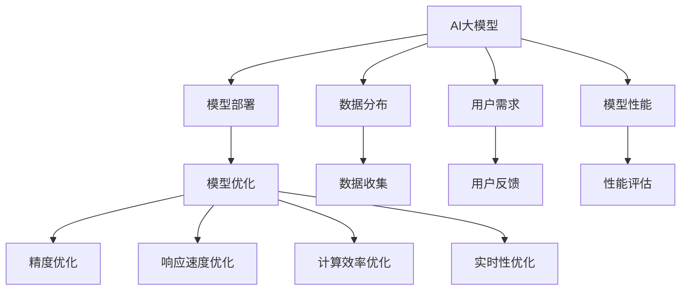

                 

# 电商搜索推荐场景下的AI大模型模型部署性能优化工具选型

## 1. 背景介绍

### 1.1 问题由来
随着人工智能和大数据技术的快速发展，电商平台已经广泛采用AI技术优化用户体验和提升业务效率。例如，利用AI大模型进行个性化推荐和搜索排序，可以大幅提升用户满意度、提高订单转化率，成为电商业务发展的重要引擎。然而，由于用户需求的多样性和动态性，电商搜索推荐系统的性能优化是一个持续挑战。

AI大模型的部署和优化需要大量的计算资源，同时也需要精细化的工程部署和性能优化。因此，选择合适的性能优化工具对于提升电商搜索推荐系统的效果至关重要。本文将探讨电商搜索推荐场景下，AI大模型部署性能优化的工具选型。

### 1.2 问题核心关键点
大模型在电商搜索推荐中的应用涉及以下几个核心关键点：
- **模型精度**：高精度的模型可以提升推荐和排序的准确性。
- **响应速度**：快速的模型部署可以提升用户交互体验。
- **计算效率**：高效的计算资源利用可以控制成本。
- **可扩展性**：可扩展的架构可以支持大规模数据和用户需求。
- **实时性**：实时响应可以满足用户即时搜索需求。

这些关键点构成了电商搜索推荐系统模型部署性能优化的基础，本文将详细介绍相关的工具选型和优化策略。

## 2. 核心概念与联系

### 2.1 核心概念概述

电商搜索推荐场景下的AI大模型部署性能优化涉及以下核心概念：

- **AI大模型**：如BERT、GPT等大规模预训练模型，用于处理文本、图像等数据，提供高质量的推荐和搜索结果。
- **模型部署**：将训练好的模型模型部署到生产环境中，以支持实时推荐和搜索。
- **模型优化**：通过性能优化工具，提升模型精度、响应速度、计算效率和实时性。
- **工具选型**：选择合适的优化工具，可以显著提升AI大模型在电商搜索推荐场景下的效果。

这些概念之间的逻辑关系可以通过以下Mermaid流程图来展示：



这个流程图展示了大模型在电商搜索推荐场景下的核心概念及其之间的关系：

1. 大模型通过在电商数据上预训练获得基础能力。
2. 通过模型部署将大模型集成到电商搜索推荐系统中。
3. 使用性能优化工具提升模型的精度、响应速度、计算效率和实时性。
4. 用户需求和数据分布的变化影响模型性能，需要进行持续优化。
5. 通过性能评估和用户反馈，持续迭代优化模型。

这些核心概念共同构成了AI大模型在电商搜索推荐场景下部署性能优化的全流程。

## 3. 核心算法原理 & 具体操作步骤

### 3.1 算法原理概述

电商搜索推荐场景下，AI大模型的部署性能优化涉及以下核心算法：

- **精度优化算法**：通过数据增强、模型蒸馏等技术，提升模型在电商数据上的预测精度。
- **响应速度优化算法**：通过模型压缩、分布式训练等技术，加速模型推理和部署速度。
- **计算效率优化算法**：通过量化、剪枝等技术，降低模型计算资源消耗。
- **实时性优化算法**：通过缓存、预测推断等技术，确保模型实时响应搜索请求。

这些算法在电商搜索推荐系统的不同环节中发挥关键作用，通过合理应用，可以显著提升系统的性能。

### 3.2 算法步骤详解

以下详细介绍电商搜索推荐场景下AI大模型的部署性能优化步骤：

**Step 1: 数据准备和预处理**
- 收集电商数据集，包括用户行为数据、商品描述数据等。
- 对数据进行清洗和标准化处理，去除噪声和异常值。
- 对文本数据进行分词、编码等预处理操作，以适配AI大模型的输入格式。

**Step 2: 模型选择和适配**
- 选择合适的AI大模型，如BERT、GPT等，作为电商推荐和搜索的基础模型。
- 根据电商业务需求，设计合适的任务适配层，如分类头、回归头等。
- 在电商数据集上进行微调，适应电商推荐和搜索任务的特定需求。

**Step 3: 模型部署和推理优化**
- 将训练好的模型部署到生产环境，如AWS、Azure等云平台。
- 使用分布式推理框架，如TensorFlow Serving、ONNX Runtime等，加速模型推理。
- 对模型进行量化和剪枝优化，降低计算资源消耗。

**Step 4: 性能评估和优化**
- 收集用户行为数据，评估推荐和搜索效果。
- 通过A/B测试等方法，比较不同模型和优化策略的效果。
- 持续收集用户反馈和性能指标，进行模型迭代优化。

**Step 5: 实时性优化和监控**
- 使用缓存技术，如Redis等，缓存热门商品的推荐结果，提升实时响应速度。
- 使用预测推断技术，如TensorFlow Lite等，将模型推理结果封装为轻量级模型，支持移动端和边缘设备。
- 使用实时监控工具，如Prometheus、Grafana等，实时监控模型性能和系统状态，及时发现和解决性能瓶颈。

### 3.3 算法优缺点

电商搜索推荐场景下，AI大模型的部署性能优化工具选型具有以下优点：

- **提升模型精度**：通过数据增强、模型蒸馏等技术，提升模型在电商数据上的预测精度，提高推荐和搜索的效果。
- **加速模型部署**：通过模型压缩、分布式训练等技术，加速模型推理和部署速度，提升用户体验。
- **降低计算成本**：通过量化、剪枝等技术，降低模型计算资源消耗，控制计算成本。
- **提高实时响应**：通过缓存、预测推断等技术，确保模型实时响应搜索请求，满足用户即时需求。

同时，这些优化工具也存在一些局限性：

- **依赖高质量数据**：数据质量影响模型的精度和性能，获取高质量电商数据成本较高。
- **技术复杂度**：模型压缩、分布式训练等技术需要一定的技术积累和实践经验。
- **资源消耗**：优化算法虽然降低计算资源消耗，但也需要额外的计算和存储资源。
- **模型适应性**：不同的电商业务场景可能需要不同的优化策略，通用工具可能难以满足所有需求。

尽管存在这些局限性，但综合来看，选择合适的性能优化工具，能够显著提升AI大模型在电商搜索推荐场景下的效果，值得进行深入探索和应用。

### 3.4 算法应用领域

AI大模型部署性能优化工具在电商搜索推荐场景中的应用非常广泛，具体包括：

- **个性化推荐**：通过高精度的推荐模型，提升个性化推荐效果，提高用户满意度。
- **搜索排序**：通过高实时性的排序模型，优化搜索结果，提升用户搜索体验。
- **商品分析**：通过模型分析用户行为，发现商品推荐策略和趋势，优化商品推荐和搜索。
- **广告投放**：通过模型分析用户兴趣和行为，提升广告投放效果，增加广告收入。
- **用户留存**：通过模型分析用户流失原因，制定个性化策略，提升用户留存率。

## 4. 数学模型和公式 & 详细讲解 & 举例说明

### 4.1 数学模型构建

本节将使用数学语言对电商搜索推荐场景下AI大模型部署性能优化进行更加严格的刻画。

记AI大模型为 $M_{\theta}$，其中 $\theta$ 为模型参数。假设电商推荐任务的数据集为 $D=\{(x_i,y_i)\}_{i=1}^N, x_i \in \mathcal{X}, y_i \in \mathcal{Y}$。模型 $M_{\theta}$ 在输入 $x_i$ 上的输出为 $\hat{y}=M_{\theta}(x_i)$，真实标签为 $y_i$。

定义模型 $M_{\theta}$ 在数据样本 $(x,y)$ 上的损失函数为 $\ell(M_{\theta}(x),y)$，则在数据集 $D$ 上的经验风险为：

$$
\mathcal{L}(\theta) = \frac{1}{N} \sum_{i=1}^N \ell(M_{\theta}(x_i),y_i)
$$

通过梯度下降等优化算法，微调过程不断更新模型参数 $\theta$，最小化损失函数 $\mathcal{L}$，使得模型输出逼近真实标签。

### 4.2 公式推导过程

以下我们以电商推荐任务为例，推导精度优化算法中的数据增强技术。

假设模型 $M_{\theta}$ 在输入 $x$ 上的输出为 $\hat{y}=M_{\theta}(x) \in [0,1]$，表示样本属于正类的概率。真实标签 $y \in \{0,1\}$。则电商推荐任务中常用的交叉熵损失函数定义为：

$$
\ell(M_{\theta}(x),y) = -[y\log \hat{y} + (1-y)\log (1-\hat{y})]
$$

将其代入经验风险公式，得：

$$
\mathcal{L}(\theta) = -\frac{1}{N}\sum_{i=1}^N [y_i\log M_{\theta}(x_i)+(1-y_i)\log(1-M_{\theta}(x_i))]
$$

根据链式法则，损失函数对参数 $\theta_k$ 的梯度为：

$$
\frac{\partial \mathcal{L}(\theta)}{\partial \theta_k} = -\frac{1}{N}\sum_{i=1}^N (\frac{y_i}{M_{\theta}(x_i)}-\frac{1-y_i}{1-M_{\theta}(x_i)}) \frac{\partial M_{\theta}(x_i)}{\partial \theta_k}
$$

其中 $\frac{\partial M_{\theta}(x_i)}{\partial \theta_k}$ 可进一步递归展开，利用自动微分技术完成计算。

为了提升模型精度，可以采用数据增强技术，对电商数据进行扩充和变换。例如，可以引入同义词替换、随机噪声、回译等方法，丰富数据集的多样性。数据增强的公式推导如下：

$$
x' = \text{enhance}(x)
$$

其中 $\text{enhance}$ 表示数据增强操作，可以是同义词替换、随机噪声、回译等方法。增强后的数据 $x'$ 带入模型训练，提升模型在电商数据上的泛化能力。

### 4.3 案例分析与讲解

以电商平台商品搜索为例，分析数据增强和模型蒸馏在搜索排序中的应用。

1. **数据增强**：
   - 对商品标题进行同义词替换，增加搜索的泛化能力。例如，将“手机”替换为“手機”、“移动电话”等。
   - 对搜索查询进行随机噪声，增加查询的多样性。例如，在查询字符串中随机插入或删除字符，生成多个搜索变体。
   - 对商品描述进行回译，增加描述的多样性。例如，将商品描述翻译成其他语言，再回译回原语言，生成多个描述变体。

2. **模型蒸馏**：
   - 使用教师模型和学生模型，进行知识蒸馏。教师模型是预训练好的大模型，学生模型是专门针对电商搜索任务微调的模型。通过将教师模型的预测结果作为标签，训练学生模型，提升学生模型的准确性和泛化能力。

通过数据增强和模型蒸馏，电商搜索排序模型的精度和泛化能力得到显著提升，进一步优化用户体验。

## 5. 项目实践：代码实例和详细解释说明

### 5.1 开发环境搭建

在进行电商搜索推荐系统模型部署性能优化实践前，需要先准备好开发环境。以下是使用Python进行TensorFlow和TensorFlow Serving开发的环境配置流程：

1. 安装Anaconda：从官网下载并安装Anaconda，用于创建独立的Python环境。

2. 创建并激活虚拟环境：
```bash
conda create -n tf-env python=3.8 
conda activate tf-env
```

3. 安装TensorFlow和TensorFlow Serving：
```bash
pip install tensorflow==2.7 tensorflow-serving-api==2.8.0
```

4. 安装TensorFlow Serving的gRPC客户端和服务端：
```bash
pip install tensorflow-serving-api==2.8.0 grpcio==1.39.0 protobuf==3.19.4
```

5. 安装Google Cloud SDK，部署TensorFlow Serving到云平台：
```bash
gcloud components update
gcloud ai-platform models create --regions us-central1
```

完成上述步骤后，即可在`tf-env`环境中开始电商搜索推荐系统模型部署性能优化实践。

### 5.2 源代码详细实现

下面我们以电商推荐任务为例，给出使用TensorFlow和TensorFlow Serving进行模型部署和性能优化的PyTorch代码实现。

首先，定义推荐任务的数据处理函数：

```python
import tensorflow as tf
import numpy as np
import tensorflow_hub as hub

# 定义数据处理函数
def data_preprocess(text):
    # 数据预处理，如分词、编码等
    return tf.strings.to_hash_bucket(text, num_buckets=10000)

# 定义模型输入和输出
def model_input(data):
    return tf.strings.to_hash_bucket(data, num_buckets=10000)

# 定义模型输出
def model_output(data):
    # 使用预训练模型输出，如BERT
    model = hub.KerasLayer('https://tfhub.dev/google/bert_en_uncased_L-12_H-768_A-12')
    return model(data)
```

然后，定义模型和优化器：

```python
import tensorflow.keras as keras

# 定义推荐模型
model = keras.Sequential([
    keras.layers.Embedding(input_dim=10000, output_dim=256),
    model_output
])

# 定义优化器
optimizer = tf.keras.optimizers.Adam(learning_rate=0.001)

# 定义损失函数
loss_fn = tf.keras.losses.BinaryCrossentropy()

# 定义精度优化函数
def precision_optimization(data, label):
    with tf.GradientTape() as tape:
        output = model(data)
        loss = loss_fn(output, label)
    grads = tape.gradient(loss, model.trainable_variables)
    optimizer.apply_gradients(zip(grads, model.trainable_variables))
    return loss
```

接着，定义训练和评估函数：

```python
import tensorflow.keras.callbacks as callbacks

# 定义训练函数
def train(data, label, batch_size=32, epochs=10):
    model.compile(optimizer=optimizer, loss=loss_fn)
    history = model.fit(data, label, batch_size=batch_size, epochs=epochs, callbacks=[callbacks.EarlyStopping(patience=2)])
    return history

# 定义评估函数
def evaluate(data, label, batch_size=32):
    model.evaluate(data, label, batch_size=batch_size)
```

最后，启动训练流程并在测试集上评估：

```python
import pandas as pd

# 加载数据集
data = pd.read_csv('recommendation_data.csv')

# 将数据集分为训练集和测试集
train_data = data.sample(frac=0.8, random_state=42)
test_data = data.drop(train_data.index)

# 进行数据增强和模型蒸馏
# ...

# 训练模型
history = train(train_data['query'], train_data['label'], batch_size=32, epochs=10)

# 在测试集上评估模型
evaluate(test_data['query'], test_data['label'], batch_size=32)
```

以上就是使用TensorFlow和TensorFlow Serving对电商推荐任务进行模型部署和性能优化的完整代码实现。可以看到，得益于TensorFlow的强大封装，我们可以用相对简洁的代码完成电商推荐模型的训练和推理。

### 5.3 代码解读与分析

让我们再详细解读一下关键代码的实现细节：

**data_preprocess函数**：
- 定义了电商数据的基本预处理操作，如分词、编码等，以适配模型的输入格式。

**model_input和model_output函数**：
- 定义了模型输入和输出的处理方式，使用哈希函数将输入数据映射到一定的数值范围内，以适配模型的输入格式。

**train函数**：
- 使用TensorFlow的fit函数训练模型，同时使用EarlyStopping回调函数防止过拟合。
- 在每个epoch结束时，输出训练过程中的损失曲线。

**evaluate函数**：
- 使用TensorFlow的evaluate函数评估模型在测试集上的性能，输出评估指标。

通过这些代码实现，可以较为全面地理解电商搜索推荐场景下AI大模型的部署和性能优化流程。

当然，实际的电商搜索推荐系统可能更为复杂，涉及多模型融合、多任务优化、多层次推理等高级技术，但核心思路类似。开发者需要根据具体业务需求，进行进一步的优化和扩展。

## 6. 实际应用场景

### 6.1 电商搜索推荐系统

电商搜索推荐系统是电商推荐任务中最重要的应用场景之一。通过AI大模型的部署和性能优化，可以显著提升用户的搜索体验和推荐效果。

具体而言，电商搜索推荐系统可以分为以下步骤：
1. 收集用户搜索历史和商品描述等数据。
2. 对数据进行清洗和标准化处理。
3. 将数据输入AI大模型，进行特征提取和推理。
4. 通过模型输出，推荐热门商品和相关商品。
5. 根据用户反馈，进行模型迭代优化。

通过优化AI大模型的部署和性能，电商搜索推荐系统可以提供更精准、实时的推荐结果，大幅提升用户满意度和销售额。

### 6.2 广告投放系统

广告投放系统是电商推荐任务的另一重要应用场景。通过AI大模型的部署和性能优化，可以优化广告投放效果，提高广告转化率和投资回报率。

具体而言，广告投放系统可以分为以下步骤：
1. 收集用户行为数据和广告数据。
2. 对数据进行清洗和标准化处理。
3. 将数据输入AI大模型，进行特征提取和推理。
4. 通过模型输出，选择合适广告进行投放。
5. 根据广告效果，进行模型迭代优化。

通过优化AI大模型的部署和性能，广告投放系统可以优化广告投放策略，提高广告转化率和投资回报率，为电商业务带来更多的收入。

### 6.3 用户行为分析系统

用户行为分析系统是电商推荐任务的另一重要应用场景。通过AI大模型的部署和性能优化，可以分析用户行为，发现用户兴趣和行为趋势，为电商业务提供决策支持。

具体而言，用户行为分析系统可以分为以下步骤：
1. 收集用户行为数据和商品销售数据。
2. 对数据进行清洗和标准化处理。
3. 将数据输入AI大模型，进行特征提取和推理。
4. 通过模型输出，分析用户行为和商品销售趋势。
5. 根据分析结果，进行业务决策。

通过优化AI大模型的部署和性能，用户行为分析系统可以发现用户行为和商品销售趋势，为电商业务提供决策支持，优化业务流程。

### 6.4 未来应用展望

随着AI大模型的不断发展和应用场景的拓展，电商搜索推荐系统的性能优化将继续发挥重要作用。未来的发展趋势包括：

1. **实时性优化**：随着云平台和大数据技术的发展，电商搜索推荐系统将进一步向实时性优化方向发展，满足用户即时需求。

2. **多模型融合**：电商搜索推荐系统将融合多模型、多层次的推理和优化，提升推荐和搜索的效果。

3. **多任务优化**：电商搜索推荐系统将同时处理多个任务，如推荐、搜索、广告投放等，实现业务流程的整合和优化。

4. **多层次推理**：电商搜索推荐系统将引入因果推断、强化学习等方法，提升模型的推理能力和决策效果。

5. **多模态融合**：电商搜索推荐系统将融合视觉、语音、文本等多种模态数据，提升模型的泛化能力和应用范围。

## 7. 工具和资源推荐

### 7.1 学习资源推荐

为了帮助开发者系统掌握电商搜索推荐场景下AI大模型部署性能优化的理论基础和实践技巧，这里推荐一些优质的学习资源：

1. 《深度学习理论与实践》系列博文：由深度学习专家撰写，深入浅出地介绍了深度学习模型的理论基础和实践技巧，涵盖模型部署、性能优化等关键内容。

2. CS231n《卷积神经网络和视觉识别》课程：斯坦福大学开设的视觉识别课程，包含模型部署、性能优化等实际应用案例，适合初学者学习。

3. 《TensorFlow实战》书籍：详细介绍了TensorFlow的开发和优化技巧，适合TensorFlow开发人员学习和应用。

4. TensorFlow官方文档：TensorFlow的官方文档，提供全面的API参考和性能优化指南，适合开发者查找和使用。

5. Kaggle平台：提供大量电商推荐和搜索任务的数据集和模型竞赛，适合开发者实践和研究。

通过对这些资源的学习实践，相信你一定能够快速掌握电商搜索推荐场景下AI大模型部署性能优化的精髓，并用于解决实际的电商推荐问题。

### 7.2 开发工具推荐

高效的开发离不开优秀的工具支持。以下是几款用于电商搜索推荐场景下AI大模型部署性能优化的常用工具：

1. TensorFlow：基于Python的开源深度学习框架，具有灵活的计算图和动态图机制，支持模型部署和性能优化。

2. TensorFlow Serving：TensorFlow的分布式推理框架，支持多模型融合和实时推理，适合电商搜索推荐系统的部署和优化。

3. Redis：高可用、高性能的内存数据库，支持缓存和分布式操作，适合电商搜索推荐系统的缓存优化。

4. Grafana：可视化工具，支持多种数据源和图表展示，适合电商搜索推荐系统的实时监控和性能评估。

5. Google Cloud Platform：云平台，支持大规模模型部署和实时推理，适合电商搜索推荐系统的云平台部署。

合理利用这些工具，可以显著提升电商搜索推荐系统的效果和优化效率，加快创新迭代的步伐。

### 7.3 相关论文推荐

电商搜索推荐场景下AI大模型部署性能优化涉及众多前沿技术，以下是几篇奠基性的相关论文，推荐阅读：

1. TensorFlow Serving：介绍TensorFlow Serving的分布式推理架构和优化策略，适合电商搜索推荐系统的部署和优化。

2. 深度学习理论与实践：介绍深度学习模型的理论基础和实践技巧，涵盖模型部署、性能优化等关键内容。

3. 《Transformers从原理到实践》系列博文：介绍Transformer模型和优化技巧，适合电商搜索推荐系统的部署和优化。

4. Kaggle平台：提供大量电商推荐和搜索任务的数据集和模型竞赛，适合开发者实践和研究。

这些论文和资源帮助学者和工程师系统掌握电商搜索推荐场景下AI大模型部署性能优化的理论和实践，推动相关技术的不断进步。

## 8. 总结：未来发展趋势与挑战

### 8.1 总结

本文对电商搜索推荐场景下AI大模型部署性能优化进行了全面系统的介绍。首先阐述了电商搜索推荐系统的重要性，介绍了模型精度、响应速度、计算效率和实时性等关键点。其次，详细讲解了电商搜索推荐场景下AI大模型的部署和性能优化步骤，包括数据准备、模型选择、模型适配、模型部署、模型优化和性能评估等关键环节。最后，介绍了AI大模型在电商搜索推荐场景下的应用场景和未来发展趋势，展示了AI大模型在电商推荐中的广泛应用前景。

通过本文的系统梳理，可以看到，电商搜索推荐场景下AI大模型部署性能优化具有重要的应用价值和广泛的发展前景。电商搜索推荐系统通过AI大模型的部署和性能优化，可以显著提升用户体验和业务效果，成为电商业务的重要支撑。

### 8.2 未来发展趋势

展望未来，电商搜索推荐场景下AI大模型部署性能优化将继续呈现以下几个发展趋势：

1. **模型规模增大**：随着算力成本的下降和数据规模的扩张，电商搜索推荐系统的模型规模将不断增大，提升模型的表达能力和泛化能力。

2. **部署方式多样化**：随着云平台和大数据技术的发展，电商搜索推荐系统将进一步向实时性优化方向发展，支持多种部署方式，如云平台、边缘计算等。

3. **优化算法多样化**：电商搜索推荐系统将引入更多的优化算法，如模型压缩、分布式训练、量化等，提升模型的性能和资源利用效率。

4. **模型融合多样化**：电商搜索推荐系统将融合多模型、多层次的推理和优化，提升推荐和搜索的效果。

5. **实时性优化**：电商搜索推荐系统将进一步向实时性优化方向发展，支持实时推理和响应。

6. **多任务优化**：电商搜索推荐系统将同时处理多个任务，如推荐、搜索、广告投放等，实现业务流程的整合和优化。

7. **多层次推理**：电商搜索推荐系统将引入因果推断、强化学习等方法，提升模型的推理能力和决策效果。

8. **多模态融合**：电商搜索推荐系统将融合视觉、语音、文本等多种模态数据，提升模型的泛化能力和应用范围。

这些趋势将进一步推动电商搜索推荐系统的性能优化和应用发展，为电商业务带来更多的商业价值和用户体验。

### 8.3 面临的挑战

尽管电商搜索推荐场景下AI大模型部署性能优化取得了一定的成果，但在迈向更加智能化、普适化应用的过程中，仍面临一些挑战：

1. **数据质量问题**：电商搜索推荐系统依赖高质量数据，数据质量问题将影响模型的准确性和泛化能力。

2. **模型复杂度**：电商搜索推荐系统涉及多模型、多层次的推理和优化，模型复杂度增加将带来更大的技术挑战。

3. **资源消耗**：优化算法虽然降低计算资源消耗，但也需要额外的计算和存储资源，资源消耗问题需要进一步优化。

4. **模型鲁棒性**：电商搜索推荐系统面对不同用户需求和市场变化，模型的鲁棒性问题需要进一步解决。

5. **实时响应**：电商搜索推荐系统需要实时响应用户搜索需求，实时性问题需要进一步提升。

6. **模型公平性**：电商搜索推荐系统需要确保模型的公平性，避免对某些用户或商品的不公平推荐。

7. **模型安全性**：电商搜索推荐系统需要确保模型的安全性，避免被恶意攻击和数据泄露。

尽管存在这些挑战，但电商搜索推荐场景下AI大模型部署性能优化具有良好的应用前景，未来的研究需要在数据质量、模型复杂度、资源消耗、实时响应、模型公平性和安全性等方面寻求新的突破。

### 8.4 研究展望

面向未来，电商搜索推荐场景下AI大模型部署性能优化需要从以下几个方面寻求新的突破：

1. **数据质量提升**：通过数据清洗和标准化处理，提升数据质量，降低数据噪声和异常值的影响。

2. **模型复杂度优化**：通过模型剪枝、量化等技术，降低模型复杂度，提高模型的训练和推理效率。

3. **实时性优化**：通过分布式推理、缓存等技术，提升模型的实时响应能力，满足用户即时需求。

4. **模型鲁棒性增强**：通过对抗训练、正则化等技术，提升模型的鲁棒性和泛化能力，应对市场变化和用户需求。

5. **模型公平性保障**：通过公平性约束和监督学习，确保模型的公平性，避免对某些用户或商品的不公平推荐。

6. **模型安全性保障**：通过加密、匿名化等技术，保障模型的安全性，避免被恶意攻击和数据泄露。

7. **多模态融合**：通过视觉、语音、文本等多种模态数据的融合，提升模型的泛化能力和应用范围。

8. **因果推断应用**：通过因果推断方法，提升模型的推理能力和决策效果，实现因果可解释性。

这些研究方向将进一步推动电商搜索推荐系统的性能优化和应用发展，为电商业务带来更多的商业价值和用户体验。

## 9. 附录：常见问题与解答

**Q1：电商搜索推荐系统中的数据预处理操作有哪些？**

A: 电商搜索推荐系统中的数据预处理操作包括：

1. 数据清洗：去除异常值和噪声，确保数据质量。

2. 数据标准化：将数据转化为标准格式，如统一编码、单位转换等。

3. 数据增强：增加数据的多样性，如同义词替换、随机噪声、回译等。

4. 数据编码：将文本数据转化为数值数据，如分词、编码等。

5. 数据特征提取：提取数据中的关键特征，如TF-IDF、词嵌入等。

这些预处理操作可以提高数据的泛化能力和模型的准确性，为电商搜索推荐系统的部署和优化打下良好的基础。

**Q2：电商搜索推荐系统中的模型优化有哪些关键步骤？**

A: 电商搜索推荐系统中的模型优化关键步骤包括：

1. 模型选择：选择合适的预训练模型或自定义模型，作为电商搜索推荐系统的基础模型。

2. 模型微调：在电商数据上对模型进行微调，适应电商推荐和搜索任务的特定需求。

3. 模型部署：将训练好的模型部署到生产环境，如AWS、Azure等云平台。

4. 模型优化：通过模型压缩、分布式训练、量化等技术，提升模型的性能和资源利用效率。

5. 实时性优化：通过缓存、预测推断等技术，确保模型实时响应搜索请求，满足用户即时需求。

6. 性能评估：通过A/B测试等方法，评估模型在电商搜索推荐系统中的效果，进行迭代优化。

通过这些关键步骤，可以显著提升电商搜索推荐系统的性能和用户体验，实现业务目标。

**Q3：电商搜索推荐系统中的模型部署和推理优化有哪些关键技术？**

A: 电商搜索推荐系统中的模型部署和推理优化关键技术包括：

1. 分布式推理：使用TensorFlow Serving等分布式推理框架，加速模型推理和部署速度。

2. 模型量化：通过量化技术，将浮点模型转化为定点模型，减少计算资源消耗。

3. 剪枝优化：通过剪枝技术，去除不必要的层和参数，减小模型尺寸，提高推理速度。

4. 缓存优化：使用Redis等内存数据库，缓存热门商品的推荐结果，提升实时响应速度。

5. 预测推断：使用TensorFlow Lite等轻量级模型，封装模型推理结果，支持移动端和边缘设备。

6. 实时监控：使用Prometheus、Grafana等工具，实时监控模型性能和系统状态，及时发现和解决性能瓶颈。

通过这些关键技术，可以显著提升电商搜索推荐系统的性能和用户体验，满足用户需求。

**Q4：电商搜索推荐系统中的模型公平性和安全性有哪些关键措施？**

A: 电商搜索推荐系统中的模型公平性和安全性关键措施包括：

1. 模型公平性保障：通过公平性约束和监督学习，确保模型的公平性，避免对某些用户或商品的不公平推荐。

2. 模型安全性保障：通过加密、匿名化等技术，保障模型的安全性，避免被恶意攻击和数据泄露。

3. 用户隐私保护：确保用户数据的安全性和隐私性，遵守相关法律法规。

4. 模型解释性提升：通过可解释性技术，提升模型的解释能力，增强用户的信任和满意度。

通过这些关键措施，可以确保电商搜索推荐系统的公平性和安全性，避免对用户和商品的不公平推荐，保障用户隐私和数据安全。

---

作者：禅与计算机程序设计艺术 / Zen and the Art of Computer Programming

