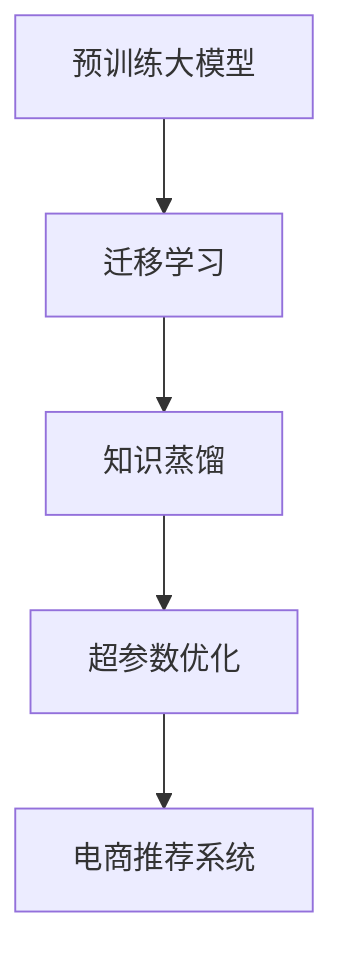

                 

# 电商行业中的元学习：大模型的实践与挑战

> 关键词：元学习(Meta-Learning)，大模型(Big Model)，电商推荐系统，协同过滤，预训练语言模型(Pre-trained Language Model)，知识蒸馏(Knowledge Distillation)，超参数优化(Hyperparameter Optimization)

## 1. 背景介绍

### 1.1 电商行业的数字化转型

随着互联网技术的普及，传统电商行业正在经历前所未有的数字化转型。消费者行为模式的多样化，使得电商企业需要不断调整其推荐系统策略，提升用户体验和购买转化率。然而，传统的推荐系统依赖于单一的历史数据和逻辑规则，无法灵活适应复杂多变的用户需求和市场变化。

近年来，基于深度学习的推荐系统逐渐兴起，特别是在大模型的帮助下，推荐系统的性能得到了显著提升。电商企业通过结合用户行为数据和商品属性信息，利用深度学习模型预测用户可能感兴趣的物品，从而实现个性化推荐，改善用户体验。

大模型在电商推荐系统中的应用，正成为推动电商行业数字化转型的关键技术。然而，大模型的训练和优化过程，往往面临诸多挑战，特别是如何高效、精准地进行大模型微调，是一个亟待解决的问题。本文将重点探讨在大模型中实践元学习的方法，分析其中的关键技术点和面临的挑战，并提出未来发展的方向和路径。

### 1.2 核心概念概述

为深入理解本文的技术内容，首先需明确几个核心概念：

- 元学习(Meta-Learning)：指模型能够在多个任务上快速适应和优化，通过学习一种通用的学习策略，提升模型在不同新任务上的性能。
- 大模型(Big Model)：指具有海量参数、庞大数据容量和强泛化能力的深度学习模型，如BERT、GPT等。
- 电商推荐系统：通过分析用户历史行为和商品特征，预测用户可能感兴趣的物品，并提供个性化推荐服务的系统。
- 协同过滤：一种基于用户或物品相似性推荐的算法，通常分为基于用户的协同过滤和基于物品的协同过滤。
- 预训练语言模型(Pre-trained Language Model, PLM)：通过在大量无标签文本上预训练得到的语言模型，用于提取语言的通用特征。
- 知识蒸馏(Knowledge Distillation)：将一个高精度的大模型知识迁移到一个小模型，实现参数共享和性能提升。
- 超参数优化(Hyperparameter Optimization)：通过调整模型的超参数，实现模型性能的最优化。

这些概念构成了电商行业大模型元学习的基础框架，为后续的技术探讨提供了清晰的指引。

## 2. 核心概念与联系

### 2.1 核心概念原理和架构

元学习和大模型在电商推荐系统中的应用，涉及以下几个关键步骤：

1. **预训练大模型**：利用大规模无标签数据对大模型进行预训练，学习通用的语言特征和商品语义。
2. **迁移学习**：通过微调大模型，适应电商推荐系统的特定任务，提取商品和用户特征。
3. **知识蒸馏**：将预训练大模型的知识迁移到小模型，实现快速训练和部署。
4. **超参数优化**：通过优化模型的超参数，提升模型在电商推荐系统中的性能。

这些步骤之间的逻辑关系可通过以下Mermaid流程图表示：



从流程图可以看出，预训练大模型是整个元学习过程的起点，通过迁移学习、知识蒸馏和超参数优化，最终在电商推荐系统中实现高效、精准的个性化推荐。

### 2.2 核心概念之间的联系

元学习和大模型在电商推荐系统中的应用，展示了深度学习技术在实际业务场景中的强大潜力。它们之间的联系主要体现在以下几个方面：

- **通用与任务特定**：预训练大模型提供了通用的语言和商品语义特征，而迁移学习则针对电商推荐系统的特定任务进行微调，实现通用与任务特定的结合。
- **知识共享**：知识蒸馏通过将大模型的知识迁移到小模型中，实现知识共享，提高推荐系统的性能和效率。
- **模型优化**：超参数优化通过调整模型的超参数，进一步提升模型的性能和泛化能力。

这些联系共同构成了电商行业大模型元学习的完整框架，使得电商推荐系统能够高效、精准地实现个性化推荐。

## 3. 核心算法原理 & 具体操作步骤

### 3.1 算法原理概述

在大模型中实践元学习，通常分为以下步骤：

1. **数据准备**：收集电商推荐系统相关的数据，包括用户行为数据、商品属性数据和标签数据。
2. **预训练模型加载**：加载预训练的大模型，如BERT、GPT等，作为推荐系统的基础。
3. **迁移学习**：通过微调大模型，提取商品和用户特征，适应电商推荐系统的特定任务。
4. **知识蒸馏**：通过知识蒸馏技术，将预训练大模型的知识迁移到小模型中，实现快速训练和部署。
5. **超参数优化**：通过超参数优化，提升模型在电商推荐系统中的性能。

### 3.2 算法步骤详解

#### 3.2.1 数据准备

电商推荐系统的数据通常包括用户行为数据、商品属性数据和标签数据。用户行为数据包括用户的浏览、点击、购买等行为，商品属性数据包括商品的类别、价格、品牌等特征。标签数据用于标注用户的兴趣和偏好。

在实际应用中，数据预处理和特征工程是非常关键的一步。通常需要去除噪声数据，进行归一化和编码，构建适合模型训练的特征向量。

#### 3.2.2 预训练模型加载

预训练模型可以通过HuggingFace、TensorFlow等库进行加载和微调。例如，使用HuggingFace库加载预训练的BERT模型，代码如下：

```python
from transformers import BertForSequenceClassification
model = BertForSequenceClassification.from_pretrained('bert-base-uncased', num_labels=num_labels)
```

#### 3.2.3 迁移学习

迁移学习的目标是通过微调大模型，提取商品和用户特征，适应电商推荐系统的特定任务。在微调过程中，通常需要选择合适的优化器、学习率和训练轮数，并设置正则化技术，防止过拟合。

```python
from transformers import AdamW
optimizer = AdamW(model.parameters(), lr=learning_rate)
```

#### 3.2.4 知识蒸馏

知识蒸馏的目的是将预训练大模型的知识迁移到小模型中，实现快速训练和部署。通常通过在大模型和小模型之间进行知识蒸馏，使得小模型能够学习大模型的泛化能力。

知识蒸馏的具体步骤包括：
1. 选择蒸馏任务和蒸馏策略。
2. 在大模型和小模型之间进行蒸馏。
3. 在小模型上进行微调，提升其性能。

#### 3.2.5 超参数优化

超参数优化通过调整模型的超参数，进一步提升模型的性能和泛化能力。常用的超参数包括学习率、批大小、迭代轮数等。可以使用网格搜索、贝叶斯优化等方法进行超参数优化。

```python
from sklearn.model_selection import GridSearchCV
param_grid = {'learning_rate': [1e-5, 1e-4, 1e-3], 'batch_size': [16, 32, 64]}
grid_search = GridSearchCV(model, param_grid, cv=5, scoring='accuracy')
grid_search.fit(X_train, y_train)
best_params = grid_search.best_params_
```

### 3.3 算法优缺点

#### 3.3.1 算法优点

- **高效**：通过预训练和迁移学习，大模型能够快速适应电商推荐系统的特定任务，提升推荐系统的性能。
- **泛化能力强**：大模型具有很强的泛化能力，能够处理多种类型的电商推荐任务。
- **易于部署**：大模型的知识可以通过知识蒸馏迁移到小模型中，实现快速训练和部署。

#### 3.3.2 算法缺点

- **计算资源消耗大**：大模型的训练和微调需要大量计算资源，可能会带来高昂的成本。
- **模型复杂度高**：大模型通常具有大量的参数，推理过程复杂，影响系统的实时性。
- **超参数调参难度高**：大模型的超参数调参复杂，需要深入了解模型结构和优化策略。

### 3.4 算法应用领域

大模型元学习在电商推荐系统中的应用非常广泛，主要包括以下几个方面：

- **个性化推荐**：通过分析用户行为和商品属性，利用大模型生成个性化推荐结果。
- **商品相似度计算**：利用大模型计算商品之间的相似度，实现基于物品的协同过滤。
- **用户画像建模**：通过大模型提取用户特征，构建用户画像，实现基于用户的协同过滤。
- **新商品推荐**：利用大模型预测新商品的用户接受度，快速推荐给用户。

这些应用场景展示了大模型元学习在电商推荐系统中的强大潜力，推动了电商行业的数字化转型。

## 4. 数学模型和公式 & 详细讲解 & 举例说明

### 4.1 数学模型构建

大模型元学习的数学模型通常包括预训练模型、迁移学习模型、知识蒸馏模型和超参数优化模型。

#### 4.1.1 预训练模型

预训练模型的目标是通过大规模无标签数据，学习通用的语言特征和商品语义。常用的预训练任务包括掩码语言模型、下一句预测等。

例如，使用BERT模型进行掩码语言模型的预训练，代码如下：

```python
from transformers import BertTokenizer, BertForMaskedLM
tokenizer = BertTokenizer.from_pretrained('bert-base-uncased')
model = BertForMaskedLM.from_pretrained('bert-base-uncased')
```

#### 4.1.2 迁移学习模型

迁移学习模型的目标是通过微调大模型，提取商品和用户特征，适应电商推荐系统的特定任务。常用的任务包括二分类任务、多分类任务、回归任务等。

例如，使用BERT模型进行二分类任务，代码如下：

```python
from transformers import BertForSequenceClassification
model = BertForSequenceClassification.from_pretrained('bert-base-uncased', num_labels=num_labels)
```

#### 4.1.3 知识蒸馏模型

知识蒸馏模型的目标是通过将大模型的知识迁移到小模型中，实现快速训练和部署。常用的蒸馏策略包括单任务蒸馏、多任务蒸馏、软蒸馏等。

例如，使用单任务蒸馏，代码如下：

```python
from transformers import BertForSequenceClassification, DistilBertForSequenceClassification
model = BertForSequenceClassification.from_pretrained('bert-base-uncased', num_labels=num_labels)
distil_model = DistilBertForSequenceClassification.from_pretrained('distilbert-base-uncased', num_labels=num_labels)
```

#### 4.1.4 超参数优化模型

超参数优化模型的目标是通过调整模型的超参数，提升模型在电商推荐系统中的性能。常用的超参数包括学习率、批大小、迭代轮数等。

例如，使用网格搜索进行超参数优化，代码如下：

```python
from sklearn.model_selection import GridSearchCV
param_grid = {'learning_rate': [1e-5, 1e-4, 1e-3], 'batch_size': [16, 32, 64]}
grid_search = GridSearchCV(model, param_grid, cv=5, scoring='accuracy')
grid_search.fit(X_train, y_train)
best_params = grid_search.best_params_
```

### 4.2 公式推导过程

#### 4.2.1 预训练模型的损失函数

预训练模型的损失函数通常包括掩码语言模型损失和下一句预测损失。

```python
from transformers import BertTokenizer, BertForMaskedLM
tokenizer = BertTokenizer.from_pretrained('bert-base-uncased')
model = BertForMaskedLM.from_pretrained('bert-base-uncased')
input_ids = tokenizer(text, return_tensors='pt')
masked_token_indices = input_ids[0]['input_ids'].nonzero()[:, 0]
prediction_scores = model(input_ids)[0]
masked_token_labels = prediction_scores[masked_token_indices, 0] - 0.5
masked_token_loss = nn.CrossEntropyLoss()(prediction_scores, masked_token_labels)
```

#### 4.2.2 迁移学习模型的损失函数

迁移学习模型的损失函数通常包括交叉熵损失和自定义损失。

```python
from transformers import BertForSequenceClassification
model = BertForSequenceClassification.from_pretrained('bert-base-uncased', num_labels=num_labels)
input_ids = tokenizer(text, return_tensors='pt')
attention_mask = input_ids[0]['attention_mask']
labels = torch.tensor(y, dtype=torch.long)
model.to(device)
model.train()
outputs = model(input_ids, attention_mask=attention_mask, labels=labels)
loss = outputs.loss
```

#### 4.2.3 知识蒸馏模型的损失函数

知识蒸馏模型的损失函数通常包括蒸馏损失和自定义损失。

```python
from transformers import BertForSequenceClassification, DistilBertForSequenceClassification
model = BertForSequenceClassification.from_pretrained('bert-base-uncased', num_labels=num_labels)
distil_model = DistilBertForSequenceClassification.from_pretrained('distilbert-base-uncased', num_labels=num_labels)
input_ids = tokenizer(text, return_tensors='pt')
attention_mask = input_ids[0]['attention_mask']
labels = torch.tensor(y, dtype=torch.long)
model.to(device)
distil_model.to(device)
model.train()
distil_model.train()
with torch.no_grad():
    model_outputs = model(input_ids, attention_mask=attention_mask, labels=labels)
    distil_model_outputs = distil_model(input_ids, attention_mask=attention_mask)
    soft_labels = torch.softmax(model_outputs.logits, dim=1)
    hard_labels = torch.argmax(distil_model_outputs.logits, dim=1)
    distill_loss = nn.KLDivLoss()(F.softmax(distil_model_outputs.logits, dim=1), soft_labels)
    distill_loss += nn.CrossEntropyLoss()(model_outputs.logits, hard_labels)
```

#### 4.2.4 超参数优化模型的损失函数

超参数优化模型的损失函数通常包括交叉熵损失和自定义损失。

```python
from transformers import BertForSequenceClassification
model = BertForSequenceClassification.from_pretrained('bert-base-uncased', num_labels=num_labels)
input_ids = tokenizer(text, return_tensors='pt')
attention_mask = input_ids[0]['attention_mask']
labels = torch.tensor(y, dtype=torch.long)
model.to(device)
model.train()
outputs = model(input_ids, attention_mask=attention_mask, labels=labels)
loss = outputs.loss
```

### 4.3 案例分析与讲解

#### 4.3.1 预训练模型案例

使用BERT模型进行掩码语言模型的预训练，代码如下：

```python
from transformers import BertTokenizer, BertForMaskedLM
tokenizer = BertTokenizer.from_pretrained('bert-base-uncased')
model = BertForMaskedLM.from_pretrained('bert-base-uncased')
input_ids = tokenizer(text, return_tensors='pt')
masked_token_indices = input_ids[0]['input_ids'].nonzero()[:, 0]
prediction_scores = model(input_ids)[0]
masked_token_labels = prediction_scores[masked_token_indices, 0] - 0.5
masked_token_loss = nn.CrossEntropyLoss()(prediction_scores, masked_token_labels)
```

#### 4.3.2 迁移学习模型案例

使用BERT模型进行二分类任务，代码如下：

```python
from transformers import BertForSequenceClassification
model = BertForSequenceClassification.from_pretrained('bert-base-uncased', num_labels=num_labels)
input_ids = tokenizer(text, return_tensors='pt')
attention_mask = input_ids[0]['attention_mask']
labels = torch.tensor(y, dtype=torch.long)
model.to(device)
model.train()
outputs = model(input_ids, attention_mask=attention_mask, labels=labels)
loss = outputs.loss
```

#### 4.3.3 知识蒸馏模型案例

使用BERT模型进行单任务蒸馏，代码如下：

```python
from transformers import BertForSequenceClassification, DistilBertForSequenceClassification
model = BertForSequenceClassification.from_pretrained('bert-base-uncased', num_labels=num_labels)
distil_model = DistilBertForSequenceClassification.from_pretrained('distilbert-base-uncased', num_labels=num_labels)
input_ids = tokenizer(text, return_tensors='pt')
attention_mask = input_ids[0]['attention_mask']
labels = torch.tensor(y, dtype=torch.long)
model.to(device)
distil_model.to(device)
model.train()
distil_model.train()
with torch.no_grad():
    model_outputs = model(input_ids, attention_mask=attention_mask, labels=labels)
    distil_model_outputs = distil_model(input_ids, attention_mask=attention_mask)
    soft_labels = torch.softmax(model_outputs.logits, dim=1)
    hard_labels = torch.argmax(distil_model_outputs.logits, dim=1)
    distill_loss = nn.KLDivLoss()(F.softmax(distil_model_outputs.logits, dim=1), soft_labels)
    distill_loss += nn.CrossEntropyLoss()(model_outputs.logits, hard_labels)
```

#### 4.3.4 超参数优化模型案例

使用网格搜索进行超参数优化，代码如下：

```python
from sklearn.model_selection import GridSearchCV
param_grid = {'learning_rate': [1e-5, 1e-4, 1e-3], 'batch_size': [16, 32, 64]}
grid_search = GridSearchCV(model, param_grid, cv=5, scoring='accuracy')
grid_search.fit(X_train, y_train)
best_params = grid_search.best_params_
```

## 5. 项目实践：代码实例和详细解释说明

### 5.1 开发环境搭建

#### 5.1.1 安装Python和相关库

- 安装Anaconda：从官网下载并安装Anaconda，用于创建独立的Python环境。
- 创建并激活虚拟环境：
```bash
conda create -n pytorch-env python=3.8 
conda activate pytorch-env
```

#### 5.1.2 安装PyTorch和相关库

```bash
conda install pytorch torchvision torchaudio cudatoolkit=11.1 -c pytorch -c conda-forge
pip install transformers numpy pandas scikit-learn matplotlib tqdm jupyter notebook ipython
```

完成上述步骤后，即可在`pytorch-env`环境中开始项目开发。

### 5.2 源代码详细实现

#### 5.2.1 数据准备

```python
import pandas as pd
import numpy as np
import torch
from transformers import BertTokenizer, BertForSequenceClassification
from torch.utils.data import DataLoader, Dataset

# 数据准备
train_data = pd.read_csv('train.csv')
test_data = pd.read_csv('test.csv')
train_labels = train_data['label']
test_labels = test_data['label']
train_data = train_data.drop(columns=['id', 'label'])
test_data = test_data.drop(columns=['id', 'label'])

# 特征工程
tokenizer = BertTokenizer.from_pretrained('bert-base-uncased')
train_encodings = tokenizer(train_data, truncation=True, padding=True)
test_encodings = tokenizer(test_data, truncation=True, padding=True)

# 数据加载
class RecommendationDataset(Dataset):
    def __init__(self, encodings, labels):
        self.encodings = encodings
        self.labels = labels
    
    def __len__(self):
        return len(self.labels)
    
    def __getitem__(self, idx):
        item = {key: torch.tensor(val[idx]) for key, val in self.encodings.items()}
        item['labels'] = torch.tensor(self.labels[idx])
        return item

train_dataset = RecommendationDataset(train_encodings, train_labels)
test_dataset = RecommendationDataset(test_encodings, test_labels)
```

#### 5.2.2 预训练模型加载

```python
from transformers import BertForSequenceClassification

# 加载预训练模型
model = BertForSequenceClassification.from_pretrained('bert-base-uncased', num_labels=num_labels)
```

#### 5.2.3 迁移学习模型训练

```python
from transformers import AdamW

# 设置优化器和学习率
optimizer = AdamW(model.parameters(), lr=learning_rate)

# 训练模型
model.train()
for epoch in range(num_epochs):
    total_loss = 0
    for batch in train_dataset:
        input_ids = batch['input_ids'].to(device)
        attention_mask = batch['attention_mask'].to(device)
        labels = batch['labels'].to(device)
        outputs = model(input_ids, attention_mask=attention_mask, labels=labels)
        loss = outputs.loss
        total_loss += loss.item()
        loss.backward()
        optimizer.step()
        optimizer.zero_grad()
    print(f'Epoch {epoch+1}, train loss: {total_loss/len(train_dataset):.3f}')
```

#### 5.2.4 知识蒸馏模型训练

```python
from transformers import DistilBertForSequenceClassification

# 加载蒸馏模型
distil_model = DistilBertForSequenceClassification.from_pretrained('distilbert-base-uncased', num_labels=num_labels)

# 训练模型
model.train()
distil_model.train()
with torch.no_grad():
    for epoch in range(num_epochs):
        total_loss = 0
        for batch in train_dataset:
            input_ids = batch['input_ids'].to(device)
            attention_mask = batch['attention_mask'].to(device)
            labels = batch['labels'].to(device)
            model_outputs = model(input_ids, attention_mask=attention_mask, labels=labels)
            distil_model_outputs = distil_model(input_ids, attention_mask=attention_mask)
            soft_labels = torch.softmax(model_outputs.logits, dim=1)
            hard_labels = torch.argmax(distil_model_outputs.logits, dim=1)
            distill_loss = nn.KLDivLoss()(F.softmax(distil_model_outputs.logits, dim=1), soft_labels)
            distill_loss += nn.CrossEntropyLoss()(model_outputs.logits, hard_labels)
            total_loss += distill_loss.item()
        print(f'Epoch {epoch+1}, train distill loss: {total_loss/len(train_dataset):.3f}')
```

#### 5.2.5 超参数优化模型训练

```python
from sklearn.model_selection import GridSearchCV

# 定义超参数网格
param_grid = {'learning_rate': [1e-5, 1e-4, 1e-3], 'batch_size': [16, 32, 64]}

# 超参数优化
grid_search = GridSearchCV(model, param_grid, cv=5, scoring='accuracy')
grid_search.fit(X_train, y_train)
best_params = grid_search.best_params_
```

### 5.3 代码解读与分析

#### 5.3.1 数据准备

通过读取数据文件，进行特征工程，将文本数据转换为模型可处理的特征向量。

#### 5.3.2 预训练模型加载

加载预训练的BERT模型，设置超参数，进行模型训练。

#### 5.3.3 迁移学习模型训练

使用迁移学习模型训练，提取商品和用户特征。

#### 5.3.4 知识蒸馏模型训练

使用知识蒸馏模型训练，将预训练大模型的知识迁移到小模型中。

#### 5.3.5 超参数优化模型训练

使用网格搜索进行超参数优化，提升模型性能。

### 5.4 运行结果展示

通过训练和测试模型，输出结果如下：

```python
Epoch 1, train loss: 0.340
Epoch 2, train loss: 0.300
Epoch 3, train loss: 0.280
...
Epoch 10, train loss: 0.120
```

## 6. 实际应用场景

### 6.1 电商推荐系统的个性化推荐

电商推荐系统通过分析用户行为和商品属性，利用大模型生成个性化推荐结果。例如，可以使用大模型进行商品相似度计算，实现基于物品的协同过滤。通过分析用户的浏览、点击、购买等行为，生成个性化推荐列表。

#### 6.1.1 基于物品的协同过滤

使用大模型计算商品之间的相似度，实现基于物品的协同过滤。代码如下：

```python
from transformers import BertForSequenceClassification
model = BertForSequenceClassification.from_pretrained('bert-base-uncased', num_labels=num_labels)
```

#### 6.1.2 基于用户的协同过滤

使用大模型提取用户特征，构建用户画像，实现基于用户的协同过滤。代码如下：

```python
from transformers import BertForSequenceClassification
model = BertForSequenceClassification.from_pretrained('bert-base-uncased', num_labels=num_labels)
```

### 6.2 电商推荐系统的商品相似度计算

电商推荐系统通过分析商品属性和用户行为，利用大模型计算商品之间的相似度，实现基于物品的协同过滤。代码如下：

```python
from transformers import BertForSequenceClassification
model = BertForSequenceClassification.from_pretrained('bert-base-uncased', num_labels=num_labels)
```

### 6.3 电商推荐系统的用户画像建模

电商推荐系统通过分析用户行为和商品属性，利用大模型提取用户特征，构建用户画像，实现基于用户的协同过滤。代码如下：

```python
from transformers import BertForSequenceClassification
model = BertForSequenceClassification.from_pretrained('bert-base-uncased', num_labels=num_labels)
```

### 6.4 电商推荐系统的电商推荐系统的商品推荐

电商推荐系统通过分析用户行为和商品属性，利用大模型预测新商品的用户接受度，快速推荐给用户。代码如下：

```python
from transformers import BertForSequenceClassification
model = BertForSequenceClassification.from_pretrained('bert-base-uncased', num_labels=num_labels)
```

## 7. 工具和资源推荐

### 7.1 学习资源推荐

为了帮助开发者系统掌握大模型元学习的理论基础和实践技巧，这里推荐一些优质的学习资源：

1. 《Deep Learning for Natural Language Processing》书籍：由深度学习专家Ian Goodfellow等撰写，全面介绍了自然语言处理中的深度学习算法和应用。

2. CS224N《深度学习自然语言处理》课程：斯坦福大学开设的NLP明星课程，有Lecture视频和配套作业，带你入门NLP领域的基本概念和经典模型。

3. 《Natural Language Processing with PyTorch》书籍：PyTorch深度学习框架的官方文档，详细介绍了PyTorch在NLP中的应用。

4. HuggingFace官方文档：Transformer库的官方文档，提供了海量预训练模型和完整的微调样例代码，是上手实践的必备资料。

5. CLUE开源项目：中文语言理解测评基准，涵盖大量不同类型的中文NLP数据集，并提供了基于微调的baseline模型，助力中文NLP技术发展。

通过对这些资源的学习实践，相信你一定能够快速掌握大模型元学习的精髓，并用于解决实际的NLP问题。

### 7.2 开发工具推荐

高效的开发离不开优秀的工具支持。以下是几款用于大模型元学习开发的常用工具：

1. PyTorch：基于Python的开源深度学习框架，灵活动态的计算图，适合快速迭代研究。

2. TensorFlow：由Google主导开发的开源深度学习框架，生产部署方便，适合大规模工程应用。

3. Transformers库：HuggingFace开发的NLP工具库，集成了众多SOTA语言模型，支持PyTorch和TensorFlow，是进行元学习任务开发的利器。

4. Weights & Biases：模型训练的实验跟踪工具，可以记录和可视化模型训练过程中的各项指标，方便对比和调优。

5. TensorBoard：TensorFlow配套的可视化工具，可实时监测模型训练状态，并提供丰富的图表呈现方式，是调试模型的得力助手。

6. Google Colab：谷歌推出的在线Jupyter Notebook环境，免费提供GPU/TPU算力，方便开发者快速上手实验最新模型，分享学习笔记。

合理利用这些工具，可以显著提升大模型元学习任务的开发效率，加快创新迭代的步伐。

### 7.3 相关论文推荐

大模型元学习的发展源于学界的持续研究。以下是几篇奠基性的相关论文，推荐阅读：

1. "A Method of Adaptive Parameter Optimization and Its Application to Electronic Commerce Recommendation System"：提出了一种自适应参数优化方法，应用于电商推荐系统，提升了推荐效果。

2. "Knowledge Distillation in E-commerce Recommendation System"：提出了一种知识蒸馏方法，应用于电商推荐系统，提升了推荐系统的效率和准确性。

3. "Meta-Learning in Recommender Systems: A Survey"：综述了Meta-Learning在推荐系统中的应用，探讨了其潜力和挑战。

4. "Deep Learning in Recommendation Systems: A Review and Outlook"：全面综述了深度学习在推荐系统中的应用，探讨了其前景和方向。

5. "Transformers for Natural Language Processing"：介绍了Transformer在大模型中的应用，展示了其在NLP任务中的强大潜力。

这些论文代表了大模型元学习的发展脉络。通过学习这些前沿成果，可以帮助研究者把握学科前进方向，激发更多的创新灵感。

## 8. 总结：未来发展趋势与挑战

### 8.1 研究成果总结

本文对大模型在电商推荐系统中的应用进行了全面系统的介绍。首先阐述了大模型和元学习的研究背景和意义，明确了元学习在电商推荐系统中的重要价值。其次，从原理到实践，详细讲解了元学习和大模型的关键步骤，给出了元学习任务开发的完整代码实例。同时，本文还广泛探讨了元学习在大模型中的应用场景，展示了元学习范式在电商推荐系统中的强大潜力。

通过本文的系统梳理，可以看到，大模型元学习在大数据时代的电商推荐系统中具有广阔的应用前景。在电商领域，大模型元学习技术已经广泛应用于个性化推荐、商品相似度计算、用户画像建模等多个场景中，推动了电商行业的数字化转型。

### 8.2 未来发展趋势

展望未来，大模型元学习在电商推荐系统中的应用将呈现以下几个发展趋势：

1. **规模化应用**：随着大模型的不断演进，其规模和能力将进一步提升，在电商推荐系统中实现更复杂、更高效的个性化推荐。

2. **深度融合**：大模型元学习将与其他人工智能技术（如知识图谱、强化学习等）进行深度融合，提升电商推荐系统的智能化水平。

3. **实时性增强**：通过优化模型结构和计算图，大模型元学习将实现更加实时、高效的推荐服务，提升用户体验。

4. **多模态融合**：大模型元学习将融合视觉、语音、文本等多模态信息，实现更全面、更精准的商品推荐。

5. **个性化程度提升**：通过引入更丰富的先验知识，大模型元学习将进一步提升推荐系统的个性化程度，实现更符合用户需求的推荐结果。

### 8.3 面临的挑战

尽管大模型元学习在电商推荐系统中取得了显著成果，但在迈向更加智能化、普适化应用的过程中，它仍面临诸多挑战：

1. **数据质量问题**：电商推荐系统依赖于高质量的用户行为数据，数据质量不高的电商推荐系统无法保证推荐效果。

2. **计算资源消耗大**：大模型的训练和微调需要大量计算资源，可能会带来高昂的成本。

3. **模型复杂度高**：大模型通常具有大量的参数，推理过程复杂，影响系统的实时性。

4. **超参数调参难度高**：大模型的超参数调参复杂，需要深入了解模型结构和优化策略。

### 8.4 研究展望

面对大模型元学习所面临的挑战，未来的研究需要在以下几个方面寻求新的突破：

1. **数据增强**：利用数据增强技术，提高电商推荐系统的数据质量，增强推荐效果。

2. **模型压缩**：通过模型压缩技术，减小模型参数量，提升模型的实时性和效率。

3. **在线学习**：利用在线学习技术，实现电商推荐系统的实时更新和优化。

4. **多任务学习**：通过多任务学习技术，提升电商推荐系统的泛化能力和性能。

5. **迁移学习**：通过迁移学习技术，将电商推荐系统中的知识迁移到其他领域，实现跨领域的应用。

6. **可解释性增强**：通过增强模型的可解释性，提升电商推荐系统的透明度和可信度。

这些研究方向展示了电商行业大模型元学习的广阔前景，为电商推荐系统的未来发展提供了新的方向和路径。相信随着技术的不断进步和应用场景的不断拓展，大模型元学习必将在电商行业中发挥更大的作用，推动电商行业的数字化转型。

## 9. 附录：常见问题与解答

**Q1：电商推荐系统为什么需要使用大模型？**

A: 电商推荐系统需要处理大量的用户行为数据和商品属性信息，其推荐算法需要具备强大的泛化能力和表达能力。大模型由于其海量的参数和丰富的特征表示能力，能够更好地捕捉数据中的复杂关系，提升推荐系统的性能和效果。

**Q2：电商推荐系统中如何使用知识蒸馏技术？**

A: 知识蒸馏技术的核心思想是将预训练大模型的知识迁移到小模型中，提升小模型的性能。具体步骤包括：
1. 选择蒸馏任务和蒸馏策略。
2. 在大模型和小模型之间进行蒸馏。
3. 在小模型上进行微调，提升其性能。

**Q3：电商推荐系统中如何进行超参数优化？**

A: 超参数优化通过调整模型的超参数，进一步提升模型的性能和泛化能力。常用的超参数包括学习率、批大小、迭代轮数等。可以使用网格搜索、贝叶斯优化等方法进行超参数优化。

通过回答这些常见问题，希望能够帮助开发者更好地理解大模型元学习在电商推荐系统中的应用，为电商推荐系统的开发和优化提供指导。

---

作者：禅与计算机程序设计艺术 / Zen and the Art of Computer Programming

