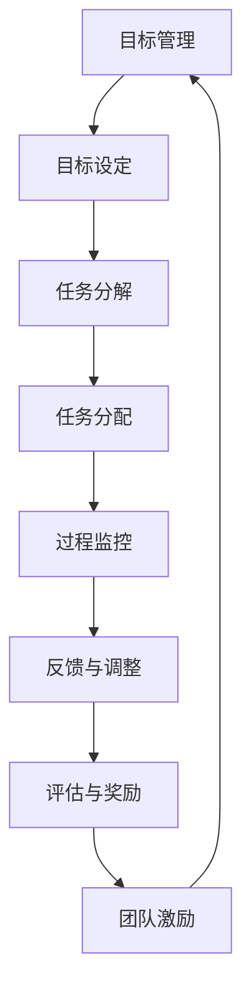

                 

# 目标管理与团队激励的关系

## 1. 背景介绍

目标管理（Goal Management）与团队激励（Team Motivation）是现代企业管理中两个至关重要的环节。有效的目标管理能明确团队方向，提高工作效率；而团队激励则能有效提升员工的工作积极性，提高团队的凝聚力。两者相辅相成，共同推动企业的发展。本文将详细探讨目标管理与团队激励的关系，帮助管理者更好地理解并应用这些管理技巧。

## 2. 核心概念与联系

### 2.1 核心概念概述

#### 目标管理

目标管理是一种现代企业管理模式，通过明确设定目标、规划行动步骤、执行和监控、评估与反馈等步骤，使团队明确工作方向和目标，并按照设定的目标进行有效工作。核心要素包括SMART原则（Specific、Measurable、Achievable、Relevant、Time-bound），OKR（Objectives and Key Results）方法等。

#### 团队激励

团队激励是指通过各种手段激发团队成员的工作热情和积极性，使其充分发挥潜能，实现团队目标。激励手段包括物质激励、精神激励、领导激励、环境激励等。

#### 目标管理与团队激励的联系

目标管理与团队激励之间的联系主要体现在以下几个方面：

1. **目标设定**：目标设定是团队激励的基础，清晰的目标能够激发团队成员的热情和动力。
2. **任务分配**：通过目标管理，将大目标分解为小任务，分配给团队成员，有利于激发个人的工作热情。
3. **过程监控与反馈**：目标管理中的过程监控和反馈机制，能够及时调整激励手段，确保团队成员保持高昂的工作热情。
4. **评估与奖励**：目标管理中的评估与奖励机制，是团队激励的重要组成部分，能够有效激励团队成员的积极性。

### 2.2 核心概念原理和架构的 Mermaid 流程图



## 3. 核心算法原理 & 具体操作步骤

### 3.1 算法原理概述

目标管理与团队激励的算法原理主要包括以下几个方面：

1. **SMART目标设定**：目标必须满足具体（Specific）、可测量（Measurable）、可实现（Achievable）、相关性（Relevant）、时限性（Time-bound）等原则。
2. **OKR方法**：OKR通过设定Objectives（目标）和Key Results（关键结果），实现目标的量化和透明化，便于监控和评估。
3. **任务分配与过程监控**：通过将大目标分解为小任务，并按阶段监控任务的执行情况，确保任务按时完成。
4. **反馈与调整**：根据任务的实际进展情况，及时调整激励手段，确保团队成员始终保持高昂的工作热情。
5. **评估与奖励**：通过评估团队成员的工作表现，给予相应的奖励和认可，激励其继续努力。

### 3.2 算法步骤详解

#### 目标设定

1. **确定总体目标**：在团队会议上，管理者与团队成员共同讨论并确定团队的总体目标。目标应符合SMART原则，确保其具体、可测量、可实现、相关且有时限性。
2. **设定关键结果**：根据总体目标，设定几个关键结果（KR），明确每个KR的具体指标和完成时间。

#### 任务分解

1. **分解任务**：将总体目标分解为若干个子目标或具体任务，每个子目标或任务应明确、具体且具有可执行性。
2. **分配任务**：根据团队成员的能力和兴趣，将任务分配给相应的成员，并明确每个成员的职责和任务完成时间。

#### 过程监控

1. **设定里程碑**：在任务分解的基础上，设定关键里程碑，用于监控任务进展。
2. **定期检查**：每周或每月定期检查任务进展，记录实际完成情况和遇到的问题。

#### 反馈与调整

1. **及时反馈**：根据任务进展情况，及时向团队成员提供反馈，指出问题所在，并给予改进建议。
2. **调整激励手段**：根据团队成员的反馈和实际表现，适时调整激励手段，如增加奖金、提供培训机会等。

#### 评估与奖励

1. **评估绩效**：根据设定的KR，评估团队成员的绩效表现。
2. **给予奖励**：对于表现优秀的团队成员，给予相应的奖励和认可，如加薪、晋升等。

### 3.3 算法优缺点

#### 优点

1. **提高工作效率**：目标管理和团队激励能够明确工作方向和任务，提高团队的工作效率。
2. **激发团队积极性**：通过设定具体目标和给予奖励，有效激发团队成员的工作热情和积极性。
3. **增强团队凝聚力**：共同的目标和激励手段能够增强团队成员的凝聚力和归属感。

#### 缺点

1. **目标设定困难**：目标设定需要充分考虑实际情况和团队能力，设定过高或过低都会影响团队的积极性。
2. **过程监控成本高**：目标管理和过程监控需要耗费大量时间和精力，对于大型团队而言，监控成本较高。
3. **激励手段单一**：如果激励手段过于单一，容易使团队成员产生厌倦，影响工作积极性。

### 3.4 算法应用领域

目标管理与团队激励的应用领域非常广泛，包括但不限于：

1. **企业管理**：适用于企业内部的项目管理、团队建设、绩效评估等。
2. **产品开发**：适用于软件开发、项目管理等，确保项目按时完成并符合质量要求。
3. **教育培训**：适用于学校和培训机构的课程设计、学生管理等，提高学习效果和学生满意度。
4. **非营利组织**：适用于慈善机构、非政府组织等，确保项目顺利进行并达成预期目标。

## 4. 数学模型和公式 & 详细讲解 & 举例说明

### 4.1 数学模型构建

设团队目标为 $G$，关键结果为 $KR_1, KR_2, \ldots, KR_n$，团队成员为 $M_1, M_2, \ldots, M_m$。则目标管理与团队激励的数学模型可以表示为：

$$
G = KR_1 + KR_2 + \ldots + KR_n
$$

其中，$KR_i$ 为第 $i$ 个关键结果，$M_j$ 为第 $j$ 个团队成员。

### 4.2 公式推导过程

1. **目标设定**：设团队总体目标为 $G$，根据SMART原则，将目标 $G$ 分解为 $n$ 个关键结果 $KR_1, KR_2, \ldots, KR_n$。
2. **任务分解**：将每个 $KR_i$ 进一步分解为若干个子任务 $T_{ij}$，分配给 $m$ 个团队成员 $M_1, M_2, \ldots, M_m$。
3. **过程监控**：设定关键里程碑 $M_i$，记录每个子任务 $T_{ij}$ 的进展情况。
4. **反馈与调整**：根据实际进展情况 $P_{ij}$，及时反馈和调整激励手段 $I_j$。
5. **评估与奖励**：评估每个团队成员 $M_j$ 的绩效 $P_j$，给予相应的奖励 $R_j$。

### 4.3 案例分析与讲解

假设某软件开发团队，总体目标是在3个月内完成一个新产品的开发。团队设定了以下关键结果：

- 第一个月内完成需求分析和设计
- 第二个月内完成编码和单元测试
- 第三个月内完成集成测试和部署

每个关键结果进一步分解为若干个子任务，分配给团队成员：

- 第一个月：需求分析（张三负责）、设计（李四负责）
- 第二个月：编码（王五负责）、单元测试（赵六负责）
- 第三个月：集成测试（张三负责）、部署（李四负责）

团队每周定期检查任务进展，记录实际完成情况，并根据实际情况调整激励手段，如增加奖金、提供培训机会等。最终，团队成功按时完成了新产品的开发。

## 5. 项目实践：代码实例和详细解释说明

### 5.1 开发环境搭建

- **环境要求**：Python 3.7及以上版本
- **安装Python**：
```bash
sudo apt-get update
sudo apt-get install python3.7 python3-pip python3-dev
```
- **安装pandas和numpy**：
```bash
pip install pandas numpy
```

### 5.2 源代码详细实现

```python
import pandas as pd
import numpy as np

# 目标管理与团队激励的数据结构
class GoalManagement:
    def __init__(self, target, key_results, members, tasks, milestones):
        self.target = target
        self.key_results = key_results
        self.members = members
        self.tasks = tasks
        self.milestones = milestones
    
    def set_targets(self):
        # 设定总体目标
        self.target = np.sum(self.key_results)
    
    def task_decomposition(self):
        # 任务分解
        task_decomposed = []
        for member in self.members:
            for key_result in self.key_results:
                for task in self.tasks[key_result]:
                    task_decomposed.append((member, task))
        return task_decomposed
    
    def process_monitoring(self):
        # 过程监控
        completed_tasks = []
        for task in self.tasks.values():
            for milestone in self.milestones:
                if task['start'] <= milestone <= task['end']:
                    completed_tasks.append(task)
        return completed_tasks
    
    def feedback_adjustment(self):
        # 反馈与调整
        feedback = []
        for member in self.members:
            for task in self.tasks.values():
                if member in task['members']:
                    if task['status'] == 'completed':
                        feedback.append((member, task['result']))
                    else:
                        feedback.append((member, 'not completed'))
        return feedback
    
    def performance_assessment(self):
        # 评估与奖励
        performance = {}
        for member in self.members:
            total_score = 0
            for key_result in self.key_results:
                for task in self.tasks[key_result]:
                    if member in task['members']:
                        if task['status'] == 'completed':
                            total_score += task['result']
                        else:
                            total_score += 0
            performance[member] = total_score
        return performance
```

### 5.3 代码解读与分析

- **GoalManagement类**：包含目标管理与团队激励的主要方法。
- **set_targets()方法**：设定总体目标，将关键结果相加。
- **task_decomposition()方法**：将关键结果分解为子任务，并分配给团队成员。
- **process_monitoring()方法**：监控任务进展，记录已完成的任务。
- **feedback_adjustment()方法**：根据任务进展情况，提供反馈并调整激励手段。
- **performance_assessment()方法**：评估团队成员的绩效，并给予奖励。

### 5.4 运行结果展示

以下是一个简单的运行示例：

```python
# 创建目标管理与团队激励对象
gm = GoalManagement(target=100, key_results=[40, 50, 10], members=['张三', '李四', '王五', '赵六'], tasks={'需求分析': ['张三'], '设计': ['李四'], '编码': ['王五'], '单元测试': ['赵六'], '集成测试': ['张三'], '部署': ['李四']}, milestones=[0, 30, 60, 90])

# 执行任务分解
task_decomposed = gm.task_decomposition()
print('任务分解结果：', task_decomposed)

# 执行过程监控
completed_tasks = gm.process_monitoring()
print('任务监控结果：', completed_tasks)

# 执行反馈与调整
feedback = gm.feedback_adjustment()
print('反馈与调整结果：', feedback)

# 执行评估与奖励
performance = gm.performance_assessment()
print('绩效评估结果：', performance)
```

## 6. 实际应用场景

### 6.1 企业管理

在企业管理中，目标管理和团队激励被广泛应用于项目管理和绩效评估。例如，某企业计划在3个月内完成一个新产品上市的营销推广。通过设定具体目标和关键结果，将推广任务分解为市场调研、广告投放、渠道建设等子任务，分配给市场部、广告部、销售部等团队成员，并进行过程监控和反馈调整，确保任务按时完成，最终达成预期目标。

### 6.2 产品开发

在产品开发中，目标管理和团队激励被应用于软件开发和项目管理。例如，某软件团队计划在3个月内完成一个新产品的开发。通过设定明确的目标和关键结果，将开发任务分解为需求分析、设计、编码、测试等子任务，分配给团队成员，并进行过程监控和反馈调整，确保任务按时完成，最终成功发布产品。

### 6.3 教育培训

在教育培训中，目标管理和团队激励被应用于课程设计和学生管理。例如，某培训机构计划在3个月内提升学生的学习效果。通过设定具体的学习目标和关键结果，将学习任务分解为预习、复习、作业等子任务，分配给学生，并进行过程监控和反馈调整，确保学生按时完成学习任务，最终达成预期学习效果。

## 7. 工具和资源推荐

### 7.1 学习资源推荐

1. **《目标管理：从SMART到OKR》**：讲解SMART目标管理和OKR方法，提供实用的工具和案例。
2. **《激励心理学》**：介绍激励理论和实践，提供丰富的案例和建议。
3. **Coursera《目标设定与管理》**：由知名大学教授讲授，提供系统性的目标管理知识。
4. **Udemy《团队激励：从理论到实践》**：提供详细的团队激励策略和方法。
5. **《哈佛商业评论》**：提供大量的成功案例和实际应用经验。

### 7.2 开发工具推荐

1. **JIRA**：项目管理工具，支持目标设定、任务分解、过程监控和反馈调整。
2. **Slack**：团队沟通工具，支持任务分配、即时反馈和团队激励。
3. **Google Sheets**：数据分析工具，支持数据可视化、任务监控和绩效评估。
4. **Trello**：项目管理工具，支持任务分解和进度跟踪。
5. **Asana**：项目管理工具，支持任务分配、过程监控和反馈调整。

### 7.3 相关论文推荐

1. **《SMART目标管理：理论与实践》**：详细介绍SMART目标管理的理论和实践应用。
2. **《OKR方法：从目标设定到结果实现》**：详细介绍OKR方法的原理和应用。
3. **《团队激励：理论、实践与案例》**：详细介绍团队激励的理论基础和实际案例。
4. **《目标管理与绩效评估：理论与实践》**：详细介绍目标管理与绩效评估的理论和实践。

## 8. 总结：未来发展趋势与挑战

### 8.1 未来发展趋势

1. **AI与目标管理结合**：未来，人工智能将被广泛应用于目标管理中，如通过AI预测目标实现情况，自动调整激励手段。
2. **实时监控与反馈**：实时监控和反馈将成为目标管理的重要手段，确保目标任务的顺利完成。
3. **个性化激励**：个性化激励将成为团队激励的重要方向，根据团队成员的个性和需求进行有针对性的激励。
4. **跨部门协作**：跨部门协作将成为团队激励的重要目标，促进部门间的沟通和协作，提升整体效率。

### 8.2 面临的挑战

1. **目标设定困难**：目标设定需要充分考虑实际情况和团队能力，设定过高或过低都会影响团队的积极性。
2. **过程监控成本高**：目标管理和过程监控需要耗费大量时间和精力，对于大型团队而言，监控成本较高。
3. **激励手段单一**：如果激励手段过于单一，容易使团队成员产生厌倦，影响工作积极性。
4. **跨部门协作复杂**：跨部门协作需要协调多个团队，增加管理难度。

### 8.3 研究展望

未来，目标管理和团队激励将进一步与人工智能、大数据等技术结合，实现自动化、个性化和实时化的管理。通过优化目标设定、任务分解、过程监控、反馈调整和绩效评估，提升团队的工作效率和积极性，推动企业发展。

## 9. 附录：常见问题与解答

**Q1：目标管理与团队激励的优点是什么？**

A: 目标管理与团队激励的优点主要包括：
1. 明确工作方向和任务，提高工作效率。
2. 激发团队成员的热情和积极性，提升整体绩效。
3. 增强团队凝聚力和归属感，促进团队协作。

**Q2：如何设定具体且可实现的目标？**

A: 设定具体且可实现的目标应遵循SMART原则，即：
1. Specific（具体的）：明确目标的具体内容。
2. Measurable（可测量的）：设定可以量化的目标指标。
3. Achievable（可实现的）：确保目标在现有资源和能力下可实现。
4. Relevant（相关的）：目标应与团队的长期战略相关。
5. Time-bound（时限性的）：设定明确的时间期限。

**Q3：过程监控和反馈调整的重要性是什么？**

A: 过程监控和反馈调整的重要性主要体现在以下几个方面：
1. 及时发现问题，避免任务延期或失败。
2. 提供实时反馈，调整激励手段，保持团队成员的工作热情。
3. 评估任务进展，优化资源配置，确保任务按时完成。

**Q4：如何提升团队成员的激励效果？**

A: 提升团队成员的激励效果可以从以下几个方面入手：
1. 提供个性化的激励手段，如增加奖金、提供培训机会等。
2. 建立公正的绩效评估机制，确保激励措施公平合理。
3. 提供良好的工作环境和企业文化，增强团队成员的归属感和满意度。
4. 关注团队成员的个人发展，提供成长机会和职业晋升路径。

**Q5：目标管理和团队激励如何与AI技术结合？**

A: 目标管理和团队激励与AI技术的结合可以体现在以下几个方面：
1. 通过AI预测目标实现情况，自动调整激励手段。
2. 使用AI进行任务分解和进度跟踪，提高管理效率。
3. 利用AI分析团队成员的工作表现，提供个性化反馈和建议。
4. 通过AI优化过程监控和反馈调整，确保任务按时完成。

---

作者：禅与计算机程序设计艺术 / Zen and the Art of Computer Programming

