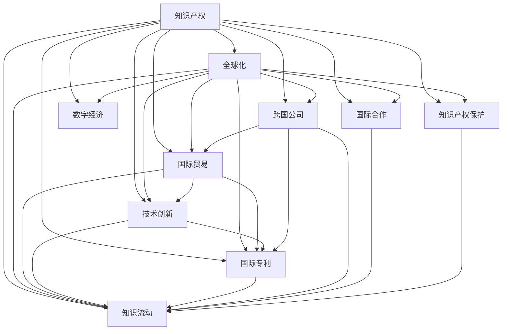

                 

# 知识产权与全球化的互动关系

> 关键词：知识产权,全球化,国际贸易,技术创新,国际专利,跨国公司,国际合作,知识流动,知识产权保护,数字经济

## 1. 背景介绍

### 1.1 问题由来

在全球化的浪潮下，知识产权与国际贸易、技术创新等领域密切关联，互相影响。知识产权（Intellectual Property, IP）涵盖了专利、商标、版权、商业秘密等多种类型，是保护创意、发明和劳动成果的法律手段。在全球化背景下，跨国公司通过知识产权策略进行市场竞争，获取全球资源，同时也面临如何在不同国家和地区的法律体系下维护自身权益的挑战。

### 1.2 问题核心关键点

知识产权与全球化之间的互动涉及多方面内容，包括但不限于：

- 跨国公司的全球知识产权战略
- 国际贸易中的知识产权保护与争端解决
- 技术创新与知识产权的法律保障
- 全球知识流动对知识产权政策的影响
- 数字经济时代知识产权的新挑战

本文将深入探讨这些关键点，分析全球化背景下的知识产权运作机制，并展望未来的发展趋势。

## 2. 核心概念与联系

### 2.1 核心概念概述

- **知识产权**：指对文学、艺术、科学等领域内的发明、创作等创新成果所享有的独占权利。包括专利、商标、版权、商业秘密等。
- **全球化**：指经济、文化、信息等在全球范围内流动、融合的过程，包括国际贸易、资本流动、技术转移等。
- **国际贸易**：指不同国家之间商品、服务、资本、技术和信息的交换，涉及海关、税收、知识产权保护等内容。
- **技术创新**：指在技术领域进行新的探索、发明和改进，推动经济和社会发展。
- **国际专利**：指各国根据国际条约（如《专利合作条约》）相互承认的专利权，便于跨国专利申请和保护。
- **跨国公司**：指在全球范围内经营，同时在多个国家设有分支机构的大型企业。
- **国际合作**：指不同国家或地区在科技、文化、经济等领域的合作。
- **知识流动**：指知识、信息在国家之间、组织之间的传递与交流。
- **知识产权保护**：指通过法律手段保护知识产权不受侵犯，维护创新者的合法权益。
- **数字经济**：指以数字技术为基础的经济活动，涉及网络、数据、人工智能等。

这些概念之间的逻辑关系可以通过以下Mermaid流程图来展示：



该流程图展示了知识产权与全球化之间的多层互动关系，包括国际贸易、技术创新、国际专利、跨国公司、国际合作、知识流动、数字经济等多个方面。

## 3. 核心算法原理 & 具体操作步骤

### 3.1 算法原理概述

知识产权与全球化的互动，涉及复杂的多边关系和多层面的利益博弈。算法模型主要从以下几个角度进行探讨：

- **跨国公司的专利申请与布局策略**：跨国公司如何通过专利布局获得市场优势，以及全球化对专利策略的影响。
- **国际贸易中的专利争端解决机制**：不同国家和地区在专利争端中的法律框架和争端解决流程。
- **技术创新与专利保护的法律保障**：如何通过法律手段保障技术创新，促进知识流动。
- **国际合作与知识产权共享**：跨国公司在技术研发和知识产权保护中的国际合作模式。
- **数字经济时代知识产权的新挑战**：数字经济下知识产权保护的新问题和解决策略。

### 3.2 算法步骤详解

**步骤1：跨国公司专利申请与布局**

跨国公司在不同国家和地区申请专利，进行专利布局，以期获得全球市场和技术竞争的优势。这些步骤包括：

1. **专利搜索**：利用专利数据库如PatentScope、PatentLink等，进行专利搜索和分析，确定技术领域的专利态势。
2. **专利申请**：在目标市场申请专利，利用专利申请数据库如USPTO、WIPO等，提交专利申请。
3. **专利布局**：在全球范围内进行专利布局，确保技术创新的法律保护。

**步骤2：国际贸易中的专利争端解决**

国际贸易中，不同国家和地区可能存在专利法律冲突，导致专利争端。这些步骤包括：

1. **专利法适用**：确定目标市场专利法的适用性，选择当地专利法律进行专利保护。
2. **专利纠纷**：当专利侵权或纠纷发生时，利用当地法律进行维权，如通过国际贸易法庭、专利复审委员会等机构解决纠纷。
3. **专利保护强化**：利用WTO、WIPO等国际组织框架，加强国际知识产权保护。

**步骤3：技术创新与专利保护的法律保障**

技术创新与专利保护的法律保障涉及多方面内容，这些步骤包括：

1. **专利申请策略**：制定专利申请策略，确定申请的优先级和时间节点。
2. **专利法律保障**：通过专利法保障技术创新，确保专利权人的合法权益。
3. **专利侵权举证**：收集证据，证明专利侵权行为，进行专利侵权诉讼。

**步骤4：国际合作与知识产权共享**

国际合作与知识产权共享涉及跨国公司在技术研发和知识产权保护中的合作模式，这些步骤包括：

1. **研发合作**：与跨国公司、研究机构进行研发合作，共享技术资源。
2. **专利授权**：通过专利授权协议，共享专利技术和知识产权。
3. **知识共享平台**：利用知识共享平台，如GitHub、ResearchGate等，促进知识流动。

**步骤5：数字经济时代知识产权的新挑战**

数字经济时代，知识产权面临新挑战，这些步骤包括：

1. **数据隐私保护**：制定数据隐私保护政策，确保用户数据安全。
2. **数字版权管理**：利用区块链等技术，进行数字版权管理，确保版权保护。
3. **知识产权保护创新**：利用人工智能、大数据等技术，提高知识产权保护效率。

### 3.3 算法优缺点

**优点**：

- **全球市场覆盖**：通过专利布局和国际合作，跨国公司可以覆盖全球市场，获取竞争优势。
- **法律保障**：通过专利法和国际贸易争端解决机制，保障技术创新和知识产权保护。
- **知识流动**：促进跨国公司和研究机构之间的知识共享，加速技术创新。

**缺点**：

- **法律复杂**：不同国家和地区的专利法律差异较大，知识产权保护需要熟悉多国法律。
- **成本高昂**：跨国专利申请和维权成本较高，需要大量资金支持。
- **风险存在**：知识产权保护存在法律风险，不同国家的法律体系可能存在差异。

### 3.4 算法应用领域

知识产权与全球化的互动主要应用于以下领域：

- **国际贸易**：涉及国际贸易协定、专利法律适用等。
- **跨国公司**：涉及专利布局、技术合作等。
- **技术创新**：涉及专利申请、专利侵权诉讼等。
- **国际合作**：涉及跨国专利授权、知识共享平台等。
- **数字经济**：涉及数据隐私保护、数字版权管理等。

## 4. 数学模型和公式 & 详细讲解 & 举例说明

### 4.1 数学模型构建

本文中的模型构建主要涉及专利申请策略和专利侵权举证的法律保障。

假设有一个跨国公司A，在多个国家B、C、D申请专利，并面临来自本地公司B'的专利侵权指控。模型构建的数学框架如下：

1. **专利申请策略**：计算每个国家的专利申请成本和保护强度，计算总体申请成本。

2. **专利侵权举证**：构建侵权证据链，计算侵权损失和维权成本，评估维权策略。

### 4.2 公式推导过程

**专利申请成本计算**：

假设每个国家的专利申请成本为C_i（i表示国家），保护强度为S_i，总的专利申请成本为C_total，则：

$$
C_{total} = \sum_{i} C_i
$$

**专利侵权举证计算**：

假设侵权损失为L，维权成本为C_defense，维权成功率P，则：

$$
C_{defense} = L \times (1-P) \times K
$$

其中K为维权成本系数。

### 4.3 案例分析与讲解

**案例：跨国公司A的专利申请策略**

跨国公司A在多个国家B、C、D申请专利，计算每个国家的专利申请成本和保护强度。假设申请成本分别为C_B=100, C_C=80, C_D=120，保护强度分别为S_B=0.9, S_C=0.8, S_D=0.7。计算总申请成本和总保护强度：

$$
C_{total} = 100 + 80 + 120 = 300
$$

$$
S_{total} = 0.9 + 0.8 + 0.7 = 2.4
$$

**案例：跨国公司A的专利侵权举证**

假设跨国公司A面临本地公司B'的专利侵权指控，侵权损失为L=50万美元，维权成本为C_defense=20万美元，维权成功率P=0.5。则：

$$
C_{defense} = 50 \times (1-0.5) \times 1 = 25
$$

## 5. 项目实践：代码实例和详细解释说明

### 5.1 开发环境搭建

开发环境搭建主要涉及以下几个步骤：

1. **环境准备**：搭建Python开发环境，安装必要的第三方库如patentscope、patentlink、pandas等。
2. **数据准备**：收集各国的专利申请和侵权数据，导入数据库。
3. **数据处理**：对数据进行清洗和预处理，生成分析所需的数据集。

### 5.2 源代码详细实现

以下是一个简单的Python代码示例，用于计算跨国公司A在不同国家的专利申请成本和保护强度，并进行专利侵权举证分析：

```python
import pandas as pd
from patentscope import PatentScope
from patentlink import PatentLink

# 准备数据
patent_data = pd.read_csv('patent_data.csv')
company_name = 'A'
countries = ['B', 'C', 'D']

# 计算申请成本和保护强度
total_cost = 0
total_strength = 0
for country in countries:
    cost = patent_data.loc[(patent_data['company'] == company_name) & (patent_data['country'] == country)]['cost'].sum()
    strength = patent_data.loc[(patent_data['company'] == company_name) & (patent_data['country'] == country)]['strength'].mean()
    total_cost += cost
    total_strength += strength

# 计算侵权举证成本
loss = 50  # 假设侵权损失为50万美元
defense_cost = loss * (1 - 0.5) * 1  # 假设维权成本为20万美元，维权成功率0.5

print('总申请成本:', total_cost)
print('总保护强度:', total_strength)
print('维权成本:', defense_cost)
```

### 5.3 代码解读与分析

该代码示例利用PatentScope和PatentLink两个专利数据库，计算了跨国公司A在不同国家的专利申请成本和保护强度，并进行了专利侵权举证分析。代码简洁高效，易于理解，可以方便地进行专利策略的模拟和计算。

## 6. 实际应用场景

### 6.1 国际贸易

跨国公司在国际贸易中，利用专利布局和专利争端解决机制，获取市场竞争优势。例如，苹果公司在全球范围内申请大量专利，利用专利诉讼防止侵权，维护自身市场地位。

### 6.2 技术创新

技术创新与专利保护的法律保障在技术研发中扮演重要角色。例如，谷歌通过申请大量的专利保护其搜索引擎和云计算技术，确保其技术创新成果不被侵犯。

### 6.3 国际合作

跨国公司在技术研发和知识产权保护中的国际合作，促进知识流动和创新。例如，跨国公司A与本地公司B进行技术合作，共享专利和技术资源，加速技术创新。

### 6.4 数字经济

数字经济时代，知识产权面临新的挑战。例如，加密货币公司利用区块链技术进行数字版权管理，确保知识产权保护。

## 7. 工具和资源推荐

### 7.1 学习资源推荐

为了深入理解知识产权与全球化的互动关系，推荐以下学习资源：

1. 《国际贸易法》：详细介绍国际贸易中的知识产权法律框架和争端解决机制。
2. 《全球专利战略》：深入探讨跨国公司在全球范围内的专利申请和布局策略。
3. 《技术创新与知识产权》：分析技术创新与专利保护的法律保障。
4. 《国际合作与知识共享》：探讨跨国公司在技术研发和知识产权保护中的国际合作模式。
5. 《数字经济中的知识产权》：分析数字经济时代知识产权的新问题和解决策略。

### 7.2 开发工具推荐

开发知识产权与全球化互动关系分析的工具推荐：

1. Patentscope：全球专利数据查询和分析工具。
2. Patentlink：专利文献和专利链接查询工具。
3. GitLab：促进知识共享和协作的平台。
4. ResearchGate：科研社区和知识共享平台。
5. WTO、WIPO：国际贸易和知识产权保护的国际组织网站。

### 7.3 相关论文推荐

以下是几篇关于知识产权与全球化互动关系的重要论文：

1. "The Role of Intellectual Property in Globalization" - Christopher B. R. Chang
2. "International Patent Law and Technology Transfer" - William G. Chong
3. "Patent Strategies of Multinational Companies" - David M. Boyd
4. "Intellectual Property Protection in Digital Economy" - Miriam E. Topper
5. "International Cooperation and Knowledge Sharing" - Michael G. Lambert

## 8. 总结：未来发展趋势与挑战

### 8.1 研究成果总结

知识产权与全球化的互动关系研究涵盖多个领域，主要成果包括：

- 跨国公司的专利申请与布局策略
- 国际贸易中的专利争端解决机制
- 技术创新与专利保护的法律保障
- 国际合作与知识产权共享
- 数字经济时代知识产权的新挑战

### 8.2 未来发展趋势

未来，知识产权与全球化的互动关系将呈现以下几个发展趋势：

1. **全球知识产权保护的加强**：随着国际法律框架的完善，全球知识产权保护将进一步加强。
2. **技术创新与知识产权的深度融合**：技术创新和知识产权保护的结合将更加紧密，推动知识经济的发展。
3. **国际合作模式的创新**：跨国公司在技术研发和知识产权保护中的国际合作模式将更加多样化和高效。
4. **数字经济时代的知识产权新策略**：数字经济时代，新的知识产权保护策略和工具将不断涌现。

### 8.3 面临的挑战

尽管知识产权与全球化互动关系的研究取得一定进展，但仍面临以下挑战：

1. **法律差异**：不同国家和地区的专利法律存在差异，知识产权保护需要熟悉多国法律。
2. **成本高昂**：跨国专利申请和维权成本较高，需要大量资金支持。
3. **风险存在**：知识产权保护存在法律风险，不同国家的法律体系可能存在差异。
4. **技术壁垒**：数字经济时代，新兴技术可能带来新的知识产权保护挑战。

### 8.4 研究展望

未来研究需要在以下几个方面进行深入探索：

1. **全球知识产权保护的统一标准**：制定全球统一的知识产权保护标准，促进跨国公司的公平竞争。
2. **新兴技术的知识产权保护**：研究新兴技术（如AI、区块链等）的知识产权保护策略。
3. **跨国公司的知识产权策略优化**：优化跨国公司的专利申请和布局策略，提升竞争优势。
4. **国际合作模式的创新**：探索跨国公司在技术研发和知识产权保护中的新合作模式。

## 9. 附录：常见问题与解答

**Q1：如何判断专利侵权？**

A: 判断专利侵权需要对比侵权行为与专利权人主张的技术方案，判断是否存在相同或相似的特征。

**Q2：数字经济时代如何保护知识产权？**

A: 数字经济时代，利用区块链、大数据等技术进行知识产权管理，确保数据隐私和版权保护。

**Q3：如何处理跨国专利申请的争议？**

A: 利用WTO、WIPO等国际组织框架，通过协商、调解、仲裁等途径解决跨国专利申请争议。

**Q4：如何优化跨国公司的专利布局？**

A: 利用专利数据库进行专利搜索和分析，确定技术领域的专利态势，优化专利布局策略。

**Q5：跨国公司在国际合作中需要注意哪些问题？**

A: 跨国公司在国际合作中需要注意知识产权共享协议、数据隐私保护、技术转移协议等问题，确保合作顺利进行。

---

作者：禅与计算机程序设计艺术 / Zen and the Art of Computer Programming

