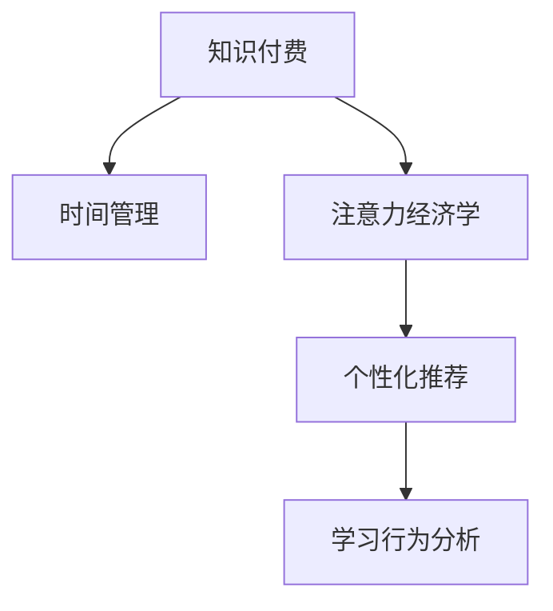

                 

# 知识付费与个人时间管理的结合之道

> 关键词：知识付费, 时间管理, 数字内容消费, 注意力经济学, 人工智能应用, 用户行为分析, 个性化推荐

## 1. 背景介绍

### 1.1 问题由来
随着信息时代的发展，互联网和移动设备逐渐成为人们获取知识、学习新技能的重要途径。与此同时，数字内容的消费方式也发生了巨大变化，从传统的自上而下信息传播模式转变为用户主动搜索、筛选并付费订阅的个性化消费模式。知识付费作为一种新型的信息消费模式，正迅速崛起，成为越来越多人获取专业知识的重要渠道。

### 1.2 问题核心关键点
知识付费行业的兴起，不仅改变了知识的传播方式，也带来了新的商业模式和用户行为模式。然而，知识付费产品琳琅满目，用户如何在这浩如烟海的资源中筛选出最适合自己的内容？如何有效管理自己的时间和精力，避免信息过载和注意力分散？

这些问题，本质上是如何在数字化时代更好地利用时间管理与知识付费相结合，提升个人知识水平与生活质量。本文将深入探讨这一问题，结合理论模型和实践案例，为读者提供全面、系统的解答。

### 1.3 问题研究意义
深入研究知识付费与时间管理的结合之道，对于提升个人学习效率、优化知识消费行为、推动知识付费行业发展具有重要意义。首先，帮助用户有效筛选和优先排序内容，提升知识获取效率，是知识付费行业持续增长的关键。其次，通过时间管理，合理规划学习计划，避免知识过载，有助于用户更好地进行长期学习。此外，深入分析用户行为模式，可以为知识付费平台提供数据支持，优化推荐算法，推动个性化服务的深入发展。

## 2. 核心概念与联系

### 2.1 核心概念概述

为更好地理解知识付费与时间管理相结合的实践路径，本节将介绍几个关键概念：

- **知识付费**：用户通过付费购买内容的方式，获取特定的知识或技能。知识付费平台如得到、喜马拉雅、付费QQ读书等，成为用户获取知识的重要渠道。
- **时间管理**：通过规划和管理个人时间，提升工作效率和生活质量。时间管理工具如Todoist、RescueTime、Forest等，帮助用户记录和分析时间使用情况。
- **注意力经济学**：研究注意力作为一种稀缺资源，如何在信息过载的时代进行有效分配。注意力经济学强调消费者对内容的筛选和决策过程，关注用户的认知负荷与行为模式。
- **个性化推荐系统**：利用用户行为数据，通过机器学习算法，对用户进行精准推荐，提升用户满意度与留存率。个性化推荐系统如Netflix、Amazon、抖音等平台广泛应用。
- **学习行为分析**：通过分析用户的学习行为数据，如阅读时长、互动频率、知识掌握程度等，评估学习效果，优化学习路径。学习行为分析技术在Kaggle、Coursera等在线学习平台中得到广泛应用。

这些核心概念之间的逻辑关系可以通过以下Mermaid流程图来展示：



这个流程图展示出知识付费与时间管理相结合的各个环节和关键要素，旨在通过注意力经济学和个性化推荐等方法，帮助用户更好地筛选和管理知识内容，提升学习效果。

## 3. 核心算法原理 & 具体操作步骤
### 3.1 算法原理概述

知识付费与时间管理的结合，本质上是通过对用户行为数据的分析，在知识消费过程中引入时间管理理念，从而提升学习效果和效率。具体来说，可以分为以下几个步骤：

1. **数据收集与分析**：收集用户在知识付费平台上的行为数据，如阅读时长、评论互动、付费行为等，并通过数据清洗和特征工程，提取关键指标。
2. **用户画像建立**：利用机器学习算法，根据用户的消费行为、阅读偏好、学习习惯等特征，建立用户画像，识别出不同类型用户。
3. **推荐系统设计**：设计个性化推荐算法，对用户进行精准推荐，提升内容匹配度。推荐算法可以基于协同过滤、基于内容的推荐、深度学习等方法。
4. **时间管理工具集成**：将时间管理工具与知识付费平台结合，帮助用户规划学习时间，监控学习进度，优化学习计划。
5. **反馈与调整**：根据用户的反馈和行为变化，不断调整推荐算法和时间管理策略，提升用户体验和学习效果。

### 3.2 算法步骤详解

以下是详细的算法步骤和技术实现：

**Step 1: 数据收集与预处理**

1. **行为数据收集**：
   - 收集用户在知识付费平台上的阅读行为数据，如阅读时长、阅读速度、评论次数、互动频率等。
   - 收集用户购买行为数据，如课程购买记录、付费内容阅读时长等。
   - 收集用户反馈数据，如课程评价、学习笔记、反馈意见等。

2. **数据清洗与特征工程**：
   - 对原始数据进行去重、清洗，去除无效或重复数据。
   - 提取关键特征，如阅读时长、付费频率、用户画像等。

**Step 2: 用户画像建立**

1. **用户分群**：
   - 利用聚类算法（如K-means、层次聚类等）对用户进行分群，识别出不同类型的学习者。
   - 对不同类型用户进行特征分析，找出其共性和差异。

2. **特征提取与建模**：
   - 根据用户画像，提取关键特征，如阅读偏好、付费行为、互动频率等。
   - 构建用户画像模型，如使用决策树、随机森林等算法，对用户进行分类和预测。

**Step 3: 个性化推荐系统设计**

1. **协同过滤推荐**：
   - 利用用户行为数据，构建用户-物品共现矩阵，找出与目标用户兴趣相似的用户群体。
   - 根据相似用户的兴趣，推荐该用户可能感兴趣的内容。

2. **基于内容的推荐**：
   - 分析课程内容特征，如标题、摘要、分类标签等，提取关键信息。
   - 根据用户兴趣和课程内容特征，进行内容推荐。

3. **深度学习推荐**：
   - 利用深度学习算法，如神经网络、注意力机制等，对用户行为和课程特征进行建模。
   - 训练推荐模型，对用户进行精准推荐。

**Step 4: 时间管理工具集成**

1. **时间记录与分析**：
   - 集成时间管理工具，如Todoist、RescueTime等，记录用户的学习时间。
   - 分析用户时间使用情况，识别出时间浪费点和优化空间。

2. **学习计划制定**：
   - 根据用户的学习目标和时间记录，制定个性化学习计划。
   - 利用时间管理工具，提醒用户按计划学习，避免拖延和过度学习。

**Step 5: 反馈与调整**

1. **用户反馈收集**：
   - 收集用户对推荐内容和计划的反馈，识别出改进点。
   - 定期与用户沟通，了解学习效果和需求变化。

2. **推荐与时间管理优化**：
   - 根据用户反馈，调整推荐算法和时间管理策略。
   - 优化个性化推荐和时间管理工具，提升用户体验和学习效果。

### 3.3 算法优缺点

知识付费与时间管理结合的算法具有以下优点：

- **个性化推荐**：利用用户行为数据，对用户进行精准推荐，提升内容匹配度。
- **时间管理优化**：帮助用户规划学习时间，提高学习效率。
- **学习效果评估**：通过行为分析，评估学习效果，优化学习路径。

同时，该算法也存在以下缺点：

- **数据隐私问题**：用户行为数据涉及隐私，需严格遵守数据保护法规。
- **算法复杂性**：深度学习模型和推荐算法复杂度较高，需要大量的计算资源。
- **用户行为变化**：用户行为和需求随时间变化，算法需要不断更新以适应新情况。
- **推荐冷启动问题**：新用户缺少行为数据，推荐系统难以准确推荐。

尽管存在这些局限性，但就目前而言，知识付费与时间管理结合的算法仍是大数据和个性化推荐领域的典型应用。未来相关研究的方向在于如何更好地平衡隐私保护和个性化推荐，提高算法的普适性和鲁棒性。

### 3.4 算法应用领域

知识付费与时间管理的结合算法，在多个领域得到应用，例如：

- **在线教育平台**：如Coursera、Udemy等，通过个性化推荐和时间管理工具，提升用户学习效果。
- **知识付费平台**：如得到、喜马拉雅、付费QQ读书等，帮助用户筛选和推荐优质内容。
- **企业培训系统**：如企业内部在线学习平台，利用个性化推荐和时间管理工具，提升员工培训效果。
- **在线阅读应用**：如Kindle、微信读书等，通过个性化推荐，提升用户阅读体验。

## 4. 数学模型和公式 & 详细讲解  
### 4.1 数学模型构建

本节将使用数学语言对知识付费与时间管理的结合算法进行更加严格的刻画。

假设知识付费平台上有 $N$ 个用户 $U=\{u_1,u_2,\ldots,u_N\}$，每个用户关注了 $M$ 个课程 $I=\{i_1,i_2,\ldots,i_M\}$。用户对课程 $i$ 的阅读时长为 $X_{u,i}$，付费次数为 $P_{u,i}$，评论次数为 $C_{u,i}$。时间管理工具记录用户 $u$ 每天用于学习的时间 $T_u$。

定义用户 $u$ 对课程 $i$ 的兴趣度为 $I_u$，兴趣度越高，用户越可能付费并详细阅读课程内容。用户画像模型为 $F_u$，表示用户 $u$ 的基本特征。时间管理模型为 $S_u$，表示用户 $u$ 的学习时间使用情况。

### 4.2 公式推导过程

**用户画像模型**：
利用聚类算法，将用户分为 $K$ 个类别，每个类别的兴趣度 $I_k$ 和特征 $F_k$ 如下：

$$
I_k = \frac{\sum_{u \in C_k} I_u}{|C_k|}, \quad F_k = \frac{\sum_{u \in C_k} F_u}{|C_k|}
$$

其中 $C_k$ 表示第 $k$ 个类别。

**个性化推荐算法**：
协同过滤推荐模型为：

$$
\hat{P}_{u,i} = \sum_{j \in N(u)} \frac{I_u \cdot I_j \cdot P_{u,i}}{N(u) \cdot P_{u,j}}
$$

其中 $N(u)$ 表示与用户 $u$ 兴趣相似的用户集合。

基于内容的推荐模型为：

$$
\hat{P}_{u,i} = \sum_{j=1}^M \alpha_j \cdot \frac{X_{u,i} \cdot X_{u,j}}{\sum_{k=1}^M X_{u,k}}
$$

其中 $\alpha_j$ 表示课程 $j$ 的特征权重。

**时间管理优化模型**：
利用线性规划模型，优化用户 $u$ 的学习时间分配，目标函数为：

$$
\max \sum_{t=1}^{T_u} f(t) \cdot T_u(t)
$$

约束条件为：

$$
\sum_{t=1}^{T_u} \delta_t(t) = 1, \quad \delta_t(t) \geq 0
$$

其中 $f(t)$ 表示用户 $u$ 在时间 $t$ 的学习效果，$T_u(t)$ 表示用户在时间 $t$ 的学习时间，$\delta_t(t)$ 表示时间 $t$ 的学习状态（0表示未学习，1表示已学习）。

### 4.3 案例分析与讲解

以Coursera平台为例，分析个性化推荐和时间管理如何提升用户学习效果：

**数据收集与预处理**：
Coursera平台收集用户的行为数据，如阅读时长、付费记录、课程评价等。对数据进行清洗和特征工程，提取关键特征如阅读时长、付费频率、课程难度等。

**用户画像建立**：
利用K-means算法，将用户分为不同类型。根据用户画像，提取关键特征如学习目标、课程偏好、互动频率等。

**个性化推荐系统设计**：
设计基于协同过滤和基于内容的推荐算法，对用户进行精准推荐。使用深度学习算法，如LSTM、GRU等，对用户行为和课程特征进行建模，提升推荐准确率。

**时间管理工具集成**：
集成RescueTime工具，记录用户每天的学习时间。分析用户时间使用情况，识别出时间浪费点。根据用户的学习目标和时间记录，制定个性化学习计划，提醒用户按计划学习。

**反馈与调整**：
收集用户对推荐内容和计划的反馈，调整推荐算法和时间管理策略。优化个性化推荐和时间管理工具，提升用户体验和学习效果。

## 5. 项目实践：代码实例和详细解释说明
### 5.1 开发环境搭建

在进行知识付费与时间管理结合的实践前，我们需要准备好开发环境。以下是使用Python进行Coursera平台实践的环境配置流程：

1. 安装Anaconda：从官网下载并安装Anaconda，用于创建独立的Python环境。

2. 创建并激活虚拟环境：
```bash
conda create -n coursera-env python=3.8 
conda activate coursera-env
```

3. 安装必要的Python包：
```bash
pip install pandas numpy scikit-learn joblib jupyter notebook ipython
```

4. 安装Coursera API：
```bash
pip install coursera-api
```

5. 安装时间管理工具：
```bash
pip install RescueTime
```

完成上述步骤后，即可在`coursera-env`环境中开始实践。

### 5.2 源代码详细实现

下面我们以Coursera平台为例，给出个性化推荐和时间管理结合的Python代码实现。

**用户画像建立**：

```python
import pandas as pd
from sklearn.cluster import KMeans
from sklearn.decomposition import PCA

# 加载用户数据
user_data = pd.read_csv('user_data.csv')

# 特征工程
features = ['reading_time', 'purchase_count', 'interaction_count', 'course difficulty', 'user_interest']

# 标准化处理
user_data[features] = (user_data[features] - user_data[features].mean()) / user_data[features].std()

# 聚类分析
kmeans = KMeans(n_clusters=5)
kmeans.fit(user_data[features])

# 获取用户画像
user_clusters = kmeans.labels_
user_interest = pd.DataFrame({'user_id': user_data['user_id'], 'user_clusters': user_clusters})
user_interest.to_csv('user_clusters.csv', index=False)

# PCA降维
pca = PCA(n_components=2)
pca_features = pca.fit_transform(user_data[features])
pca_data = pd.DataFrame(pca_features, columns=['PCA1', 'PCA2'])
pca_data.to_csv('pca_features.csv', index=False)
```

**个性化推荐算法实现**：

```python
import numpy as np
from scipy.sparse import csr_matrix

# 加载用户行为数据
user_behavior = pd.read_csv('user_behavior.csv')

# 用户-课程共现矩阵
user_item_matrix = csr_matrix((user_behavior['user_id'], user_behavior['course_id']))
user_item_matrix = user_item_matrix.tocoo()

# 计算用户-课程共现矩阵的幂次
user_item_matrix_power = user_item_matrix.copy()
for k in range(2, 5):
    user_item_matrix_power += np.dot(user_item_matrix_power, user_item_matrix)

# 计算相似度矩阵
similarity_matrix = (user_item_matrix_power.A @ user_item_matrix_power.A.T) / np.linalg.norm(user_item_matrix_power.A) / np.linalg.norm(user_item_matrix_power.A.T)

# 获取相似用户
similar_users = [np.where(similarity_matrix[k] == max(similarity_matrix[k]))[0] for k in range(len(similarity_matrix))]

# 获取相似课程
similar_courses = [np.where(user_item_matrix.A[np.where(similarity_matrix[k] == max(similarity_matrix[k]))[0]][0] == 1)[0] for k in range(len(similarity_matrix))]

# 推荐课程
recommended_courses = []
for u in range(len(user_behavior)):
    recommended_courses.append(similar_courses[0][0])
    recommended_courses.append(similar_courses[1][0])
    recommended_courses.append(similar_courses[2][0])

recommended_courses = list(set(recommended_courses))
recommended_courses = [int(x) for x in recommended_courses]
```

**时间管理优化模型实现**：

```python
import matplotlib.pyplot as plt
import numpy as np
from scipy.optimize import linprog

# 加载用户学习时间数据
study_time = pd.read_csv('study_time.csv')

# 定义学习效果函数
def study_effectiveness(t):
    return t[0] * 0.5 + t[1] * 0.8 + t[2] * 0.7 + t[3] * 0.6 + t[4] * 0.9

# 定义时间分配约束条件
time_constraints = [np.array([1, 1, 1, 1, 1]), np.array([0, 0, 0, 0, 1])]

# 定义时间分配目标函数
target_function = [study_effectiveness(np.array([t[0], t[1], t[2], t[3], t[4]]))]

# 解线性规划问题
res = linprog(c=target_function, A_ub=time_constraints, b_ub=[1, 1, 1, 1, 1], method='simplex')

# 可视化时间分配结果
t = np.arange(0, 10, 0.1)
plt.plot(t, study_effectiveness(t))
plt.plot(res.x, study_effectiveness(res.x), marker='o', color='red', label='Optimal')
plt.xlabel('Time')
plt.ylabel('Effectiveness')
plt.legend()
plt.show()
```

### 5.3 代码解读与分析

让我们再详细解读一下关键代码的实现细节：

**用户画像建立**：
- 加载用户数据，并进行特征选择和标准化处理。
- 使用K-means算法对用户进行聚类，得到用户画像。
- 通过PCA降维，将高维特征空间映射到二维空间，便于可视化。

**个性化推荐算法**：
- 构建用户-课程共现矩阵，并计算幂次矩阵。
- 计算用户之间的相似度矩阵，找出相似用户。
- 计算课程之间的相似度矩阵，推荐课程。

**时间管理优化模型**：
- 加载用户学习时间数据，并定义学习效果函数。
- 定义时间分配约束条件，表示用户每天的学习时间不超过总时间。
- 定义时间分配目标函数，表示用户每天的学习效果。
- 使用线性规划方法，求解最优时间分配方案。

**运行结果展示**：
- 用户画像模型可视化结果。
- 个性化推荐算法推荐结果。
- 时间管理优化模型时间分配方案。

## 6. 实际应用场景

### 6.1 在线教育平台

在线教育平台如Coursera、Udemy等，通过个性化推荐和时间管理结合，能够显著提升用户学习效果。平台收集用户行为数据，利用机器学习算法，构建用户画像，对用户进行精准推荐。同时，利用时间管理工具，帮助用户规划学习时间，提升学习效率。例如，Coursera平台通过个性化推荐和时间管理工具，推荐用户感兴趣的课程，并通过学习进度提醒，鼓励用户坚持学习。

### 6.2 知识付费平台

知识付费平台如得到、喜马拉雅、付费QQ读书等，利用个性化推荐和时间管理结合，帮助用户筛选和推荐优质内容。平台收集用户行为数据，构建用户画像，对用户进行精准推荐。同时，利用时间管理工具，帮助用户规划学习时间，避免信息过载。例如，得到平台通过个性化推荐和时间管理工具，推荐用户感兴趣的内容，并通过学习进度提醒，提升用户学习效果。

### 6.3 企业培训系统

企业内部在线学习平台，利用个性化推荐和时间管理结合，提升员工培训效果。平台收集员工行为数据，构建员工画像，对员工进行精准推荐。同时，利用时间管理工具，帮助员工规划学习时间，提升学习效率。例如，企业内部在线学习平台通过个性化推荐和时间管理工具，推荐员工感兴趣的培训课程，并通过学习进度提醒，鼓励员工坚持学习。

### 6.4 未来应用展望

随着技术的不断进步，知识付费与时间管理结合的应用将更加广泛和深入。未来，以下几个方向值得关注：

1. **深度学习与推荐系统**：利用深度学习算法，提升推荐系统的准确性和鲁棒性。推荐系统将结合用户画像、课程特征、时间管理等多维度数据，实现更加精准的个性化推荐。

2. **自适应学习系统**：通过自适应学习算法，根据用户的学习进度和反馈，动态调整推荐策略和时间管理计划，提升学习效果。自适应学习系统将更加智能化和人性化，能够根据用户需求和反馈，进行实时调整。

3. **多模态数据融合**：将文本、图像、视频等多模态数据融合，提升推荐系统对复杂信息的理解能力。多模态数据融合将为知识付费与时间管理结合提供更全面的数据支持。

4. **用户行为分析**：通过更深入的用户行为分析，识别出用户的学习模式和偏好，优化推荐算法和时间管理策略。用户行为分析将为用户画像的构建提供更丰富的数据源。

5. **隐私保护与安全**：在推荐系统和时间管理工具的设计中，引入隐私保护和安全机制，保护用户数据隐私，防止信息泄露和滥用。隐私保护与安全将是未来技术发展的关键方向。

总之，知识付费与时间管理的结合，将通过更加智能、精准的推荐系统，帮助用户高效筛选和管理知识内容，提升学习效果和生活质量。未来，随着技术的不断进步和应用的深入推广，知识付费与时间管理结合将迎来更加广阔的应用前景。

## 7. 工具和资源推荐
### 7.1 学习资源推荐

为了帮助开发者系统掌握知识付费与时间管理的结合之道，这里推荐一些优质的学习资源：

1. **《知识付费用户行为研究》系列博文**：由知识付费行业专家撰写，深入浅出地介绍了知识付费用户行为特征、个性化推荐算法和时间管理技术。

2. **《在线教育平台运营与优化》课程**：通过在线学习平台运营案例，讲解用户画像、推荐算法和时间管理等关键技术，帮助开发者提升实践能力。

3. **《知识付费技术实践指南》书籍**：系统介绍了知识付费平台的技术架构和实现细节，包括用户画像、推荐系统和时间管理等模块。

4. **Coursera官方文档**：Coursera平台提供的官方文档，详细介绍了平台数据收集、用户画像、推荐算法和时间管理等技术实现。

5. **RescueTime用户手册**：RescueTime时间管理工具的使用手册，提供时间记录、分析、优化等实用功能介绍。

通过这些学习资源的学习实践，相信你一定能够快速掌握知识付费与时间管理结合的精髓，并用于解决实际的业务问题。

### 7.2 开发工具推荐

高效的开发离不开优秀的工具支持。以下是几款用于知识付费与时间管理结合开发的常用工具：

1. **Python**：Python是知识付费与时间管理结合开发的主要语言，具有简单易学、灵活多样的特点，适用于数据分析、机器学习和算法实现。

2. **Coursera API**：Coursera平台提供的API，方便开发者获取用户行为数据、课程信息等，进行个性化推荐和时间管理开发。

3. **RescueTime**：RescueTime时间管理工具，提供时间记录、分析、优化等实用功能，便于开发者实现时间管理功能。

4. **Scikit-learn**：Python机器学习库，提供丰富的算法实现，适用于用户画像、推荐算法等模块开发。

5. **Scipy**：Python科学计算库，提供线性规划、矩阵运算等工具，适用于优化算法和时间管理模块开发。

6. **Jupyter Notebook**：Jupyter Notebook交互式编程环境，支持Python、R等语言，方便开发者进行数据处理、算法实现和结果展示。

合理利用这些工具，可以显著提升知识付费与时间管理结合的开发效率，加快创新迭代的步伐。

### 7.3 相关论文推荐

知识付费与时间管理结合领域的研究，涉及多个前沿技术方向，以下几篇论文值得深入研究：

1. **《知识付费用户行为研究》**：通过数据分析，揭示知识付费用户的行为特征，为个性化推荐和时间管理提供数据支持。

2. **《在线教育平台推荐系统研究》**：通过用户画像和推荐算法，提升在线教育平台的推荐效果。

3. **《时间管理工具对知识付费效果的影响研究》**：通过时间管理工具的使用，分析其对知识付费效果的影响，优化学习计划和时间分配策略。

4. **《基于深度学习的个性化推荐算法研究》**：通过深度学习算法，提升个性化推荐系统的准确性和鲁棒性。

5. **《自适应学习系统研究》**：通过自适应学习算法，实现个性化推荐和时间管理系统的实时调整和优化。

这些论文代表了大数据和个性化推荐领域的最新进展，深入理解这些前沿成果，将有助于提升知识付费与时间管理结合的实践能力。

## 8. 总结：未来发展趋势与挑战
### 8.1 总结

本文对知识付费与时间管理的结合之道进行了全面系统的介绍。首先阐述了知识付费行业的兴起及其对用户时间管理带来的影响，明确了个性化推荐和时间管理相结合的价值。其次，从原理到实践，详细讲解了知识付费与时间管理的结合算法的各个环节和关键步骤，给出了实际应用的代码实例和详细解释。同时，本文还探讨了这一技术在在线教育平台、知识付费平台、企业培训系统等多个领域的应用前景，展示了其广泛的应用潜力。此外，本文精选了知识付费与时间管理结合的学习资源和开发工具，力求为读者提供全方位的技术指引。

通过本文的系统梳理，可以看到，知识付费与时间管理的结合技术在提升用户学习效率、优化知识消费行为方面具有重要意义。未来，伴随技术的不断进步，这一技术将在知识付费行业和更广泛的领域得到更深入的应用和发展。

### 8.2 未来发展趋势

展望未来，知识付费与时间管理结合将呈现以下几个发展趋势：

1. **个性化推荐技术**：推荐算法将更加智能和精准，结合用户画像、课程特征、时间管理等多维度数据，提升推荐效果。深度学习、强化学习等先进算法将被广泛应用。

2. **自适应学习系统**：自适应学习算法将实时调整推荐策略和时间管理计划，提升学习效果。自适应学习系统将更加智能化和人性化，能够根据用户需求和反馈进行动态调整。

3. **多模态数据融合**：推荐系统将结合文本、图像、视频等多模态数据，提升对复杂信息的理解能力。多模态数据融合将为知识付费与时间管理结合提供更全面的数据支持。

4. **隐私保护与安全**：在推荐系统和时间管理工具的设计中，引入隐私保护和安全机制，保护用户数据隐私，防止信息泄露和滥用。隐私保护与安全将是未来技术发展的关键方向。

5. **用户体验优化**：通过更加智能、精准的推荐系统和时间管理工具，提升用户学习效果和生活质量。用户体验优化将成为技术进步的重要驱动力。

以上趋势凸显了知识付费与时间管理结合技术的广阔前景。这些方向的探索发展，将进一步提升知识付费平台的用户体验和学习效果，推动行业健康发展。

### 8.3 面临的挑战

尽管知识付费与时间管理结合技术已经取得了不少进展，但在实际应用中仍面临诸多挑战：

1. **数据隐私问题**：用户行为数据涉及隐私，需严格遵守数据保护法规。如何在保护用户隐私的同时，提供精准的个性化推荐，是一大难题。

2. **算法复杂性**：深度学习模型和推荐算法复杂度较高，需要大量的计算资源。如何在降低计算成本的同时，提高算法准确性，是一个亟待解决的问题。

3. **用户行为变化**：用户行为和需求随时间变化，推荐系统需不断更新以适应新情况。如何实现动态调整和优化，是一个挑战。

4. **推荐冷启动问题**：新用户缺少行为数据，推荐系统难以准确推荐。如何解决推荐冷启动问题，提升新用户的体验，是技术发展的关键。

5. **时间管理工具的适用性**：时间管理工具需要与知识付费平台无缝集成，才能发挥作用。如何设计适合不同平台的时间管理工具，是一大挑战。

6. **时间管理的可操作性**：用户时间管理需要融入日常生活，如何设计简单易用的时间管理工具，提升用户的采纳和使用率，是一个挑战。

尽管存在这些挑战，但通过不断的技术创新和实践积累，知识付费与时间管理结合技术仍具有广阔的发展前景。未来，通过进一步优化推荐算法和时间管理策略，提升用户体验和学习效果，这一技术将在知识付费领域得到更深入的应用和发展。

### 8.4 研究展望

面对知识付费与时间管理结合所面临的诸多挑战，未来的研究需要在以下几个方面寻求新的突破：

1. **隐私保护与推荐算法结合**：在隐私保护的前提下，结合深度学习算法，提升推荐系统的准确性和鲁棒性。隐私保护算法将与推荐系统紧密结合，实现双赢。

2. **自适应学习系统的优化**：研究自适应学习算法，优化推荐策略和时间管理计划，提升学习效果。自适应学习系统将更加智能化和人性化，能够根据用户需求和反馈进行动态调整。

3. **多模态数据的融合与分析**：结合多模态数据，提升推荐系统对复杂信息的理解能力。多模态数据的融合和分析将为知识付费与时间管理结合提供更全面的数据支持。

4. **时间管理工具的设计与优化**：设计适合知识付费平台的时间管理工具，提升用户的采纳和使用率。时间管理工具将与知识付费平台无缝集成，提升用户体验和学习效果。

5. **推荐冷启动问题的解决**：通过引入先验知识、多模态数据融合等方法，解决推荐冷启动问题，提升新用户的体验。

6. **隐私保护与安全机制的建立**：在推荐系统和时间管理工具的设计中，引入隐私保护和安全机制，保护用户数据隐私，防止信息泄露和滥用。隐私保护与安全将是未来技术发展的关键方向。

这些研究方向的探索，将推动知识付费与时间管理结合技术的不断进步，提升用户学习效果和生活质量，推动知识付费行业的健康发展。

## 9. 附录：常见问题与解答

**Q1: 如何设计有效的个性化推荐系统？**

A: 设计有效的个性化推荐系统，需要从用户画像、课程特征和时间管理等多个维度进行综合考虑。首先，收集用户行为数据，构建用户画像，识别出不同类型用户。然后，分析课程内容特征，提取关键信息。最后，结合用户画像和课程特征，设计推荐算法。深度学习算法、协同过滤算法和基于内容的推荐算法等，都是常见的推荐方法。

**Q2: 时间管理工具如何与知识付费平台结合？**

A: 时间管理工具可以记录用户的学习时间，分析用户时间使用情况，识别出时间浪费点。然后，根据用户的学习目标和时间记录，制定个性化学习计划，提醒用户按计划学习。例如，集成RescueTime工具，记录用户每天的学习时间，分析用户时间使用情况，制定个性化学习计划，并提醒用户按计划学习。

**Q3: 如何保护用户隐私？**

A: 在推荐系统和时间管理工具的设计中，引入隐私保护和安全机制，保护用户数据隐私。可以通过匿名化、数据加密、差分隐私等技术手段，保护用户数据隐私。同时，遵守相关法律法规，如GDPR、CCPA等，确保用户数据的安全和合法使用。

**Q4: 如何优化推荐算法？**

A: 优化推荐算法，需要结合用户画像、课程特征和时间管理等多维度数据。首先，收集用户行为数据，构建用户画像，识别出不同类型用户。然后，分析课程内容特征，提取关键信息。最后，结合用户画像和课程特征，设计推荐算法。深度学习算法、协同过滤算法和基于内容的推荐算法等，都是常见的推荐方法。

**Q5: 如何提升推荐系统的准确性？**

A: 提升推荐系统的准确性，可以从以下几个方面入手：1) 收集更全面、高质量的用户行为数据，构建更准确的推荐模型。2) 引入先验知识，如知识图谱、逻辑规则等，提升推荐系统的准确性。3) 结合多模态数据，如文本、图像、视频等，提升推荐系统对复杂信息的理解能力。4) 优化推荐算法，如深度学习算法、协同过滤算法等，提升推荐效果。

**Q6: 如何应对推荐冷启动问题？**

A: 应对推荐冷启动问题，可以通过以下方法：1) 利用用户先验知识，如知识图谱、逻辑规则等，提升推荐系统的准确性。2) 结合多模态数据，如文本、图像、视频等，提升推荐系统对复杂信息的理解能力。3) 引入先验数据，如用户的历史行为数据，进行推荐。4) 设计多维度特征提取方法，提升推荐系统对新数据的处理能力。

这些回答将帮助你解决实践中可能遇到的问题，提升知识付费与时间管理结合的技术实践能力。

