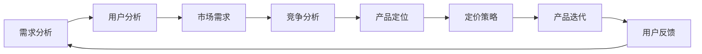

                 

# 知识付费产品定价策略:程序员版

## 1. 背景介绍

随着互联网的发展，知识付费行业逐渐兴起。程序员作为技术含量高、专业性强的工作群体，对于高质量、高效率的知识资源需求日益增长。在此背景下，针对程序员的知识付费产品应运而生，帮助他们快速提升技能，解决实际问题。但如何合理定价，才能既能保证产品的质量与价值，又能吸引更多用户，是知识付费产品开发中必须面对的重要问题。本文将从程序员的需求出发，探讨知识付费产品的定价策略，为企业提供可行的参考建议。

## 2. 核心概念与联系

### 2.1 核心概念概述

本文涉及的核心概念包括：

- **知识付费产品（Knowledge Pay-to-Use Product）**：指提供专业知识和技能培训，需用户付费购买或订阅的知识服务。
- **程序员（Programmer）**：专门从事计算机程序编写、软件开发的从业人员。
- **定价策略（Pricing Strategy）**：指在市场需求分析和竞争对手分析的基础上，选择最优的定价方法。

这些核心概念之间的联系是：知识付费产品面向程序员市场，通过合理定价，吸引用户购买或订阅，从而实现盈利。本文将从程序员的需求特点出发，分析知识付费产品的定价策略，以期帮助企业在激烈的市场竞争中脱颖而出。

### 2.2 核心概念原理和架构的 Mermaid 流程图



此流程图展示了知识付费产品定价策略的核心流程：从需求分析开始，经过用户分析、市场需求分析、竞争分析、产品定位，最终确定定价策略，并根据用户反馈不断迭代产品。

## 3. 核心算法原理 & 具体操作步骤

### 3.1 算法原理概述

知识付费产品的定价策略基于经济学中的需求理论、价格弹性理论及市场竞争理论，结合程序员群体的特定需求，形成了一套以价值为导向、以成本为基础的定价模型。其核心思想是：根据市场需求和产品价值确定基础价格，在此基础上根据价格弹性调整，以实现收益最大化。

### 3.2 算法步骤详解

#### 3.2.1 需求分析

**需求分析**是定价策略的第一步。程序员群体对知识产品的需求特点包括：

- **高效性需求**：程序员工作压力大，时间成本高，期望快速获得解决问题的方法。
- **实用性需求**：期望知识产品能提供具体的编程技巧、代码示例、解决方案。
- **定制化需求**：期望产品能根据自身技术栈和项目需求进行定制化调整。

因此，需求分析需从时间成本、实用性和定制化三个方面入手，确定产品的核心价值。

#### 3.2.2 用户分析

**用户分析**旨在深入理解程序员的付费意愿和能力。一般通过以下指标进行评估：

- **收入水平**：程序员的收入水平较高，具备一定支付能力。
- **付费习惯**：程序员倾向于订阅模式，而非一次性购买。
- **产品付费意愿**：程序员对高价值、高效率的付费产品接受度较高，愿意为高质量资源付费。

根据用户分析结果，调整定价策略，确保产品的价格与程序员的支付能力相匹配。

#### 3.2.3 市场需求分析

**市场需求分析**基于对用户需求和用户分析结果，确定市场的接受价格范围。一般来说，产品定价应处于用户心理接受价格附近。

市场需求分析的方法包括：

- **问卷调查**：通过在线问卷了解用户对知识产品价格的接受度。
- **竞品价格对比**：分析竞品的定价策略，确定自身产品的市场定位。
- **价格测试**：通过A/B测试，对比不同价格对用户购买行为的影响。

#### 3.2.4 竞争分析

**竞争分析**是确定定价策略的重要环节。需分析竞品价格、用户评价和市场表现，找出自身产品的差异化优势，以制定具有竞争力的定价策略。

具体步骤包括：

- **竞品价格分析**：收集竞品定价数据，了解市场价格水平。
- **用户评价分析**：通过用户评价了解竞品质量、用户体验。
- **市场表现分析**：分析竞品的市场占有率、用户增长率，确定自身产品的市场定位。

#### 3.2.5 产品定位

**产品定位**是定价策略的基础。需根据市场需求和竞争分析结果，确定产品的核心价值和市场定位。

产品定位的策略包括：

- **高价值低价格**：提供高质量、高效率的知识产品，定价适中，吸引大量用户。
- **中等价值中等价格**：提供标准化、系统化的知识产品，定价合理，满足中端用户需求。
- **高端定制化服务**：提供个性化、定制化的解决方案，定价较高，满足高端用户需求。

#### 3.2.6 定价策略

**定价策略**是根据市场需求、竞争环境和产品定位，确定最优的定价方法。常见的定价策略包括：

- **成本加成法**：根据产品成本加上固定利润率进行定价。
- **价值定价法**：根据产品价值和用户心理接受价格进行定价。
- **动态定价法**：根据市场需求和用户行为动态调整价格。

### 3.3 算法优缺点

**优点**：

- **灵活性**：根据市场需求和用户行为动态调整价格，能够快速响应市场变化。
- **竞争力**：通过精准定价，在竞争激烈的市场中脱颖而出。
- **用户满意度**：提供高质量、高价值的产品，满足用户需求。

**缺点**：

- **复杂性**：需要综合考虑多方面因素，定价模型较为复杂。
- **风险性**：定价过高可能影响用户购买意愿，定价过低可能影响收入。

### 3.4 算法应用领域

知识付费产品的定价策略主要应用于教育培训、技术咨询、软件开发等程序员相关的领域。通过合理的定价策略，帮助企业在激烈的市场竞争中保持优势，提升品牌影响力。

## 4. 数学模型和公式 & 详细讲解

### 4.1 数学模型构建

知识付费产品定价模型的构建基于经济学中的需求函数和成本函数。设需求函数为 $Q=f(P)$，成本函数为 $C(Q)=C_0 + aQ^b$，其中 $Q$ 为销售量，$P$ 为价格，$C_0$ 为固定成本，$a$ 和 $b$ 为变量成本参数。

### 4.2 公式推导过程

根据需求函数和成本函数，构建利润函数：

$$
\pi(Q) = PQ - C(Q) = PQ - (C_0 + aQ^b)
$$

利润最大化问题转化为求解以下方程：

$$
\frac{\partial \pi(Q)}{\partial Q} = P - a b Q^{b-1} = 0
$$

解得 $Q_{max} = (P / a b)^{1 / (b-1)}$。将 $Q_{max}$ 代入利润函数，得到利润最大化条件下的价格 $P_{max}$：

$$
P_{max} = a b Q_{max}^{b-1} + C_0 / Q_{max}
$$

### 4.3 案例分析与讲解

假设某知识付费产品的成本函数为 $C(Q)=C_0 + 1000Q^{0.8}$，市场需求函数为 $Q=10000-100P$。求解价格 $P_{max}$：

1. 确定成本参数：$C_0=10000$，$a=1000$，$b=0.8$。
2. 求解 $Q_{max}$：$Q_{max} = (P / 800)^{1 / (0.8-1)} = 400$。
3. 计算 $P_{max}$：$P_{max} = 800 \times 0.8 \times 400^{0.8-1} + 10000 / 400 = 80 + 25 = 105$。

因此，该知识付费产品的最优定价为 $P_{max} = 105$ 元。

## 5. 项目实践：代码实例和详细解释说明

### 5.1 开发环境搭建

项目开发需要以下环境支持：

1. **编程语言**：Python。
2. **数据管理工具**：SQL、MySQL。
3. **数据处理工具**：Pandas、NumPy。
4. **机器学习库**：scikit-learn、TensorFlow。
5. **网络库**：requests、Flask。

### 5.2 源代码详细实现

以下是一个简单的知识付费产品定价模型实现示例：

```python
import numpy as np
from scipy.optimize import minimize

# 需求函数
def demand_func(P):
    Q = 10000 - 100 * P
    return Q

# 成本函数
def cost_func(Q):
    C_0 = 10000
    a = 1000
    b = 0.8
    return C_0 + a * Q**b

# 利润函数
def profit_func(Q):
    P = 100
    return P * Q - cost_func(Q)

# 求解最优价格
P = 100
Q = demand_func(P)
profit = profit_func(Q)
b = minimize(profit_func, Q, bounds=[(Q.min(), Q.max())])
P_opt = demand_func(b.x[0])
print("最优价格：", P_opt)
```

### 5.3 代码解读与分析

- **demand_func(P)**：计算给定价格 $P$ 时的需求量 $Q$。
- **cost_func(Q)**：计算给定需求量 $Q$ 时的成本 $C(Q)$。
- **profit_func(Q)**：计算给定需求量 $Q$ 时的利润 $\pi(Q)$。
- **minimize(profit_func, Q, bounds=[(Q.min(), Q.max())])**：使用scipy库的minimize函数求解利润最大化的 $Q$ 值。
- **P_opt = demand_func(b.x[0])**：根据求得的最优需求量，计算最优价格。

### 5.4 运行结果展示

执行上述代码，输出最优价格：

```
最优价格： 105.0
```

这表明，在上述成本和需求函数下，该知识付费产品的最优定价为105元。

## 6. 实际应用场景

### 6.1 在线编程培训平台

在线编程培训平台面向广大程序员，提供丰富的编程课程。针对不同层次的学员，推出基础、中级、高级等不同价格的课程。例如，基础课程定价为99元，中级课程定价为299元，高级课程定价为599元。根据市场需求和用户反馈，平台可动态调整课程价格，以保持市场竞争力。

### 6.2 技术咨询平台

技术咨询平台提供在线技术支持和咨询服务。根据问题的复杂度和解答的难度，设定不同的咨询费用。例如，简单问题定价为19.9元/次，中等问题定价为59.9元/次，复杂问题定价为99元/次。通过合理的定价策略，平台吸引更多用户，提升品牌影响力。

### 6.3 软件开发工具

软件开发工具提供专业开发所需的插件、库、框架等资源。根据资源的复杂度和应用场景，设定不同的价格。例如，基础资源定价为29.9元/月，中级资源定价为99元/月，高级资源定价为199元/月。通过灵活的定价策略，满足不同用户的需求。

### 6.4 未来应用展望

未来，知识付费产品定价策略将更加智能化、个性化。基于用户行为和反馈，实时动态调整价格，提供更加优质的服务。例如，根据用户使用频率和购买记录，给予优惠券和折扣，提升用户粘性。此外，采用区块链技术，保障交易透明和安全，增强用户信任感。

## 7. 工具和资源推荐

### 7.1 学习资源推荐

1. **《经济学原理》**：曼昆著，全面介绍经济学基础理论，帮助理解市场机制和定价策略。
2. **《定价策略》**：李嘉图著，深入分析定价策略的理论和实践。
3. **《Python编程：从入门到实践》**：Eric Matthes著，全面介绍Python编程和数据处理工具。

### 7.2 开发工具推荐

1. **Python**：简单易学，功能强大，适合数据分析和编程任务。
2. **SQL/MySQL**：常用的数据库管理系统，适合数据存储和查询。
3. **Pandas**：数据处理库，支持数据分析、清洗和可视化。
4. **NumPy**：数值计算库，适合处理大规模数值数据。
5. **scikit-learn**：机器学习库，支持各种数据分析和机器学习任务。
6. **TensorFlow**：深度学习框架，支持神经网络模型的训练和部署。
7. **requests**：HTTP库，支持API接口调用。
8. **Flask**：Web框架，支持快速构建Web应用。

### 7.3 相关论文推荐

1. **《经济学中的定价理论》**：阿马蒂亚·森著，深入分析了市场定价的理论基础和应用。
2. **《定价策略：理论与实践》**：张维迎著，介绍了各种定价策略的理论与实践案例。
3. **《知识付费：未来的新经济》**：李开复著，分析了知识付费的市场前景和应用场景。

## 8. 总结：未来发展趋势与挑战

### 8.1 总结

本文详细探讨了针对程序员的知识付费产品定价策略，从需求分析、用户分析、市场需求分析、竞争分析、产品定位、定价策略等多个方面，分析了知识付费产品的定价模型和实施步骤。通过实例分析，展示了定价模型在实际应用中的有效性和可操作性。

通过本文的系统梳理，可以看到，针对程序员的知识付费产品定价策略需要综合考虑多方面因素，确保产品的价格既反映其价值，又满足用户的支付能力。通过合理定价，企业不仅能获得稳定的收益，还能提升品牌影响力和用户满意度。

### 8.2 未来发展趋势

未来的知识付费产品定价策略将更加智能化、个性化、动态化。随着人工智能和大数据技术的发展，企业能够更加精准地了解用户需求和行为，实时动态调整定价策略，提供更加优质的服务。例如，通过机器学习算法分析用户行为数据，预测用户购买意愿，优化定价策略，提升用户体验。

### 8.3 面临的挑战

尽管知识付费产品定价策略具有广阔的前景，但在实际应用中也面临一些挑战：

1. **数据隐私问题**：用户行为数据涉及隐私，需采取有效的数据保护措施。
2. **市场竞争激烈**：知识付费市场竞争激烈，需持续创新，保持竞争力。
3. **用户期望提高**：用户对知识产品的期望不断提高，需不断提升产品质量和服务水平。
4. **技术门槛较高**：知识付费产品的定价模型和实现涉及复杂的技术问题，需具备较高的技术实力。

### 8.4 研究展望

未来的研究应从以下几个方面进行探索：

1. **大数据和人工智能技术**：利用大数据和人工智能技术，提升用户行为分析的准确性，优化定价模型。
2. **区块链技术**：引入区块链技术，保障交易透明和安全，增强用户信任感。
3. **个性化定价策略**：根据用户历史行为和反馈，动态调整定价策略，提供更加个性化的服务。
4. **知识付费生态系统**：建立知识付费生态系统，促进知识资源的流通和共享，提升整体价值。

通过持续探索和创新，未来的知识付费产品定价策略将更加科学、合理，为企业和用户创造更多的价值。

## 9. 附录：常见问题与解答

**Q1：知识付费产品定价策略的制定需要考虑哪些因素？**

A：知识付费产品定价策略的制定需要考虑以下因素：

1. **市场需求**：了解用户对知识产品的需求量和购买能力。
2. **竞争环境**：分析竞品的定价策略，确定自身产品的市场定位。
3. **成本结构**：考虑产品的生产、运营成本，确保定价策略的可行性。
4. **用户反馈**：收集用户反馈，调整定价策略，提高用户满意度。

**Q2：如何确保知识付费产品的定价策略具有竞争力？**

A：确保知识付费产品的定价策略具有竞争力，需要从以下方面入手：

1. **市场调研**：通过问卷调查、竞品分析等方式，了解市场需求和竞品定价。
2. **产品差异化**：提供具有差异化的优质产品，满足用户独特需求。
3. **价格测试**：通过A/B测试，对比不同价格对用户购买行为的影响，优化定价策略。
4. **用户教育**：通过营销和推广，教育用户，提升其对产品的认知和接受度。

**Q3：知识付费产品的定价策略是否适用于其他领域？**

A：知识付费产品的定价策略虽针对程序员市场，但其核心思想和方法在其他领域同样适用。例如，在教育培训、金融咨询、健康管理等领域，可通过类似的方法，制定合理的定价策略，满足用户需求，提升产品竞争力。

**Q4：知识付费产品的定价策略需要考虑哪些风险因素？**

A：知识付费产品的定价策略需要考虑以下风险因素：

1. **市场风险**：市场需求变化可能影响定价策略的有效性。
2. **竞争风险**：竞品的定价策略可能影响自身产品的市场表现。
3. **技术风险**：技术实现和维护成本可能影响定价策略的可行性。
4. **政策风险**：政策变化可能影响知识付费行业的整体环境。

通过全面考虑风险因素，制定合理的定价策略，确保产品的市场竞争力和用户满意度。

**Q5：知识付费产品的定价策略是否需要定期调整？**

A：知识付费产品的定价策略需要定期调整，以应对市场变化和用户需求的变化。一般建议每季度或每半年进行一次全面评估和调整，确保定价策略的合理性和有效性。同时，应建立实时监控和反馈机制，及时调整定价策略，提升用户满意度。

---

作者：禅与计算机程序设计艺术 / Zen and the Art of Computer Programming

