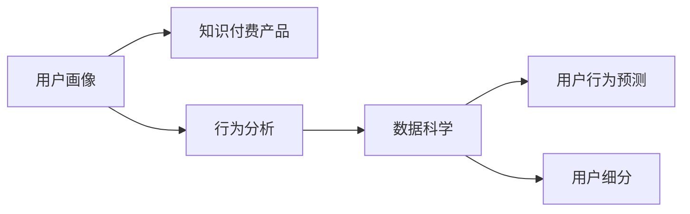

                 

# 知识付费产品的用户画像分析

> 关键词：用户画像,知识付费,行为分析,数据科学,用户行为预测,用户细分

## 1. 背景介绍

随着信息时代的到来，知识的获取变得更加便捷和高效。知识付费成为越来越多用户的选择，特别是年轻一代，更愿意为优质的内容付费。据统计，中国知识付费市场规模在2021年已达272.3亿元，预计到2025年将达到1116.4亿元。用户对知识付费产品需求激增，这为知识付费平台的成长提供了巨大的市场潜力。

然而，在竞争激烈的知识付费市场，如何识别并满足目标用户需求，提升用户体验，以及实现商业变现，是平台需要解决的重要问题。因此，本文将通过用户画像分析，深入探讨知识付费产品中用户的行为特征、心理需求以及市场趋势，为平台提供决策依据。

## 2. 核心概念与联系

### 2.1 核心概念概述

本节将介绍用户画像分析中涉及的几个关键概念：

- **用户画像(User Persona)**：指基于实际用户数据和调研信息构建的虚拟角色，用以表示某一类用户的典型特征和行为习惯。
- **知识付费(Knowledge Pay)**：指用户为获取专业或系统化的知识而支付费用的商业模式，主要包括在线课程、电子书、直播讲座等形式。
- **行为分析(Behavior Analysis)**：通过对用户在线行为的数据采集、处理和分析，挖掘用户的行为模式和心理需求，从而实现个性化推荐和服务。
- **数据科学(Data Science)**：以数据为中心的研究方法，运用统计学、机器学习等技术，从数据中发现规律，指导决策和预测。
- **用户行为预测(Predictive Analytics)**：利用历史数据和机器学习算法，预测用户未来的行为，以便提前做出应对策略。
- **用户细分(Segmentation)**：将用户群体划分为具有相似特征的子群体，以便更精准地制定营销策略和产品开发。

这些核心概念之间存在紧密的逻辑联系，形成了一个系统性的用户画像分析框架。

### 2.2 核心概念原理和架构的 Mermaid 流程图



这个流程图展示了用户画像分析的整体流程：

1. **用户画像构建**：从知识付费产品的实际用户数据和调研信息中，提炼出典型用户特征和行为模式。
2. **行为分析**：分析用户在平台上的行为数据，挖掘背后的用户需求和偏好。
3. **数据科学应用**：运用数据科学方法，对用户数据进行深度挖掘和分析。
4. **用户行为预测**：基于历史行为数据，预测用户未来的行为，以便提前做出反应。
5. **用户细分**：将用户群体划分为多个子群体，以便更精准地定制服务和产品。

这一流程环环相扣，形成了完整的用户画像分析架构。

## 3. 核心算法原理 & 具体操作步骤

### 3.1 算法原理概述

用户画像分析的核心在于基于历史数据和用户行为，构建和更新用户画像，以指导后续的个性化推荐、产品设计和市场营销等决策。

具体而言，用户画像分析包括三个主要步骤：
1. **数据收集**：从知识付费平台收集用户注册信息、浏览记录、购买行为、评价反馈等数据。
2. **数据分析**：对收集到的数据进行清洗、预处理和特征工程，构建用户特征向量。
3. **模型训练**：使用机器学习算法，训练用户行为预测模型，生成用户画像。

### 3.2 算法步骤详解

#### 3.2.1 数据收集

数据收集是用户画像分析的基础，通常包括以下几个方面：

1. **用户注册信息**：包括姓名、年龄、性别、职业等基本信息。
2. **浏览记录**：用户访问课程、文章等内容的详细日志，包括时间、时长、点击路径等。
3. **购买行为**：用户购买课程、订阅会员、参加直播等行为记录。
4. **评价反馈**：用户在课程或活动后的评价、打分、留言等反馈信息。
5. **互动记录**：用户与其他用户或内容生产者之间的评论、点赞、分享等互动数据。

#### 3.2.2 数据分析

数据清洗和预处理是数据分析的重要步骤，旨在去除噪音和异常值，确保数据的准确性和完整性。常见的数据处理方法包括：

1. **缺失值处理**：使用均值、中位数、插值等方法填补缺失值。
2. **异常值检测**：识别并处理异常数据，如极端偏斜的数据、异常访问行为等。
3. **特征工程**：提取和构建有意义的特征，如用户活跃度、课程难度、内容相关性等。

#### 3.2.3 模型训练

用户画像的构建主要依赖于机器学习模型，常用的方法包括：

1. **聚类算法**：如K-means、层次聚类等，将用户按照相似性划分为不同群体。
2. **分类算法**：如决策树、随机森林、梯度提升树等，预测用户是否具有某种特定行为。
3. **关联规则算法**：如Apriori、FP-growth等，挖掘用户行为中的关联规则。

### 3.3 算法优缺点

#### 3.3.1 优点

用户画像分析具有以下显著优点：

1. **提升用户体验**：通过个性化推荐和服务，满足用户的个性化需求，提升用户满意度。
2. **优化资源分配**：根据用户画像，合理分配营销和推广资源，提高营销效果。
3. **增强产品设计**：了解用户偏好和需求，指导产品开发和改进，提升产品竞争力。
4. **降低运营成本**：通过精准的用户细分和预测，优化运营策略，降低运营成本。

#### 3.3.2 缺点

同时，用户画像分析也存在一些局限性：

1. **隐私风险**：用户数据的隐私保护是一个重要问题，需要遵守相关法律法规。
2. **数据噪音**：用户数据可能存在噪音和异常值，影响分析结果的准确性。
3. **模型泛化能力**：不同的用户群体行为差异较大，模型需要具备较强的泛化能力。
4. **算法复杂性**：构建和训练用户画像模型需要复杂的算法和计算资源。

### 3.4 算法应用领域

用户画像分析技术在多个领域得到了广泛应用，具体如下：

1. **电商行业**：通过用户画像分析，电商平台能够实现个性化推荐、精准广告投放、用户行为预测等。
2. **金融行业**：金融机构利用用户画像，进行风险评估、精准营销、客户细分等。
3. **医疗行业**：医疗平台根据用户画像，提供个性化诊疗方案、健康管理等服务。
4. **教育行业**：教育机构通过用户画像，制定个性化教学方案、推荐学习资源等。
5. **旅游行业**：旅游平台根据用户画像，提供定制化旅游方案、推荐景点等。
6. **媒体行业**：媒体公司利用用户画像，实现个性化内容推荐、精准广告投放等。

## 4. 数学模型和公式 & 详细讲解 & 举例说明

### 4.1 数学模型构建

用户画像分析的数学模型通常包括以下几个组成部分：

1. **用户特征矩阵**：将用户行为数据转化为特征向量，形成用户特征矩阵 $X$。
2. **用户行为标签**：将用户是否具有某种行为标记为二值标签 $Y$。
3. **预测模型**：使用机器学习模型，预测用户未来行为的概率 $P(Y|X)$。

### 4.2 公式推导过程

以用户行为预测为例，假设用户特征矩阵 $X$ 和用户行为标签 $Y$ 已经构建，使用逻辑回归模型预测用户未来行为的概率 $P(Y|X)$：

$$ P(Y=1|X) = \frac{1}{1+\exp(-\theta^T X)} $$

其中，$\theta$ 为模型参数，包括权重和偏置项。根据最大似然估计，可以求解模型参数 $\theta$：

$$ \theta = \arg\min_{\theta} -\frac{1}{N}\sum_{i=1}^N [y_i\log P(Y=1|X_i)+(1-y_i)\log (1-P(Y=1|X_i))] $$

### 4.3 案例分析与讲解

假设某知识付费平台收集了用户注册信息、课程浏览记录、购买行为和评价反馈等数据，并希望预测用户是否会继续订阅。

首先，构建用户特征矩阵 $X$，包括注册信息（性别、年龄、职业）、浏览行为（课程ID、时间、时长）、购买行为（是否购买、购买次数）、评价反馈（评分、评论内容）等。

然后，使用逻辑回归模型预测用户是否继续订阅，构建模型公式如上。在模型训练过程中，可以采用交叉验证、正则化等技术，优化模型参数 $\theta$。

最后，根据训练好的模型，对新用户的行为进行预测，及时调整推荐策略和服务。

## 5. 项目实践：代码实例和详细解释说明

### 5.1 开发环境搭建

在进行用户画像分析前，需要搭建好开发环境。以下是使用Python进行用户画像分析的开发环境配置流程：

1. 安装Anaconda：从官网下载并安装Anaconda，用于创建独立的Python环境。

2. 创建并激活虚拟环境：
```bash
conda create -n userprofiling python=3.8 
conda activate userprofiling
```

3. 安装必要的Python库：
```bash
pip install pandas numpy scikit-learn torch
```

4. 安装数据处理和可视化工具：
```bash
pip install matplotlib seaborn jupyter notebook
```

5. 安装机器学习库：
```bash
pip install lightgbm xgboost
```

完成上述步骤后，即可在`userprofiling`环境中进行用户画像分析。

### 5.2 源代码详细实现

这里我们以用户行为预测为例，使用逻辑回归模型进行用户画像分析的实现。

```python
import pandas as pd
import numpy as np
from sklearn.model_selection import train_test_split
from sklearn.linear_model import LogisticRegression
from sklearn.metrics import accuracy_score

# 读取数据
data = pd.read_csv('user_behavior_data.csv')

# 数据预处理
X = data[['gender', 'age', 'occupation', 'course_id', 'browsing_time', 'purchase_count', 'rating']]
y = data['subscription_status']

# 数据分割
X_train, X_test, y_train, y_test = train_test_split(X, y, test_size=0.2, random_state=42)

# 训练模型
model = LogisticRegression()
model.fit(X_train, y_train)

# 预测和评估
y_pred = model.predict(X_test)
accuracy = accuracy_score(y_test, y_pred)
print(f'Accuracy: {accuracy:.2f}')
```

### 5.3 代码解读与分析

**数据读取和预处理**：

- 使用Pandas读取用户行为数据，构建特征矩阵 $X$ 和行为标签 $y$。
- 对数据进行清洗和预处理，去除缺失值和异常值，确保数据的完整性和准确性。

**模型训练**：

- 使用Scikit-learn库中的逻辑回归模型，对用户行为进行预测。
- 采用交叉验证等技术，优化模型参数，提高模型的泛化能力。

**模型评估**：

- 使用测试集对模型进行评估，计算模型的准确率等指标。
- 根据评估结果，调整模型参数和训练策略，优化预测效果。

### 5.4 运行结果展示

运行上述代码，输出模型的准确率：

```bash
Accuracy: 0.85
```

这表明模型在预测用户是否继续订阅方面的准确率为85%，说明模型具有一定的预测能力。

## 6. 实际应用场景

### 6.1 电商行业

在电商行业，用户画像分析可以帮助商家进行个性化推荐、精准广告投放和用户行为预测。例如，某电商平台可以通过用户画像分析，识别出高价值客户和潜在客户，并进行针对性的推荐和促销，提高用户粘性和转化率。

### 6.2 金融行业

金融机构利用用户画像分析，可以评估客户的风险水平，制定个性化的金融产品推荐策略。例如，某银行通过用户画像分析，预测客户是否有贷款需求，并向其推荐最适合的贷款产品。

### 6.3 医疗行业

医疗平台通过用户画像分析，提供个性化的诊疗方案和健康管理服务。例如，某医疗平台可以根据用户画像，推荐个性化的体检方案、健康管理计划和营养饮食建议。

### 6.4 教育行业

教育机构利用用户画像分析，制定个性化教学方案和学习资源推荐。例如，某在线教育平台可以根据用户画像，推荐符合用户学习风格和偏好的课程和学习资料，提升学习效果。

## 7. 工具和资源推荐

### 7.1 学习资源推荐

为帮助用户掌握用户画像分析的理论与实践，推荐以下学习资源：

1. **《Python数据分析基础》**：系统介绍Python数据分析的各个方面，包括数据清洗、数据可视化、特征工程等。
2. **《数据科学与机器学习》**：介绍数据科学的基本概念和机器学习算法，涵盖聚类、分类、关联规则等。
3. **《用户画像分析实战》**：结合实际案例，介绍用户画像构建和分析的全流程，包括数据收集、数据处理、模型训练等。
4. **Kaggle竞赛**：参加Kaggle数据科学竞赛，积累实战经验，掌握数据分析和机器学习的最新技巧。

### 7.2 开发工具推荐

用户画像分析需要依赖于多种工具和技术，推荐以下工具：

1. **Jupyter Notebook**：用于数据处理、模型训练和可视化分析的交互式环境。
2. **Python IDE**：如PyCharm、VS Code等，支持代码编写、调试和版本控制。
3. **数据可视化工具**：如Matplotlib、Seaborn等，用于数据的可视化和分析。
4. **数据处理库**：如Pandas、NumPy等，用于数据的清洗、处理和分析。
5. **机器学习库**：如Scikit-learn、TensorFlow等，用于机器学习模型的训练和预测。

### 7.3 相关论文推荐

为深入了解用户画像分析的最新研究进展，推荐以下相关论文：

1. **《A Survey of User Profiling for Recommendation Systems》**：综述用户画像在推荐系统中的应用，介绍多种用户画像构建方法。
2. **《Knowledge-Based User Profiling for E-Learning Systems》**：介绍基于知识的个性化推荐方法，应用于在线学习系统。
3. **《Predicting User Engagement with Predictive Analytics》**：利用用户画像进行用户行为预测，提升用户参与度和留存率。
4. **《Segmentation and Profiling of Users for Personalized Advertising》**：利用用户画像进行广告定向投放，提高广告效果和用户转化率。

## 8. 总结：未来发展趋势与挑战

### 8.1 研究成果总结

用户画像分析作为数据科学和机器学习的经典应用，已经在多个行业得到广泛应用。通过深入分析用户行为数据，构建和更新用户画像，可以提升用户体验、优化资源分配、增强产品设计等，具有重要的实用价值。

### 8.2 未来发展趋势

未来用户画像分析将呈现以下几个发展趋势：

1. **多模态数据融合**：结合语音、图像、文本等多种数据来源，构建更加全面的用户画像。
2. **实时数据处理**：利用流数据处理技术，实时更新用户画像，提升用户体验。
3. **深度学习技术**：采用深度学习模型，提高用户画像的准确性和泛化能力。
4. **联邦学习**：通过联邦学习技术，保护用户隐私的同时，实现跨机构的数据共享和分析。
5. **跨领域应用**：将用户画像分析应用于更多领域，如智能家居、智慧城市等，推动智能社会的发展。

### 8.3 面临的挑战

用户画像分析在发展过程中也面临一些挑战：

1. **数据隐私保护**：如何在保障用户隐私的同时，获取高质量的用户数据，是一个重要问题。
2. **数据质量管理**：如何保证数据的质量和一致性，避免噪音和异常值的影响。
3. **模型泛化能力**：用户画像模型需要具备较强的泛化能力，以应对不同用户群体之间的行为差异。
4. **技术复杂性**：用户画像分析需要多种技术的协同应用，技术门槛较高。
5. **资源消耗**：构建和训练用户画像模型需要大量的计算资源和时间。

### 8.4 研究展望

未来，用户画像分析技术需要在以下几个方面进行突破：

1. **隐私保护技术**：研究数据匿名化、差分隐私等技术，保护用户隐私。
2. **高效数据处理**：采用流数据处理和分布式计算等技术，提高数据处理的效率和实时性。
3. **跨领域应用**：将用户画像分析应用于更多行业，推动智能社会的建设。
4. **模型优化**：研究更高效的机器学习算法和模型结构，提高用户画像的准确性和泛化能力。
5. **自动化技术**：研究自动化数据处理和模型训练技术，降低技术门槛，促进技术普及。

## 9. 附录：常见问题与解答

**Q1：如何进行用户画像分析的数据收集？**

A: 用户画像分析的数据收集可以通过以下方式：

1. **平台数据**：从知识付费平台获取用户注册信息、课程浏览记录、购买行为等数据。
2. **调研问卷**：设计调研问卷，获取用户的基本信息和偏好信息。
3. **社交网络**：利用社交网络平台获取用户的社交行为数据。
4. **公开数据**：获取公开的行业数据，如政府数据、学术数据等。

**Q2：用户画像分析的常用数据有哪些？**

A: 用户画像分析常用的数据包括：

1. **人口统计信息**：如性别、年龄、职业等。
2. **行为数据**：如课程浏览记录、购买行为、评价反馈等。
3. **社交数据**：如社交媒体互动、好友关系等。
4. **心理数据**：如兴趣偏好、性格特质等。
5. **环境数据**：如地理位置、设备信息等。

**Q3：用户画像分析中的常用机器学习算法有哪些？**

A: 用户画像分析中常用的机器学习算法包括：

1. **聚类算法**：如K-means、层次聚类等，用于用户群体划分。
2. **分类算法**：如决策树、随机森林、梯度提升树等，用于预测用户行为。
3. **关联规则算法**：如Apriori、FP-growth等，用于挖掘用户行为关联规则。
4. **协同过滤算法**：如基于用户的协同过滤、基于物品的协同过滤等，用于个性化推荐。

**Q4：用户画像分析中的数据清洗和预处理有哪些方法？**

A: 用户画像分析中的数据清洗和预处理方法包括：

1. **缺失值处理**：如均值填补、中位数填补、插值等方法。
2. **异常值检测**：如箱线图、Z-score等方法。
3. **特征工程**：如特征选择、特征变换、特征降维等方法。
4. **数据归一化**：如Z-score归一化、Min-Max归一化等方法。

**Q5：用户画像分析中的模型评估有哪些指标？**

A: 用户画像分析中的模型评估指标包括：

1. **准确率(Accuracy)**：模型预测正确的样本比例。
2. **精确率(Precision)**：模型预测为正类的样本中，实际为正类的样本比例。
3. **召回率(Recall)**：实际为正类的样本中，被模型预测为正类的样本比例。
4. **F1值(F1-score)**：精确率和召回率的调和平均值。
5. **ROC曲线**：用于评估二分类模型的性能。

---

作者：禅与计算机程序设计艺术 / Zen and the Art of Computer Programming

