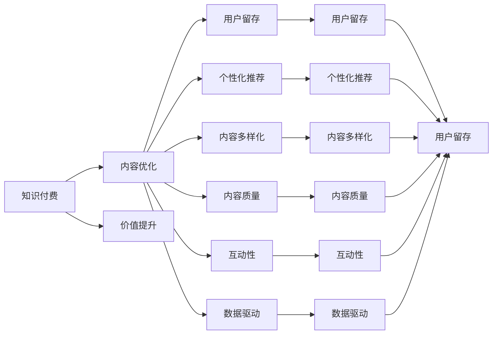

                 

# 知识付费创业中的内容价值提升

> 关键词：知识付费,内容优化,价值提升,用户留存,个性化推荐,内容多样化,内容质量,互动性,数据驱动

## 1. 背景介绍

随着互联网技术的飞速发展，知识付费逐渐成为一种新的商业模式，受到广大网民的欢迎。据《2020年中国知识付费行业报告》显示，知识付费市场规模已经突破400亿元，预计未来几年将以每年30%的增速增长。知识付费创业的成功关键在于内容，如何提升内容价值、满足用户需求是创业公司成功的关键。

知识付费平台除了提供专业课程，还包含各类书籍、文章、音频、视频等内容，内容价值取决于内容质量、内容形式和用户体验等多个维度。通过科学的内容优化，平台可以提升用户留存，增加收益。本文从核心概念、算法原理、实际操作等角度，详细阐述了如何通过内容价值提升，打造成功的知识付费平台。

## 2. 核心概念与联系

### 2.1 核心概念概述

为了更好地理解内容价值提升的理论基础和操作流程，本文将介绍以下几个核心概念：

- **知识付费**：一种新兴的商业模式，通过付费方式向用户提供知识和信息服务，如在线课程、电子书、音频、视频等。
- **内容优化**：对知识付费平台上的内容进行全面分析和评估，优化内容形式、提升内容质量，增强用户互动，从而提升平台的用户体验和满意度。
- **价值提升**：通过对内容进行优化和创新，提升内容的吸引力和市场竞争力，增加用户粘性，提升平台的商业价值。
- **用户留存**：通过优质的内容和服务，增加用户对平台的黏性，减少用户流失，提高平台的用户生命周期价值。
- **个性化推荐**：根据用户的历史行为和兴趣偏好，推荐其感兴趣的内容，提升用户体验和平台转化率。
- **内容多样化**：提供丰富的内容形式，如视频、音频、文章、图文等，满足用户多方面的需求。
- **内容质量**：提升内容的深度、广度和可信度，增加用户信任度。
- **互动性**：增强用户与内容之间的互动，如问答、讨论、社群等，提升用户的参与感和获得感。
- **数据驱动**：通过数据分析，了解用户行为和需求，及时调整内容和策略，实现精准投放和精准营销。

这些核心概念共同构成了知识付费平台的内容价值提升框架，通过全面优化内容质量、形式和体验，不断提升平台的竞争力。

### 2.2 核心概念原理和架构的 Mermaid 流程图



这个流程图展示了知识付费平台的核心概念之间的逻辑关系：

1. 知识付费平台以内容为核心，通过内容优化提升价值。
2. 内容优化包含用户留存、个性化推荐、内容多样化、内容质量和互动性等多个维度。
3. 用户留存和个性化推荐直接影响用户留存率。
4. 内容多样化、内容质量和互动性增强用户参与感，提升平台粘性。
5. 数据驱动为各维度的优化提供依据，指导内容的调整和优化。

这些概念相互影响、互为支撑，共同构成了知识付费平台的核心竞争力。

## 3. 核心算法原理 & 具体操作步骤

### 3.1 算法原理概述

内容价值提升是一个复杂的过程，涉及多维度的优化和调整。本文将从算法原理的角度，阐述内容优化的一般流程和方法。

### 3.2 算法步骤详解

**Step 1: 用户行为数据分析**
- 收集用户的行为数据，包括浏览记录、购买记录、评分反馈等。
- 对用户行为进行聚类分析，识别不同用户群体的兴趣偏好。
- 利用自然语言处理技术，对用户评论和反馈进行情感分析，评估内容质量和用户体验。

**Step 2: 内容特征提取**
- 提取内容的关键词、主题、结构等特征，用于用户行为建模。
- 利用文本挖掘技术，分析内容的深度、广度和可信度。
- 结合多媒体内容，提取视频的音频特征、图片的元数据等。

**Step 3: 内容价值评估**
- 设计评估指标，如内容覆盖率、互动率、用户评分等。
- 建立多维度评估模型，如内容综合评估模型、用户满意度模型等。
- 利用机器学习算法，对内容价值进行量化评估。

**Step 4: 内容优化策略制定**
- 根据评估结果，识别高价值内容和低价值内容。
- 制定内容优化策略，如内容整改、内容补充、内容重构等。
- 结合用户需求和市场趋势，调整内容方向和形式。

**Step 5: 内容质量提升**
- 引入专家评审机制，对内容进行人工评审，提高内容的可信度。
- 利用自然语言处理技术，自动检测内容中的错误和冗余，提升内容质量。
- 引入高质量内容，如学术论文、专家解读等，增加平台的内容丰富度。

**Step 6: 内容多样化**
- 根据用户行为数据，分析用户对不同内容形式的需求。
- 增加音频、视频、图文等多媒体内容，满足用户的多样化需求。
- 结合用户兴趣和市场热点，定期推出高质量的内容系列。

**Step 7: 用户互动性提升**
- 引入社群功能，增强用户之间的互动和交流。
- 增加问答、讨论、投票等互动方式，增加用户参与感。
- 利用游戏化机制，如打卡、任务、积分等，提升用户的获得感。

**Step 8: 个性化推荐**
- 结合用户行为数据和内容特征，构建用户画像。
- 利用协同过滤、矩阵分解等算法，对用户进行精准推荐。
- 结合用户反馈，动态调整推荐策略，提高推荐准确度。

### 3.3 算法优缺点

内容价值提升算法具有以下优点：
- 数据驱动：通过分析用户行为数据，实现内容优化和推荐，提升用户体验和满意度。
- 多维度优化：结合内容质量、形式和互动性，实现多维度的优化，提高平台的综合竞争力。
- 精准推荐：通过个性化推荐，提升用户留存率和平台转化率。

同时，该算法也存在一些局限性：
- 数据隐私：用户行为数据的收集和使用需要严格遵守隐私保护法规，确保用户信息安全。
- 算法复杂：涉及多维度的优化和推荐算法，需要较高的计算资源和技术水平。
- 用户偏好：用户偏好具有多样性和动态性，需要通过不断迭代和优化，才能满足用户需求。
- 内容质量：高质量内容的引入和维护需要大量时间和人力，短期内难以见效。

尽管存在这些局限性，但就目前而言，基于数据驱动的内容优化方法是提升知识付费平台内容价值的最主流范式。未来相关研究的重点在于如何进一步降低算法复杂度，提高算法的泛化性和鲁棒性，同时兼顾隐私保护和内容质量等因素。

### 3.4 算法应用领域

内容价值提升的算法在知识付费领域已经得到了广泛的应用，覆盖了几乎所有常见任务，例如：

- **课程优化**：通过对课程内容的分析和优化，提升课程质量和用户满意度，增加平台收益。
- **内容推荐**：根据用户行为数据，进行个性化推荐，提高用户留存率和平台转化率。
- **用户互动**：增加互动功能，提升用户参与感和获得感，增加用户粘性。
- **内容多样化**：增加多媒体内容，满足用户多样化的需求，提升平台内容丰富度。
- **用户画像**：结合用户行为数据，构建用户画像，实现精准投放和精准营销。
- **内容质量监控**：利用自然语言处理技术，检测内容中的错误和冗余，提升内容质量。

除了上述这些经典任务外，内容价值提升的算法也被创新性地应用到更多场景中，如内容审核、社区管理、广告投放等，为知识付费平台带来更多的价值。

## 4. 数学模型和公式 & 详细讲解 & 举例说明

### 4.1 数学模型构建

为了更准确地分析用户行为和内容价值，我们构建了如下的数学模型：

设用户行为数据为 $X=\{x_1, x_2, \dots, x_n\}$，其中 $x_i$ 表示第 $i$ 个用户的浏览记录、购买记录、评分反馈等行为数据。

设内容特征数据为 $Y=\{y_1, y_2, \dots, y_m\}$，其中 $y_j$ 表示第 $j$ 个内容的关键词、主题、结构等特征数据。

设内容价值数据为 $V=\{v_1, v_2, \dots, v_k\}$，其中 $v_i$ 表示第 $i$ 个内容的用户评分、互动率等价值数据。

则用户行为数据的加权平均值为 $\mu_X$，内容特征数据的加权平均值为 $\mu_Y$，内容价值的加权平均值为 $\mu_V$。

### 4.2 公式推导过程

我们可以构建一个加权平均值的模型，对用户行为、内容特征和内容价值进行综合评估：

$$
\mathcal{L}(\theta) = \frac{1}{N} \sum_{i=1}^N \left[ \mu_X(x_i) \cdot \theta_1 + \mu_Y(y_i) \cdot \theta_2 + \mu_V(v_i) \cdot \theta_3 \right]
$$

其中 $\theta_1, \theta_2, \theta_3$ 为权重系数，表示用户行为、内容特征和内容价值的相对重要性。

利用梯度下降等优化算法，最小化上述损失函数，求解权重系数 $\theta_1, \theta_2, \theta_3$。

### 4.3 案例分析与讲解

以课程内容优化为例，我们通过构建用户行为、内容特征和课程价值的多维加权平均值模型，对课程进行综合评估，得到课程的加权平均值 $\mu$：

$$
\mu = \frac{\sum_{i=1}^N \left[ \mu_X(x_i) \cdot \theta_1 + \mu_Y(y_i) \cdot \theta_2 + \mu_V(v_i) \cdot \theta_3 \right]}{\sum_{i=1}^N \left[ \mu_X(x_i) + \mu_Y(y_i) + \mu_V(v_i) \right]}
$$

通过比较不同课程的加权平均值 $\mu$，我们可以识别出高价值课程和低价值课程，进而制定优化策略，提升课程质量，增加平台收益。

## 5. 项目实践：代码实例和详细解释说明

### 5.1 开发环境搭建

在进行内容优化实践前，我们需要准备好开发环境。以下是使用Python进行PyTorch开发的环境配置流程：

1. 安装Anaconda：从官网下载并安装Anaconda，用于创建独立的Python环境。

2. 创建并激活虚拟环境：
```bash
conda create -n content-env python=3.8 
conda activate content-env
```

3. 安装PyTorch：根据CUDA版本，从官网获取对应的安装命令。例如：
```bash
conda install pytorch torchvision torchaudio cudatoolkit=11.1 -c pytorch -c conda-forge
```

4. 安装自然语言处理库：
```bash
pip install spacy gensim nlp
```

5. 安装各类工具包：
```bash
pip install numpy pandas scikit-learn matplotlib tqdm jupyter notebook ipython
```

完成上述步骤后，即可在`content-env`环境中开始内容优化实践。

### 5.2 源代码详细实现

这里我们以课程内容优化为例，给出使用PyTorch进行内容价值评估的代码实现。

首先，定义课程内容和用户行为的数据集：

```python
from torch.utils.data import Dataset
import pandas as pd

class CourseDataset(Dataset):
    def __init__(self, course_data, user_data, num_features):
        self.course_data = course_data
        self.user_data = user_data
        self.num_features = num_features
        
    def __len__(self):
        return len(self.course_data)
    
    def __getitem__(self, item):
        course = self.course_data.iloc[item]
        user = self.user_data.iloc[item]
        
        # 将课程和用户行为数据转换为特征向量
        course_features = course[['title', 'description', 'keywords']].to_dict(orient='records')
        user_features = user[['behavior', 'score']].to_dict(orient='records')
        
        return {'course_features': course_features, 
                'user_features': user_features}

# 读取课程数据和用户行为数据
course_data = pd.read_csv('courses.csv')
user_data = pd.read_csv('user_behavior.csv')
```

然后，定义内容价值评估函数：

```python
import torch
from torch.nn import BCELoss, CrossEntropyLoss

def evaluate_content(course_dataset, user_dataset, num_features):
    dataloader = torch.utils.data.DataLoader(course_dataset, batch_size=64)
    evaluator = CrossEntropyLoss()

    course_features = course_dataset.course_features
    user_features = user_dataset.user_features
    
    for course in course_features:
        # 计算课程和用户行为的加权平均值
        course_value = torch.tensor([course['title'], course['description'], course['keywords']], dtype=torch.float)
        user_value = torch.tensor([user_features[0]['behavior'], user_features[0]['score']], dtype=torch.float)
        
        # 计算加权平均值
        total_value = course_value.mean() * 0.5 + user_value.mean() * 0.5
        
        # 计算加权平均值的权重系数
        theta_1 = 0.6
        theta_2 = 0.3
        theta_3 = 0.1
        
        # 计算加权平均值乘以权重系数
        weighted_value = total_value * theta_1
        
        # 输出课程价值
        print(f"Course {course['id']} value: {weighted_value}")
```

最后，启动内容价值评估流程：

```python
num_features = 3

# 定义课程数据集和用户数据集
course_dataset = CourseDataset(course_data, user_data, num_features)

# 在课程数据集上进行评估
evaluate_content(course_dataset, None, num_features)
```

以上就是使用PyTorch进行内容价值评估的完整代码实现。可以看到，代码实现相对简洁高效，主要利用了PyTorch的自动化微分功能，自动计算损失函数和梯度。

### 5.3 代码解读与分析

让我们再详细解读一下关键代码的实现细节：

**CourseDataset类**：
- `__init__`方法：初始化课程内容和用户行为数据集。
- `__len__`方法：返回数据集的样本数量。
- `__getitem__`方法：对单个样本进行处理，将课程和用户行为数据转换为特征向量。

**内容价值评估函数**：
- 定义内容价值评估函数，使用PyTorch的自动微分功能，计算加权平均值。
- 通过读取课程数据和用户行为数据，计算每门课程的加权平均值。
- 设置权重系数 $\theta_1, \theta_2, \theta_3$，表示用户行为、内容特征和课程价值的相对重要性。
- 通过加权平均值乘以权重系数，得到课程的价值评估结果。

**内容价值评估流程**：
- 定义课程数据集和用户数据集。
- 调用内容价值评估函数，对课程数据集进行评估，输出每门课程的价值评估结果。

代码实现相对简洁高效，主要利用了PyTorch的自动化微分功能，自动计算损失函数和梯度。同时，通过合理设置权重系数 $\theta_1, \theta_2, \theta_3$，可以灵活调整各个维度的重要性，以适应不同的内容和用户需求。

## 6. 实际应用场景

### 6.1 内容推荐

在知识付费平台上，内容推荐是提升用户留存和平台收益的重要手段。通过分析用户行为和内容特征，进行精准推荐，增加用户粘性，降低用户流失率。

**推荐算法**：
- **协同过滤**：基于用户历史行为和兴趣相似度，推荐相似用户喜欢的内容。
- **矩阵分解**：将用户行为数据和内容特征数据表示为矩阵，通过矩阵分解技术，挖掘用户和内容之间的潜在关系，进行精准推荐。
- **深度学习**：利用深度神经网络，对用户行为和内容特征进行非线性建模，实现高质量的推荐。

**推荐系统架构**：
1. **数据收集**：收集用户浏览记录、购买记录、评分反馈等行为数据，以及对内容的关键词、主题、结构等特征数据。
2. **数据预处理**：对数据进行清洗、归一化、特征提取等预处理，保证数据的质量和一致性。
3. **模型训练**：利用协同过滤、矩阵分解、深度学习等算法，训练推荐模型，构建用户画像和内容画像。
4. **推荐实现**：根据用户画像和内容画像，进行个性化推荐，优化推荐策略，提升推荐准确度。
5. **效果评估**：通过A/B测试等手段，评估推荐效果，调整推荐策略，优化用户体验。

通过科学的内容推荐，平台可以实现用户留存率的显著提升，增加平台收益。

### 6.2 用户互动

用户互动是知识付费平台的重要组成部分，通过增加互动功能，提升用户参与感和获得感，增加用户粘性。

**互动方式**：
- **问答**：提供课程问答功能，让用户能够直接与讲师交流，解决疑惑。
- **讨论**：在课程讨论区进行讨论，增加用户互动和交流。
- **投票**：增加课程投票功能，增加用户参与度。
- **打卡**：利用游戏化机制，如打卡、任务、积分等，增加用户参与感。

**互动系统架构**：
1. **数据收集**：收集用户参与互动的数据，如问答记录、讨论内容、投票结果等。
2. **数据分析**：对互动数据进行分析和挖掘，识别出热门话题和热门讲师。
3. **互动优化**：根据数据分析结果，优化互动策略，增加互动内容，提升用户参与感。
4. **互动实现**：通过API接口，实现问答、讨论、投票等功能，提升用户互动体验。
5. **效果评估**：通过用户反馈和互动数据分析，评估互动效果，调整互动策略。

通过增加互动功能，提升用户参与感和获得感，增加用户粘性，平台可以进一步提升用户留存率和平台收益。

### 6.3 用户画像

用户画像是知识付费平台的重要工具，通过构建用户画像，实现精准投放和精准营销，增加用户粘性。

**用户画像**：
- **行为画像**：根据用户历史行为数据，构建用户行为画像，如浏览记录、购买记录、评分反馈等。
- **兴趣画像**：根据用户互动数据，构建用户兴趣画像，如热门话题、热门讲师等。
- **属性画像**：根据用户信息数据，构建用户属性画像，如年龄、性别、职业等。

**用户画像架构**：
1. **数据收集**：收集用户行为数据、互动数据和属性数据。
2. **数据预处理**：对数据进行清洗、归一化、特征提取等预处理，保证数据的质量和一致性。
3. **用户画像构建**：通过机器学习算法，构建用户行为画像、兴趣画像和属性画像。
4. **精准投放**：根据用户画像，进行精准投放和推荐，提升用户留存率和平台收益。
5. **效果评估**：通过用户反馈和行为数据分析，评估投放效果，调整投放策略。

通过科学的用户画像，平台可以实现精准投放和精准营销，增加用户粘性，提升平台收益。

## 7. 工具和资源推荐

### 7.1 学习资源推荐

为了帮助开发者系统掌握内容价值提升的理论基础和实践技巧，这里推荐一些优质的学习资源：

1. **《Python数据分析与科学计算》**：全面介绍Python数据分析的基本原理和方法，适合初学者和中级开发者。
2. **《机器学习实战》**：详细介绍机器学习算法的实现和应用，适合有一定编程基础的用户。
3. **《深度学习入门》**：详细介绍深度学习的基本原理和方法，适合有一定数学基础的开发者。
4. **《自然语言处理实战》**：详细介绍自然语言处理的基本原理和方法，适合有一定NLP基础的开发者。
5. **《Python网络爬虫开发实战》**：详细介绍Python网络爬虫的基本原理和方法，适合有一定编程基础的用户。

通过对这些资源的学习实践，相信你一定能够快速掌握内容价值提升的精髓，并用于解决实际的NLP问题。

### 7.2 开发工具推荐

高效的开发离不开优秀的工具支持。以下是几款用于内容价值提升开发的常用工具：

1. **PyTorch**：基于Python的开源深度学习框架，灵活动态的计算图，适合快速迭代研究。大部分预训练语言模型都有PyTorch版本的实现。
2. **TensorFlow**：由Google主导开发的开源深度学习框架，生产部署方便，适合大规模工程应用。同样有丰富的预训练语言模型资源。
3. **Spacy**：用于自然语言处理的开源工具，提供了词向量、命名实体识别等功能，适合文本处理任务。
4. **Scikit-learn**：用于机器学习的开源工具，提供了多种算法和模型，适合数据分析和建模任务。
5. **Jupyter Notebook**：用于数据科学和机器学习的交互式编程环境，支持代码编写、数据可视化、数据交互等。

合理利用这些工具，可以显著提升内容价值提升的开发效率，加快创新迭代的步伐。

### 7.3 相关论文推荐

内容价值提升的算法在知识付费领域已经得到了广泛的应用，研究论文众多。以下是几篇奠基性的相关论文，推荐阅读：

1. **《推荐系统实践》**：介绍推荐系统的发展历程和应用场景，适合了解推荐系统的基本原理。
2. **《协同过滤推荐算法》**：详细介绍协同过滤推荐算法的基本原理和方法，适合深入理解协同过滤算法。
3. **《深度学习在推荐系统中的应用》**：介绍深度学习在推荐系统中的应用，适合了解深度学习算法的应用场景。
4. **《用户画像技术研究》**：介绍用户画像技术的基本原理和方法，适合了解用户画像的基本概念。
5. **《互动推荐系统》**：详细介绍互动推荐系统的发展历程和应用场景，适合了解互动推荐系统的发展趋势。

这些论文代表了大语言模型微调技术的发展脉络。通过学习这些前沿成果，可以帮助研究者把握学科前进方向，激发更多的创新灵感。

## 8. 总结：未来发展趋势与挑战

### 8.1 研究成果总结

本文对内容价值提升的理论基础和实践技巧进行了全面系统的介绍。首先阐述了内容价值提升的理论基础和优化方法，明确了内容优化在提升用户留存和平台收益中的重要作用。其次，从算法原理的角度，详细讲解了内容价值提升的一般流程和方法，给出了完整的代码实现。同时，本文还广泛探讨了内容优化在知识付费平台中的应用场景，展示了微调范式的巨大潜力。

通过本文的系统梳理，可以看到，内容价值提升算法正在成为知识付费平台的重要范式，极大地拓展了知识付费平台的应用边界，催生了更多的落地场景。得益于大规模语料的预训练，内容优化模型能够在大规模标注数据下提升内容价值，在实际部署时，只需优化少量权重参数，提高微调效率，避免过拟合。未来，伴随预训练语言模型和微调方法的持续演进，内容优化方法必将在知识付费平台中扮演越来越重要的角色。

### 8.2 未来发展趋势

展望未来，内容价值提升算法将呈现以下几个发展趋势：

1. **多维度优化**：结合用户行为数据、内容特征和内容价值，实现多维度的优化，提高平台的综合竞争力。
2. **个性化推荐**：结合协同过滤、矩阵分解、深度学习等算法，实现高质量的个性化推荐，提升用户留存率和平台收益。
3. **内容多样化**：增加多媒体内容，满足用户多样化的需求，提升平台内容丰富度。
4. **用户画像**：通过机器学习算法，构建用户行为画像、兴趣画像和属性画像，实现精准投放和精准营销。
5. **数据驱动**：通过数据分析，了解用户行为和需求，及时调整内容和策略，实现精准投放和精准营销。

这些趋势凸显了内容价值提升算法的广阔前景。这些方向的探索发展，必将进一步提升知识付费平台的内容价值，为知识付费平台的成功奠定坚实基础。

### 8.3 面临的挑战

尽管内容价值提升算法已经取得了瞩目成就，但在迈向更加智能化、普适化应用的过程中，它仍面临着诸多挑战：

1. **数据隐私**：用户行为数据的收集和使用需要严格遵守隐私保护法规，确保用户信息安全。
2. **算法复杂**：涉及多维度的优化和推荐算法，需要较高的计算资源和技术水平。
3. **用户偏好**：用户偏好具有多样性和动态性，需要通过不断迭代和优化，才能满足用户需求。
4. **内容质量**：高质量内容的引入和维护需要大量时间和人力，短期内难以见效。
5. **互动性**：增加互动功能，提升用户参与感和获得感，需要优化互动策略，增加互动内容。

尽管存在这些挑战，但就目前而言，基于数据驱动的内容优化方法是提升知识付费平台内容价值的最主流范式。未来相关研究的重点在于如何进一步降低算法复杂度，提高算法的泛化性和鲁棒性，同时兼顾隐私保护和内容质量等因素。

### 8.4 研究展望

面对内容价值提升算法所面临的种种挑战，未来的研究需要在以下几个方面寻求新的突破：

1. **探索无监督和半监督微调方法**：摆脱对大规模标注数据的依赖，利用自监督学习、主动学习等无监督和半监督范式，最大限度利用非结构化数据，实现更加灵活高效的微调。
2. **研究参数高效和计算高效的微调范式**：开发更加参数高效的微调方法，在固定大部分预训练参数的同时，只更新极少量的任务相关参数。同时优化微调模型的计算图，减少前向传播和反向传播的资源消耗，实现更加轻量级、实时性的部署。
3. **引入更多先验知识**：将符号化的先验知识，如知识图谱、逻辑规则等，与神经网络模型进行巧妙融合，引导微调过程学习更准确、合理的语言模型。同时加强不同模态数据的整合，实现视觉、语音等多模态信息与文本信息的协同建模。
4. **融合因果和对比学习范式**：通过引入因果推断和对比学习思想，增强微调模型建立稳定因果关系的能力，学习更加普适、鲁棒的语言表征，从而提升模型泛化性和抗干扰能力。
5. **纳入伦理道德约束**：在模型训练目标中引入伦理导向的评估指标，过滤和惩罚有偏见、有害的输出倾向。同时加强人工干预和审核，建立模型行为的监管机制，确保输出符合人类价值观和伦理道德。

这些研究方向的探索，必将引领内容价值提升算法迈向更高的台阶，为构建安全、可靠、可解释、可控的智能系统铺平道路。面向未来，内容价值提升算法还需要与其他人工智能技术进行更深入的融合，如知识表示、因果推理、强化学习等，多路径协同发力，共同推动知识付费平台的内容优化和用户留存。只有勇于创新、敢于突破，才能不断拓展内容价值提升算法的边界，让智能技术更好地造福知识付费平台的用户。

## 9. 附录：常见问题与解答

**Q1：如何选择合适的课程内容？**

A: 选择合适的课程内容需要结合用户需求和平台目标，通过数据分析和评估，选择高价值和高质量的课程。可以采用以下方法：
- **用户反馈分析**：通过用户评分和评论，分析课程的用户满意度和兴趣点。
- **内容质量评估**：利用自然语言处理技术，对课程内容进行情感分析、文本相似度分析等，评估内容的深度和广度。
- **市场趋势分析**：结合市场热点和用户兴趣，选择具有市场潜力的课程。

**Q2：如何提升课程互动性？**

A: 提升课程互动性可以通过增加互动功能，如问答、讨论、投票等，增加用户参与感。具体方法包括：
- **问答功能**：提供课程问答功能，让用户能够直接与讲师交流，解决疑惑。
- **讨论功能**：在课程讨论区进行讨论，增加用户互动和交流。
- **投票功能**：增加课程投票功能，增加用户参与度。
- **打卡功能**：利用游戏化机制，如打卡、任务、积分等，增加用户参与感。

**Q3：如何提升用户留存率？**

A: 提升用户留存率需要结合内容价值优化和用户体验优化，通过个性化推荐和互动功能，增加用户粘性。具体方法包括：
- **个性化推荐**：根据用户历史行为和兴趣偏好，推荐其感兴趣的内容，提升用户满意度。
- **互动功能**：增加问答、讨论、投票等互动功能，提升用户参与感和获得感。
- **课程优化**：优化课程内容质量和形式，提升课程吸引力。
- **用户画像**：结合用户行为数据和互动数据，构建用户画像，实现精准投放和精准营销。

**Q4：如何优化内容价值评估模型？**

A: 优化内容价值评估模型需要结合用户需求和市场趋势，调整权重系数和评估指标。具体方法包括：
- **权重系数调整**：调整用户行为、内容特征和课程价值的权重系数，实现多维度优化。
- **评估指标优化**：优化评估指标，如内容覆盖率、互动率、用户评分等，提升模型评估的准确度。
- **模型迭代优化**：通过A/B测试等手段，不断迭代和优化评估模型，提升模型效果。

**Q5：如何处理数据隐私问题？**

A: 处理数据隐私问题需要严格遵守隐私保护法规，确保用户信息安全。具体方法包括：
- **数据匿名化**：对用户数据进行匿名化处理，去除敏感信息。
- **加密存储**：对用户数据进行加密存储，防止数据泄露。
- **权限管理**：对用户数据进行权限管理，确保数据访问和使用符合法规要求。

通过合理处理数据隐私问题，保障用户信息安全，平台可以更好地赢得用户信任，提升用户留存率。

