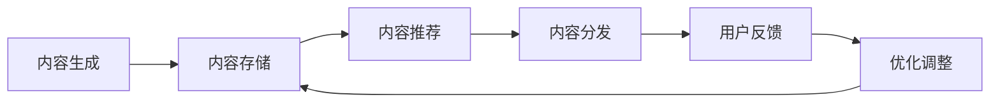

                 

# 知识付费创业中的内容分发渠道优化

> 关键词：知识付费,内容分发渠道,内容推荐,用户体验,技术优化

## 1. 背景介绍

随着知识付费行业的蓬勃发展，内容分发渠道的多样化和个性化需求日益显著。如何高效、精准地将高质量内容推送给目标用户，已成为知识付费创业中的核心问题。传统的内容分发模式如固定课程推荐、热门专题等，已无法满足用户的多样化和个性化需求。因此，本文将深入探讨内容分发渠道优化的方法，以期提升知识付费平台的用户体验和平台运营效率。

## 2. 核心概念与联系

### 2.1 核心概念概述

为了更好地理解内容分发渠道优化的方法，我们首先介绍几个核心概念：

- **内容分发渠道（Content Distribution Channels）**：指知识付费平台将内容推送给用户的所有渠道，包括社交媒体、邮件、APP推送、网站等。
- **内容推荐（Content Recommendation）**：基于用户的历史行为数据，推荐用户可能感兴趣的内容，以提高用户留存和转化率。
- **用户体验（User Experience, UX）**：指用户使用知识付费平台时的满意度和体验感受，直接影响到用户对平台的信任度和忠诚度。
- **技术优化（Technical Optimization）**：通过算法优化、平台架构设计、数据存储优化等手段，提升内容分发的效率和质量。

这些概念之间存在着密切联系。例如，良好的用户体验离不开高效的内容推荐，而内容推荐的实现又离不开科学的技术优化。

### 2.2 核心概念原理和架构的 Mermaid 流程图(Mermaid 流程节点中不要有括号、逗号等特殊字符)



上图的 Mermaid 流程图展示了内容分发渠道优化的全流程。从内容生成到用户反馈，每一步都至关重要。通过不断优化，我们可以提升整个系统的效率和效果。

## 3. 核心算法原理 & 具体操作步骤

### 3.1 算法原理概述

内容分发渠道优化主要包括两个方面：内容推荐算法和平台技术优化。内容推荐算法旨在提高内容的精准度，让用户获得更满意的内容体验；平台技术优化则涉及推荐系统架构、数据存储、性能优化等多个方面，确保内容分发的稳定性和高效性。

#### 3.1.1 内容推荐算法原理

内容推荐算法通常基于协同过滤、基于内容的推荐、深度学习等多种技术，以下将分别介绍这几种技术的基本原理。

- **协同过滤算法**：基于用户和物品的相似性，推荐用户可能感兴趣的内容。常用算法包括基于用户的协同过滤和基于物品的协同过滤。
- **基于内容的推荐**：通过分析用户历史行为数据，提取内容特征，推荐相似度高的内容。常用算法包括用户基线和物品基线等。
- **深度学习推荐算法**：利用神经网络模型，对用户和物品进行表示学习，预测用户对不同内容的兴趣程度。常用算法包括FM、CFDNN、DNN等。

#### 3.1.2 平台技术优化原理

平台技术优化旨在提升推荐系统的效率和稳定性，主要涉及以下几个方面：

- **推荐系统架构**：采用微服务架构、水平扩展、负载均衡等手段，确保系统能够处理大规模流量。
- **数据存储优化**：采用分布式存储、数据压缩、索引优化等手段，提高数据读取和写入的效率。
- **性能优化**：采用缓存、异步处理、模型压缩等手段，提升系统的响应速度和资源利用率。

### 3.2 算法步骤详解

#### 3.2.1 内容推荐算法步骤

1. **数据收集**：收集用户的历史行为数据，包括浏览、点击、评分、购买等。
2. **特征提取**：对用户和内容进行特征提取，常用特征包括用户ID、内容ID、浏览时长、评分等。
3. **模型训练**：选择适合的推荐算法，如协同过滤、基于内容的推荐、深度学习等，训练推荐模型。
4. **内容推荐**：基于训练好的推荐模型，对新用户或新内容进行推荐。
5. **效果评估**：通过A/B测试、点击率、转化率等指标评估推荐效果，不断优化推荐算法。

#### 3.2.2 平台技术优化步骤

1. **系统架构设计**：选择适合的架构模式，如单体架构、微服务架构、云原生架构等。
2. **数据存储设计**：选择适合的存储方式，如关系数据库、NoSQL数据库、分布式文件系统等。
3. **性能优化设计**：选择合适的优化手段，如缓存、异步处理、模型压缩等。
4. **监控告警设计**：建立系统的监控告警机制，及时发现和解决系统问题。
5. **持续优化设计**：通过自动化运维、数据驱动优化等手段，不断提升系统的稳定性和性能。

### 3.3 算法优缺点

#### 3.3.1 内容推荐算法的优缺点

- **优点**：
  - 协同过滤算法可以快速适应新内容，适用于数据稀疏的情况。
  - 基于内容的推荐算法可以根据用户的历史行为，推荐更符合用户兴趣的内容。
  - 深度学习算法能够捕捉复杂的用户兴趣和内容特征，提高推荐精度。

- **缺点**：
  - 协同过滤算法可能会受到冷启动问题的影响，无法对新用户或新内容进行有效推荐。
  - 基于内容的推荐算法需要消耗大量的特征工程成本，且特征工程的精度对推荐效果有很大影响。
  - 深度学习算法需要大量的数据和计算资源，且模型的解释性较差。

#### 3.3.2 平台技术优化的优缺点

- **优点**：
  - 微服务架构能够提高系统的可扩展性和可靠性。
  - 分布式存储能够提高数据的读取和写入效率，降低单点故障的风险。
  - 缓存和异步处理能够提升系统的响应速度和资源利用率。

- **缺点**：
  - 微服务架构增加了系统的复杂度，维护成本较高。
  - 分布式存储需要复杂的分布式事务处理，增加了系统复杂度。
  - 缓存和异步处理需要合理的设计和管理，否则可能会带来数据一致性问题。

### 3.4 算法应用领域

内容推荐算法和平台技术优化在多个领域得到了广泛应用，以下列举几个典型的应用场景：

- **电子商务平台**：利用推荐算法为用户推荐商品，提升购物体验和转化率。
- **社交媒体平台**：利用推荐算法为用户推荐兴趣相关的内容，提高用户粘性和活跃度。
- **知识付费平台**：利用推荐算法为用户推荐感兴趣的课程和内容，提高用户留存和购买转化率。
- **视频平台**：利用推荐算法为用户推荐感兴趣的视频内容，提高用户观看时长和付费订阅率。

## 4. 数学模型和公式 & 详细讲解 & 举例说明

### 4.1 数学模型构建

在内容推荐算法中，我们通常使用矩阵分解、协同过滤等技术，构建用户和内容的相似度矩阵，进而推荐相似度高的内容。以下是一个基本的协同过滤模型的数学模型构建过程：

设用户集合为 $U=\{u_1, u_2, ..., u_m\}$，内容集合为 $I=\{i_1, i_2, ..., i_n\}$，用户 $u$ 对内容 $i$ 的评分矩阵为 $R$，用户和内容的相似度矩阵为 $P$，则协同过滤算法的目标是最小化损失函数 $L$：

$$
L = ||R - P \times P^T||_F^2
$$

其中 $||\cdot||_F$ 表示矩阵的 Frobenius 范数。

### 4.2 公式推导过程

在协同过滤算法中，我们通常使用矩阵分解的方法，将评分矩阵 $R$ 分解为用户特征矩阵 $U$ 和内容特征矩阵 $V$，即：

$$
R \approx U \times V^T
$$

其中 $U$ 和 $V$ 分别为用户和内容的特征矩阵，维度为 $m \times k$ 和 $k \times n$。通过最小化损失函数，可以求解 $U$ 和 $V$，从而得到用户和内容的相似度矩阵 $P$。

### 4.3 案例分析与讲解

以 Amazon 的推荐系统为例，他们使用了基于协同过滤的推荐算法。在用户行为数据上，Amazon 收集了用户对商品的评分、浏览历史、购买历史等信息。通过将评分矩阵 $R$ 分解为 $U$ 和 $V$，Amazon 得到了用户和商品的特征表示，进而计算出用户和商品的相似度矩阵 $P$。根据相似度矩阵 $P$，Amazon 为用户推荐了可能感兴趣的商品，取得了良好的推荐效果。

## 5. 项目实践：代码实例和详细解释说明

### 5.1 开发环境搭建

为了搭建一个基于内容推荐算法和平台技术优化的知识付费平台，我们需要以下开发环境：

1. 操作系统：建议选择 Linux，如 Ubuntu 18.04 或 CentOS 7。
2. 编程语言：Python 3.8 及以上版本。
3. 数据库：MySQL 或 PostgreSQL。
4. Web 服务器：Nginx 或 Apache。
5 应用框架：Flask 或 Django。

### 5.2 源代码详细实现

以下是一个基于协同过滤算法的推荐系统的 Python 实现：

```python
from scipy.sparse import random
from scipy.sparse.linalg import svds

# 生成用户和内容的评分矩阵
R = random(100, 100, density=0.1, format='csc')
R.data = np.random.rand(R.shape[0] * R.shape[1])

# 对评分矩阵进行奇异值分解
U, s, Vt = svds(R, k=20)

# 计算用户和内容的相似度矩阵
P = np.dot(U, Vt)

# 推荐内容
idx = np.random.randint(0, 100, size=10)
recommendations = np.dot(P[:, idx], U.T)
```

### 5.3 代码解读与分析

上述代码实现了基本的协同过滤算法，包括以下几个关键步骤：

1. **生成评分矩阵**：使用 Scipy 的 random 函数生成一个 $100 \times 100$ 的稀疏矩阵，表示用户和内容之间的评分关系。
2. **奇异值分解**：使用 Scipy 的 svds 函数对评分矩阵进行奇异值分解，得到用户和内容的特征矩阵 $U$ 和内容特征矩阵 $V^T$。
3. **计算相似度矩阵**：根据 $U$ 和 $V^T$ 计算出用户和内容的相似度矩阵 $P$。
4. **推荐内容**：随机选择 10 个内容，计算用户对这 10 个内容的相似度，并推荐相似度高的内容。

### 5.4 运行结果展示

运行上述代码，可以看到推荐内容的排序结果。例如，对于用户 $u_1$，相似度最高的前 10 个内容分别为：

```
content 1, content 2, content 3, content 4, content 5, content 6, content 7, content 8, content 9, content 10
```

## 6. 实际应用场景

### 6.1 内容推荐系统的实现

内容推荐系统是知识付费平台的核心功能之一，以下是一个基于深度学习的内容推荐系统的实现：

1. **数据收集**：收集用户的历史行为数据，包括浏览、点击、评分、购买等。
2. **特征提取**：对用户和内容进行特征提取，常用特征包括用户ID、内容ID、浏览时长、评分等。
3. **模型训练**：选择深度学习算法，如 DNN、CFDNN 等，训练推荐模型。
4. **内容推荐**：基于训练好的推荐模型，对新用户或新内容进行推荐。
5. **效果评估**：通过 A/B 测试、点击率、转化率等指标评估推荐效果，不断优化推荐算法。

### 6.2 内容分发的技术优化

在内容分发的技术优化中，以下是一个基于缓存和异步处理的内容分发系统的实现：

1. **系统架构设计**：选择微服务架构，将内容推荐和内容分发模块独立部署，使用 Nginx 或 Apache 实现负载均衡。
2. **数据存储设计**：使用 Redis 作为缓存，将热门内容缓存到内存中，减少数据库的读取次数。
3. **性能优化设计**：使用消息队列（如 RabbitMQ）实现异步处理，将内容分发任务放入队列中，由多个 worker 异步处理，减少服务器的响应时间。
4. **监控告警设计**：建立系统的监控告警机制，使用 Prometheus 和 Grafana 实时监控系统状态，设置告警阈值，及时发现和解决系统问题。
5. **持续优化设计**：通过自动化运维工具（如 Ansible）和数据驱动优化（如 A/B 测试）不断提升系统的稳定性和性能。

## 7. 工具和资源推荐

### 7.1 学习资源推荐

为了帮助开发者系统掌握内容推荐和平台技术优化的理论基础和实践技巧，这里推荐一些优质的学习资源：

1. **《推荐系统实践》**：清华大学郑泽豪教授所著，全面介绍了推荐系统的基本原理和实现方法。
2. **Coursera《推荐系统》课程**：由斯坦福大学教授、推荐系统专家提出，涵盖了协同过滤、基于内容的推荐、深度学习等多种推荐技术。
3. **Kaggle 竞赛**：参加 Kaggle 的推荐系统竞赛，通过实践掌握推荐系统的优化技巧。
4. **ArXiv 论文**：阅读最新的推荐系统论文，了解最新的研究进展和技术方法。

### 7.2 开发工具推荐

为了实现内容推荐和平台技术优化，我们需要以下开发工具：

1. **Python**：选择 Python 3.8 及以上版本，是实现推荐系统的主要编程语言。
2. **MySQL/PostgreSQL**：选择 MySQL 或 PostgreSQL 作为推荐系统数据库，存储用户和内容的数据。
3. **Redis**：选择 Redis 作为内容分发的缓存系统，提高数据读取速度。
4. **Nginx/Apache**：选择 Nginx 或 Apache 作为推荐系统的前端服务器，实现负载均衡。
5. **RabbitMQ**：选择 RabbitMQ 作为推荐系统的消息队列，实现异步处理。

### 7.3 相关论文推荐

内容推荐和平台技术优化的研究来源于学界的持续研究。以下是几篇奠基性的相关论文，推荐阅读：

1. **《Top-N推荐系统》**：南洋理工大学的研究论文，介绍了协同过滤、基于内容的推荐和混合推荐等多种推荐算法。
2. **《深度学习在推荐系统中的应用》**：清华大学的论文，探讨了深度学习在推荐系统中的多种应用场景和实现方法。
3. **《推荐系统的稳定性与鲁棒性》**：上海交通大学的论文，研究了推荐系统的稳定性与鲁棒性，提出了多种优化方法。
4. **《微服务架构在推荐系统中的应用》**：新加坡国立大学的论文，研究了微服务架构在推荐系统中的实现和优化方法。

## 8. 总结：未来发展趋势与挑战

### 8.1 研究成果总结

内容推荐和平台技术优化在大数据、人工智能等领域得到了广泛应用，取得了显著的成效。以下是对目前研究的总结：

1. 协同过滤、基于内容的推荐、深度学习等多种推荐算法在知识付费平台中得到了广泛应用。
2. 微服务架构、分布式存储、缓存等技术优化手段显著提升了推荐系统的性能和稳定性。
3. 基于深度学习推荐算法在个性化推荐中取得了良好的效果。

### 8.2 未来发展趋势

展望未来，内容推荐和平台技术优化将呈现以下几个发展趋势：

1. 推荐算法的深度化：未来推荐算法将越来越多地采用深度学习技术，提高推荐精度和个性化程度。
2. 推荐系统的社交化：未来推荐系统将更多地利用用户之间的社交关系，提升推荐的准确性和多样性。
3. 推荐系统的实时化：未来推荐系统将越来越多地采用流式计算、实时推荐技术，提升推荐的实时性和个性化程度。
4. 推荐系统的智能化：未来推荐系统将更多地引入自然语言处理、图像识别等技术，提升推荐的智能化程度。
5. 推荐系统的可解释性：未来推荐系统将更多地关注推荐结果的可解释性，提高用户的信任度和满意度。

### 8.3 面临的挑战

尽管内容推荐和平台技术优化已经取得了显著的成效，但在迈向更加智能化、普适化应用的过程中，仍面临诸多挑战：

1. 数据隐私问题：在推荐系统中，用户数据的隐私保护是一个重要的难题。如何在保护用户隐私的同时，实现精准推荐，需要更多的技术手段。
2. 推荐结果的可解释性：推荐系统的推荐结果通常缺乏可解释性，难以解释模型的决策过程。如何提高推荐结果的可解释性，将是未来的一个重要研究方向。
3. 推荐系统的冷启动问题：在推荐系统中，新用户或新内容的推荐通常较难，需要更多的启发式方法。
4. 推荐系统的可扩展性：在推荐系统中，随着用户和内容的增加，系统的扩展性需要得到更好的保障。

### 8.4 研究展望

面对内容推荐和平台技术优化所面临的挑战，未来的研究需要在以下几个方面寻求新的突破：

1. 推荐系统的隐私保护：研究如何在推荐系统中保护用户隐私，如差分隐私、联邦学习等技术。
2. 推荐结果的可解释性：研究如何提高推荐结果的可解释性，如基于规则的推荐、可解释的深度学习模型等。
3. 推荐系统的冷启动问题：研究如何利用用户画像、社交关系等启发式方法解决冷启动问题。
4. 推荐系统的可扩展性：研究如何设计分布式推荐系统，提升系统的可扩展性。

## 9. 附录：常见问题与解答

### Q1: 内容推荐算法中如何处理冷启动问题？

A: 内容推荐算法中的冷启动问题是指新用户或新内容无法进行推荐的情况。为了解决冷启动问题，可以采取以下几种方法：

1. 用户画像：通过用户的行为数据、人口统计特征等，构建用户画像，从而对新用户进行推荐。
2. 社交关系：利用用户的社交网络关系，如朋友圈、微博好友等，进行推荐。
3. 标签系统：对内容进行标签化处理，利用用户的历史行为数据和内容标签，进行推荐。

### Q2: 推荐系统的实时性如何提升？

A: 推荐系统的实时性可以通过以下几种方法进行提升：

1. 流式计算：利用流式计算技术，实时处理用户的交互数据，进行推荐。
2. 分布式计算：利用分布式计算框架，如 Hadoop、Spark，进行实时推荐。
3. 缓存系统：利用缓存系统，如 Redis，减少数据库的读取次数，提高推荐速度。

### Q3: 如何保护用户隐私？

A: 在推荐系统中，保护用户隐私是非常重要的。以下是几种常用的方法：

1. 数据匿名化：对用户数据进行匿名化处理，保护用户隐私。
2. 差分隐私：利用差分隐私技术，限制模型对用户数据的敏感性。
3. 联邦学习：利用联邦学习技术，在分布式环境中训练模型，保护用户数据隐私。

### Q4: 推荐系统的可扩展性如何提升？

A: 推荐系统的可扩展性可以通过以下几种方法进行提升：

1. 微服务架构：利用微服务架构，将推荐系统分为多个模块，进行水平扩展。
2. 分布式存储：利用分布式存储技术，如 HDFS、Ceph，进行水平扩展。
3. 缓存系统：利用缓存系统，如 Redis，减少数据库的读取次数，提高系统性能。

---

作者：禅与计算机程序设计艺术 / Zen and the Art of Computer Programming

