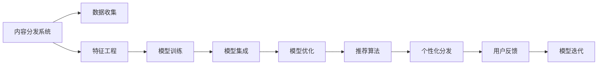

                 

# 知识付费创业中的内容分发渠道优化

> 关键词：知识付费,内容分发,优化,算法,技术,市场策略

## 1. 背景介绍

在数字化时代，知识付费领域正处于迅猛发展阶段。从付费问答、知识图谱、在线课程到播客、电子书等形式，知识付费已成为人们获取信息、提升技能、充实生活的不可或缺的一部分。然而，面对琳琅满目的内容产品和丰富的用户需求，如何精准分发知识，提高内容价值，提升用户满意度，成为知识付费平台的关键挑战。

### 1.1 问题由来

随着知识付费市场的不断扩大，越来越多的内容创业者加入到这个领域，导致市场竞争加剧。如何在激烈的市场竞争中突围，如何高效分发优质内容，从而实现内容变现、用户留存和品牌价值提升，成为平台和内容创作者亟需解决的核心问题。

### 1.2 问题核心关键点

当前，知识付费平台主要面临以下几个关键问题：
- 内容同质化严重。由于知识付费赛道相对较新，众多平台和创作者以相同的策略进行内容生产和分发，导致内容产品高度雷同，难以吸引和留住用户。
- 分发机制单一。大多数平台仍然依赖于用户自主搜索和浏览，缺乏有效的推荐算法和个性化分发机制，用户获取内容的体验较差。
- 用户需求多样。随着用户需求的不断变化，平台难以精准捕捉用户的个性化需求，导致部分优质内容被忽视，部分冷门内容被过度曝光。
- 内容价值评估困难。如何量化和评估内容价值，确保高价值内容能够得到更多曝光，是内容分发优化的一大挑战。

### 1.3 问题研究意义

研究内容分发渠道的优化方法，对于提升知识付费平台的用户体验、增强平台的竞争力、促进知识内容的有效流通具有重要意义。具体来说，基于内容分发的优化：
- 有助于平台提升用户粘性，增加用户付费意愿和时长。
- 能够实现优质内容的精准匹配，最大化内容价值。
- 可以有效挖掘用户潜在需求，提高内容服务的精准度。
- 能够优化平台运营成本，提升内容生产和分发的效率。

## 2. 核心概念与联系

### 2.1 核心概念概述

为更好地理解内容分发渠道优化的核心概念，本节将介绍几个紧密相关的核心概念：

- 内容分发系统(Content Distribution System)：指知识付费平台用于内容分发、推荐、用户互动等环节的系统架构。内容分发系统通过设计合理的内容分发策略，实现高效的内容匹配和推荐，提升用户体验。

- 推荐算法(Recommendation Algorithm)：指基于用户行为、内容属性等数据，通过算法模型计算用户对内容的兴趣程度，从而实现个性化推荐。推荐算法是内容分发优化的核心技术。

- 多模态数据融合(Multi-modal Data Fusion)：指将文本、图片、视频等多种模态的数据融合起来，构建更加全面、丰富的用户画像和内容标签，从而提高推荐的准确性和多样性。

- 用户画像(User Profiling)：指通过分析用户的历史行为、属性、兴趣等信息，构建用户的全面画像，用于提升推荐算法的精准度。

- 模型优化(Model Optimization)：指对推荐算法模型进行调参、集成、压缩等优化操作，提升算法的性能和部署效率。

这些核心概念之间紧密联系，共同构成了知识付费平台内容分发的完整框架，实现从数据收集、特征工程、模型训练到模型部署的流程化应用。

### 2.2 核心概念原理和架构的 Mermaid 流程图



## 3. 核心算法原理 & 具体操作步骤
### 3.1 算法原理概述

内容分发优化的核心原理是通过推荐算法实现个性化推荐，提升用户对内容的匹配度和满意度。推荐算法一般包括三个主要步骤：

1. 用户画像构建：通过收集和分析用户的历史行为数据，生成用户的全面画像，涵盖兴趣偏好、活跃时间、付费习惯等维度。

2. 内容标签设计：将内容按照不同的特征维度进行标签化处理，如主题、难度、时长、推荐值等，从而实现内容的自动分类。

3. 个性化推荐：基于用户画像和内容标签，通过推荐算法模型计算用户对内容的匹配程度，实现个性化分发。

### 3.2 算法步骤详解

#### 3.2.1 用户画像构建

用户画像构建是推荐算法的基础，通过多维度的用户数据，生成一个全面而精细的用户画像，用于指导个性化推荐。

- 数据来源：用户行为数据、用户属性数据、用户反馈数据等。
- 数据处理：数据清洗、特征提取、数据融合等操作，生成用户的基本画像和行为画像。
- 画像建模：采用聚类算法、决策树、深度学习等方法，生成用户画像模型。

#### 3.2.2 内容标签设计

内容标签设计是推荐算法的重要环节，通过将内容进行标签化处理，便于机器进行匹配和推荐。

- 标签类型：标签可以是词袋模型(Bag-of-Words)、主题模型(Latent Dirichlet Allocation)、词向量模型(Word2Vec)等。
- 标签生成：通过TF-IDF、LSI、Word2Vec等技术，将内容转化为标签向量。
- 标签关联：通过相似度计算、矩阵分解等方法，将内容标签进行关联和聚类。

#### 3.2.3 个性化推荐

个性化推荐是推荐算法的核心步骤，通过用户画像和内容标签，实现用户与内容的精准匹配。

- 推荐算法：协同过滤、基于内容的推荐、矩阵分解、深度学习等算法。
- 模型训练：通过离线训练和在线调参，优化推荐模型，提升推荐效果。
- 实时推荐：将训练好的推荐模型部署到实时推荐系统中，根据用户实时行为数据进行推荐。

### 3.3 算法优缺点

内容分发优化算法具有以下优点：
- 个性化推荐：通过用户画像和内容标签，实现精准推荐，提升用户满意度。
- 多模态融合：结合文本、图片、视频等多模态数据，构建更全面的用户画像和内容标签，提高推荐的准确性和多样性。
- 算法灵活：可以选择不同的推荐算法和优化方法，适应不同的业务场景。

同时，该算法也存在一定的局限性：
- 数据依赖：算法效果很大程度上依赖于数据的质量和数量，数据收集和处理成本较高。
- 模型复杂：复杂的推荐算法需要更多的计算资源和存储空间，部署成本较高。
- 用户体验：推荐算法可能带来过拟合问题，导致推荐结果不够多样化，甚至出现"信息茧房"现象。

### 3.4 算法应用领域

内容分发优化算法在知识付费领域有广泛的应用，具体包括：

- 课程推荐：根据用户历史行为和课程属性，为用户推荐适合的课程。
- 文章推荐：根据用户阅读习惯和文章内容标签，为用户推荐感兴趣的深度文章。
- 视频推荐：根据用户观看历史和视频属性，为用户推荐相关视频内容。
- 直播推荐：根据用户直播互动和主播特色，为用户推荐适合的直播课程。

## 4. 数学模型和公式 & 详细讲解 & 举例说明
### 4.1 数学模型构建

本节将使用数学语言对内容分发优化算法进行严格建模。

记用户画像为 $u$，内容标签为 $c$，推荐模型为 $M_{\theta}$，其中 $\theta$ 为模型参数。设用户画像 $u$ 与内容标签 $c$ 之间的匹配度为 $P(u,c)$，推荐模型 $M_{\theta}$ 的预测结果为 $M_{\theta}(u)$。推荐的目标是最大化用户和内容的匹配度，即最大化：

$$
\max_{\theta} \mathcal{L}(M_{\theta}) = \max_{\theta} \sum_{u,c} P(u,c) \cdot M_{\theta}(u)
$$

其中 $\mathcal{L}(M_{\theta})$ 为推荐模型在训练集上的损失函数。

### 4.2 公式推导过程

以下我们以协同过滤算法为例，推导推荐模型的损失函数和优化公式。

协同过滤算法通过分析用户历史行为数据，寻找与目标用户兴趣相似的用户，基于这些相似用户的行为，预测目标用户对内容物品的兴趣。设用户 $u$ 的历史行为向量为 $\mathbf{I_u}$，内容物品 $c$ 的评分向量为 $\mathbf{R_c}$，则协同过滤算法模型的预测结果为：

$$
M_{\theta}(u) = \frac{\mathbf{I_u}^T \cdot \mathbf{R_c}}{\|\mathbf{I_u}\| \cdot \|\mathbf{R_c}\|}
$$

将预测结果 $M_{\theta}(u)$ 代入损失函数 $\mathcal{L}(M_{\theta})$，得到协同过滤算法的损失函数：

$$
\mathcal{L}(M_{\theta}) = -\frac{1}{N}\sum_{u,c} y_{u,c} \cdot \log(M_{\theta}(u))
$$

其中 $y_{u,c}$ 为用户 $u$ 对内容物品 $c$ 的真实评分，$N$ 为用户数。

通过梯度下降等优化算法，协同过滤算法不断更新模型参数 $\theta$，最小化损失函数 $\mathcal{L}(M_{\theta})$，使得模型输出逼近真实评分。

### 4.3 案例分析与讲解

以在线课程推荐为例，分析推荐算法的工作流程。

假设某知识付费平台有 100 个用户和 1000 门课程，每个用户有 10 门课程的评分数据。采用协同过滤算法进行推荐，具体步骤如下：

1. 数据预处理：将用户评分数据转换为矩阵形式 $\mathbf{I} \in \mathbb{R}^{100 \times 1000}$，其中 $\mathbf{I}_{u,i} = y_{u,i}$。

2. 相似度计算：计算用户 $u$ 与内容物品 $c$ 的相似度 $s_{u,c} = \frac{\mathbf{I_u}^T \cdot \mathbf{R_c}}{\|\mathbf{I_u}\| \cdot \|\mathbf{R_c}\|}$。

3. 预测评分：计算用户 $u$ 对内容物品 $c$ 的预测评分 $r_{u,c} = M_{\theta}(u) = s_{u,c}$。

4. 模型优化：通过优化算法不断调整模型参数 $\theta$，使得预测评分 $r_{u,c}$ 尽可能接近真实评分 $y_{u,c}$。

## 5. 项目实践：代码实例和详细解释说明
### 5.1 开发环境搭建

在进行内容分发优化实践前，我们需要准备好开发环境。以下是使用Python进行Spark MLlib开发的环境配置流程：

1. 安装Anaconda：从官网下载并安装Anaconda，用于创建独立的Python环境。

2. 创建并激活虚拟环境：
```bash
conda create -n spark-env python=3.8 
conda activate spark-env
```

3. 安装Spark和MLlib：从官网获取对应的安装命令。例如：
```bash
conda install pyspark=3.2.0 -c conda-forge
conda install scikit-learn pytables
```

4. 安装各类工具包：
```bash
pip install numpy pandas scikit-learn matplotlib tqdm jupyter notebook ipython
```

完成上述步骤后，即可在`spark-env`环境中开始内容分发优化的实践。

### 5.2 源代码详细实现

下面以基于协同过滤算法的内容推荐系统为例，给出使用Spark MLlib进行内容分发优化的PySpark代码实现。

首先，定义数据处理函数：

```python
from pyspark.sql import SparkSession
from pyspark.ml.evaluation import RegressionEvaluator
from pyspark.ml.feature import ItemALS, ALS

spark = SparkSession.builder.appName("ContentRecommendation").getOrCreate()

def preprocess_data(df):
    df.drop_duplicates().show(truncate=False)
    df.createOrReplaceTempView("raw_data")
    df.show(truncate=False)
    df = df.withColumn("user_item", df.user_id * 1000 + df.item_id)
    df.show(truncate=False)
    df = df.drop("item_id", "user_id")
    df = df.join(df.select("user_item", df.user_id, df.item_id), ["user_item"])
    df = df.drop("user_item", "item_id")
    return df.select("user_item", "user_score", "item_score")

# 加载数据
df = spark.read.format("csv").option("header", "true").load("data.csv")
df = preprocess_data(df)
```

然后，定义模型训练函数：

```python
# 初始化协同过滤模型
model = ALS(itemsPerFactor=10, userCol="user_item", itemCol="item_score", ratingCol="user_score", seed=1)

# 训练模型
model.fit(df)

# 预测评分
df = model.transform(df)
predictions = df.select("user_item", "item_score", "prediction")
predictions.show(truncate=False)

# 评估模型
evaluator = RegressionEvaluator(predictionCol="prediction", labelCol="user_score", metricName="rmse")
rmse = evaluator.evaluate(predictions)
print(f"RMSE: {rmse}")
```

最后，启动训练流程并在测试集上评估：

```python
# 获取模型参数
model.collect()
```

以上就是使用Spark MLlib对协同过滤算法进行内容推荐的完整代码实现。可以看到，通过Spark MLlib，我们可以较为轻松地实现复杂的协同过滤算法，提升推荐系统的性能和可扩展性。

### 5.3 代码解读与分析

让我们再详细解读一下关键代码的实现细节：

**preprocess_data函数**：
- `df.drop_duplicates()`：去除重复数据。
- `df.createOrReplaceTempView("raw_data")`：将数据集缓存到临时视图中，便于后续操作。
- `df.select()`：根据需求选择需要的列，并进行操作。
- `df.join()`：进行数据连接操作。
- `df.drop()`：删除不需要的列。

**训练函数**：
- `ALS(itemsPerFactor=10)`：初始化协同过滤模型，设置隐层向量的维度。
- `model.fit(df)`：训练模型。
- `df = model.transform(df)`：使用训练好的模型进行预测。
- `evaluator.evaluate(predictions)`：评估模型性能。

**评估函数**：
- `evaluator`：初始化评估器，设置评估指标。
- `rmse`：计算均方根误差。

**启动训练流程**：
- `model.collect()`：获取模型参数，进行参数分析。

可以看到，Spark MLlib提供了强大的机器学习库，可以便捷地实现复杂算法，提升内容分发的效率和精度。同时，Spark架构天然支持分布式计算，能够处理大规模数据集，非常适合知识付费平台的推荐系统。

当然，实际应用中还需要考虑更多因素，如数据的实时更新、模型超参数的调优、异常数据的处理等，但核心的算法框架与代码实现大致如此。

## 6. 实际应用场景
### 6.1 智能推荐系统

智能推荐系统是内容分发优化的典型应用场景。通过智能推荐系统，平台可以根据用户行为数据，推荐符合用户兴趣的内容，提高用户的满意度和留存率。

在技术实现上，可以构建一个基于协同过滤和矩阵分解的推荐系统，对用户行为数据进行特征提取和建模，预测用户对不同内容的兴趣度，实现个性化推荐。平台可以根据推荐效果实时调整参数和优化模型，不断提升推荐的准确性和多样性。

### 6.2 内容搜索系统

内容搜索系统通过关键词匹配，帮助用户快速找到相关内容。通过优化搜索算法，可以提高搜索结果的相关性和准确性，提升用户的搜索体验。

在技术实现上，可以采用向量空间模型(Vector Space Model)、TF-IDF算法等，将内容进行向量表示，与用户查询进行匹配，筛选出最相关的结果。平台还可以引入深度学习技术，提高搜索模型的智能性和灵活性。

### 6.3 个性化课程推荐

个性化课程推荐系统可以根据用户的历史学习行为、学习偏好等信息，为用户推荐适合的课程。通过优化推荐算法，可以提高课程推荐的精准度，帮助用户高效学习。

在技术实现上，可以采用基于协同过滤、内容标签匹配、深度学习等多种推荐算法，构建多模态推荐模型，提升推荐效果。平台还可以引入知识图谱、专家推荐等手段，进一步提高课程推荐的智能性和多样性。

### 6.4 未来应用展望

随着内容分发优化的不断发展和应用，未来的知识付费平台将呈现以下几个发展趋势：

1. 多模态融合：结合文本、图片、视频等不同模态的内容，构建更加全面、丰富的用户画像和内容标签，实现内容的多维度推荐。

2. 个性化推荐：引入深度学习等先进算法，实现更精准、更个性化的内容推荐，提升用户满意度和留存率。

3. 实时推荐：结合流式计算、机器学习等技术，实现实时内容推荐，满足用户即时需求。

4. 推荐多样性：采用多样性优化算法，提升推荐结果的多样性，避免信息茧房现象。

5. 用户反馈：引入用户反馈机制，动态调整推荐算法，提高推荐效果。

6. 数据驱动：通过数据分析，挖掘用户需求，优化内容分发策略，提升推荐效果。

以上趋势凸显了内容分发优化技术的广阔前景。这些方向的探索发展，将进一步提升知识付费平台的用户体验和竞争力，为内容创业者提供更高效、更智能的内容分发工具。

## 7. 工具和资源推荐
### 7.1 学习资源推荐

为了帮助开发者系统掌握内容分发优化技术的理论基础和实践技巧，这里推荐一些优质的学习资源：

1. 《机器学习实战》系列博文：由数据科学家撰写，系统介绍了机器学习的基本概念和常见算法，涵盖协同过滤、深度学习等内容分发优化相关技术。

2. Coursera《数据科学基础》课程：约翰·霍普金斯大学开设的入门级课程，介绍了数据处理、特征工程、模型评估等基础知识，适合初学者入门。

3. Kaggle竞赛：通过参与各类机器学习竞赛，练习数据处理、模型调参、结果评估等技术，提升实战能力。

4. PyTorch官方文档：全面介绍了PyTorch的使用方法和深度学习模型的构建，适合实践内容的推荐系统。

5. Scikit-learn官方文档：详细介绍了Scikit-learn库的使用方法和机器学习算法，适合内容搜索系统等应用场景。

通过学习这些资源，相信你一定能够快速掌握内容分发优化的精髓，并用于解决实际的内容推荐问题。

### 7.2 开发工具推荐

高效的开发离不开优秀的工具支持。以下是几款用于内容分发优化开发的常用工具：

1. PyTorch：基于Python的开源深度学习框架，灵活动态的计算图，适合快速迭代研究。

2. Scikit-learn：基于Python的机器学习库，提供了丰富的算法和工具，适合内容搜索系统等应用场景。

3. Spark MLlib：Apache Spark的机器学习库，支持大规模数据处理和分布式计算，适合智能推荐系统等应用场景。

4. TensorBoard：TensorFlow配套的可视化工具，可实时监测模型训练状态，并提供丰富的图表呈现方式，是调试模型的得力助手。

5. Weights & Biases：模型训练的实验跟踪工具，可以记录和可视化模型训练过程中的各项指标，方便对比和调优。

6. Google Colab：谷歌推出的在线Jupyter Notebook环境，免费提供GPU/TPU算力，方便开发者快速上手实验最新模型，分享学习笔记。

合理利用这些工具，可以显著提升内容分发优化的开发效率，加快创新迭代的步伐。

### 7.3 相关论文推荐

内容分发优化技术的发展源于学界的持续研究。以下是几篇奠基性的相关论文，推荐阅读：

1. "Collaborative Filtering for Implicit Feedback Datasets"：提供了协同过滤算法的基本原理和实现方法，是内容推荐系统的重要基础。

2. "A New Matrix Factorization Approach for Collaborative Filtering"：提出矩阵分解算法，为内容推荐系统提供了新的思路和工具。

3. "Neural Collaborative Filtering"：将深度学习引入协同过滤算法，提升了推荐的精度和性能。

4. "Deep Matrix Factorization"：提出深度矩阵分解算法，提升了推荐系统的效果和泛化能力。

5. "Adaptive Non-negative Matrix Factorization"：提出自适应非负矩阵分解算法，增强了推荐系统的鲁棒性和灵活性。

这些论文代表了大数据和机器学习在内容推荐领域的发展脉络。通过学习这些前沿成果，可以帮助研究者把握学科前进方向，激发更多的创新灵感。

## 8. 总结：未来发展趋势与挑战
### 8.1 总结

本文对内容分发优化方法进行了全面系统的介绍。首先阐述了内容分发优化的研究背景和意义，明确了推荐算法在提升内容分发效率、增强用户体验方面的独特价值。其次，从原理到实践，详细讲解了推荐算法的数学原理和关键步骤，给出了推荐任务开发的完整代码实例。同时，本文还广泛探讨了推荐算法在智能推荐系统、内容搜索系统、个性化课程推荐等多个应用场景中的具体实现，展示了内容分发优化技术的广阔应用前景。

通过本文的系统梳理，可以看到，内容分发优化技术在知识付费领域具有重要价值，能够显著提升平台的运营效率和用户满意度。未来，伴随推荐算法的不断进步和优化，相信内容分发技术将带来更加精准、智能、高效的推荐服务，进一步提升用户的使用体验。

### 8.2 未来发展趋势

展望未来，内容分发优化技术将呈现以下几个发展趋势：

1. 多模态融合：结合文本、图片、视频等不同模态的内容，构建更加全面、丰富的用户画像和内容标签，实现内容的多维度推荐。

2. 个性化推荐：引入深度学习等先进算法，实现更精准、更个性化的内容推荐，提升用户满意度和留存率。

3. 实时推荐：结合流式计算、机器学习等技术，实现实时内容推荐，满足用户即时需求。

4. 推荐多样性：采用多样性优化算法，提升推荐结果的多样性，避免信息茧房现象。

5. 用户反馈：引入用户反馈机制，动态调整推荐算法，提高推荐效果。

6. 数据驱动：通过数据分析，挖掘用户需求，优化内容分发策略，提升推荐效果。

以上趋势凸显了内容分发优化技术的广阔前景。这些方向的探索发展，将进一步提升知识付费平台的用户体验和竞争力，为内容创业者提供更高效、更智能的内容分发工具。

### 8.3 面临的挑战

尽管内容分发优化技术已经取得了瞩目成就，但在迈向更加智能化、普适化应用的过程中，它仍面临着诸多挑战：

1. 数据隐私问题：用户数据的隐私保护是大数据处理的重要问题。如何在保证用户隐私的前提下，获取有效的用户行为数据，是内容分发优化的重要挑战。

2. 算法公平性：内容分发算法需要避免偏见，确保推荐结果的公平性。如何在保证算法性能的同时，消除对特定用户群体的歧视，是推荐系统的重要研究方向。

3. 用户信任度：推荐算法需要获得用户的信任，才能实现有效的推荐。如何设计可解释性强的算法，提高用户对推荐结果的信任度，是内容分发优化的关键问题。

4. 推荐系统鲁棒性：推荐系统需要具备一定的鲁棒性，能够应对数据缺失、异常等问题。如何在保证推荐效果的同时，提高系统的鲁棒性，是推荐系统的重要课题。

5. 计算效率：内容分发优化算法需要高效计算，能够快速处理大规模数据集。如何优化算法，提高计算效率，是推荐系统的重要优化方向。

6. 推荐结果多样性：推荐系统需要多样化的推荐结果，避免信息茧房现象。如何在保证推荐效果的同时，提高推荐结果的多样性，是推荐系统的重要研究内容。

正视内容分发优化面临的这些挑战，积极应对并寻求突破，将是大数据和机器学习在内容推荐领域不断前进的动力。相信随着技术的不断进步，推荐算法将带来更加精准、智能、高效的推荐服务，进一步提升用户的使用体验。

### 8.4 研究展望

面对内容分发优化所面临的挑战，未来的研究需要在以下几个方面寻求新的突破：

1. 无监督学习和半监督学习：通过无监督学习或半监督学习，利用非标注数据提升推荐效果，降低对标注数据的依赖。

2. 跨领域推荐：通过多领域数据融合，实现跨领域推荐，提升推荐的多样性和泛化能力。

3. 推荐结果多样性：引入多样性优化算法，提升推荐结果的多样性，避免信息茧房现象。

4. 用户反馈机制：引入用户反馈机制，动态调整推荐算法，提高推荐效果。

5. 推荐系统鲁棒性：通过异常检测、模型集成等方法，增强推荐系统的鲁棒性，提高系统的稳定性。

6. 推荐结果可解释性：设计可解释性强的算法，提高用户对推荐结果的信任度。

这些研究方向的探索，将引领内容分发优化技术迈向更高的台阶，为构建安全、可靠、可解释、可控的智能系统铺平道路。面向未来，内容分发优化技术还需要与其他人工智能技术进行更深入的融合，如知识表示、因果推理、强化学习等，多路径协同发力，共同推动智能推荐系统的进步。

## 9. 附录：常见问题与解答

**Q1：内容分发优化算法是否适用于所有推荐场景？**

A: 内容分发优化算法在大多数推荐场景中都能取得不错的效果，特别是对于数据量较大的场景。但对于一些特定领域的推荐场景，如金融推荐、医疗推荐等，仅仅依靠通用语料预训练的模型可能难以很好地适应。此时需要在特定领域语料上进一步预训练，再进行微调，才能获得理想效果。此外，对于一些需要时效性、个性化很强的场景，如直播推荐、短视频推荐等，推荐算法也需要针对性的改进优化。

**Q2：内容分发优化算法中如何处理数据隐私问题？**

A: 数据隐私保护是大数据处理的重要问题。为避免侵犯用户隐私，推荐系统通常采用匿名化和去标识化技术，如差分隐私、数据脱敏等。同时，可以引入联邦学习、多方安全计算等技术，在保护用户隐私的前提下，获取有效的用户行为数据。

**Q3：内容分发优化算法中如何提高算法公平性？**

A: 算法公平性是推荐系统的重要研究方向。为避免算法偏见，推荐系统需要采用公平性评估指标，如种族公平、性别公平等，确保推荐结果的公平性。同时，可以通过数据清洗、特征工程、算法优化等手段，减少算法偏见。

**Q4：内容分发优化算法中如何提升用户信任度？**

A: 用户信任度是推荐系统的关键问题。为提升用户信任度，推荐系统需要设计可解释性强的算法，如基于规则的推荐、基于模型的推荐等，让用户了解推荐结果的生成过程。同时，可以通过用户反馈机制，动态调整推荐算法，增强推荐效果。

**Q5：内容分发优化算法中如何优化推荐结果的多样性？**

A: 推荐系统需要多样化的推荐结果，避免信息茧房现象。为提升推荐结果的多样性，推荐系统可以引入多样性优化算法，如基于内容的推荐、基于协同过滤的推荐、基于深度学习的推荐等。同时，可以通过用户反馈机制，动态调整推荐策略，提升推荐效果。

这些问题的解答，将帮助开发者更好地理解内容分发优化算法的实现细节和潜在问题，从而设计出更加高效、公平、可解释的推荐系统，满足用户的多样化需求。

---

作者：禅与计算机程序设计艺术 / Zen and the Art of Computer Programming

