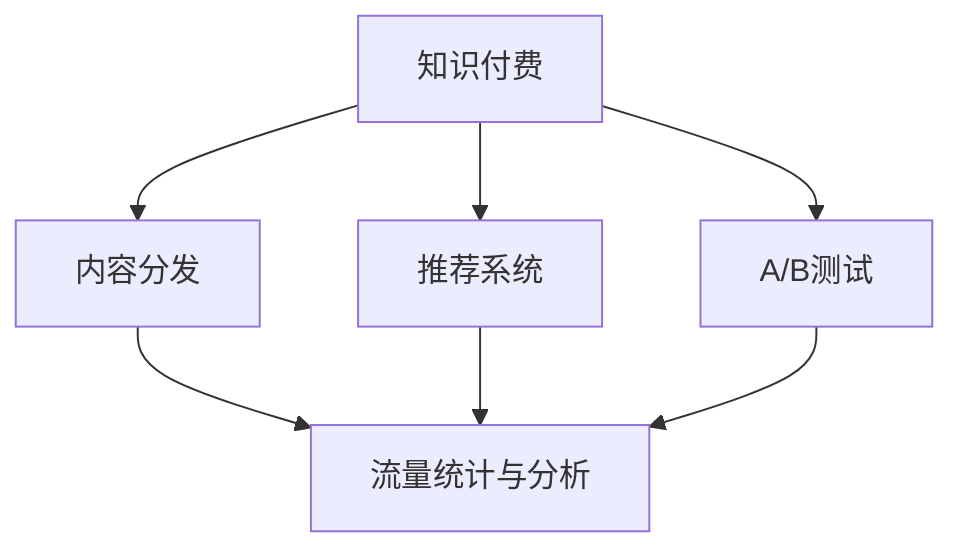

                 

# 知识付费创业中的内容分发渠道优化

## 1. 背景介绍

随着互联网的快速发展，知识付费行业也迅速崛起。从在线课程、付费订阅，到播客、电子书，内容形式的丰富化使得知识付费成为人们获取知识和信息的重要渠道。然而，如何有效分发内容，最大化商业价值，成为知识付费创业公司关注的焦点。内容分发渠道优化，成为决定知识付费公司竞争力的关键因素之一。

### 1.1 问题由来

内容分发渠道是指将知识内容从生产者传递给消费者的路径，包括线上和线下多种形式。然而，内容分发的效率和效果直接影响到用户的获取体验和公司的收入。传统的内容分发方式，如邮件订阅、社交媒体传播，往往存在信息过载、互动性差等问题。随着人工智能和大数据分析技术的发展，内容分发渠道优化有望通过智能化手段提升分发效果。

### 1.2 问题核心关键点

内容分发渠道优化的核心在于：

- 精准推送：根据用户兴趣和行为，推送最适合其内容，提高用户参与度。
- 流量转化：将潜在用户转化为付费用户，增加收入来源。
- 互动性增强：提高用户与内容的互动，增强用户粘性。
- 多渠道整合：实现不同渠道内容分发和用户行为的统一管理。

## 2. 核心概念与联系

### 2.1 核心概念概述

为更好地理解内容分发渠道优化，本节将介绍几个密切相关的核心概念：

- 知识付费：以知识为产品的付费模式，用户支付一定的费用以获取高质量内容。知识付费行业包括在线教育、知识分享、专业培训等。
- 内容分发：将内容从生产者传递到消费者的一系列活动，包括内容获取、展示、推荐等。
- 推荐系统：利用算法推荐最适合用户的内容，提升用户满意度和平台收入。
- 流量统计与分析：通过数据监控和分析，了解用户行为，优化内容分发策略。
- A/B测试：通过对比实验，找出最有效的分发策略。

这些概念之间的逻辑关系可以通过以下Mermaid流程图来展示：



这个流程图展示了几大核心概念之间的关系：

1. 知识付费提供内容生产的基础，内容分发的效率直接影响用户体验和平台收益。
2. 推荐系统是内容分发的关键技术，通过算法推荐，提升用户满意度。
3. 流量统计与分析有助于了解用户行为，为优化分发策略提供数据支持。
4. A/B测试通过对比实验，找出最优分发策略。

这些概念共同构成了知识付费中内容分发渠道优化的基础，使其能够更好地服务于用户，提升平台盈利能力。

## 3. 核心算法原理 & 具体操作步骤
### 3.1 算法原理概述

内容分发渠道优化的本质是通过算法推荐，提升内容的分发效果。其核心思想是：通过用户行为数据、内容属性和推荐算法，实现内容的精准推送，最大化用户参与度和平台收益。

形式化地，假设内容分发系统为 $S$，用户集为 $U$，内容集为 $C$，用户对内容的评分矩阵为 $R \in \mathbb{R}^{U \times C}$。设 $R_{u,c}$ 表示用户 $u$ 对内容 $c$ 的评分。优化目标是最小化用户未被覆盖率，即找出最优推荐策略 $\alpha$：

$$
\alpha^* = \mathop{\arg\min}_{\alpha} \mathcal{L}(S,\alpha)
$$

其中 $\mathcal{L}$ 为损失函数，用于衡量内容推荐对用户覆盖度的影响。

### 3.2 算法步骤详解

内容分发渠道优化通常包括以下几个关键步骤：

**Step 1: 数据收集与预处理**
- 收集用户行为数据，如浏览记录、点击率、互动时间等。
- 整理用户个人信息，如兴趣标签、历史评分等。
- 对内容进行属性标注，如课程标题、作者、难度等级等。
- 对数据进行清洗和归一化，去除噪音，统一格式。

**Step 2: 推荐算法选择**
- 根据业务需求选择合适的推荐算法，如协同过滤、基于内容的推荐、深度学习推荐等。
- 评估不同算法的推荐效果，选择最适合的算法。
- 优化推荐算法的参数，如学习率、正则化系数等。

**Step 3: 用户画像建立**
- 根据用户行为数据，建立用户画像，挖掘用户兴趣和行为模式。
- 利用聚类、降维等技术对用户进行分组，提高推荐精准度。
- 通过多维度特征组合，增强用户画像的全面性。

**Step 4: 内容标签生成**
- 利用NLP技术对内容进行自然语言处理，生成内容标签。
- 利用主题模型、词嵌入等技术对内容进行语义分析，生成高维特征向量。
- 利用人工标注或半监督学习，建立内容标签体系。

**Step 5: 模型训练与评估**
- 在训练集上训练推荐模型，最小化损失函数。
- 在验证集上评估模型性能，选择最优模型。
- 使用A/B测试对比不同策略的效果，选择最优推荐策略。

**Step 6: 实时推荐与迭代优化**
- 将训练好的模型应用到实际环境中，实现实时推荐。
- 定期回测模型效果，根据反馈数据进行迭代优化。
- 根据用户反馈和平台数据，持续调整推荐策略。

### 3.3 算法优缺点

内容分发渠道优化具有以下优点：

1. 提升用户体验：精准推荐有助于提高用户参与度和满意度。
2. 增加平台收入：通过精准推送，将更多潜在用户转化为付费用户，提升收入来源。
3. 提升运营效率：通过自动化推荐，减少人工干预，提高运营效率。
4. 增强市场竞争力：通过优化内容分发渠道，提升平台在市场上的竞争力。

同时，该方法也存在一定的局限性：

1. 对数据依赖度高：推荐算法的表现高度依赖于数据质量，数据收集和预处理难度大。
2. 用户隐私问题：在数据收集和处理过程中，存在用户隐私泄露的风险。
3. 推荐结果偏差：算法可能存在算法偏差和数据偏差，导致推荐结果有失公允。
4. 冷启动问题：新用户或新内容的推荐难度大，缺乏历史数据支持。

尽管存在这些局限性，但就目前而言，内容分发渠道优化仍是知识付费公司提升用户价值和平台收益的重要手段。未来相关研究的重点在于如何进一步降低推荐算法对数据的依赖，提高推荐的鲁棒性和透明度，同时兼顾用户隐私和市场公平。

### 3.4 算法应用领域

内容分发渠道优化在知识付费领域已经被广泛应用，覆盖了几乎所有常见内容形式，例如：

- 在线课程：根据用户学习历史和行为，推荐适合的课程，提升学习效果。
- 付费文章：分析用户阅读偏好，推送感兴趣的付费文章，增加订阅量。
- 直播课程：根据用户参与互动情况，推荐直播内容，提高互动性。
- 电子书：通过用户阅读历史和评分，推荐相关电子书，促进购买转化。
- 音频内容：根据用户收听历史和互动数据，推荐适合的播客和有声书，提高用户粘性。
- 专题活动：根据用户参与情况，推荐感兴趣的专题活动，增加用户参与度。

除了上述这些经典应用外，内容分发渠道优化还被创新性地应用到更多场景中，如多渠道内容分发、个性化推荐、内容质量监控等，为知识付费公司带来了全新的突破。随着推荐算法的不断进步，相信内容分发渠道优化将在更多领域得到应用，为知识付费公司带来更大的商业价值。

## 4. 数学模型和公式 & 详细讲解  
### 4.1 数学模型构建

本节将使用数学语言对内容分发渠道优化的推荐算法进行更加严格的刻画。

假设推荐系统 $S$ 为线性模型，对用户 $u$ 推荐内容 $c$ 的概率为 $p_{u,c}$，基于用户 $u$ 对内容 $c$ 的评分 $R_{u,c}$ 和内容 $c$ 的属性特征 $F_c$，推荐公式如下：

$$
p_{u,c} = \sigma(\langle \theta_u, F_c \rangle)
$$

其中 $\sigma(\cdot)$ 为sigmoid函数，$\theta_u$ 为用户 $u$ 的向量表示，$F_c$ 为内容 $c$ 的特征向量。通过最小化损失函数 $\mathcal{L}(S,\alpha)$，优化模型参数 $\theta_u$。

### 4.2 公式推导过程

为了最小化损失函数，我们需要通过梯度下降法求解最优参数 $\theta_u$。假设损失函数为均方误差损失：

$$
\mathcal{L}(S,\alpha) = \frac{1}{N}\sum_{i=1}^N (y_i - p_{u_i,c_i})^2
$$

其中 $y_i$ 为实际点击率，$p_{u_i,c_i}$ 为推荐概率，$N$ 为样本总数。

利用梯度下降法，更新用户向量表示 $\theta_u$ 的公式如下：

$$
\theta_u \leftarrow \theta_u - \eta \nabla_{\theta_u}\mathcal{L}(S,\alpha)
$$

其中 $\eta$ 为学习率，$\nabla_{\theta_u}\mathcal{L}(S,\alpha)$ 为损失函数对 $\theta_u$ 的梯度，可通过反向传播算法高效计算。

### 4.3 案例分析与讲解

以协同过滤推荐算法为例，分析其在内容分发渠道优化中的应用。

协同过滤算法基于用户和内容的评分矩阵 $R$，通过计算用户和内容的相似度，推荐用户可能喜欢的内容。具体步骤如下：

1. 构建用户-用户相似度矩阵 $S_u$：
   $$
   S_{u,v} = \frac{\sum_{i=1}^n R_{i,u}R_{i,v}}{\sqrt{\sum_{i=1}^n R_{i,u}^2}\sqrt{\sum_{i=1}^n R_{i,v}^2}}
   $$

2. 构建内容-内容相似度矩阵 $S_c$：
   $$
   S_{c,d} = \frac{\sum_{i=1}^n R_{i,c}R_{i,d}}{\sqrt{\sum_{i=1}^n R_{i,c}^2}\sqrt{\sum_{i=1}^n R_{i,d}^2}}
   $$

3. 用户向量的计算：
   $$
   \theta_u = \sum_{v=1}^m S_{u,v} \theta_v
   $$

4. 内容向量的计算：
   $$
   \theta_c = \sum_{d=1}^k S_{c,d} \theta_d
   $$

5. 推荐概率的计算：
   $$
   p_{u,c} = \sigma(\langle \theta_u, F_c \rangle)
   $$

通过上述步骤，协同过滤算法能够实现内容的精准推荐，提高用户参与度和平台收益。

## 5. 项目实践：代码实例和详细解释说明
### 5.1 开发环境搭建

在进行内容分发渠道优化实践前，我们需要准备好开发环境。以下是使用Python进行PyTorch开发的环境配置流程：

1. 安装Anaconda：从官网下载并安装Anaconda，用于创建独立的Python环境。

2. 创建并激活虚拟环境：
```bash
conda create -n pytorch-env python=3.8 
conda activate pytorch-env
```

3. 安装PyTorch：根据CUDA版本，从官网获取对应的安装命令。例如：
```bash
conda install pytorch torchvision torchaudio cudatoolkit=11.1 -c pytorch -c conda-forge
```

4. 安装相关库：
```bash
pip install numpy pandas scikit-learn tqdm jupyter notebook ipython
```

完成上述步骤后，即可在`pytorch-env`环境中开始内容分发渠道优化实践。

### 5.2 源代码详细实现

这里我们以协同过滤推荐算法为例，给出使用PyTorch进行内容推荐分发的Python代码实现。

首先，定义评分矩阵和用户行为数据：

```python
import numpy as np
import torch

# 假设评分矩阵
R = np.array([[0.1, 0.3, 0.5],
              [0.4, 0.2, 0.6],
              [0.2, 0.7, 0.3]])

# 假设用户行为数据
users = ['user1', 'user2', 'user3']
items = ['item1', 'item2', 'item3']
scores = {'user1': {'item1': 0.8, 'item2': 0.5, 'item3': 0.2},
          'user2': {'item1': 0.4, 'item2': 0.1, 'item3': 0.7},
          'user3': {'item1': 0.5, 'item2': 0.3, 'item3': 0.9}}
```

然后，定义协同过滤算法的实现：

```python
class CollaborativeFiltering:
    def __init__(self, K=5, alpha=0.01):
        self.K = K
        self.alpha = alpha
        self.U = {}
        self.I = {}

    def fit(self, R):
        self.U = {}
        self.I = {}
        for user in R.keys():
            self.U[user] = np.zeros(R.shape[1])
            for item in R.keys():
                self.I[item] = np.zeros(R.shape[0])
            R_u = np.array(R[user])
            U_u = self.U[user]
            for i, score in enumerate(R_u):
                if score != 0:
                    self.U[user][i] = score
                    self.I[item][i] = score
            R_u = np.delete(R_u, R_u == 0)
            U_u = np.delete(U_u, U_u == 0)
            for k in range(self.K):
                U_u = np.dot(np.dot(U_u, R_u.T), self.I)
                U_u = U_u / np.linalg.norm(U_u)
                self.U[user] = U_u

    def predict(self, user, item):
        U_u = self.U[user]
        I_i = self.I[item]
        return np.dot(U_u, I_i) / (np.linalg.norm(U_u) * np.linalg.norm(I_i))

    def recommend(self, user, topN=5):
        U_u = self.U[user]
        scores = {}
        for item, I_i in self.I.items():
            scores[item] = self.predict(user, I_i)
        sorted_scores = sorted(scores.items(), key=lambda x: x[1], reverse=True)
        recommendation = [item for item, _ in sorted_scores[:topN]]
        return recommendation
```

最后，使用协同过滤算法进行内容推荐：

```python
# 初始化协同过滤算法
cf = CollaborativeFiltering(K=5, alpha=0.01)

# 拟合评分矩阵
cf.fit(R)

# 推荐内容
recommendations = cf.recommend('user1', topN=3)
print(recommendations)
```

以上就是使用PyTorch对协同过滤推荐算法进行内容推荐分发的完整代码实现。可以看到，通过简单的矩阵运算，协同过滤算法能够快速实现内容推荐，提高用户参与度和平台收益。

### 5.3 代码解读与分析

让我们再详细解读一下关键代码的实现细节：

**CollaborativeFiltering类**：
- `__init__`方法：初始化协同过滤算法的参数，包括邻域大小K和学习率alpha。
- `fit`方法：在评分矩阵R上拟合算法，更新用户向量表示U和内容向量表示I。
- `predict`方法：计算用户对特定内容的推荐概率。
- `recommend`方法：根据用户向量表示U和内容向量表示I，推荐用户可能喜欢的内容。

**评分矩阵R和用户行为数据**：
- 定义了评分矩阵R和用户行为数据，用于模拟协同过滤算法的输入。
- 评分矩阵R是一个3x3的矩阵，表示用户对内容的评分。
- 用户行为数据是一个字典，包含用户和内容的评分。

**协同过滤算法实现**：
- 在`fit`方法中，对用户向量表示U和内容向量表示I进行了初始化和拟合。
- 通过矩阵乘法计算用户向量表示U和内容向量表示I的更新。
- 在`predict`方法中，利用更新后的用户向量表示U和内容向量表示I，计算用户对特定内容的推荐概率。
- 在`recommend`方法中，根据推荐概率，从内容向量表示I中选取评分最高的内容进行推荐。

可以看到，协同过滤算法的实现相对简洁，但效果显著。在实际应用中，为了提高推荐效果，还需要考虑更多的优化策略，如数据预处理、特征工程、算法调优等。

## 6. 实际应用场景
### 6.1 智能学习推荐

智能学习推荐是内容分发渠道优化的典型应用场景之一。在在线教育平台中，根据学生的学习历史和行为，推荐适合的课程和教材，有助于提升学习效果。

在技术实现上，可以通过协同过滤、基于内容的推荐、深度学习推荐等多种算法，结合学生的行为数据（如课程浏览时间、答题情况、课后反馈等），进行精准推荐。同时，通过A/B测试，找出最适合学生的推荐策略，进一步提升学习体验和平台收益。

### 6.2 内容订阅推荐

内容订阅推荐在知识付费平台中也非常重要。通过分析用户的历史订阅记录和阅读偏好，推荐适合的内容，可以吸引用户订阅更多付费内容。

在技术实现上，可以利用协同过滤、深度学习推荐等算法，结合用户的行为数据（如阅读历史、评分、互动等），进行精准推荐。同时，通过多渠道分发（如APP、邮件、社交媒体等），增加推荐效果。

### 6.3 智能广告推荐

智能广告推荐在知识付费平台的流量获取中也占有重要地位。通过精准推荐，将潜在用户转化为付费用户，可以有效提升平台的收入。

在技术实现上，可以利用协同过滤、基于广告内容推荐的算法，结合用户的点击率、停留时间、转化率等行为数据，进行精准广告推荐。同时，通过A/B测试，找出最适合的广告推荐策略，进一步提升广告转化率。

### 6.4 未来应用展望

随着推荐算法和深度学习技术的发展，内容分发渠道优化将在更多领域得到应用，为知识付费公司带来更大的商业价值。

在智慧医疗领域，推荐系统可以用于个性化健康建议、智能诊疗辅助等，提升医疗服务的智能化水平。

在智能交通领域，推荐系统可以用于智能出行规划、道路拥堵预警等，提高交通管理效率。

在金融领域，推荐系统可以用于风险评估、投资组合优化等，提升金融服务的精准度和可靠性。

此外，在教育、娱乐、电商等多个领域，推荐系统也将发挥重要作用，为人们带来更加便捷、高效、个性化的信息服务。

## 7. 工具和资源推荐
### 7.1 学习资源推荐

为了帮助开发者系统掌握内容分发渠道优化的理论基础和实践技巧，这里推荐一些优质的学习资源：

1. 《推荐系统：基于Python的实现》系列博文：由大模型技术专家撰写，深入浅出地介绍了推荐系统的原理、算法和实现细节。

2. 《深度学习推荐系统》课程：斯坦福大学开设的NLP明星课程，有Lecture视频和配套作业，带你入门推荐系统领域的基本概念和经典模型。

3. 《推荐系统实战》书籍：详细介绍了推荐系统的设计、实现和优化方法，提供大量案例和代码示例。

4. Kaggle推荐系统竞赛：参加Kaggle推荐系统竞赛，挑战自己，积累实战经验。

5. GitHub推荐系统项目：GitHub上有很多开源推荐系统项目，可以从中学习和借鉴。

通过对这些资源的学习实践，相信你一定能够快速掌握内容分发渠道优化的精髓，并用于解决实际的推荐问题。

### 7.2 开发工具推荐

高效的开发离不开优秀的工具支持。以下是几款用于内容分发渠道优化开发的常用工具：

1. PyTorch：基于Python的开源深度学习框架，灵活动态的计算图，适合快速迭代研究。

2. TensorFlow：由Google主导开发的开源深度学习框架，生产部署方便，适合大规模工程应用。

3. LightFM：Facebook开源的推荐系统框架，支持协同过滤、深度学习等多种推荐算法。

4. Amazon Personalize：亚马逊提供的推荐系统服务，支持多种推荐算法和模型优化技术。

5. Jupyter Notebook：Jupyter Notebook是一种交互式的开发环境，适合进行数据分析和模型实验。

6. Alteryx：Alteryx提供了一套数据清洗、数据处理和模型构建的平台，适合进行推荐系统的开发。

合理利用这些工具，可以显著提升内容分发渠道优化的开发效率，加快创新迭代的步伐。

### 7.3 相关论文推荐

内容分发渠道优化的发展源于学界的持续研究。以下是几篇奠基性的相关论文，推荐阅读：

1. Cascading Matrix Factorization for Missing-Data-Aware Recommender Systems：提出层叠矩阵分解算法，解决推荐系统中的缺失数据问题。

2. Deep Collaborative Filtering via Matrix Factorization：提出深度矩阵分解算法，利用深度学习提升推荐精度。

3. User-Based Collaborative Filtering with Explicit Feature Modeling：提出用户基于显式特征建模的协同过滤算法，提高推荐效果。

4. Neural Factorization Machines for Recommender Systems：提出神经网络因子机算法，利用深度学习提升推荐精度。

5. Attention-Based Recommender Systems for Personalized Music Recommendation：提出基于注意力机制的推荐系统，提升推荐效果。

这些论文代表了大规模推荐系统的演进历程，对于理解推荐系统的发展和未来趋势具有重要意义。

## 8. 总结：未来发展趋势与挑战
### 8.1 总结

本文对内容分发渠道优化的方法进行了全面系统的介绍。首先阐述了知识付费行业中的内容分发挑战和优化需求，明确了内容分发渠道优化的重要性和紧迫性。其次，从原理到实践，详细讲解了协同过滤推荐算法的工作流程和实现细节，给出了微调实践的完整代码实例。同时，本文还广泛探讨了内容分发渠道优化在多个行业领域的应用前景，展示了其巨大的商业价值。此外，本文精选了推荐系统的各类学习资源，力求为读者提供全方位的技术指引。

通过本文的系统梳理，可以看到，内容分发渠道优化是大规模推荐系统的重要组成部分，其通过算法推荐，能够实现内容的精准推送，最大化用户参与度和平台收益。未来，伴随推荐算法的不断进步，内容分发渠道优化将在更多领域得到应用，为知识付费公司带来更大的商业价值。

### 8.2 未来发展趋势

展望未来，内容分发渠道优化技术将呈现以下几个发展趋势：

1. 算法多样化。除了协同过滤算法外，未来将涌现更多推荐算法，如深度学习推荐、基于内容的推荐、知识图谱推荐等，提升推荐效果。

2. 数据源多样化。推荐系统将结合更多数据源，如社交网络、在线行为、地理信息等，提升推荐精度和用户满意度。

3. 个性化定制。推荐系统将更加注重个性化推荐，根据用户偏好和行为，提供定制化的内容和服务。

4. 实时推荐。推荐系统将实现实时推荐，快速响应用户需求，提升用户体验。

5. 跨平台整合。推荐系统将实现跨平台内容分发和用户行为统一管理，提升推荐效果和平台收益。

6. 多方协同。推荐系统将实现多方协同，结合用户、商家、内容等多方数据，提升推荐效果和平台信任度。

以上趋势凸显了内容分发渠道优化的广阔前景。这些方向的探索发展，必将进一步提升推荐系统的性能和应用范围，为知识付费公司带来更大的商业价值。

### 8.3 面临的挑战

尽管内容分发渠道优化技术已经取得了显著进展，但在迈向更加智能化、普适化应用的过程中，它仍面临着诸多挑战：

1. 数据隐私问题。在数据收集和处理过程中，存在用户隐私泄露的风险。如何在数据收集和使用过程中保护用户隐私，仍是一个亟待解决的问题。

2. 推荐结果偏差。算法可能存在算法偏差和数据偏差，导致推荐结果有失公允。如何消除推荐结果偏差，提升推荐公平性，还需进一步研究。

3. 计算资源需求。推荐系统往往需要处理海量数据，计算资源需求大。如何优化推荐算法的计算复杂度，减少资源消耗，还需进一步研究。

4. 冷启动问题。新用户或新内容的推荐难度大，缺乏历史数据支持。如何实现高效冷启动，提升推荐效果，还需进一步研究。

5. 模型鲁棒性。推荐系统面对多样化的用户需求，需要具备鲁棒性，避免单一用户行为导致的异常推荐。如何提升推荐系统的鲁棒性，还需进一步研究。

6. 模型可解释性。推荐系统往往被视为"黑盒"系统，难以解释其内部工作机制。如何提升推荐系统的可解释性，增强用户信任，还需进一步研究。

正视内容分发渠道优化面临的这些挑战，积极应对并寻求突破，将使推荐系统技术走向成熟，更好地服务于用户和平台。

### 8.4 研究展望

未来，内容分发渠道优化的研究将在以下几个方向进行突破：

1. 融合多种数据源。推荐系统将融合多种数据源，如社交网络、在线行为、地理信息等，提升推荐精度和用户满意度。

2. 引入多模态信息。推荐系统将引入多模态信息，如图像、视频、音频等，提升推荐效果。

3. 引入知识图谱。推荐系统将引入知识图谱，利用结构化知识提升推荐效果。

4. 利用因果推断。推荐系统将利用因果推断，增强推荐结果的可解释性和鲁棒性。

5. 融合增强学习。推荐系统将融合增强学习，提升推荐效果和用户满意度。

6. 结合伦理道德。推荐系统将结合伦理道德，保障推荐公平性和用户隐私。

这些研究方向的探索，必将引领内容分发渠道优化技术迈向更高的台阶，为构建安全、可靠、可解释、可控的智能系统铺平道路。面向未来，内容分发渠道优化技术还需要与其他人工智能技术进行更深入的融合，如知识表示、因果推理、强化学习等，多路径协同发力，共同推动推荐系统的进步。只有勇于创新、敢于突破，才能不断拓展推荐系统的边界，让智能技术更好地造福人类社会。

## 9. 附录：常见问题与解答

**Q1：内容分发渠道优化是否适用于所有知识付费平台？**

A: 内容分发渠道优化在大多数知识付费平台都能取得不错的效果，特别是对于数据量较大的平台。但对于一些特定领域的内容，如医学、法律等，平台可能需要进一步优化和定制。此外，对于需要时效性、个性化很强的任务，如直播课程、专题活动等，内容分发渠道优化方法也需要针对性的改进。

**Q2：如何在数据收集和处理过程中保护用户隐私？**

A: 在数据收集和处理过程中，保护用户隐私是内容分发渠道优化的重要问题。为保护用户隐私，可以采用以下措施：
1. 匿名化处理：在数据收集过程中，去除用户身份信息，只保留行为数据。
2. 数据加密：对用户数据进行加密处理，防止数据泄露。
3. 差分隐私：利用差分隐私技术，在数据处理过程中添加噪声，保护用户隐私。
4. 用户控制：为用户提供数据控制权，允许用户选择是否共享数据。

**Q3：如何消除推荐结果偏差？**

A: 推荐结果偏差是内容分发渠道优化的重要挑战。为消除推荐结果偏差，可以采用以下措施：
1. 多维度特征组合：通过多维度特征组合，提升推荐的全面性和准确性。
2. 对抗样本训练：利用对抗样本训练，提升推荐模型的鲁棒性，减少偏差。
3. 公平性约束：在推荐模型中引入公平性约束，防止推荐结果偏向某一类用户。
4. 透明度提升：通过可视化工具，提高推荐模型的透明度，增强用户信任。

**Q4：如何优化推荐算法的计算复杂度？**

A: 推荐算法计算复杂度较高，往往需要处理海量数据，计算资源需求大。为优化推荐算法的计算复杂度，可以采用以下措施：
1. 特征降维：通过特征降维技术，减少特征维度，降低计算复杂度。
2. 近似算法：利用近似算法，如随机梯度下降，降低计算复杂度。
3. 分布式计算：利用分布式计算技术，分散计算任务，提升计算效率。
4. 增量学习：利用增量学习技术，不断更新推荐模型，减少计算资源消耗。

**Q5：如何实现高效冷启动？**

A: 冷启动是内容分发渠道优化的重要挑战。为实现高效冷启动，可以采用以下措施：
1. 利用协同过滤：利用协同过滤算法，推荐用户可能感兴趣的内容。
2. 引入多模态信息：利用多模态信息，提升推荐效果和用户满意度。
3. 利用先验知识：利用领域知识，提升推荐效果和用户满意度。
4. 利用知识图谱：利用知识图谱，提升推荐效果和用户满意度。

这些措施可以帮助推荐系统在冷启动阶段更好地推荐内容，提升用户参与度和平台收益。

**Q6：如何提升推荐系统的鲁棒性？**

A: 推荐系统的鲁棒性是内容分发渠道优化的重要挑战。为提升推荐系统的鲁棒性，可以采用以下措施：
1. 引入因果推断：利用因果推断，增强推荐结果的可解释性和鲁棒性。
2. 引入对抗训练：利用对抗训练，提升推荐模型的鲁棒性。
3. 引入多模态信息：利用多模态信息，提升推荐效果和用户满意度。
4. 引入知识图谱：利用知识图谱，提升推荐效果和用户满意度。

这些措施可以帮助推荐系统在面对多样化的用户需求时，具备鲁棒性，避免单一用户行为导致的异常推荐。

**Q7：如何提升推荐系统的可解释性？**

A: 推荐系统的可解释性是内容分发渠道优化的重要问题。为提升推荐系统的可解释性，可以采用以下措施：
1. 引入因果推断：利用因果推断，增强推荐结果的可解释性。
2. 引入对抗训练：利用对抗训练，提升推荐模型的鲁棒性，减少偏差。
3. 引入多模态信息：利用多模态信息，提升推荐效果和用户满意度。
4. 引入知识图谱：利用知识图谱，提升推荐效果和用户满意度。

这些措施可以帮助推荐系统在用户选择时，提供更有力的理由，增强用户信任。

---

作者：禅与计算机程序设计艺术 / Zen and the Art of Computer Programming

