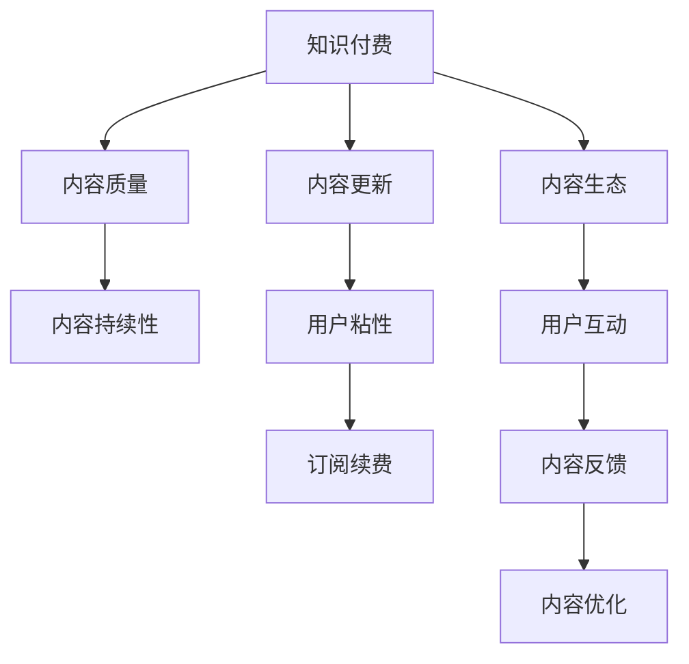

                 

# 知识付费创业中的内容更新策略

## 1. 背景介绍

### 1.1 问题由来

知识付费作为近年来迅速崛起的新型商业模式，吸引了大量创业者和投资者的关注。然而，与传统内容创业相比，知识付费产品的内容更新策略更为复杂。首先，知识付费的内容往往涉及专业知识，更新需要谨慎对待，避免误导用户。其次，用户期望获取持续的优质内容，内容的持续性管理成为难题。最后，知识付费的盈利模式以订阅制为主，用户付费的持续性依赖于内容的更新质量和时效性。

本文聚焦于知识付费创业中的内容更新策略，旨在帮助创业者构建可持续的优质内容生态，提升用户满意度和订阅续费率，实现长期盈利。

### 1.2 问题核心关键点

知识付费内容更新策略的核心在于：

1. **内容质量保证**：确保更新内容的质量，避免误导用户。
2. **内容持续性**：保证内容的持续更新，满足用户需求。
3. **用户粘性提升**：通过内容更新策略提升用户粘性，增加订阅续费率。

### 1.3 问题研究意义

构建高效的内容更新策略，对于提升知识付费产品的竞争力、实现用户增长和盈利具有重要意义：

1. **提升用户体验**：高质量、及时更新的内容能提升用户的满意度和留存率。
2. **增加订阅续费**：通过持续的优质内容输出，增加用户续费的可能性。
3. **拓展市场份额**：优质内容能够吸引更多潜在用户，提高市场占有率。
4. **优化盈利模式**：不断更新的内容有助于构建稳定的订阅用户群，增加收入来源。

## 2. 核心概念与联系

### 2.1 核心概念概述

为更好地理解知识付费内容更新策略，本节将介绍几个密切相关的核心概念：

- **知识付费**：用户为获取专业知识或技能而支付费用的商业模式，包括在线课程、专业文章、音频讲座等形式。
- **内容生态**：基于内容的商业模式形成的用户生态系统，包括内容创作者、平台、用户等。
- **内容质量**：指内容的专业性、准确性和实用性，直接影响到用户的满意度和留存率。
- **内容更新**：指对已发布内容进行定期或不定期的修订、补充和优化。
- **用户粘性**：指用户对平台的忠诚度和使用频率，通过高质量内容保持。

这些核心概念之间的逻辑关系可以通过以下Mermaid流程图来展示：



这个流程图展示的知识付费生态系统中，核心在于内容质量和持续性，直接影响到用户粘性和续费率，而内容更新和优化又是保证内容质量的必要手段。

## 3. 核心算法原理 & 具体操作步骤

### 3.1 算法原理概述

知识付费内容更新策略，本质上是一种基于用户反馈和数据分析的动态内容管理过程。其核心思想是：通过持续收集用户反馈和分析内容数据，动态调整内容更新策略，确保内容生态的健康发展和用户满意度的提升。

形式化地，假设知识付费平台的内容库为 $C=\{c_i\}_{i=1}^N$，其中 $c_i$ 为第 $i$ 条内容，用户反馈为 $U=\{(u_i,f_i)\}_{i=1}^M$，其中 $u_i$ 为第 $i$ 位用户，$f_i$ 为该用户对 $c_i$ 的评分和评价。内容更新目标为最大化用户满意度，即：

$$
\max_{c_i} \sum_{u_i} \frac{f_i}{|C|} = \sum_{i=1}^M \frac{f_i}{N}
$$

其中 $f_i$ 为第 $i$ 位用户对内容 $c_i$ 的评分。内容更新策略需要根据用户评分、内容时效性、知识领域等多个因素进行综合评估和调整。

### 3.2 算法步骤详解

知识付费内容更新策略主要包括以下几个关键步骤：

**Step 1: 内容质量评估**

- 定期收集用户对内容的评分和评价。
- 根据评分和评价分布，评估内容的质量和用户满意度。
- 对质量较低的、用户评价差的内容进行标记，准备进一步的优化或删除。

**Step 2: 用户需求分析**

- 分析用户的搜索历史、阅读记录和互动反馈，了解用户对不同类型、难度和风格内容的偏好。
- 结合热门话题和趋势，制定内容更新计划。

**Step 3: 内容选题策划**

- 根据用户需求和市场趋势，策划高质量的更新内容。
- 设计有吸引力的标题和摘要，增加用户点击率。

**Step 4: 内容制作与发布**

- 根据选题策划，制作高质量的内容，包括文字、音频、视频等多种形式。
- 发布内容到平台，确保内容的及时性和可见性。

**Step 5: 内容反馈与优化**

- 定期收集用户对新内容的反馈。
- 根据反馈调整更新策略，改进内容质量。
- 对表现不佳的内容进行回删或优化，避免误导用户。

**Step 6: 内容迭代与再发布**

- 对已发布内容进行定期迭代和优化，确保内容的持续更新。
- 在重要时间节点或特定主题下，重新发布优化后的内容，吸引用户关注。

### 3.3 算法优缺点

知识付费内容更新策略具有以下优点：

1. **提高用户满意度**：通过不断更新和优化内容，满足用户对知识的需求，提升用户满意度。
2. **增加用户粘性**：高质量的持续内容输出，能增加用户对平台的粘性，降低流失率。
3. **优化订阅续费**：持续的优质内容输出，能吸引更多用户续费，提升收入。

同时，该方法也存在一定的局限性：

1. **内容生产成本高**：高质量内容的制作和优化成本较高，且需要大量人力物力。
2. **用户需求多样**：用户需求复杂多样，内容更新策略难以全面覆盖。
3. **市场风险大**：市场变化快，内容更新策略可能滞后于市场需求。
4. **内容质量参差不齐**：低质量内容的误导性可能降低用户满意度，甚至影响品牌信誉。

尽管存在这些局限性，但就目前而言，基于用户反馈和数据分析的内容更新策略仍是知识付费内容管理的主流范式。未来相关研究的重点在于如何进一步降低内容生产成本，提高内容更新效率，同时兼顾内容质量和多样性等因素。

### 3.4 算法应用领域

知识付费内容更新策略在教育、金融、健康、技术等多个领域均得到了广泛的应用，覆盖了在线课程、专业文章、音频讲座、视频教程等多种形式。

1. **在线教育**：教育平台如Coursera、Udacity等，通过定期更新课程内容和教师讲座，吸引用户持续订阅和续费。
2. **金融资讯**：金融新闻平台如Bloomberg、华尔街见闻等，通过实时更新财经新闻和分析文章，提供专业金融知识和市场动态。
3. **健康管理**：健康管理应用如Fitbit、MyFitnessPal等，通过发布营养、运动、健康管理等内容，满足用户对健康知识的需求。
4. **技术开发**：技术博客如Medium、Stack Overflow等，通过发布技术教程、编程指南、工具评测等内容，提升开发者技能。

除了上述这些经典应用外，知识付费内容更新策略还被创新性地应用到更多场景中，如职场发展、兴趣爱好、艺术修养等，为不同用户提供了个性化的知识服务。

## 4. 数学模型和公式 & 详细讲解 & 举例说明

### 4.1 数学模型构建

本节将使用数学语言对知识付费内容更新策略进行更加严格的刻画。

假设知识付费平台的内容库为 $C=\{c_i\}_{i=1}^N$，其中 $c_i$ 为第 $i$ 条内容，用户反馈为 $U=\{(u_i,f_i)\}_{i=1}^M$，其中 $u_i$ 为第 $i$ 位用户，$f_i$ 为该用户对 $c_i$ 的评分和评价。

定义内容 $c_i$ 的用户满意度为：

$$
S_i = \frac{1}{N} \sum_{u_i} f_i
$$

其中 $f_i$ 为第 $i$ 位用户对内容 $c_i$ 的评分。

内容更新目标为最大化用户满意度，即：

$$
\max_{c_i} \sum_{i=1}^M S_i
$$

在实践中，我们通常使用基于梯度的优化算法（如SGD、Adam等）来近似求解上述最优化问题。设 $\eta$ 为学习率，$\lambda$ 为正则化系数，则参数的更新公式为：

$$
c_i \leftarrow c_i - \eta \nabla_{c_i} \sum_{i=1}^M S_i - \eta\lambda c_i
$$

其中 $\nabla_{c_i} \sum_{i=1}^M S_i$ 为内容用户满意度的梯度，可通过反向传播算法高效计算。

### 4.2 公式推导过程

以下我们以教育平台课程内容更新为例，推导用户满意度的计算公式及其梯度的计算公式。

假设教育平台用户评价课程内容 $c_i$ 的平均评分为 $S_i$，课程内容为 $C$，学生总数为 $N$，学生对课程的评价为 $F$。

课程用户满意度的计算公式为：

$$
S_i = \frac{1}{N} \sum_{F} f_i
$$

其中 $f_i$ 为第 $i$ 位学生对课程 $c_i$ 的评分。

根据链式法则，内容用户满意度的梯度为：

$$
\nabla_{c_i} \sum_{i=1}^M S_i = \nabla_{c_i} \sum_{i=1}^M \frac{1}{N} \sum_{F} f_i = \frac{1}{N} \sum_{F} \nabla_{c_i} f_i
$$

其中 $\nabla_{c_i} f_i$ 可进一步递归展开，利用自动微分技术完成计算。

在得到用户满意度的梯度后，即可带入参数更新公式，完成内容的迭代优化。重复上述过程直至收敛，最终得到适应用户需求的内容更新方案。

## 5. 项目实践：代码实例和详细解释说明

### 5.1 开发环境搭建

在进行知识付费内容更新实践前，我们需要准备好开发环境。以下是使用Python进行开发的环境配置流程：

1. 安装Anaconda：从官网下载并安装Anaconda，用于创建独立的Python环境。

2. 创建并激活虚拟环境：
```bash
conda create -n pay-content python=3.8 
conda activate pay-content
```

3. 安装相关库：
```bash
pip install numpy pandas scikit-learn scikit-image opencv-python flask
```

4. 安装Flask框架：
```bash
pip install flask
```

完成上述步骤后，即可在`pay-content`环境中开始知识付费内容更新实践。

### 5.2 源代码详细实现

这里我们以一个简单的在线教育平台为例，展示如何实现知识付费内容更新策略。

首先，定义内容质量评估函数：

```python
from sklearn.metrics import accuracy_score
from sklearn.linear_model import LogisticRegression
from sklearn.feature_extraction.text import TfidfVectorizer

def evaluate_content_quality(content, feedback):
    vectorizer = TfidfVectorizer()
    X = vectorizer.fit_transform(content)
    y = vectorizer.transform(feedback)
    clf = LogisticRegression()
    clf.fit(X, y)
    return accuracy_score(clf.predict(X), y)
```

然后，定义用户需求分析函数：

```python
from collections import Counter

def analyze_user_demand(user_interactions):
    topics = Counter()
    for interaction in user_interactions:
        topics[interaction.topic] += 1
    return topics.most_common(10)
```

接着，定义内容选题策划函数：

```python
def plan_content_update(current_content, user_demand, market_trends):
    plan = {}
    for topic, demand in user_demand.items():
        plan[topic] = {}
        for content in current_content:
            if topic in content.tags:
                plan[topic][content.id] = content.quality
    return plan
```

最后，定义内容制作与发布函数：

```python
def create_content(plan, content_provider):
    for topic, content in plan.items():
        for id, quality in content.items():
            content = content_provider.create_content(id, topic)
            content.quality = quality
            content_provider.publish_content(content)
```

### 5.3 代码解读与分析

让我们再详细解读一下关键代码的实现细节：

**evaluate_content_quality函数**：
- 使用TF-IDF向量化和逻辑回归模型评估内容的文本质量。
- 根据反馈文本和内容文本的TF-IDF向量和标签，训练逻辑回归模型，并计算准确率。

**analyze_user_demand函数**：
- 通过统计用户互动中的热门话题，了解用户对不同内容的偏好。
- 返回最热门的前10个话题。

**plan_content_update函数**：
- 根据用户需求和内容质量，规划内容更新计划。
- 对每个主题，列出需要更新的内容。

**create_content函数**：
- 根据内容更新计划，创建高质量内容。
- 使用内容提供商提供的API创建内容，并设置质量评分。
- 发布内容到平台。

在实际应用中，这些函数需要根据具体平台和需求进行改进和扩展，以实现更精细化、个性化的内容更新策略。

## 6. 实际应用场景

### 6.1 在线教育

在线教育平台如Coursera、Udacity等，通过定期更新课程内容和教师讲座，吸引用户持续订阅和续费。平台利用用户反馈和数据分析，调整课程内容和形式，提升用户满意度和参与度。例如，Coursera会根据用户的学习进度和反馈，调整课程难度和内容，增加实践作业和互动环节，提升学习效果。

### 6.2 金融资讯

金融新闻平台如Bloomberg、华尔街见闻等，通过实时更新财经新闻和分析文章，提供专业金融知识和市场动态。平台根据市场热点和用户兴趣，推送相关内容，满足用户对金融知识的深度需求。例如，Bloomberg会在重大经济事件发生时，发布深度解析文章和市场预测，吸引用户关注。

### 6.3 健康管理

健康管理应用如Fitbit、MyFitnessPal等，通过发布营养、运动、健康管理等内容，满足用户对健康知识的需求。平台利用用户健康数据和反馈，定期更新健康建议和计划，提升用户健康水平。例如，Fitbit会根据用户的运动数据和健康目标，推送个性化的运动建议和饮食方案。

### 6.4 未来应用展望

随着知识付费内容和用户体验的不断提升，未来知识付费产品将展现出更加多样化的应用场景和创新模式。

1. **个性化推荐**：通过用户行为数据和反馈，提供个性化的内容推荐，提升用户满意度和留存率。例如，通过分析用户浏览历史和互动行为，推荐相关课程和文章。
2. **实时互动**：利用AI技术，增加实时互动功能，如在线问答、直播讲解等，提升用户体验。例如，通过视频直播与讲师互动，提升用户参与感和满意度。
3. **社区建设**：构建用户社区，促进用户之间的交流和协作，提升用户粘性。例如，通过建立用户论坛和讨论区，增加用户互动和反馈。
4. **跨平台整合**：实现跨平台内容整合，提升用户跨设备的无缝体验。例如，通过App、网站和社交媒体的整合，提供统一的用户体验。

## 7. 工具和资源推荐

### 7.1 学习资源推荐

为了帮助开发者系统掌握知识付费内容更新策略的理论基础和实践技巧，这里推荐一些优质的学习资源：

1. **《内容营销与运营》**：系统介绍内容营销的理论和实践，包括内容策略、内容策划和内容管理等。
2. **《用户体验设计》**：讲解如何设计优秀的用户体验，提升用户满意度和留存率。
3. **《数字营销》**：涵盖数字营销的各个方面，包括SEO、SEM、社交媒体营销等。
4. **《数据分析与挖掘》**：介绍数据分析的基本方法和工具，包括数据收集、数据处理和数据可视化等。
5. **《机器学习与数据科学》**：讲解机器学习的基础知识和应用，包括分类、聚类、回归等算法。

通过对这些资源的学习实践，相信你一定能够快速掌握知识付费内容更新策略的精髓，并用于解决实际的用户需求。

### 7.2 开发工具推荐

高效的开发离不开优秀的工具支持。以下是几款用于知识付费内容更新开发的常用工具：

1. **Flask**：轻量级的Python Web框架，简单易用，适合快速开发Web应用。
2. **Django**：功能强大的Python Web框架，提供丰富的内置工具和扩展，适合大规模应用开发。
3. **Jupyter Notebook**：交互式的开发环境，支持多种编程语言和数据处理工具，适合数据分析和模型训练。
4. **Tableau**：数据可视化工具，支持多种数据源和图表类型，适合数据探索和报告生成。
5. **Google Analytics**：网站流量和用户行为分析工具，帮助理解用户需求和行为，优化内容策略。

合理利用这些工具，可以显著提升知识付费内容更新任务的开发效率，加快创新迭代的步伐。

### 7.3 相关论文推荐

知识付费内容更新策略的研究涉及内容推荐、用户行为分析、数据挖掘等多个领域，以下是几篇奠基性的相关论文，推荐阅读：

1. **《推荐系统》**：由斯坦福大学Dawson Kihm和Shim Seung-ilk编写，全面介绍推荐系统的工作原理和实现方法。
2. **《用户行为分析》**：由Rolf-Heiner Wolter和Kristin Sala等编写，讲解用户行为分析和预测的基本方法。
3. **《数据挖掘》**：由Jerry Kettenring和Cecilia E. Westover编写，涵盖数据挖掘的基础知识和应用。
4. **《内容推荐系统》**：由Ian Murfin和Kenneth Webster编写，讲解内容推荐系统的设计和实现。
5. **《个性化推荐系统》**：由D. Shen和J. Y. C. Smith编写，介绍个性化推荐系统的基本原理和算法。

这些论文代表了大语言模型微调技术的发展脉络。通过学习这些前沿成果，可以帮助研究者把握学科前进方向，激发更多的创新灵感。

## 8. 总结：未来发展趋势与挑战

### 8.1 总结

本文对知识付费创业中的内容更新策略进行了全面系统的介绍。首先阐述了知识付费内容更新策略的研究背景和意义，明确了内容更新策略在提升用户满意度和订阅续费率方面的独特价值。其次，从原理到实践，详细讲解了内容更新策略的数学模型和核心算法，给出了内容更新任务开发的完整代码实例。同时，本文还广泛探讨了内容更新策略在在线教育、金融资讯、健康管理等多个行业领域的应用前景，展示了内容更新范式的巨大潜力。最后，本文精选了内容更新策略的各类学习资源，力求为读者提供全方位的技术指引。

通过本文的系统梳理，可以看到，知识付费内容更新策略在知识付费产品中扮演着至关重要的角色。高质量、及时更新的内容能显著提升用户满意度和留存率，为知识付费产品带来持续的用户增长和收入。未来，伴随内容更新策略的不断优化和创新，知识付费产品必将在更多领域大放异彩，推动教育、金融、健康等行业的数字化转型。

### 8.2 未来发展趋势

展望未来，知识付费内容更新策略将呈现以下几个发展趋势：

1. **个性化推荐系统**：通过深度学习和自然语言处理技术，提供更加个性化的内容推荐，提升用户体验和留存率。
2. **实时互动功能**：利用AI和VR技术，增加实时互动功能，提升用户参与感和满意度。
3. **数据驱动的内容管理**：利用大数据分析和机器学习技术，实现内容质量的量化评估和优化。
4. **用户生成内容（UGC）**：鼓励用户生成内容，提升用户参与度和粘性。
5. **跨平台整合**：实现内容在多个平台之间的无缝整合，提升用户跨设备的体验。
6. **社交化内容更新**：利用社交网络数据，增加内容更新的社交属性，提升用户互动和分享。

以上趋势凸显了知识付费内容更新策略的未来发展方向。这些方向的探索发展，必将进一步提升知识付费产品的用户体验和留存率，为知识付费产业带来新的突破和机遇。

### 8.3 面临的挑战

尽管知识付费内容更新策略已经取得了一定的成效，但在迈向更加智能化、普适化应用的过程中，仍面临诸多挑战：

1. **内容生产成本高**：高质量内容的制作和优化成本较高，且需要大量人力物力。
2. **用户需求多样**：用户需求复杂多样，内容更新策略难以全面覆盖。
3. **市场风险大**：市场变化快，内容更新策略可能滞后于市场需求。
4. **内容质量参差不齐**：低质量内容的误导性可能降低用户满意度，甚至影响品牌信誉。
5. **用户粘性不足**：如何通过内容更新提升用户粘性，保持用户活跃度，是一个长期挑战。

尽管存在这些挑战，但通过不断优化内容更新策略，结合用户反馈和数据分析，知识付费产品仍有望实现用户满意度和订阅续费率的持续提升，成为知识付费领域的领先者。

### 8.4 研究展望

未来的研究需要在以下几个方面寻求新的突破：

1. **个性化推荐算法**：进一步优化个性化推荐算法，提升推荐的精准度和多样性。
2. **实时互动技术**：探索更先进的实时互动技术，提升用户的参与感和互动体验。
3. **数据驱动的内容管理**：开发更高效的数据驱动内容管理方法，提升内容质量评估和优化的效率。
4. **用户生成内容（UGC）**：鼓励用户生成内容，提升用户参与度和内容多样性。
5. **跨平台整合**：实现跨平台内容整合，提升用户跨设备的无缝体验。
6. **社交化内容更新**：利用社交网络数据，增加内容更新的社交属性，提升用户互动和分享。

这些研究方向的探索，必将引领知识付费内容更新策略走向更高的台阶，为知识付费产业带来新的突破和机遇。相信随着技术的发展和应用的深入，知识付费产品必将在更多领域大放异彩，推动知识付费产业的持续繁荣。

## 9. 附录：常见问题与解答

**Q1：知识付费内容更新策略是否适用于所有内容形式？**

A: 知识付费内容更新策略对文字、视频、音频等多种形式的内容均适用。对于不同形式的内容，具体的更新策略可能有所不同，但核心思想和步骤是一致的。例如，视频内容需要考虑用户观看时长、互动次数等，文本内容需要考虑用户阅读深度、反馈评分等。

**Q2：如何评估内容质量？**

A: 内容质量的评估可以通过用户评分、专家评价、文本分析等多种方式进行。例如，使用TF-IDF等文本分析工具对内容进行文本质量评估，通过专家对内容的打分来评估专业性，通过用户评分来评估实用性和受欢迎程度。

**Q3：内容更新策略是否适用于所有用户？**

A: 内容更新策略需要针对不同用户群体进行个性化调整。例如，针对技术类用户，可以发布更多技术深度文章和视频教程；针对兴趣类用户，可以发布更多相关主题的内容，如音乐、旅行等。通过分析用户行为数据，制定针对性的内容更新策略，提升用户满意度和留存率。

**Q4：如何处理低质量内容？**

A: 对于低质量内容，可以采取以下措施进行处理：
1. 删除内容：对于明显误导性、低质量的内容，直接删除。
2. 修改内容：对于有价值但质量低的内容，修改和优化其内容，提升用户满意度。
3. 标记内容：对于一些有争议或质量参差不齐的内容，标注为待优化状态，定期进行回删和优化。

**Q5：如何提升内容更新效率？**

A: 提升内容更新效率可以从以下几个方面入手：
1. 自动化内容生成：利用AI技术自动生成高质量内容，减少人工干预。
2. 跨团队协作：建立内容更新团队，分工合作，提升内容更新效率。
3. 内容库管理：建立内容库管理系统，优化内容管理和检索，提升内容更新效率。

这些措施可以显著提升内容更新效率，同时保证内容质量。

---

作者：禅与计算机程序设计艺术 / Zen and the Art of Computer Programming

