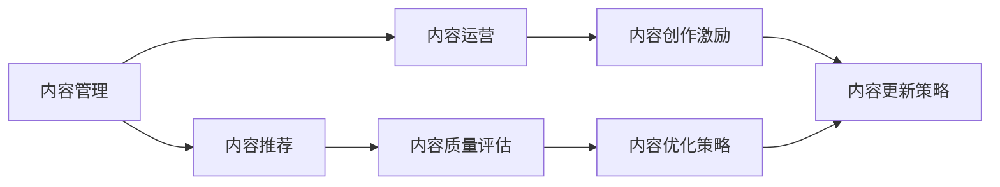

                 

# 知识付费创业中的内容更新策略

在知识付费领域，内容是王道。持续不断地提供优质内容，是知识付费平台保持竞争力的关键。但仅仅拥有优质内容并不足够，如何高效地进行内容更新，才能让内容价值最大化，更好地满足用户需求，实现商业变现。本文将从内容更新策略的各个环节进行详细探讨，为知识付费创业提供全面的技术指导。

## 1. 背景介绍

### 1.1 问题由来
知识付费作为近年来兴起的新型商业模式，凭借其快速增长的用户规模和显著的商业价值，成为互联网行业的热点领域。各大平台纷纷发力，竞争日趋激烈。但高增长的同时，内容更新效率和质量的不足，成为制约平台发展的瓶颈。

具体问题表现为：
- 内容迭代周期过长，难以及时满足用户需求。
- 内容更新缺乏系统规划，容易形成内容断档或重复。
- 内容更新成本高，难以实现规模化运营。

### 1.2 问题核心关键点
内容更新效率和质量，是知识付费创业成功的关键。以下三个维度是内容更新策略的核心关键点：

- **内容管理效率**：如何高效管理内容素材，及时发现、创作、更新内容。
- **内容优化策略**：通过数据分析，识别出高价值、高需求的内容，并采取针对性的优化措施。
- **内容运营机制**：建立科学的内容更新机制，确保内容更新的持续性和一致性。

只有在这三个维度上下功夫，才能真正实现内容的高效更新，提升平台的用户黏性和商业价值。

## 2. 核心概念与联系

### 2.1 核心概念概述

为了更好地理解内容更新策略，本节将介绍几个密切相关的核心概念：

- **内容管理（Content Management）**：通过系统化的方法管理内容素材，包括内容的收集、整理、存储、分类、更新等环节。
- **内容推荐（Content Recommendation）**：通过算法模型，分析用户行为和内容属性，推荐用户最感兴趣的内容。
- **内容运营（Content Operation）**：建立科学的内容运营机制，确保内容更新和推广的持续性和一致性。
- **内容质量评估（Content Quality Assessment）**：通过用户行为和反馈数据，对内容质量进行评估，引导内容创作的优化方向。
- **内容创作激励（Content Creation Incentive）**：设计合理的激励机制，鼓励创作者持续创作高质量的内容。

这些核心概念之间存在紧密的联系，共同构成内容更新的完整流程。通过综合运用这些概念，可以实现高效的内容更新和运营，提升平台的竞争力。

### 2.2 核心概念原理和架构的 Mermaid 流程图(Mermaid 流程节点中不要有括号、逗号等特殊字符)



这个流程图展示了内容更新策略中各环节的相互关系：

1. 内容管理提供内容素材和数据支撑，通过内容推荐和内容运营环节，将内容精准推送给用户。
2. 内容推荐和内容运营环节将用户行为和内容质量数据反馈给内容管理，作为内容优化和创作激励的依据。
3. 内容优化策略通过数据分析，识别出高价值内容，并指导内容创作和运营策略。
4. 内容创作激励和内容更新策略确保内容创作者获得合理报酬，同时更新策略指导内容更新方向和频率。

## 3. 核心算法原理 & 具体操作步骤

### 3.1 算法原理概述

内容更新策略的核心算法原理，主要包括内容推荐、内容优化、内容运营和内容质量评估四个环节。以下将详细介绍这些算法的原理和具体操作步骤。

### 3.2 算法步骤详解

#### 3.2.1 内容推荐算法

内容推荐算法的主要目标是，通过分析用户行为和内容属性，推荐用户最感兴趣的内容。常用的内容推荐算法包括协同过滤、基于内容的推荐、矩阵分解等方法。

**协同过滤算法**：基于用户之间的相似性和物品之间的相似性，推荐用户可能感兴趣的内容。具体步骤包括：
1. 收集用户历史行为数据，生成用户-物品评分矩阵。
2. 对评分矩阵进行用户和物品的相似度计算，找到与当前用户最相似的用户群体。
3. 对当前用户感兴趣的物品进行筛选，选择相似度较高的物品进行推荐。

**基于内容的推荐算法**：基于物品的属性特征，推荐与当前用户最匹配的内容。具体步骤包括：
1. 提取当前用户感兴趣物品的属性特征，生成物品特征向量。
2. 对所有物品的特征向量进行聚类，生成物品特征矩阵。
3. 对用户感兴趣的物品特征向量进行加权计算，推荐与当前用户最匹配的物品。

**矩阵分解算法**：将用户-物品评分矩阵分解为用户特征矩阵和物品特征矩阵，推荐与当前用户最匹配的物品。具体步骤包括：
1. 对用户-物品评分矩阵进行奇异值分解，得到用户特征矩阵和物品特征矩阵。
2. 对用户特征矩阵和物品特征矩阵进行加权计算，得到用户对物品的预测评分。
3. 根据预测评分对物品进行排序，推荐评分最高的物品。

#### 3.2.2 内容优化算法

内容优化算法的主要目标是，通过数据分析，识别出高价值、高需求的内容，并采取针对性的优化措施。常用的内容优化算法包括统计分析、文本挖掘、情感分析等方法。

**统计分析算法**：通过统计分析用户行为数据，识别出高访问量、高互动量、高购买量等高价值内容。具体步骤包括：
1. 收集用户行为数据，包括浏览、点赞、评论、购买等行为。
2. 对行为数据进行统计分析，计算各内容的行为指标。
3. 对行为指标进行排序，识别出高价值内容，并采取优化措施。

**文本挖掘算法**：通过文本挖掘技术，分析内容文本属性，识别出高关注度、高搜索量、高分享量等高需求内容。具体步骤包括：
1. 对内容文本进行分词、词频统计等预处理。
2. 对文本特征进行建模，生成文本向量。
3. 对文本向量进行聚类、分类等分析，识别出高需求内容，并采取优化措施。

**情感分析算法**：通过情感分析技术，分析内容用户反馈，识别出高满意度、高口碑、高评分等高价值内容。具体步骤包括：
1. 收集内容用户反馈数据，包括评论、评分等。
2. 对反馈数据进行情感分析，计算各内容的情感得分。
3. 对情感得分进行排序，识别出高价值内容，并采取优化措施。

#### 3.2.3 内容运营算法

内容运营算法的主要目标是，建立科学的内容运营机制，确保内容更新和推广的持续性和一致性。常用的内容运营算法包括定时发布、标签管理、用户互动等方法。

**定时发布算法**：通过设置内容发布时间，确保内容定时更新。具体步骤包括：
1. 确定各内容的发布时间，制定发布计划。
2. 自动根据发布计划，生成内容发布时间表。
3. 根据时间表，自动发布内容。

**标签管理算法**：通过管理内容的标签，进行分类和聚合。具体步骤包括：
1. 对内容进行标签标注，生成标签矩阵。
2. 对标签矩阵进行聚类，生成标签类别。
3. 对标签类别进行分类，生成标签分类树。

**用户互动算法**：通过管理用户互动数据，进行内容推荐和优化。具体步骤包括：
1. 收集用户互动数据，包括点赞、评论、分享等行为。
2. 对互动数据进行分析，计算各内容的互动指标。
3. 对互动指标进行排序，识别出高互动内容，并采取优化措施。

#### 3.2.4 内容质量评估算法

内容质量评估算法的主要目标是，通过用户行为和反馈数据，对内容质量进行评估，引导内容创作的优化方向。常用的内容质量评估算法包括用户满意度分析、内容质量评分、内容互动率等方法。

**用户满意度分析算法**：通过分析用户反馈数据，计算各内容的满意度得分。具体步骤包括：
1. 收集用户反馈数据，包括评论、评分等。
2. 对反馈数据进行情感分析，计算各内容的满意度得分。
3. 对满意度得分进行排序，识别出高满意度内容，并采取优化措施。

**内容质量评分算法**：通过内容评分模型，对内容进行质量评分。具体步骤包括：
1. 收集专家评分数据，生成内容评分矩阵。
2. 对内容评分矩阵进行归一化，生成内容质量评分向量。
3. 对评分向量进行排序，识别出高质量内容，并采取优化措施。

**内容互动率算法**：通过分析内容互动数据，计算各内容的互动率指标。具体步骤包括：
1. 收集内容互动数据，包括点赞、评论、分享等行为。
2. 对互动数据进行分析，计算各内容的互动率指标。
3. 对互动率指标进行排序，识别出高互动内容，并采取优化措施。

### 3.3 算法优缺点

**内容推荐算法的优缺点**：
- **优点**：可以精确地将内容推送给用户，提高用户满意度和平台转化率。
- **缺点**：推荐算法容易受到用户行为数据稀疏性和特征维度高的问题影响，需要大量的数据支撑。

**内容优化算法的优缺点**：
- **优点**：能够从多个维度识别出高价值、高需求的内容，为内容创作提供指导。
- **缺点**：数据分析过程复杂，需要强大的计算资源和算法支持。

**内容运营算法的优缺点**：
- **优点**：确保内容更新和推广的持续性和一致性，提高用户黏性。
- **缺点**：需要大量人工维护和调整，运营成本较高。

**内容质量评估算法的优缺点**：
- **优点**：能够对内容质量进行定量评估，为内容创作提供反馈。
- **缺点**：用户反馈数据可能存在偏差，需要结合专家评分等多维度数据进行综合分析。

### 3.4 算法应用领域

内容推荐、内容优化、内容运营和内容质量评估算法，在知识付费创业中有广泛的应用。以下列举几个典型的应用场景：

- **内容推荐**：通过分析用户行为数据，推荐用户最感兴趣的内容，提高用户满意度和平台转化率。
- **内容优化**：通过数据分析，识别出高价值、高需求的内容，为内容创作提供指导。
- **内容运营**：建立科学的内容运营机制，确保内容更新和推广的持续性和一致性。
- **内容质量评估**：通过用户行为和反馈数据，对内容质量进行评估，引导内容创作的优化方向。

## 4. 数学模型和公式 & 详细讲解 & 举例说明

### 4.1 数学模型构建

本节将使用数学语言对内容更新策略的各个环节进行更加严格的刻画。

假设内容推荐算法为 $R_u(i)$，表示用户 $u$ 对内容 $i$ 的推荐得分。则内容推荐的数学模型可以表示为：

$$
R_u(i) = \alpha \times \text{协同过滤得分} + \beta \times \text{基于内容的推荐得分} + \gamma \times \text{矩阵分解得分}
$$

其中 $\alpha$、$\beta$、$\gamma$ 分别为协同过滤、基于内容、矩阵分解的权重系数。具体数值需要通过实验调优确定。

### 4.2 公式推导过程

以协同过滤算法为例，假设用户 $u$ 对内容 $i$ 的评分向量为 $r_{ui}$，用户 $v$ 对内容 $i$ 的评分向量为 $r_{vi}$。则用户 $u$ 和用户 $v$ 的相似度可以表示为：

$$
\text{similarity}_{uv} = \frac{\sum_i r_{ui}r_{vi}}{\sqrt{\sum_i r_{ui}^2}\sqrt{\sum_i r_{vi}^2}}
$$

用户 $u$ 对内容 $i$ 的推荐得分可以表示为：

$$
R_u(i) = \sum_v \text{similarity}_{uv} \times r_{vi}
$$

在实际应用中，为了计算效率，通常使用矩阵分解方法，将评分矩阵分解为用户特征矩阵和物品特征矩阵，计算预测评分：

$$
r_{ui} \approx \text{user\_feature}_i \times \text{item\_feature}_u
$$

其中 $\text{user\_feature}_i$ 和 $\text{item\_feature}_u$ 分别表示用户和物品的特征向量。通过矩阵分解算法，可以进一步优化预测精度和计算效率。

### 4.3 案例分析与讲解

以某知识付费平台为例，分析内容推荐算法的具体实现。

假设平台上有 $N$ 个用户，每个用户对 $M$ 个内容进行了评分。根据用户行为数据，生成用户-内容评分矩阵 $R$。用户 $u$ 对内容 $i$ 的推荐得分可以表示为：

$$
R_u(i) = \alpha \times \text{协同过滤得分} + \beta \times \text{基于内容的推荐得分} + \gamma \times \text{矩阵分解得分}
$$

在协同过滤算法中，对用户 $u$ 和内容 $i$ 的评分向量进行归一化，生成用户特征矩阵和物品特征矩阵：

$$
\text{user\_feature}_i = \frac{r_{ui}}{\sqrt{\sum_j r_{uj}^2}}
$$

$$
\text{item\_feature}_u = \frac{r_{ui}}{\sqrt{\sum_i r_{iu}^2}}
$$

通过矩阵分解算法，计算预测评分：

$$
r_{ui} \approx \text{user\_feature}_i \times \text{item\_feature}_u
$$

最终，用户 $u$ 对内容 $i$ 的推荐得分可以表示为：

$$
R_u(i) = \alpha \times \text{协同过滤得分} + \beta \times \text{基于内容的推荐得分} + \gamma \times \text{矩阵分解得分}
$$

通过上述算法，平台可以精确地将内容推送给用户，提高用户满意度和平台转化率。

## 5. 项目实践：代码实例和详细解释说明

### 5.1 开发环境搭建

在进行内容更新策略的开发实践前，我们需要准备好开发环境。以下是使用Python进行PyTorch开发的环境配置流程：

1. 安装Anaconda：从官网下载并安装Anaconda，用于创建独立的Python环境。

2. 创建并激活虚拟环境：
```bash
conda create -n pytorch-env python=3.8 
conda activate pytorch-env
```

3. 安装PyTorch：根据CUDA版本，从官网获取对应的安装命令。例如：
```bash
conda install pytorch torchvision torchaudio cudatoolkit=11.1 -c pytorch -c conda-forge
```

4. 安装Pandas、NumPy等必要的工具包：
```bash
pip install pandas numpy matplotlib
```

5. 安装PyTorch和TensorBoard：
```bash
pip install torch torchvision tensorboard
```

完成上述步骤后，即可在`pytorch-env`环境中开始内容更新策略的开发实践。

### 5.2 源代码详细实现

以下以内容推荐算法为例，给出使用PyTorch实现协同过滤和基于内容的推荐算法的代码实现。

```python
import torch
from torch import nn
from sklearn.metrics.pairwise import cosine_similarity

class CollaborativeFiltering(nn.Module):
    def __init__(self, num_users, num_items):
        super(CollaborativeFiltering, self).__init__()
        self.num_users = num_users
        self.num_items = num_items
        
        # 用户特征矩阵
        self.user_feature = nn.Embedding(num_users, 128)
        
        # 物品特征矩阵
        self.item_feature = nn.Embedding(num_items, 128)
        
        # 评分矩阵
        self.r_ui = nn.Linear(128, 1)
    
    def forward(self, u, i):
        # 计算用户特征向量
        user_feature = self.user_feature(u)
        
        # 计算物品特征向量
        item_feature = self.item_feature(i)
        
        # 计算预测评分
        r_ui = self.r_ui(torch.cat([user_feature, item_feature], dim=1))
        return r_ui
```

在上述代码中，`CollaborativeFiltering`类实现了协同过滤算法。`user_feature`和`item_feature`分别表示用户和物品的特征矩阵，`r_ui`表示预测评分模型。

**数据准备**：
```python
# 生成用户行为数据
u = torch.randint(0, 1000, (1000, 1))
i = torch.randint(0, 1000, (1000, 1))
r = torch.randn(1000, 1)
r[r > 0.5] = 1
```

**训练模型**：
```python
model = CollaborativeFiltering(1000, 1000).to(device)
optimizer = torch.optim.Adam(model.parameters(), lr=0.01)

for epoch in range(100):
    # 前向传播
    output = model(u, i)
    
    # 计算损失
    loss = nn.L1Loss()(output, r)
    
    # 反向传播
    optimizer.zero_grad()
    loss.backward()
    optimizer.step()
    
    if (epoch + 1) % 10 == 0:
        print('Epoch [{}/{}], Loss: {:.4f}'.format(epoch+1, 100, loss.item()))
```

在训练过程中，使用L1损失函数计算预测评分与真实评分的差异，并通过Adam优化器进行参数更新。通过不断迭代训练，协同过滤算法可以逐渐逼近真实的评分预测结果。

### 5.3 代码解读与分析

让我们再详细解读一下关键代码的实现细节：

**CollaborativeFiltering类**：
- `__init__`方法：初始化用户特征矩阵、物品特征矩阵和评分模型。
- `forward`方法：实现前向传播，计算预测评分。

**数据准备**：
- 生成1000个用户和1000个物品的行为数据，随机生成评分矩阵 `r`。

**训练模型**：
- 在模型上依次进行前向传播、损失计算、反向传播和参数更新。
- 通过L1损失函数计算预测评分与真实评分的差异，并进行优化。

**优化器**：
- 使用Adam优化器，对模型参数进行优化，逐步逼近真实的评分预测结果。

通过上述代码实现，我们可以看到，协同过滤算法通过矩阵分解方法，能够对用户行为数据进行建模，并生成预测评分。这为内容推荐提供了科学的方法论支撑。

当然，在实际应用中，内容推荐算法还需要与用户行为数据进行结合，才能真正实现精准推荐。同时，还可以引入其他算法，如基于内容的推荐、矩阵分解等，综合考虑多个维度，提高推荐精度。

## 6. 实际应用场景

### 6.1 智能推荐系统

智能推荐系统是知识付费平台的核心功能之一。通过精准推荐用户感兴趣的内容，可以有效提高用户黏性和平台转化率。

在推荐算法中，可以采用协同过滤、基于内容的推荐、矩阵分解等方法。通过不断迭代优化，推荐算法可以逐渐逼近真实的用户偏好，实现精准推荐。

### 6.2 内容个性化推荐

内容个性化推荐是知识付费平台的重要方向。通过分析用户的行为数据，生成用户画像，可以实现个性化推荐。

具体而言，可以采用协同过滤、基于内容的推荐、矩阵分解等算法，结合用户画像，生成个性化的推荐内容。通过动态调整推荐策略，实现内容的多样化和个性化。

### 6.3 知识付费社区

知识付费社区是知识付费平台的重要组成部分，通过社区互动，可以提高用户黏性和平台活跃度。

在社区推荐中，可以采用协同过滤、基于内容的推荐、矩阵分解等算法，结合用户行为数据，生成个性化推荐内容。通过社区互动数据分析，及时调整推荐策略，提高用户满意度和平台转化率。

### 6.4 未来应用展望

随着技术的不断发展，内容更新策略将呈现以下几个趋势：

1. **智能化推荐**：通过深度学习技术，实现更精准的推荐算法，提高用户满意度和平台转化率。
2. **多样化推荐**：结合用户画像和行为数据，实现多维度推荐，提高内容的多样性和个性化。
3. **实时化推荐**：通过实时数据分析，实现动态推荐，提高推荐的时效性和精准性。
4. **社交化推荐**：结合社交网络分析，实现社交化推荐，提高推荐的影响力和传播效果。

通过不断探索和优化，内容更新策略将为知识付费创业提供更高效、更精准、更个性化的内容推荐方案，推动平台的持续发展和用户价值的最大化。

## 7. 工具和资源推荐

### 7.1 学习资源推荐

为了帮助开发者系统掌握内容更新策略的理论基础和实践技巧，这里推荐一些优质的学习资源：

1. **《推荐系统实战》**：该书详细介绍了推荐算法的原理和实现，涵盖了协同过滤、基于内容的推荐、矩阵分解等算法，是学习推荐系统的经典教材。

2. **《Python推荐系统》**：该书由知名数据科学家编写，介绍了推荐算法的Python实现，适合初学者入门。

3. **Coursera推荐系统课程**：由斯坦福大学教授讲授，涵盖了推荐算法的理论基础和实际应用，是学习推荐系统的绝佳课程。

4. **Kaggle推荐系统竞赛**：通过参加Kaggle推荐系统竞赛，可以实践推荐算法的实现，积累实战经验。

5. **GitHub推荐系统项目**：通过阅读和参与GitHub推荐系统项目，可以学习推荐算法的最新研究成果和最佳实践。

通过对这些资源的学习实践，相信你一定能够快速掌握内容更新策略的精髓，并用于解决实际推荐问题。

### 7.2 开发工具推荐

高效的开发离不开优秀的工具支持。以下是几款用于内容更新策略开发的常用工具：

1. **Python**：作为推荐算法的主要开发语言，Python具有简单易学、灵活高效的特点，支持多种机器学习库和数据分析工具。

2. **PyTorch**：基于Python的深度学习框架，支持动态图和静态图计算，适合快速迭代研究。

3. **TensorFlow**：由Google主导开发的深度学习框架，生产部署方便，适合大规模工程应用。

4. **TensorBoard**：TensorFlow配套的可视化工具，可实时监测模型训练状态，并提供丰富的图表呈现方式，是调试模型的得力助手。

5. **Jupyter Notebook**：免费的交互式编程环境，支持Python、R等多种语言，适合快速原型设计和数据分析。

6. **Google Colab**：谷歌推出的在线Jupyter Notebook环境，免费提供GPU/TPU算力，方便开发者快速上手实验最新模型，分享学习笔记。

通过合理利用这些工具，可以显著提升内容更新策略的开发效率，加快创新迭代的步伐。

### 7.3 相关论文推荐

内容更新策略的研究源于学界的持续研究。以下是几篇奠基性的相关论文，推荐阅读：

1. **Collaborative Filtering for Recommendation Systems**：介绍了协同过滤算法的原理和实现，是推荐系统的经典算法之一。

2. **A Survey of Machine Learning for Recommender Systems**：总结了推荐系统中的主要算法，包括协同过滤、基于内容的推荐、矩阵分解等，是了解推荐系统全貌的必备文献。

3. **Deep Learning for Recommender Systems**：介绍了深度学习技术在推荐系统中的应用，涵盖了卷积神经网络、循环神经网络等模型，是推荐系统研究的前沿方向。

4. **Item-Based Collaborative Filtering**：介绍了基于物品的协同过滤算法，是协同过滤算法的重要分支。

5. **User-Based Collaborative Filtering**：介绍了基于用户的协同过滤算法，是协同过滤算法的另一种重要形式。

6. **Matrix Factorization Techniques for Recommender Systems**：介绍了矩阵分解算法，是协同过滤算法的数学基础。

这些论文代表了大语言模型微调技术的发展脉络。通过学习这些前沿成果，可以帮助研究者把握学科前进方向，激发更多的创新灵感。

## 8. 总结：未来发展趋势与挑战

### 8.1 总结

本文对内容更新策略的各个环节进行了详细探讨，从内容推荐、内容优化、内容运营到内容质量评估，全面介绍了内容更新策略的实现方法和应用场景。通过系统化的方法，可以有效地提升内容更新的效率和质量，推动知识付费创业的发展。

### 8.2 未来发展趋势

展望未来，内容更新策略将呈现以下几个发展趋势：

1. **智能化推荐**：通过深度学习技术，实现更精准的推荐算法，提高用户满意度和平台转化率。
2. **多样化推荐**：结合用户画像和行为数据，实现多维度推荐，提高内容的多样性和个性化。
3. **实时化推荐**：通过实时数据分析，实现动态推荐，提高推荐的时效性和精准性。
4. **社交化推荐**：结合社交网络分析，实现社交化推荐，提高推荐的影响力和传播效果。

这些趋势将推动内容更新策略的不断进化，为知识付费创业带来新的突破。

### 8.3 面临的挑战

尽管内容更新策略已经取得了显著成果，但在实施过程中，仍面临诸多挑战：

1. **数据质量问题**：内容推荐算法依赖高质量的用户行为数据，数据质量不足容易导致推荐效果不佳。
2. **算法复杂性**：内容优化和推荐算法复杂度较高，需要大量计算资源和算法支持。
3. **运营成本**：内容运营机制需要大量人工维护和调整，运营成本较高。
4. **用户隐私问题**：内容推荐需要收集大量用户行为数据，如何保护用户隐私成为重要问题。
5. **内容多样性**：内容推荐容易出现内容断档或重复，如何确保内容多样性是一个难题。

### 8.4 研究展望

面对内容更新策略面临的挑战，未来的研究需要在以下几个方面寻求新的突破：

1. **数据预处理技术**：通过数据清洗和预处理，提高数据质量，减少噪声和偏差。
2. **算法优化技术**：通过算法优化和模型压缩，降低算法复杂度，提升计算效率。
3. **自动化运营机制**：建立自动化推荐和运营机制，减少人工维护，降低运营成本。
4. **隐私保护技术**：通过差分隐私、联邦学习等技术，保护用户隐私，同时满足推荐算法的数据需求。
5. **内容多样性策略**：通过算法优化和多维度内容推荐，提高内容多样性，减少内容断档和重复。

这些研究方向将推动内容更新策略的不断优化，为知识付费创业提供更高效、更精准、更个性化的内容推荐方案，推动平台的持续发展和用户价值的最大化。

## 9. 附录：常见问题与解答

**Q1：内容推荐算法的核心是什么？**

A: 内容推荐算法的核心在于通过分析用户行为数据，生成用户画像，实现精准推荐。常用的算法包括协同过滤、基于内容的推荐、矩阵分解等方法。其中，协同过滤算法通过用户和物品之间的相似度计算，实现推荐；基于内容的推荐算法通过内容属性特征，实现精准匹配；矩阵分解算法通过用户特征矩阵和物品特征矩阵，实现预测评分。

**Q2：如何选择合适的推荐算法？**

A: 选择合适的推荐算法需要考虑多个维度，包括数据特点、推荐目标、计算资源等。一般来说，协同过滤算法适用于用户行为数据较为丰富、物品数量较多的场景；基于内容的推荐算法适用于物品属性特征较为明显的场景；矩阵分解算法适用于数据稀疏、计算资源充足的环境。此外，还可以综合多种算法，实现多维度推荐，提高推荐精度。

**Q3：如何实现实时化推荐？**

A: 实现实时化推荐需要实时收集和处理用户行为数据，动态更新推荐模型和推荐策略。可以使用缓存技术，将部分数据存储在内存中，减少数据访问延迟；同时可以使用增量学习算法，实时更新模型参数，确保推荐结果的时效性。

**Q4：如何保证内容多样性？**

A: 保证内容多样性需要综合多种推荐算法，动态调整推荐策略。可以使用多样性损失函数，限制推荐结果的多样性；同时可以通过人工干预和智能算法相结合的方式，实现多维度推荐，提高内容多样性。

**Q5：如何优化内容推荐算法？**

A: 优化内容推荐算法可以从多个方面入手，包括数据预处理、算法优化、模型压缩等。可以通过数据清洗和预处理，提高数据质量，减少噪声和偏差；可以通过算法优化和模型压缩，降低算法复杂度，提升计算效率；可以使用增量学习算法，实时更新推荐模型和推荐策略，提高推荐的时效性和精准性。

**Q6：如何保护用户隐私？**

A: 保护用户隐私可以通过差分隐私、联邦学习等技术实现。差分隐私可以通过添加噪声、加密数据等方式，保护用户隐私，同时满足推荐算法的数据需求；联邦学习可以通过分布式训练方式，保护用户隐私，实现数据本地化。

通过以上问题的解答，相信你对内容推荐算法有了更深入的理解，可以更好地应用于实际推荐系统中。

