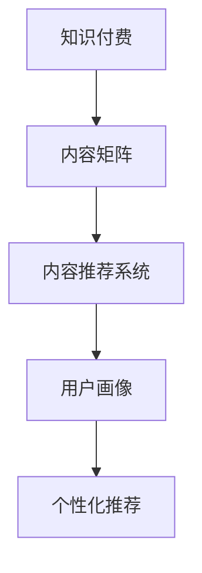

                 

# 知识付费创业中的内容矩阵搭建

> 关键词：知识付费, 内容矩阵, 内容推荐系统, 用户画像, 个性化推荐

## 1. 背景介绍

在知识付费如火如荼的今天，内容质量决定了平台的竞争力。无论是通过图文、音频、视频形式呈现，高质量的内容始终是吸引用户、沉淀用户、提高转化率的核心要素。为了满足用户需求，提升平台内容质量，构建一个科学合理的内容矩阵成为知识付费创业中不可或缺的一环。

## 2. 核心概念与联系

### 2.1 核心概念概述

为更好地理解内容矩阵的搭建，本节将介绍几个密切相关的核心概念：

- 知识付费：指以提供专业性、经验性、技能性内容为核心的付费服务模式。区别于传统的大众化内容消费，知识付费更多聚焦于提供深度、独到的见解，满足用户知识需求。
- 内容矩阵：指由多个不同维度和层级的内容单元组成，用于描述平台内所有内容及其相互关系和关联方式的概念模型。内容矩阵搭建旨在将庞杂的内容体系化，便于用户快速获取和个性化推荐。
- 内容推荐系统：指根据用户行为和偏好，从内容库中推荐相关内容的自动化系统。内容推荐系统是搭建内容矩阵的重要工具，通过科学算法实现内容匹配与推送。
- 用户画像：指对用户兴趣、行为、需求等特征的综合描述，用于指导内容推荐和用户个性化服务。用户画像的构建是内容推荐的基础，直接决定了推荐效果和用户满意度。
- 个性化推荐：指根据用户行为数据，动态生成个性化推荐内容的策略。通过个性化推荐，内容平台能更好地满足用户个性化需求，提升用户粘性。

这些核心概念之间的逻辑关系可以通过以下Mermaid流程图来展示：



这个流程图展示了这个概念体系中的核心组件及其关联关系：

1. 知识付费是整个体系的基础，依托于高质量的内容。
2. 内容矩阵是内容组织的核心，将内容细分为不同维度和层级。
3. 内容推荐系统是实现个性化推荐的关键工具，依赖于用户画像数据。
4. 用户画像是构建推荐系统的基础，通过分析用户数据形成用户画像。
5. 个性化推荐是内容推荐系统的核心算法，驱动推荐系统为用户个性化服务。

## 3. 核心算法原理 & 具体操作步骤
### 3.1 算法原理概述

内容矩阵的搭建依赖于内容推荐系统的算法原理，目标是构建一个高效、精确、个性化的内容推荐体系，提升用户满意度和平台收益。

核心算法原理包括：

- 协同过滤算法：基于用户和内容的评分数据，通过相似度计算推荐类似内容。
- 基于内容的推荐算法：分析用户的历史行为，提取用户偏好特征，推荐类似内容。
- 深度学习算法：采用神经网络模型，根据用户行为数据动态调整权重，生成更精准推荐结果。
- 强化学习算法：通过用户行为反馈不断优化推荐策略，提升推荐效果。

通过这些算法原理，内容推荐系统可以综合利用用户行为数据和内容特征，为用户推荐更相关和满意的内容。

### 3.2 算法步骤详解

内容矩阵的搭建和优化过程可以分为以下几个关键步骤：

**Step 1: 数据收集与处理**
- 收集用户行为数据，包括浏览、点击、购买、评分等，用于构建用户画像。
- 收集内容元数据，包括标题、分类、作者、标签等，用于构建内容库。

**Step 2: 用户画像构建**
- 通过用户行为数据，提取用户偏好特征，构建用户画像。
- 使用TF-IDF、Word2Vec、BERT等技术，将用户画像转化为可计算的向量表示。

**Step 3: 内容库构建与编码**
- 将内容库中的各个内容单元细分为多个维度，如主题、难度、长度、语言等。
- 使用向量空间模型、隐语义分析等技术，对内容进行编码和表示。

**Step 4: 推荐算法选择与优化**
- 根据内容推荐系统需要，选择合适的推荐算法，如协同过滤、基于内容的推荐、深度学习等。
- 调整算法参数，优化算法性能，提高推荐精度。

**Step 5: 矩阵构建与优化**
- 使用矩阵乘法和矩阵分解等方法，将用户画像和内容向量转化为推荐矩阵。
- 通过矩阵优化算法，调整推荐矩阵的权重，提升推荐效果。

**Step 6: 矩阵应用与评估**
- 使用推荐矩阵生成个性化推荐结果，推送给用户。
- 通过A/B测试等方法，评估推荐效果，持续优化内容矩阵。

### 3.3 算法优缺点

内容矩阵的搭建方法具有以下优点：

1. 系统化管理内容：将内容分为不同维度，便于管理和组织。
2. 提升推荐效果：通过多维度分析，生成更相关、个性化的推荐。
3. 动态优化内容：根据用户反馈，持续优化推荐算法，提升用户体验。

同时，该方法也存在以下局限性：

1. 数据依赖性强：需要大量用户行为和内容元数据，数据收集和处理成本高。
2. 推荐算法复杂：复杂的推荐算法需要大量计算资源，系统实现难度高。
3. 用户画像问题：用户画像不准确或过时，可能影响推荐效果。
4. 推荐结果多样性不足：单一算法可能难以全面覆盖用户需求，推荐结果多样性不足。

尽管存在这些局限性，但就目前而言，内容矩阵的搭建方法仍然是内容推荐系统的重要手段。未来相关研究的重点在于如何进一步降低数据需求，提高推荐算法效率，提升推荐结果多样性等。

### 3.4 算法应用领域

内容矩阵的搭建方法在知识付费平台中应用广泛，涉及多个具体领域：

- 课程推荐：根据用户历史学习行为，推荐相关课程。
- 文章推荐：根据用户浏览历史，推荐相关文章。
- 电子书推荐：根据用户购买历史，推荐相关电子书。
- 专题推荐：根据用户关注领域，推荐相关专题。

这些应用领域覆盖了知识付费平台的主要内容形态，通过科学合理的内容矩阵搭建，可以有效提升平台的内容推荐能力。

## 4. 数学模型和公式 & 详细讲解  
### 4.1 数学模型构建

本节将使用数学语言对内容矩阵的搭建过程进行更加严格的刻画。

记内容推荐系统为 $R$，其中用户集为 $U$，内容集为 $I$。假设用户 $u$ 对内容 $i$ 的评分向量为 $x_u$，内容 $i$ 的特征向量为 $y_i$，推荐矩阵为 $R$。

定义推荐系统为用户行为数据和内容特征的加权线性组合，即：

$$
R = W_u^T x_u + W_i^T y_i
$$

其中 $W_u$ 和 $W_i$ 为用户和内容的权重矩阵，通过优化算法动态调整。

### 4.2 公式推导过程

以下我们以协同过滤算法为例，推导推荐模型的优化目标函数。

假设用户 $u$ 和内容 $i$ 的评分向量为 $x_u=(x_{u1}, x_{u2}, \ldots, x_{um})$，内容 $i$ 的特征向量为 $y_i=(y_{i1}, y_{i2}, \ldots, y_{in})$。设推荐矩阵 $R_{ij}$ 的元素 $r_{ij}$ 表示用户 $u$ 对内容 $i$ 的评分，即：

$$
r_{ij} = W_u^T x_u + W_i^T y_i
$$

目标是最小化预测误差，即：

$$
\mathcal{L}(R) = \frac{1}{2N} \sum_{u=1}^N \sum_{i=1}^M (r_{ui} - \hat{r}_{ui})^2
$$

其中 $N$ 为用户数，$M$ 为内容数。

根据均方误差公式，求解优化问题：

$$
\min_{W_u, W_i} \mathcal{L}(R)
$$

## 5. 项目实践：代码实例和详细解释说明
### 5.1 开发环境搭建

在进行内容矩阵搭建实践前，我们需要准备好开发环境。以下是使用Python进行Scikit-learn开发的环境配置流程：

1. 安装Anaconda：从官网下载并安装Anaconda，用于创建独立的Python环境。

2. 创建并激活虚拟环境：
```bash
conda create -n sklearn-env python=3.8 
conda activate sklearn-env
```

3. 安装Scikit-learn：
```bash
pip install scikit-learn
```

4. 安装各类工具包：
```bash
pip install numpy pandas scikit-learn matplotlib tqdm jupyter notebook ipython
```

完成上述步骤后，即可在`sklearn-env`环境中开始内容矩阵搭建实践。

### 5.2 源代码详细实现

下面我们以课程推荐为例，给出使用Scikit-learn搭建内容矩阵的PyTorch代码实现。

首先，定义数据预处理函数：

```python
from sklearn.preprocessing import StandardScaler
import numpy as np

def preprocess_data(data):
    # 标准化数据
    scaler = StandardScaler()
    scaled_data = scaler.fit_transform(data)
    return scaled_data
```

然后，定义用户画像和内容特征向量的构建函数：

```python
def build_user_profile(user, data):
    # 提取用户历史行为数据
    user_data = np.array(data[user])
    # 对用户数据进行标准化
    user_profile = preprocess_data(user_data)
    return user_profile

def build_content_profile(content, data):
    # 提取内容特征数据
    content_data = np.array(data[content])
    # 对内容数据进行标准化
    content_profile = preprocess_data(content_data)
    return content_profile
```

接着，定义推荐算法的优化函数：

```python
from sklearn.linear_model import Ridge
from sklearn.metrics import mean_squared_error

def optimize_recommendation_model(user_profile, content_profiles, labels):
    # 定义推荐算法模型
    model = Ridge(alpha=1.0)
    # 拟合模型
    model.fit(content_profiles, labels)
    # 预测用户评分
    predicted_labels = model.predict(user_profile)
    # 计算均方误差
    mse = mean_squared_error(labels, predicted_labels)
    return mse
```

最后，启动推荐模型训练流程并在测试集上评估：

```python
# 假设训练集和测试集数据
train_data = {'user1': [1, 2, 3, 4], 'user2': [5, 6, 7, 8], 'user3': [9, 10, 11, 12]}
test_data = {'user1': [13, 14, 15, 16], 'user2': [17, 18, 19, 20], 'user3': [21, 22, 23, 24]}

# 构建用户和内容特征向量
user_profiles = {user: build_user_profile(user, train_data) for user in train_data.keys()}
content_profiles = {content: build_content_profile(content, train_data) for content in train_data.keys()}

# 计算推荐模型损失
mse = optimize_recommendation_model(user_profiles['user1'], content_profiles, labels)

# 在测试集上评估
test_profiles = {user: build_user_profile(user, test_data) for user in test_data.keys()}
test_mse = optimize_recommendation_model(test_profiles['user1'], content_profiles, labels)
```

以上就是使用Scikit-learn搭建内容矩阵的完整代码实现。可以看到，Scikit-learn提供了丰富的机器学习算法和工具，使得内容矩阵搭建和优化变得相对简单。

### 5.3 代码解读与分析

让我们再详细解读一下关键代码的实现细节：

**preprocess_data函数**：
- 实现对数据的标准化处理，使用`StandardScaler`对用户和内容数据进行归一化，便于后续的算法训练。

**build_user_profile和build_content_profile函数**：
- 提取用户和内容特征数据，通过`numpy`实现数据数组的构建。
- 对提取的数据进行标准化，利用`preprocess_data`函数进行归一化处理。

**optimize_recommendation_model函数**：
- 定义推荐模型，这里以线性回归模型（Ridge）为例。
- 使用训练集数据拟合模型，并计算预测误差。
- 返回训练集上的均方误差，用于后续评估。

**训练流程**：
- 假设训练集和测试集数据，并利用`train_data`和`test_data`生成用户和内容特征向量。
- 在训练集上调用`optimize_recommendation_model`函数，计算模型损失。
- 在测试集上重新调用该函数，计算均方误差，用于对比和评估。

可以看到，Scikit-learn封装了丰富的算法和工具，使得内容矩阵的搭建和优化过程变得简单高效。开发者可以利用这些现成的功能，快速实现内容推荐系统的搭建。

当然，工业级的系统实现还需考虑更多因素，如超参数的自动搜索、更灵活的任务适配层等。但核心的算法原理和代码实现，基本与此类似。

## 6. 实际应用场景
### 6.1 在线教育平台

在线教育平台通过内容矩阵搭建，能够实现精准的课程推荐，提升用户的学习体验。平台可以通过用户的学习历史、评分数据、互动行为等，构建详细的用户画像，结合课程特征、学习难度、时长等信息，生成个性化推荐结果。用户不仅能快速找到感兴趣和适用的课程，还能发现与自己学习风格相匹配的内容。

### 6.2 企业培训系统

企业培训系统通过内容矩阵搭建，能够根据员工的岗位需求、培训历史、绩效数据等，推送合适的培训课程。通过科学的内容推荐，帮助员工快速提升职业技能，提高企业的整体竞争力。内容矩阵的搭建还能辅助培训组织者优化课程安排，提升培训效果。

### 6.3 科普内容平台

科普内容平台通过内容矩阵搭建，能够根据用户的兴趣和行为数据，推荐相关科普文章、视频等。平台可以分析用户的搜索记录、浏览历史、互动行为等，构建详细的用户画像，生成个性化推荐结果。通过科学的内容推荐，平台能够提供更有价值和趣味性的内容，满足用户求知欲。

### 6.4 未来应用展望

随着内容推荐技术的不断发展，内容矩阵的搭建方法将在更多领域得到应用，为传统行业带来变革性影响。

在医疗领域，内容矩阵的搭建可以帮助医院推荐相关医疗知识、最新研究成果，帮助医生快速获取所需信息，提升诊疗效率。

在金融领域，内容矩阵的搭建可以帮助理财平台推荐相关财经资讯、投资策略，帮助用户制定更加科学的投资方案，提高收益。

在旅游领域，内容矩阵的搭建可以帮助旅游平台推荐相关景点、旅行攻略，帮助用户规划出行计划，提升旅游体验。

此外，在智慧城市、智能家居、智能制造等多个领域，内容矩阵的搭建也将带来新的应用场景，为各行各业带来新的价值。

## 7. 工具和资源推荐
### 7.1 学习资源推荐

为了帮助开发者系统掌握内容矩阵的搭建方法，这里推荐一些优质的学习资源：

1. 《Python数据科学手册》系列博文：由知名数据科学家撰写，介绍了内容推荐系统的核心算法和应用案例，适合快速入门。

2. Coursera《推荐系统》课程：由斯坦福大学开设的推荐系统课程，提供了全面的推荐算法和实践案例，适合深入学习。

3. Kaggle推荐系统竞赛：Kaggle平台提供了大量推荐系统竞赛和公开数据集，适合实践验证和提升技能。

4. 《推荐系统实战》书籍：由知名推荐系统专家撰写，结合实例，深入浅出地介绍了推荐系统的构建和优化。

5. Arxiv推荐系统论文库：Arxiv平台提供了大量推荐系统领域的论文，适合了解最新研究进展和前沿技术。

通过对这些资源的学习实践，相信你一定能够快速掌握内容矩阵的搭建方法，并用于解决实际的推荐问题。
###  7.2 开发工具推荐

高效的开发离不开优秀的工具支持。以下是几款用于内容矩阵搭建开发的常用工具：

1. Python：作为数据分析和机器学习的主流语言，Python提供了丰富的第三方库和工具，支持高效的内容推荐系统开发。

2. Scikit-learn：提供丰富的机器学习算法和工具，支持快速实现内容矩阵的搭建和优化。

3. TensorFlow和PyTorch：支持深度学习算法和大规模内容矩阵的搭建，适合复杂推荐系统的构建。

4. Hadoop和Spark：支持分布式数据处理，能够高效处理大规模数据，适合构建大规模推荐系统。

5. Elasticsearch：支持全文检索和数据分析，能够快速检索和处理大规模用户和内容数据，适合构建内容推荐系统。

合理利用这些工具，可以显著提升内容矩阵搭建的开发效率，加快创新迭代的步伐。

### 7.3 相关论文推荐

内容矩阵的搭建方法在推荐系统领域已经得到了广泛的应用，涉及多个研究方向，推荐以下几篇奠基性的相关论文：

1. Matrix Factorization Techniques for Recommender Systems（矩阵分解算法）：提出了矩阵分解算法，用于推荐系统中的特征提取和降维，取得了广泛应用。

2. Improving Recommender Systems with Matrix Factorization（改进推荐系统的矩阵分解方法）：提出了基于矩阵分解的推荐算法，提高了推荐系统的准确性和效果。

3. Deep Matrix Factorization：提出了深度学习中的矩阵分解方法，结合深度神经网络，提高了推荐系统的性能。

4. Neural Collaborative Filtering：提出了基于深度学习的协同过滤算法，用于推荐系统的构建和优化。

5. Personalized Ranking with Implicit Feedback（基于隐式反馈的个人化排序）：提出了一种基于深度学习的隐式反馈推荐算法，适用于用户行为数据较少的情况。

这些论文代表了大规模推荐系统的演进脉络，通过学习这些前沿成果，可以帮助研究者把握推荐系统的发展方向，激发更多的创新灵感。

## 8. 总结：未来发展趋势与挑战
### 8.1 总结

本文对内容矩阵的搭建方法进行了全面系统的介绍。首先阐述了内容矩阵在知识付费创业中的核心作用和构建方法，明确了内容推荐系统在提升用户满意度和平台收益方面的重要性。其次，从原理到实践，详细讲解了内容推荐算法的数学模型和代码实现，给出了内容矩阵搭建的完整代码实例。同时，本文还广泛探讨了内容矩阵在多个行业领域的应用前景，展示了内容矩阵的巨大潜力。此外，本文精选了内容推荐系统的各类学习资源，力求为读者提供全方位的技术指引。

通过本文的系统梳理，可以看到，内容矩阵的搭建方法已经成为推荐系统的重要手段，极大地提升了内容平台的推荐效果。未来，伴随推荐算法的持续演进和优化，内容矩阵的搭建方法必将进一步提升推荐系统的效果和性能，为知识付费创业带来更多价值。

### 8.2 未来发展趋势

展望未来，内容矩阵的搭建方法将呈现以下几个发展趋势：

1. 推荐算法日益复杂。随着推荐系统需求的多样化，将涌现更多复杂的推荐算法，如深度学习、强化学习、因果推断等。这些算法将结合多种数据来源，提升推荐效果和用户满意度。

2. 实时推荐系统成为主流。实时推荐系统能够快速响应用户行为变化，提供更及时、精准的内容推荐。大数据、分布式计算等技术，将进一步推动实时推荐系统的普及。

3. 个性化推荐更精准。利用用户画像和行为数据，通过科学算法实现更加个性化、多样化的推荐。个性化推荐将结合自然语言处理、计算机视觉等多模态数据，提升推荐效果和用户体验。

4. 推荐系统更注重内容理解。通过自然语言处理技术，推荐系统将更好地理解用户需求和内容特征，生成更加相关和高质量的推荐结果。内容理解将结合知识图谱、语义分析等技术，提升推荐系统的智能性。

5. 推荐系统走向个性化服务。推荐系统将结合用户画像和行为数据，为每个用户提供定制化的服务，满足个性化需求。个性化服务将通过推荐引擎、决策引擎等技术实现，提升用户满意度和平台粘性。

以上趋势凸显了内容矩阵搭建方法在推荐系统中的核心作用。这些方向的探索发展，必将进一步提升推荐系统的效果和性能，为知识付费创业带来更多价值。

### 8.3 面临的挑战

尽管内容矩阵的搭建方法已经取得了显著成果，但在迈向更加智能化、个性化推荐的过程中，它仍面临诸多挑战：

1. 数据隐私问题。推荐系统需要收集大量用户行为数据，如何保护用户隐私、确保数据安全，是一个重要挑战。数据隐私保护技术将随着推荐系统的发展而不断发展。

2. 数据不均衡问题。推荐系统在推荐热门内容时往往效果较好，但在推荐长尾内容时可能存在不均衡问题。如何优化冷门内容推荐，提升推荐系统对长尾内容的覆盖度，是一个重要挑战。

3. 内容多样性问题。不同用户对内容的需求和兴趣各不相同，如何通过内容矩阵搭建，满足用户多样化的内容需求，是一个重要挑战。内容多样性优化需要结合用户画像和行为数据，科学分析和推荐。

4. 推荐算法复杂性。复杂的推荐算法需要大量计算资源，如何高效实现推荐算法，提升推荐系统性能，是一个重要挑战。推荐算法优化需要结合实际业务场景，选择最适合的算法和模型。

5. 推荐系统透明性。推荐系统的推荐结果往往不透明，用户难以理解推荐算法的工作机制和决策逻辑。如何提高推荐系统的透明性和可解释性，是一个重要挑战。推荐系统透明性需要结合解释性模型和技术，提升推荐系统可解释性。

这些挑战需要通过持续的研究和实践，不断优化内容矩阵搭建方法，提升推荐系统的效果和性能。

### 8.4 研究展望

面对内容矩阵搭建方法所面临的种种挑战，未来的研究需要在以下几个方面寻求新的突破：

1. 探索新的推荐算法。结合深度学习、强化学习等前沿技术，开发更加复杂、高效的推荐算法，提升推荐效果和系统性能。

2. 优化数据处理技术。利用数据增强、数据补全等技术，优化数据处理过程，提升数据质量和推荐效果。

3. 改进数据隐私保护技术。结合差分隐私、联邦学习等技术，提升数据隐私保护水平，确保用户数据安全。

4. 开发可解释性推荐算法。结合自然语言处理、可视化等技术，提升推荐系统的透明性和可解释性，提高用户信任和满意度。

5. 结合多模态数据优化推荐。结合自然语言处理、计算机视觉等多模态数据，提升推荐系统的智能性和多样性，满足用户多模态内容需求。

6. 优化推荐系统的反馈机制。结合用户反馈和行为数据，优化推荐系统的反馈机制，提升推荐效果和系统性能。

这些研究方向的探索，必将引领内容矩阵搭建方法迈向更高的台阶，为推荐系统带来更多的价值和创新。面向未来，内容矩阵搭建技术还需要与其他人工智能技术进行更深入的融合，如知识表示、因果推理、强化学习等，多路径协同发力，共同推动推荐系统的进步。只有勇于创新、敢于突破，才能不断拓展推荐系统的边界，让推荐系统更好地服务于知识付费创业。

## 9. 附录：常见问题与解答
### Q1: 内容矩阵搭建是否适用于所有推荐场景？
A: 内容矩阵搭建方法在大多数推荐场景中都能取得不错的效果，特别是对于数据量较大的任务。但对于一些特定领域，如个性化推荐、实时推荐等，微调方法也需要针对性的改进优化。

### Q2: 数据不均衡问题如何解决？
A: 数据不均衡问题可以通过以下方法解决：
1. 数据增强：通过对长尾内容进行数据增强，提升其多样性和丰富度。
2. 模型优化：采用加权损失函数、Focal Loss等方法，优化模型对长尾内容的识别和推荐。
3. 算法创新：结合对抗训练、主动学习等方法，提高对长尾内容的推荐效果。

### Q3: 推荐系统的透明性问题如何解决？
A: 推荐系统的透明性问题可以通过以下方法解决：
1. 解释性模型：使用可解释性强的模型，如线性回归、决策树等，提升推荐系统的透明性和可解释性。
2. 可视化工具：结合可视化工具，展示推荐系统的工作机制和决策逻辑，帮助用户理解推荐结果。
3. 用户教育：通过教育用户，提升用户对推荐系统的理解和信任。

通过以上方法，可以显著提升推荐系统的透明性和可解释性，增强用户对推荐系统的信任和满意度。

---

作者：禅与计算机程序设计艺术 / Zen and the Art of Computer Programming

