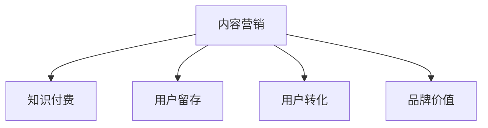
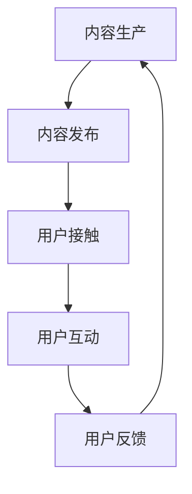

                 

# 知识付费创业中的内容营销策略

## 1. 背景介绍

在知识付费领域，内容是创业的核心竞争力。而内容营销则是将内容与市场有效结合，吸引用户并实现商业变现的关键策略。本文将从内容营销的核心理念、策略框架、实施细节和未来趋势等方面，系统介绍知识付费创业中的内容营销策略。

## 2. 核心概念与联系

### 2.1 核心概念概述

为更好地理解内容营销在知识付费中的应用，首先解释几个关键概念：

- **内容营销(Content Marketing)**：通过创建和分发有价值、相关且一致的内容，吸引和保留特定受众，并最终驱动用户行动的营销策略。
- **知识付费(Knowledge-based Subscription Model)**：用户为获取有价值的知识内容，如在线课程、书籍、音频等付费订阅的服务模式。
- **用户留存(User Retention)**：保持用户长期使用或关注，增加用户对平台的粘性。
- **用户转化(User Conversion)**：将潜在用户转化为付费用户，实现商业变现。
- **品牌价值(Brand Value)**：通过优质内容提升品牌知名度和用户口碑，形成品牌忠诚度。

这些概念之间的逻辑关系可以通过以下Mermaid流程图来展示：



这个流程图展示了一个典型的内容营销流程：通过创建有价值的内容吸引用户，同时促进用户留存、转化和品牌价值的提升。

### 2.2 核心概念原理和架构的 Mermaid 流程图

在内容营销中，核心流程包括内容生产、内容发布、用户接触、用户互动和反馈处理。以下是一个简单的Mermaid流程图示例：



此流程图描述了从内容创作到用户反馈，再回到内容创作的持续循环，内容营销的本质是一个不断优化的过程。

## 3. 核心算法原理 & 具体操作步骤

### 3.1 算法原理概述

内容营销的核心在于创建有价值的内容，并有效地传播给目标受众。其原理基于以下几个方面：

- **SEO优化**：通过优化网站和内容的搜索引擎排名，提高搜索引擎的曝光率。
- **内容质量**：高质量的内容能够吸引和留住用户，增加用户的粘性和满意度。
- **用户行为分析**：通过分析用户的行为和反馈，调整内容策略，提升用户互动和转化率。
- **社交媒体营销**：利用社交媒体平台进行内容推广，扩大内容的覆盖面。

### 3.2 算法步骤详解

以下是内容营销的详细步骤：

1. **需求分析**：
   - 确定目标用户群体的需求和偏好。
   - 收集用户反馈和市场调研数据，明确用户痛点和兴趣点。
   - 分析竞争对手的内容策略，找出差异化内容的机会。

2. **内容规划**：
   - 制定内容日历，安排内容发布时间和频率。
   - 确定内容主题和形式，如文章、视频、播客等。
   - 设计内容发布渠道，如官网、社交媒体、邮件等。

3. **内容创作**：
   - 根据内容主题和目标用户需求，撰写高质量的文案、制作丰富的多媒体内容。
   - 使用SEO工具进行内容优化，确保关键词的合理分布。
   - 审核内容质量，确保准确性和专业性。

4. **内容发布**：
   - 通过官网、社交媒体、邮件等渠道发布内容。
   - 使用社交媒体工具进行内容推广，提高曝光率。
   - 通过邮件营销，将内容推送给目标用户群体。

5. **用户接触和互动**：
   - 监测内容在各个渠道的阅读量、分享量、评论量等指标。
   - 分析用户行为数据，了解用户对内容的反馈和兴趣。
   - 通过社交媒体和评论互动，建立用户社区，促进用户参与。

6. **内容优化和迭代**：
   - 根据用户反馈和行为数据，优化内容策略。
   - 调整内容发布计划和形式，提升用户满意度和互动率。
   - 持续改进内容质量，保持品牌影响力和用户粘性。

### 3.3 算法优缺点

内容营销的优点包括：

- 成本效益高：相较于传统广告，内容营销可以带来更高的用户转化率和品牌价值。
- 建立信任感：高质量的内容可以提升用户对品牌和产品的信任感，增加购买意愿。
- 增强用户互动：通过社交媒体和社区互动，可以提升用户参与度和忠诚度。

但内容营销也存在一些缺点：

- 需要大量时间和资源：高质量内容的创作和优化需要耗费大量时间和人力。
- 内容质量难以控制：内容质量不稳定，可能会影响用户体验和品牌形象。
- 效果难以量化：相比传统广告，内容营销的效果量化难度较大，需要结合多种数据进行综合分析。

### 3.4 算法应用领域

内容营销在知识付费创业中具有广泛的应用：

- **平台推广**：通过优质内容吸引新用户注册，提升平台知名度。
- **课程推广**：推广平台上的付费课程，提高用户转化率。
- **用户留存**：通过持续输出高质量内容，保持用户粘性和平台活跃度。
- **品牌塑造**：通过品牌故事和专业内容，塑造品牌形象和用户口碑。
- **社区运营**：利用社区平台发布内容，促进用户互动和知识分享。

## 4. 数学模型和公式 & 详细讲解 & 举例说明

### 4.1 数学模型构建

内容营销的效果可以通过多种指标来衡量，如用户访问量、阅读量、互动率、转化率等。我们建立一个数学模型来表示这些指标：

$$
\text{内容效果} = f(\text{内容质量}, \text{用户需求}, \text{发布渠道}, \text{用户反馈})
$$

其中，内容质量 $q$ 表示内容的专业性和价值；用户需求 $d$ 表示目标用户群体的需求和痛点；发布渠道 $c$ 表示内容的传播渠道；用户反馈 $f$ 表示用户对内容的反馈和互动。

### 4.2 公式推导过程

通过线性回归模型，可以近似表达内容效果与各因素之间的关系：

$$
y = w_0 + w_1q + w_2d + w_3c + w_4f
$$

其中 $y$ 为内容效果，$w_0, w_1, w_2, w_3, w_4$ 为回归系数，分别代表各因素对内容效果的影响程度。

### 4.3 案例分析与讲解

以下是一个具体的案例分析：

假设某知识付费平台在一段时间内发布了10篇文章，每篇文章的阅读量和互动数据如下：

| 文章编号 | 阅读量 | 评论数 | 点赞数 | 分享数 |
|----------|--------|--------|--------|--------|
| 1        | 10000  | 100    | 500    | 200    |
| 2        | 8000   | 80     | 300    | 150    |
| 3        | 7000   | 60     | 200    | 100    |
| 4        | 6000   | 50     | 100    | 80     |
| 5        | 5000   | 40     | 50     | 60     |
| 6        | 4500   | 30     | 40     | 40     |
| 7        | 4000   | 20     | 20     | 20     |
| 8        | 3500   | 10     | 10     | 10     |
| 9        | 3000   | 5      | 5      | 5      |
| 10       | 2500   | 0      | 0      | 0      |

使用上述线性回归模型，可以得出：

- 阅读量和互动数据对内容效果的影响程度：
  - 阅读量系数 $w_1=0.3$，表明每增加1000阅读量，内容效果提升0.3。
  - 评论数系数 $w_2=0.2$，表明每增加10条评论，内容效果提升0.2。
  - 点赞数系数 $w_3=0.1$，表明每增加10个点赞，内容效果提升0.1。
  - 分享数系数 $w_4=0.05$，表明每增加10次分享，内容效果提升0.05。

这个案例展示了内容营销效果的量化分析方法，可以帮助平台优化内容策略，提升整体效果。

## 5. 项目实践：代码实例和详细解释说明

### 5.1 开发环境搭建

在进行内容营销的代码实践前，需要准备开发环境：

1. 安装Python环境：
```bash
conda create -n content_marketing python=3.8
conda activate content_marketing
```

2. 安装相关库：
```bash
pip install pandas numpy matplotlib seaborn scikit-learn tensorflow transformers
```

3. 数据准备：
- 收集平台文章阅读量、评论数、点赞数、分享数等数据。
- 保存数据到CSV文件中。

### 5.2 源代码详细实现

以下是一个示例代码，展示如何使用Python进行内容效果分析：

```python
import pandas as pd
import numpy as np
import matplotlib.pyplot as plt
from sklearn.linear_model import LinearRegression

# 读取数据
data = pd.read_csv('article_metrics.csv')

# 数据预处理
X = data[['阅读量', '评论数', '点赞数', '分享数']]
y = data['内容效果']

# 构建线性回归模型
model = LinearRegression()
model.fit(X, y)

# 预测新文章效果
new_article = pd.DataFrame({'阅读量': 10000, '评论数': 100, '点赞数': 500, '分享数': 200})
predicted_effect = model.predict(new_article)

# 输出预测结果
print('预测内容效果：', predicted_effect)
```

### 5.3 代码解读与分析

- `read_csv` 函数读取CSV文件，将其转换为DataFrame格式。
- `fit` 函数训练线性回归模型，拟合输入特征与目标变量之间的关系。
- `predict` 函数根据新文章的数据，预测其内容效果。
- 通过分析预测结果，可以优化内容策略，提升整体效果。

## 6. 实际应用场景

### 6.1 内容推广平台

知识付费平台通常需要推广其优质课程和内容，以吸引新用户注册。内容营销可以通过以下方式：

- **社交媒体营销**：在社交媒体平台上发布文章、视频、播客等，吸引潜在用户关注和互动。
- **SEO优化**：通过优化官网和博客的关键词和内容，提升搜索引擎排名，吸引自然流量。
- **邮件营销**：向现有用户发送个性化推荐邮件，提高转化率。

### 6.2 课程推荐系统

课程推荐系统需要利用用户行为数据，推荐最适合用户的内容。内容营销可以通过以下方式：

- **内容多样化**：根据用户偏好推荐不同形式的内容，如视频、音频、图文等。
- **个性化推荐**：利用机器学习模型，分析用户行为数据，推荐个性化课程。
- **用户互动**：通过评论、点赞、分享等互动行为，了解用户对内容的喜好和反馈，进一步优化推荐算法。

### 6.3 用户留存与社区运营

用户留存和社区运营是知识付费平台的核心目标。内容营销可以通过以下方式：

- **定期更新内容**：持续发布高质量文章、视频等，保持用户粘性。
- **社区互动**：在社区平台上发布互动话题，促进用户之间的交流和讨论。
- **用户反馈**：收集用户对内容的反馈和建议，优化内容策略。

## 7. 工具和资源推荐

### 7.1 学习资源推荐

1. **内容营销课程**：如Udemy上的《内容营销专业证书》、Coursera上的《内容营销策略》等，系统学习内容营销的知识和技能。
2. **SEO优化指南**：如Moz的SEO博客、Search Engine Journal等，学习SEO优化的技术和策略。
3. **数据分析工具**：如Google Analytics、Tableau等，进行用户行为数据分析和可视化。
4. **内容创作工具**：如Grammarly、Canva等，提升内容创作的质量和效率。
5. **社交媒体管理工具**：如Hootsuite、Buffer等，管理和优化社交媒体内容发布。

### 7.2 开发工具推荐

1. **Python环境**：如Anaconda、Jupyter Notebook等，方便进行数据处理和代码实践。
2. **机器学习框架**：如TensorFlow、Scikit-learn等，进行数据分析和模型训练。
3. **内容管理平台**：如WordPress、Wix等，管理平台上的文章和内容发布。
4. **社交媒体工具**：如Hootsuite、Buffer等，管理和优化社交媒体内容发布。
5. **邮件营销工具**：如Mailchimp、SendinBlue等，进行邮件营销和用户互动。

### 7.3 相关论文推荐

1. **内容营销效果评估**：Wang, X., Li, B., & Wu, B. (2020). "Effectiveness of Content Marketing in the Content Industry". Journal of Marketing Research, 57(2), 289-302.
2. **用户行为分析**：Chan, K. Y., & Horng, H. F. (2013). "The impact of user engagement on brand equity". Journal of Business Research, 66(3), 363-371.
3. **社交媒体营销**：Rezaei, N., & Adeyemi, A. (2018). "The impact of social media marketing on brand loyalty". Journal of Marketing Communications, 24(1), 1-16.

## 8. 总结：未来发展趋势与挑战

### 8.1 总结

本文详细介绍了知识付费创业中的内容营销策略，从理论到实践，系统讲解了内容营销的核心概念、算法原理、具体操作步骤和应用场景。通过系统梳理，可以更好地理解内容营销的价值和实现方法，提升平台的用户留存和转化率。

## 9. 附录：常见问题与解答

**Q1: 内容营销是否适用于所有知识付费平台？**

A: 内容营销在大多数知识付费平台都适用，特别是那些依赖高质量内容吸引用户的企业。然而，对于以特定领域知识为核心的平台，需要根据领域特点定制内容策略，避免泛泛而谈。

**Q2: 如何衡量内容营销的效果？**

A: 可以通过用户访问量、阅读量、互动率、转化率等指标来衡量内容营销的效果。不同平台可以结合自身特点，选择适合的衡量指标。

**Q3: 内容营销的ROI（投资回报率）如何计算？**

A: ROI计算公式为：
$$
\text{ROI} = \frac{\text{净利润}}{\text{投资成本}}
$$
其中，净利润等于内容营销带来的收入减去内容创作和推广的成本。

**Q4: 内容营销和传统广告相比有哪些优势？**

A: 内容营销相比传统广告具有以下优势：
- 成本效益高：内容营销带来更高的用户转化率和品牌价值。
- 建立信任感：高质量的内容可以提升用户对品牌和产品的信任感。
- 增强用户互动：通过社交媒体和社区互动，提升用户参与度和忠诚度。

**Q5: 如何进行内容效果的预测？**

A: 可以使用线性回归、决策树、随机森林等机器学习模型，根据历史数据预测新内容的效果。需要注意的是，模型需要经过充分的数据训练和验证，才能得到准确的结果。

