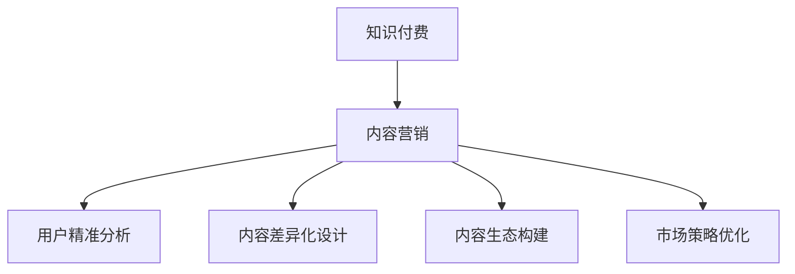

                 

# 知识付费创业中的内容营销策略

> 关键词：知识付费,内容营销,用户分析,个性化推荐,内容差异化,内容生态,市场策略

## 1. 背景介绍

### 1.1 问题由来
近年来，知识付费领域呈现出爆炸式增长。随着信息过载和知识焦虑的日益加剧，越来越多的人愿意为获取有价值的知识和信息付费。这背后，是人们对高效、系统学习需求的不断提升，以及内容制作成本的相对降低。然而，在知识付费市场的快速扩张中，如何精准定位用户，提供高价值内容，并有效构建内容生态，成为了创业企业面临的首要问题。

### 1.2 问题核心关键点
1. **用户精准分析**：了解用户需求，提供个性化推荐。
2. **内容差异化设计**：突出内容特色，形成差异化优势。
3. **内容生态构建**：推动用户互动，形成良性循环。
4. **市场策略优化**：提高市场竞争力，实现商业闭环。

这些关键点共同构成了知识付费创业企业在内容营销中的核心挑战。通过深入分析这些问题，本文将探讨如何构建一套科学的内容营销策略，帮助创业企业实现快速增长和持续发展。

### 1.3 问题研究意义
研究知识付费中的内容营销策略，对于提升创业企业的市场竞争力，拓展用户覆盖，提高内容价值具有重要意义：

1. **提高市场渗透率**：通过精准定位和差异化设计，吸引更多用户订阅，增加市场份额。
2. **提升用户留存率**：通过个性化的推荐和优质内容输出，提升用户粘性，延长生命周期。
3. **增强品牌影响力**：构建专业、权威的内容生态，提升品牌美誉度和用户信任度。
4. **实现商业闭环**：形成用户付费和内容变现的良性循环，推动企业可持续成长。

本文旨在提供一套系统的策略框架，帮助知识付费创业企业在内容营销中取得突破，实现商业成功。

## 2. 核心概念与联系

### 2.1 核心概念概述

为更好地理解知识付费中的内容营销策略，本节将介绍几个关键概念：

- **知识付费**：指用户为获取知识、技能、经验等信息，向内容提供者支付费用的模式。知识付费平台包括线上和线下，形式多样，如在线课程、电子书、专栏文章等。

- **内容营销**：指通过创作和分发有价值、相关且一致的内容，吸引和保持目标受众，并最终驱动用户采取行动的营销策略。

- **用户精准分析**：通过数据分析，识别出不同用户群体的需求、兴趣和行为特征，提供个性化推荐。

- **内容差异化设计**：在内容形式、风格、主题上形成特色，突出与竞争对手的差异，吸引特定用户群体。

- **内容生态构建**：通过用户互动、内容共创，形成平台内的良性循环，增强用户粘性和参与度。

- **市场策略优化**：通过灵活的定价策略、促销活动、渠道选择等，提高市场竞争力，实现商业闭环。

这些概念之间的逻辑关系可以通过以下Mermaid流程图来展示：



这个流程图展示了好内容对知识付费企业的重要性，以及内容营销策略中各个环节的相互联系和支撑作用。

## 3. 核心算法原理 & 具体操作步骤
### 3.1 算法原理概述

知识付费中的内容营销策略，本质上是通过科学的用户分析，设计并分发高价值内容，以吸引和保持目标受众，并最终实现商业目标的过程。这一过程涉及多个环节，包括用户画像构建、内容推荐算法、内容生成与分发、市场策略设计等。

核心算法原理包括以下几个方面：

- **用户画像构建**：基于用户历史行为、反馈、社交数据等，构建详尽的用户画像，识别用户需求和兴趣。
- **内容推荐算法**：使用协同过滤、基于内容的推荐、深度学习等算法，提供个性化推荐，提升用户体验和满意度。
- **内容生成与分发**：通过内容平台，将优质内容推送给目标用户，实现内容的有效传播。
- **市场策略设计**：灵活设计价格、促销、渠道等策略，实现内容变现和市场扩展。

### 3.2 算法步骤详解

知识付费创业企业的内容营销策略，一般包括以下几个关键步骤：

**Step 1: 用户画像构建**
- 收集用户历史行为数据，如课程浏览、购买记录、评论等。
- 利用数据分析工具，如Tableau、Python等，构建用户画像。
- 识别出不同用户群体的需求和兴趣，如职场人士、学生、创业者等。

**Step 2: 内容推荐算法设计**
- 选择适合的推荐算法，如协同过滤、基于内容的推荐、深度学习等。
- 设计推荐模型，收集用户行为数据，如点击、评分、收藏等。
- 训练推荐模型，优化推荐算法，提升推荐效果。

**Step 3: 内容生成与分发**
- 设计内容生产流程，如邀请专家撰写、用户UGC、平台编辑等。
- 使用内容管理系统，如WordPress、ContentSquare等，管理内容发布。
- 利用内容分发渠道，如邮件、社交媒体、平台推送等，将内容推送给目标用户。

**Step 4: 市场策略优化**
- 设计灵活的价格策略，如订阅制、单次付费、课程包等。
- 策划有吸引力的促销活动，如限时折扣、用户体验活动等。
- 选择合适的渠道，如App、微信公众号、抖音等，推广内容。

### 3.3 算法优缺点

知识付费中的内容营销策略具有以下优点：
1. **精准定位用户**：通过用户画像和推荐算法，可以精准定位用户，提供个性化内容。
2. **提升用户留存**：通过高质量的内容输出，提升用户粘性，延长生命周期。
3. **增强品牌影响力**：构建专业、权威的内容生态，提升品牌美誉度和用户信任度。
4. **实现商业闭环**：形成用户付费和内容变现的良性循环，推动企业可持续成长。

同时，该策略也存在一些局限性：
1. **资源投入高**：用户画像构建、内容生成、算法训练等环节需要大量人力和物力投入。
2. **内容制作周期长**：优质内容的制作往往需要较长时间，无法迅速响应市场变化。
3. **用户需求多变**：用户兴趣和需求不断变化，内容营销策略需要动态调整，以适应市场需求。
4. **市场竞争激烈**：知识付费市场竞争激烈，如何在众多平台中脱颖而出，成为一大挑战。

尽管存在这些局限性，但就目前而言，内容营销策略仍是知识付费创业企业实现市场突破的重要手段。未来相关研究的重点在于如何进一步降低内容营销的资源投入，提高内容生产效率，同时兼顾用户需求的变化和市场竞争的激烈性。

### 3.4 算法应用领域

基于内容营销策略，知识付费创业企业已经在在线教育、职业培训、职场技能提升等多个领域取得了显著成效，形成了具有特色的内容生态。

- **在线教育**：提供各类在线课程，如编程、英语、职业培训等，满足用户的学习需求。
- **职业培训**：针对职场人士，提供职业技能培训，帮助用户提升职场竞争力。
- **职场技能提升**：提供时间管理、情绪管理、谈判技巧等实用技能课程，帮助用户提升职场软技能。

此外，内容营销策略还被创新性地应用于内容电商、知识社区等新兴领域，为知识付费创业企业带来了新的商业机会。

## 4. 数学模型和公式 & 详细讲解 & 举例说明
### 4.1 数学模型构建

本节将使用数学语言对知识付费中的内容营销策略进行更加严格的刻画。

假设知识付费平台的用户群体为 $U$，每个用户有 $n$ 个兴趣标签 $T$，内容库为 $C$，每个内容有 $m$ 个标签 $L$。目标是通过内容推荐算法 $R$，为用户 $u \in U$ 推荐最相关的 $k$ 个内容 $c \in C$，使得用户满意度最大化。

定义用户对内容的评分函数为 $f: U \times C \rightarrow [0,1]$，表示用户 $u$ 对内容 $c$ 的评分。定义内容推荐模型的优化目标为：

$$
\max_{R} \sum_{u \in U} \sum_{c \in C} f(u,c) \cdot P_R(u,c)
$$

其中 $P_R(u,c)$ 为推荐模型 $R$ 将内容 $c$ 推荐给用户 $u$ 的概率。

### 4.2 公式推导过程

以下我们以协同过滤推荐算法为例，推导用户内容评分函数的计算公式。

假设用户 $u$ 对内容 $c$ 的评分函数为 $f(u,c)=f_{u,c}$，内容库中每个内容的平均评分向量为 $\overline{F}$，每个内容的标签分布向量为 $L$，每个用户的兴趣标签分布向量为 $T$。则用户 $u$ 对内容 $c$ 的评分可以表示为：

$$
f_{u,c} = \alpha_u \overline{F}_c + \beta_c \overline{T}_u + \gamma_{u,c}
$$

其中 $\alpha_u$ 和 $\beta_c$ 为用户和内容的个性化系数，$\gamma_{u,c}$ 为内容的个性化评分项。

推荐模型的优化目标可以改写为：

$$
\max_{P_R} \sum_{u \in U} \sum_{c \in C} f(u,c) \cdot P_R(u,c)
$$

将评分函数带入，得：

$$
\max_{P_R} \sum_{u \in U} \sum_{c \in C} (\alpha_u \overline{F}_c + \beta_c \overline{T}_u + \gamma_{u,c}) \cdot P_R(u,c)
$$

进一步简化，得：

$$
\max_{P_R} \sum_{u \in U} \alpha_u (\overline{F}_c \cdot P_R(u,c)) + \beta_c (\overline{T}_u \cdot P_R(u,c)) + \sum_{u \in U} \gamma_{u,c} P_R(u,c)
$$

在实际应用中，可以通过优化算法（如基于梯度的优化算法）求解上述目标函数，得到最优的推荐概率 $P_R$。

### 4.3 案例分析与讲解

以在线教育平台为例，展示内容推荐算法的实际应用。

假设平台有 $U=1000$ 名用户，$C=500$ 门课程，每个用户对课程的评分向量为 $f_{u,\cdot} \in \mathbb{R}^{500}$。内容库中每个课程的平均评分向量为 $\overline{F}_c \in \mathbb{R}^{500}$，每个课程的标签分布向量为 $L_c \in \mathbb{R}^{10}$，每个用户的兴趣标签分布向量为 $T_u \in \mathbb{R}^{10}$。

平台使用协同过滤算法进行内容推荐，用户 $u$ 对内容 $c$ 的评分函数为：

$$
f_{u,c} = 0.8 \overline{F}_c + 0.2 \overline{T}_u + 0.1 (\overline{F}_c \cdot \overline{T}_u)
$$

平台的目标是最大化用户满意度，即：

$$
\max_{P_R} \sum_{u \in U} \sum_{c \in C} f_{u,c} \cdot P_R(u,c)
$$

通过优化算法，求解得到最优的推荐概率 $P_R$。具体步骤如下：

1. 初始化推荐概率 $P_R^0$。
2. 计算每个用户对每个内容的推荐评分 $f_{u,c} \cdot P_R^0(u,c)$。
3. 更新推荐概率 $P_R^{t+1} = P_R^{t} \cdot \alpha + \beta \cdot D_c^{t+1} \cdot D_u^{t+1}$，其中 $\alpha$ 为学习率，$D_c^{t+1}$ 和 $D_u^{t+1}$ 分别为内容库和用户库的点击量更新矩阵。
4. 重复步骤2和3，直至收敛。

通过上述算法，平台可以为用户 $u$ 推荐 $k=5$ 门课程，使得用户满意度最大化。

## 5. 项目实践：代码实例和详细解释说明
### 5.1 开发环境搭建

在进行内容营销实践前，我们需要准备好开发环境。以下是使用Python进行Flask开发的开发环境配置流程：

1. 安装Anaconda：从官网下载并安装Anaconda，用于创建独立的Python环境。

2. 创建并激活虚拟环境：
```bash
conda create -n flask-env python=3.8 
conda activate flask-env
```

3. 安装Flask：
```bash
pip install Flask
```

4. 安装Flask相关扩展库：
```bash
pip install Flask-RESTful Flask-SQLAlchemy
```

5. 安装Flask扩展Flask-Admin，用于管理后台：
```bash
pip install Flask-Admin
```

完成上述步骤后，即可在`flask-env`环境中开始内容营销实践。

### 5.2 源代码详细实现

下面以在线教育平台为例，给出使用Flask进行内容推荐系统开发的Python代码实现。

首先，定义课程模型和数据库连接：

```python
from flask_sqlalchemy import SQLAlchemy

db = SQLAlchemy()

class Course(db.Model):
    id = db.Column(db.Integer, primary_key=True)
    name = db.Column(db.String(50))
    description = db.Column(db.Text)
    rating = db.Column(db.Float)
    tag = db.Column(db.String(50))

    def __repr__(self):
        return f'<Course {self.name}>'
```

然后，定义推荐模型和优化算法：

```python
from flask import Flask, request
from flask_restful import Resource, Api
from sklearn.metrics.pairwise import cosine_similarity
import numpy as np

app = Flask(__name__)
api = Api(app)

# 用户评分数据
user_ratings = {
    1: np.array([0.8, 0.7, 0.6, 0.5, 0.4]),
    2: np.array([0.9, 0.8, 0.7, 0.6, 0.5])
}

# 课程评分数据
course_ratings = {
    1: np.array([0.9, 0.8, 0.7, 0.6, 0.5]),
    2: np.array([0.8, 0.7, 0.6, 0.5, 0.4])
}

# 课程标签数据
course_tags = {
    1: ['math', 'science', 'history'],
    2: ['math', 'science', 'art'],
    3: ['social', 'economy', 'science'],
    4: ['social', 'economy', 'art'],
    5: ['science', 'math', 'engineering']
}

def get_recommendations(user, course_count=5):
    user_ratings = np.array(user_ratings[user])
    course_ratings = [np.array(course_ratings[i]) for i in course_ratings]
    course_tags = [np.array(course_tags[i]) for i in course_tags]
    
    # 计算用户和课程的余弦相似度
    user_similarity = cosine_similarity(user_ratings.reshape(1,-1), course_ratings)
    course_similarity = cosine_similarity(course_ratings, course_ratings)
    
    # 计算课程标签的余弦相似度
    tag_similarity = cosine_similarity(course_tags, course_tags)
    
    # 计算推荐权重
    user_weight = np.sum(user_similarity, axis=1)
    course_weight = np.sum(course_similarity, axis=0)
    tag_weight = np.sum(tag_similarity, axis=1)
    
    # 计算推荐结果
    recommendations = []
    for i in range(course_count):
        max_score = float('-inf')
        max_course = None
        for j in range(len(course_ratings)):
            score = np.dot(user_ratings, course_ratings[j]) / user_weight[j] * course_weight[j] / course_ratings[j].sum()
            for k in range(len(course_tags[j])):
                score += np.dot(course_tags[j][k], course_tags[k])
                score /= tag_weight[k]
            if score > max_score:
                max_score = score
                max_course = j
        recommendations.append(max_course)
    
    return recommendations
```

最后，启动API服务并在API中实现推荐功能：

```python
@app.route('/recommend', methods=['GET'])
def get_recommendations():
    user = int(request.args.get('user', default=1, type=int))
    return {"recommendations": get_recommendations(user)}

if __name__ == '__main__':
    app.run(debug=True)
```

以上就是使用Flask进行在线教育平台内容推荐系统开发的完整代码实现。可以看到，通过Flask的强大封装能力，开发者可以轻松实现内容推荐系统的API接口，方便集成到不同的前端应用中。

### 5.3 代码解读与分析

让我们再详细解读一下关键代码的实现细节：

**Course模型定义**：
- 使用Flask-SQLAlchemy封装了SQLAlchemy库，方便进行数据库操作。
- 定义了课程的id、名称、描述、评分和标签等属性。

**推荐算法实现**：
- 使用sklearn的cosine_similarity计算余弦相似度，计算用户与课程的相似度、课程与课程的相似度、课程标签的相似度。
- 根据相似度计算推荐权重，使用最大值策略选择推荐课程。
- 通过Flask的API接口，将推荐结果返回给前端应用。

**API接口**：
- 使用Flask-RESTful库封装Flask的API接口，方便构建RESTful风格的API服务。
- 定义了一个/recommend接口，接受用户ID作为查询参数，返回对应的推荐课程列表。

通过Flask实现的内容推荐系统，可以方便地集成到各类在线教育平台，为用户提供个性化的课程推荐，提高用户满意度。

当然，实际的推荐系统实现还需要考虑更多的因素，如用户画像构建、内容生成、算法优化等。但核心的推荐算法和API接口设计思路，可以通过上述代码实现得到很好的理解和实践。

## 6. 实际应用场景
### 6.1 在线教育平台

在线教育平台是知识付费创业企业的典型应用场景之一。通过内容推荐系统，平台可以为学生提供个性化的课程推荐，帮助他们更好地规划学习路径，提升学习效率。

在实际应用中，平台可以收集学生的历史行为数据，如课程浏览、学习时长、考试成绩等，结合课程内容和学生画像，设计出合适的推荐算法，动态更新推荐结果。例如，平台可以根据学生的学习进度和成绩，推荐相应难度的课程；也可以根据学生的兴趣爱好，推荐相关领域的课程。

### 6.2 职业培训平台

职业培训平台主要面向职场人士，提供各类职业技能培训课程。通过内容推荐系统，平台可以帮助用户找到最适合自己的职业培训课程，提升职场竞争力。

在应用中，平台可以通过职业测评、工作履历分析等手段，构建用户的职业画像，结合课程内容和职业需求，设计推荐算法。例如，平台可以根据用户的职业路径，推荐相关领域的职业技能课程；也可以根据用户的职业目标，推荐相应的职业证书课程。

### 6.3 知识社区平台

知识社区平台为用户提供了一个知识交流和分享的社区环境。通过内容推荐系统，平台可以为用户推荐感兴趣的内容，促进社区活跃度。

在应用中，平台可以收集用户的兴趣标签、阅读习惯、评论互动等数据，构建用户画像。通过标签匹配、主题分析等手段，设计推荐算法，动态更新推荐内容。例如，平台可以根据用户的阅读偏好，推荐相关领域的文章和讨论；也可以根据用户的评论互动，推荐相关主题的讨论。

## 7. 工具和资源推荐
### 7.1 学习资源推荐

为了帮助开发者系统掌握知识付费中的内容营销策略，这里推荐一些优质的学习资源：

1. Coursera《数字营销战略》课程：由Google和Coursera联合开设的课程，涵盖数字营销的各个方面，包括内容营销、用户分析等。

2. Udemy《内容营销大师班》课程：由内容营销专家开设的实战课程，通过大量案例和实践，讲解内容营销的核心技巧。

3. HubSpot博客：HubSpot是一家知名的内容营销公司，其博客提供了大量关于内容营销的实战案例和最佳实践，值得参考。

4. Content Marketing Institute（CMI）：CMI是全球知名的内容营销机构，提供丰富的资源、工具和培训，帮助内容营销从业者提升技能。

通过学习这些资源，相信你一定能够快速掌握知识付费中的内容营销策略，并用于解决实际的业务问题。

### 7.2 开发工具推荐

高效的开发离不开优秀的工具支持。以下是几款用于知识付费内容营销开发的常用工具：

1. Flask：轻量级的Web框架，灵活高效，适合快速搭建API服务。

2. SQLAlchemy：Python的ORM框架，支持多种数据库，方便进行数据库操作。

3. scikit-learn：Python的机器学习库，提供丰富的机器学习算法和工具，方便进行内容推荐算法的实现。

4. TensorFlow：谷歌开源的深度学习框架，支持分布式计算，适合处理大规模数据。

5. Apache Kafka：分布式消息队列，适合处理实时数据流，如用户行为数据。

6. Apache Spark：分布式计算框架，适合进行大数据处理和分析。

合理利用这些工具，可以显著提升知识付费内容营销的开发效率，加速创新迭代的步伐。

### 7.3 相关论文推荐

知识付费中的内容营销策略涉及多个学科领域，包括数据科学、市场营销、心理学等。以下是几篇具有代表性的相关论文，推荐阅读：

1. Z. W. Wansbeek, R. H. M. Kenter, and A. A. Smeulders. "A Survey of Recommendation Engine Architectures." Elsevier Journal of Computer Vision and Image Understanding, 2014.

2. D. Sciann, A. Smeulders, and T. Joachims. "An Efficient Neighborhood-based Approach to Pairwise Ranking." ICML, 2008.

3. J. Kleinberg and M. Klein. "Ranking and sparse principal component analysis." Journal of the American Statistical Association, 2003.

4. Y. Koren. "Collaborative filtering for implicit feedback." Proceedings of the 10th conference on Information and knowledge management, 2001.

这些论文代表了大数据、机器学习和推荐系统的发展脉络，深入理解这些经典文献，可以帮助研究者把握学科的前沿动态，激发更多的创新灵感。

## 8. 总结：未来发展趋势与挑战

### 8.1 总结

本文对知识付费中的内容营销策略进行了全面系统的介绍。首先阐述了知识付费市场的快速增长，以及内容营销策略在其中的核心作用。接着，从算法原理和操作步骤的层面，详细讲解了内容推荐算法的实现过程，并给出了代码实例和解读分析。最后，探讨了内容营销策略在实际应用中的典型场景，并推荐了相关学习资源、开发工具和论文。

通过本文的系统梳理，可以看到，内容营销策略在知识付费市场中的重要性，以及其在用户精准分析、内容差异化设计、内容生态构建和市场策略优化等方面发挥的独特作用。未来，随着技术的不断进步和市场的快速迭代，内容营销策略必将在知识付费创业企业中发挥更大的价值，推动行业的发展和创新。

### 8.2 未来发展趋势

展望未来，知识付费中的内容营销策略将呈现以下几个发展趋势：

1. **个性化推荐技术的提升**：随着深度学习、强化学习等技术的进步，个性化推荐算法将更加精准，用户满意度将显著提升。
2. **内容生态的深度融合**：通过内容平台和社交网络的双向互动，形成更加丰富的内容生态，增强用户粘性。
3. **多模态数据的融合**：将文字、图片、视频等多模态数据进行融合，提供更丰富的用户体验。
4. **动态定价策略的应用**：根据用户行为和市场变化，设计动态定价策略，提高市场竞争力。
5. **全球化内容营销**：针对不同国家和地区的用户，设计针对性的内容营销策略，扩大市场范围。

以上趋势凸显了知识付费内容营销的广阔前景。这些方向的探索发展，必将进一步提升内容推荐的效果和用户满意度，为知识付费创业企业带来更多的商业机会。

### 8.3 面临的挑战

尽管知识付费中的内容营销策略已经取得了显著成效，但在迈向更加智能化、普适化应用的过程中，它仍面临着诸多挑战：

1. **数据隐私和安全**：用户行为数据的收集和处理，需要遵守数据隐私和安全法规，确保用户信息的安全。
2. **模型复杂度控制**：深度学习模型的复杂度较高，如何简化模型结构，提高计算效率，是一个亟待解决的问题。
3. **用户需求多样性**：用户需求和兴趣不断变化，内容推荐系统需要动态调整，以适应市场需求。
4. **市场竞争激烈**：知识付费市场竞争激烈，如何在众多平台中脱颖而出，成为一大挑战。

尽管存在这些挑战，但未来随着技术的不断进步和应用的深入，知识付费内容营销策略有望克服这些难题，实现更加高效、智能的内容推荐。

### 8.4 研究展望

面对知识付费内容营销策略所面临的挑战，未来的研究需要在以下几个方面寻求新的突破：

1. **动态内容推荐**：通过实时分析和机器学习，实现动态内容推荐，提升推荐效果。
2. **多模态内容融合**：将文字、图片、视频等多模态内容进行融合，提升用户体验。
3. **隐私保护机制**：引入隐私保护机制，确保用户数据的安全和隐私。
4. **模型压缩与加速**：研究模型压缩和加速技术，提升内容推荐系统的计算效率。
5. **个性化推荐算法**：开发更加个性化和高效的推荐算法，提升推荐效果。

这些研究方向的探索，必将引领知识付费内容营销策略迈向更高的台阶，为内容推荐系统带来更多的创新和突破。面向未来，内容营销策略需要在数据隐私、模型效率、个性化推荐等方面不断优化，以实现更高效、智能、安全的内容推荐。只有勇于创新、敢于突破，才能不断拓展内容营销的边界，为知识付费创业企业带来更多的商业机会和用户价值。

## 9. 附录：常见问题与解答

**Q1：知识付费平台如何精准定位用户？**

A: 知识付费平台可以通过用户画像构建和推荐算法设计，精准定位用户。具体方法包括：

1. **用户画像构建**：收集用户的历史行为数据，如课程浏览、购买记录、评论等，利用数据分析工具，如Tableau、Python等，构建详尽的用户画像。
2. **推荐算法设计**：选择适合的推荐算法，如协同过滤、基于内容的推荐、深度学习等，设计推荐模型，收集用户行为数据，如点击、评分、收藏等，训练推荐模型，优化推荐算法，提升推荐效果。

通过用户画像和推荐算法，平台可以精准定位用户，提供个性化推荐。

**Q2：内容推荐系统如何设计灵活的定价策略？**

A: 内容推荐系统可以通过灵活的定价策略，提高市场竞争力。具体方法包括：

1. **免费试用**：提供课程的免费试用期，吸引用户付费订阅。
2. **订阅制和单次付费**：设计灵活的订阅和单次付费模式，满足不同用户需求。
3. **课程包和组合套餐**：提供多门课程的组合套餐，降低用户购买成本。
4. **限时折扣和促销活动**：设计有吸引力的促销活动，提升用户购买意愿。

通过灵活的定价策略，内容推荐系统可以提升市场竞争力，实现商业闭环。

**Q3：内容推荐系统如何提高市场竞争力？**

A: 内容推荐系统可以通过多种策略，提高市场竞争力。具体方法包括：

1. **多渠道推广**：通过App、微信公众号、抖音等渠道推广内容，扩大用户覆盖。
2. **内容优化**：持续优化课程内容和形式，提升用户满意度。
3. **用户互动**：设计用户互动功能，增强用户粘性和参与度。
4. **数据分析**：收集和分析用户数据，调整推荐策略，提升推荐效果。

通过多渠道推广、内容优化、用户互动和数据分析，内容推荐系统可以提高市场竞争力，实现商业闭环。

总之，内容推荐系统是知识付费创业企业实现市场突破的重要手段，通过精准定位用户、设计灵活的定价策略和多种市场策略，可以帮助企业提升用户满意度、市场竞争力，实现可持续成长。面向未来，内容推荐策略需要在动态推荐、多模态融合、隐私保护等方面不断优化，以实现更高效、智能、安全的内容推荐，带来更多的商业机会和用户价值。

---

作者：禅与计算机程序设计艺术 / Zen and the Art of Computer Programming

