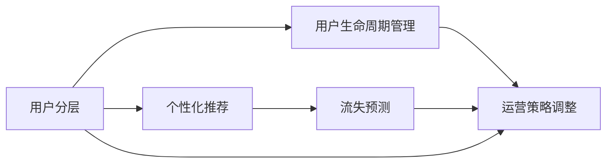

                 

# 知识付费创业中的用户分层运营策略

> 关键词：知识付费, 用户分层, 个性化推荐, 流失预测, 用户生命周期管理

## 1. 背景介绍

随着互联网技术的发展和知识经济的崛起，知识付费作为一种新兴的商业模式，越来越受到人们的青睐。据统计，2021年中国知识付费用户规模已达4.76亿人，市场规模达360亿元人民币。知识付费市场不断扩大，吸引了大批创业者投身其中。但随着市场竞争的加剧，如何有效地运营用户，提升用户满意度和转化率，成为知识付费企业成功的关键。

用户分层运营策略是知识付费企业实现精细化运营、提高用户满意度和转化率的重要手段。通过分析用户行为数据，识别出不同特征的用户群体，并对各层用户进行针对性的运营策略调整，从而提升用户粘性和价值。

## 2. 核心概念与联系

### 2.1 核心概念概述

用户分层运营策略的构建离不开对核心概念的理解：

- **用户分层**：基于用户行为、属性、价值等特征，将用户划分为不同的群体，以便于更精准地进行运营。
- **个性化推荐**：根据用户的个性化需求和偏好，推荐相关的内容，提升用户满意度。
- **流失预测**：通过分析用户行为数据，预测哪些用户可能流失，以便提前进行挽留。
- **用户生命周期管理**：关注用户在企业平台上的全生命周期价值，包括获取、激活、留存、转化和流失等各个阶段，对不同阶段的用户进行相应的运营策略调整。

这些概念之间有紧密的联系。用户分层是基础，个性化推荐和流失预测都是对不同层级用户的行为分析，而用户生命周期管理则是对用户全过程的价值提升和转化。

### 2.2 核心概念原理和架构的 Mermaid 流程图(Mermaid 流程节点中不要有括号、逗号等特殊字符)



## 3. 核心算法原理 & 具体操作步骤
### 3.1 算法原理概述

用户分层运营策略基于用户行为数据分析，将用户划分为不同的层级，并针对不同层级用户采取相应的运营策略。其核心在于通过数据挖掘和机器学习算法，识别用户特征，构建用户画像，并根据画像进行分层。常用的算法包括聚类算法、决策树、随机森林、神经网络等。

### 3.2 算法步骤详解

**Step 1: 数据准备与预处理**

- 收集用户的行为数据，如浏览、学习、购买、评价、流失等。
- 对数据进行清洗和预处理，包括去除噪声、处理缺失值、归一化等。

**Step 2: 用户特征提取**

- 通过特征工程技术，将原始数据转化为有意义的特征。
- 常用的特征包括用户属性、行为特征、时间特征等。

**Step 3: 用户分层**

- 使用聚类算法，如K-Means、层次聚类等，将用户分为不同的群体。
- 常用的评估指标包括轮廓系数、SSE（Sum of Squared Errors）等。

**Step 4: 个性化推荐**

- 根据用户分层结果，使用协同过滤、矩阵分解等算法，推荐个性化内容。
- 常用的推荐算法包括基于用户的协同过滤、基于项目的协同过滤、基于模型的协同过滤等。

**Step 5: 流失预测**

- 使用分类算法，如逻辑回归、决策树、随机森林等，预测用户流失的概率。
- 常用的评估指标包括准确率、召回率、F1值等。

**Step 6: 运营策略调整**

- 根据用户分层和流失预测结果，制定相应的运营策略。
- 对于潜在流失用户，进行预警和挽留；对于高价值用户，进行维护和推荐。

### 3.3 算法优缺点

用户分层运营策略的优点包括：

- **精准营销**：根据不同用户特征，进行有针对性的运营，提升用户满意度。
- **成本控制**：根据用户价值，进行精细化运营，控制运营成本。
- **效率提升**：通过自动化流程，提升运营效率。

其缺点包括：

- **数据依赖**：需要大量的用户行为数据，数据质量会影响分层结果。
- **算法复杂**：涉及多种算法和模型，算法选择和调参较为复杂。
- **动态变化**：用户行为和需求是动态变化的，需要持续进行数据更新和模型训练。

### 3.4 算法应用领域

用户分层运营策略在多个领域都有广泛应用，包括但不限于：

- **知识付费平台**：对付费用户进行分层，提升用户满意度和续订率。
- **在线教育平台**：根据学生行为和成绩，进行个性化推荐和流失预警。
- **电商零售平台**：对用户行为进行建模，进行个性化推荐和促销活动设计。
- **社交媒体平台**：对用户进行兴趣标签分析，进行内容推荐和广告定向。

## 4. 数学模型和公式 & 详细讲解 & 举例说明

### 4.1 数学模型构建

用户分层运营策略的数学模型通常包括用户行为数据建模、用户特征提取、聚类模型构建、个性化推荐模型构建和流失预测模型构建等部分。

### 4.2 公式推导过程

以K-Means算法为例，其基本原理是将用户数据集分成K个簇，使得簇内的用户相似度最大，簇间的相似度最小。

设用户数据集为 $X=\{x_1,x_2,\ldots,x_n\}$，每个用户特征向量为 $x_i=(x_{i1},x_{i2},\ldots,x_{im})$，其中 $m$ 为特征维度。$X$ 的聚类结果为 $C=\{C_1,C_2,\ldots,C_k\}$，$k$ 为簇的个数。

K-Means算法的基本公式如下：

$$
\min_{\mu_1,\mu_2,\ldots,\mu_k} \sum_{i=1}^n\sum_{j=1}^k \frac{(x_i-\mu_j)^2}{2\sigma^2}
$$

其中 $\mu_j$ 为第 $j$ 个簇的质心，$\sigma$ 为方差。

### 4.3 案例分析与讲解

以某知识付费平台为例，使用K-Means算法对用户进行分层，具体步骤如下：

1. 收集用户行为数据，如课程浏览、购买、评价等。
2. 对数据进行预处理，去除噪声和缺失值，归一化数据。
3. 选择K-Means算法，设置聚类个数 $k$。
4. 使用K-Means算法对用户进行聚类，得到 $C=\{C_1,C_2,\ldots,C_k\}$。
5. 对各簇进行分析，找出高价值用户、潜在流失用户和低价值用户。
6. 根据不同用户的特征，制定针对性的运营策略。

## 5. 项目实践：代码实例和详细解释说明
### 5.1 开发环境搭建

在进行用户分层运营策略实践前，需要搭建相应的开发环境。以下是使用Python进行开发的环境配置流程：

1. 安装Anaconda：从官网下载并安装Anaconda，用于创建独立的Python环境。
2. 创建并激活虚拟环境：
```bash
conda create -n user_segmentation python=3.8 
conda activate user_segmentation
```
3. 安装必要的Python包：
```bash
pip install pandas numpy scikit-learn seaborn matplotlib
```

完成上述步骤后，即可在`user_segmentation`环境中开始实践。

### 5.2 源代码详细实现

以下是使用Python进行用户分层运营策略实践的代码实现：

```python
import pandas as pd
import numpy as np
from sklearn.cluster import KMeans
from sklearn.metrics import silhouette_score
from sklearn.preprocessing import StandardScaler

# 读取用户行为数据
df = pd.read_csv('user_behavior.csv')

# 特征选择
features = ['user_id', 'time', 'study_time', 'purchase_time', 'review_score']
X = df[features]

# 数据标准化
scaler = StandardScaler()
X_scaled = scaler.fit_transform(X)

# K-Means聚类
kmeans = KMeans(n_clusters=3, random_state=42)
kmeans.fit(X_scaled)

# 评估聚类效果
silhouette_avg = silhouette_score(X_scaled, kmeans.labels_)
print('Silhouette Score:', silhouette_avg)

# 用户分层结果
labels = kmeans.labels_
```

### 5.3 代码解读与分析

上述代码实现了用户行为数据的处理和K-Means聚类，具体解释如下：

**数据读取**：使用`pd.read_csv`函数读取用户行为数据。
**特征选择**：选择用户行为中的关键特征，如用户ID、时间、学习时间、购买时间和评价得分。
**数据标准化**：使用`StandardScaler`对特征进行标准化处理，避免数据方差过大的影响。
**K-Means聚类**：使用`KMeans`算法对用户进行聚类，设置聚类个数为3。
**聚类效果评估**：使用轮廓系数（silhouette score）评估聚类效果。
**用户分层结果**：输出K-Means聚类得到的用户分层标签。

## 6. 实际应用场景
### 6.1 智能推荐

在知识付费平台中，智能推荐是提升用户满意度和转化率的重要手段。通过用户分层，对不同层次的用户进行个性化推荐，可以显著提升用户的转化率和续订率。

例如，对于高价值用户，可以推荐一些高品质的课程和文章，提升其学习体验。对于潜在流失用户，可以推荐一些便宜或免费课程，激励其继续学习。

### 6.2 流失预警

流失预警是用户分层运营策略的重要应用之一，通过预测用户流失，及时采取措施，可以有效提高用户留存率。

例如，对于频繁流失的用户，可以通过短信或邮件发送挽留信息。对于长期未登录的用户，可以提醒其登录并参与相关活动。

### 6.3 个性化内容推送

通过用户分层，可以针对不同层次的用户，推送个性化内容，提升用户粘性。

例如，对于高价值用户，可以推送一些专业性强、深度高的文章和课程。对于普通用户，可以推送一些轻松有趣的内容，提升其阅读体验。

### 6.4 未来应用展望

随着大数据和人工智能技术的不断发展，用户分层运营策略将会有更多应用场景。未来，用户分层运营策略将更加精准，个性化推荐和流失预测的准确率将更高，用户留存率和转化率也将更高。

## 7. 工具和资源推荐
### 7.1 学习资源推荐

1. **《数据科学实战》**：通过实战案例，介绍了数据科学中的基本技术和方法。
2. **《机器学习实战》**：介绍了机器学习的基本概念和算法，并提供了大量代码实例。
3. **《Python数据分析实战》**：介绍了Python数据分析中的基本方法和技术，包括数据清洗、数据可视化、聚类分析等。
4. **Coursera《机器学习》课程**：由斯坦福大学Andrew Ng教授主讲，系统介绍了机器学习的基本概念和算法。
5. **Kaggle竞赛平台**：提供了大量数据集和竞赛题目，可以实践和提升自己的数据分析和机器学习能力。

### 7.2 开发工具推荐

1. **Jupyter Notebook**：轻量级的交互式开发环境，支持代码、数据和文档的混合展示。
2. **Python IDEs**：如PyCharm、VS Code等，支持Python开发和调试。
3. **Git**：版本控制系统，支持代码管理和协作。
4. **TensorBoard**：可视化工具，可以实时展示模型的训练状态。
5. **PyTorch**：深度学习框架，提供了丰富的API和模型库。

### 7.3 相关论文推荐

1. **《用户行为建模与个性化推荐》**：介绍了用户行为建模和个性化推荐的基本方法和技术。
2. **《K-Means算法》**：介绍了K-Means算法的基本原理和实现方法。
3. **《智能推荐系统》**：介绍了智能推荐系统的基本概念和算法，并提供了大量案例和代码实现。

## 8. 总结：未来发展趋势与挑战
### 8.1 研究成果总结

用户分层运营策略在知识付费平台中得到了广泛应用，通过数据驱动的用户运营，提升了用户满意度和转化率。未来，用户分层运营策略将结合更多先进技术和算法，实现更加精准的用户分层和运营。

### 8.2 未来发展趋势

用户分层运营策略的发展趋势包括以下几个方面：

1. **深度学习技术的应用**：深度学习技术可以更好地处理复杂的数据，提升聚类和推荐的效果。
2. **多模态数据的融合**：通过融合多种数据源，可以提升用户分层的准确性和个性化推荐的精度。
3. **动态数据更新**：用户行为数据是动态变化的，需要持续更新和重新建模。
4. **个性化和定制化**：未来用户分层运营策略将更加个性化和定制化，根据用户需求和偏好，提供更为精准的服务。
5. **数据隐私和安全**：用户数据隐私和安全是重要问题，需要采取相应的技术措施，保护用户隐私。

### 8.3 面临的挑战

用户分层运营策略在实施过程中也面临一些挑战：

1. **数据质量问题**：数据质量差、缺失值多、噪声多等问题，会影响分层的准确性。
2. **算法复杂性**：用户分层和推荐算法较为复杂，需要大量的数据和算法调参。
3. **隐私和伦理问题**：用户数据隐私和伦理问题需要重视，避免数据滥用和用户权益受损。
4. **技术壁垒**：技术门槛较高，需要一定的数据分析和机器学习基础。
5. **成本问题**：数据收集和处理需要大量资源投入，成本较高。

### 8.4 研究展望

未来的研究需要从以下几个方面进行探讨：

1. **高效数据处理技术**：开发高效的数据处理和清洗技术，提升数据质量。
2. **自动化算法调参**：开发自动化算法调参工具，降低算法调参的难度和成本。
3. **数据隐私保护**：研究数据隐私保护技术，保护用户隐私。
4. **深度学习和多模态融合**：研究深度学习和多模态数据的融合技术，提升用户分层的准确性和推荐效果。
5. **模型解释性**：研究模型解释性技术，提升模型的可解释性。

## 9. 附录：常见问题与解答

**Q1: 如何进行用户行为数据收集和处理？**

A: 用户行为数据通常通过网站、App等平台的日志记录获取。具体步骤如下：
1. 确定需要收集的数据项，如点击、浏览、购买、评价等。
2. 设计数据收集方案，包括数据格式、存储方式等。
3. 使用工具收集数据，如Flume、Kafka等。
4. 对数据进行清洗和预处理，包括去重、去除噪声、处理缺失值等。
5. 存储和管理数据，可以使用MySQL、Hadoop等数据库和存储系统。

**Q2: 用户分层有哪些常见的聚类算法？**

A: 用户分层的聚类算法包括K-Means、层次聚类、DBSCAN、谱聚类等。其中，K-Means算法是最常用的算法之一。

**Q3: 如何评估聚类算法的性能？**

A: 聚类算法的性能通常通过聚类中心距离、轮廓系数、SSE（Sum of Squared Errors）等指标进行评估。

**Q4: 如何进行个性化推荐？**

A: 个性化推荐通常基于协同过滤、矩阵分解等算法。常见的推荐系统包括基于用户的协同过滤、基于项目的协同过滤和基于模型的协同过滤等。

**Q5: 如何预测用户流失？**

A: 用户流失预测通常使用分类算法，如逻辑回归、决策树、随机森林等。需要收集用户行为数据，并进行特征工程，最后使用机器学习算法进行预测。

**Q6: 如何实施用户分层运营策略？**

A: 实施用户分层运营策略需要以下步骤：
1. 收集用户行为数据。
2. 对数据进行预处理和特征工程。
3. 使用聚类算法进行用户分层。
4. 根据用户分层结果，制定相应的运营策略。
5. 定期评估运营效果，并持续优化。

---

作者：禅与计算机程序设计艺术 / Zen and the Art of Computer Programming

