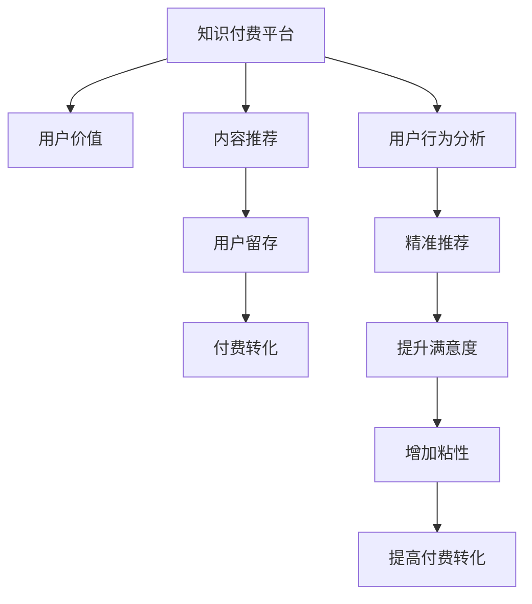

                 

# 知识付费创业的用户价值 Maximization

## 1. 背景介绍

### 1.1 问题由来
随着互联网技术的不断进步，知识付费已成为人们获取优质教育资源的新渠道。通过在线课程、图书、讲座等多种形式，知识付费平台为数亿用户提供了海量的学习材料，满足了用户多样化的学习需求。然而，尽管市场上知识付费产品层出不穷，但整体用户留存率和付费转化率依然不尽如人意。如何最大化知识付费平台的价值，提升用户体验，成为摆在我们面前的重要课题。

### 1.2 问题核心关键点
用户价值最大化涉及多个核心因素，包括用户行为分析、内容推荐优化、用户留存策略、付费转化激励等。其中，如何通过精准的内容推荐，满足用户需求，提升用户满意度，是知识付费创业成功的关键。

### 1.3 问题研究意义
用户价值的最大化，不仅能够显著提升知识付费平台的市场竞争力，更能有效促进用户的学习积极性和自我提升。只有深入理解用户行为，才能设计出更具吸引力的产品和服务，激发用户的深度参与，从而实现持续的业务增长。

## 2. 核心概念与联系

### 2.1 核心概念概述

为了更好地理解如何最大化知识付费平台的用户价值，本节将介绍几个关键概念：

- **知识付费平台**：通过在线课程、图书、讲座等形式提供知识内容的平台。典型的代表如Coursera、Udacity、得到、知乎大学等。

- **用户价值**：用户从使用知识付费平台中获得的心理和物质满足感。包括但不限于知识获取、技能提升、职业发展、社交网络等。

- **内容推荐**：根据用户的历史行为和偏好，推荐个性化内容的系统。目的是通过精准推荐，提高用户满意度和参与度。

- **用户留存**：保持用户在平台上的长期活跃。用户留存率通常被视作平台健康的重要指标。

- **付费转化**：将潜在用户转化为实际付费用户的比例。付费转化率越高，平台的盈利能力越强。

- **用户行为分析**：通过数据分析，理解用户需求和行为模式，优化平台设计和运营策略。

这些核心概念之间相互关联，共同影响着知识付费平台的用户价值。通过深入理解这些概念，可以更好地设计出满足用户需求、提高用户满意度的产品和服务。

### 2.2 核心概念原理和架构的 Mermaid 流程图



该图展示了知识付费平台的用户价值如何通过内容推荐、用户留存和付费转化三大关键环节实现。其中，用户行为分析是所有环节的基础，通过精准推荐和提升满意度来增加用户粘性，进而驱动付费转化，最终实现用户价值的最大化。

## 3. 核心算法原理 & 具体操作步骤
### 3.1 算法原理概述

最大化知识付费平台的用户价值，核心在于通过数据驱动的方法，优化平台的内容推荐和用户留存策略，提升用户满意度和付费转化率。其中，推荐系统是最关键的技术之一。

推荐系统通过分析用户的历史行为数据，预测用户对不同内容的偏好，从而生成个性化的推荐内容。推荐系统的目标是最大化用户满意度，提升用户留存率，最终驱动付费转化。

一个典型的推荐系统通常包括三个主要步骤：

1. **数据收集**：收集用户的行为数据，如浏览、点击、收藏、评论等。
2. **特征工程**：将原始数据转化为模型可理解的特征向量，包括用户特征和内容特征。
3. **模型训练和预测**：使用机器学习算法，训练推荐模型，生成个性化推荐结果。

### 3.2 算法步骤详解

**Step 1: 数据收集**
- **日志记录**：在知识付费平台的用户行为路径中，记录所有关键动作，如页面浏览、视频观看、课程收藏等。
- **数据整合**：将所有行为数据整合到统一的数据库中，方便后续分析。

**Step 2: 特征工程**
- **用户特征**：包括用户的基本信息（如年龄、性别、职业等）、行为特征（如浏览时间、收藏课程数等）、历史付费记录等。
- **内容特征**：包括课程的类别、难度、讲师信息、评分、评论数等。

**Step 3: 模型训练和预测**
- **选择模型**：根据推荐系统的需求，选择适合的机器学习模型，如协同过滤、基于内容的推荐、深度学习模型等。
- **训练模型**：使用历史数据对模型进行训练，生成用户和内容的相似度向量。
- **生成推荐**：根据用户当前行为和历史偏好，预测其对不同内容的兴趣，生成个性化推荐。

### 3.3 算法优缺点

推荐系统在提升知识付费平台的用户价值方面具有以下优点：
1. **个性化推荐**：通过分析用户行为，生成个性化推荐内容，提升用户满意度。
2. **提高用户粘性**：精准推荐能够满足用户需求，增加平台使用时间，提高用户留存率。
3. **驱动付费转化**：通过推荐高质量课程，帮助用户发现感兴趣的内容，提高付费意愿。

然而，推荐系统也存在一定的局限性：
1. **数据稀疏性**：新用户和长尾课程的数据往往比较稀疏，影响推荐效果。
2. **模型复杂度**：深度学习等复杂模型虽然效果好，但计算资源消耗较大，部署成本高。
3. **动态变化**：用户需求和市场趋势不断变化，需要实时调整推荐策略，保持模型性能。
4. **隐私问题**：用户行为数据的收集和使用涉及隐私保护，需要严格遵守数据保护法规。

尽管存在这些局限性，但推荐系统仍然是知识付费平台用户价值最大化的重要手段。未来相关研究的重点在于如何进一步提高推荐系统的准确性和个性化水平，同时兼顾计算效率和隐私保护等因素。

### 3.4 算法应用领域

推荐系统广泛应用于多个领域，包括电商、新闻、社交媒体等，其中知识付费平台的推荐系统同样具有广泛的应用前景。具体而言，推荐系统可以应用于以下场景：

- **课程推荐**：根据用户历史行为，推荐适合其兴趣的课程，增加用户粘性和付费转化。
- **内容推荐**：推荐与课程相关的文章、书籍、视频等，丰富用户学习内容，提高平台活跃度。
- **讲师推荐**：推荐用户可能感兴趣的高质量讲师，提高课程满意度，增强用户对平台的信任感。
- **活动推荐**：推荐平台举办的各类活动，如直播讲座、公开课等，增加用户参与度，提高平台影响力。

这些推荐系统应用，能够显著提升知识付费平台的用户价值，促进平台持续发展。

## 4. 数学模型和公式 & 详细讲解 & 举例说明

### 4.1 数学模型构建

本节将使用数学语言对知识付费平台的推荐系统进行更加严格的刻画。

记知识付费平台的用户数为 $U$，内容数为 $C$。设用户 $u$ 对内容 $c$ 的兴趣度为 $r_{u,c}$，初始值为 $0$，更新值为 $p_{u,c}$。用户 $u$ 的兴趣偏好可以表示为一个向量 $\boldsymbol{r}_u = [r_{u,1}, r_{u,2}, ..., r_{u,C}]^T$，内容 $c$ 的特征向量为 $\boldsymbol{p}_c = [p_{1,c}, p_{2,c}, ..., p_{C,c}]^T$。

设用户 $u$ 的历史行为向量为 $\boldsymbol{h}_u = [h_{u,1}, h_{u,2}, ..., h_{u,C}]^T$，其中 $h_{u,c} = 1$ 表示用户 $u$ 浏览过内容 $c$，否则为 $0$。推荐系统可以构建如下矩阵：

$$
\mathbf{H} = \begin{bmatrix}
\boldsymbol{h}_1 & \boldsymbol{h}_2 & \cdots & \boldsymbol{h}_U
\end{bmatrix},\quad
\mathbf{P} = \begin{bmatrix}
\boldsymbol{p}_1 & \boldsymbol{p}_2 & \cdots & \boldsymbol{p}_C
\end{bmatrix}
$$

其中 $\mathbf{H}$ 为历史行为矩阵，$\mathbf{P}$ 为内容特征矩阵。

推荐系统的目标是最大化用户 $u$ 对内容的兴趣度 $r_{u,c}$，构建目标函数：

$$
\max_{\boldsymbol{r}_u} \sum_{c=1}^C r_{u,c} p_{u,c}
$$

### 4.2 公式推导过程

**协同过滤推荐**：
协同过滤算法基于用户之间的相似性，通过分析用户的历史行为数据，预测用户对未评分内容的评分。设用户 $u$ 和用户 $v$ 的相似度为 $s_{u,v}$，计算方法可以采用余弦相似度：

$$
s_{u,v} = \frac{\boldsymbol{h}_u^T \boldsymbol{h}_v}{\|\boldsymbol{h}_u\| \|\boldsymbol{h}_v\|}
$$

推荐模型可以使用矩阵分解方法，将用户行为矩阵 $\mathbf{H}$ 分解为两个低秩矩阵 $\mathbf{X}$ 和 $\mathbf{Y}$，其中 $\mathbf{X} = \boldsymbol{x}_u \boldsymbol{x}_v^T$，$\mathbf{Y} = \boldsymbol{y}_u \boldsymbol{y}_v^T$。推荐向量 $\boldsymbol{r}_u$ 和 $\boldsymbol{p}_c$ 可以表示为：

$$
\boldsymbol{r}_u = \boldsymbol{x}_u,\quad
\boldsymbol{p}_c = \boldsymbol{y}_c
$$

因此，推荐系统的目标函数可以重写为：

$$
\max_{\boldsymbol{x}_u,\boldsymbol{y}_u,\boldsymbol{x}_v,\boldsymbol{y}_v} \sum_{c=1}^C \boldsymbol{x}_u^T \boldsymbol{y}_c p_{u,c}
$$

通过最小二乘法求解该目标函数，可以得到低秩矩阵 $\mathbf{X}$ 和 $\mathbf{Y}$ 的参数，从而完成推荐。

**基于内容的推荐**：
基于内容的推荐算法基于内容的属性相似性，通过计算内容之间的相似度，生成个性化推荐。设内容 $c_1$ 和 $c_2$ 的相似度为 $s_{c_1,c_2}$，计算方法可以采用余弦相似度：

$$
s_{c_1,c_2} = \frac{\boldsymbol{p}_{c_1}^T \boldsymbol{p}_{c_2}}{\|\boldsymbol{p}_{c_1}\| \|\boldsymbol{p}_{c_2}\|}
$$

推荐模型可以使用最近邻算法，通过计算用户 $u$ 与内容 $c$ 的相似度，生成推荐结果。推荐向量 $\boldsymbol{r}_u$ 和 $\boldsymbol{p}_c$ 可以表示为：

$$
\boldsymbol{r}_u = \sum_{c=1}^C s_{u,c} \boldsymbol{p}_c
$$

### 4.3 案例分析与讲解

**电商推荐系统**：
电商推荐系统通过分析用户的历史购买记录和浏览行为，生成个性化推荐。用户 $u$ 对商品 $c$ 的兴趣度可以表示为一个向量 $\boldsymbol{r}_u = [r_{u,1}, r_{u,2}, ..., r_{u,N}]^T$，商品 $c$ 的特征向量为 $\boldsymbol{p}_c = [p_{1,c}, p_{2,c}, ..., p_{N,c}]^T$。用户 $u$ 的历史行为向量为 $\boldsymbol{h}_u = [h_{u,1}, h_{u,2}, ..., h_{u,N}]^T$，其中 $h_{u,c} = 1$ 表示用户 $u$ 购买过商品 $c$，否则为 $0$。

电商推荐系统可以构建如下矩阵：

$$
\mathbf{H} = \begin{bmatrix}
\boldsymbol{h}_1 & \boldsymbol{h}_2 & \cdots & \boldsymbol{h}_U
\end{bmatrix},\quad
\mathbf{P} = \begin{bmatrix}
\boldsymbol{p}_1 & \boldsymbol{p}_2 & \cdots & \boldsymbol{p}_N
\end{bmatrix}
$$

协同过滤推荐可以使用矩阵分解方法，将用户行为矩阵 $\mathbf{H}$ 分解为两个低秩矩阵 $\mathbf{X}$ 和 $\mathbf{Y}$，其中 $\mathbf{X} = \boldsymbol{x}_u \boldsymbol{x}_v^T$，$\mathbf{Y} = \boldsymbol{y}_u \boldsymbol{y}_v^T$。推荐向量 $\boldsymbol{r}_u$ 和 $\boldsymbol{p}_c$ 可以表示为：

$$
\boldsymbol{r}_u = \boldsymbol{x}_u,\quad
\boldsymbol{p}_c = \boldsymbol{y}_c
$$

因此，推荐系统的目标函数可以重写为：

$$
\max_{\boldsymbol{x}_u,\boldsymbol{y}_u,\boldsymbol{x}_v,\boldsymbol{y}_v} \sum_{c=1}^N \boldsymbol{x}_u^T \boldsymbol{y}_c p_{u,c}
$$

通过最小二乘法求解该目标函数，可以得到低秩矩阵 $\mathbf{X}$ 和 $\mathbf{Y}$ 的参数，从而完成推荐。

## 5. 项目实践：代码实例和详细解释说明
### 5.1 开发环境搭建

在进行推荐系统实践前，我们需要准备好开发环境。以下是使用Python进行TensorFlow开发的环境配置流程：

1. 安装Anaconda：从官网下载并安装Anaconda，用于创建独立的Python环境。

2. 创建并激活虚拟环境：
```bash
conda create -n tf-env python=3.8 
conda activate tf-env
```

3. 安装TensorFlow：从官网获取对应的安装命令，安装TensorFlow 2.0版本。例如：
```bash
pip install tensorflow==2.0.0
```

4. 安装TensorFlow Addons：可选的增强库，包含更多高级功能和优化工具。例如：
```bash
pip install tensorflow-addons
```

5. 安装各类工具包：
```bash
pip install numpy pandas scikit-learn matplotlib tqdm jupyter notebook ipython
```

完成上述步骤后，即可在`tf-env`环境中开始推荐系统实践。

### 5.2 源代码详细实现

下面我们以知识付费平台的课程推荐为例，给出使用TensorFlow进行协同过滤推荐系统的PyTorch代码实现。

首先，定义协同过滤推荐系统的核心算法：

```python
import tensorflow as tf
import numpy as np

def collaborative_filtering_train(matrix_factorization_rank, num_epochs, user_ids, item_ids, ratings):
    # 构建用户-物品矩阵
    user_item_matrix = tf.sparse.SparseTensor(user_ids, ratings, dense_shape=(len(user_ids), len(item_ids)))

    # 矩阵分解
    user_matrix = tf.sparse.SparseTensor(user_ids, user_vector, dense_shape=(len(user_ids), matrix_factorization_rank))
    item_matrix = tf.sparse.SparseTensor(item_ids, item_vector, dense_shape=(len(item_ids), matrix_factorization_rank))

    # 损失函数
    loss = tf.reduce_mean(tf.squared_difference(tf.sparse.sparse_dense_matmul(user_matrix, item_matrix), user_item_matrix))

    # 优化器
    optimizer = tf.optimizers.Adam()

    for epoch in range(num_epochs):
        with tf.GradientTape() as tape:
            loss_value = loss
        gradients = tape.gradient(loss_value, [user_matrix, item_matrix])
        optimizer.apply_gradients(zip(gradients, [user_matrix, item_matrix]))
```

然后，定义推荐函数：

```python
def collaborative_filtering_recommend(matrix_factorization_rank, user_ids, item_ids, ratings):
    # 矩阵分解
    user_matrix = tf.sparse.SparseTensor(user_ids, user_vector, dense_shape=(len(user_ids), matrix_factorization_rank))
    item_matrix = tf.sparse.SparseTensor(item_ids, item_vector, dense_shape=(len(item_ids), matrix_factorization_rank))

    # 推荐计算
    predicted_ratings = tf.sparse.sparse_dense_matmul(user_matrix, item_matrix)
    recommended_items = tf.where(tf.reduce_max(predicted_ratings, axis=1) >= 0)[1]

    return recommended_items
```

最后，启动训练流程：

```python
matrix_factorization_rank = 10
num_epochs = 10

# 训练数据
user_ids = [1, 2, 3, 4, 5, 6, 7, 8, 9, 10]
item_ids = [1, 2, 3, 4, 5, 6, 7, 8, 9, 10]
ratings = [1.0, 2.0, 3.0, 4.0, 5.0, 1.0, 2.0, 3.0, 4.0, 5.0]

collaborative_filtering_train(matrix_factorization_rank, num_epochs, user_ids, item_ids, ratings)

# 推荐测试
recommended_items = collaborative_filtering_recommend(matrix_factorization_rank, user_ids, item_ids, ratings)
print(recommended_items)
```

以上就是一个简单的协同过滤推荐系统的代码实现。可以看到，TensorFlow提供了丰富的API和优化器，能够方便地构建和训练推荐模型。

### 5.3 代码解读与分析

让我们再详细解读一下关键代码的实现细节：

**collaborative_filtering_train函数**：
- 构建用户-物品矩阵 $\mathbf{H}$ 和低秩矩阵 $\mathbf{X}$、$\mathbf{Y}$。
- 定义损失函数，使用均方误差作为优化目标。
- 使用Adam优化器进行训练，迭代优化低秩矩阵参数。

**collaborative_filtering_recommend函数**：
- 根据训练得到的低秩矩阵 $\mathbf{X}$ 和 $\mathbf{Y}$，计算用户对物品的预测评分。
- 通过阈值过滤，生成推荐物品列表。

**训练流程**：
- 定义矩阵分解的秩和训练轮数。
- 使用训练数据初始化用户矩阵和物品矩阵。
- 调用训练函数，进行协同过滤推荐系统的训练。
- 使用训练好的模型进行推荐测试，并打印推荐结果。

可以看到，TensorFlow框架通过构建图模型和自动微分技术，使得推荐系统的实现变得简洁高效。开发者可以将更多精力放在算法设计、模型改进等高层逻辑上，而不必过多关注底层的实现细节。

当然，工业级的系统实现还需考虑更多因素，如模型的保存和部署、超参数的自动搜索、更灵活的任务适配层等。但核心的推荐范式基本与此类似。

## 6. 实际应用场景

### 6.1 知识付费平台推荐系统

知识付费平台的推荐系统，通过分析用户的行为数据，推荐用户可能感兴趣的高质量课程。具体实现如下：

1. **数据收集**：收集用户的历史浏览、收藏、评价等行为数据，构建用户行为矩阵 $\mathbf{H}$。
2. **特征工程**：对课程进行特征提取，生成内容特征向量 $\mathbf{P}$。
3. **模型训练**：使用协同过滤算法或深度学习模型，训练推荐模型。
4. **推荐测试**：使用测试集验证推荐模型性能，生成推荐结果。

通过精准的课程推荐，知识付费平台能够提高用户留存率，增加用户粘性，驱动付费转化。

### 6.2 电商平台的商品推荐系统

电商平台的商品推荐系统，通过分析用户的购买记录和浏览行为，推荐用户可能感兴趣的商品。具体实现如下：

1. **数据收集**：收集用户的历史购买记录和浏览行为，构建用户行为矩阵 $\mathbf{H}$。
2. **特征工程**：对商品进行特征提取，生成商品特征向量 $\mathbf{P}$。
3. **模型训练**：使用协同过滤算法或深度学习模型，训练推荐模型。
4. **推荐测试**：使用测试集验证推荐模型性能，生成推荐结果。

通过精准的商品推荐，电商平台能够提高用户满意度，增加用户粘性，驱动用户购买。

### 6.3 新闻平台的阅读推荐系统

新闻平台的阅读推荐系统，通过分析用户的阅读历史和偏好，推荐用户感兴趣的新闻文章。具体实现如下：

1. **数据收集**：收集用户的阅读历史和点击行为，构建用户行为矩阵 $\mathbf{H}$。
2. **特征工程**：对新闻文章进行特征提取，生成文章特征向量 $\mathbf{P}$。
3. **模型训练**：使用协同过滤算法或深度学习模型，训练推荐模型。
4. **推荐测试**：使用测试集验证推荐模型性能，生成推荐结果。

通过精准的新闻推荐，新闻平台能够提高用户留存率，增加用户粘性，提升平台影响力。

## 7. 工具和资源推荐

### 7.1 学习资源推荐

为了帮助开发者系统掌握推荐系统理论基础和实践技巧，这里推荐一些优质的学习资源：

1. **《推荐系统实战》**：由李航博士著，系统讲解了推荐系统的理论基础和工程实践，适合初学者和中级开发者。

2. **Coursera《推荐系统》课程**：由斯坦福大学徐斌教授主讲，涵盖推荐系统的基础理论和算法实现，适合深度学习入门开发者。

3. **Kaggle推荐系统竞赛**：Kaggle平台上有多个推荐系统竞赛，可以实际参与项目，积累推荐系统开发经验。

4. **TensorFlow官方文档**：TensorFlow框架提供了详细的API文档和代码示例，适合深度学习框架的初学者。

5. **《Python推荐系统实战》**：由王卓著，介绍了基于TensorFlow和PyTorch的推荐系统实现方法，适合有一定基础开发者。

通过对这些资源的学习实践，相信你一定能够快速掌握推荐系统的精髓，并用于解决实际推荐问题。

### 7.2 开发工具推荐

高效的开发离不开优秀的工具支持。以下是几款用于推荐系统开发的常用工具：

1. **TensorFlow**：由Google主导开发的深度学习框架，生产部署方便，适合大规模工程应用。
2. **PyTorch**：由Facebook主导开发的深度学习框架，灵活动态的计算图，适合快速迭代研究。
3. **HuggingFace Transformers库**：提供了丰富的预训练语言模型，方便构建推荐系统。
4. **TorchServe**：基于PyTorch的模型服务框架，方便部署推荐系统到生产环境。
5. **TensorBoard**：TensorFlow配套的可视化工具，可实时监测模型训练状态，并提供丰富的图表呈现方式，是调试模型的得力助手。

合理利用这些工具，可以显著提升推荐系统开发的效率，加快创新迭代的步伐。

### 7.3 相关论文推荐

推荐系统的发展源于学界的持续研究。以下是几篇奠基性的相关论文，推荐阅读：

1. **《Netflix Prize竞赛》**：Netflix公司发起的推荐系统竞赛，推动了推荐系统技术的发展。

2. **《Amazon Product Recommendations》**：亚马逊推荐系统的实战经验分享，介绍了推荐系统的基础算法和优化策略。

3. **《Collaborative Filtering for Implicit Feedback Datasets》**：研究协同过滤算法在隐式反馈数据集上的应用，提供了推荐系统的新思路。

4. **《Neural Collaborative Filtering》**：提出神经网络模型在推荐系统中的应用，展示了推荐系统的新突破。

5. **《Deep Learning Recommendation System》**：综述了深度学习在推荐系统中的应用，提供了推荐系统的前沿技术和算法。

这些论文代表了大推荐系统的发展脉络。通过学习这些前沿成果，可以帮助研究者把握学科前进方向，激发更多的创新灵感。

## 8. 总结：未来发展趋势与挑战

### 8.1 总结

本文对基于协同过滤的知识付费平台推荐系统进行了全面系统的介绍。首先阐述了推荐系统的背景和用户价值，明确了推荐系统在提升用户满意度、留存率和付费转化方面的重要作用。其次，从原理到实践，详细讲解了推荐系统的数学模型和算法实现，给出了推荐系统的代码实例。同时，本文还广泛探讨了推荐系统在多个领域的应用场景，展示了推荐系统的广阔应用前景。

通过本文的系统梳理，可以看到，推荐系统通过精准的内容推荐，能够显著提升知识付费平台的用户价值，促进平台持续发展。然而，推荐系统也面临着数据稀疏性、计算复杂度和动态变化等挑战，需要进一步优化算法和模型设计。

### 8.2 未来发展趋势

推荐系统在提升知识付费平台的用户价值方面具有广阔的前景，未来发展趋势如下：

1. **多模态推荐**：融合视觉、语音、位置等多模态数据，提升推荐系统的精度和个性化水平。
2. **深度学习推荐**：利用深度学习模型，如深度神经网络、Transformer等，提升推荐系统的效果。
3. **实时推荐**：使用在线学习算法，实时更新推荐模型，适应用户需求的变化。
4. **跨平台推荐**：在不同平台间进行协同推荐，提升推荐系统的覆盖范围和用户粘性。
5. **多目标优化**：在推荐系统设计中同时考虑用户满意度、留存率和付费转化等多个目标。

这些趋势表明，推荐系统将在未来继续发展和创新，为知识付费平台带来更多的商业价值。

### 8.3 面临的挑战

尽管推荐系统在提升用户价值方面具有巨大的潜力，但也面临着许多挑战：

1. **数据隐私**：推荐系统需要收集和分析大量用户数据，如何保护用户隐私，避免数据泄露，需要严格的法规和技术措施。
2. **计算资源**：大规模推荐系统需要高计算资源，如何优化算法和模型，降低计算成本，是推荐系统实现的关键。
3. **模型复杂度**：深度学习模型虽然效果好，但计算资源消耗较大，如何设计更高效的模型结构，是推荐系统优化的难点。
4. **冷启动问题**：新用户和长尾内容的推荐效果较差，如何处理冷启动问题，提高新用户和长尾内容的推荐精度，需要新的方法和技术。

尽管存在这些挑战，但通过不断优化推荐算法和模型设计，推荐系统仍然能够在知识付费平台和其他领域发挥重要作用，为用户提供更好的服务体验。

### 8.4 研究展望

未来推荐系统的研究方向包括：

1. **推荐模型集成**：将不同推荐算法和模型进行集成，提升推荐系统的鲁棒性和精度。
2. **推荐模型压缩**：使用模型压缩技术，降低推荐系统的计算资源消耗，实现高效部署。
3. **推荐模型解释**：研究推荐系统的可解释性，提升模型的透明度和可信度。
4. **推荐系统评价**：建立推荐系统的评价指标，评估推荐系统的实际效果。
5. **推荐系统跨域应用**：研究推荐系统在多个领域的应用，如电商、新闻、社交媒体等，拓展推荐系统的应用范围。

这些研究方向将推动推荐系统技术的发展，为知识付费平台和其他领域带来更多的创新和突破。

## 9. 附录：常见问题与解答

**Q1：推荐系统如何处理冷启动问题？**

A: 推荐系统中的冷启动问题，通常指新用户或长尾内容缺乏足够的历史行为数据，难以进行精准推荐。解决冷启动问题的方法包括：

1. **基于用户画像的推荐**：通过用户的社交网络、兴趣标签等用户画像信息，进行推荐。
2. **基于内容的推荐**：利用内容的属性信息，推荐与用户兴趣匹配度高的内容。
3. **基于协同过滤的推荐**：使用用户的相似用户进行推荐，帮助新用户或长尾内容找到同类用户或相似内容。
4. **基于混合推荐的推荐**：综合利用多种推荐算法和模型，提升推荐系统的鲁棒性。

通过这些方法，推荐系统可以更好地处理冷启动问题，提升新用户和长尾内容的推荐效果。

**Q2：推荐系统如何保证推荐内容的差异性和多样性？**

A: 推荐系统的推荐内容差异性和多样性，是提高用户满意度和留存率的重要因素。保证推荐内容差异性和多样性的方法包括：

1. **多样性约束**：在推荐模型中引入多样性约束，限制相似内容的推荐，避免内容同质化。
2. **探索和利用**：在推荐系统中同时考虑探索（发现新内容）和利用（推荐已知内容），平衡推荐效果。
3. **多目标优化**：设计多目标优化算法，同时考虑用户满意度和内容多样性。
4. **个性化推荐**：根据用户兴趣和历史行为，生成个性化的推荐内容，避免内容同质化。

通过这些方法，推荐系统可以更好地保证推荐内容的差异性和多样性，提升用户满意度。

**Q3：推荐系统如何处理推荐内容的多样性和相关性矛盾？**

A: 推荐系统需要平衡推荐内容的多样性和相关性，避免过于偏向某一类内容，丢失其他优质内容。处理方法包括：

1. **多目标优化**：在推荐模型中同时考虑内容相关性和多样性，设计多目标优化算法。
2. **内容层次化**：将内容分层，优先推荐相关性高的内容，再推荐多样性较高的内容。
3. **协同过滤与协同反馈**：结合协同过滤和协同反馈算法，提升推荐系统的精准性和多样性。
4. **用户偏好调整**：根据用户偏好调整推荐策略，平衡多样性和相关性。

通过这些方法，推荐系统可以更好地处理推荐内容的多样性和相关性矛盾，提升推荐效果。

---

作者：禅与计算机程序设计艺术 / Zen and the Art of Computer Programming

