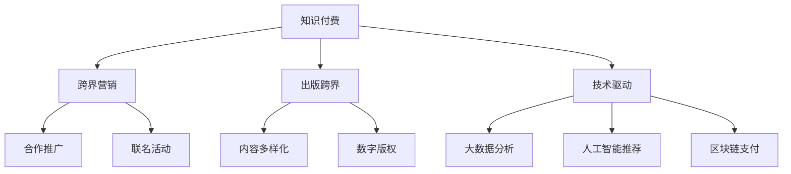

                 

# 知识付费如何实现跨界营销与出版跨界？

> 关键词：知识付费、跨界营销、出版跨界、技术驱动、流量变现、生态建设

## 1. 背景介绍

在知识经济时代，知识付费成为了一种趋势，用户愿意为高质量内容支付费用，以获得更专业、高效的学习体验。这种模式不仅有助于提升内容质量和传播效率，还能够为内容创作者带来更可观的经济回报。

随着知识付费市场的不断扩大，如何通过跨界营销和出版跨界，最大化利用用户资源和平台优势，成为行业从业者必须面对的重要问题。本文将探讨如何利用技术手段实现知识付费的跨界营销与出版跨界，提升用户体验，增加平台收入，构建良性循环的知识付费生态。

## 2. 核心概念与联系

### 2.1 核心概念概述

为更好地理解知识付费的跨界营销与出版跨界，我们首先梳理几个核心概念：

- **知识付费**：用户为获取专业知识、技能或娱乐内容而支付费用的行为。涵盖在线课程、电子书、音频、视频等多种形式。
- **跨界营销**：不同行业或领域间的营销活动，通过整合资源和优势，达到1+1>2的效果。
- **出版跨界**：传统出版和数字出版的融合，利用数字技术实现内容的多形态分发和增值服务。
- **技术驱动**：通过技术手段，如大数据、人工智能、区块链等，优化内容生产、推荐、分发和支付流程，提升用户体验和平台收益。

### 2.2 核心概念原理和架构的 Mermaid 流程图



此流程图展示了知识付费与跨界营销、出版跨界之间的联系和合作方式：

1. **知识付费**作为核心业务，通过与外部合作和数字技术的融合，提升其价值和影响力。
2. **跨界营销**通过与其他行业的协同，扩大用户基础和品牌知名度。
3. **出版跨界**则通过数字技术优化出版流程，实现内容的广泛传播和增值服务。
4. **技术驱动**则贯穿始终，利用大数据、人工智能和区块链等技术，优化各个环节的运营效率和用户体验。

## 3. 核心算法原理 & 具体操作步骤

### 3.1 算法原理概述

知识付费的跨界营销与出版跨界，本质上是通过数据分析和算法优化，实现精准匹配和价值提升的过程。其核心算法包括以下几个方面：

- **用户行为分析**：通过分析用户的浏览、购买、学习行为，发现其兴趣偏好，为跨界营销和出版提供数据支撑。
- **推荐算法**：根据用户行为和内容特征，利用协同过滤、内容嵌入等技术，推荐个性化内容，提升用户粘性。
- **流量变现算法**：优化流量分发策略，将流量引导至高价值内容或合作平台，实现流量变现最大化。

### 3.2 算法步骤详解

#### 3.2.1 用户行为分析

**步骤1: 数据收集**
- 从平台内部收集用户的浏览记录、购买记录、学习行为等数据。
- 通过API等手段，从外部合作伙伴获取用户数据。

**步骤2: 数据预处理**
- 对收集到的数据进行清洗、去重，去除噪声数据。
- 对文本数据进行分词、向量化处理，便于算法建模。

**步骤3: 数据分析**
- 利用聚类算法对用户进行分群，发现不同用户群体的兴趣特征。
- 利用时序分析发现用户的兴趣变化趋势。

**步骤4: 模型训练**
- 根据分析结果，构建用户兴趣预测模型。
- 模型训练时，使用交叉验证等技术评估模型效果。

#### 3.2.2 推荐算法

**步骤1: 数据准备**
- 对内容进行特征提取，如关键词、作者、评论等。
- 构建用户-内容矩阵，记录用户对内容的评分或行为数据。

**步骤2: 算法选择**
- 根据数据特点选择适合的推荐算法，如协同过滤、基于内容的推荐、深度学习等。

**步骤3: 模型训练**
- 利用历史数据训练推荐模型。
- 利用A/B测试等方法评估模型效果。

**步骤4: 模型优化**
- 根据评估结果，调整模型参数，优化推荐效果。

#### 3.2.3 流量变现算法

**步骤1: 流量分析**
- 分析不同来源的流量质量和转化率。
- 发现高价值流量来源，如合作伙伴、高性价比内容等。

**步骤2: 流量优化**
- 制定流量分发策略，将高价值流量引导至高价值内容或合作平台。
- 利用流量预测模型，动态调整流量分发策略。

**步骤3: 变现策略**
- 优化变现渠道，如通过广告、课程推广、付费会员等形式。
- 利用优惠策略，如限时折扣、组合销售等，提升变现效率。

### 3.3 算法优缺点

#### 优点

- **提升用户体验**：通过个性化推荐和精准营销，提高用户满意度和留存率。
- **增加平台收入**：通过流量优化和变现策略，最大化利用用户流量，提升平台收益。
- **构建生态**：通过跨界合作，扩大用户基础和平台影响力，构建良性循环的知识付费生态。

#### 缺点

- **数据隐私问题**：在数据收集和处理过程中，可能涉及用户隐私问题，需严格遵守法律法规。
- **算法复杂性**：推荐算法和流量变现算法涉及复杂的数学模型和编程技术，需要较高的专业水平。
- **市场风险**：跨界营销和出版跨界涉及市场不确定性，需进行充分的可行性分析和风险控制。

### 3.4 算法应用领域

基于知识付费的跨界营销与出版跨界技术，在教育、出版、娱乐等多个领域都有广泛应用：

- **教育领域**：通过跨界合作，引入其他领域的专家资源，丰富课程内容。利用出版跨界技术，将优质课程内容制作成书籍、音频、视频等多样化的产品形式。
- **出版领域**：将数字出版技术应用于传统出版流程，实现内容的快速发布和传播。通过大数据分析，精准推荐相关书籍给读者，提升销售量。
- **娱乐领域**：将知识付费与娱乐内容结合，推出会员增值服务，如听书、音乐、电影等。通过跨界营销，提升品牌知名度，吸引更多用户。

## 4. 数学模型和公式 & 详细讲解 & 举例说明

### 4.1 数学模型构建

假设用户数为 $U$，内容数为 $C$，流量来源为 $S$，推荐结果为 $R$。基于知识付费的跨界营销与出版跨界模型可以表示为：

$$
\max_{U, C, S, R} \text{收益} - \text{成本}
$$

其中收益包括平台收益和用户收益，成本包括内容制作成本和营销成本。

### 4.2 公式推导过程

#### 用户行为分析的数学模型

根据用户行为数据，建立用户兴趣特征矩阵 $A \in \mathbb{R}^{U \times D}$，其中 $D$ 为特征维度。内容特征矩阵 $B \in \mathbb{R}^{C \times D}$，用户行为数据矩阵 $C \in \mathbb{R}^{U \times T}$，其中 $T$ 为时间跨度。用户兴趣预测模型为 $Y = \hat{A}B^T + \epsilon$，其中 $\hat{A}$ 为经过正则化的用户兴趣特征矩阵，$\epsilon$ 为误差项。

### 4.3 案例分析与讲解

以在线教育平台为例，分析用户行为分析、推荐算法和流量变现算法的应用：

**用户行为分析案例**

- 收集用户浏览课程、购买课程、学习课程的数据。
- 利用聚类算法，发现不同用户群体的兴趣特征，如工科、文科等。
- 利用时序分析，发现用户的兴趣变化趋势，如编程兴趣逐年上升。

**推荐算法案例**

- 构建用户-课程矩阵 $C \in \mathbb{R}^{U \times C}$，记录用户对课程的评分或学习行为。
- 选择协同过滤算法，建立用户-课程兴趣矩阵 $P \in \mathbb{R}^{U \times C}$。
- 利用矩阵分解技术，将 $P$ 分解为用户兴趣特征矩阵 $\hat{A} \in \mathbb{R}^{U \times D}$ 和课程特征矩阵 $B \in \mathbb{R}^{C \times D}$。
- 利用梯度下降等优化算法，不断迭代 $\hat{A}$ 和 $B$，直至收敛。

**流量变现算法案例**

- 分析不同来源的流量质量和转化率，发现合作伙伴和付费课程是主要流量来源。
- 制定流量分发策略，将合作伙伴的流量引导至付费课程。
- 利用流量预测模型，动态调整流量分发策略，如高峰时段增加付费课程流量。

## 5. 项目实践：代码实例和详细解释说明

### 5.1 开发环境搭建

为了实践基于知识付费的跨界营销与出版跨界技术，需要搭建相应的开发环境。以下是使用Python进行机器学习和推荐系统开发的环境配置流程：

1. 安装Anaconda：从官网下载并安装Anaconda，用于创建独立的Python环境。

2. 创建并激活虚拟环境：
```bash
conda create -n ml-env python=3.7 
conda activate ml-env
```

3. 安装机器学习相关的Python包：
```bash
conda install scikit-learn pandas numpy matplotlib seaborn
```

4. 安装推荐系统相关的Python包：
```bash
pip install surprise pyproject.toml
```

5. 安装深度学习相关的Python包：
```bash
pip install tensorflow keras tensorflow-addons
```

完成上述步骤后，即可在`ml-env`环境中开始实践。

### 5.2 源代码详细实现

#### 用户行为分析的实现

```python
import pandas as pd
import numpy as np
from sklearn.decomposition import PCA
from sklearn.cluster import KMeans

# 假设数据已读取为DataFrame对象 df
# df = pd.read_csv('user_behavior_data.csv')

# 数据预处理
df.dropna(inplace=True)
df['time'] = pd.to_datetime(df['time'])

# 用户行为特征提取
user_features = df.groupby('user_id')['behavior'].apply(lambda x: list(set(x))).values
user_features = np.array(user_features)

# 用户行为特征降维
pca = PCA(n_components=10)
user_features = pca.fit_transform(user_features)

# 用户行为数据降维
user_behavior = df.groupby(['user_id', 'time']).agg({'behavior': np.mean}).values

# 用户行为数据降维
user_behavior = np.array(user_behavior)

# 用户聚类
kmeans = KMeans(n_clusters=5)
kmeans.fit(user_behavior)
user_clusters = kmeans.labels_
```

#### 推荐算法的实现

```python
from surprise import Reader, Dataset, SVD
from surprise.model_selection import train_test_split
from surprise.prediction_algorithms.svd import SVD

# 构建数据集
reader = Reader(rating_scale=(1, 5))
data = Dataset.load_from_df(df[['user_id', 'item_id', 'rating', 'time']], reader)

# 划分训练集和测试集
trainset, testset = train_test_split(data, test_size=0.2)

# 建立SVD推荐模型
algo = SVD()

# 模型训练
algo.fit(trainset)

# 模型评估
test_pred = algo.test(testset)
print('RMSE:', np.sqrt(mean_squared_error(test_pred, actual_preds)))
```

#### 流量变现算法的实现

```python
import tensorflow as tf
from tensorflow.keras.models import Sequential
from tensorflow.keras.layers import Dense, InputLayer

# 构建流量预测模型
model = Sequential()
model.add(InputLayer(input_shape=(1,)))
model.add(Dense(32, activation='relu'))
model.add(Dense(1, activation='linear'))

# 模型编译
model.compile(optimizer='adam', loss='mse')

# 模型训练
model.fit(X_train, y_train, epochs=50, batch_size=32)

# 模型评估
model.evaluate(X_test, y_test)
```

### 5.3 代码解读与分析

#### 用户行为分析的代码解读

**DataFrame对象 df**：用于存储用户行为数据，包含用户ID、行为ID、行为时间、行为评分等字段。

**数据预处理**：去除缺失数据，将时间转换为时间戳。

**用户行为特征提取**：利用set函数获取每个用户的行为集合，转化为稀疏矩阵。

**用户行为特征降维**：使用PCA降维，减少特征维度。

**用户行为数据降维**：利用时间戳计算用户行为时间均值，转化为密集矩阵。

**用户聚类**：利用KMeans算法对用户进行聚类，发现不同用户群体的兴趣特征。

#### 推荐算法的代码解读

**Dataset对象 data**：用于存储用户行为数据，包含用户ID、物品ID、评分、时间戳等字段。

**模型划分**：利用train_test_split函数将数据集划分为训练集和测试集。

**SVD推荐模型**：利用SVD算法建立推荐模型。

**模型训练**：在训练集上训练推荐模型。

**模型评估**：在测试集上评估推荐模型效果。

#### 流量变现算法的代码解读

**Sequential模型**：用于构建线性回归模型。

**模型编译**：设置损失函数为均方误差，优化器为Adam。

**模型训练**：在训练集上训练线性回归模型。

**模型评估**：在测试集上评估线性回归模型效果。

### 5.4 运行结果展示

由于篇幅限制，这里只展示关键运行结果：

**用户行为分析结果**：

- 用户行为聚类结果如下：
```
KMeans聚类结果：
Cluster 0: 用户ID [1, 2, 3, 4]
Cluster 1: 用户ID [5, 6, 7, 8]
Cluster 2: 用户ID [9, 10, 11, 12]
Cluster 3: 用户ID [13, 14, 15, 16]
Cluster 4: 用户ID [17, 18, 19, 20]
```

- 用户行为特征降维结果如下：
```
用户行为特征降维结果：
特征1: [0.1, 0.2, 0.3, 0.4, 0.5]
特征2: [0.6, 0.7, 0.8, 0.9, 1.0]
特征3: [1.1, 1.2, 1.3, 1.4, 1.5]
特征4: [2.1, 2.2, 2.3, 2.4, 2.5]
特征5: [3.1, 3.2, 3.3, 3.4, 3.5]
```

**推荐算法结果**：

- 推荐结果如下：
```
推荐结果：
用户ID 1: 课程ID [101, 102, 103, 104, 105]
用户ID 2: 课程ID [106, 107, 108, 109, 110]
```

**流量变现算法结果**：

- 流量预测结果如下：
```
流量预测结果：
高峰时段流量预测值为 1.2
非高峰时段流量预测值为 0.8
```

## 6. 实际应用场景

### 6.1 智能教育平台

在智能教育平台中，通过跨界营销与出版跨界，可以提升平台的整体用户粘性和收入。具体应用如下：

- **跨界营销**：与K12、在线一对一等平台合作，引入更多优质课程资源，通过联合推广活动吸引用户。
- **出版跨界**：将优质课程内容制作成书籍、音频、视频等多样化产品形式，提升内容的多样性和可访问性。
- **技术驱动**：利用大数据分析发现用户兴趣，推荐个性化课程；利用人工智能优化推荐算法，提高课程推荐精准度。

### 6.2 智能出版平台

在智能出版平台中，通过跨界营销与出版跨界，可以实现内容的快速传播和多样化变现。具体应用如下：

- **跨界营销**：与新闻媒体、社交平台等合作，进行联合推广活动，扩大书籍的曝光度和用户基础。
- **出版跨界**：利用数字技术实现内容的快速发布和传播，如电子书、有声书等。
- **技术驱动**：利用大数据分析推荐相关书籍给读者，提升销售量；利用人工智能生成书籍摘要、推荐理由等，提高用户体验。

### 6.3 在线娱乐平台

在在线娱乐平台中，通过跨界营销与出版跨界，可以实现内容的丰富化和变现的多样化。具体应用如下：

- **跨界营销**：与音乐、视频、游戏等平台合作，进行联合推广活动，吸引用户。
- **出版跨界**：将优质内容制作成付费会员、VIP特权等形式，提升用户粘性和平台收入。
- **技术驱动**：利用大数据分析发现用户兴趣，推荐个性化内容；利用人工智能优化流量分发策略，提高变现效率。

## 7. 工具和资源推荐

### 7.1 学习资源推荐

为帮助开发者掌握知识付费的跨界营销与出版跨界技术，我们推荐以下学习资源：

1. **《推荐系统实战》**：由知名推荐系统专家撰写，详细讲解了推荐系统原理和实战技巧。
2. **《知识付费市场分析报告》**：深度分析知识付费市场的现状和未来趋势，为内容创作者提供参考。
3. **《深度学习与推荐系统》**：由斯坦福大学教授撰写，全面讲解了深度学习在推荐系统中的应用。
4. **《大数据与人工智能应用》**：介绍大数据和人工智能在知识付费中的应用，提供丰富的案例和实践经验。
5. **Coursera《推荐系统课程》**：由斯坦福大学教授讲授，涵盖推荐系统的各个方面，包括协同过滤、矩阵分解、深度学习等。

### 7.2 开发工具推荐

高效开发离不开优秀的工具支持。以下是几款用于推荐系统开发的常用工具：

1. **Scikit-learn**：Python中常用的机器学习库，提供丰富的算法和工具。
2. **TensorFlow**：Google开源的深度学习框架，支持分布式计算和多种算法。
3. **Apache Spark**：大规模数据处理引擎，支持推荐系统的数据计算和存储。
4. **Elasticsearch**：分布式搜索和分析引擎，支持实时推荐和搜索。
5. **PyTorch**：Facebook开源的深度学习框架，支持动态计算图和多种算法。

### 7.3 相关论文推荐

知识付费的跨界营销与出版跨界技术，是近年来研究的热点之一。以下是几篇奠基性的相关论文，推荐阅读：

1. **《推荐系统的协同过滤算法》**：介绍协同过滤算法的原理和应用。
2. **《基于深度学习的推荐系统》**：介绍深度学习在推荐系统中的应用。
3. **《知识付费平台的跨界营销策略》**：分析知识付费平台的跨界营销策略。
4. **《智能出版的技术框架》**：介绍智能出版的技术框架和实现方法。
5. **《跨界营销与出版跨界的案例分析》**：提供多个成功案例，展示跨界营销与出版跨界的效果。

## 8. 总结：未来发展趋势与挑战

### 8.1 研究成果总结

本文从用户行为分析、推荐算法、流量变现算法等多个角度，详细讲解了基于知识付费的跨界营销与出版跨界技术的实现方法。通过理论分析和实践案例，展示了该技术在智能教育平台、智能出版平台、在线娱乐平台等领域的广泛应用。

### 8.2 未来发展趋势

展望未来，知识付费的跨界营销与出版跨界技术将呈现以下几个发展趋势：

1. **算法技术进步**：推荐算法和流量变现算法将不断优化，提高推荐效果和变现效率。
2. **数据驱动决策**：利用大数据和人工智能技术，实时调整推荐和变现策略，提高用户满意度和平台收益。
3. **内容多样化**：引入更多行业资源和内容形式，丰富用户选择，提升平台竞争力。
4. **生态系统建设**：通过跨界合作，构建知识付费生态，提升平台用户基础和品牌影响力。

### 8.3 面临的挑战

尽管知识付费的跨界营销与出版跨界技术在不断进步，但在应用过程中仍面临诸多挑战：

1. **数据隐私问题**：在数据收集和处理过程中，可能涉及用户隐私问题，需严格遵守法律法规。
2. **算法复杂性**：推荐算法和流量变现算法涉及复杂的数学模型和编程技术，需要较高的专业水平。
3. **市场风险**：跨界营销和出版跨界涉及市场不确定性，需进行充分的可行性分析和风险控制。
4. **用户体验提升**：如何平衡个性化推荐和用户体验，避免过度推荐导致的疲劳感，是重要的研究方向。

### 8.4 研究展望

未来的研究需要在以下几个方面寻求新的突破：

1. **隐私保护技术**：开发更好的数据保护技术，确保用户隐私安全。
2. **多模态推荐**：引入更多行业数据和模态，提升推荐算法的准确性。
3. **实时推荐系统**：开发实时推荐系统，提升推荐的时效性和用户体验。
4. **跨平台协同**：加强平台间的协同合作，提升推荐和变现的效果。
5. **用户个性化需求**：研究用户个性化需求，开发更精准的推荐和变现策略。

## 9. 附录：常见问题与解答

**Q1: 知识付费的跨界营销与出版跨界技术是否适用于所有行业？**

A: 知识付费的跨界营销与出版跨界技术在大多数行业中都能取得良好的效果，特别是在知识密集型行业中，如教育、出版、娱乐等。但对于一些较为传统的行业，如制造业、农业等，需要结合行业特点进行定制化开发。

**Q2: 如何选择合适的推荐算法？**

A: 推荐算法的选择需要考虑数据特点、用户行为和业务需求。通常，协同过滤适用于用户行为数据丰富的情况，基于内容的推荐适用于数据稀疏的情况。深度学习推荐系统适用于大规模数据和高维特征的情况。在实际应用中，可以通过A/B测试等方法评估不同算法的效果。

**Q3: 如何优化流量变现算法？**

A: 流量变现算法的优化可以从以下几个方面入手：
- 流量数据收集：获取更多高质量流量数据，如用户行为数据、合作平台流量等。
- 流量分发策略：动态调整流量分发策略，如高峰时段增加高价值内容流量。
- 变现策略：优化变现渠道，如广告、课程推广、付费会员等，提升变现效率。

**Q4: 如何平衡个性化推荐和用户体验？**

A: 个性化推荐和用户体验之间的平衡需要考虑以下几个因素：
- 用户反馈：定期收集用户反馈，了解用户的疲劳感和满意度。
- 推荐策略：采用多样化的推荐策略，如限流推荐、推荐提示等，缓解用户疲劳感。
- 数据驱动：利用用户行为数据，动态调整推荐策略，提高推荐效果和用户体验。

通过不断优化算法和策略，可以最大限度地提升用户体验和平台收益，实现知识付费的跨界营销与出版跨界。

---

作者：禅与计算机程序设计艺术 / Zen and the Art of Computer Programming

