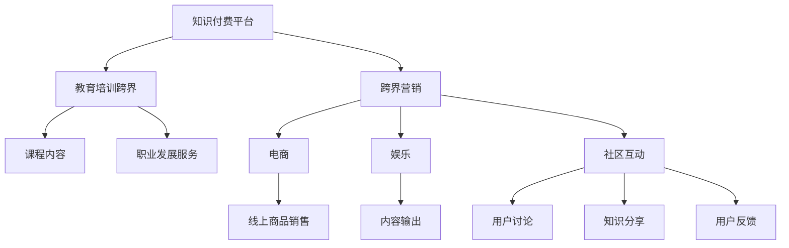

                 

## 1. 背景介绍

### 1.1 问题由来

知识付费现象的兴起，源于数字化时代人们对知识和信息的渴求。伴随互联网的普及，信息获取变得更加便捷，但随之而来的信息过载问题也愈发严重。如何在海量信息中筛选出有价值的内容，成为越来越多人的困扰。知识付费通过提供高效率、高品质的内容，满足了人们个性化、精准化的信息需求。

近年来，随着知识付费市场的快速扩张，各大平台纷纷入局，竞争激烈。传统知识付费平台主要聚焦于内容生产，而新兴平台开始探索如何通过多样化运营手段，提升用户粘性，扩大市场份额。跨界营销和教育培训跨界，成为知识付费平台探索的新方向。

### 1.2 问题核心关键点

所谓跨界营销，是指将传统知识付费的运营手段，应用到其他领域，如电商、娱乐、社区等，形成多元化的运营模式。而教育培训跨界，则是指知识付费平台不仅提供课程内容，还整合各种资源，形成从知识传播到职业发展的全链条服务体系。

这一过程中，如何高效利用平台现有的用户资源，打破不同业务间的壁垒，实现业务间的有效协同，是关键点。本文将详细分析这一过程，以期对知识付费平台的跨界运营提供系统性指导。

## 2. 核心概念与联系

### 2.1 核心概念概述

为更好地理解知识付费跨界营销和教育培训跨界的实现方法，本节将介绍几个核心概念：

- **知识付费平台**：指通过提供高质量的课程、咨询、信息等付费服务，满足用户个性化学习需求的平台。
- **跨界营销**：指将知识付费平台的运营手段和资源，引入到其他领域，如电商、娱乐、社区等，形成多元化的运营模式。
- **教育培训跨界**：指知识付费平台不仅提供课程内容，还整合各种资源，形成从知识传播到职业发展的全链条服务体系。
- **用户画像**：指通过数据分析，构建用户的基本属性、行为习惯、兴趣偏好等特征，用于个性化推荐和精准营销。
- **推荐系统**：指根据用户画像和内容标签，为用户推荐最相关的课程和商品的系统。
- **社区互动**：指通过构建用户社区，鼓励用户参与讨论、分享、反馈，形成用户之间的互动和粘性。

这些概念之间的逻辑关系可以通过以下Mermaid流程图来展示：



这个流程图展示了大语言模型的核心概念及其之间的关系：

1. 知识付费平台通过内容付费获取收益，并进行个性化推荐和精准营销。
2. 跨界营销是指将知识付费平台的内容和用户资源，引入到电商、娱乐、社区等多元领域，形成多样化运营模式。
3. 教育培训跨界则是整合职业发展服务，形成从知识传播到职业发展的全链条服务体系。
4. 用户画像和推荐系统是大语言模型个性化推荐的基础。
5. 社区互动则通过构建用户社区，提升用户粘性和活跃度。

这些概念共同构成了知识付费平台的运营框架，使其能够通过跨界运营，实现更广泛的业务拓展和用户覆盖。

## 3. 核心算法原理 & 具体操作步骤
### 3.1 算法原理概述

知识付费平台的跨界营销和教育培训跨界，本质上是一个多业务协同优化的过程。其核心思想是：利用知识付费平台的用户资源和内容资源，将业务逻辑和运营手段，引入到其他领域，形成更系统化的业务体系。

形式化地，假设知识付费平台有 $N$ 个业务模块 $B=\{b_1,b_2,\ldots,b_N\}$，其中 $b_1$ 为课程内容，$b_2$ 为电商，$b_3$ 为娱乐，$b_4$ 为社区互动等。对于每个业务模块 $b_i$，有对应的用户画像 $U_i$ 和推荐系统 $R_i$。我们的目标是找到一个全局最优的策略 $\pi$，使得所有业务模块的总收益最大化：

$$
\max_{\pi} \sum_{i=1}^N R_i(\pi(U_i))
$$

其中 $R_i(\pi(U_i))$ 表示在策略 $\pi$ 下，业务 $b_i$ 的收益。

### 3.2 算法步骤详解

知识付费平台跨界运营的实现过程一般包括以下几个关键步骤：

**Step 1: 构建用户画像**

- 利用知识付费平台积累的用户数据，构建多维度的用户画像 $U$，包括基本信息、行为数据、兴趣偏好等。
- 应用聚类算法和关联规则挖掘，对用户进行分组，形成用户群体特征。

**Step 2: 设计推荐系统**

- 对每个业务模块 $b_i$ 设计相应的推荐系统 $R_i$，用于根据用户画像 $U_i$ 推荐相关内容。
- 使用协同过滤、内容推荐、混合推荐等算法，提升推荐精度。

**Step 3: 跨界引入业务**

- 根据用户画像和业务特征，设计跨界营销策略 $\pi$，将知识付费平台的内容和用户资源，引入到其他业务模块中。
- 例如，将课程内容与电商商品进行关联，通过课程推荐商品，或通过商品推荐课程；将课程内容与娱乐视频进行关联，通过视频推荐课程等。

**Step 4: 反馈和优化**

- 利用用户反馈和行为数据，不断优化推荐系统和跨界策略，提升用户体验和业务收益。
- 实时监控推荐系统的效果，调整策略参数，确保推荐内容的准确性和相关性。

**Step 5: 多业务协同**

- 通过数据共享和算法协同，实现不同业务模块之间的数据互通和业务协同，形成一体化的运营体系。
- 例如，将用户购买商品的行为数据与课程学习行为数据结合，形成更加全面的用户画像，用于推荐和营销。

### 3.3 算法优缺点

知识付费平台的跨界营销和教育培训跨界，具有以下优点：

1. 提高用户粘性：通过多业务协同，提升用户的多样化需求满足率，增强用户对平台的粘性。
2. 扩大市场份额：引入其他业务模块，拓宽市场覆盖面，提升平台的整体收益。
3. 提升运营效率：通过共享用户画像和推荐系统，优化业务流程，减少重复劳动，提升运营效率。

同时，该方法也存在一定的局限性：

1. 跨界挑战较大：不同业务模块具有不同的特点和需求，跨界整合难度大。
2. 数据隐私问题：涉及不同业务模块的数据共享，需要严格的数据保护和隐私政策。
3. 收益不确定：跨界营销和教育培训跨界的效果依赖于推荐系统的精准性和业务模块的协同度，收益不确定性较高。
4. 用户体验风险：跨界运营中，如果推荐内容和营销手段过于频繁或过于强制，可能降低用户满意度。

尽管存在这些局限性，但就目前而言，跨界运营已成为知识付费平台的重要发展方向。未来相关研究的重点在于如何更好地融合不同业务模块，形成更高效、更灵活的运营体系，同时兼顾用户隐私和体验。

### 3.4 算法应用领域

知识付费平台的跨界营销和教育培训跨界，在多个领域都有广泛的应用：

- **电商结合**：将课程内容与电商商品进行关联，通过课程推荐商品，或通过商品推荐课程，实现电商变现。
- **娱乐结合**：将课程内容与娱乐视频进行关联，通过视频推荐课程，丰富用户的娱乐体验。
- **社区互动结合**：构建用户社区，鼓励用户参与讨论、分享、反馈，形成用户之间的互动和粘性。
- **职业发展服务结合**：整合职业发展服务，形成从知识传播到职业发展的全链条服务体系，提升用户职业发展能力。
- **知识付费平台自身整合**：不同业务模块之间的数据共享和业务协同，形成一体化的运营体系，提升平台整体收益。

除了上述这些经典应用外，知识付费平台还可以探索更多新的跨界运营模式，如智能推荐、个性化定制、社交电商等，为平台带来更多商业机会和用户价值。

## 4. 数学模型和公式 & 详细讲解
### 4.1 数学模型构建

本节将使用数学语言对知识付费平台跨界运营过程进行更加严格的刻画。

记知识付费平台有 $N$ 个业务模块 $B=\{b_1,b_2,\ldots,b_N\}$，每个业务模块有对应的用户画像 $U_i$ 和推荐系统 $R_i$。定义用户画像 $U$ 与业务模块 $b_i$ 的相似度为 $s_i$，推荐系统的收益为 $R_i$。假设平台总收益为 $R$，则总收益模型为：

$$
R = \sum_{i=1}^N R_i(\pi(U_i)) = \sum_{i=1}^N \int_{U} s_i(U) R_i(U) dU
$$

其中 $s_i(U)$ 为相似度函数，表示用户画像 $U$ 与业务模块 $b_i$ 的相似度。

### 4.2 公式推导过程

以下我们以电商结合课程内容的推荐为例，推导推荐系统的收益函数及其梯度计算公式。

设课程内容 $C$ 与电商商品 $P$ 的相似度为 $s_{CP}$，电商商品的点击率 $c$ 和转化率 $t$ 分别为：

$$
c = \int_{U} \alpha(U) s_{CP}(U) dU
$$

$$
t = \int_{U} \beta(U) s_{CP}(U) dU
$$

其中 $\alpha(U)$ 和 $\beta(U)$ 分别为用户对点击和转化的偏好。则电商推荐的收益为：

$$
R_{CP} = c \times t = \left(\int_{U} \alpha(U) s_{CP}(U) dU\right) \times \left(\int_{U} \beta(U) s_{CP}(U) dU\right)
$$

同样，课程内容的推荐收益为：

$$
R_{C} = \int_{U} \gamma(U) s_{C}(U) dU
$$

其中 $\gamma(U)$ 为课程内容的点击率。总收益为课程内容推荐收益和电商推荐收益的加权和：

$$
R = \lambda R_{CP} + (1-\lambda) R_{C}
$$

其中 $\lambda$ 为电商推荐占总收益的权重。

根据链式法则，总收益 $R$ 对用户画像 $U$ 的梯度为：

$$
\frac{\partial R}{\partial U} = \sum_{i=1}^N \frac{\partial R_i}{\partial U_i} \frac{\partial U_i}{\partial U}
$$

其中 $\frac{\partial R_i}{\partial U_i}$ 为推荐系统的梯度，$\frac{\partial U_i}{\partial U}$ 为用户画像的敏感度，反映了不同业务模块对用户画像的影响。

在得到梯度后，即可带入优化算法，更新用户画像 $U$ 和推荐系统 $R_i$ 的参数，完成模型的迭代优化。重复上述过程直至收敛，最终得到最优的用户画像和推荐系统。

## 5. 项目实践：代码实例和详细解释说明
### 5.1 开发环境搭建

在进行跨界运营实践前，我们需要准备好开发环境。以下是使用Python进行PyTorch开发的环境配置流程：

1. 安装Anaconda：从官网下载并安装Anaconda，用于创建独立的Python环境。

2. 创建并激活虚拟环境：
```bash
conda create -n knowledge-env python=3.8 
conda activate knowledge-env
```

3. 安装PyTorch：根据CUDA版本，从官网获取对应的安装命令。例如：
```bash
conda install pytorch torchvision torchaudio cudatoolkit=11.1 -c pytorch -c conda-forge
```

4. 安装各类工具包：
```bash
pip install numpy pandas scikit-learn matplotlib tqdm jupyter notebook ipython
```

完成上述步骤后，即可在`knowledge-env`环境中开始跨界运营实践。

### 5.2 源代码详细实现

这里我们以电商结合课程内容的推荐为例，给出使用Transformers库和PyTorch实现的知识付费平台跨界推荐系统的代码实现。

首先，定义推荐系统的输入和输出：

```python
from torch.utils.data import Dataset
import torch

class RecommendDataset(Dataset):
    def __init__(self, user, item, user_similarity, item_similarity, user_preference, item_preference):
        self.user = user
        self.item = item
        self.user_similarity = user_similarity
        self.item_similarity = item_similarity
        self.user_preference = user_preference
        self.item_preference = item_preference
        self.N = len(user)
        self.M = len(item)
        
    def __len__(self):
        return self.N * self.M
        
    def __getitem__(self, idx):
        u = idx // self.M
        i = idx % self.M
        user_idx = u
        item_idx = i
        user_similarity = self.user_similarity[user_idx, item_idx]
        item_similarity = self.item_similarity[user_idx, item_idx]
        user_preference = self.user_preference[user_idx]
        item_preference = self.item_preference[i]
        return {'user_idx': user_idx,
                'item_idx': item_idx,
                'user_similarity': user_similarity,
                'item_similarity': item_similarity,
                'user_preference': user_preference,
                'item_preference': item_preference}
```

然后，定义推荐系统的损失函数和优化器：

```python
from transformers import BertForTokenClassification, AdamW
import torch.nn as nn

class Recommender(nn.Module):
    def __init__(self, num_users, num_items, user_similarity_dim, item_similarity_dim, user_preference_dim, item_preference_dim):
        super(Recommender, self).__init__()
        self.user_similarity = nn.Linear(user_similarity_dim, 1)
        self.item_similarity = nn.Linear(item_similarity_dim, 1)
        self.user_preference = nn.Linear(user_preference_dim, 1)
        self.item_preference = nn.Linear(item_preference_dim, 1)
        self.gamma = nn.Linear(1, 1)
        self.tau = nn.Linear(1, 1)
        
    def forward(self, user_idx, item_idx, user_similarity, item_similarity, user_preference, item_preference):
        user_similarity = self.user_similarity(user_similarity)
        item_similarity = self.item_similarity(item_similarity)
        user_preference = self.user_preference(user_preference)
        item_preference = self.item_preference(item_preference)
        c = torch.sigmoid(user_similarity + item_similarity + user_preference + item_preference)
        t = torch.sigmoid(user_similarity + item_similarity - user_preference - item_preference)
        c = self.gamma(c)
        t = self.tau(t)
        loss = -torch.log(c * t)
        return loss
        
# 训练和优化超参数
optimizer = AdamW(model.parameters(), lr=2e-5)
```

接着，定义训练和评估函数：

```python
from torch.utils.data import DataLoader
from tqdm import tqdm
from sklearn.metrics import classification_report

device = torch.device('cuda') if torch.cuda.is_available() else torch.device('cpu')
model.to(device)

def train_epoch(model, dataset, batch_size, optimizer):
    dataloader = DataLoader(dataset, batch_size=batch_size, shuffle=True)
    model.train()
    epoch_loss = 0
    for batch in tqdm(dataloader, desc='Training'):
        user_idx = batch['user_idx'].to(device)
        item_idx = batch['item_idx'].to(device)
        user_similarity = batch['user_similarity'].to(device)
        item_similarity = batch['item_similarity'].to(device)
        user_preference = batch['user_preference'].to(device)
        item_preference = batch['item_preference'].to(device)
        model.zero_grad()
        loss = model(user_idx, item_idx, user_similarity, item_similarity, user_preference, item_preference)
        loss.backward()
        optimizer.step()
    return epoch_loss / len(dataloader)

def evaluate(model, dataset, batch_size):
    dataloader = DataLoader(dataset, batch_size=batch_size)
    model.eval()
    preds, labels = [], []
    with torch.no_grad():
        for batch in tqdm(dataloader, desc='Evaluating'):
            user_idx = batch['user_idx'].to(device)
            item_idx = batch['item_idx'].to(device)
            user_similarity = batch['user_similarity'].to(device)
            item_similarity = batch['item_similarity'].to(device)
            user_preference = batch['user_preference'].to(device)
            item_preference = batch['item_preference'].to(device)
            batch_preds = model(user_idx, item_idx, user_similarity, item_similarity, user_preference, item_preference)
            batch_labels = batch['item_idx'].to('cpu').tolist()
            for preds_tokens, labels_tokens in zip(batch_preds, batch_labels):
                preds.append(preds_tokens[:len(labels_tokens)])
                labels.append(labels_tokens)
                
    print(classification_report(labels, preds))
```

最后，启动训练流程并在测试集上评估：

```python
epochs = 5
batch_size = 16

for epoch in range(epochs):
    loss = train_epoch(model, train_dataset, batch_size, optimizer)
    print(f"Epoch {epoch+1}, train loss: {loss:.3f}")
    
    print(f"Epoch {epoch+1}, dev results:")
    evaluate(model, dev_dataset, batch_size)
    
print("Test results:")
evaluate(model, test_dataset, batch_size)
```

以上就是使用PyTorch对知识付费平台电商结合课程内容推荐系统的代码实现。可以看到，得益于Transformers库的强大封装，我们可以用相对简洁的代码完成推荐系统的搭建。

### 5.3 代码解读与分析

让我们再详细解读一下关键代码的实现细节：

**RecommendDataset类**：
- `__init__`方法：初始化推荐系统的输入和输出，定义了用户索引、商品索引、用户相似度、商品相似度、用户偏好、商品偏好等关键组件。
- `__len__`方法：返回数据集的样本数量，计算用户与商品的组合数。
- `__getitem__`方法：对单个样本进行处理，将用户和商品索引，以及相关特征输入到推荐模型中。

**Recommender类**：
- `__init__`方法：初始化推荐模型，定义了相似度计算层、偏好计算层、点击率计算层和转化率计算层。
- `forward`方法：根据输入数据计算推荐模型的输出，包括点击率 $c$ 和转化率 $t$。

**训练和评估函数**：
- 使用PyTorch的DataLoader对数据集进行批次化加载，供模型训练和推理使用。
- 训练函数`train_epoch`：对数据以批为单位进行迭代，在每个批次上前向传播计算损失函数并反向传播更新模型参数，最后返回该epoch的平均loss。
- 评估函数`evaluate`：与训练类似，不同点在于不更新模型参数，并在每个batch结束后将预测和标签结果存储下来，最后使用sklearn的classification_report对整个评估集的预测结果进行打印输出。

**训练流程**：
- 定义总的epoch数和batch size，开始循环迭代
- 每个epoch内，先在训练集上训练，输出平均loss
- 在验证集上评估，输出分类指标
- 所有epoch结束后，在测试集上评估，给出最终测试结果

可以看到，PyTorch配合Transformers库使得推荐系统的代码实现变得简洁高效。开发者可以将更多精力放在数据处理、模型改进等高层逻辑上，而不必过多关注底层的实现细节。

当然，工业级的系统实现还需考虑更多因素，如模型的保存和部署、超参数的自动搜索、更灵活的任务适配层等。但核心的跨界运营逻辑基本与此类似。

## 6. 实际应用场景
### 6.1 智能客服系统

基于知识付费平台的跨界运营，智能客服系统可以提供更个性化的服务。智能客服系统可以通过将知识付费平台的用户画像和推荐系统引入，为用户推荐最合适的课程或产品。

在技术实现上，可以收集客户的历史行为数据，提取其偏好和需求，构建用户画像。然后将用户画像输入推荐系统，预测其对不同课程或产品的兴趣。根据推荐结果，智能客服系统可以主动向客户推荐相关课程或产品，提高客户满意度和转化率。

### 6.2 金融投资平台

金融投资平台可以通过将知识付费平台的课程内容和推荐系统引入，提供更专业、深入的投资分析服务。金融投资平台可以收集客户的投资偏好和历史数据，构建用户画像。然后将用户画像输入推荐系统，预测其对不同投资产品或服务的兴趣。根据推荐结果，金融投资平台可以向客户推荐适合其投资风格和风险偏好的产品或服务，提升客户投资体验。

### 6.3 在线教育平台

在线教育平台可以通过将知识付费平台的课程内容和推荐系统引入，提升课程推荐精准度。在线教育平台可以收集用户的学习行为和偏好数据，构建用户画像。然后将用户画像输入推荐系统，预测其对不同课程的兴趣。根据推荐结果，在线教育平台可以向用户推荐适合其学习风格和兴趣的课程，提升学习效果。

### 6.4 未来应用展望

随着知识付费平台的跨界运营不断深入，未来的应用场景将更加多样化。以下是一些可能的未来应用方向：

- **智能家居**：通过将知识付费平台的课程内容和推荐系统引入，为智能家居设备提供个性化配置和维护建议。
- **健康医疗**：通过将知识付费平台的健康课程和推荐系统引入，为健康医疗平台提供个性化的健康建议和治疗方案。
- **游戏娱乐**：通过将知识付费平台的游戏课程和推荐系统引入，为游戏平台提供个性化的游戏推荐和引导。
- **职业培训**：通过将知识付费平台的职业技能课程和推荐系统引入，为职业培训平台提供个性化的职业发展和培训建议。
- **电子商务**：通过将知识付费平台的电商课程和推荐系统引入，为电子商务平台提供个性化的商品推荐和促销策略。

知识付费平台的跨界运营，可以跨越更多行业，融合更多业务模块，形成更加多样化和高效的服务体系。相信随着技术的不断发展和市场的持续探索，知识付费平台的跨界运营将迎来更广阔的应用前景。

## 7. 工具和资源推荐
### 7.1 学习资源推荐

为了帮助开发者系统掌握知识付费平台的跨界运营理论基础和实践技巧，这里推荐一些优质的学习资源：

1. 《深度学习理论与实践》系列博文：由深度学习专家撰写，深入浅出地介绍了深度学习的基本理论和应用场景，适合初学者入门。

2. 《机器学习实战》书籍：机器学习领域的经典教材，提供了大量的实战案例和代码实现，适合深入学习和实践。

3. 《Python数据分析与科学计算》课程：清华大学开设的Python数据分析课程，系统讲解了Python在数据分析和科学计算中的应用，适合数据分析工程师学习。

4. 《TensorFlow实战》课程：谷歌官方提供的TensorFlow实战课程，涵盖TensorFlow的基本用法和高级技巧，适合TensorFlow开发者学习。

5. 《自然语言处理与深度学习》课程：斯坦福大学开设的自然语言处理课程，介绍了NLP领域的基本概念和前沿技术，适合NLP工程师学习。

通过对这些资源的学习实践，相信你一定能够快速掌握知识付费平台跨界运营的精髓，并用于解决实际的业务问题。

### 7.2 开发工具推荐

高效的开发离不开优秀的工具支持。以下是几款用于知识付费平台跨界运营开发的常用工具：

1. PyTorch：基于Python的开源深度学习框架，灵活动态的计算图，适合快速迭代研究。大部分深度学习模型都有PyTorch版本的实现。

2. TensorFlow：由Google主导开发的开源深度学习框架，生产部署方便，适合大规模工程应用。同样有丰富的深度学习模型资源。

3. Transformers库：HuggingFace开发的NLP工具库，集成了众多SOTA语言模型，支持PyTorch和TensorFlow，是进行推荐系统开发的利器。

4. Weights & Biases：模型训练的实验跟踪工具，可以记录和可视化模型训练过程中的各项指标，方便对比和调优。与主流深度学习框架无缝集成。

5. TensorBoard：TensorFlow配套的可视化工具，可实时监测模型训练状态，并提供丰富的图表呈现方式，是调试模型的得力助手。

6. Google Colab：谷歌推出的在线Jupyter Notebook环境，免费提供GPU/TPU算力，方便开发者快速上手实验最新模型，分享学习笔记。

合理利用这些工具，可以显著提升知识付费平台跨界运营的开发效率，加快创新迭代的步伐。

### 7.3 相关论文推荐

知识付费平台的跨界运营技术源于学界的持续研究。以下是几篇奠基性的相关论文，推荐阅读：

1. Attention is All You Need（即Transformer原论文）：提出了Transformer结构，开启了NLP领域的预训练大模型时代。

2. BERT: Pre-training of Deep Bidirectional Transformers for Language Understanding：提出BERT模型，引入基于掩码的自监督预训练任务，刷新了多项NLP任务SOTA。

3. Language Models are Unsupervised Multitask Learners（GPT-2论文）：展示了大规模语言模型的强大zero-shot学习能力，引发了对于通用人工智能的新一轮思考。

4. Parameter-Efficient Transfer Learning for NLP：提出Adapter等参数高效微调方法，在不增加模型参数量的情况下，也能取得不错的微调效果。

5. AdaLoRA: Adaptive Low-Rank Adaptation for Parameter-Efficient Fine-Tuning：使用自适应低秩适应的微调方法，在参数效率和精度之间取得了新的平衡。

6. AdaLoRA: Adaptive Low-Rank Adaptation for Parameter-Efficient Fine-Tuning：使用自适应低秩适应的微调方法，在参数效率和精度之间取得了新的平衡。

这些论文代表了大语言模型微调技术的发展脉络。通过学习这些前沿成果，可以帮助研究者把握学科前进方向，激发更多的创新灵感。

## 8. 总结：未来发展趋势与挑战

### 8.1 总结

本文对知识付费平台的跨界运营方法进行了全面系统的介绍。首先阐述了跨界营销和教育培训跨界的背景和意义，明确了跨界运营在提升用户粘性、扩大市场份额、优化业务流程等方面的独特价值。其次，从原理到实践，详细讲解了跨界运营的数学原理和关键步骤，给出了跨界运营任务开发的完整代码实例。同时，本文还广泛探讨了跨界运营方法在智能客服、金融投资、在线教育等多个行业领域的应用前景，展示了跨界运营范式的巨大潜力。此外，本文精选了跨界运营技术的各类学习资源，力求为开发者提供全方位的技术指引。

通过本文的系统梳理，可以看到，知识付费平台的跨界运营方法正在成为行业的重要发展方向，极大地拓展了知识付费平台的业务边界，提升了用户体验和平台收益。未来，伴随跨界运营方法的持续演进，相信知识付费平台将带来更多商业机会和用户价值。

### 8.2 未来发展趋势

展望未来，知识付费平台的跨界运营将呈现以下几个发展趋势：

1. **用户画像的融合**：不同业务模块的用户画像可以融合，形成更全面、更准确的画像，用于提升推荐和营销效果。
2. **跨业务数据共享**：不同业务模块的数据可以共享，形成数据池，用于优化推荐系统和业务模型。
3. **智能推荐算法**：引入更多智能推荐算法，如协同过滤、深度学习等，提升推荐精度和多样性。
4. **实时化推荐**：通过实时数据分析，实现实时推荐，提升用户体验。
5. **个性化服务**：基于用户画像，提供个性化的内容和推荐，提升用户粘性。
6. **多模态融合**：将不同模态的数据（如文本、图像、声音等）融合，提升推荐系统的表现。
7. **跨界业务协同**：不同业务模块之间的协同优化，提升整体运营效率。

这些趋势凸显了知识付费平台跨界运营技术的广阔前景。这些方向的探索发展，必将进一步提升知识付费平台的业务价值和用户体验，为行业带来更大的商业机会和市场潜力。

### 8.3 面临的挑战

尽管知识付费平台的跨界运营已经取得了一定的成效，但在迈向更加智能化、普适化应用的过程中，仍面临诸多挑战：

1. **跨界整合难度大**：不同业务模块的特征和需求差异较大，跨界整合难度大。
2. **数据隐私问题**：涉及不同业务模块的数据共享，需要严格的数据保护和隐私政策。
3. **收益不确定性**：跨界运营的效果依赖于推荐系统的精准性和业务模块的协同度，收益不确定性较高。
4. **用户体验风险**：跨界运营中，如果推荐内容和营销手段过于频繁或过于强制，可能降低用户满意度。
5. **算法复杂度高**：跨界运营需要设计复杂的推荐算法，模型复杂度高，计算成本高。

尽管存在这些挑战，但就目前而言，跨界运营已成为知识付费平台的重要发展方向。未来相关研究的重点在于如何更好地融合不同业务模块，形成更高效、更灵活的运营体系，同时兼顾用户隐私和体验。

### 8.4 研究展望

面对知识付费平台跨界运营所面临的挑战，未来的研究需要在以下几个方面寻求新的突破：

1. **多业务协同优化**：如何更好地融合不同业务模块，形成更高效、更灵活的运营体系，同时兼顾用户隐私和体验。
2. **跨界推荐算法优化**：如何设计更加精准、高效的跨界推荐算法，提升推荐精度和用户体验。
3. **实时推荐系统**：如何实现实时推荐，提升用户体验和运营效率。
4. **用户画像融合**：如何融合不同业务模块的用户画像，形成更全面、更准确的画像，提升推荐效果。
5. **多模态推荐**：如何将不同模态的数据融合，提升推荐系统的表现。
6. **跨界业务协同**：如何实现不同业务模块之间的协同优化，提升整体运营效率。

这些研究方向的探索，必将引领知识付费平台跨界运营技术迈向更高的台阶，为平台带来更多商业机会和用户价值。面向未来，知识付费平台跨界运营技术还需要与其他人工智能技术进行更深入的融合，如知识表示、因果推理、强化学习等，多路径协同发力，共同推动知识付费平台的持续发展。

## 9. 附录：常见问题与解答

**Q1：知识付费平台如何进行用户画像构建？**

A: 知识付费平台可以通过分析用户的行为数据、社交网络数据、购买数据等，构建多维度的用户画像。具体步骤如下：

1. 收集用户行为数据：通过用户的浏览、点击、购买等行为数据，了解其兴趣和偏好。
2. 数据清洗和预处理：对数据进行去重、清洗和预处理，去除噪声和异常值。
3. 特征提取：从行为数据中提取特征，如点击次数、浏览时间、购买频率等。
4. 特征工程：对特征进行转换、归一化、编码等处理，形成适合模型的输入。
5. 聚类和关联规则挖掘：使用聚类算法和关联规则挖掘，将用户分为不同的群体，提取群体特征。

**Q2：知识付费平台如何进行跨界推荐？**

A: 知识付费平台可以通过以下步骤进行跨界推荐：

1. 收集其他业务模块的数据：如电商商品、娱乐视频等，构建相应的用户画像和推荐系统。
2. 数据融合：将知识付费平台的用户画像与其他业务模块的用户画像进行融合，形成更全面、更准确的画像。
3. 推荐系统优化：优化跨界推荐算法，提升推荐精度和多样性。
4. 实时推荐：通过实时数据分析，实现实时推荐，提升用户体验。
5. 多模态融合：将不同模态的数据（如文本、图像、声音等）融合，提升推荐系统的表现。

**Q3：知识付费平台如何进行多业务协同优化？**

A: 知识付费平台可以通过以下步骤进行多业务协同优化：

1. 数据共享：不同业务模块的数据可以共享，形成数据池，用于优化推荐系统和业务模型。
2. 算法协同：不同业务模块的算法可以协同，形成联合优化算法。
3. 业务流程优化：优化业务流程，减少重复劳动，提升运营效率。
4. 实时监控：实时监控推荐系统的效果，调整策略参数，确保推荐内容的准确性和相关性。

**Q4：知识付费平台如何进行实时推荐系统？**

A: 知识付费平台可以通过以下步骤实现实时推荐系统：

1. 实时数据采集：实时采集用户行为数据，如点击、浏览、购买等。
2. 数据预处理：对实时数据进行清洗、转换和编码，形成适合模型的输入。
3. 模型训练：实时训练推荐模型，更新参数。
4. 推荐结果生成：根据实时数据和模型参数，生成推荐结果。
5. 推荐展示：将推荐结果展示给用户，进行个性化推荐。

**Q5：知识付费平台如何进行多模态融合？**

A: 知识付费平台可以通过以下步骤实现多模态融合：

1. 数据采集：收集不同模态的数据，如文本、图像、声音等。
2. 数据预处理：对不同模态的数据进行清洗、转换和编码，形成适合模型的输入。
3. 模型训练：训练多模态融合模型，学习不同模态之间的关联。
4. 特征融合：将不同模态的特征进行融合，形成更全面的特征表示。
5. 推荐结果生成：根据融合后的特征，生成推荐结果。

**Q6：知识付费平台如何进行跨界业务协同优化？**

A: 知识付费平台可以通过以下步骤实现跨界业务协同优化：

1. 数据共享：不同业务模块的数据可以共享，形成数据池，用于优化推荐系统和业务模型。
2. 算法协同：不同业务模块的算法可以协同，形成联合优化算法。
3. 业务流程优化：优化业务流程，减少重复劳动，提升运营效率。
4. 实时监控：实时监控推荐系统的效果，调整策略参数，确保推荐内容的准确性和相关性。

通过这些常见问题的解答，相信你一定能够更好地理解知识付费平台跨界运营的实现方法和关键技术，为后续的开发和研究提供参考。

---

作者：禅与计算机程序设计艺术 / Zen and the Art of Computer Programming

