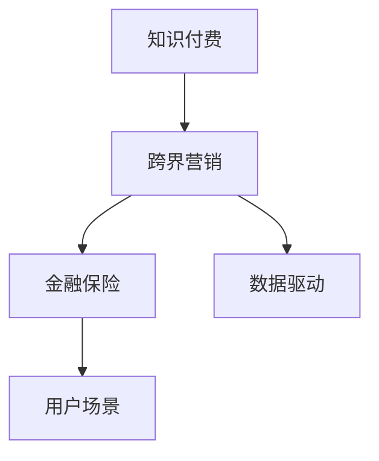

                 

# 知识付费如何实现跨界营销与金融保险跨界？

## 1. 背景介绍

### 1.1 问题由来
在互联网快速发展的今天，知识付费已经成为了一种主流商业模式。它通过知识输出与付费订阅的结合，为内容创作者提供了丰厚的回报，同时满足了用户对高质量知识的需求。但随着市场竞争的加剧，单纯依靠知识付费模式已经无法满足用户的多元化需求，难以实现持续增长。

如何在知识付费的基础上进行跨界营销，挖掘新的增长点，成为众多知识付费平台急需解决的问题。特别是如何将知识付费与金融保险等垂直领域结合，在用户端实现更全面的服务，在平台端创造更大的商业价值，成为亟待探索的挑战。

### 1.2 问题核心关键点
知识付费跨界营销的核心在于如何利用知识付费平台的用户基础，通过产品创新和服务升级，探索新的增长模式和盈利途径。在金融保险领域，如何设计产品能够覆盖用户多样化的需求，同时确保产品合规、安全，并能够与知识付费平台的用户场景无缝衔接，是实现跨界营销的关键。

## 2. 核心概念与联系

### 2.1 核心概念概述

- **知识付费**：通过付费订阅的方式，提供高质量、系统化的知识服务。其核心在于知识内容的制作和分发，以满足用户对知识的深度需求。
- **跨界营销**：跨界营销指的是将不同领域的产品或服务结合，以新的组合形式进行推广和销售，实现资源整合和价值提升。
- **金融保险**：金融保险是以风险转移、保险赔款和金融投资为主要内容的服务，涵盖银行、保险、理财等多个细分领域。
- **用户场景**：指用户在某个特定环境或情境中使用产品或服务的方式和习惯，是设计跨界产品的关键考虑因素。
- **数据驱动**：以数据为基础，通过数据分析挖掘用户需求和行为特征，指导产品和服务的优化迭代。

这些核心概念之间的逻辑关系可以通过以下Mermaid流程图来展示：



这个流程图展示了大语言模型的核心概念及其之间的关系：

1. 知识付费平台通过提供高质量知识服务，聚集了大量用户。
2. 跨界营销范式使知识付费平台能够结合其他领域的产品和服务，实现业务多元化。
3. 金融保险产品能够满足用户多样化的需求，成为跨界营销的重要组成部分。
4. 用户场景分析指导产品设计，确保产品符合用户需求和行为习惯。
5. 数据驱动分析支持产品优化和迭代，提升用户体验和平台价值。

## 3. 核心算法原理 & 具体操作步骤

### 3.1 算法原理概述

知识付费跨界营销的核心在于设计和推出符合用户场景的金融保险产品，并通过知识付费平台进行推广和销售。其算法原理可概括为：

1. **用户需求分析**：通过数据挖掘和分析，了解用户在不同场景下的需求，设计符合用户场景的金融保险产品。
2. **产品优化迭代**：基于用户反馈和行为数据，进行产品优化和迭代，提升用户体验和产品竞争力。
3. **跨界推广策略**：利用知识付费平台的用户基础，结合营销策略，推广跨界产品，扩大市场影响力。
4. **数据分析优化**：通过数据分析，持续优化营销策略，提升营销效果和产品转化率。

### 3.2 算法步骤详解

基于上述原理，知识付费跨界营销的算法步骤如下：

1. **数据收集与分析**：
   - 收集知识付费平台用户数据，包括用户画像、行为数据、消费偏好等。
   - 结合金融保险领域数据，分析用户在不同场景下的需求和行为特征。
   - 使用机器学习算法对用户数据进行聚类和特征提取，识别出不同用户群体。

2. **产品设计与推荐**：
   - 结合用户需求和行为数据，设计符合用户场景的金融保险产品。
   - 利用推荐算法，如协同过滤、内容推荐、混合推荐等，向用户推荐合适的金融保险产品。
   - 设计灵活的产品组合策略，满足用户多样化的需求。

3. **跨界推广策略**：
   - 结合知识付费平台的内容特性，设计有针对性的营销活动，如专题活动、直播课、互动问答等。
   - 利用社交媒体、搜索引擎优化、内容营销等手段，扩大跨界产品的市场影响力。
   - 设计激励机制，如积分奖励、优惠券、会员特权等，提升用户转化率。

4. **效果评估与优化**：
   - 定期收集跨界营销数据，包括用户参与度、产品销售量、用户满意度等指标。
   - 使用A/B测试、用户反馈等方式，对营销策略进行评估和优化。
   - 持续改进产品和服务，提升用户体验和平台价值。

### 3.3 算法优缺点

知识付费跨界营销的算法具有以下优点：
1. **整合资源**：利用知识付费平台的用户基础，结合其他领域产品，实现资源整合和价值提升。
2. **多渠道推广**：通过多渠道营销策略，提升产品曝光度和用户参与度。
3. **精准推荐**：基于用户行为和需求数据分析，提供个性化推荐，提升用户转化率。
4. **持续优化**：通过数据分析和反馈，不断优化产品和服务，满足用户需求。

同时，该算法也存在一定的局限性：
1. **用户数据隐私**：数据收集和分析可能涉及用户隐私问题，需注意数据合规和用户隐私保护。
2. **营销效果难以预测**：跨界营销效果受到多种因素影响，难以完全预测。
3. **产品设计复杂**：金融保险产品设计复杂，需结合多种要素和数据，可能存在设计难度。
4. **推广成本高**：跨界营销涉及多种渠道和资源，推广成本较高。

尽管存在这些局限性，但就目前而言，知识付费跨界营销的算法仍具有显著的优势，成为知识付费平台的重要发展方向。未来相关研究的重点在于如何进一步提升数据隐私保护，降低推广成本，提高产品设计复杂性的可控性，以实现更加高效和精准的跨界营销。

### 3.4 算法应用领域

知识付费跨界营销的算法不仅适用于金融保险领域，还可以应用于多个其他领域，如教育、医疗、旅游等。这些领域具有相似的特点，即用户需要高质量、系统化的服务，且可以通过知识付费平台进行推广和销售。

- **教育领域**：结合知识付费平台提供的高质量教育内容，推出教育培训、在线课程等跨界产品，满足用户学习需求。
- **医疗领域**：通过知识付费平台提供健康管理、健康咨询等跨界产品，提供全链条的健康服务。
- **旅游领域**：结合知识付费平台提供的目的地介绍、旅行攻略等跨界产品，提供一站式的旅行服务。

这些领域的应用将进一步丰富知识付费平台的业务形态，拓展其市场价值。

## 4. 数学模型和公式 & 详细讲解 & 举例说明

### 4.1 数学模型构建

知识付费跨界营销的数学模型可构建为：

1. **用户需求模型**：
   - 设用户集合为 $U=\{u_1,u_2,...,u_n\}$，其中每个用户 $u_i$ 的特征向量为 $\vec{x}_i=(x_{i1},x_{i2},...,x_{im})$，$i \in \{1,2,...,n\}$。
   - 设用户对金融保险产品的需求矩阵为 $A_{ij}=\begin{cases} 1, & \text{若用户 } u_i \text{ 需要金融保险产品 } j \\ 0, & \text{若用户 } u_i \text{ 不需要金融保险产品 } j \end{cases}$。

2. **产品推荐模型**：
   - 设金融保险产品集合为 $I=\{i_1,i_2,...,i_m\}$，其中每个产品 $i_j$ 的特征向量为 $\vec{y}_j=(y_{j1},y_{j2},...,y_{jn})$。
   - 设用户对金融保险产品的推荐模型为 $P(u_i,i_j)=\alpha\frac{\exp(\vec{x}_i \cdot \vec{y}_j)}{\sum_{k=1}^m \exp(\vec{x}_i \cdot \vec{y}_k)}$，其中 $\alpha$ 为归一化系数。

3. **营销效果模型**：
   - 设营销活动集合为 $C=\{c_1,c_2,...,c_k\}$，其中每个营销活动 $c_j$ 的特征向量为 $\vec{z}_j=(z_{j1},z_{j2},...,z_{jn})$。
   - 设用户参与营销活动的概率模型为 $Pr(c_j|u_i)=\beta\frac{\exp(\vec{x}_i \cdot \vec{z}_j)}{\sum_{l=1}^k \exp(\vec{x}_i \cdot \vec{z}_l)}$，其中 $\beta$ 为归一化系数。

### 4.2 公式推导过程

1. **用户需求模型**：
   - 使用K近邻算法或协同过滤算法，对用户需求进行聚类和特征提取。
   - 通过余弦相似度计算用户与产品的相似度，推荐相似度高的产品给用户。

2. **产品推荐模型**：
   - 利用协同过滤算法，基于用户历史行为数据和产品特征，推荐符合用户需求的产品。
   - 通过内容推荐算法，基于用户行为和产品属性，推荐相关度高的产品。

3. **营销效果模型**：
   - 利用回归分析或决策树算法，分析用户参与营销活动的影响因素。
   - 结合用户需求和行为数据，设计有针对性的营销策略。

### 4.3 案例分析与讲解

**案例分析**：某知识付费平台推出“知识+金融”跨界产品。

- **需求分析**：通过用户画像和行为数据，发现用户对投资理财、保险保障有较高需求。
- **产品设计**：推出与知识付费内容相关的理财产品、基金组合、保险产品等。
- **推荐策略**：结合用户兴趣和行为数据，通过协同过滤和内容推荐算法，向用户推荐合适的金融产品。
- **营销活动**：举办投资理财课程、专家答疑直播等活动，提升用户参与度。

## 5. 项目实践：代码实例和详细解释说明

### 5.1 开发环境搭建

在进行知识付费跨界营销项目开发前，需要先准备好开发环境。以下是使用Python进行开发的推荐环境配置流程：

1. 安装Anaconda：从官网下载并安装Anaconda，用于创建独立的Python环境。

2. 创建并激活虚拟环境：
```bash
conda create -n cross_marketing_env python=3.8 
conda activate cross_marketing_env
```

3. 安装Python和相关依赖：
```bash
conda install -c anaconda pandas numpy scikit-learn scikit-learn
```

4. 安装Flask和TensorFlow等工具：
```bash
pip install flask tensorflow
```

完成上述步骤后，即可在`cross_marketing_env`环境中开始项目实践。

### 5.2 源代码详细实现

下面以金融保险产品推荐为例，给出使用Flask和TensorFlow进行知识付费跨界营销的PyTorch代码实现。

```python
from flask import Flask, request, jsonify
from transformers import TFAutoModelForSequenceClassification, BertTokenizer
import tensorflow as tf
import pandas as pd
import numpy as np

app = Flask(__name__)

# 加载模型和tokenizer
model = TFAutoModelForSequenceClassification.from_pretrained('bert-base-uncased')
tokenizer = BertTokenizer.from_pretrained('bert-base-uncased')

# 加载用户和产品数据
user_data = pd.read_csv('user_data.csv')
product_data = pd.read_csv('product_data.csv')

# 数据预处理
def encode_data(data, max_len):
    inputs = tokenizer.encode(data, add_special_tokens=True, max_length=max_len, truncation=True, padding='max_length', return_tensors='tf')
    return inputs

# 推荐算法
def recommend_product(user, products, max_len=512):
    encoded_user = encode_data(user, max_len)
    encoded_products = [encode_data(product, max_len) for product in products]
    user_inputs = tf.convert_to_tensor(encoded_user)
    product_inputs = tf.convert_to_tensor(encoded_products)
    user_logits = model(user_inputs)
    product_logits = model(product_inputs)
    similarity = tf.reduce_sum(user_logits * product_logits, axis=1)
    ranked_products = sorted(zip(similarity.numpy(), encoded_products), reverse=True)
    return ranked_products

# 接口实现
@app.route('/recommend', methods=['POST'])
def recommend():
    user_id = request.json['user_id']
    user_row = user_data[user_data['user_id'] == user_id]
    user_product_scores = recommend_product(user_row['user_content'], product_data['product_name'], max_len=512)
    return jsonify([{'product_name': product[1], 'product_score': product[0]} for product in user_product_scores])

if __name__ == '__main__':
    app.run(debug=True)
```

### 5.3 代码解读与分析

让我们再详细解读一下关键代码的实现细节：

- **Flask环境搭建**：使用Flask框架搭建知识付费跨界营销的API服务器。
- **模型和tokenizer加载**：加载预训练的BERT模型和tokenizer，准备数据预处理。
- **数据预处理**：通过`encode_data`函数，将用户和产品数据转化为模型所需的格式。
- **推荐算法**：使用协同过滤算法，计算用户对每个产品的相似度，推荐相似度高的产品。
- **API接口实现**：通过`/recommend`接口，接收用户ID和产品列表，返回推荐结果。

## 6. 实际应用场景

### 6.1 智能理财顾问

智能理财顾问是知识付费跨界营销的一个重要应用场景。用户可以通过知识付费平台订阅理财课程，获取理财知识，并通过智能理财顾问推荐合适的理财产品和投资组合。

**实际应用**：某知识付费平台推出智能理财顾问服务，用户可以订阅“理财小课程”，学习基础的理财知识，并由智能理财顾问根据用户需求和偏好，推荐合适的理财方案。

**技术实现**：利用用户行为数据和产品特征，设计协同过滤和内容推荐算法，推荐合适的理财产品和投资组合。

### 6.2 保险保障规划

保险保障规划是知识付费跨界营销的另一个重要应用场景。用户可以通过知识付费平台订阅保险课程，了解保险知识，并通过保险保障规划推荐合适的保险产品。

**实际应用**：某知识付费平台推出保险保障规划服务，用户可以订阅“保险小课堂”，了解保险相关知识，并由保险保障规划推荐合适的保险产品。

**技术实现**：利用用户行为数据和产品特征，设计协同过滤和内容推荐算法，推荐合适的保险产品。

### 6.3 投资理财决策

投资理财决策是知识付费跨界营销的高频应用场景。用户可以通过知识付费平台订阅投资理财课程，学习投资知识，并通过投资理财决策推荐合适的投资策略。

**实际应用**：某知识付费平台推出投资理财决策服务，用户可以订阅“投资大课”，学习投资理财知识，并由投资理财决策推荐合适的投资策略。

**技术实现**：利用用户行为数据和产品特征，设计协同过滤和内容推荐算法，推荐合适的投资策略。

### 6.4 未来应用展望

随着知识付费跨界营销的不断发展，未来将在更多领域得到应用，为知识付费平台和用户创造更多的价值。

- **医疗健康管理**：结合知识付费平台提供健康管理课程，推出健康保障和健康咨询服务。
- **旅游目的地推荐**：结合知识付费平台提供的目的地介绍和旅行攻略，推荐合适的旅游目的地和旅行方案。
- **职业发展培训**：结合知识付费平台提供的职业发展课程，推出职业规划和发展咨询。

未来，基于知识付费的跨界营销将进一步拓展应用场景，为各行各业带来全新的服务模式和商业价值。

## 7. 工具和资源推荐

### 7.1 学习资源推荐

为了帮助开发者系统掌握知识付费跨界营销的理论基础和实践技巧，这里推荐一些优质的学习资源：

1. **《知识付费：从理论到实践》系列博文**：由大语言模型技术专家撰写，深入浅出地介绍了知识付费的理论基础、商业模型和实践方法。

2. **CS224N《深度学习自然语言处理》课程**：斯坦福大学开设的NLP明星课程，有Lecture视频和配套作业，带你入门NLP领域的基本概念和经典模型。

3. **《深度学习：理论与实践》书籍**：深度学习领域的经典教材，全面介绍了深度学习理论和实践技巧，适合深入学习。

4. **《知识付费实战手册》书籍**：总结了知识付费平台运营的成功案例和运营策略，是实际操作的好帮手。

5. **《营销心理学》书籍**：了解用户心理和行为，是设计跨界营销策略的重要依据。

通过对这些资源的学习实践，相信你一定能够快速掌握知识付费跨界营销的精髓，并用于解决实际的商业问题。

### 7.2 开发工具推荐

高效的开发离不开优秀的工具支持。以下是几款用于知识付费跨界营销开发的常用工具：

1. **Flask**：Python的轻量级Web框架，易于上手，适合快速搭建API服务。
2. **TensorFlow**：由Google主导开发的深度学习框架，功能强大，适合大规模模型训练和推理。
3. **PyTorch**：深度学习框架，灵活动态的计算图，适合快速迭代研究。
4. **Jupyter Notebook**：交互式笔记本环境，适合数据处理和算法开发。
5. **Kaggle**：数据科学竞赛平台，提供丰富的数据集和竞赛任务，适合数据驱动的应用开发。

合理利用这些工具，可以显著提升知识付费跨界营销任务的开发效率，加快创新迭代的步伐。

### 7.3 相关论文推荐

知识付费跨界营销的发展源于学界的持续研究。以下是几篇奠基性的相关论文，推荐阅读：

1. **《知识付费平台的商业模式创新》论文**：探讨了知识付费平台在知识变现、内容筛选和用户粘性方面的创新策略。
2. **《金融保险的跨界营销策略》论文**：分析了金融保险产品推荐和用户行为分析的方法，提出了多种跨界营销策略。
3. **《知识付费与金融保险的协同优化》论文**：研究了知识付费平台与金融保险产品的协同优化方法，提出了基于数据驱动的协同优化模型。
4. **《跨界营销中的数据隐私保护》论文**：探讨了跨界营销中数据隐私保护的方法和策略，提出了基于隐私保护的跨界营销框架。

这些论文代表了大语言模型跨界营销技术的发展脉络。通过学习这些前沿成果，可以帮助研究者把握学科前进方向，激发更多的创新灵感。

## 8. 总结：未来发展趋势与挑战

### 8.1 总结

本文对知识付费跨界营销的方法进行了全面系统的介绍。首先阐述了知识付费跨界营销的背景和意义，明确了跨界营销在提升用户体验和平台价值方面的重要价值。其次，从原理到实践，详细讲解了知识付费跨界营销的数学原理和关键步骤，给出了跨界营销任务开发的完整代码实例。同时，本文还广泛探讨了跨界营销方法在智能理财、保险保障、投资理财等多个领域的应用前景，展示了跨界营销范式的巨大潜力。此外，本文精选了跨界营销技术的各类学习资源，力求为读者提供全方位的技术指引。

通过本文的系统梳理，可以看到，知识付费跨界营销的方法正在成为知识付费平台的重要发展方向，极大地拓展了平台的业务边界，催生了更多的增长模式和商业价值。未来，伴随预训练语言模型和跨界营销方法的持续演进，相信知识付费平台必将在更广阔的领域中实现突破，为各行各业带来更加丰富多样的服务模式和商业价值。

### 8.2 未来发展趋势

展望未来，知识付费跨界营销技术将呈现以下几个发展趋势：

1. **多元化拓展**：随着用户需求的多样化，知识付费平台将不断拓展跨界营销的应用场景，涵盖更多垂直领域。
2. **个性化提升**：基于数据驱动的个性化推荐，将进一步提升用户体验和平台价值。
3. **技术融合**：知识付费跨界营销将与其他人工智能技术进行更深入的融合，如自然语言处理、计算机视觉等，多路径协同发力，共同推动智能交互系统的进步。
4. **数据治理**：数据隐私保护和数据治理将成为跨界营销的重要组成部分，确保用户数据安全和合规性。

以上趋势凸显了知识付费跨界营销技术的广阔前景。这些方向的探索发展，必将进一步提升知识付费平台的业务水平，为各行各业带来更加丰富多样的服务模式和商业价值。

### 8.3 面临的挑战

尽管知识付费跨界营销技术已经取得了瞩目成就，但在迈向更加智能化、普适化应用的过程中，它仍面临着诸多挑战：

1. **数据隐私问题**：跨界营销涉及用户隐私数据，数据隐私保护和合规性需进一步加强。
2. **用户数据多样性**：用户需求和行为特征多样，需要设计灵活的跨界营销策略，确保个性化推荐的效果。
3. **营销效果评估**：跨界营销效果受到多种因素影响，难以完全预测，需要建立有效的评估机制。
4. **技术实现复杂**：跨界营销涉及多种技术和资源，技术实现复杂，需要持续优化和迭代。
5. **市场竞争激烈**：知识付费平台众多，市场竞争激烈，需不断创新和优化营销策略，提升竞争力。

尽管存在这些挑战，但知识付费跨界营销技术的未来发展仍充满希望。未来相关研究的重点在于如何进一步提升数据隐私保护，降低技术实现难度，提高个性化推荐效果，以实现更加高效和精准的跨界营销。

### 8.4 研究展望

面对知识付费跨界营销面临的挑战，未来的研究需要在以下几个方面寻求新的突破：

1. **数据隐私保护技术**：开发更加高效的数据隐私保护算法，确保用户数据的安全和合规性。
2. **个性化推荐算法**：设计更加灵活和高效的个性化推荐算法，提升用户体验和平台价值。
3. **多模态跨界营销**：引入多模态数据融合技术，实现视觉、语音等多模态数据的整合，提升跨界营销效果。
4. **跨界营销评价指标**：构建多维度的跨界营销评价指标，全面评估跨界营销的效果和价值。
5. **智能交互系统**：引入智能交互技术，如自然语言理解、情感分析等，提升用户互动体验。

这些研究方向将推动知识付费跨界营销技术的不断进步，为知识付费平台和用户创造更大的价值，助力各行各业实现数字化转型和智能化升级。

## 9. 附录：常见问题与解答

**Q1：知识付费跨界营销如何设计跨界产品？**

A: 设计跨界产品需要综合考虑用户需求、产品特性和市场环境。以下是设计跨界产品的步骤：
1. **用户需求分析**：通过数据挖掘和分析，了解用户在不同场景下的需求。
2. **产品特性分析**：分析金融保险产品特性，设计符合用户需求的产品。
3. **市场调研**：进行市场调研，了解市场环境和用户反馈，优化产品设计。
4. **用户测试**：通过用户测试，收集反馈，进一步优化产品。

**Q2：如何提高知识付费跨界营销的转化率？**

A: 提高知识付费跨界营销的转化率需要综合考虑用户需求、产品推荐和营销策略。以下是提高转化率的方法：
1. **个性化推荐**：利用协同过滤和内容推荐算法，提供个性化推荐，提升用户满意度。
2. **多渠道推广**：通过社交媒体、搜索引擎优化、内容营销等多种渠道推广跨界产品，提高产品曝光度。
3. **激励机制设计**：设计积分奖励、优惠券、会员特权等激励机制，提升用户转化率。
4. **用户反馈分析**：定期收集用户反馈，优化产品和服务，提升用户体验。

**Q3：知识付费跨界营销面临哪些挑战？**

A: 知识付费跨界营销面临的主要挑战包括：
1. **数据隐私问题**：用户隐私数据保护和合规性需进一步加强。
2. **用户需求多样性**：用户需求和行为特征多样，需要设计灵活的跨界营销策略。
3. **营销效果评估**：跨界营销效果受到多种因素影响，难以完全预测。
4. **技术实现复杂**：跨界营销涉及多种技术和资源，技术实现复杂，需持续优化和迭代。
5. **市场竞争激烈**：知识付费平台众多，市场竞争激烈，需不断创新和优化营销策略，提升竞争力。

**Q4：如何设计知识付费跨界营销的营销策略？**

A: 设计知识付费跨界营销的营销策略需要综合考虑用户需求、产品特性和市场环境。以下是设计营销策略的步骤：
1. **市场调研**：进行市场调研，了解市场环境和用户反馈。
2. **用户画像**：构建用户画像，分析用户需求和行为特征。
3. **产品设计**：设计符合用户需求和市场环境的跨界产品。
4. **渠道选择**：选择适合的营销渠道，如社交媒体、搜索引擎优化、内容营销等。
5. **激励机制设计**：设计积分奖励、优惠券、会员特权等激励机制，提升用户转化率。
6. **效果评估**：定期收集跨界营销数据，评估营销效果，优化策略。

**Q5：知识付费跨界营销的推荐算法有哪些？**

A: 知识付费跨界营销的推荐算法主要包括：
1. **协同过滤算法**：基于用户历史行为数据和产品特征，推荐相似度高的产品。
2. **内容推荐算法**：基于用户行为和产品属性，推荐相关度高的产品。
3. **混合推荐算法**：结合协同过滤和内容推荐，提升推荐效果。
4. **深度学习推荐算法**：利用深度学习模型，如BERT、Transformer等，提升推荐精度和效果。

通过合理利用这些算法，可以提供更加精准和个性化的推荐，提升用户体验和平台价值。

综上所述，知识付费跨界营销是一种具有广阔前景和发展潜力的方法。通过深入研究用户需求和行为特征，设计灵活的产品和策略，可以进一步提升知识付费平台的业务水平和用户价值，推动各行各业实现数字化转型和智能化升级。

