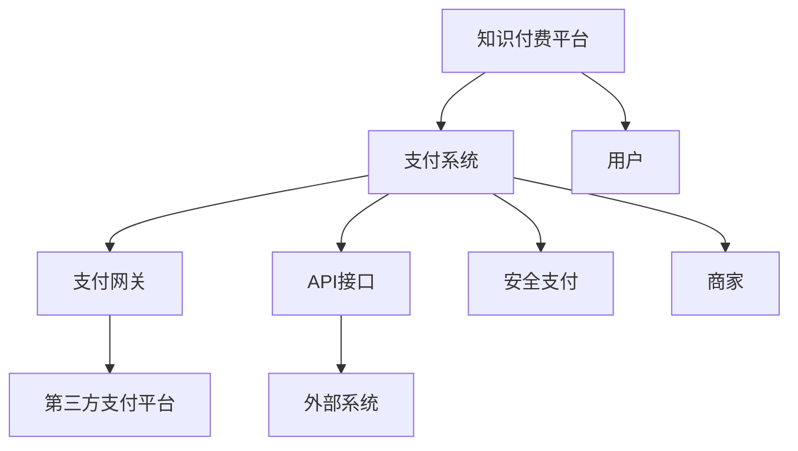

                 

# 知识付费平台的支付系统设计

> 关键词：知识付费平台、支付系统、安全支付、用户体验、交易流程、支付网关、API接口

## 1. 背景介绍

随着互联网技术的发展和人们学习需求的增长，知识付费平台应运而生。它们为专业人士提供了一个展示和传播知识的机会，同时也为广大用户提供了一个系统化的学习和成长渠道。支付系统作为知识付费平台的核心组件之一，负责完成用户的支付交易，确保资金的安全、可靠和高效。本文将围绕知识付费平台的支付系统设计展开，探讨其关键要素和优化方向。

## 2. 核心概念与联系

### 2.1 核心概念概述

在知识付费平台的设计中，支付系统是一个重要的组成部分，它连接用户、平台和支付方，确保交易的顺利进行。以下是对几个核心概念的概述：

- **知识付费平台**：一个基于互联网，提供付费知识服务的平台。用户通过订阅、购买课程或服务，获得高质量的内容。
- **支付系统**：用于处理在线支付交易的系统，包括支付网关、API接口、安全支付等。
- **支付网关**：作为商家和支付处理商之间的中介，接收用户支付请求，并转发给支付处理商进行交易处理。
- **API接口**：支付系统与外部系统（如第三方支付平台）之间的通信接口，用于数据交换和交易处理。
- **安全支付**：通过加密传输、验证机制等方式，保障用户支付数据的安全，防止欺诈和信息泄露。
- **用户体验**：支付系统设计的核心目标之一，确保用户支付流程简单、便捷，减少用户支付时的困惑和障碍。

### 2.2 核心概念原理和架构的 Mermaid 流程图



此流程图展示了知识付费平台、支付系统、支付网关、API接口、第三方支付平台、外部系统、安全支付、用户和商家之间的联系。

## 3. 核心算法原理 & 具体操作步骤

### 3.1 算法原理概述

知识付费平台的支付系统设计，核心算法包括安全支付、交易流程和支付网关集成。以下是对这些核心算法原理的概述：

- **安全支付**：通过加密传输、数字签名等技术，确保用户支付信息在传输过程中不被篡改或窃取。
- **交易流程**：包括用户下单、平台确认、商家发货、用户确认收货等步骤，确保交易过程透明、可控。
- **支付网关集成**：通过与第三方支付平台集成，实现支付信息的快速、准确传输，确保交易顺利完成。

### 3.2 算法步骤详解

#### 3.2.1 安全支付

1. **数据加密**：用户支付信息通过SSL/TLS协议加密传输，确保数据在传输过程中不被窃听。
2. **数字签名**：商家对支付订单进行数字签名，确保订单信息的完整性和真实性。
3. **风险控制**：通过风控模型，识别和拦截异常支付行为，保障用户资金安全。

#### 3.2.2 交易流程

1. **用户下单**：用户浏览课程，选择并下单，提交支付信息。
2. **平台确认**：平台验证用户支付信息和订单详情，确保交易合法。
3. **商家发货**：平台通知商家发货，商家按订单要求完成发货。
4. **用户确认收货**：用户收到商品并确认收货，平台完成交易结算。

#### 3.2.3 支付网关集成

1. **选择合适的支付网关**：根据商家需求和用户支付习惯，选择合适的支付网关。
2. **配置API接口**：将支付网关API接口配置到知识付费平台，实现支付信息的快速传输。
3. **测试与部署**：进行充分的测试，确保支付系统稳定运行，然后部署到生产环境。

### 3.3 算法优缺点

#### 3.3.1 安全支付

- **优点**：保障了用户支付信息的安全，减少了欺诈和信息泄露的风险。
- **缺点**：加密和数字签名过程增加了计算和传输的开销，可能影响支付效率。

#### 3.3.2 交易流程

- **优点**：交易过程透明、可控，提高了交易的合法性和用户信任度。
- **缺点**：流程较为繁琐，可能影响用户体验，特别是在移动端。

#### 3.3.3 支付网关集成

- **优点**：集成第三方支付平台，使用户支付更加便捷，拓展了支付渠道。
- **缺点**：支付网关的费用较高，可能影响平台的整体收益。

### 3.4 算法应用领域

支付系统设计不仅适用于知识付费平台，还广泛应用于电商、金融、医疗等行业。其核心算法和技术可以灵活应用到各种类型的在线交易中，确保交易的安全、可靠和高效。

## 4. 数学模型和公式 & 详细讲解 & 举例说明

### 4.1 数学模型构建

支付系统的核心在于确保交易的安全和高效。以下是一个简化的数学模型，用于描述支付系统的主要组成部分：

1. **用户支付信息**：表示为 $U$，包括支付金额、支付渠道等。
2. **支付网关**：表示为 $G$，负责转发支付请求。
3. **第三方支付平台**：表示为 $P$，负责处理实际的支付交易。
4. **支付订单**：表示为 $O$，包括用户信息、商品信息、支付信息等。
5. **交易流水**：表示为 $T$，记录每笔交易的详细信息。

### 4.2 公式推导过程

假设用户支付金额为 $A$，支付渠道为 $C$，支付订单编号为 $Oid$，则支付请求可以表示为：

$$
R = (A, C, Oid)
$$

商家对支付订单进行数字签名的过程可以表示为：

$$
S = \text{Sign}(R)
$$

其中 $\text{Sign}$ 为数字签名算法。

支付网关将支付请求转发给第三方支付平台的API接口，可以表示为：

$$
F = \text{Forward}(R)
$$

第三方支付平台处理支付请求，返回支付结果，可以表示为：

$$
P = \text{Process}(F)
$$

支付订单在平台上的状态可以表示为 $S$，包括未支付、已支付、已完成等。

最终，支付订单的状态变化可以表示为：

$$
S_{new} = \text{Update}(S, P)
$$

其中 $S_{new}$ 为支付订单更新后的状态。

### 4.3 案例分析与讲解

假设某用户在知识付费平台上购买了价值100元的课程，并选择微信支付作为支付渠道。支付流程如下：

1. 用户下单并提交支付信息，支付请求 $R = (100, \text{微信}, Oid)$。
2. 支付系统对支付请求进行加密和数字签名，得到 $S = \text{Sign}(R)$。
3. 支付系统将支付请求转发给微信支付平台，得到 $F = \text{Forward}(R)$。
4. 微信支付平台处理支付请求，返回支付结果 $P$。
5. 支付系统根据支付结果，更新支付订单状态为已支付。

支付系统通过以上流程，确保了交易的安全和合法性，并完成了支付订单的更新。

## 5. 项目实践：代码实例和详细解释说明

### 5.1 开发环境搭建

- **环境准备**：安装Python 3.8及以上版本，安装Flask、SQLAlchemy、SSL等库。
- **数据库搭建**：使用SQLite数据库，创建支付订单表和交易流水表。
- **支付网关选择**：选择微信支付作为支付网关，配置API接口。

### 5.2 源代码详细实现

以下是一个简化的支付系统代码实现，用于处理用户的支付请求：

```python
from flask import Flask, request
from flask_sqlalchemy import SQLAlchemy
import ssl

app = Flask(__name__)
app.config['SQLALCHEMY_DATABASE_URI'] = 'sqlite:///payment.db'
db = SQLAlchemy(app)

class PaymentOrder(db.Model):
    id = db.Column(db.Integer, primary_key=True)
    user_id = db.Column(db.Integer)
    course_id = db.Column(db.Integer)
    amount = db.Column(db.Float)
    status = db.Column(db.String(10))

class PaymentTransaction(db.Model):
    id = db.Column(db.Integer, primary_key=True)
    order_id = db.Column(db.Integer, db.ForeignKey('payment_order.id'))
    timestamp = db.Column(db.DateTime)
    platform = db.Column(db.String(50))

@app.route('/payment', methods=['POST'])
def payment():
    data = request.get_json()
    amount = data['amount']
    course_id = data['course_id']
    user_id = data['user_id']
    order_id = generate_order_id()

    order = PaymentOrder(user_id=user_id, course_id=course_id, amount=amount, status='待支付')
    db.session.add(order)
    db.session.commit()

    # 发起支付请求
    result = send_payment(order_id, '微信')
    if result == '成功':
        order.status = '已支付'
        db.session.commit()
        return '支付成功', 200
    else:
        return '支付失败', 500

def send_payment(order_id, platform):
    # 发送支付请求到第三方支付平台
    # 这里使用模拟函数，实际应用中需调用第三方支付API
    pass

@app.route('/orders', methods=['GET'])
def get_orders():
    orders = PaymentOrder.query.all()
    transactions = PaymentTransaction.query.all()
    return jsonify([{'order_id': order.id, 'course_id': order.course_id, 'amount': order.amount, 'status': order.status} for order in orders]), 200

if __name__ == '__main__':
    ssl.ensure_server_side_cert()
    app.run()
```

### 5.3 代码解读与分析

1. **Flask框架**：使用Flask框架搭建支付系统的Web服务，提供了简单的路由和HTTP请求处理能力。
2. **SQLAlchemy库**：用于数据库操作，创建支付订单和交易流水表。
3. **SSL模块**：确保支付信息的加密传输。
4. **支付订单表**：用于记录用户支付订单的详细信息。
5. **交易流水表**：用于记录每笔交易的详细信息，包括支付时间、支付平台等。
6. **路由设计**：设计了两个路由，一个用于处理支付请求，另一个用于查询支付订单。
7. **支付请求处理**：支付请求处理函数 `payment`，接收支付金额、课程ID和用户ID，生成订单ID，并发起支付请求。

### 5.4 运行结果展示

支付请求处理函数 `payment` 返回 '支付成功' 或 '支付失败'，查询支付订单函数 `get_orders` 返回所有支付订单的详细信息。

## 6. 实际应用场景

### 6.1 智能客服系统

智能客服系统通过支付系统实现用户与平台之间的交互。用户可以通过支付系统预订服务、咨询问题，系统会根据用户需求自动推荐课程或解答问题。

### 6.2 金融舆情监测

金融舆情监测系统通过支付系统实现对用户行为数据的采集和分析。平台可以根据用户的支付行为，判断其对金融市场的影响，及时预警风险。

### 6.3 个性化推荐系统

个性化推荐系统通过支付系统实现用户行为数据的积累和分析。平台可以根据用户的支付记录，推荐相关课程或服务，提升用户体验。

### 6.4 未来应用展望

随着支付技术的发展，未来的支付系统将更加智能、安全、便捷。以下是对未来应用场景的展望：

1. **智能支付**：利用AI技术，自动识别支付行为，自动完成支付过程。
2. **区块链支付**：利用区块链技术，确保交易的透明性和不可篡改性。
3. **跨平台支付**：支持多平台支付，提升支付体验。
4. **微支付**：支持小额支付，提升支付效率。

## 7. 工具和资源推荐

### 7.1 学习资源推荐

1. **《Flask Web开发实战》**：一本详细的Flask开发指南，涵盖路由、模板、数据库等核心功能。
2. **《SQLAlchemy文档》**：官方文档，详细介绍了SQLAlchemy库的使用方法。
3. **《Python网络编程》**：介绍Python网络编程的基础知识和实践技巧。
4. **《Web安全基础》**：介绍Web安全的基本概念和攻击方式，以及防护措施。
5. **《支付系统设计》**：一本系统介绍支付系统设计的书籍，涵盖支付协议、支付网关、风险控制等内容。

### 7.2 开发工具推荐

1. **Flask**：一个轻量级的Web框架，易于上手。
2. **SQLAlchemy**：一个强大的SQL数据库访问库，支持多种数据库。
3. **SSL**：用于加密传输的模块，确保支付信息的安全。
4. **PyJWT**：用于生成和解析JSON Web Token的库，保障支付订单的数字签名。
5. **Flask-RESTful**：一个用于开发RESTful服务的扩展，方便处理HTTP请求。

### 7.3 相关论文推荐

1. **《支付系统的设计与安全》**：介绍支付系统的设计原理和安全性问题。
2. **《基于区块链的支付系统研究》**：介绍基于区块链技术的支付系统架构。
3. **《AI驱动的智能支付系统》**：介绍AI技术在支付系统中的应用。

## 8. 总结：未来发展趋势与挑战

### 8.1 研究成果总结

本文对知识付费平台的支付系统设计进行了详细的探讨，重点介绍了安全支付、交易流程和支付网关集成等核心算法。通过代码实例，展示了支付系统在实际应用中的实现。

### 8.2 未来发展趋势

1. **AI驱动的支付系统**：利用AI技术，提升支付系统的智能化水平。
2. **区块链支付**：利用区块链技术，提升支付系统的安全性。
3. **跨平台支付**：支持多平台支付，提升用户体验。
4. **智能支付**：利用AI技术，自动识别支付行为，自动完成支付过程。

### 8.3 面临的挑战

1. **安全性问题**：支付系统的安全性是核心挑战之一，需要不断优化和改进。
2. **用户体验**：支付系统的用户体验直接影响用户满意度，需要不断优化。
3. **支付成本**：支付网关的费用较高，需要寻找更经济的支付解决方案。

### 8.4 研究展望

未来的支付系统需要结合AI技术、区块链技术等前沿技术，不断提升安全性、智能化和用户体验。同时，需要关注支付成本，寻找更经济的支付解决方案。

## 9. 附录：常见问题与解答

**Q1: 支付系统如何处理退款？**

A: 支付系统提供退款功能，用户可以在订单完成后申请退款。支付系统会验证订单状态和用户身份，然后发起退款请求。第三方支付平台根据支付订单进行处理，返回退款结果。

**Q2: 如何保障支付系统的安全性？**

A: 支付系统通过加密传输、数字签名、风控模型等手段，保障支付信息的安全。同时，定期进行安全审计，及时发现和修复安全漏洞。

**Q3: 支付系统如何优化用户体验？**

A: 支付系统需要简化支付流程，减少用户的操作步骤。同时，提供多种支付方式，满足不同用户的需求。

**Q4: 支付系统如何降低支付成本？**

A: 支付系统可以选择低费率的支付网关，优化API接口调用次数，提高支付效率。同时，可以引入优惠券、积分等机制，降低用户的支付成本。

---

作者：禅与计算机程序设计艺术 / Zen and the Art of Computer Programming

