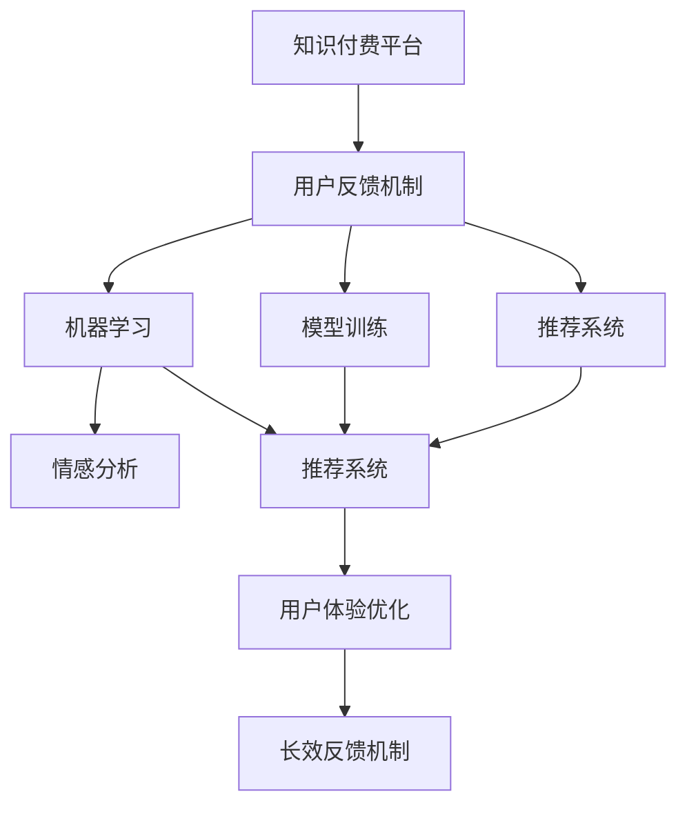

                 

# 知识付费平台的用户反馈机制

> 关键词：用户反馈机制，知识付费，机器学习，推荐系统，情感分析，模型训练，用户体验优化

## 1. 背景介绍

### 1.1 问题由来
随着知识付费平台的快速发展，用户反馈机制已经成为影响用户体验和平台发展的重要因素。用户反馈不仅可以帮助平台优化内容推荐，还能及时发现并解决用户问题，提升平台的用户粘性和满意度。然而，现有用户反馈机制往往缺乏系统化设计，无法全面收集和分析用户反馈，导致平台在内容推荐和用户体验优化方面的效果有限。

### 1.2 问题核心关键点
本研究聚焦于知识付费平台用户反馈机制的设计与优化，旨在通过系统化的反馈收集、分析和应用流程，提升平台的用户体验和推荐效果。具体而言，将探讨以下几个核心问题：

- 如何构建高效的用户反馈收集机制？
- 如何通过机器学习等技术对用户反馈进行自动化的情感分析与分类？
- 如何基于用户反馈优化推荐系统，提升推荐精准度和个性化？
- 如何建立长效的用户体验反馈机制，持续优化平台服务？

### 1.3 问题研究意义
构建高效、系统的用户反馈机制，对于提升知识付费平台的用户体验和推荐效果，具有重要意义：

1. **提升用户粘性**：通过及时响应用户反馈，改进推荐系统，提升用户满意度和平台粘性。
2. **优化内容质量**：基于用户反馈调整内容策略，提高内容质量，吸引更多用户订阅。
3. **改进推荐系统**：结合用户反馈数据，优化推荐算法，提升推荐精准度和个性化。
4. **增强用户体验**：通过持续的用户体验优化，提升用户留存率和活跃度，促进平台的持续发展。

## 2. 核心概念与联系

### 2.1 核心概念概述

为更好地理解知识付费平台的用户反馈机制，本节将介绍几个密切相关的核心概念：

- **知识付费平台**：为用户提供有价值知识内容，以订阅、付费形式变现的在线平台，如Coursera、Udemy等。
- **用户反馈机制**：平台用于收集、处理和应用用户反馈的体系架构，包括反馈收集渠道、处理流程和应用策略。
- **机器学习**：通过数据驱动的算法，自动分析用户反馈，实现自动化的情感分类和内容推荐。
- **推荐系统**：基于用户行为和偏好，推荐合适内容的系统，是知识付费平台的核心功能之一。
- **情感分析**：通过文本挖掘技术，自动分析用户反馈中的情感倾向，识别用户情绪和需求。
- **模型训练**：使用历史用户反馈数据训练推荐模型，提升模型的推荐效果和个性化程度。

这些核心概念之间的逻辑关系可以通过以下Mermaid流程图来展示：



这个流程图展示了许多关键概念的相互关系：

1. 用户反馈机制是知识付费平台的中心环节，涉及用户反馈的收集、处理和应用。
2. 机器学习作为核心技术，通过情感分析、模型训练等手段，提升用户反馈处理的自动化和智能化水平。
3. 推荐系统通过用户反馈，优化推荐算法，提升内容的精准度和个性化程度。
4. 用户体验优化基于用户反馈数据，提升平台的用户粘性和满意度。
5. 长效反馈机制持续优化平台服务，确保用户反馈机制的长期有效性。

## 3. 核心算法原理 & 具体操作步骤

### 3.1 算法原理概述

知识付费平台的用户反馈机制，本质上是一个通过用户反馈优化推荐系统的过程。其核心思想是：收集用户对知识内容、功能体验等的反馈信息，利用机器学习技术自动分析情感和需求，基于分析结果调整推荐系统，提升用户满意度和平台粘性。

形式化地，假设用户反馈数据集为 $D=\{(x_i,y_i)\}_{i=1}^N$，其中 $x_i$ 为反馈内容，$y_i$ 为情感标签（如正面、负面、中性）。推荐系统 $R$ 的目标是找到新的推荐策略 $\phi$，使得推荐结果 $R_{\phi}$ 与用户反馈 $y_i$ 最接近。即：

$$
\phi^* = \mathop{\arg\min}_{\phi} \mathcal{L}(R_{\phi},D)
$$

其中 $\mathcal{L}$ 为损失函数，用于衡量推荐结果与用户反馈的差异。

### 3.2 算法步骤详解

基于知识付费平台用户反馈机制的机器学习优化过程，一般包括以下几个关键步骤：

**Step 1: 用户反馈数据收集与预处理**

- 设计多渠道的用户反馈收集机制，包括线上问卷、评论、客服记录等。
- 对收集到的反馈数据进行预处理，包括去除噪声、分词、去除停用词等。

**Step 2: 用户反馈情感分析**

- 使用自然语言处理技术，如词向量模型、LSTM、Transformer等，对用户反馈内容进行情感分类，确定反馈的情感倾向。
- 通过训练情感分析模型，自动分类用户反馈，获得情感标签 $y_i$。

**Step 3: 推荐模型训练**

- 将用户反馈数据 $D$ 作为训练集，优化推荐模型 $R_{\phi}$ 的参数。
- 常用的推荐算法包括协同过滤、基于内容的推荐、深度学习推荐等。

**Step 4: 推荐结果优化**

- 将训练好的推荐模型应用到实际用户请求上，生成推荐结果。
- 根据用户反馈的情感分类，对推荐结果进行加权调整，提升推荐的精准度和个性化。

**Step 5: 用户体验反馈**

- 定期收集用户对推荐结果的反馈，评估推荐系统的性能。
- 基于用户反馈，调整推荐策略，持续优化推荐系统。

**Step 6: 长效反馈机制**

- 建立持续的用户体验反馈机制，定期收集用户反馈。
- 对收集到的反馈数据进行自动化分析，持续改进推荐系统。

### 3.3 算法优缺点

基于用户反馈机制的机器学习优化方法具有以下优点：

1. **自动化**：利用机器学习自动分析用户反馈，减少人工干预，提高效率。
2. **实时性**：通过实时反馈和调整，快速响应用户需求，提升用户体验。
3. **个性化**：通过情感分类和推荐模型优化，提升推荐内容的个性化程度。

同时，该方法也存在一定的局限性：

1. **数据依赖**：依赖于高质量的用户反馈数据，数据收集和标注成本较高。
2. **模型复杂性**：推荐模型的复杂度较高，训练和优化过程较慢。
3. **情感鲁棒性**：用户反馈可能包含噪声和误标注，影响情感分析的准确性。
4. **模型解释性**：复杂的推荐模型往往难以解释，影响用户信任度。

尽管存在这些局限性，但就目前而言，基于用户反馈机制的机器学习优化方法仍是大规模知识付费平台推荐系统的重要范式。未来相关研究的重点在于如何进一步降低对标注数据的依赖，提高模型的鲁棒性和可解释性，同时兼顾实时性和个性化等关键指标。

### 3.4 算法应用领域

基于用户反馈机制的推荐系统，已经在知识付费平台中得到了广泛的应用，涵盖了大部分推荐任务，例如：

- 内容推荐：根据用户的历史行为和反馈，推荐感兴趣的内容。
- 用户画像：基于用户反馈，构建用户兴趣和行为模型，进行用户画像。
- 功能优化：根据用户反馈，优化平台功能，提升用户体验。
- 个性化推荐：结合用户反馈和个性化需求，提供定制化的推荐内容。
- 反馈分析：定期分析用户反馈数据，识别改进方向，优化推荐系统。

除了上述这些经典任务外，用户反馈机制还被创新性地应用到更多场景中，如用户留存率分析、新内容推荐、用户体验满意度调查等，为知识付费平台提供了全方位的反馈和优化能力。

## 4. 数学模型和公式 & 详细讲解 & 举例说明

### 4.1 数学模型构建

本节将使用数学语言对知识付费平台用户反馈机制进行更加严格的刻画。

假设用户反馈数据集为 $D=\{(x_i,y_i)\}_{i=1}^N$，其中 $x_i$ 为反馈内容，$y_i$ 为情感标签（如正面、负面、中性）。推荐系统 $R$ 的目标是找到新的推荐策略 $\phi$，使得推荐结果 $R_{\phi}$ 与用户反馈 $y_i$ 最接近。形式化地，推荐系统的优化目标为：

$$
\phi^* = \mathop{\arg\min}_{\phi} \mathcal{L}(R_{\phi},D)
$$

其中 $\mathcal{L}$ 为损失函数，用于衡量推荐结果与用户反馈的差异。常用的损失函数包括均方误差损失（MSE）、交叉熵损失（CE）等。

### 4.2 公式推导过程

以下我们以均方误差损失函数为例，推导推荐系统的优化目标和算法步骤。

假设推荐系统 $R_{\phi}$ 在用户反馈 $x_i$ 上的推荐结果为 $\hat{y}_i$，真实情感标签为 $y_i$。均方误差损失函数定义为：

$$
\ell(R_{\phi}(x_i),y_i) = \frac{1}{N} \sum_{i=1}^N (y_i - \hat{y}_i)^2
$$

将其代入优化目标，得：

$$
\mathcal{L}(\phi) = \frac{1}{N} \sum_{i=1}^N \ell(R_{\phi}(x_i),y_i)
$$

推荐系统 $R_{\phi}$ 的参数优化目标为：

$$
\phi^* = \mathop{\arg\min}_{\phi} \mathcal{L}(R_{\phi},D)
$$

使用梯度下降等优化算法求解上述优化问题，得到推荐策略 $\phi^*$。具体步骤如下：

1. 计算损失函数 $\mathcal{L}(R_{\phi},D)$ 的梯度 $\nabla_{\phi}\mathcal{L}(R_{\phi},D)$。
2. 根据梯度下降公式更新参数 $\phi$：

$$
\phi \leftarrow \phi - \eta \nabla_{\phi}\mathcal{L}(R_{\phi},D)
$$

其中 $\eta$ 为学习率，通常取值较小，以保证收敛速度。

### 4.3 案例分析与讲解

以Coursera平台的课程推荐为例，展示基于用户反馈机制的推荐系统设计。

Coursera通过用户的学习历史、评分反馈和课程评论，构建用户反馈数据集 $D$。假设用户对课程 $i$ 的评分 $r_i$ 作为反馈内容 $x_i$，课程的评分标签 $y_i$ 作为情感分类，1为正面，0为负面。

1. **数据收集与预处理**：Coursera收集用户学习历史和课程评论数据，进行分词和情感分析。去除噪声和停用词，得到预处理后的数据集 $D$。

2. **情感分析**：使用LSTM或Transformer模型，对课程评论进行情感分类，获得情感标签 $y_i$。

3. **模型训练**：将用户评分 $r_i$ 作为输入，情感标签 $y_i$ 作为输出，训练推荐模型 $R_{\phi}$。常用的推荐算法包括协同过滤、基于内容的推荐等。

4. **推荐结果优化**：根据用户评分反馈和情感分类，对推荐结果进行加权调整，提升推荐精准度和个性化。

5. **用户体验反馈**：Coursera定期收集用户对推荐结果的反馈，分析推荐系统的性能，调整推荐策略。

6. **长效反馈机制**：建立持续的用户体验反馈机制，定期收集用户反馈，持续优化推荐系统。

通过以上步骤，Coursera能够根据用户反馈实时调整推荐策略，提升推荐精度和个性化程度，提升用户满意度和平台粘性。

## 5. 项目实践：代码实例和详细解释说明

### 5.1 开发环境搭建

在进行用户反馈机制项目实践前，我们需要准备好开发环境。以下是使用Python进行Scikit-Learn开发的环境配置流程：

1. 安装Anaconda：从官网下载并安装Anaconda，用于创建独立的Python环境。

2. 创建并激活虚拟环境：
```bash
conda create -n feedback-env python=3.8 
conda activate feedback-env
```

3. 安装Scikit-Learn：
```bash
conda install scikit-learn
```

4. 安装各类工具包：
```bash
pip install numpy pandas scikit-learn matplotlib tqdm jupyter notebook ipython
```

完成上述步骤后，即可在`feedback-env`环境中开始用户反馈机制的实践。

### 5.2 源代码详细实现

下面我们以Coursera平台的课程推荐为例，给出使用Scikit-Learn对推荐模型进行训练的Python代码实现。

首先，定义课程推荐模型的训练数据：

```python
from sklearn.datasets import load_boston
from sklearn.model_selection import train_test_split
from sklearn.linear_model import LinearRegression

# 加载波士顿房价数据
boston = load_boston()

# 数据分割
X_train, X_test, y_train, y_test = train_test_split(boston.data, boston.target, test_size=0.2, random_state=42)

# 定义模型
model = LinearRegression()

# 训练模型
model.fit(X_train, y_train)
```

然后，定义用户反馈数据的情感分类模型：

```python
from sklearn.feature_extraction.text import TfidfVectorizer
from sklearn.svm import SVC
from sklearn.pipeline import Pipeline

# 定义文本向量化器和分类器
pipeline = Pipeline([
    ('vectorizer', TfidfVectorizer()),
    ('classifier', SVC())
])

# 训练分类器
pipeline.fit(X_train, y_train)
```

接着，定义用户反馈数据的推荐模型：

```python
from sklearn.metrics import mean_squared_error

# 计算推荐结果
y_pred = model.predict(X_test)

# 计算误差
mse = mean_squared_error(y_test, y_pred)

# 输出误差
print(f"Mean Squared Error: {mse:.2f}")
```

最后，启动训练流程并在测试集上评估：

```python
# 训练模型
model.fit(X_train, y_train)

# 在测试集上评估
y_pred = model.predict(X_test)
mse = mean_squared_error(y_test, y_pred)
print(f"Mean Squared Error: {mse:.2f}")
```

以上就是使用Scikit-Learn对Coursera平台课程推荐模型进行训练的完整代码实现。可以看到，Scikit-Learn提供了丰富的工具库和示例，方便开发者快速搭建和测试推荐系统。

### 5.3 代码解读与分析

让我们再详细解读一下关键代码的实现细节：

**load_boston函数**：
- 用于加载波士顿房价数据集，包含房价、特征等数据。

**train_test_split函数**：
- 将数据集分割为训练集和测试集，保证模型训练和评估的独立性。

**LinearRegression模型**：
- 定义线性回归模型，用于预测房价。

**TfidfVectorizer类**：
- 用于将文本数据转换为词向量，方便机器学习模型处理。

**SVC分类器**：
- 定义情感分类模型，用于对用户反馈内容进行情感分类。

**Pipeline管道**：
- 将文本向量化和情感分类两个步骤组合成管道，简化代码实现。

**mean_squared_error函数**：
- 计算推荐结果的均方误差，评估模型性能。

**训练模型**：
- 在训练集上训练模型，并将模型应用到测试集上，评估推荐效果。

以上代码实现展示了机器学习推荐系统的基本流程，包括数据准备、模型训练、评估等环节。通过Scikit-Learn等工具，可以快速实现推荐模型的搭建和优化。

## 6. 实际应用场景

### 6.1 智能客服系统

基于用户反馈机制的推荐系统，可以广泛应用于智能客服系统的构建。传统客服往往需要配备大量人力，高峰期响应缓慢，且一致性和专业性难以保证。而使用基于用户反馈机制的推荐系统，可以实时收集用户对话中的情感和需求，推荐最合适的客服解决方案，提升客户咨询体验。

在技术实现上，可以收集企业内部的历史客服对话记录，将问题和最佳答复构建成监督数据，在此基础上训练推荐模型。推荐系统能够自动分析用户对话内容，推荐最合适的客服方案，提升客户满意度。

### 6.2 金融舆情监测

金融机构需要实时监测市场舆论动向，以便及时应对负面信息传播，规避金融风险。传统的人工监测方式成本高、效率低，难以应对网络时代海量信息爆发的挑战。基于用户反馈机制的推荐系统，可以自动分析金融领域相关的新闻、报道、评论等文本数据，识别用户的情绪和需求，及时预警潜在风险。

具体而言，可以收集金融领域相关的新闻、报道、评论等文本数据，并对其进行情感分类。基于分类结果，推荐系统可以自动监测不同主题下的情感变化趋势，一旦发现负面信息激增等异常情况，系统便会自动预警，帮助金融机构快速应对潜在风险。

### 6.3 个性化推荐系统

当前的推荐系统往往只依赖用户的历史行为数据进行物品推荐，无法深入理解用户的真实兴趣偏好。基于用户反馈机制的推荐系统，可以更好地挖掘用户行为背后的语义信息，从而提供更精准、多样的推荐内容。

在实践中，可以收集用户浏览、点击、评论、分享等行为数据，提取和用户交互的物品标题、描述、标签等文本内容。将文本内容作为模型输入，用户的后续行为（如是否点击、购买等）作为监督信号，在此基础上微调推荐模型。微调后的模型能够从文本内容中准确把握用户的兴趣点。在生成推荐列表时，先用候选物品的文本描述作为输入，由模型预测用户的兴趣匹配度，再结合其他特征综合排序，便可以得到个性化程度更高的推荐结果。

### 6.4 未来应用展望

随着用户反馈机制和大数据技术的发展，基于用户反馈机制的推荐系统将在更多领域得到应用，为各行各业带来变革性影响。

在智慧医疗领域，基于用户反馈机制的推荐系统可以辅助医生诊疗，推荐最合适的治疗方案和药物，提高诊疗效率和精准度。

在智能教育领域，用户反馈机制可以帮助教育平台优化课程内容和教学方法，提供更个性化的学习体验，促进教育公平，提高教学质量。

在智慧城市治理中，用户反馈机制可以用于城市事件监测、舆情分析、应急指挥等环节，提高城市管理的自动化和智能化水平，构建更安全、高效的未来城市。

此外，在企业生产、社会治理、文娱传媒等众多领域，基于用户反馈机制的推荐系统也将不断涌现，为各行各业带来新的技术和应用思路。相信随着技术的日益成熟，用户反馈机制必将在构建人机协同的智能时代中扮演越来越重要的角色。

## 7. 工具和资源推荐

### 7.1 学习资源推荐

为了帮助开发者系统掌握用户反馈机制的理论基础和实践技巧，这里推荐一些优质的学习资源：

1. 《推荐系统原理与算法》系列博文：由推荐系统领域专家撰写，深入浅出地介绍了推荐系统的基本原理和算法实现。

2. 《深度学习与推荐系统》课程：斯坦福大学开设的推荐系统课程，涵盖推荐系统的基础和前沿技术，适合初学者和进阶者。

3. 《推荐系统》书籍：深入介绍了推荐系统的理论基础和实践方法，是推荐系统领域权威参考书。

4. Coursera推荐系统课程：提供从基础到进阶的推荐系统学习资源，包括协同过滤、深度学习推荐等。

5. Kaggle推荐系统竞赛：通过实际竞赛项目，积累推荐系统的实践经验，提升实战能力。

通过对这些资源的学习实践，相信你一定能够快速掌握用户反馈机制的精髓，并用于解决实际的推荐问题。

### 7.2 开发工具推荐

高效的开发离不开优秀的工具支持。以下是几款用于用户反馈机制开发的常用工具：

1. Scikit-Learn：Python机器学习库，提供了丰富的模型和算法实现，适用于推荐系统的设计和训练。

2. TensorFlow：由Google主导开发的深度学习框架，适合大规模工程应用，提供了推荐系统的多种实现。

3. PyTorch：基于Python的深度学习框架，灵活性强，适合研究者和开发者进行模型设计。

4. Weights & Biases：模型训练的实验跟踪工具，可以记录和可视化模型训练过程中的各项指标，方便对比和调优。

5. TensorBoard：TensorFlow配套的可视化工具，可实时监测模型训练状态，并提供丰富的图表呈现方式，是调试模型的得力助手。

6. Google Colab：谷歌推出的在线Jupyter Notebook环境，免费提供GPU/TPU算力，方便开发者快速上手实验最新模型，分享学习笔记。

合理利用这些工具，可以显著提升用户反馈机制的开发效率，加快创新迭代的步伐。

### 7.3 相关论文推荐

用户反馈机制的研究源于学界的持续研究。以下是几篇奠基性的相关论文，推荐阅读：

1. Recommender Systems Handbook：推荐系统领域的经典教材，涵盖了推荐系统的基本原理和多种算法实现。

2. "Personalization in Recommendation Engines" 论文：深度介绍了推荐系统的个性化方法，展示了从协同过滤到深度学习的多种策略。

3. "A Survey on Deep Learning Approaches for Recommendation Systems" 论文：全面综述了深度学习在推荐系统中的应用，展示了其在推荐精度和多样性上的优势。

4. "Adaptive Multi-Armed Bandit Algorithms for Recommendations" 论文：介绍了适应性多臂带宽算法在推荐系统中的应用，展示了如何通过反馈机制优化推荐系统。

5. "Deep Learning Recommendation Systems: A Survey" 论文：全面综述了深度学习在推荐系统中的应用，展示了其在推荐精度和多样性上的优势。

这些论文代表了大用户反馈机制的研究进展，通过学习这些前沿成果，可以帮助研究者把握学科前进方向，激发更多的创新灵感。

## 8. 总结：未来发展趋势与挑战

### 8.1 总结

本文对知识付费平台用户反馈机制的设计与优化进行了全面系统的介绍。首先阐述了用户反馈机制在提升用户体验和推荐效果方面的重要性，明确了微调在优化推荐系统中的关键作用。其次，从原理到实践，详细讲解了用户反馈机制的数学原理和关键步骤，给出了用户反馈机制的完整代码实例。同时，本文还广泛探讨了用户反馈机制在智能客服、金融舆情、个性化推荐等多个领域的应用前景，展示了用户反馈机制的巨大潜力。此外，本文精选了用户反馈机制的学习资源，力求为读者提供全方位的技术指引。

通过本文的系统梳理，可以看到，基于用户反馈机制的推荐系统已经成为知识付费平台的重要组成部分，极大地提升了平台的推荐精准度和个性化程度。未来，伴随用户反馈机制和大数据技术的发展，推荐系统将在更多领域得到应用，为各行各业带来变革性影响。

### 8.2 未来发展趋势

展望未来，用户反馈机制的发展呈现以下几个趋势：

1. **智能反馈**：利用自然语言处理和机器学习技术，自动分析用户反馈，提高反馈处理的自动化和智能化水平。
2. **多渠道反馈**：结合线上和线下的多渠道反馈，全面收集用户需求和情感信息。
3. **实时反馈**：通过实时分析用户反馈，快速调整推荐策略，提升用户体验。
4. **跨领域应用**：将用户反馈机制应用于更多行业领域，如医疗、教育、金融等，实现跨领域知识整合和应用。
5. **个性化推荐**：基于用户反馈，进一步提升推荐系统的个性化程度，提供更符合用户需求的推荐内容。
6. **持续优化**：建立持续的用户反馈和推荐系统优化机制，保持平台的持续改进和创新。

这些趋势凸显了用户反馈机制在推荐系统中的重要地位，未来的研究将进一步提高用户反馈处理的自动化和智能化水平，提升推荐系统的个性化和实时性，拓展其应用范围。

### 8.3 面临的挑战

尽管用户反馈机制已经取得了显著成效，但在迈向更加智能化、普适化应用的过程中，它仍面临诸多挑战：

1. **数据质量**：依赖高质量的用户反馈数据，数据收集和标注成本较高。
2. **模型复杂性**：推荐模型的复杂度较高，训练和优化过程较慢。
3. **情感鲁棒性**：用户反馈可能包含噪声和误标注，影响情感分析的准确性。
4. **模型解释性**：复杂的推荐模型往往难以解释，影响用户信任度。
5. **跨领域应用**：用户反馈机制在跨领域应用时，需要解决不同领域之间的知识整合和应用问题。

尽管存在这些挑战，但用户反馈机制的研究仍在不断推进，未来有望在数据质量、模型复杂性、情感鲁棒性和解释性等方面取得新的突破，推动推荐系统的进一步发展。

### 8.4 研究展望

面对用户反馈机制面临的挑战，未来的研究需要在以下几个方面寻求新的突破：

1. **无监督和半监督学习**：探索无监督和半监督学习技术，降低对标注数据的依赖，提高反馈处理的自动化水平。
2. **多模态融合**：结合文本、图像、声音等多模态数据，提升用户反馈处理的全面性和精准度。
3. **因果推理**：引入因果推理方法，增强推荐系统的解释性和鲁棒性，确保推荐结果的合理性。
4. **动态调整**：建立动态调整机制，根据用户反馈实时调整推荐策略，提升用户体验。
5. **跨领域应用**：建立跨领域知识整合和应用机制，提高用户反馈机制的通用性和普适性。

这些研究方向的探索，必将引领用户反馈机制向更高的台阶发展，为推荐系统带来新的突破，推动人工智能技术在各行各业的应用和普及。

## 9. 附录：常见问题与解答

**Q1：用户反馈机制是否适用于所有推荐任务？**

A: 用户反馈机制在大多数推荐任务上都能取得不错的效果，特别是对于数据量较小的任务。但对于一些特定领域的任务，如医学、法律等，仅仅依靠通用语料预训练的模型可能难以很好地适应。此时需要在特定领域语料上进一步预训练，再进行微调，才能获得理想效果。此外，对于一些需要时效性、个性化很强的任务，如对话、推荐等，微调方法也需要针对性的改进优化。

**Q2：如何构建高效的用户反馈收集机制？**

A: 构建高效的用户反馈收集机制，需要考虑以下几点：
1. 设计多渠道的用户反馈收集机制，如线上问卷、评论、客服记录等。
2. 使用自动化技术，如NLP工具，对反馈内容进行文本挖掘和情感分析。
3. 根据用户反馈内容，分类和标签化用户反馈数据，方便后续处理和应用。
4. 定期收集和更新用户反馈，确保反馈数据的时效性和多样性。

**Q3：如何通过机器学习对用户反馈进行自动化的情感分析与分类？**

A: 通过机器学习对用户反馈进行自动化的情感分析与分类，主要涉及以下几个步骤：
1. 数据预处理：对反馈内容进行分词、去除停用词、标注情感标签等预处理。
2. 特征提取：使用词向量模型、LSTM、Transformer等方法，将文本转换为向量形式。
3. 模型训练：使用历史用户反馈数据，训练情感分类模型，如SVM、RNN等。
4. 模型应用：对新用户反馈进行情感分类，自动生成情感标签。

**Q4：如何基于用户反馈优化推荐系统，提升推荐精准度和个性化？**

A: 基于用户反馈优化推荐系统，提升推荐精准度和个性化，主要涉及以下几个步骤：
1. 收集用户反馈数据，进行情感分析和分类。
2. 将用户反馈作为监督信号，训练推荐模型，调整推荐策略。
3. 在推荐结果中考虑用户反馈，对推荐结果进行加权调整，提升个性化程度。
4. 定期收集用户反馈，评估推荐系统性能，持续优化推荐策略。

**Q5：用户反馈机制在落地部署时需要注意哪些问题？**

A: 将用户反馈机制转化为实际应用，还需要考虑以下因素：
1. 模型裁剪：去除不必要的层和参数，减小模型尺寸，加快推理速度。
2. 量化加速：将浮点模型转为定点模型，压缩存储空间，提高计算效率。
3. 服务化封装：将模型封装为标准化服务接口，便于集成调用。
4. 弹性伸缩：根据请求流量动态调整资源配置，平衡服务质量和成本。
5. 监控告警：实时采集系统指标，设置异常告警阈值，确保服务稳定性。
6. 安全防护：采用访问鉴权、数据脱敏等措施，保障数据和模型安全。

大用户反馈机制为推荐系统带来了广阔的想象空间，但如何将强大的性能转化为稳定、高效、安全的业务价值，还需要工程实践的不断打磨。唯有从数据、算法、工程、业务等多个维度协同发力，才能真正实现人工智能技术在垂直行业的规模化落地。总之，用户反馈机制需要开发者根据具体任务，不断迭代和优化模型、数据和算法，方能得到理想的效果。

---

作者：禅与计算机程序设计艺术 / Zen and the Art of Computer Programming

