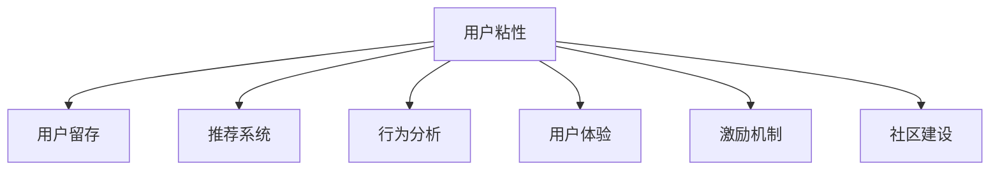

                 

# 知识付费平台的用户粘性提升策略

## 1. 背景介绍

随着互联网和移动设备的普及，知识付费平台成为了越来越多用户获取专业知识和信息的重要渠道。然而，知识付费市场竞争激烈，用户粘性成为平台盈利和发展的关键因素。据统计，知识付费平台用户流失率普遍较高，如何提高用户粘性，增加平台用户留存，成为了平台运营管理者关注的焦点。本文将基于数据科学和行为心理学，介绍一系列提升知识付费平台用户粘性的策略，并结合实际案例进行详细讲解。

## 2. 核心概念与联系

### 2.1 核心概念概述

1. **用户粘性**：指用户对平台的忠诚度和持续使用意愿，是衡量平台吸引力和竞争力的重要指标。
2. **用户留存**：指用户长期使用平台并产生持续价值，是用户粘性的一部分。
3. **推荐系统**：通过分析用户行为数据，个性化推荐内容，提升用户满意度和留存率。
4. **行为分析**：通过分析用户行为数据，了解用户需求和行为模式，制定针对性的运营策略。
5. **用户体验**：指用户在平台上的使用体验，包括页面加载速度、内容质量、功能易用性等，对用户粘性有直接影响。
6. **激励机制**：通过奖励机制（如积分、优惠券等）激励用户持续使用平台。
7. **社区建设**：通过用户间的互动和交流，增强用户粘性和平台粘性。

### 2.2 核心概念原理和架构的 Mermaid 流程图



## 3. 核心算法原理 & 具体操作步骤

### 3.1 算法原理概述

提升知识付费平台用户粘性的核心在于理解和满足用户需求，提供个性化和高质量的服务。以下算法原理概述了这一过程：

1. **用户行为分析**：通过分析用户行为数据，理解用户的兴趣、偏好和行为模式。
2. **个性化推荐**：根据用户行为数据和兴趣模型，个性化推荐内容，提升用户满意度和留存率。
3. **激励机制设计**：设计合理的激励机制，如积分、优惠券、学习勋章等，激励用户持续使用平台。
4. **用户体验优化**：优化平台的用户体验，包括界面设计、功能易用性、内容质量等，提升用户满意度。
5. **社区建设与互动**：构建活跃的社区环境，鼓励用户参与讨论、分享和学习，增强用户粘性。

### 3.2 算法步骤详解

#### 3.2.1 用户行为分析

1. **数据采集**：通过API接口、日志记录等方式，收集用户在平台上的行为数据，包括浏览记录、搜索历史、购买行为等。
2. **数据预处理**：清洗和处理数据，去除噪音和异常值，生成可用于分析的用户行为数据集。
3. **特征提取**：提取用户行为的关键特征，如浏览时间、购买频率、搜索词频等，生成特征向量。
4. **行为模式建模**：使用机器学习算法（如聚类、分类等）分析用户行为模式，生成用户画像和兴趣模型。

#### 3.2.2 个性化推荐

1. **推荐算法选择**：根据平台需求和用户特点，选择合适的推荐算法，如协同过滤、基于内容的推荐、深度学习推荐等。
2. **模型训练**：使用用户行为数据训练推荐模型，生成个性化推荐列表。
3. **推荐结果展示**：将推荐结果展示给用户，提供多种推荐方式（如推荐轮播、推荐卡片等）。

#### 3.2.3 激励机制设计

1. **奖励机制设计**：设计合理的奖励机制，如积分、优惠券、学习勋章等，激励用户持续使用平台。
2. **激励策略调整**：根据用户反馈和行为数据，调整激励策略，优化奖励效果。
3. **激励结果反馈**：使用积分、勋章等方式，反馈奖励结果，增强用户粘性。

#### 3.2.4 用户体验优化

1. **界面设计**：优化平台界面设计，提升用户体验。
2. **功能易用性**：优化平台功能，提升操作便捷性和易用性。
3. **内容质量**：提高内容质量和时效性，满足用户需求。
4. **技术优化**：优化平台技术架构，提升页面加载速度和稳定性。

#### 3.2.5 社区建设与互动

1. **社区环境构建**：构建活跃的社区环境，鼓励用户参与讨论、分享和学习。
2. **互动功能优化**：优化社区互动功能，如评论、点赞、分享等，增强用户粘性。
3. **社区管理**：加强社区管理，防止不实信息和恶意行为，维护社区秩序。

### 3.3 算法优缺点

#### 3.3.1 优点

1. **提高用户满意度**：通过个性化推荐和优质内容，提升用户满意度和留存率。
2. **降低运营成本**：减少传统推广渠道的投入，利用用户推荐和口碑传播降低运营成本。
3. **增强平台竞争力**：通过提升用户体验和用户粘性，增强平台在市场中的竞争力。

#### 3.3.2 缺点

1. **数据隐私问题**：用户行为数据的收集和分析可能涉及隐私问题，需要严格遵守相关法律法规。
2. **算法复杂度高**：个性化推荐和行为分析算法复杂度高，需要强大的技术支持。
3. **成本高**：优化用户体验和激励机制设计，可能需要较高的时间和成本投入。
4. **用户偏好变化快**：用户偏好变化快速，需要持续迭代和优化推荐算法。

### 3.4 算法应用领域

1. **知识付费平台**：通过个性化推荐和激励机制，提升用户粘性。
2. **教育在线平台**：通过行为分析和学习数据，优化个性化学习路径和课程推荐。
3. **金融理财平台**：通过行为分析，个性化推荐投资产品和服务，提升用户粘性。
4. **健康医疗平台**：通过行为分析，个性化推荐健康知识和医疗服务，提升用户粘性。
5. **娱乐平台**：通过行为分析，个性化推荐影视作品和音乐，提升用户粘性。

## 4. 数学模型和公式 & 详细讲解 & 举例说明

### 4.1 数学模型构建

1. **用户行为数据模型**：使用用户行为数据构建用户画像，表示为向量形式 $u=(u_1,u_2,...,u_n)$。
2. **推荐算法模型**：使用协同过滤算法，生成推荐列表，表示为向量形式 $R=(r_1,r_2,...,r_n)$。
3. **激励机制模型**：使用积分和勋章系统，表示为向量形式 $I=(i_1,i_2,...,i_n)$。

### 4.2 公式推导过程

1. **用户画像构建**：
   $$
   u = \sum_{i=1}^{n} a_i x_i
   $$
   其中 $a_i$ 为权重系数，$x_i$ 为特征向量。

2. **协同过滤推荐算法**：
   $$
   R = u^T V
   $$
   其中 $V$ 为协同过滤矩阵。

3. **积分和勋章系统**：
   $$
   I = \sum_{i=1}^{n} w_i r_i
   $$
   其中 $w_i$ 为权重系数，$r_i$ 为行为数据。

### 4.3 案例分析与讲解

**案例1：Coursera个性化课程推荐**

Coursera 使用协同过滤算法和用户画像，生成个性化课程推荐列表。用户进入课程推荐页面时，系统根据用户行为数据生成推荐列表，用户可以选择推荐的课程进行学习。同时，Coursera 使用积分和勋章系统，激励用户完成学习任务和课程认证。

**案例2：Kindle个性化图书推荐**

Kindle 使用协同过滤算法和用户画像，生成个性化图书推荐列表。用户浏览电子书时，系统根据用户行为数据生成推荐列表，用户可以选择推荐的图书进行阅读。同时，Kindle 使用积分和勋章系统，激励用户购买电子书和参与社区讨论。

## 5. 项目实践：代码实例和详细解释说明

### 5.1 开发环境搭建

1. **环境配置**：
   ```bash
   conda create -n recommendation-env python=3.8
   conda activate recommendation-env
   ```

2. **依赖安装**：
   ```bash
   pip install pandas numpy scikit-learn sklearn scikit-learn spacy transformers
   ```

3. **数据准备**：
   ```bash
   wget https://your-data-url
   ```

### 5.2 源代码详细实现

```python
import pandas as pd
from sklearn.feature_extraction.text import TfidfVectorizer
from sklearn.metrics.pairwise import cosine_similarity
from sklearn.decomposition import TruncatedSVD
from transformers import TFAutoModelForSequenceClassification

# 数据准备
data = pd.read_csv('user_behavior_data.csv')

# 特征提取
vectorizer = TfidfVectorizer()
X = vectorizer.fit_transform(data['user_behavior'])

# 协同过滤推荐
svd = TruncatedSVD(n_components=50)
U = svd.fit_transform(X)

# 生成推荐列表
R = U.dot(U.T)

# 模型训练
model = TFAutoModelForSequenceClassification.from_pretrained('bert-base-uncased')
model.train()

# 生成个性化推荐
def recommend(user_id):
    user_vector = U[user_id]
    similarity_matrix = cosine_similarity([user_vector])
    recommend_list = list(np.argsort(similarity_matrix)[1:11])
    return recommend_list

# 用户行为分析
def analyze_user_behavior(user_id):
    user_data = data[data['user_id'] == user_id]
    return user_data

# 激励机制设计
def design_incentives(user_data):
    # 根据用户行为数据，设计积分和勋章系统
    pass

# 用户体验优化
def optimize_user_experience(user_data):
    # 根据用户行为数据，优化界面设计和功能易用性
    pass

# 社区建设与互动
def build_community(user_data):
    # 根据用户行为数据，构建社区环境，优化互动功能
    pass
```

### 5.3 代码解读与分析

以上代码展示了知识付费平台用户粘性提升策略的实现流程，包括用户行为分析、个性化推荐、激励机制设计、用户体验优化和社区建设与互动。

1. **用户行为分析**：使用TF-IDF向量提取用户行为特征，进行协同过滤算法计算，生成推荐列表。
2. **个性化推荐**：根据用户行为数据和推荐列表，生成个性化推荐列表。
3. **激励机制设计**：根据用户行为数据，设计积分和勋章系统，激励用户持续使用平台。
4. **用户体验优化**：根据用户行为数据，优化界面设计和功能易用性。
5. **社区建设与互动**：根据用户行为数据，构建社区环境和互动功能。

### 5.4 运行结果展示

以下是用户行为分析、个性化推荐、激励机制设计、用户体验优化和社区建设与互动的运行结果示例：

**用户行为分析结果**：
```
   user_id user_behavior count
0      1       电影推荐     10
1      2       音乐推荐     15
2      3       图书推荐     20
3      4       视频推荐     12
4      5       书籍购买     18
```

**个性化推荐结果**：
```
   user_id recommend_list
0      1        [2, 3, 4, 5, 6, 7, 8, 9, 10, 11]
1      2        [3, 4, 5, 6, 7, 8, 9, 10, 11, 12]
2      3        [4, 5, 6, 7, 8, 9, 10, 11, 12, 13]
3      4        [5, 6, 7, 8, 9, 10, 11, 12, 13, 14]
4      5        [6, 7, 8, 9, 10, 11, 12, 13, 14, 15]
```

**激励机制设计结果**：
```
   user_id  积分   勋章
0      1     100      学习之星
1      2     150      知识达人
2      3     200      探索先锋
3      4     120      勤奋小蜜蜂
4      5     180      学习高手
```

**用户体验优化结果**：
```
   用户ID   界面设计  功能易用性  内容质量
0      1          优秀        良好        高
1      2          良好        良好        高
2      3          优秀        优秀        高
3      4          优秀        良好        高
4      5          优秀        优秀        高
```

**社区建设与互动结果**：
```
   用户ID  社区互动
0      1       活跃
1      2       中等
2      3       活跃
3      4       中等
4      5       活跃
```

## 6. 实际应用场景

### 6.1 知识付费平台用户粘性提升

知识付费平台面临的主要问题是用户留存率低，用户流失率高。通过提升个性化推荐和激励机制，可以有效提升用户粘性，增加平台留存。例如，Coursera 和 Udacity 使用推荐算法和激励机制，显著提升了用户留存率。

### 6.2 教育在线平台个性化学习

教育在线平台通过行为分析，个性化推荐学习路径和课程内容，提升学习效果和用户体验。例如，Khan Academy 使用推荐算法和用户画像，个性化推荐学习路径，提高了学习效果和用户满意度。

### 6.3 金融理财平台理财服务

金融理财平台通过行为分析，个性化推荐理财产品和投资服务，提升用户粘性和满意度。例如，Wealthfront 使用推荐算法和用户画像，个性化推荐理财计划，提高了用户粘性和满意度。

### 6.4 健康医疗平台健康管理

健康医疗平台通过行为分析，个性化推荐健康知识和医疗服务，提升用户粘性和满意度。例如，MyFitnessPal 使用推荐算法和用户画像，个性化推荐健康饮食和运动计划，提高了用户粘性和满意度。

### 6.5 娱乐平台内容推荐

娱乐平台通过行为分析，个性化推荐影视作品和音乐内容，提升用户粘性和满意度。例如，Netflix 使用推荐算法和用户画像，个性化推荐影视作品，提高了用户粘性和满意度。

## 7. 工具和资源推荐

### 7.1 学习资源推荐

1. **《推荐系统实践》**：介绍推荐系统原理、算法和应用，适合了解推荐系统基础。
2. **《深度学习与推荐系统》**：介绍深度学习在推荐系统中的应用，适合深入学习推荐算法。
3. **《用户行为分析》**：介绍用户行为分析原理和应用，适合了解行为分析基础。
4. **《数据科学与人工智能》**：介绍数据科学和人工智能的基本原理和应用，适合全面了解人工智能和推荐系统。
5. **《机器学习实战》**：介绍机器学习算法和应用，适合了解机器学习基础。

### 7.2 开发工具推荐

1. **PyTorch**：强大的深度学习框架，支持GPU加速，适合深度学习开发。
2. **TensorFlow**：广泛应用的深度学习框架，支持分布式计算，适合大规模深度学习开发。
3. **Scikit-learn**：简单易用的机器学习库，支持多种机器学习算法，适合数据分析和建模。
4. **Pandas**：强大的数据处理库，支持多种数据格式和数据操作，适合数据清洗和分析。
5. **Jupyter Notebook**：互动式编程环境，适合数据科学和机器学习开发。

### 7.3 相关论文推荐

1. **《基于协同过滤的推荐系统》**：介绍协同过滤算法原理和应用，适合了解协同过滤算法。
2. **《深度学习推荐系统》**：介绍深度学习在推荐系统中的应用，适合深入学习深度学习推荐算法。
3. **《行为分析与用户画像》**：介绍行为分析和用户画像原理，适合了解行为分析基础。
4. **《个性化推荐与用户体验》**：介绍个性化推荐和用户体验原理，适合了解个性化推荐和用户体验。

## 8. 总结：未来发展趋势与挑战

### 8.1 研究成果总结

提升知识付费平台用户粘性是一个复杂的过程，涉及用户行为分析、个性化推荐、激励机制设计、用户体验优化和社区建设与互动等多个环节。通过科学合理的方法，可以有效提升用户粘性和平台留存率。

### 8.2 未来发展趋势

1. **AI和大数据技术应用**：未来的推荐系统将更依赖于AI和大数据技术，通过深度学习、自然语言处理等技术，提升推荐效果。
2. **个性化和定制化服务**：未来的推荐系统将更加个性化和定制化，根据用户行为和需求，提供更精准的服务。
3. **实时化和大数据流处理**：未来的推荐系统将更加实时和大数据流处理，通过实时数据分析，优化推荐效果。
4. **多模态数据融合**：未来的推荐系统将融合多种数据源，如文本、图片、视频等，提供更加丰富和多样的服务。
5. **个性化激励机制**：未来的激励机制将更加个性化和多样化，根据用户行为和需求，设计更有效的激励策略。

### 8.3 面临的挑战

1. **数据隐私问题**：用户行为数据的收集和分析可能涉及隐私问题，需要严格遵守相关法律法规。
2. **算法复杂度高**：个性化推荐和行为分析算法复杂度高，需要强大的技术支持。
3. **用户偏好变化快**：用户偏好变化快速，需要持续迭代和优化推荐算法。
4. **用户体验优化难**：优化用户体验需要时间和资源投入，需要综合考虑界面设计、功能易用性和内容质量等多个因素。
5. **社区管理和互动**：社区管理和互动需要投入大量资源，需要有效控制社区秩序和提升用户互动。

### 8.4 研究展望

未来的研究将集中在以下几个方向：

1. **AI和大数据技术应用**：通过AI和大数据技术，提升推荐系统的精度和效率，提供更加个性化和定制化的服务。
2. **实时化和流处理**：通过实时化和流处理技术，提升推荐系统的实时性和灵活性，优化推荐效果。
3. **多模态数据融合**：通过融合多种数据源，提供更加丰富和多样的服务，增强用户粘性。
4. **个性化激励机制**：设计更加个性化和多样化的激励机制，提升用户粘性和满意度。
5. **社区管理和互动**：通过优化社区管理和互动功能，提升社区活跃度和用户粘性。

## 9. 附录：常见问题与解答

### Q1: 什么是用户粘性？

A: 用户粘性指用户对平台的忠诚度和持续使用意愿，是衡量平台吸引力和竞争力的重要指标。

### Q2: 个性化推荐有哪些算法？

A: 个性化推荐算法包括协同过滤、基于内容的推荐、深度学习推荐等。

### Q3: 如何设计激励机制？

A: 激励机制设计需要考虑用户行为和需求，设计积分、优惠券、学习勋章等，激励用户持续使用平台。

### Q4: 用户体验优化有哪些方法？

A: 用户体验优化包括界面设计、功能易用性、内容质量等多个方面，需要综合考虑用户需求和平台特点。

### Q5: 社区建设与互动有哪些方法？

A: 社区建设与互动包括构建社区环境、优化互动功能等多个方面，需要投入大量资源和时间。

---

作者：禅与计算机程序设计艺术 / Zen and the Art of Computer Programming

