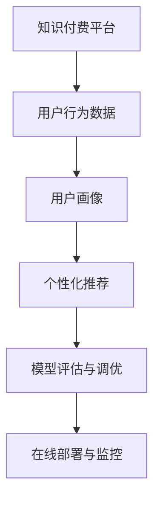

                 

# 知识付费平台的用户转化率优化

> 关键词：知识付费,用户转化率,留存率,推荐算法,个性化推荐,深度学习,模型优化

## 1. 背景介绍

### 1.1 问题由来
在当今知识经济时代，知识付费平台如雨后春笋般涌现。这些平台聚集了大量优质内容，旨在为人们提供系统、专业的知识学习渠道。然而，尽管内容资源丰富，知识付费平台的实际用户转化率却并不理想。高昂的订阅费用、优质内容的获取难度、平台的用户体验问题等，都是影响用户转化的重要因素。为了提升平台的用户转化率，需要深入分析用户行为，优化推荐算法，提供更加个性化和精准的知识推荐服务。

### 1.2 问题核心关键点
知识付费平台用户转化率优化的核心在于通过数据分析和机器学习技术，深入了解用户需求，提供个性化推荐，增强用户黏性。具体来说，需要解决以下几个问题：
- 如何获取用户行为数据：通过日志、点击、订阅等行为记录，了解用户的兴趣偏好。
- 如何构建用户画像：将用户数据转化为可视化的用户特征，便于机器模型理解和处理。
- 如何设计推荐模型：使用深度学习等技术，构建精准的推荐模型，提升推荐效果。
- 如何优化模型效果：通过模型评估和调优，提升推荐准确性和用户满意度。
- 如何部署模型到生产环境：将模型部署到实际生产环境，确保推荐服务的稳定性和实时性。

## 2. 核心概念与联系

### 2.1 核心概念概述

为了更好地理解用户转化率优化的方法，本节将介绍几个密切相关的核心概念：

- **知识付费平台**：聚集优质内容，提供专业、系统知识学习的服务平台。
- **用户转化率**：用户在接触到平台内容后，最终完成订阅、购买等付费行为的比例。
- **用户画像**：通过数据分析和挖掘，形成用户特征的完整描述，便于平台进行个性化推荐和服务。
- **个性化推荐**：根据用户行为和特征，为用户推荐其感兴趣的内容，提升用户体验和满意度。
- **深度学习**：通过神经网络等模型，学习用户数据中的潜在规律，构建推荐算法。
- **模型评估与调优**：通过多种指标，评估模型效果，并通过参数调整，提升模型性能。
- **在线部署与监控**：将优化后的模型部署到生产环境，实时监控推荐服务，确保其稳定性和效率。

这些概念之间的逻辑关系可以通过以下Mermaid流程图来展示：



这个流程图展示了一系列核心概念之间的逻辑关系：

1. 平台首先收集用户行为数据。
2. 通过对数据的分析和挖掘，构建用户画像。
3. 基于用户画像，设计个性化推荐算法。
4. 通过评估和调优推荐模型，提升推荐效果。
5. 将优化后的模型部署到生产环境中，实时监控和优化推荐服务。

这些概念共同构成了知识付费平台用户转化率优化的技术框架，通过优化推荐算法，可以显著提升用户满意度和转化率，推动平台的业务发展。

## 3. 核心算法原理 & 具体操作步骤
### 3.1 算法原理概述

知识付费平台的用户转化率优化，本质上是一个通过机器学习进行个性化推荐的过程。其核心思想是：利用用户行为数据，构建用户画像，设计个性化推荐模型，通过不断优化模型参数，提升推荐的准确性和用户满意度，从而提高用户转化率。

形式化地，假设平台有N个用户，每个用户有M个行为记录（如点击、订阅等），记为 $(x_i, y_i)$，其中 $x_i$ 为用户的行为特征向量， $y_i$ 为该行为的标签（是否完成转化）。推荐模型的目标是最小化误分类率，即：

$$
\min_{\theta} \frac{1}{N}\sum_{i=1}^N L(y_i, f_{\theta}(x_i))
$$

其中 $L(y_i, f_{\theta}(x_i))$ 为损失函数，$y_i$ 为实际标签，$f_{\theta}(x_i)$ 为模型预测。通常使用交叉熵损失函数来衡量预测结果与实际标签之间的差异。

通过梯度下降等优化算法，模型不断更新参数 $\theta$，最小化损失函数，使得模型输出逼近真实标签。由于用户行为数据通常包含大量特征，如点击时间、浏览时长、课程评分等，因此推荐模型通常为复杂的深度学习模型，如协同过滤、基于CTR的模型、深度神经网络等。

### 3.2 算法步骤详解

知识付费平台用户转化率优化的一般流程包括：

**Step 1: 收集用户行为数据**
- 设计日志记录机制，记录用户在平台上的各种行为，如点击、浏览、订阅、购买等。
- 对数据进行清洗和预处理，去除无效或异常记录。

**Step 2: 构建用户画像**
- 使用特征工程方法，将原始行为数据转化为高维特征向量，如点击序列、兴趣标签等。
- 应用聚类、降维等技术，提取用户的主要行为特征，形成用户画像。

**Step 3: 设计推荐模型**
- 选择合适的深度学习模型，如CTR预估模型、序列推荐模型等，构建推荐系统。
- 设计损失函数和优化算法，设置超参数，如学习率、批大小等。

**Step 4: 训练和优化推荐模型**
- 将用户行为数据和标签（是否转化）输入模型，进行前向传播和后向传播。
- 使用优化算法（如Adam、SGD等）更新模型参数，最小化损失函数。
- 周期性在验证集上评估模型性能，根据评估结果调整超参数。

**Step 5: 部署和监控推荐系统**
- 将训练好的模型部署到实际生产环境中，实时接收用户行为数据。
- 实时监控推荐系统性能，评估推荐效果，处理异常情况。

### 3.3 算法优缺点

基于深度学习的个性化推荐方法具有以下优点：
1. 模型复杂度高，能够捕捉用户行为的细微特征。
2. 自动化调参，可以更快速地找到最优模型参数。
3. 实时性高，能够及时更新推荐内容。
4. 可以应对大规模数据，处理能力强。

同时，该方法也存在一些缺点：
1. 模型参数量大，计算资源消耗大。
2. 存在过拟合风险，特别是在标注数据不足的情况下。
3. 难以解释，推荐结果的透明性不足。
4. 需要大量标注数据，标注成本高。

尽管存在这些局限性，但就目前而言，深度学习推荐方法仍然是大规模知识付费平台用户转化率优化的主流技术。

### 3.4 算法应用领域

基于深度学习的个性化推荐算法，在知识付费平台用户转化率优化中具有广泛应用。具体包括：

- 课程推荐：根据用户的历史浏览和订阅行为，推荐其感兴趣的新课程。
- 专题推荐：根据用户的行为数据，推荐相关主题和专题。
- 广告推荐：根据用户的兴趣偏好，精准推送个性化广告。
- 个性化运营：根据用户的行为数据，设计更加贴合用户需求的运营策略。

除了知识付费平台，该推荐技术也在电商、社交、音乐等众多领域得到广泛应用，为平台提升用户满意度和转化率提供了强大的技术支持。

## 4. 数学模型和公式 & 详细讲解  
### 4.1 数学模型构建

本节将使用数学语言对知识付费平台用户转化率优化的数学模型进行更加严格的刻画。

记用户行为数据为 $(x_i, y_i)$，其中 $x_i$ 为行为特征向量， $y_i$ 为转化标签。推荐模型的目标是构建一个预测函数 $f_{\theta}(x_i)$，使得其预测结果逼近真实标签 $y_i$。假设 $f_{\theta}(x_i)$ 为一个二分类模型，损失函数为交叉熵损失：

$$
\ell(y_i, f_{\theta}(x_i)) = -y_i\log f_{\theta}(x_i) - (1-y_i)\log(1-f_{\theta}(x_i))
$$

在训练过程中，我们希望最小化损失函数的均值，即：

$$
\min_{\theta} \mathbb{E}_{(x_i, y_i) \sim D} \ell(y_i, f_{\theta}(x_i))
$$

其中 $D$ 为数据分布。

### 4.2 公式推导过程

以深度神经网络为例，推导一个简单的二分类推荐模型。假设模型结构为一层神经网络，输入为 $x_i$，输出为 $f_{\theta}(x_i)$，激活函数为sigmoid：

$$
f_{\theta}(x_i) = \sigma(\theta_0 + \theta_1 x_i)
$$

其中 $\theta_0, \theta_1$ 为模型参数。假设模型的损失函数为交叉熵损失：

$$
\ell(y_i, f_{\theta}(x_i)) = -y_i\log f_{\theta}(x_i) - (1-y_i)\log(1-f_{\theta}(x_i))
$$

最小化均值损失函数，得到：

$$
\min_{\theta} \frac{1}{N}\sum_{i=1}^N \ell(y_i, f_{\theta}(x_i)) = \min_{\theta} \frac{1}{N}\sum_{i=1}^N [-y_i\log f_{\theta}(x_i) - (1-y_i)\log(1-f_{\theta}(x_i))]
$$

对 $\theta$ 求导，得到梯度：

$$
\nabla_{\theta}\mathcal{L} = \frac{1}{N}\sum_{i=1}^N [y_i(f_{\theta}(x_i) - y_i) - (1-y_i)(1-f_{\theta}(x_i))]
$$

使用随机梯度下降等优化算法，更新参数 $\theta$，最小化均值损失函数，即可得到优化后的模型 $f_{\theta^*}(x_i)$。

### 4.3 案例分析与讲解

为了更直观地理解推荐模型的构建和优化过程，下面以一个简单的课程推荐系统为例进行讲解。

假设我们有一个二分类推荐模型，用于预测用户是否订阅某一课程。模型结构为一个浅层神经网络，输入为用户的点击序列、浏览时长、课程评分等特征，输出为订阅的概率。训练数据集包含用户的行为数据和订阅标签，模型需要从数据中学习到用户订阅课程的规律。

具体步骤如下：

1. **数据预处理**：对用户行为数据进行清洗和预处理，去除无效记录，转化为特征向量。
2. **模型构建**：设计一个包含多个隐藏层的神经网络，用于预测用户订阅课程的概率。
3. **损失函数选择**：选择交叉熵损失函数，用于衡量模型预测结果与实际订阅标签之间的差异。
4. **优化算法选择**：选择Adam优化算法，用于更新模型参数，最小化损失函数。
5. **模型训练**：将数据集分成训练集和验证集，使用交叉验证等方法进行模型训练和参数调优。
6. **评估与优化**：在测试集上评估模型性能，使用AUC、Precision、Recall等指标，调整模型参数。
7. **模型部署**：将训练好的模型部署到实际生产环境中，实时接收用户行为数据，预测课程订阅概率。

通过以上步骤，我们便可以实现一个基于深度学习的个性化推荐系统，为用户提供精准的课程推荐服务，从而提升平台的用户转化率。

## 5. 项目实践：代码实例和详细解释说明
### 5.1 开发环境搭建

在进行推荐系统开发前，我们需要准备好开发环境。以下是使用Python进行TensorFlow开发的环境配置流程：

1. 安装Anaconda：从官网下载并安装Anaconda，用于创建独立的Python环境。

2. 创建并激活虚拟环境：
```bash
conda create -n tf-env python=3.8 
conda activate tf-env
```

3. 安装TensorFlow：根据CUDA版本，从官网获取对应的安装命令。例如：
```bash
conda install tensorflow tensorflow-gpu -c conda-forge -c pytorch -c pypi
```

4. 安装各类工具包：
```bash
pip install numpy pandas scikit-learn matplotlib tqdm jupyter notebook ipython
```

完成上述步骤后，即可在`tf-env`环境中开始推荐系统开发。

### 5.2 源代码详细实现

下面我们以一个简单的课程推荐系统为例，给出使用TensorFlow对推荐模型进行训练和优化的PyTorch代码实现。

首先，定义推荐模型的数据处理函数：

```python
import tensorflow as tf
from tensorflow.keras import layers

class RecommendationModel(tf.keras.Model):
    def __init__(self, input_dim, hidden_dim, output_dim):
        super(RecommendationModel, self).__init__()
        self.hidden_layer = layers.Dense(hidden_dim, activation='relu')
        self.output_layer = layers.Dense(output_dim, activation='sigmoid')
        
    def call(self, inputs):
        x = self.hidden_layer(inputs)
        x = self.output_layer(x)
        return x

# 定义输入和输出维度
input_dim = 10
hidden_dim = 128
output_dim = 1

# 创建推荐模型
model = RecommendationModel(input_dim, hidden_dim, output_dim)
```

然后，定义训练和评估函数：

```python
from tensorflow.keras import optimizers
from sklearn.metrics import roc_auc_score

# 定义优化器和学习率
optimizer = optimizers.Adam(learning_rate=0.001)

# 定义损失函数
loss_fn = tf.keras.losses.BinaryCrossentropy()

# 定义训练函数
def train_model(model, data, labels, batch_size, epochs):
    train_dataset = tf.data.Dataset.from_tensor_slices((data, labels))
    train_dataset = train_dataset.shuffle(1000).batch(batch_size)
    
    model.compile(optimizer=optimizer, loss=loss_fn, metrics=['AUC'])
    
    history = model.fit(train_dataset, validation_split=0.2, epochs=epochs)
    auc_score = roc_auc_score(labels, model.predict(data))
    print(f"ROC-AUC Score: {auc_score:.4f}")

# 定义评估函数
def evaluate_model(model, test_data, test_labels, batch_size):
    test_dataset = tf.data.Dataset.from_tensor_slices((test_data, test_labels))
    test_dataset = test_dataset.batch(batch_size)
    
    y_true, y_pred = model.predict(test_dataset)
    auc_score = roc_auc_score(test_labels, y_pred)
    print(f"ROC-AUC Score: {auc_score:.4f}")

# 训练模型
train_data = # 训练数据的特征向量
train_labels = # 训练数据的订阅标签
test_data = # 测试数据的特征向量
test_labels = # 测试数据的订阅标签

train_model(model, train_data, train_labels, batch_size=64, epochs=10)

# 评估模型
evaluate_model(model, test_data, test_labels, batch_size=64)
```

以上代码实现了基于深度学习模型的课程推荐系统。通过定义推荐模型、损失函数、优化器等组件，我们可以高效地训练和优化模型，提升推荐效果。

### 5.3 代码解读与分析

让我们再详细解读一下关键代码的实现细节：

**RecommendationModel类**：
- `__init__`方法：初始化模型的隐藏层和输出层。
- `call`方法：定义模型的前向传播过程，通过多个线性层和激活函数，输出推荐结果。

**训练函数train_model**：
- `train_dataset`：使用TensorFlow的Dataset API，将原始数据集转换为可迭代的批处理数据集。
- `model.compile`：配置模型的优化器、损失函数和评估指标。
- `history = model.fit`：使用fit方法进行模型训练，记录训练过程中的各项指标。
- `auc_score`：使用sklearn的roc_auc_score方法计算模型在测试集上的AUC分数，评估推荐效果。

**评估函数evaluate_model**：
- `test_dataset`：使用TensorFlow的Dataset API，将测试集转换为批处理数据集。
- `y_true, y_pred`：使用模型预测测试集，得到预测结果。
- `auc_score`：计算模型在测试集上的AUC分数，评估推荐效果。

**训练流程**：
- 定义训练数据和标签。
- 调用train_model函数进行模型训练，设置训练参数，如批大小、迭代次数等。
- 调用evaluate_model函数在测试集上评估模型，打印出AUC分数。

可以看到，TensorFlow的API提供了强大的模型训练和评估工具，使得代码实现变得简洁高效。开发者可以根据具体需求，灵活配置训练和评估参数，提升推荐模型的性能。

当然，实际生产中的推荐系统还需要考虑更多因素，如用户行为数据的采集、推荐模型的部署、性能监控等。但核心的推荐算法基本与此类似。

## 6. 实际应用场景
### 6.1 课程推荐系统
知识付费平台的核心功能是提供课程推荐服务，帮助用户发现感兴趣的学习资源。为了提升课程推荐效果，推荐系统需要深入分析用户行为数据，构建精准的用户画像，设计高效的推荐模型，并在实际应用中进行实时更新和优化。

具体实现步骤如下：

1. **数据采集**：收集用户的行为数据，如课程点击、订阅、观看时长等，并记录用户的个人信息，如年龄、职业等。
2. **特征工程**：将原始行为数据转化为高维特征向量，如点击序列、兴趣标签等。
3. **用户画像构建**：通过聚类、降维等技术，提取用户的主要行为特征，形成用户画像。
4. **模型构建**：设计深度神经网络模型，用于预测用户订阅课程的概率。
5. **模型训练与优化**：使用用户的行为数据进行模型训练和参数调优，提升推荐效果。
6. **模型部署与监控**：将训练好的模型部署到实际生产环境中，实时接收用户行为数据，更新推荐结果，并进行性能监控。

通过以上步骤，我们便可以实现一个高效的课程推荐系统，提升平台的用户转化率，帮助用户发现优质的学习资源。

### 6.2 广告推荐系统
知识付费平台除了提供课程推荐，还通过广告推荐实现商业变现。广告推荐系统通过分析用户的浏览行为和兴趣偏好，精准推送个性化广告，提高广告的点击率和转化率。

具体实现步骤如下：

1. **数据采集**：收集用户浏览网页的记录，包括网页标题、内容、广告点击等数据。
2. **特征工程**：将网页和广告的特征转化为高维向量，如网页主题、广告类型等。
3. **用户画像构建**：通过聚类、降维等技术，提取用户的主要兴趣特征，形成用户画像。
4. **模型构建**：设计深度神经网络模型，用于预测用户点击广告的概率。
5. **模型训练与优化**：使用用户的行为数据进行模型训练和参数调优，提升广告推荐的准确性。
6. **模型部署与监控**：将训练好的模型部署到实际生产环境中，实时接收用户行为数据，更新广告推荐结果，并进行性能监控。

通过以上步骤，我们便可以实现一个高效的广告推荐系统，精准推送个性化广告，提升平台的商业收益。

### 6.3 个性化运营策略
知识付费平台的运营策略需要基于用户行为数据进行个性化定制，以提升用户满意度和平台留存率。个性化运营策略的构建需要深入分析用户行为数据，构建精准的用户画像，设计合理的推荐模型，并在实际运营中进行实时调整。

具体实现步骤如下：

1. **数据采集**：收集用户的行为数据，如购买行为、反馈评论等，并记录用户的个人信息。
2. **特征工程**：将原始行为数据转化为高维特征向量，如购买记录、评价内容等。
3. **用户画像构建**：通过聚类、降维等技术，提取用户的主要行为特征，形成用户画像。
4. **模型构建**：设计深度神经网络模型，用于预测用户的满意度或流失概率。
5. **模型训练与优化**：使用用户的行为数据进行模型训练和参数调优，提升个性化运营的效果。
6. **模型部署与监控**：将训练好的模型部署到实际生产环境中，实时接收用户行为数据，调整运营策略，并进行性能监控。

通过以上步骤，我们便可以实现一个高效的个性化运营策略，提升用户的满意度和平台留存率。

### 6.4 未来应用展望

随着推荐技术的不断进步，基于深度学习的个性化推荐系统将在知识付费平台中得到更广泛的应用。未来，推荐系统将具备以下发展趋势：

1. **多模态推荐**：将文本、图像、语音等多模态数据融合，提升推荐效果。
2. **跨领域推荐**：通过迁移学习等技术，将知识付费平台的推荐策略应用于其他领域，如电商、音乐等。
3. **实时推荐**：利用流式数据处理技术，实现实时推荐，提升用户体验。
4. **动态调整**：根据用户行为数据和反馈信息，动态调整推荐策略，实现个性化推荐。
5. **用户生成内容**：利用用户生成内容，如评论、笔记等，提升推荐的相关性和多样性。

通过以上趋势，推荐系统将能够更好地理解用户需求，提供更加精准、多样、实时的推荐服务，从而提升平台的用户转化率和商业价值。

## 7. 工具和资源推荐
### 7.1 学习资源推荐

为了帮助开发者系统掌握推荐系统的理论基础和实践技巧，这里推荐一些优质的学习资源：

1. 《推荐系统实战》系列博文：深入浅出地介绍了推荐系统的核心原理、算法设计、模型评估等内容。

2. CS473《推荐系统》课程：斯坦福大学开设的推荐系统课程，详细讲解了推荐系统的基本概念、算法和应用。

3. 《推荐系统》书籍：介绍了推荐系统的各种算法和技术，如协同过滤、矩阵分解等，是推荐系统学习的必备书籍。

4. KDD'19推荐系统竞赛官方文档：介绍了KDD'19推荐系统竞赛的官方数据集和评测指标，涵盖推荐系统的多方面内容。

5. Deep Learning for Recommender Systems：DeepLearningBook中推荐的推荐系统学习资源，包含多章节深度学习在推荐系统中的应用。

通过对这些资源的学习实践，相信你一定能够快速掌握推荐系统的精髓，并用于解决实际的业务问题。

### 7.2 开发工具推荐

高效的开发离不开优秀的工具支持。以下是几款用于推荐系统开发的常用工具：

1. TensorFlow：基于Python的开源深度学习框架，支持分布式计算和GPU加速，适合大规模推荐系统开发。

2. PyTorch：基于Python的开源深度学习框架，灵活的计算图和动态网络结构，适合研究和实验推荐算法。

3. Scikit-learn：Python的机器学习库，提供了多种经典算法，如协同过滤、基于CTR的模型等，适合初步探索推荐算法。

4. Spark：Apache基金会开发的分布式计算框架，支持大规模数据处理，适合推荐系统的离线计算和模型训练。

5. TensorBoard：TensorFlow配套的可视化工具，实时监测推荐系统性能，提供丰富的图表呈现方式。

6. Weights & Biases：推荐系统的实验跟踪工具，记录和可视化模型训练过程中的各项指标，方便对比和调优。

合理利用这些工具，可以显著提升推荐系统的开发效率，加快创新迭代的步伐。

### 7.3 相关论文推荐

推荐系统的研究源于学界的持续探索。以下是几篇奠基性的相关论文，推荐阅读：

1. Factorization Machines: Training a Linear Model for Multifield Ranking（Factorization Machines）：提出了一种基于矩阵分解的推荐算法，适用于多特征推荐场景。

2. Generalized Matrix Product States for Recommender Systems（GPS）：将矩阵乘积态（MPS）应用于推荐系统，取得了较好的推荐效果。

3. A Neural Collaborative Filtering Approach（NeuralCF）：提出了一种基于深度学习的协同过滤推荐算法，提升了推荐系统的表现。

4. Deep Neural Networks for Recommender Systems（DNN-Rec）：将深度神经网络应用于推荐系统，取得了显著的性能提升。

5. Attention Is All You Need（Transformer）：提出了一种自注意力机制的深度学习模型，应用于推荐系统中，取得了较好的效果。

这些论文代表了大规模推荐系统的最新进展，通过学习这些前沿成果，可以帮助研究者把握学科前进方向，激发更多的创新灵感。

## 8. 总结：未来发展趋势与挑战
### 8.1 研究成果总结

知识付费平台用户转化率优化技术已经取得了显著的成果，通过深度学习等技术，为用户推荐精准的课程、广告和运营策略，提升了平台的商业价值和用户满意度。当前推荐系统的主要研究集中在以下方面：

1. **个性化推荐算法**：研究如何构建更加精确的推荐模型，提升推荐效果。
2. **多模态推荐技术**：融合文本、图像、语音等多模态数据，提升推荐的相关性和多样性。
3. **跨领域推荐方法**：将知识付费平台的推荐策略应用于其他领域，提升跨领域推荐的性能。
4. **实时推荐技术**：利用流式数据处理技术，实现实时推荐，提升用户体验。
5. **动态调整策略**：根据用户行为数据和反馈信息，动态调整推荐策略，实现个性化推荐。

这些研究方向使得推荐系统在知识付费平台中得到了广泛应用，并将在未来不断拓展其应用范围。

### 8.2 未来发展趋势

展望未来，知识付费平台推荐系统将呈现以下几个发展趋势：

1. **多模态数据融合**：通过融合文本、图像、语音等多模态数据，提升推荐的相关性和多样性。
2. **跨领域推荐拓展**：将推荐策略应用于电商、音乐等不同领域，推动跨领域推荐技术的发展。
3. **实时推荐优化**：利用流式数据处理技术，实现实时推荐，提升用户体验。
4. **动态调整策略**：根据用户行为数据和反馈信息，动态调整推荐策略，实现个性化推荐。
5. **用户生成内容应用**：利用用户生成内容，如评论、笔记等，提升推荐的相关性和多样性。
6. **元学习应用**：利用元学习技术，提升推荐系统的泛化能力和适应性。

通过以上趋势，推荐系统将能够更好地理解用户需求，提供更加精准、多样、实时的推荐服务，从而提升平台的用户转化率和商业价值。

### 8.3 面临的挑战

尽管知识付费平台推荐系统已经取得了一定进展，但仍面临诸多挑战：

1. **数据隐私与安全**：用户行为数据涉及隐私保护问题，如何平衡数据收集和用户隐私是一个重要课题。
2. **数据标注成本高**：推荐系统需要大量标注数据，标注成本高，难以在实际应用中大规模推广。
3. **模型可解释性不足**：推荐模型通常难以解释，难以理解其内部工作机制和决策逻辑，给实际应用带来挑战。
4. **冷启动问题**：新用户的初始行为数据较少，难以建立有效的推荐模型，需要设计针对性的冷启动策略。
5. **过拟合风险**：在数据不足的情况下，推荐模型容易出现过拟合现象，影响推荐效果。

这些挑战需要未来的研究进行深入探索和解决，以推动推荐系统的健康发展。

### 8.4 研究展望

面对知识付费平台推荐系统所面临的挑战，未来的研究需要在以下几个方面寻求新的突破：

1. **隐私保护技术**：研究如何在数据收集和处理过程中保护用户隐私，保障用户数据安全。
2. **低成本标注技术**：探索基于半监督、无监督学习的方法，降低推荐系统对标注数据的依赖。
3. **模型可解释性提升**：研究如何提升推荐模型的可解释性，增强其透明性和可信度。
4. **冷启动策略优化**：研究如何设计有效的冷启动策略，提升新用户的推荐效果。
5. **过拟合风险缓解**：研究如何降低推荐模型的过拟合风险，提升模型的泛化能力和鲁棒性。

这些研究方向将为推荐系统的健康发展提供新的方向，推动其在实际应用中的广泛应用。

## 9. 附录：常见问题与解答

**Q1：推荐系统的推荐效果如何衡量？**

A: 推荐系统的推荐效果可以通过多种指标进行衡量，如准确率、召回率、覆盖率、F1-score、AUC等。具体选择哪些指标，取决于推荐任务和应用场景。

**Q2：推荐系统如何处理冷启动问题？**

A: 冷启动问题是推荐系统面临的重要挑战，可以通过以下方法解决：
1. 利用用户信息，如用户兴趣、地理位置等，进行推荐。
2. 使用协同过滤等算法，通过用户已有行为推荐其他用户可能感兴趣的内容。
3. 利用多模态数据，如用户画像、社交网络等，增强推荐效果。

**Q3：推荐系统如何处理数据隐私问题？**

A: 数据隐私是推荐系统需要重点关注的问题，可以通过以下方法解决：
1. 数据匿名化处理，去除敏感信息，保护用户隐私。
2. 设计隐私保护算法，如差分隐私、联邦学习等，保障用户数据安全。
3. 遵守相关法律法规，如GDPR等，确保数据使用的合规性。

**Q4：推荐系统如何优化模型参数？**

A: 推荐系统的模型参数优化可以通过多种方法实现，如网格搜索、随机搜索、贝叶斯优化等。具体选择哪些方法，取决于数据规模、特征维度等因素。

**Q5：推荐系统如何提升推荐模型的可解释性？**

A: 推荐模型的可解释性可以通过多种方法提升，如特征可视化、模型诊断、透明化算法等。具体选择哪些方法，取决于推荐任务和应用场景。

这些回答为你提供了推荐系统实施过程中的常见问题解答，帮助你更好地理解推荐系统的原理和优化方法。

---

作者：禅与计算机程序设计艺术 / Zen and the Art of Computer Programming

