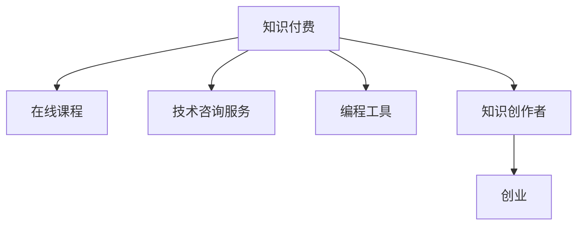

                 

# 知识付费时代程序员的创业思维与策略

## 1. 背景介绍

### 1.1 问题由来
随着互联网的快速发展，知识付费成为一种新的消费趋势，尤其在编程、金融、教育、健康等知识密集型领域。程序员作为知识技能的专业提供者，面临着巨大的创业机会。然而，如何把握趋势，制定有效的创业策略，是摆在他们面前的一大挑战。

### 1.2 问题核心关键点
在知识付费时代，程序员的创业机会主要集中在以下几个方面：

- **在线课程开发**：利用自身专业知识，制作高质量编程课程，通过平台变现。
- **技术咨询服务**：提供个性化技术方案，解决企业技术难题。
- **编程工具与插件开发**：研发提升效率的编程工具，实现平台化应用。
- **知识付费内容创作**：包括编程书籍、博客、教程等，通过广告、会员费等方式盈利。

理解这些关键点，可以帮助程序员在知识付费时代中找到合适的创业切入点。

### 1.3 问题研究意义
程序员创业不仅是技术能力的体现，也是对知识价值的货币化。成功的创业案例不仅可以提升个人收入，还能带动更多人实现职业提升。更重要的是，通过创业实践，程序员能将理论知识与实际问题结合，提升自身综合能力，推动技术领域发展。

## 2. 核心概念与联系

### 2.1 核心概念概述

为更好地理解知识付费时代程序员的创业策略，本节将介绍几个密切相关的核心概念：

- **知识付费(Knowledge-Paying)**：一种基于知识价值的消费模式，消费者为获取信息、技能、见解等知识内容付费。
- **在线课程(E-Learning)**：通过互联网提供的视频、文字、音频等多种形式的教育内容。
- **技术咨询服务(Technical Consultancy)**：提供专业的技术解决方案，帮助企业解决技术问题。
- **编程工具(Programming Tools)**：帮助程序员提升开发效率、优化代码质量的工具和插件。
- **知识创作者(Knowledge Creator)**：通过创作和传播知识内容获取收入的创作者。
- **创业(Entrepreneurship)**：通过创建新企业或新产品，实现商业化价值的创造和增长。

这些概念之间的逻辑关系可以通过以下Mermaid流程图来展示：



这个流程图展示的知识付费时代程序员的创业关键概念及其之间的关系：

1. 知识付费是创业的基础，在线课程、技术咨询服务、编程工具和知识创作者都是实现知识付费的不同形式。
2. 创业是将知识付费价值转化为商业化成果的主要途径。
3. 各个概念相互关联，共同构成了知识付费时代程序员的创业生态系统。

## 3. 核心算法原理 & 具体操作步骤
### 3.1 算法原理概述

知识付费时代程序员的创业策略，本质上是一种基于知识价值的商业化过程。其核心思想是：利用自身在特定技术领域的专业知识，通过多种形式的创作与传播，获取经济回报。

形式化地，设程序员具备的知识数量为 $K$，知识付费市场对知识的评价为 $P$，则创业者通过创业获得的经济回报为：

$$
R = K \times P
$$

创业的关键在于找到 $K$ 和 $P$ 的最佳组合，最大化经济回报 $R$。

### 3.2 算法步骤详解

基于知识付费的创业策略一般包括以下几个关键步骤：

**Step 1: 评估自身优势**
- 自我评估，明确自身技术专长和知识储备。
- 调研市场需求，了解目标用户的痛点和需求。
- 识别自身在知识付费市场的竞争优势。

**Step 2: 制定创业计划**
- 确定具体的创业方向，如在线课程开发、技术咨询服务、编程工具开发等。
- 制定详细的项目规划和实施步骤。
- 选择合适的商业模式，如付费订阅、按需服务等。

**Step 3: 获取资源**
- 构建团队，组建核心技术团队和运营团队。
- 获取必要的技术和市场资源，包括硬件、软件、资金等。
- 寻找合作伙伴，拓展资源网络。

**Step 4: 实施与推广**
- 开发产品原型，进行功能测试和性能优化。
- 在目标平台上发布内容，吸引潜在用户。
- 通过社交媒体、线下活动等渠道进行内容推广。

**Step 5: 反馈与迭代**
- 收集用户反馈，评估产品市场表现。
- 根据用户反馈进行调整和优化。
- 持续改进产品，提升用户体验和满意度。

### 3.3 算法优缺点

知识付费时代程序员的创业策略具有以下优点：

1. **灵活多样**。程序员可结合自身优势，选择多种形式的创业方向，灵活适应市场需求。
2. **成本低廉**。相较于传统创业，技术类创业的初始投入较低，且能快速获取收益。
3. **市场广泛**。知识付费行业覆盖面广，程序员可以在多个领域找到切入点。
4. **技术优势**。程序员本身具备技术实力，能更高效地开发和维护产品。

同时，该策略也存在一定的局限性：

1. **市场竞争激烈**。知识付费市场已有多家大公司占据，小创业团队较难突围。
2. **知识产权风险**。作品版权问题可能引发法律纠纷，需要严格管理。
3. **用户黏性问题**。如何保持用户长期参与，需要持续创新和维护。
4. **商业模式单一**。过度依赖单一的付费模式，可能带来收入不稳定的问题。

尽管存在这些局限性，但就目前而言，基于知识付费的创业策略仍是大有可为的。未来相关研究的重点在于如何进一步优化商业模式，降低市场竞争压力，同时兼顾法律和市场风险。

### 3.4 算法应用领域

基于知识付费的创业策略，已经在编程教育、软件开发、IT咨询服务等多个领域得到广泛应用。例如：

- **编程教育**：提供在线编程课程，帮助初学者快速掌握编程技能。如Coursera、Udemy等平台上的大量课程。
- **软件开发工具**：开发实用的编程工具和插件，提升开发效率。如GitHub、Visual Studio Code等。
- **IT咨询**：为企业提供技术方案和咨询服务，解决技术难题。如阿里云、腾讯云等技术咨询平台。
- **知识创作**：通过写作、视频、播客等形式，传播专业知识和见解。如博客、Podcast、知乎等平台。

除了上述这些经典领域外，知识付费还拓展到了更多新兴领域，如智慧健康、智能家居、量子计算等，为创业者提供了更广阔的创业空间。

## 4. 数学模型和公式 & 详细讲解 & 举例说明
### 4.1 数学模型构建

本节将使用数学语言对知识付费时代程序员的创业策略进行更加严格的刻画。

设程序员具备的知识数量为 $K$，知识付费市场对知识的评价为 $P$，创业者通过创业获得的经济回报为 $R$。则创业者优化目标函数为：

$$
\max_{K,P} R = K \times P
$$

其中 $K$ 和 $P$ 的取值范围需满足实际条件，如 $K \geq 0$，$P > 0$ 等。

### 4.2 公式推导过程

以下是知识付费创业策略的数学模型推导过程：

1. 假设程序员具备的知识数量为 $K$，单位为时间或字数。
2. 假设知识付费市场对知识的评价为 $P$，单位为价格。
3. 创业者通过创业获得的经济回报为 $R$，单位为货币。
4. 知识付费创业的优化目标是最大化经济回报 $R$，即 $K \times P$。

通过构建上述优化模型，可以系统地分析各个因素对创业收益的影响。

### 4.3 案例分析与讲解

下面以在线编程教育为例，分析知识付费时代程序员的创业策略。

**案例背景**：
假设某程序员具备500小时的编程技能，希望通过在线编程课程获得收入。假设知识付费市场对编程技能的评价为每小时100元。

**计算过程**：
- 程序员的知识数量 $K = 500$ 小时
- 市场对知识的评价 $P = 100$ 元/小时
- 经济回报 $R = K \times P = 500 \times 100 = 50000$ 元

这意味着，如果程序员能有效利用自己的编程知识，通过在线课程获得市场认可，最高可获得50000元收益。

## 5. 项目实践：代码实例和详细解释说明
### 5.1 开发环境搭建

在进行知识付费创业实践前，我们需要准备好开发环境。以下是使用Python进行Django开发的环境配置流程：

1. 安装Anaconda：从官网下载并安装Anaconda，用于创建独立的Python环境。

2. 创建并激活虚拟环境：
```bash
conda create -n pytorch-env python=3.8 
conda activate pytorch-env
```

3. 安装Django：
```bash
pip install django
```

4. 创建Django项目：
```bash
django-admin startproject knowledge_project
cd knowledge_project
```

5. 创建Django应用：
```bash
python manage.py startapp course
```

6. 配置数据库：
```bash
python manage.py migrate
```

完成上述步骤后，即可在`pytorch-env`环境中开始知识付费创业实践。

### 5.2 源代码详细实现

下面以在线编程教育为例，展示使用Django进行知识付费创业的代码实现。

**urls.py**：
```python
from django.urls import path
from . import views

urlpatterns = [
    path('courses/', views.course_list, name='course_list'),
    path('courses/<int:course_id>/', views.course_detail, name='course_detail'),
    path('courses/create/', views.course_create, name='course_create'),
]
```

**views.py**：
```python
from django.shortcuts import render, redirect
from .models import Course
from .forms import CourseForm

def course_list(request):
    courses = Course.objects.all()
    return render(request, 'course_list.html', {'courses': courses})

def course_detail(request, course_id):
    course = Course.objects.get(id=course_id)
    return render(request, 'course_detail.html', {'course': course})

def course_create(request):
    if request.method == 'POST':
        form = CourseForm(request.POST)
        if form.is_valid():
            course = form.save(commit=False)
            course.save()
            return redirect('course_list')
    else:
        form = CourseForm()
    return render(request, 'course_form.html', {'form': form})
```

**models.py**：
```python
from django.db import models
from django.contrib.auth.models import User

class Course(models.Model):
    title = models.CharField(max_length=100)
    description = models.TextField()
    price = models.DecimalField(max_digits=10, decimal_places=2)
    instructor = models.ForeignKey(User, on_delete=models.CASCADE)

    def __str__(self):
        return self.title
```

**forms.py**：
```python
from django import forms
from .models import Course

class CourseForm(forms.ModelForm):
    class Meta:
        model = Course
        fields = ['title', 'description', 'price']
```

**course_list.html**：
```html
<h1>Courses</h1>
<ul>

    <li><a href="">{{ course.title }}</a></li>

</ul>
<a href="">Create Course</a>
```

**course_detail.html**：
```html
<h1>{{ course.title }}</h1>
<p>{{ course.description }}</p>
<p>Price: {{ course.price }}</p>
<a href="">Back to List</a>
```

**course_form.html**：
```html
<h1>Create Course</h1>
<form method="post">
    
    {{ form.as_p }}
    <button type="submit">Save</button>
</form>
```

**settings.py**：
```python
DATABASES = {
    'default': {
        'ENGINE': 'django.db.backends.sqlite3',
        'NAME': BASE_DIR / 'db.sqlite3',
    }
}
```

完成上述步骤后，即可在`pytorch-env`环境中开始知识付费创业实践。

### 5.3 代码解读与分析

让我们再详细解读一下关键代码的实现细节：

**urls.py**：
- 定义了三个URL路由，分别用于课程列表、课程详情和课程创建。

**views.py**：
- `course_list`方法：获取所有课程，渲染课程列表页面。
- `course_detail`方法：根据ID获取课程详情，渲染课程详情页面。
- `course_create`方法：创建课程表单，处理POST请求，保存课程并重定向到课程列表页面。

**models.py**：
- 定义了一个`Course`模型，包含课程标题、描述、价格和讲师等信息。

**forms.py**：
- 定义了一个`CourseForm`表单，用于创建课程时的数据输入。

**course_list.html**：
- 渲染课程列表页面，每个课程链接到详情页。

**course_detail.html**：
- 渲染课程详情页面，包含课程信息和返回链接。

**course_form.html**：
- 渲染课程创建表单。

**settings.py**：
- 配置数据库连接信息。

可以看到，Django提供了强大的路由、模板和表单功能，大大简化了知识付费创业项目的开发。开发者只需关注核心业务逻辑，其他细节由Django自动处理。

当然，实际的开发中还需要考虑更多因素，如用户管理、支付集成、内容分发等。但核心的创业策略和代码实现逻辑基本与此类似。

## 6. 实际应用场景
### 6.1 在线编程教育

在线编程教育是知识付费时代程序员创业的热门方向。通过制作高质量的编程课程，程序员可以高效地变现自身技术价值。

**实际应用**：
某程序员利用自身Python编程技能，制作了一系列Python基础和进阶课程，上传至在线教育平台，用户通过付费购买课程，获得高质量的视频教学和实践指导。

**技术实现**：
1. 收集大量编程示例和案例，制作高质量教学视频。
2. 利用Django等Web框架搭建在线课程平台。
3. 设置课程价格和支付方式，集成支付接口。
4. 开发用户管理系统，提供注册、登录、支付等功能。
5. 设计互动环节，如代码讲解、用户答疑、作业提交等，提升用户体验。

通过上述实践，程序员可以迅速构建起自己的在线编程教育平台，吸引大量编程爱好者订阅付费课程，实现可观的经济收益。

### 6.2 技术咨询服务

技术咨询服务是程序员创业的另一重要方向，通过提供专业的技术解决方案，帮助企业解决实际问题。

**实际应用**：
某程序员擅长数据分析和机器学习，为多家企业提供定制化技术咨询服务，帮助客户提升业务效率，获得丰厚咨询费用。

**技术实现**：
1. 深入了解各类技术需求，分析问题根本原因。
2. 设计可行的技术方案，并编写详细文档。
3. 提供远程咨询和技术支持，协助客户实施方案。
4. 持续跟踪项目进展，确保技术方案的有效性。
5. 收取咨询费用，并建立客户反馈机制。

通过上述实践，程序员可以在技术咨询领域快速建立自己的品牌和口碑，获得高额咨询费用，提升个人收入。

### 6.3 编程工具与插件开发

开发实用的编程工具和插件，提升程序员的开发效率和质量，是知识付费创业的又一重要方向。

**实际应用**：
某程序员利用自身软件开发经验，开发了一款高效的代码版本控制系统插件，用户通过付费使用该插件，提升代码管理和协作效率。

**技术实现**：
1. 分析开发人员的需求和痛点，设计插件功能。
2. 选择合适的开发环境，如GitHub、Visual Studio等。
3. 编写代码，实现插件功能。
4. 发布插件到应用商店，如GitHub、npm等。
5. 提供技术支持和维护，提升用户满意度。

通过上述实践，程序员可以在编程工具领域积累丰富经验，开发出实用的工具和插件，获得用户付费，实现收入增长。

### 6.4 知识创作者

通过创作和传播专业知识和见解，程序员可以在知识付费市场中获得收入，如写博客、制作视频、播客等。

**实际应用**：
某程序员在知乎上发表了大量关于编程语言的见解和文章，吸引了大量粉丝，通过广告、打赏等方式获得收入。

**技术实现**：
1. 选择合适的知识传播平台，如知乎、Medium、Bilibili等。
2. 创作高质量的原创内容，包括文章、视频、播客等。
3. 利用平台提供的工具，提升内容传播效果。
4. 定期更新内容，保持用户黏性。
5. 通过广告、会员费、打赏等方式获取收入。

通过上述实践，程序员可以在知识创作者领域积累品牌影响力，获得稳定收入，提升个人品牌价值。

## 7. 工具和资源推荐
### 7.1 学习资源推荐

为了帮助程序员系统掌握知识付费创业的理论基础和实践技巧，这里推荐一些优质的学习资源：

1. **《知识付费时代：程序员的创业之路》**：介绍知识付费时代程序员创业的多种模式和成功案例，适合初学者入门。
2. **《Django Web开发实战》**：详细介绍Django框架的开发流程，适合技术创业者学习。
3. **《Python网络爬虫开发实战》**：讲解如何使用Python爬取数据，为编程工具开发提供数据支持。
4. **《编程教育行业报告》**：分析编程教育市场的现状和趋势，为在线编程教育创业者提供参考。
5. **《知识创作者平台运营秘籍》**：讲解知识创作者如何管理粉丝、优化内容、变现收益。

通过对这些资源的学习实践，相信程序员能快速掌握知识付费创业的关键技能，并在实际操作中不断打磨和完善。

### 7.2 开发工具推荐

高效的开发离不开优秀的工具支持。以下是几款用于知识付费创业开发的常用工具：

1. **Django**：基于Python的Web框架，提供高效的Web应用开发功能，适合快速搭建在线课程和博客平台。
2. **GitHub**：全球最大的代码托管平台，提供代码版本控制、协作开发等功能，适合编程工具和插件开发。
3. **Jupyter Notebook**：交互式编程环境，支持Python、R等语言的开发和展示，适合数据分析和机器学习项目。
4. **PostgreSQL**：开源关系型数据库，提供高效的数据存储和管理功能，适合在线编程教育平台的数据需求。
5. **PyTorch**：基于Python的深度学习框架，支持各种机器学习算法和模型开发，适合技术咨询和数据分析项目。

合理利用这些工具，可以显著提升知识付费创业的开发效率，加快创新迭代的步伐。

### 7.3 相关论文推荐

知识付费时代程序员的创业策略源于学界的持续研究。以下是几篇奠基性的相关论文，推荐阅读：

1. **《知识付费生态系统的研究》**：分析知识付费市场的发展现状和趋势，为创业者提供理论指导。
2. **《在线教育平台的用户行为分析》**：通过数据挖掘技术分析用户行为，指导在线编程教育平台的运营策略。
3. **《编程工具对软件开发效率的影响》**：研究编程工具的开发和使用对软件工程的影响，为编程工具开发者提供参考。
4. **《技术咨询服务对企业竞争力的提升》**：分析技术咨询服务的市场前景和实施策略，为技术咨询服务创业者提供指导。
5. **《知识创作者的品牌建设与运营》**：讲解知识创作者如何管理粉丝、优化内容、变现收益，为知识创作者提供运营建议。

这些论文代表了大语言模型微调技术的发展脉络。通过学习这些前沿成果，可以帮助研究者把握学科前进方向，激发更多的创新灵感。

## 8. 总结：未来发展趋势与挑战
### 8.1 总结

本文对知识付费时代程序员的创业策略进行了全面系统的介绍。首先阐述了知识付费时代的背景和程序员创业的重要机遇，明确了在线课程、技术咨询服务、编程工具和知识创作者等创业切入点。其次，从原理到实践，详细讲解了知识付费创业的数学模型和操作步骤，给出了完整的代码实例。同时，本文还广泛探讨了知识付费创业在多个行业领域的应用前景，展示了创业范式的广阔潜力。此外，本文精选了知识付费创业的各类学习资源，力求为程序员提供全方位的技术指引。

通过本文的系统梳理，可以看到，知识付费时代程序员的创业策略正在成为新的发展方向，极大地拓展了程序员的技术应用边界，催生了更多的创业机会。创业者应把握趋势，不断学习新技能，积极应对市场变化，才能在激烈竞争中脱颖而出。

### 8.2 未来发展趋势

展望未来，知识付费时代程序员的创业策略将呈现以下几个发展趋势：

1. **知识服务多样化**。随着用户需求的多样化，程序员将推出更多样化的知识服务，如在线编程、技术咨询、知识创作等。
2. **技术融合深化**。知识付费创业者将更多地与人工智能、大数据、区块链等技术结合，提供更高效、智能的知识服务。
3. **用户需求个性化**。基于数据分析，程序员将提供更加个性化的知识服务，满足用户的个性化需求。
4. **知识付费生态完善**。知识创作者、技术服务和平台运营将更加紧密地结合，形成完整的知识付费生态系统。
5. **社区化运营兴起**。知识创作者和用户将形成社区，互相交流分享，提升社区活跃度和影响力。

这些趋势凸显了知识付费时代程序员创业的未来方向，为程序员提供了新的发展机遇和挑战。

### 8.3 面临的挑战

尽管知识付费时代程序员的创业策略已经取得了一定的成效，但在迈向更加智能化、普适化应用的过程中，仍面临着诸多挑战：

1. **市场竞争激烈**。知识付费市场已有多家大公司占据，小创业团队较难突围。
2. **知识产权风险**。作品版权问题可能引发法律纠纷，需要严格管理。
3. **用户黏性问题**。如何保持用户长期参与，需要持续创新和维护。
4. **商业模式单一**。过度依赖单一的付费模式，可能带来收入不稳定的问题。
5. **数据隐私保护**。如何保护用户数据隐私，避免数据泄露，需严格遵守相关法律法规。

尽管存在这些挑战，但就目前而言，基于知识付费的创业策略仍是大有可为的。未来相关研究的重点在于如何进一步优化商业模式，降低市场竞争压力，同时兼顾法律和市场风险。

### 8.4 研究展望

面对知识付费时代程序员创业所面临的种种挑战，未来的研究需要在以下几个方面寻求新的突破：

1. **技术创新**。开发更多智能化的知识服务工具，提升服务质量和用户体验。
2. **市场细分**。针对不同领域和用户群体，推出细分化的知识服务。
3. **法律合规**。制定和推广知识付费领域的相关法律法规，保护创作者和用户权益。
4. **商业模式多样化**。探索新的商业模式，如按效果付费、会员订阅等，增加收入来源。
5. **国际化发展**。将知识服务推广到全球市场，拓展更多的用户和资源。

这些研究方向将引领知识付费时代程序员的创业进入新的发展阶段，为程序员提供更多创业机会和发展空间。总之，知识付费时代程序员的创业策略需要在技术、市场、法律等多个维度进行综合考量，才能实现可持续发展。

## 9. 附录：常见问题与解答
**Q1：知识付费创业的主要方向有哪些？**

A: 知识付费创业的主要方向包括在线编程教育、技术咨询服务、编程工具与插件开发、知识创作者等。

**Q2：如何评估自身优势？**

A: 评估自身优势主要从以下几个方面入手：
1. 自我评估，明确自身技术专长和知识储备。
2. 调研市场需求，了解目标用户的痛点和需求。
3. 识别自身在知识付费市场的竞争优势。

**Q3：如何制定创业计划？**

A: 制定创业计划的主要步骤如下：
1. 确定具体的创业方向，如在线课程开发、技术咨询服务、编程工具开发等。
2. 制定详细的项目规划和实施步骤。
3. 选择合适的商业模式，如付费订阅、按需服务等。

**Q4：如何获取资源？**

A: 获取资源的主要步骤如下：
1. 构建团队，组建核心技术团队和运营团队。
2. 获取必要的技术和市场资源，包括硬件、软件、资金等。
3. 寻找合作伙伴，拓展资源网络。

**Q5：如何实施与推广？**

A: 实施与推广的主要步骤如下：
1. 开发产品原型，进行功能测试和性能优化。
2. 在目标平台上发布内容，吸引潜在用户。
3. 通过社交媒体、线下活动等渠道进行内容推广。

**Q6：如何反馈与迭代？**

A: 反馈与迭代的主要步骤如下：
1. 收集用户反馈，评估产品市场表现。
2. 根据用户反馈进行调整和优化。
3. 持续改进产品，提升用户体验和满意度。

**Q7：知识付费创业的商业模式有哪些？**

A: 知识付费创业的商业模式主要包括以下几种：
1. 付费订阅模式：用户定期支付订阅费，获取知识内容。
2. 按需服务模式：用户根据具体需求支付费用，获取个性化服务。
3. 广告模式：通过平台广告收入，分发给知识创作者。
4. 会员费模式：用户成为平台会员，享受特权服务。
5. 数据变现模式：利用用户数据进行商业变现。

这些商业模式可以结合使用，形成更加多样化的收入来源。

**Q8：知识付费创业的技术工具有哪些？**

A: 知识付费创业的技术工具主要包括以下几种：
1. Django：基于Python的Web框架，适合搭建在线课程和博客平台。
2. GitHub：全球最大的代码托管平台，适合编程工具和插件开发。
3. Jupyter Notebook：交互式编程环境，适合数据分析和机器学习项目。
4. PostgreSQL：开源关系型数据库，适合在线编程教育平台的数据需求。
5. PyTorch：基于Python的深度学习框架，适合技术咨询和数据分析项目。

合理利用这些工具，可以显著提升知识付费创业的开发效率，加快创新迭代的步伐。

---

作者：禅与计算机程序设计艺术 / Zen and the Art of Computer Programming

