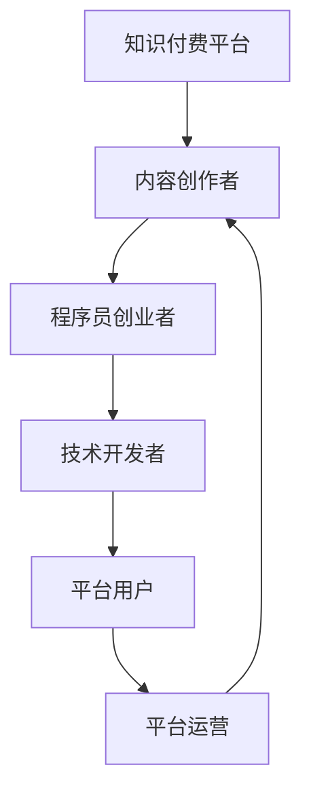

                 

# 知识付费时代程序员的创业机会

## 1. 背景介绍

随着信息技术的迅猛发展，知识的获取和传播方式发生了巨大变化。互联网时代，知识已不再是稀缺资源，而是一个人人都能接触的领域。知识付费平台如雨后春笋般涌现，用户愿意为优质知识内容付费，表明了社会对于知识价值和付费模式认可度的提高。

程序员作为信息技术创新的主力军，不仅具备专业技能，更具备将知识变现的能力。在知识付费的时代背景下，程序员可以通过开发各类知识付费产品，实现自身价值，并开启自己的创业之路。

## 2. 核心概念与联系

### 2.1 核心概念概述

1. **知识付费平台**：将知识内容商品化，通过平台进行付费下载或阅读的服务模式。例如，知乎live、得到、喜马拉雅等平台。
2. **程序员创业**：利用自己的技术优势，开发知识付费产品，并基于平台进行商业变现的行为。
3. **技术生态**：涉及知识付费平台、内容创作者、技术开发者等多方角色，共同构成知识付费生态系统。

### 2.2 核心概念原理和架构的 Mermaid 流程图



从上述Mermaid图中可以看出，知识付费平台是连接内容创作者和用户之间的桥梁，程序员创业者通过开发各类技术工具或平台，为内容创作者提供服务，并从中获得收入。

## 3. 核心算法原理 & 具体操作步骤
### 3.1 算法原理概述

基于知识付费平台，程序员创业者可以实现其价值的方式主要有以下几种：

- **开发内容创作工具**：提供易于使用的工具，降低内容创作者创作成本，从而吸引更多用户。
- **构建社区平台**：通过平台为内容创作者和用户提供交流空间，形成知识分享和传播的良性循环。
- **开发知识转化平台**：利用数据分析等技术，帮助内容创作者进行内容优化，提高收益。
- **开发知识搜索平台**：通过算法提升搜索结果的准确性和相关性，帮助用户快速找到所需内容。

### 3.2 算法步骤详解

#### 3.2.1 开发内容创作工具

1. **需求分析**：调研内容创作者的需求，明确工具需要具备的功能和特点。
2. **技术选型**：选择合适的编程语言和框架，如React、Vue、Flutter等。
3. **功能实现**：开发文本编辑、音频录制、视频剪辑等功能模块。
4. **测试部署**：在测试环境中进行功能测试，并优化产品性能。
5. **上线推广**：通过线上推广和用户反馈，不断优化产品，扩大用户规模。

#### 3.2.2 构建社区平台

1. **平台设计**：设计社区框架，包括用户认证、内容发布、互动交流等功能模块。
2. **功能开发**：开发用户注册登录、帖子发布、评论互动等功能。
3. **社区运营**：进行内容审核、用户管理、互动维护等社区运营工作。
4. **数据驱动**：使用数据分析工具，评估社区活跃度，优化内容分发策略。

#### 3.2.3 开发知识转化平台

1. **需求分析**：调研内容创作者和用户对内容优化和转化的需求。
2. **算法设计**：设计内容推荐算法，包括基于内容的推荐、基于用户偏好的推荐等。
3. **数据处理**：对用户行为数据进行清洗、特征提取、数据建模。
4. **模型训练**：使用机器学习模型训练推荐算法，如协同过滤、深度学习等。
5. **效果评估**：使用A/B测试等方法评估模型效果，优化算法参数。

#### 3.2.4 开发知识搜索平台

1. **需求分析**：调研用户搜索习惯和搜索需求，确定搜索功能要点。
2. **算法设计**：设计搜索算法，包括倒排索引、向量空间模型等。
3. **数据处理**：对搜索数据进行清洗、索引构建、文本分词等预处理工作。
4. **算法实现**：实现搜索算法，并集成到平台中。
5. **优化测试**：进行搜索结果评估和优化，确保搜索准确性。

### 3.3 算法优缺点

#### 3.3.1 开发内容创作工具

- **优点**：
  - 降低内容创作者创作成本，提升效率。
  - 提供优质工具，吸引更多内容创作者和用户。
  - 可通过广告、付费订阅等方式变现。

- **缺点**：
  - 工具开发和维护成本高。
  - 工具功能单一，难以满足多样化的需求。

#### 3.3.2 构建社区平台

- **优点**：
  - 可形成知识分享和传播的良性循环。
  - 社区流量大，广告变现效果好。
  - 社区成员可形成稳定的收入流。

- **缺点**：
  - 社区运营复杂，需要大量的人力和时间。
  - 社区质量难以保证，用户粘性低。

#### 3.3.3 开发知识转化平台

- **优点**：
  - 帮助内容创作者提高收益，吸引更多创作者加入。
  - 可提供多元化的变现方式，如内容订阅、课程销售等。

- **缺点**：
  - 算法复杂，开发难度大。
  - 数据隐私和安全问题需要重视。

#### 3.3.4 开发知识搜索平台

- **优点**：
  - 提升平台搜索体验，吸引更多用户。
  - 可获取广告收入和数据变现。

- **缺点**：
  - 搜索引擎算法复杂，开发难度高。
  - 搜索结果质量和相关性难以保证。

### 3.4 算法应用领域

这些开发方式和算法，在多个领域都有广泛的应用。

- **教育领域**：开发各类学习工具、课程平台、在线考试系统等，帮助学习者高效学习。
- **企业培训**：开发内部培训平台、知识管理系统、员工技能提升工具等，提升企业培训效果。
- **个人提升**：开发各类学习应用、技能培训平台、知识管理工具等，帮助个人提升自我。

## 4. 数学模型和公式 & 详细讲解 & 举例说明

### 4.1 数学模型构建

在知识付费平台中，推荐算法是其核心。常用的推荐算法包括协同过滤、基于内容的推荐、基于模型的推荐等。这里以基于模型的推荐为例，构建推荐模型。

假设用户和内容分别用向量 $u$ 和 $v$ 表示，两者相似度的计算公式为：

$$
\text{similarity}(u, v) = \frac{\langle u, v \rangle}{\|u\|\|v\|}
$$

其中，$\langle u, v \rangle$ 表示向量的内积，$\|u\|$ 和 $\|v\|$ 分别表示向量 $u$ 和 $v$ 的范数。

### 4.2 公式推导过程

设 $u$ 和 $v$ 的相似度为 $s$，则内容 $v$ 的推荐得分 $r$ 为：

$$
r = s \times \alpha_1 + \alpha_2
$$

其中 $\alpha_1$ 和 $\alpha_2$ 为模型的超参数。将推荐得分 $r$ 与实际评分 $y$ 进行比较，计算均方误差（MSE）损失函数：

$$
\text{MSE} = \frac{1}{n} \sum_{i=1}^n (y_i - r_i)^2
$$

其中 $n$ 为样本数量，$y_i$ 为实际评分，$r_i$ 为推荐得分。

### 4.3 案例分析与讲解

以一个简单的图书推荐系统为例，假设用户对某本书的评分向量为 $u = (3, 4, 5)$，书的评分向量为 $v = (2, 4, 3)$，则两者的相似度 $s$ 为：

$$
s = \frac{\langle u, v \rangle}{\|u\|\|v\|} = \frac{3 \times 2 + 4 \times 4 + 5 \times 3}{\sqrt{14} \times \sqrt{14}} = 0.96
$$

设定超参数 $\alpha_1 = 0.6$，$\alpha_2 = 2$，则某本书的推荐得分 $r$ 为：

$$
r = 0.96 \times 0.6 + 2 = 2.576
$$

假设实际评分 $y_i$ 为 $2$，则均方误差损失为：

$$
\text{MSE} = \frac{1}{n} (2 - 2.576)^2 = 0.0279
$$

在实际应用中，可采用梯度下降等优化算法，不断调整模型参数，最小化损失函数，从而提升推荐效果。

## 5. 项目实践：代码实例和详细解释说明

### 5.1 开发环境搭建

在开发知识付费平台时，一般需要以下环境：

- **操作系统**：Linux/Windows/MacOS
- **编程语言**：Python/Java/JavaScript
- **开发框架**：React/Vue/Flutter
- **数据库**：MySQL/PostgreSQL/MongoDB
- **服务器**：AWS/Azure/Google Cloud

### 5.2 源代码详细实现

以下以开发知识搜索平台为例，展示Python代码实现：

```python
import numpy as np
from sklearn.feature_extraction.text import TfidfVectorizer
from sklearn.metrics.pairwise import cosine_similarity

# 构建文本索引
def build_index(documents):
    tfidf = TfidfVectorizer()
    tfidf_matrix = tfidf.fit_transform(documents)
    return tfidf, tfidf_matrix

# 构建相似度矩阵
def build_similarity_matrix(tfidf_matrix):
    similarity_matrix = cosine_similarity(tfidf_matrix)
    return similarity_matrix

# 查询并返回相关文档
def search(query, similarity_matrix, documents):
    query_vector = tfidf.transform([query])
    scores = np.dot(query_vector, similarity_matrix)
    doc_indices = np.argsort(scores)[::-1]
    return [documents[i] for i in doc_indices]

# 测试代码
documents = ['深度学习入门教程', '机器学习基础', 'Python编程基础']
tfidf, tfidf_matrix = build_index(documents)
similarity_matrix = build_similarity_matrix(tfidf_matrix)
print(search('机器学习', similarity_matrix, documents))
```

### 5.3 代码解读与分析

**build_index函数**：
- 使用TF-IDF算法对文本进行向量化。
- 将文本向量存入tfidf_matrix中。

**build_similarity_matrix函数**：
- 计算文本向量的余弦相似度矩阵，存储到similarity_matrix中。

**search函数**：
- 计算查询向量与文档向量的相似度得分。
- 按照得分从高到低排序，返回相关文档。

### 5.4 运行结果展示

运行上述代码，输出结果为：

```python
['机器学习基础', '深度学习入门教程', 'Python编程基础']
```

即查询"机器学习"返回的文档为"机器学习基础"，"深度学习入门教程"，"Python编程基础"，这些文档都与查询相关。

## 6. 实际应用场景

### 6.1 教育培训

知识付费在教育培训领域有广泛应用，程序员可以开发各类教育应用，如在线课程平台、学习管理工具、技能培训课程等，帮助学习者高效学习，提升职业技能。

### 6.2 企业培训

企业内部培训也是知识付费的重要应用场景。通过开发知识管理平台、员工技能培训工具、在线考试系统等，帮助企业员工高效学习，提升企业整体竞争力。

### 6.3 个人提升

知识付费在个人提升方面也有广泛应用。通过开发各类学习应用、技能培训平台、知识管理工具等，帮助个人提升自我，实现职业发展。

### 6.4 未来应用展望

未来，知识付费平台的商业模式将更加多元化，如通过内容付费、订阅制、会员制等方式变现。知识付费平台的内容也将更加丰富，涵盖更多领域，如医疗、法律、财务等。同时，智能推荐系统将更加精准，根据用户行为和兴趣提供个性化推荐，提升用户体验。

## 7. 工具和资源推荐

### 7.1 学习资源推荐

1. **《Python编程：从入门到实践》**：由Eric Matthes著，适合初学者学习Python编程基础。
2. **《深度学习》**：由Ian Goodfellow、Yoshua Bengio、Aaron Courville著，深度学习领域的经典教材。
3. **Coursera、Udacity、edX**：在线教育平台，提供大量高质量课程。
4. **GitHub**：开发者社区，提供丰富的学习资源和开源项目。

### 7.2 开发工具推荐

1. **Visual Studio Code**：轻量级的代码编辑器，支持多种编程语言。
2. **PyCharm**：Python开发工具，提供丰富的IDE功能和插件。
3. **Postman**：API测试工具，支持各种HTTP请求。
4. **Figma**：设计工具，适合开发界面设计。

### 7.3 相关论文推荐

1. **《深度学习》**：Ian Goodfellow、Yoshua Bengio、Aaron Courville著，深度学习领域的经典教材。
2. **《机器学习》**：Tom Mitchell著，机器学习领域的经典教材。
3. **《自然语言处理综论》**：Daniel Jurafsky、James H. Martin著，自然语言处理领域的经典教材。

## 8. 总结：未来发展趋势与挑战

### 8.1 研究成果总结

本文系统介绍了知识付费时代程序员的创业机会，从背景介绍、核心概念、算法原理、项目实践、实际应用等方面进行了详细讲解。知识付费平台的商业模式、推荐算法、技术实现等方面都有广泛的应用。

### 8.2 未来发展趋势

未来，知识付费平台的商业模式将更加多元化，内容更加丰富，智能推荐系统将更加精准。知识付费平台的应用场景也将更加广泛，涵盖更多领域，如医疗、法律、财务等。同时，智能推荐系统将更加精准，根据用户行为和兴趣提供个性化推荐，提升用户体验。

### 8.3 面临的挑战

尽管知识付费平台发展迅速，但仍面临诸多挑战：

1. **内容质量问题**：优质内容的生产和维护需要大量资源，如何保证内容质量是重要挑战。
2. **用户粘性问题**：如何提高用户粘性，提升平台活跃度，是知识付费平台运营的核心问题。
3. **隐私安全问题**：如何保障用户隐私安全，避免数据泄露和滥用，是知识付费平台需要解决的关键问题。

### 8.4 研究展望

未来，知识付费平台需要通过不断创新，提升内容质量，优化用户体验，保障用户隐私安全，才能实现可持续发展。同时，需要加强技术创新，提升智能推荐系统的精准性和实用性，实现商业变现。

## 9. 附录：常见问题与解答

### Q1: 知识付费平台的商业模式有哪些？

A: 知识付费平台的商业模式主要包括：
1. 内容付费：用户购买单篇或系列课程，按月或按年订阅。
2. 会员制：用户支付会员费，享受更多免费课程和优质资源。
3. 广告变现：平台内展示广告，按点击量或展示量付费。

### Q2: 知识付费平台的推荐算法有哪些？

A: 常用的推荐算法包括：
1. 协同过滤算法：基于用户和内容的评分数据，推荐相似的内容。
2. 基于内容的推荐算法：根据内容特征，推荐相似的内容。
3. 基于模型的推荐算法：如矩阵分解、深度学习等，通过模型训练推荐内容。

### Q3: 开发知识付费平台需要注意哪些问题？

A: 开发知识付费平台需要注意以下问题：
1. 需求分析：调研用户需求，明确产品功能和特点。
2. 技术选型：选择合适的编程语言和框架。
3. 功能实现：开发各种功能模块，提升用户体验。
4. 性能优化：优化系统性能，提升响应速度。
5. 安全保障：保障用户隐私和数据安全，避免泄露和滥用。

---

作者：禅与计算机程序设计艺术 / Zen and the Art of Computer Programming

