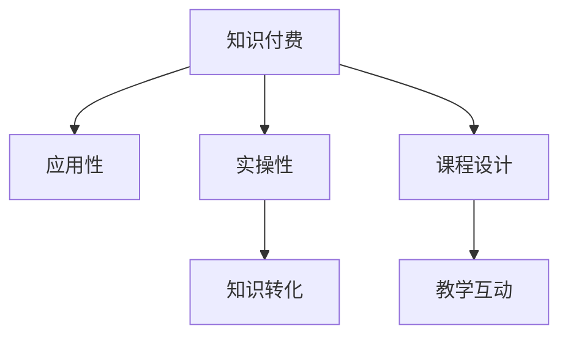

                 

# 知识付费要重视知识的应用性和实操性

在当今知识爆炸的时代，知识付费已成为越来越多人获取高质量内容的重要途径。然而，仅仅支付费用并不能保证知识的有效吸收和应用。本文将深入探讨知识付费中的应用性和实操性问题，提供切实可行的解决方案，帮助用户实现真正有效的知识获取和转化。

## 1. 背景介绍

### 1.1 知识付费的兴起
随着互联网的普及和数字化转型加速，知识和信息的重要性日益凸显。为了获取优质内容，人们开始转向付费订阅、付费阅读、付费课程等多种知识付费形式。知识付费平台如得到、新东方在线、网易云课堂等不断涌现，为学习者提供了一条获取专业知识的便捷途径。

### 1.2 知识付费的现状
虽然知识付费市场规模不断扩大，但用户对知识的应用性和实操性要求也随之提高。大量用户在付费订阅后，发现所学知识难以应用于实际问题解决，或实际应用时遇到诸多困难。这种知识与实操脱节的现象，导致用户对知识付费的信任度下降，也影响了平台的品牌声誉和用户粘性。

## 2. 核心概念与联系

### 2.1 核心概念概述

为更好地理解知识付费中的应用性和实操性，本节将介绍几个密切相关的核心概念：

- **知识付费**：通过付费方式获取专业知识和技能的服务。知识付费平台提供包括课程、文章、书籍、音频等多种形式的内容。

- **应用性**：知识能够被应用于实际问题解决的能力。应用性强的知识能够帮助用户解决实际工作、生活和学习中的难题。

- **实操性**：知识能够被实际操作、实践的能力。实操性强的知识能够帮助用户通过动手练习，加深理解和记忆。

- **知识转化**：将所学知识转化为实际行动和能力的过程。有效的知识转化能够帮助用户实现知识与实践的有机结合。

- **课程设计**：知识付费平台通过课程设计，将知识内容以最佳方式呈现给用户，提高知识的应用性和实操性。

- **教学互动**：通过教师与学生之间的互动，增强知识的应用性和实操性，解决用户在学习过程中遇到的问题。

这些核心概念之间的逻辑关系可以通过以下Mermaid流程图来展示：



这个流程图展示了一系列概念之间的联系：

1. 知识付费是知识应用和实操的起点。
2. 应用性和实操性是知识付费的价值体现。
3. 知识转化是应用性和实操性的关键。
4. 课程设计和教学互动是提升知识应用性和实操性的重要手段。

## 3. 核心算法原理 & 具体操作步骤

### 3.1 算法原理概述

知识付费平台通过设计具有高应用性和实操性的课程内容，帮助用户将所学知识转化为实际能力。这一过程涉及多个步骤，包括课程设计、互动教学、作业实践等。以下是这一过程的主要算法原理：

1. **课程设计**：通过需求调研、市场分析等方式，确定课程的目标受众和具体内容。课程设计要注重知识的应用性和实操性，避免过于理论化或过于应试化。

2. **互动教学**：采用在线讨论、即时反馈、视频讲解等方式，增强师生之间的互动，帮助用户解决学习过程中遇到的问题。

3. **作业实践**：通过布置实际问题解决的任务，引导用户将所学知识应用于实践，巩固学习成果。

### 3.2 算法步骤详解

基于上述算法原理，以下是知识付费中应用性和实操性的具体操作步骤：

1. **需求调研**：通过问卷调查、用户访谈等方式，了解目标受众的学习需求和痛点，明确课程设计方向。

2. **课程设计**：确定课程的总体结构、具体内容和教学方法，注重知识的系统性、应用性和实操性。

3. **互动教学**：
   - 利用在线讨论区、实时反馈系统等方式，增强师生互动。
   - 通过视频讲解、直播答疑等方式，提高教学效果。
   - 提供个性化辅导和支持，帮助用户解决学习中遇到的问题。

4. **作业实践**：
   - 布置实际问题解决的作业，引导用户将所学知识应用于实践。
   - 提供即时反馈和评估，帮助用户改进学习方法和思路。

### 3.3 算法优缺点

知识付费中的应用性和实操性方法具有以下优点：

- **提高学习效果**：通过应用性和实操性的课程设计，帮助用户更好地理解和掌握知识。
- **增强用户粘性**：用户通过实际操作和实践，感受到知识付费的实际价值，提高对平台的信任和依赖。
- **促进知识转化**：通过作业实践和互动教学，用户能够将所学知识转化为实际能力，提升职业竞争力。

同时，该方法也存在一定的局限性：

- **资源投入较大**：课程设计和互动教学需要大量人力和物力投入，开发成本较高。
- **用户自主性要求高**：用户需要具备一定的自我管理能力和学习积极性，才能充分利用互动教学和作业实践。
- **内容更新挑战**：课程内容需要不断更新，以适应技术和市场变化，这对平台的内容管理能力提出了更高要求。

### 3.4 算法应用领域

知识付费中的应用性和实操性方法广泛应用于多个领域，包括但不限于：

- **职业培训**：如编程、设计、市场营销等，通过实际项目和案例分析，帮助用户提升职业技能。
- **教育培训**：如K-12教育、成人教育等，通过实践和互动教学，帮助学生更好地掌握知识。
- **生活技能**：如健身、烹饪、育儿等，通过动手练习和实时反馈，帮助用户掌握生活技能。

## 4. 数学模型和公式 & 详细讲解

### 4.1 数学模型构建

为更好地理解知识付费中的应用性和实操性，我们可以使用数学模型对其进行形式化描述。

设知识付费课程内容为 $C$，用户学习效果为 $E$，用户互动程度为 $I$，作业实践次数为 $P$。则知识付费的效果模型可以表示为：

$$
E = f(C, I, P)
$$

其中 $f$ 为一个非线性函数，代表知识内容、互动教学和作业实践的综合作用。

### 4.2 公式推导过程

根据上述模型，我们可以推导出提高知识付费效果的关键因素。

1. **知识内容**：
   - 知识内容的设计要注重系统性和应用性，避免过于理论化。
   - 内容应包括实际案例和问题解决，帮助用户更好地理解应用。

2. **互动教学**：
   - 采用在线讨论、即时反馈等方式，增强师生互动。
   - 通过视频讲解、直播答疑等方式，提高教学效果。

3. **作业实践**：
   - 布置实际问题解决的作业，引导用户将所学知识应用于实践。
   - 提供即时反馈和评估，帮助用户改进学习方法和思路。

### 4.3 案例分析与讲解

以编程课程为例，分析如何提高应用性和实操性。

- **知识内容**：课程内容应包括实际编程项目和问题解决，如实现一个简单的Web应用、数据分析项目等。
- **互动教学**：教师通过在线讨论区、实时反馈系统等方式，及时解答用户问题。课程中安排直播答疑环节，帮助用户解决实际编程中的疑难杂症。
- **作业实践**：布置实际编程任务，如实现一个在线商城、数据可视化项目等，帮助用户将所学知识应用于实践。教师对作业进行即时反馈和评估，帮助用户改进学习方法和思路。

## 5. 项目实践：代码实例和详细解释说明

### 5.1 开发环境搭建

在进行知识付费的实操性实践前，我们需要准备好开发环境。以下是使用Python进行Flask框架开发的环境配置流程：

1. 安装Anaconda：从官网下载并安装Anaconda，用于创建独立的Python环境。

2. 创建并激活虚拟环境：
```bash
conda create -n flask-env python=3.8 
conda activate flask-env
```

3. 安装Flask：
```bash
pip install flask
```

4. 安装SQLAlchemy：用于数据库操作。
```bash
pip install sqlalchemy
```

5. 安装Flask-Login：用于用户认证。
```bash
pip install flask-login
```

完成上述步骤后，即可在`flask-env`环境中开始开发实践。

### 5.2 源代码详细实现

我们以一个简单的编程任务为例，给出使用Flask框架实现知识付费平台的代码实现。

```python
from flask import Flask, render_template, request, redirect, url_for
from flask_login import LoginManager, UserMixin, login_user, logout_user, login_required
from sqlalchemy import create_engine, Column, Integer, String, ForeignKey, Table
from sqlalchemy.orm import relationship, sessionmaker
from sqlalchemy.ext.declarative import declarative_base

app = Flask(__name__)

app.config['SECRET_KEY'] = 'your_secret_key'
app.config['SQLALCHEMY_DATABASE_URI'] = 'sqlite:///test.db'
db = create_engine(app.config['SQLALCHEMY_DATABASE_URI'])
Session = sessionmaker(bind=db)

Base = declarative_base()

class User(Base):
    __tablename__ = 'users'

    id = Column(Integer, primary_key=True)
    username = Column(String)
    password = Column(String)

class Task(Base):
    __tablename__ = 'tasks'

    id = Column(Integer, primary_key=True)
    title = Column(String)
    description = Column(String)
    solution = Column(String)

    user_id = Column(Integer, ForeignKey('users.id'))
    user = relationship('User', backref='tasks')

Base.metadata.create_all(db)

login_manager = LoginManager()
login_manager.init_app(app)

@login_manager.user_loader
def load_user(user_id):
    return Session.query(User).get(int(user_id))

@app.route('/')
def index():
    return render_template('index.html')

@app.route('/login', methods=['GET', 'POST'])
def login():
    if request.method == 'POST':
        user = User.query.filter_by(username=request.form['username']).first()
        if user and user.password == request.form['password']:
            login_user(user)
            return redirect(url_for('tasks'))
        else:
            return render_template('login.html', error='Invalid username or password')
    else:
        return render_template('login.html')

@app.route('/logout')
@login_required
def logout():
    logout_user()
    return redirect(url_for('index'))

@app.route('/tasks')
@login_required
def tasks():
    tasks = Task.query.all()
    return render_template('tasks.html', tasks=tasks)

@app.route('/task/add', methods=['GET', 'POST'])
@login_required
def add_task():
    if request.method == 'POST':
        title = request.form['title']
        description = request.form['description']
        solution = request.form['solution']
        task = Task(title=title, description=description, solution=solution, user=current_user)
        db.session.add(task)
        db.session.commit()
        return redirect(url_for('tasks'))
    else:
        return render_template('add_task.html')

if __name__ == '__main__':
    app.run(debug=True)
```

### 5.3 代码解读与分析

让我们再详细解读一下关键代码的实现细节：

**User类和Task类**：
- `User类`：用户信息模型，包括用户名和密码。
- `Task类`：编程任务信息模型，包括任务标题、描述、解决方案等。

**数据库配置和初始化**：
- 配置Flask应用和数据库连接。
- 定义`User`和`Task`两个表，分别对应用户信息和编程任务信息。
- 通过`Base.metadata.create_all(db)`创建数据表。

**路由和视图函数**：
- `index`视图函数：首页视图，渲染`index.html`模板。
- `login`视图函数：登录视图，处理用户名和密码验证，登录成功后重定向到任务页面。
- `logout`视图函数：退出登录视图，退出登录后重定向到首页。
- `tasks`视图函数：任务列表视图，渲染`tasks.html`模板，展示所有任务。
- `add_task`视图函数：添加任务视图，处理新任务的提交。

**用户认证机制**：
- 使用Flask-Login库实现用户认证，包括登录、退出、用户加载等。
- `@login_manager.user_loader`装饰器实现用户加载功能，用于Flask-Login框架。

这个代码实例展示了如何使用Flask框架实现一个简单的知识付费平台。开发者可以根据实际需求，扩展功能如任务评分、任务讨论、任务评论等，以提高知识付费平台的实操性。

### 5.4 运行结果展示

运行上述代码，在浏览器中访问`http://localhost:5000`，可以看到一个简单的知识付费平台界面。用户可以登录、添加新任务、查看任务列表等。通过实际操作和反馈，用户能够更好地理解和掌握编程知识，提高编程能力。

## 6. 实际应用场景

### 6.1 知识付费的实际应用

在实际应用中，知识付费平台可以通过以下方式提高应用性和实操性：

1. **多层次课程设计**：将课程内容设计为多个层次，从基础到高级，逐步提升难度。每个层次都包含实际案例和问题解决，帮助用户逐步掌握知识。

2. **互动教学**：通过在线讨论区、即时反馈系统等方式，增强师生互动。教师通过视频讲解、直播答疑等方式，提高教学效果。

3. **作业实践**：布置实际问题解决的作业，引导用户将所学知识应用于实践。教师对作业进行即时反馈和评估，帮助用户改进学习方法和思路。

4. **社区交流**：建立学习社区，促进用户之间的交流和分享。用户可以在社区中讨论问题，分享学习心得，互相帮助。

5. **个性化推荐**：根据用户的学习记录和兴趣，推荐相关课程和任务，提高学习效率。

6. **评估和认证**：通过考试、认证等方式，评估用户的学习成果，激励用户持续学习。

### 6.2 知识付费的未来展望

随着知识付费的不断发展，未来知识付费平台将进一步提升应用性和实操性，为用户提供更加优质的学习体验：

1. **AI辅助教学**：引入AI技术，如自然语言处理、机器学习等，提供个性化辅导和智能推荐，提升学习效果。

2. **实时数据反馈**：通过大数据分析，实时监测用户的学习进度和效果，提供及时反馈和调整建议。

3. **虚拟现实应用**：利用虚拟现实技术，提供沉浸式学习体验，增强用户的实操感受。

4. **跨平台整合**：实现知识付费平台与其他应用的无缝整合，如社交媒体、办公软件等，提高用户的学习便利性。

5. **多模态学习**：结合文字、视频、音频等多种形式的内容，提供更加丰富和多样的学习资源。

## 7. 工具和资源推荐

### 7.1 学习资源推荐

为了帮助开发者系统掌握知识付费中的应用性和实操性，这里推荐一些优质的学习资源：

1. **《深度学习》课程**：斯坦福大学李飞飞教授的《深度学习》课程，涵盖深度学习的基本概念和应用。

2. **《机器学习实战》书籍**：Peter Harrington所著，详细介绍了机器学习算法的实现方法和应用案例。

3. **Coursera课程**：Coursera提供的各类在线课程，如《数据科学与机器学习》、《Python for Data Science》等，涵盖机器学习和数据分析的基本知识和技能。

4. **Kaggle竞赛**：Kaggle提供的各类数据科学竞赛，通过实际项目练习，提升解决实际问题的能力。

5. **GitHub资源**：GitHub提供的各类开源项目，了解最新的技术动态和代码实现。

6. **Stack Overflow社区**：Stack Overflow提供的编程问题解答，帮助解决学习中遇到的技术问题。

通过这些资源的学习实践，相信你一定能够更好地掌握知识付费中的应用性和实操性，将所学知识转化为实际能力。

### 7.2 开发工具推荐

高效的开发离不开优秀的工具支持。以下是几款用于知识付费开发的常用工具：

1. **Jupyter Notebook**：用于编写和运行Python代码，支持数据可视化、机器学习等任务。

2. **PyCharm**：一款功能强大的Python IDE，提供代码补全、调试、版本控制等一站式开发体验。

3. **Git**：版本控制系统，帮助开发者管理代码版本和协作开发。

4. **PostgreSQL**：开源数据库管理系统，支持复杂的数据查询和存储。

5. **Flask**：轻量级Web框架，适合快速开发知识付费平台。

6. **SQLAlchemy**：ORM框架，用于数据库操作，支持多种数据库引擎。

7. **JupyterLab**：基于Jupyter Notebook的Web界面，提供更丰富的开发工具和环境。

合理利用这些工具，可以显著提升知识付费平台的开发效率，加快创新迭代的步伐。

### 7.3 相关论文推荐

知识付费技术的发展源于学界的持续研究。以下是几篇奠基性的相关论文，推荐阅读：

1. **《大规模知识图谱的构建与应用》**：深度学习在知识图谱构建和应用方面的进展，提供了大规模知识图谱的应用实例。

2. **《基于深度学习的个性化推荐系统》**：介绍基于深度学习的推荐系统，包括协同过滤、神经网络等推荐算法。

3. **《自然语言处理》**：自然语言处理的基础知识和应用，涵盖文本分类、情感分析、机器翻译等任务。

4. **《知识图谱与数据挖掘》**：知识图谱和数据挖掘技术的结合，提供知识图谱构建和应用的详细信息。

5. **《大规模深度学习模型》**：深度学习在大规模数据集上的应用，如预训练模型、微调等技术。

这些论文代表了大规模深度学习和大数据技术的发展脉络。通过学习这些前沿成果，可以帮助研究者把握学科前进方向，激发更多的创新灵感。

## 8. 总结：未来发展趋势与挑战

### 8.1 总结

本文对知识付费中的应用性和实操性问题进行了深入探讨。首先阐述了知识付费的兴起和现状，明确了应用性和实操性在知识付费中的重要地位。其次，从原理到实践，详细讲解了知识付费中应用性和实操性的核心算法原理和具体操作步骤。最后，结合实际应用场景，探讨了知识付费平台的未来发展方向和挑战。

通过本文的系统梳理，可以看到，知识付费平台通过应用性和实操性的设计，能够显著提升用户的学习效果和实操能力，推动知识付费向更高效、更实际的方向发展。

### 8.2 未来发展趋势

展望未来，知识付费平台将呈现以下几个发展趋势：

1. **AI技术普及**：AI技术将进一步普及，应用于知识付费平台的各个环节，如内容生成、用户互动、作业评估等，提高学习效率和效果。

2. **实时数据反馈**：通过大数据分析，实时监测用户的学习进度和效果，提供及时反馈和调整建议，帮助用户不断优化学习策略。

3. **多平台整合**：知识付费平台将与其他应用的无缝整合，如社交媒体、办公软件等，提高用户的学习便利性和应用性。

4. **跨领域应用**：知识付费平台将拓展到更多领域，如医疗、金融、教育等，帮助用户解决实际问题，提高专业能力。

5. **个性化推荐**：通过个性化推荐算法，根据用户的学习记录和兴趣，推荐相关课程和任务，提高学习效率。

6. **社区化建设**：建立学习社区，促进用户之间的交流和分享，增强用户的学习动力和实操能力。

以上趋势凸显了知识付费平台的广阔前景。这些方向的探索发展，必将进一步提升知识付费的学习效果和实操能力，为知识付费用户提供更优质的学习体验。

### 8.3 面临的挑战

尽管知识付费平台在应用性和实操性方面取得了一定的进展，但仍面临诸多挑战：

1. **资源投入大**：课程设计和互动教学需要大量人力和物力投入，开发成本较高。

2. **用户自我管理要求高**：用户需要具备一定的自我管理能力和学习积极性，才能充分利用互动教学和作业实践。

3. **数据隐私问题**：知识付费平台需要处理大量用户数据，如何保障用户数据隐私和安全，是平台需要解决的重大问题。

4. **内容更新挑战**：课程内容需要不断更新，以适应技术和市场变化，这对平台的内容管理能力提出了更高要求。

5. **技术门槛高**：知识付费平台需要引入和集成多种技术，如AI、大数据等，这对平台的技术能力和团队结构提出了更高要求。

### 8.4 研究展望

面向未来，知识付费平台需要在以下方向进行深入研究：

1. **知识图谱与深度学习结合**：将知识图谱与深度学习技术结合，提供更加系统化和结构化的学习内容，帮助用户更好地理解和掌握知识。

2. **跨模态学习**：结合文字、视频、音频等多种形式的内容，提供更加丰富和多样的学习资源，增强学习的沉浸感和实操感。

3. **个性化推荐算法**：研发更加高效的个性化推荐算法，提高知识付费平台的用户粘性和满意度。

4. **社区化建设**：建立学习社区，促进用户之间的交流和分享，增强用户的学习动力和实操能力。

5. **跨平台整合**：实现知识付费平台与其他应用的无缝整合，如社交媒体、办公软件等，提高用户的学习便利性和应用性。

6. **数据隐私保护**：探索数据隐私保护技术，保障用户数据安全和隐私。

这些研究方向将进一步推动知识付费平台的发展，帮助用户实现真正有效的知识获取和转化。

## 9. 附录：常见问题与解答

**Q1：知识付费的实际应用效果如何？**

A: 知识付费平台在实际应用中取得了一定的成效。许多用户在付费订阅后，能够通过应用性和实操性的课程设计，掌握新知识和技能，解决实际问题。例如，通过编程课程学习，用户可以完成实际编程项目，提高编程能力；通过职业培训课程学习，用户可以提升职业技能，增强职业竞争力。

**Q2：如何提高知识付费平台的用户粘性？**

A: 提高知识付费平台的用户粘性，可以从以下几个方面入手：
1. 提供高质量的课程内容，注重应用性和实操性。
2. 提供个性化的推荐和辅导，帮助用户解决学习中遇到的问题。
3. 建立学习社区，促进用户之间的交流和分享。
4. 通过考试、认证等方式，激励用户持续学习。
5. 提供实用的工具和资源，帮助用户更好地完成学习任务。

**Q3：知识付费平台面临的挑战有哪些？**

A: 知识付费平台面临的挑战包括：
1. 资源投入大，课程设计和互动教学需要大量人力和物力投入。
2. 用户自我管理要求高，需要用户具备一定的自我管理能力和学习积极性。
3. 数据隐私问题，平台需要处理大量用户数据，保障用户数据安全和隐私。
4. 内容更新挑战，课程内容需要不断更新，以适应技术和市场变化。
5. 技术门槛高，平台需要引入和集成多种技术，如AI、大数据等。

**Q4：知识付费平台如何实现知识转化？**

A: 知识付费平台可以通过以下方式实现知识转化：
1. 提供实际案例和问题解决，帮助用户更好地理解和掌握知识。
2. 布置实际问题解决的作业，引导用户将所学知识应用于实践。
3. 提供即时反馈和评估，帮助用户改进学习方法和思路。
4. 建立学习社区，促进用户之间的交流和分享，增强用户的学习动力和实操能力。

**Q5：知识付费平台的未来发展方向有哪些？**

A: 知识付费平台的未来发展方向包括：
1. AI技术普及，应用于知识付费平台的各个环节。
2. 实时数据反馈，通过大数据分析，提供及时反馈和调整建议。
3. 多平台整合，实现知识付费平台与其他应用的无缝整合。
4. 跨领域应用，拓展到更多领域，如医疗、金融、教育等。
5. 个性化推荐，研发更加高效的个性化推荐算法。
6. 社区化建设，建立学习社区，促进用户之间的交流和分享。

通过不断优化知识付费平台的应用性和实操性，结合先进技术和优质资源，相信知识付费平台将为用户提供更加优质的学习体验，推动知识付费技术的进一步发展。

