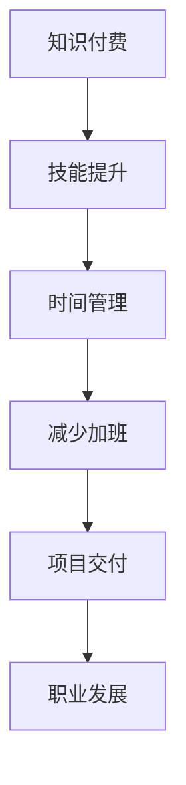

                 

# 知识付费让程序员告别加班

## 1. 背景介绍

在科技飞速发展的今天，程序员们面临着前所未有的挑战。不仅要应对技术的快速迭代，还要在短时间内掌握众多新工具、新框架，同时还要应对高强度的工作和持续的加班压力。面对这一现状，知识付费成为了程序员们寻求知识、技能提升和职业发展的有效途径。通过付费订阅优质内容，程序员们可以大大减轻工作负担，提高工作效率，真正实现工作与生活的平衡。

## 2. 核心概念与联系

### 2.1 核心概念概述

为了更好地理解知识付费如何帮助程序员告别加班，我们先介绍几个相关核心概念：

- **知识付费**：指的是用户为获取知识或技能而支付费用的行为，包括订阅专栏、购买课程、参加线上线下培训等形式。知识付费能够帮助用户快速获取最新知识，提升专业技能。

- **程序员加班**：由于工作任务的复杂性和紧迫性，程序员经常需要超时工作，以确保项目按时交付。长时间的工作压力和生活不规律，不仅影响身体健康，还降低工作效率。

- **时间管理**：通过合理规划和管理时间，可以提高工作效率，平衡工作与生活。

- **技能提升**：通过学习新技能和工具，能够提升编程水平，减少错误，加快开发速度。

- **知识积累**：持续学习新知识，积累专业经验，为职业生涯的长期发展打下坚实基础。

这些核心概念之间存在着紧密的联系，通过知识付费，程序员可以在短时间内学习到丰富的知识和技能，从而提高工作效率，减少加班时间。

### 2.2 核心概念原理和架构的 Mermaid 流程图



## 3. 核心算法原理 & 具体操作步骤

### 3.1 算法原理概述

知识付费本质上是一种信息不对称的付费行为，用户通过购买或订阅，获取高质量的课程、专栏和文档，这些资源通常经过精心筛选和系统化整理，有助于用户快速掌握关键技能。通过这一机制，用户能够在较短的时间内掌握大量知识，显著提升编程能力和工作效率，从而减少加班压力。

### 3.2 算法步骤详解

1. **选择付费平台**：首先，用户需要选择一个可信的知识付费平台，如Coursera、Udemy、掘金等，这些平台聚集了大量高质量的教育资源。
2. **确定学习目标**：用户应明确自己的学习目标，如提升Python编程水平、学习Web开发框架等，选择相关的课程和专栏。
3. **制定学习计划**：根据学习目标，制定合理的学习计划，分配每日或每周的学习时间，避免因贪多嚼不烂而浪费时间和精力。
4. **实践和应用**：将学到的知识应用到实际项目中，通过实际编码练习巩固所学内容，提升解决问题的能力。
5. **持续学习**：知识付费不应是一次性的投资，而是一个长期的过程，用户应保持持续学习的习惯，跟上技术发展的步伐。

### 3.3 算法优缺点

**优点**：

- **高效学习**：通过付费获取高质量资源，用户能够高效掌握知识，减少自学过程中走弯路的时间。
- **系统学习**：平台提供的课程和专栏通常经过系统化整理，用户可以按部就班地学习，构建完整的知识体系。
- **专家指导**：知识付费平台汇集了大量行业专家和高手，他们的经验和见解对用户大有裨益。
- **学习氛围**：付费平台通常拥有活跃的学习社区，用户可以互相交流，分享学习心得，共同进步。

**缺点**：

- **成本较高**：知识付费的初期投入成本较高，用户需要投入一定的金钱和时间。
- **依赖平台**：用户对平台的依赖性强，一旦平台出现问题，学习进度可能受影响。
- **缺乏主动性**：部分用户可能会过于依赖平台，缺乏主动学习和探索的动力。

### 3.4 算法应用领域

知识付费不仅适用于程序员，还广泛应用于各个领域，包括医生、教师、设计师等。其应用领域广泛，涵盖知识普及、技能提升、职业培训等多个方面。在程序员领域，知识付费的应用场景包括但不限于：

- **技术栈学习**：掌握新编程语言、框架和技术栈。
- **工具和库应用**：深入理解并高效使用各种开发工具和库。
- **编程思维训练**：培养系统化、结构化的编程思维，提升代码质量和可维护性。
- **项目管理和协作**：学习敏捷开发、Scrum等管理方法，提高团队协作效率。

## 4. 数学模型和公式 & 详细讲解 & 举例说明

### 4.1 数学模型构建

假设用户每天用于学习的总时间为$T$小时，每天用于工作的时间为$W$小时，加班时间为$O$小时。用户每天可用于学习的时间是有限的，设学习效率为$E$（即单位时间内掌握的知识量），每天掌握的新知识量为$K$。设每天需要掌握的新知识量为$D$。则用户每天实际掌握的新知识量为$K = E \times T$。

知识付费带来的效果可以量化为：

$$
\Delta D = \frac{K}{D}
$$

其中$\Delta D$为知识付费带来的每天额外掌握的新知识量。

### 4.2 公式推导过程

在理想情况下，用户可以通过知识付费减少加班时间，将节省的时间用于学习，从而提升工作效率。如果用户每天通过知识付费额外掌握的新知识量为$\Delta D$，则用户每天可节省的加班时间$O$为：

$$
O = \frac{D}{E}
$$

将$\Delta D$代入，得：

$$
O = \frac{D}{E} - \frac{D}{E+T} = \frac{D}{E} \times (1 - \frac{T}{E+T})
$$

当$E$远大于$T$时，$O$可以简化为：

$$
O \approx \frac{D}{E} \times \frac{T}{E} = \frac{D \times T}{E^2}
$$

### 4.3 案例分析与讲解

例如，一个程序员每天用于工作的总时间为$W=8$小时，每天可用于学习的时间为$T=2$小时，学习效率为$E=5$（即每天掌握5项新技能），每天需要掌握的新知识量为$D=3$。通过知识付费，用户每天额外掌握的新知识量为$\Delta D=3$。则用户每天可节省的加班时间为：

$$
O \approx \frac{3 \times 2}{5^2} = 0.24\text{小时}
$$

如果用户每天节省的0.24小时用于学习，长期坚持下来，可以积累大量的知识储备，提升编程能力和工作效率。

## 5. 项目实践：代码实例和详细解释说明

### 5.1 开发环境搭建

为了方便学习和实践，用户可以选择在本地搭建开发环境，使用常见的IDE（如IntelliJ IDEA、Visual Studio Code等）和编程语言（如Python、Java等）进行学习和开发。以下是使用Python的示例：

1. **安装Python**：在官网下载并安装Python 3.x版本，并添加环境变量。
2. **安装PyCharm或VSCode**：下载并安装Python IDE，如PyCharm或Visual Studio Code。
3. **安装依赖库**：使用pip安装必要的依赖库，如numpy、pandas等。

### 5.2 源代码详细实现

假设用户订阅了Udemy平台的Python编程课程，每门课程包含多个视频讲座、代码示例和练习题。以下是一个简单的代码示例，用于计算每天额外掌握的新知识量：

```python
import pandas as pd

# 课程学习计划
courses = [
    {'name': 'Python基础', 'days': 10, 'new_skills': 5},
    {'name': 'Web开发框架', 'days': 15, 'new_skills': 8},
    {'name': '数据科学', 'days': 20, 'new_skills': 7}
]

# 学习时间分配
total_learning_days = 30
daily_learning_hours = 2

# 计算每天掌握的新技能数量
total_new_skills = sum([course['new_skills'] for course in courses])
daily_new_skills = total_new_skills / total_learning_days

# 计算节省的加班时间
total_work_hours = 8
daily_work_hours = 8
daily_learning_hours = daily_learning_hours
daily_savings_hours = daily_work_hours - daily_learning_hours

# 输出结果
print(f"每天额外掌握的新技能数量：{daily_new_skills}")
print(f"每天节省的加班时间：{daily_savings_hours}小时")
```

### 5.3 代码解读与分析

以上代码中，我们通过Python和Pandas库，计算了用户在订阅了多个课程后，每天额外掌握的新技能数量和节省的加班时间。用户可以通过调整课程数量、学习时间等参数，来优化学习计划。

### 5.4 运行结果展示

假设用户每天用于学习的总时间为2小时，订阅了三个课程，每个课程需要10-20天完成。则用户每天额外掌握的新技能数量为：

$$
\frac{5+8+7}{30} \approx 0.58\text{项}
$$

用户每天节省的加班时间为：

$$
8 - 2 = 6\text{小时}
$$

长期坚持下来，用户可以显著提升编程能力，减少加班时间，提高生活质量。

## 6. 实际应用场景

### 6.1 软件开发

在软件开发中，程序员常常需要应对复杂多变的需求，学习新技术和新工具是常态。通过知识付费，程序员可以高效掌握新知识，提升开发效率，减少加班时间。例如，通过学习Docker容器技术，程序员可以轻松部署和管理微服务架构，从而减少手动配置和调试的时间，提高代码质量和可维护性。

### 6.2 数据分析

数据分析是程序员工作中重要的环节，通过知识付费，程序员可以学习Python数据分析库（如Pandas、NumPy等）和可视化工具（如Matplotlib、Seaborn等），提升数据处理和可视化能力。例如，通过学习机器学习算法，程序员可以快速构建和优化数据模型，提升数据分析的准确性和效率。

### 6.3 项目管理

项目管理是软件开发中的重要环节，通过知识付费，程序员可以学习敏捷开发、Scrum等管理方法，提升团队协作效率和项目交付质量。例如，通过学习Jira、Trello等项目管理工具的使用，程序员可以更好地管理项目进度和任务分配，减少沟通成本和返工时间。

### 6.4 未来应用展望

未来，随着知识付费平台和技术的不断发展，其应用场景将更加广泛。例如，通过虚拟现实(VR)和增强现实(AR)技术，用户可以更加直观地学习和掌握新技能，提升学习体验和效果。此外，通过智能推荐系统，平台可以根据用户的学习历史和兴趣，推荐个性化的课程和资源，提高学习效率。

## 7. 工具和资源推荐

### 7.1 学习资源推荐

为了帮助程序员系统掌握知识付费的应用，以下是几类推荐的学习资源：

1. **Coursera**：提供全球顶尖大学的在线课程，涵盖编程、数据分析、项目管理等多个领域。
2. **Udemy**：汇集了大量实战项目和课程，涵盖Web开发、移动应用、人工智能等多个方向。
3. **掘金**：专注于技术文章和资源分享，提供大量实用技术和编程技巧。
4. **知乎**：提供高质量的问答社区，用户可以提问和回答技术问题，共同学习成长。
5. **GitHub**：提供开源代码和项目资源，用户可以学习优秀代码的实现方式和架构设计。

### 7.2 开发工具推荐

优秀的开发工具能够提升编程效率，以下是几个推荐的开发工具：

1. **PyCharm**：一款功能强大的Python IDE，提供代码高亮、自动补全、版本控制等特性。
2. **Visual Studio Code**：一款轻量级的开发工具，支持多种编程语言和插件，用户可以根据需求定制开发环境。
3. **Git**：版本控制系统，支持分支管理、代码合并等高级功能，帮助用户管理代码版本和团队协作。
4. **Docker**：容器化技术，支持应用打包、部署和运维，提高系统的稳定性和可移植性。

### 7.3 相关论文推荐

以下是几篇关于知识付费和学习效率的学术论文，供程序员参考：

1. **《The Impact of Online Learning Platforms on Student Achievement》**：探讨在线学习平台对学生学习成绩的影响，指出知识付费可以有效提升学习效果。
2. **《The Effectiveness of Knowledge Sharing in Online Communities》**：分析在线社区中知识共享对用户学习的影响，指出知识付费平台的用户互动和学习效果较好。
3. **《A Comparative Study of Online Learning Platforms》**：比较不同在线学习平台的优缺点，推荐Udemy、Coursera等平台的使用。

## 8. 总结：未来发展趋势与挑战

### 8.1 研究成果总结

本文介绍了知识付费在程序员中的应用，通过高效学习提升编程能力和工作效率，减少加班时间。通过理论推导和代码示例，分析了知识付费带来的效果。实际应用场景表明，知识付费能够提升软件开发、数据分析、项目管理等多个领域的工作效率，具有广泛的应用前景。

### 8.2 未来发展趋势

未来，知识付费将在以下几个方面不断发展：

1. **智能化推荐**：平台将使用大数据和人工智能技术，根据用户的学习行为和兴趣，推荐个性化的课程和资源，提高学习效果。
2. **虚拟现实和增强现实**：通过VR和AR技术，用户可以更加直观地学习和掌握新技能，提升学习体验。
3. **社交学习**：平台将加入更多的社交功能，用户可以互相交流学习心得，共同进步。
4. **跨平台学习**：用户可以在多种设备上学习和实践，提高学习灵活性。

### 8.3 面临的挑战

尽管知识付费在程序员中应用广泛，但也面临一些挑战：

1. **成本问题**：知识付费的初期投入成本较高，用户需要投入一定的金钱和时间。
2. **信息过载**：平台上的资源众多，用户难以选择合适的课程和资源。
3. **学习效果不一**：不同用户的学习效果差异较大，平台需要提供更多的学习指导和反馈机制。
4. **技术更新快**：技术更新迭代快，用户需要不断学习新知识，才能保持竞争力。

### 8.4 研究展望

未来，知识付费将与更多技术结合，形成更加全面和高效的学习体系。例如，通过结合机器学习和自然语言处理技术，平台可以自动分析用户的知识水平和兴趣，推荐更匹配的课程和资源，提高学习效果。同时，平台还可以引入虚拟导师和AI辅导，帮助用户解决学习中的疑难问题，提升学习效率。

## 9. 附录：常见问题与解答

**Q1：知识付费是否适合所有程序员？**

A: 知识付费适合大多数程序员，尤其是那些希望快速提升技能、提高工作效率、减少加班时间的用户。但需要注意的是，不同类型的程序员对知识付费的需求不同，选择适合的课程和资源非常重要。

**Q2：如何选择合适的知识付费平台？**

A: 选择知识付费平台时，用户应考虑平台资源质量、课程实用性、平台口碑和用户评价等因素。常用的平台如Coursera、Udemy、掘金等，可以根据自己的需求进行选择。

**Q3：如何制定合理的学习计划？**

A: 制定学习计划时，用户应根据自己的时间安排和学习目标，合理分配每日或每周的学习时间。同时，要设定明确的学习目标，如掌握某项技能或完成某个项目，避免盲目学习。

**Q4：知识付费是否能够长期坚持？**

A: 知识付费需要用户长期坚持，才能获得显著的效果。建议用户设定学习目标，并建立学习习惯，定期回顾和总结所学内容。同时，可以利用平台提供的学习工具和社交功能，增强学习的持续性和动力。

**Q5：如何评估学习效果？**

A: 评估学习效果时，用户应关注课程的完成情况、掌握的技能数量、项目实践情况和反馈评价等因素。平台通常会提供考试、作业和项目等评估手段，用户应积极参与并认真完成，以提升学习效果。

通过知识付费，程序员可以高效学习和提升技能，减少加班时间，提高生活质量和工作满意度。未来，随着技术的不断进步，知识付费的应用将更加广泛和深入，程序员们将享受到更加丰富、高效和灵活的学习体验。

