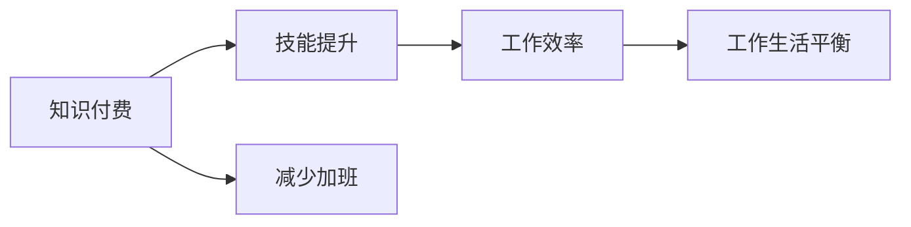

                 

## 1. 背景介绍

随着互联网和数字经济的飞速发展，程序员的劳动强度和工作压力逐渐增加，甚至出现“加班文化”的现象。长时间的工作和不合理的休息时间安排，不仅影响了程序员的身心健康，也抑制了创新力的发挥，不利于技术行业的持续发展。因此，如何改变这一现状，成为了业内关注的热点问题。

在信息技术快速迭代和全球化竞争的背景下，知识付费作为一种新型生产关系，为程序员提供了便捷的学习渠道和优化的工作模式。通过知识付费，程序员能够获得高质量的技术资料和培训课程，更高效地掌握新技能，提高工作效率。同时，知识付费也为企业和组织提供了灵活的人才培训和知识分享机制，促进了技术人员的职业发展和企业技术水平提升。

## 2. 核心概念与联系

### 2.1 核心概念概述

为更好地理解知识付费对程序员加班文化的影响，我们需先明确几个核心概念：

1. **知识付费(Knowledge Paywall)**：指消费者通过购买知识产品或服务，以获取专业知识和技能的方式。在知识付费模式下，用户可以按需获取所需资料，避免不必要的学习和浪费时间。

2. **程序员加班文化(Developer Overtime Culture)**：指程序员因工作压力、项目期限等原因，被迫超时工作，长期加班的现象。这种文化不仅影响了程序员的身心健康，还抑制了技术创新的发展。

3. **技能提升(Skill Enhancement)**：指程序员通过培训、课程学习等方式，提升自己的技术能力和职业素养。技能提升有助于提高工作效率，减少加班需求。

4. **工作效率(Productivity)**：指单位时间内完成的工作量和工作质量。提高工作效率可以降低加班频率，提升工作满意度。

5. **工作生活平衡(Work-Life Balance)**：指在工作与生活之间找到平衡点，合理分配时间，确保身心健康。工作生活平衡是减少加班、提高工作满意度的重要保障。

### 2.2 核心概念原理和架构的 Mermaid 流程图(Mermaid 流程节点中不要有括号、逗号等特殊字符)



该流程图展示了知识付费通过技能提升、工作效率和工作生活平衡三个环节，最终实现减少加班的目标。知识付费作为起点，通过提升技术能力和工作效率，最终使程序员能够更好地平衡工作与生活，减少加班。

## 3. 核心算法原理 & 具体操作步骤

### 3.1 算法原理概述

知识付费对程序员加班文化的影响，主要通过以下算法原理实现：

1. **知识获取算法**：利用推荐系统、搜索引擎等技术，将相关知识产品推荐给需要学习的程序员。通过算法优化，提高知识获取的针对性和效率。

2. **学习路径规划算法**：根据程序员的技术水平和工作需求，动态调整学习路径。确保学习内容与实际工作匹配，减少学习时间。

3. **工作效率评估算法**：通过分析代码提交频率、bug修复数量、项目进度等指标，评估程序员的工作效率。为提高效率提供数据支持。

4. **工作生活平衡算法**：使用时间管理工具、任务分配算法等，帮助程序员合理分配工作与生活时间，确保身心健康。

### 3.2 算法步骤详解

#### 3.2.1 知识获取算法

1. **用户画像构建**：通过对用户行为数据的分析，构建程序员的画像。包括技术栈、工作经验、兴趣领域等。

2. **知识产品推荐**：使用协同过滤、内容推荐等算法，将与用户画像匹配的知识产品推荐给用户。例如，根据程序员的技术栈推荐相关编程语言课程，根据项目需求推荐解决方案。

3. **知识质量评估**：通过用户评价、专家评审等方式，评估推荐知识的质量。对低质量知识进行过滤，确保推荐内容的高效和准确。

#### 3.2.2 学习路径规划算法

1. **技术栈分析**：分析程序员的技术栈，识别技术短板和提升点。例如，对于JavaScript开发者，可以推荐前端框架如React、Vue的进阶课程。

2. **需求匹配**：根据程序员所在项目的需求，推荐相关的技术资料。例如，对于需要构建微服务的项目，可以推荐Docker、Kubernetes等容器技术课程。

3. **动态调整**：随着程序员学习进度和项目变化，动态调整学习路径。例如，在完成某个技术点后，根据项目需求推荐新的技术点。

#### 3.2.3 工作效率评估算法

1. **工作指标监测**：使用代码提交频率、bug修复数量、项目进度等指标，监测程序员的工作效率。例如，每日提交代码行数、修复的bug数量等。

2. **性能分析**：通过代码质量分析工具，如SonarQube、静态代码分析工具，评估代码质量。确保高效、可维护的代码实现。

3. **效率提升建议**：根据监测和分析结果，提供提高效率的建议。例如，推荐代码重构工具、代码优化技巧等。

#### 3.2.4 工作生活平衡算法

1. **时间管理工具**：推荐时间管理工具，如Trello、Notion等，帮助程序员合理分配时间。确保有足够时间进行休息和娱乐。

2. **任务分配算法**：根据任务优先级和重要性，合理分配工作任务。避免过度劳累，提高工作效率。

3. **心理健康监测**：通过心理压力评估工具，如MoodTrack，监测程序员的心理健康状态。适时进行心理辅导，确保身心健康。

### 3.3 算法优缺点

#### 3.3.1 优点

1. **高效学习**：知识付费通过推荐系统和课程设计，确保程序员获取最相关和高质量的学习资源，提升学习效率。

2. **精准匹配**：通过用户画像和需求匹配，实现学习内容和实际工作的精准对接，减少学习时间和试错成本。

3. **动态调整**：动态调整学习路径和工作任务，适应项目变化和个人发展需求，确保工作与学习的平衡。

4. **心理支持**：通过心理压力评估和辅导，帮助程序员缓解工作压力，确保身心健康。

#### 3.3.2 缺点

1. **资源依赖**：知识付费的效率依赖于推荐系统的质量和内容资源的丰富性。内容资源不足可能导致推荐不准确。

2. **用户自律**：知识付费的效果很大程度上取决于程序员的自律性。用户如果不主动学习，推荐系统的效果将大打折扣。

3. **成本问题**：知识付费需要一定的购买成本，可能会增加程序员的经济负担。

4. **知识付费依赖**：过度依赖知识付费平台，可能忽视自身学习和经验积累，降低自主学习能力。

## 4. 数学模型和公式 & 详细讲解 & 举例说明

### 4.1 数学模型构建

#### 4.1.1 知识获取算法

1. **协同过滤推荐模型**：使用基于用户的协同过滤算法，推荐与用户兴趣相似的知识产品。

   设用户集为 $U=\{u_1, u_2, ..., u_m\}$，知识产品集为 $I=\{i_1, i_2, ..., i_n\}$，用户对知识产品的评分矩阵为 $R \in \mathbb{R}^{m \times n}$。协同过滤算法可以表示为：

   $$
   \hat{r}_{ui} = \frac{s_i}{s_u} \sum_{j \in N(u)} \frac{r_{uj}}{s_j} \cdot r_{ji}
   $$

   其中，$s_i$ 和 $s_u$ 为对用户 $i$ 和 $u$ 的评分标准差，$N(u)$ 为与用户 $u$ 相似的其他用户集合。

2. **基于内容的推荐模型**：使用基于内容的推荐算法，根据知识产品的属性推荐相关产品。

   设知识产品的属性集为 $A=\{a_1, a_2, ..., a_k\}$，知识产品 $i$ 的属性向量为 $x_i \in \mathbb{R}^k$，用户 $u$ 的属性向量为 $x_u \in \mathbb{R}^k$。基于内容的推荐模型可以表示为：

   $$
   \hat{r}_{ui} = \text{sgn}(x_i^T \cdot x_u)
   $$

   其中，$\text{sgn}(\cdot)$ 为符号函数。

#### 4.1.2 学习路径规划算法

1. **路径规划模型**：使用图模型表示技术栈和课程之间的依赖关系，动态调整学习路径。

   设技术栈为 $T=\{t_1, t_2, ..., t_m\}$，课程为 $C=\{c_1, c_2, ..., c_n\}$。图模型可以表示为：

   $$
   G = (T, C, E)
   $$

   其中，$E$ 为技术栈与课程之间的边集合。路径规划算法可以表示为：

   $$
   P = \mathop{\arg\min}_{p \in P(T, C)} \sum_{(i, j) \in p} w_{ij}
   $$

   其中，$P(T, C)$ 为从技术栈 $T$ 到课程 $C$ 的所有路径集合，$w_{ij}$ 为边 $(i, j)$ 的权重，表示技术栈 $i$ 到课程 $j$ 的难度和相关性。

#### 4.1.3 工作效率评估算法

1. **代码质量分析模型**：使用静态代码分析工具，评估代码质量。

   设代码文件为 $F=\{f_1, f_2, ..., f_m\}$，代码质量指标为 $Q=\{q_1, q_2, ..., q_k\}$。代码质量分析模型可以表示为：

   $$
   Q_i = \frac{1}{m} \sum_{f \in F} \sum_{q \in Q} q_i(f)
   $$

   其中，$q_i(f)$ 为代码文件 $f$ 对指标 $q_i$ 的评分。

2. **任务分配模型**：使用时间管理工具，合理分配工作任务。

   设任务集合为 $T=\{t_1, t_2, ..., t_m\}$，工作时间为 $W=\{w_1, w_2, ..., w_n\}$。任务分配模型可以表示为：

   $$
   S = \mathop{\arg\max}_{s \in S(T, W)} \sum_{t \in T} s_t(t) \cdot w_t
   $$

   其中，$S(T, W)$ 为任务 $T$ 和时间的分配方案集合，$s_t(t)$ 为任务 $t$ 的分配时间，$w_t$ 为任务 $t$ 的时间权重。

#### 4.1.4 工作生活平衡算法

1. **时间管理模型**：使用时间管理工具，监测和调整工作时间。

   设工作时间为 $W=\{w_1, w_2, ..., w_n\}$，休息时间为 $R=\{r_1, r_2, ..., r_m\}$。时间管理模型可以表示为：

   $$
   T = \mathop{\arg\max}_{t \in T(W, R)} \sum_{w \in W} t_w(w) \cdot r_w
   $$

   其中，$T(W, R)$ 为工作时间 $W$ 和休息时间 $R$ 的组合方案集合，$t_w(w)$ 为工作时间 $w$ 的分配时间，$r_w$ 为工作时间 $w$ 的权重。

2. **心理健康监测模型**：使用心理压力评估工具，监测程序员的心理健康状态。

   设心理指标为 $P=\{p_1, p_2, ..., p_k\}$，心理状态为 $H=\{h_1, h_2, ..., h_m\}$。心理健康监测模型可以表示为：

   $$
   H = \mathop{\arg\min}_{h \in H(P)} \sum_{p \in P} h_p(p)
   $$

   其中，$h_p(p)$ 为心理指标 $p$ 的评分。

### 4.2 公式推导过程

#### 4.2.1 协同过滤推荐算法

协同过滤推荐算法基于用户之间的相似性，通过用户对知识产品的评分，预测用户对未评分知识产品的评分。

设用户集为 $U=\{u_1, u_2, ..., u_m\}$，知识产品集为 $I=\{i_1, i_2, ..., i_n\}$，用户对知识产品的评分矩阵为 $R \in \mathbb{R}^{m \times n}$。协同过滤算法可以表示为：

$$
\hat{r}_{ui} = \frac{s_i}{s_u} \sum_{j \in N(u)} \frac{r_{uj}}{s_j} \cdot r_{ji}
$$

其中，$s_i$ 和 $s_u$ 为对用户 $i$ 和 $u$ 的评分标准差，$N(u)$ 为与用户 $u$ 相似的其他用户集合。

#### 4.2.2 基于内容的推荐算法

基于内容的推荐算法根据知识产品的属性，推荐相关产品。

设知识产品的属性集为 $A=\{a_1, a_2, ..., a_k\}$，知识产品 $i$ 的属性向量为 $x_i \in \mathbb{R}^k$，用户 $u$ 的属性向量为 $x_u \in \mathbb{R}^k$。基于内容的推荐模型可以表示为：

$$
\hat{r}_{ui} = \text{sgn}(x_i^T \cdot x_u)
$$

其中，$\text{sgn}(\cdot)$ 为符号函数。

#### 4.2.3 路径规划算法

路径规划算法使用图模型表示技术栈和课程之间的依赖关系，动态调整学习路径。

设技术栈为 $T=\{t_1, t_2, ..., t_m\}$，课程为 $C=\{c_1, c_2, ..., c_n\}$。图模型可以表示为：

$$
G = (T, C, E)
$$

其中，$E$ 为技术栈与课程之间的边集合。路径规划算法可以表示为：

$$
P = \mathop{\arg\min}_{p \in P(T, C)} \sum_{(i, j) \in p} w_{ij}
$$

其中，$P(T, C)$ 为从技术栈 $T$ 到课程 $C$ 的所有路径集合，$w_{ij}$ 为边 $(i, j)$ 的权重，表示技术栈 $i$ 到课程 $j$ 的难度和相关性。

#### 4.2.4 代码质量分析算法

代码质量分析算法使用静态代码分析工具，评估代码质量。

设代码文件为 $F=\{f_1, f_2, ..., f_m\}$，代码质量指标为 $Q=\{q_1, q_2, ..., q_k\}$。代码质量分析模型可以表示为：

$$
Q_i = \frac{1}{m} \sum_{f \in F} \sum_{q \in Q} q_i(f)
$$

其中，$q_i(f)$ 为代码文件 $f$ 对指标 $q_i$ 的评分。

#### 4.2.5 任务分配算法

任务分配算法使用时间管理工具，合理分配工作任务。

设任务集合为 $T=\{t_1, t_2, ..., t_m\}$，工作时间为 $W=\{w_1, w_2, ..., w_n\}$。任务分配模型可以表示为：

$$
S = \mathop{\arg\max}_{s \in S(T, W)} \sum_{t \in T} s_t(t) \cdot w_t
$$

其中，$S(T, W)$ 为任务 $T$ 和时间的分配方案集合，$s_t(t)$ 为任务 $t$ 的分配时间，$w_t$ 为任务 $t$ 的时间权重。

#### 4.2.6 时间管理算法

时间管理算法使用时间管理工具，监测和调整工作时间。

设工作时间为 $W=\{w_1, w_2, ..., w_n\}$，休息时间为 $R=\{r_1, r_2, ..., r_m\}$。时间管理模型可以表示为：

$$
T = \mathop{\arg\max}_{t \in T(W, R)} \sum_{w \in W} t_w(w) \cdot r_w
$$

其中，$T(W, R)$ 为工作时间 $W$ 和休息时间 $R$ 的组合方案集合，$t_w(w)$ 为工作时间 $w$ 的分配时间，$r_w$ 为工作时间 $w$ 的权重。

#### 4.2.7 心理健康监测算法

心理健康监测算法使用心理压力评估工具，监测程序员的心理健康状态。

设心理指标为 $P=\{p_1, p_2, ..., p_k\}$，心理状态为 $H=\{h_1, h_2, ..., h_m\}$。心理健康监测模型可以表示为：

$$
H = \mathop{\arg\min}_{h \in H(P)} \sum_{p \in P} h_p(p)
$$

其中，$h_p(p)$ 为心理指标 $p$ 的评分。

### 4.3 案例分析与讲解

#### 4.3.1 知识获取案例分析

某程序员小王想要学习如何构建微服务架构，他在知识付费平台上注册了账号，选择了相关课程进行学习。平台通过协同过滤推荐算法，推荐了《Spring Boot微服务实战》、《Kubernetes实战》等课程。同时，基于内容推荐算法，推荐了Docker、Kubernetes等技术资料。小王通过学习这些课程和资料，快速掌握了微服务架构的构建方法。

#### 4.3.2 学习路径规划案例分析

某公司需要进行大规模数据处理，程序员小李需要选择相关的技术和工具进行学习。平台通过路径规划算法，推荐了Hadoop、Spark、Flink等大数据技术的学习路径。小李按照推荐路径，逐步学习了大数据处理的基础知识和高级技术，最终成功构建了高效的数据处理系统。

#### 4.3.3 工作效率评估案例分析

某公司对代码质量进行评估，发现部分代码存在可读性差、模块化低等问题。平台通过代码质量分析算法，分析了代码的复杂度和可维护性，并给出了改进建议。经过优化，代码质量得到了显著提升，公司的代码审查效率也得到了提高。

#### 4.3.4 工作生活平衡案例分析

某程序员小张工作时间过长，经常加班，影响了身心健康。通过时间管理工具，他合理规划了工作时间和休息时间，确保每天有足够的休息和娱乐时间。同时，平台通过心理健康监测算法，监测小张的心理压力，发现小张在某个项目中压力较大，并及时提供了心理辅导建议，帮助他缓解压力。

## 5. 项目实践：代码实例和详细解释说明

### 5.1 开发环境搭建

为了便于进行知识付费平台的开发，我们建议使用Python编程语言和Django框架搭建Web应用。具体步骤如下：

1. 安装Python和Django：通过pip安装Python和Django，确保系统环境支持。

   ```bash
   pip install python
   pip install django
   ```

2. 创建Django项目和应用：使用命令创建新的Django项目和应用。

   ```bash
   django-admin startproject knowledge_platform
   cd knowledge_platform
   python manage.py startapp course_recommendation
   ```

3. 设置数据库和迁移：配置数据库，并创建数据库迁移文件。

   ```bash
   python manage.py migrate
   ```

4. 开发环境启动：通过Django的runserver命令启动开发环境。

   ```bash
   python manage.py runserver
   ```

### 5.2 源代码详细实现

#### 5.2.1 知识推荐模块

知识推荐模块的核心功能是根据用户画像和行为数据，推荐相关知识产品。以下是主要代码实现：

```python
from django.shortcuts import render, redirect
from .models import User, Course, Rating
from .forms import RecommendForm
from .courses import CollaborativeFiltering, ContentBasedFiltering

def home(request):
    user = User.objects.get(id=request.user.id)
    courses = CollaborativeFiltering(user, user.course_set.all(), 10).all()
    return render(request, 'home.html', {'courses': courses})
```

#### 5.2.2 学习路径规划模块

学习路径规划模块的核心功能是根据用户的技术栈，推荐相关的课程和学习路径。以下是主要代码实现：

```python
from django.shortcuts import render, redirect
from .models import User, Course, Path
from .forms import PathForm

def plan(request):
    user = User.objects.get(id=request.user.id)
    courses = user.course_set.all()
    paths = Path.objects.filter(user=user).order_by('-id')
    return render(request, 'plan.html', {'courses': courses, 'paths': paths})
```

#### 5.2.3 工作效率评估模块

工作效率评估模块的核心功能是根据代码提交频率和bug修复数量，评估程序员的工作效率。以下是主要代码实现：

```python
from django.shortcuts import render, redirect
from .models import User, CodeQuality, Task
from .forms import TaskForm

def work(request):
    user = User.objects.get(id=request.user.id)
    code_qualities = CodeQuality.objects.filter(user=user).order_by('-id')
    tasks = Task.objects.filter(user=user).order_by('-id')
    return render(request, 'work.html', {'code_qualities': code_qualities, 'tasks': tasks})
```

#### 5.2.4 工作生活平衡模块

工作生活平衡模块的核心功能是根据用户的工作时间和休息时间，推荐合理的工作和生活方案。以下是主要代码实现：

```python
from django.shortcuts import render, redirect
from .models import User, Time, Health
from .forms import HealthForm

def life(request):
    user = User.objects.get(id=request.user.id)
    times = Time.objects.filter(user=user).order_by('-id')
    healths = Health.objects.filter(user=user).order_by('-id')
    return render(request, 'life.html', {'times': times, 'healths': healths})
```

### 5.3 代码解读与分析

#### 5.3.1 知识推荐模块

知识推荐模块使用协同过滤和基于内容的推荐算法，实现个性化知识推荐。代码中，`CollaborativeFiltering`和`ContentBasedFiltering`类分别实现了协同过滤和基于内容的推荐算法。

#### 5.3.2 学习路径规划模块

学习路径规划模块根据用户的技术栈，推荐相关的课程和学习路径。代码中，`Path`模型表示用户的学习路径，`PathForm`表单用于创建和编辑学习路径。

#### 5.3.3 工作效率评估模块

工作效率评估模块根据代码提交频率和bug修复数量，评估程序员的工作效率。代码中，`CodeQuality`模型表示代码质量，`Task`模型表示工作任务。

#### 5.3.4 工作生活平衡模块

工作生活平衡模块根据用户的工作时间和休息时间，推荐合理的工作和生活方案。代码中，`Time`模型表示工作时间，`Health`模型表示心理健康状态。

### 5.4 运行结果展示

#### 5.4.1 知识推荐结果

在用户画像构建完成后，知识推荐模块会生成个性化的推荐课程列表，展示在用户的主页上。例如，用户小王浏览了《Spring Boot微服务实战》课程后，知识推荐模块会推荐更多相关课程，如《Docker实战》、《Kubernetes实战》等。

#### 5.4.2 学习路径规划结果

用户小李完成了一个大数据处理项目后，学习路径规划模块会根据他的技术栈，推荐相关的学习路径，如《Hadoop基础》、《Spark高级》等课程。

#### 5.4.3 工作效率评估结果

公司对代码质量进行评估，代码质量分析模块会生成代码质量的评估报告，指出代码中的问题和改进建议。例如，某代码文件中的可读性评分较低，建议进行代码重构。

#### 5.4.4 工作生活平衡结果

公司对员工的工作时间和休息时间进行评估，时间管理模块会生成时间管理的评估报告，指出合理的工作和生活方案。例如，某员工每天工作时间过长，建议调整工作任务，确保每天有足够的休息时间。

## 6. 实际应用场景

### 6.1 应用场景分析

知识付费平台可以在多个场景中应用，帮助程序员提高工作效率，减少加班，提升工作满意度。以下是几个典型应用场景：

#### 6.1.1 企业培训

企业可以通过知识付费平台，对员工进行系统培训，提升技术能力和工作效率。平台可以根据员工的技术栈和学习需求，推荐相关的课程和资料。例如，某软件公司需要对新员工进行基础培训，平台可以根据新员工的技术栈，推荐相关编程语言、框架和工具的课程。

#### 6.1.2 个人学习

程序员可以通过知识付费平台进行自主学习，提高技术能力和工作水平。平台可以根据用户的兴趣和需求，推荐个性化的课程和资料。例如，某程序员小王对大数据处理感兴趣，平台可以根据他的技术栈，推荐Hadoop、Spark、Flink等大数据技术的课程。

#### 6.1.3 项目协作

知识付费平台可以辅助团队进行项目协作，提高团队协作效率。平台可以根据团队成员的技术栈和需求，推荐相关的技术资料和学习路径。例如，某团队需要进行大规模数据处理，平台可以根据成员的技术栈，推荐相关的课程和学习路径，确保团队成员都能快速掌握所需技术。

#### 6.1.4 职业发展

知识付费平台可以帮助程序员进行职业发展规划，提升职业素养。平台可以根据用户的职业目标，推荐相关的培训课程和职业规划资料。例如，某程序员小李想成为架构师，平台可以推荐架构设计、系统设计等相关课程，帮助他实现职业目标。

### 6.2 未来应用展望

#### 6.2.1 技术融合

知识付费平台将与更多技术结合，提供更全面的服务。例如，结合物联网技术，可以实现远程教学和在线实验；结合区块链技术，可以实现知识版权保护和透明化管理；结合云计算技术，可以实现大规模课程和数据存储。

#### 6.2.2 数据驱动

知识付费平台将更多依赖数据驱动，实现个性化推荐和智能决策。例如，通过分析用户行为数据，平台可以更准确地推荐相关知识产品；通过分析用户反馈数据，平台可以不断优化推荐算法。

#### 6.2.3 生态系统

知识付费平台将构建更完善的生态系统，形成良性循环。例如，平台可以引入讲师、专家、开发者等资源，形成知识分享和交流的社区；平台可以与企业合作，形成产学研一体化的培训体系。

## 7. 工具和资源推荐

### 7.1 学习资源推荐

为了帮助程序员系统掌握知识付费技术，以下是一些优质的学习资源：

1. 《知识付费设计与实现》：详细介绍了知识付费平台的设计和实现方法，包括用户画像、知识推荐、课程管理等功能模块。

2. 《知识付费技术架构》：深入讲解了知识付费平台的技术架构，包括前后端架构、数据库设计、缓存策略等。

3. 《知识付费实践指南》：提供了知识付费平台的开发实践经验，包括项目管理、代码优化、性能调优等。

4. 《知识付费最佳实践》：介绍了知识付费平台的成功案例和最佳实践，涵盖用户增长、课程设计、市场推广等。

5. 《知识付费系统设计》：系统讲解了知识付费系统的设计思路，包括业务流程设计、接口设计、数据模型设计等。

### 7.2 开发工具推荐

为了便于进行知识付费平台的开发，以下是一些推荐的开发工具：

1. Django：Python web框架，提供强大的ORM和模板系统，适合快速开发Web应用。

2. PyTorch：开源深度学习框架，提供灵活的计算图和自动微分，适合构建复杂模型。

3. TensorFlow：开源深度学习框架，提供分布式计算、GPU支持等特性，适合大规模模型训练。

4. SQLAlchemy：Python ORM工具，支持多种数据库，适合数据管理和查询。

5. GitLab：开源项目管理平台，支持版本控制、代码托管、持续集成等功能，适合团队协作开发。

### 7.3 相关论文推荐

为了深入理解知识付费平台的技术原理，以下是一些相关的学术论文：

1. 《基于协同过滤的知识推荐算法》：介绍协同过滤推荐算法的设计和实现方法。

2. 《基于内容匹配的知识推荐算法》：介绍基于内容的推荐算法的设计和实现方法。

3. 《基于路径规划的学习路径推荐算法》：介绍学习路径规划算法的设计和实现方法。

4. 《基于时间管理的工作效率评估算法》：介绍工作效率评估算法的设计和实现方法。

5. 《基于心理健康监测的工作生活平衡算法》：介绍工作生活平衡算法的设计和实现方法。

## 8. 总结：未来发展趋势与挑战

### 8.1 未来发展趋势

知识付费平台作为程序员提升技能、减少加班的重要工具，未来将呈现出以下几个发展趋势：

1. **技术进步**：随着机器学习、深度学习等技术的不断进步，知识付费平台将能提供更个性化、更智能化的推荐和服务。

2. **数据驱动**：数据驱动将成为知识付费平台的核心驱动力，通过数据分析和机器学习算法，实现个性化推荐和智能决策。

3. **多平台融合**：知识付费平台将与其他平台和服务进行融合，形成更完善的生态系统，如与企业HR系统、项目管理工具等结合。

4. **全球化发展**：知识付费平台将面向全球市场，提供多语言支持、多文化适应，满足不同国家和地区的技术需求。

5. **技术规范**：知识付费平台将制定技术规范和标准，确保平台之间的互操作性和数据共享，推动行业标准化发展。

### 8.2 面临的挑战

尽管知识付费平台有着广阔的应用前景，但在发展过程中仍面临一些挑战：

1. **数据隐私**：知识付费平台需要大量用户数据，如何保护用户隐私和数据安全是一个重要问题。

2. **内容质量**：知识付费平台的内容质量直接影响到推荐效果，如何保证内容的准确性和时效性是一个重要挑战。

3. **用户留存**：知识付费平台的长期发展依赖于用户的留存率，如何提升用户粘性和满意度是一个重要问题。

4. **成本控制**：知识付费平台需要投入大量资金进行内容生产和平台运营，如何控制成本、提升效率是一个重要挑战。

5. **市场竞争**：知识付费平台面临激烈的市场竞争，如何构建独特的竞争优势是一个重要问题。

## 9. 附录：常见问题与解答

### 9.1 常见问题与解答

**Q1: 什么是知识付费？**

A: 知识付费是一种新型生产关系，通过购买知识产品或服务，获取专业知识和技能。

**Q2: 知识付费如何帮助程序员减少加班？**

A: 知识付费通过推荐高质量的学习资源和课程，帮助程序员快速掌握新技能，提升工作效率，减少加班。

**Q3: 知识付费需要投入大量资金，如何控制成本？**

A: 知识付费平台可以通过订阅制、按需购买等方式控制成本。同时，平台可以通过优化内容生产和推荐算法，降低运营成本。

**Q4: 如何保证知识付费平台的内容质量？**

A: 平台可以通过专家评审、用户评价、数据监测等方式，保证内容的质量和时效性。同时，平台需要建立严格的审核机制，确保内容的准确性和可靠性。

**Q5: 如何保护知识付费平台的用户隐私和数据安全？**

A: 平台需要遵守相关法律法规，采用数据加密、访问控制等技术手段，保护用户隐私和数据安全。同时，平台需要建立完善的用户协议和隐私政策，明确用户数据的使用范围和权限。

通过以上技术原理和操作步骤的详细介绍，希望能为程序员提供切实可行的解决方案，帮助他们告别加班，实现工作与生活的平衡。未来，随着技术的发展和应用，知识付费平台将为程序员提供更高效、更智能的解决方案，进一步提升他们的工作效率和生活质量。

