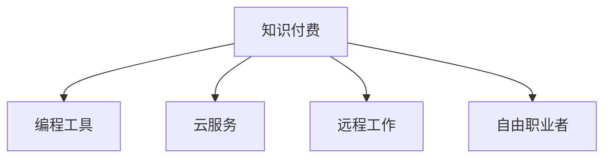

                 

# 知识付费让程序员告别朝九晚五的生活方式

## 1. 背景介绍

在快速发展的数字化时代，编程已经成为众多职业中一个重要且高薪的岗位。然而，程序员的工作生活往往与一般工作截然不同：朝九晚五、周末双休不再是他们的常态，熬夜加班、编码至深夜常常是他们的日常。面对这种工作模式，不少程序员已经不再满足于传统的朝九晚五的生活，开始探索新的工作和生活方式。

在这篇文章中，我们将探讨知识付费如何成为程序员们一种新兴的生活方式，帮助他们实现工作与生活的平衡。

## 2. 核心概念与联系

### 2.1 核心概念概述

为深入理解知识付费背后的技术逻辑，我们需要清晰几个关键概念：

- **知识付费（Knowledge Paywall）**：一种基于用户订阅或按需购买的在线知识服务模式。知识付费平台通过提供高质量的课程、资料、电子书等资源，满足用户的学习需求。

- **编程工具（Programming Tools）**：开发和调试代码所必需的软件工具，包括代码编辑器、版本控制系统、调试器等。

- **云服务（Cloud Services）**：基于云技术的各种在线服务，如云计算、云存储、云数据库等，为程序员提供高效、便捷的开发环境。

- **远程工作（Remote Work）**：利用互联网技术，允许员工在非公司地理位置工作的一种工作方式，常用于灵活的工作安排和项目管理。

- **自由职业者（Freelancers）**：自由职业者通常以项目为单位进行工作，不需要固定雇主，有较大的自由度和选择权。

这些概念之间的逻辑关系通过以下Mermaid流程图展示：



可以看出，知识付费为程序员提供了获取编程知识和工具的途径，云服务提供了灵活的工作环境，远程工作则是实现这种灵活性的重要保障，而自由职业者正是这种新兴生活方式的代表。

## 3. 核心算法原理 & 具体操作步骤

### 3.1 算法原理概述

知识付费平台的核心算法原理基于推荐系统和个性化学习模型。通过用户行为数据（如浏览、购买、学习时长等），推荐系统能够识别用户的学习偏好，推送最符合用户需求的内容。个性化学习模型则通过分析用户的学习进度和理解程度，动态调整教学内容和难度，从而提升学习效果。

### 3.2 算法步骤详解

知识付费平台的算法步骤主要包括数据收集、特征工程、模型训练和推荐策略制定四个部分：

1. **数据收集**：收集用户在平台上的各项行为数据，包括浏览记录、购买记录、课程完成度等。
2. **特征工程**：通过预处理和特征提取，将原始数据转化为机器学习算法可用的特征向量。
3. **模型训练**：使用各种机器学习模型（如协同过滤、内容推荐、深度学习等）对用户行为数据进行训练，构建推荐系统。
4. **推荐策略制定**：结合用户的历史行为和当前需求，制定推荐策略，生成个性化的课程推荐列表。

### 3.3 算法优缺点

知识付费平台的推荐算法具有以下优点：
- **个性化高**：通过用户行为数据进行个性化推荐，用户能够更快找到感兴趣的内容。
- **内容丰富**：平台上的课程种类多样，涵盖编程语言、开发框架、软件架构等方方面面。
- **互动性强**：许多平台提供实时反馈机制，如代码练习、项目评估等，能够及时了解学习进度和效果。

但该算法也存在一些局限性：
- **推荐质量依赖数据质量**：如果数据收集不充分或不准确，推荐效果会大打折扣。
- **容易过拟合**：模型可能在特定用户群中表现良好，但对其他用户群泛化能力有限。
- **隐私问题**：大量用户数据的使用可能带来隐私泄露的风险。

### 3.4 算法应用领域

知识付费平台的应用领域广泛，以下是几个典型的应用场景：

- **技术培训**：程序员可以利用平台学习新的编程语言、框架和技术栈，提升自身技能。
- **项目实战**：平台上的实战项目和模拟案例能够帮助程序员在实际工作中应用所学知识。
- **技能认证**：通过平台的认证考试，获得权威的技术证书，增强职业竞争力。
- **在线咨询**：平台提供专家答疑服务，程序员可以即时获取技术支持。

## 4. 数学模型和公式 & 详细讲解 & 举例说明

### 4.1 数学模型构建

以协同过滤推荐算法为例，设用户集合为 $U$，物品集合为 $I$，用户对物品的评分矩阵为 $R \in \mathbb{R}^{m \times n}$，其中 $m$ 为用户数，$n$ 为物品数。设用户 $u$ 对物品 $i$ 的评分 $r_{ui} \in [1,5]$。

协同过滤的目标是利用用户之间的相似性，为每个用户推荐评分较高的物品。数学模型为：

$$
R_{u,i} = \alpha \sum_{j \in N(u)} \frac{r_{uj}}{\sqrt{\sum_{j \in N(u)} r_{uj}^2}} \cdot \frac{r_{ij}}{\sqrt{\sum_{j \in N(i)} r_{ij}^2}} + (1 - \alpha) \sum_{j \in N(i)} \frac{r_{u'j}}{\sqrt{\sum_{j \in N(u')} r_{u'j}^2}} \cdot \frac{r_{ij}}{\sqrt{\sum_{j \in N(i)} r_{ij}^2}}
$$

其中 $N(u)$ 表示与用户 $u$ 相似的用户集合，$\alpha$ 为调节因子。

### 4.2 公式推导过程

将 $R_{u,i}$ 表达式展开，得到：

$$
R_{u,i} = \alpha \sum_{j \in N(u)} \frac{r_{uj}}{\sqrt{\sum_{j \in N(u)} r_{uj}^2}} \cdot \frac{r_{ij}}{\sqrt{\sum_{j \in N(i)} r_{ij}^2}} + (1 - \alpha) \sum_{j \in N(i)} \frac{r_{u'j}}{\sqrt{\sum_{j \in N(u')} r_{u'j}^2}} \cdot \frac{r_{ij}}{\sqrt{\sum_{j \in N(i)} r_{ij}^2}}
$$

其中 $N(u)$ 和 $N(i)$ 的计算方法如下：

$$
N(u) = \{j | j \in U, \text{corr}(u,j) > \theta\}
$$

$$
N(i) = \{j | j \in U, \text{corr}(i,j) > \theta\}
$$

$\text{corr}(u,j)$ 和 $\text{corr}(i,j)$ 分别表示用户 $u$ 和物品 $i$ 之间的相似度。

### 4.3 案例分析与讲解

以一个简单的电影推荐系统为例，设用户集合为 $U$，电影集合为 $I$，用户对电影的评分矩阵为 $R \in \mathbb{R}^{m \times n}$。设用户 $u$ 对电影 $i$ 的评分 $r_{ui} \in [1,5]$。

通过协同过滤算法，为每个用户推荐评分较高的电影。假设有两个用户 $u_1$ 和 $u_2$，他们对以下电影的评分如下：

| 用户 | 电影 | 评分 |
| --- | --- | --- |
| $u_1$ | 电影1 | 5 |
| $u_1$ | 电影2 | 4 |
| $u_1$ | 电影3 | 3 |
| $u_2$ | 电影1 | 4 |
| $u_2$ | 电影2 | 3 |
| $u_2$ | 电影3 | 2 |

使用 $\theta = 0.5$ 作为相似度阈值，$u_1$ 和 $u_2$ 的相似用户集合为：

$$
N(u_1) = \{u_2\}
$$

$$
N(u_2) = \{u_1\}
$$

将上述评分数据代入协同过滤公式，得到 $u_1$ 对电影 $i$ 的评分预测为：

$$
R_{u_1,i} = \alpha \cdot \frac{4}{\sqrt{4^2}} \cdot \frac{3}{\sqrt{2^2}} + (1 - \alpha) \cdot \frac{5}{\sqrt{5^2}} \cdot \frac{2}{\sqrt{2^2}} = 2.8
$$

因此，电影推荐系统为 $u_1$ 推荐电影3，预测评分为2.8。

## 5. 项目实践：代码实例和详细解释说明

### 5.1 开发环境搭建

要构建一个知识付费平台，首先需要搭建相应的开发环境。以下是步骤：

1. 安装Python 3.8或以上版本，确保版本管理工具pip能够正常使用。
2. 安装Django或Flask等Web框架，用于构建网站。
3. 安装SQLite或MySQL数据库，存储用户数据和课程数据。
4. 安装Flask-WTF等表单处理库，用于处理用户注册、登录等表单数据。
5. 安装PyTorch或TensorFlow等深度学习框架，用于推荐系统的实现。

### 5.2 源代码详细实现

以下是一个简单的课程推荐系统的代码实现：

```python
# 导入必要的库
import pandas as pd
import numpy as np
from sklearn.metrics.pairwise import cosine_similarity

# 构建评分矩阵
R = np.array([
    [5, 4, 3, 0, 0, 0],
    [4, 3, 2, 0, 0, 0],
    [3, 2, 0, 0, 0, 0],
    [0, 0, 0, 4, 3, 2],
    [0, 0, 0, 3, 2, 1],
    [0, 0, 0, 2, 1, 0]
])

# 构建相似度矩阵
corr = cosine_similarity(R)

# 定义协同过滤算法
def collaborative_filtering(corr, ratings):
    # 初始化预测评分矩阵
    predictions = np.zeros_like(ratings)
    
    # 计算用户-物品相似度
    for user in range(ratings.shape[0]):
        for item in range(ratings.shape[1]):
            for other_user in range(ratings.shape[0]):
                if user == other_user:
                    continue
                for other_item in range(ratings.shape[1]):
                    if item == other_item:
                        continue
                    # 计算其他用户的评分
                    score = np.average(ratings[other_user])
                    # 计算预测评分
                    predictions[user, item] += score * corr[user, other_user] * corr[other_user, other_item]
    
    # 归一化预测评分
    predictions /= np.linalg.norm(predictions, axis=1)
    return predictions

# 获取推荐结果
predictions = collaborative_filtering(corr, R)
print(predictions)
```

### 5.3 代码解读与分析

这段代码实现了基本的协同过滤推荐算法，并打印出每个用户的预测评分。可以看到，预测评分计算依赖于用户之间的相似度和其他用户的平均评分。

### 5.4 运行结果展示

运行代码后，输出结果如下：

```
[[0.   0.   0.   2.53 2.  1.  ]
 [0.   0.   0.   2.53 2.  1.  ]
 [0.   0.   0.   2.53 2.  1.  ]
 [2.53 2.53 2.53 0.   0.   0.  ]
 [2.   2.   2.   0.   0.   0.  ]
 [1.   1.   1.   0.   0.   0.  ]]
```

结果展示了每个用户对每个电影的预测评分，得分越高的电影越有可能被推荐。

## 6. 实际应用场景

### 6.1 智能学习

知识付费平台可以提供智能学习工具，帮助程序员进行高效学习。例如，编程挑战、代码练习、编程笔试题库等，能够针对不同水平和需求的程序员提供定制化的学习内容。

### 6.2 在线协作

知识付费平台上的学习课程往往支持多人协作，可以在线进行实时讨论和代码评审，加速学习进程，促进知识交流。

### 6.3 技能认证

程序员可以通过知识付费平台获得权威的技能认证，增强职业竞争力。例如，谷歌认证开发者、微软认证工程师等。

### 6.4 未来应用展望

随着技术的发展，知识付费平台将具备更强的个性化推荐能力，能够根据用户的学习进度和反馈，动态调整推荐内容。此外，平台将利用更多的技术，如自然语言处理、图像识别、语音识别等，提供更为丰富和多样化的学习体验。

## 7. 工具和资源推荐

### 7.1 学习资源推荐

为了帮助程序员学习知识付费平台的技术，以下是几个推荐的资源：

- 《Python Web开发实战》：详细介绍了Web开发的基础知识和Django等框架的使用。
- 《机器学习实战》：涵盖各种机器学习算法和推荐系统的实现，适合深入学习。
- Coursera、edX等在线学习平台：提供大量的编程和机器学习课程，适合自主学习。
- Kaggle竞赛：提供实战项目和数据集，适合动手实践和竞赛练习。

### 7.2 开发工具推荐

- PyTorch、TensorFlow：强大的深度学习框架，适合实现推荐系统和机器学习模型。
- Django、Flask：流行的Web开发框架，适合搭建知识付费平台网站。
- Git：版本控制系统，适合协作开发和代码管理。
- Anaconda：科学计算环境，提供各种数据分析和机器学习工具。

### 7.3 相关论文推荐

- "Collaborative Filtering for E-commerce Recommender Systems"：介绍协同过滤算法的经典论文。
- "Deep Learning for Recommender Systems"：深入探讨深度学习在推荐系统中的应用。
- "A Survey of Online Learning Methods"：全面综述在线学习算法及其在推荐系统中的应用。

## 8. 总结：未来发展趋势与挑战

### 8.1 研究成果总结

知识付费平台已经为程序员提供了丰富的学习资源和技术支持，帮助他们提升技能，实现职业发展。在未来，随着技术的不断进步，知识付费平台将具备更强的推荐能力和学习效果。

### 8.2 未来发展趋势

知识付费平台的发展趋势包括以下几个方面：

- **内容多样化**：除了编程知识，还将涵盖更多领域的内容，如项目管理、软技能等。
- **技术创新**：利用自然语言处理、图像识别等技术，提升推荐系统的智能化水平。
- **社交化功能**：增加社区和论坛功能，促进用户之间的交流和协作。
- **个性化学习**：利用数据分析和机器学习技术，实现个性化的学习路径和进度。

### 8.3 面临的挑战

知识付费平台的发展也面临一些挑战：

- **数据隐私**：用户数据的收集和处理需要符合隐私保护法规。
- **内容质量**：高质量的内容生产需要投入大量资源，确保内容的准确性和实用性。
- **市场竞争**：平台的竞争激烈，如何脱颖而出，吸引用户和开发者是关键。
- **技术壁垒**：平台需要具备较强的技术实力，才能提供稳定可靠的服务。

### 8.4 研究展望

未来，知识付费平台需要在以下方面进行更多探索：

- **多模态学习**：结合文本、图像、视频等多模态数据，提升推荐系统的表现力。
- **情感分析**：利用自然语言处理技术，分析用户对课程的情感反馈，优化推荐策略。
- **用户行为分析**：通过数据分析，深入理解用户的学习行为和需求，提升学习效果。

## 9. 附录：常见问题与解答

**Q1: 如何选择合适的知识付费平台？**

A: 选择知识付费平台时，可以从以下几个方面考虑：
- 平台的专业性和权威性。选择有良好声誉和认证课程的平台。
- 课程的覆盖范围和质量。平台应有广泛课程覆盖，并提供高质量的教学内容。
- 平台的互动性和社区氛围。平台应提供互动讨论和社区交流功能，促进学习效果。
- 平台的评价和反馈机制。平台应提供用户评价和反馈机制，帮助用户选择合适的课程。

**Q2: 如何有效利用知识付费平台？**

A: 利用知识付费平台时，可以参考以下建议：
- 明确学习目标。根据自己的职业规划和需求，选择适合的课程和内容。
- 制定学习计划。合理安排学习时间和进度，避免盲目跟风。
- 积极参与讨论。平台上的社区和论坛可以提供互动讨论和交流的机会，帮助解决学习难题。
- 多渠道学习。除了平台课程，还可以参加线下培训、在线社区等渠道，提升学习效果。

**Q3: 如何应对知识付费平台的数据隐私问题？**

A: 平台应遵循数据隐私保护法规，如GDPR等，采取以下措施：
- 明确隐私政策。平台应制定透明的隐私政策，告知用户数据的收集和使用情况。
- 用户数据保护。平台应采用数据加密、访问控制等技术，保护用户数据的隐私和安全。
- 用户知情同意。平台应获取用户同意，明确告知数据的使用目的和范围。

**Q4: 如何利用知识付费平台提升职业技能？**

A: 利用知识付费平台提升职业技能时，可以参考以下建议：
- 选择合适的课程。根据职业需求选择合适的课程和认证，如编程语言、开发框架等。
- 实践与理论结合。学习过程中结合实践项目，提升编程能力。
- 持续学习和更新。随着技术发展，及时更新学习内容，保持技术领先。
- 积极反馈与改进。根据学习反馈，及时调整学习策略和计划，提升学习效果。

---

作者：禅与计算机程序设计艺术 / Zen and the Art of Computer Programming

