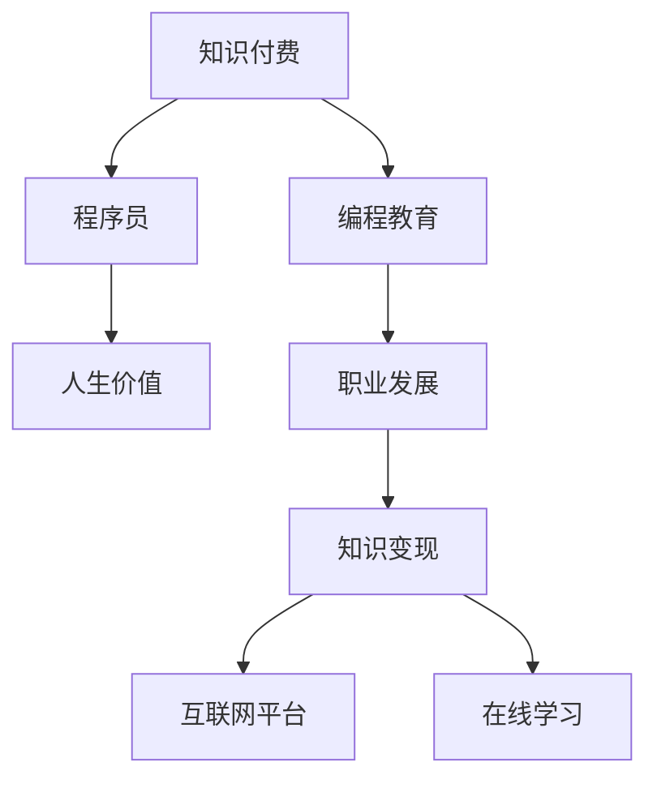

                 

# 知识付费让程序员实现人生价值的途径

> 关键词：知识付费, 程序员, 人生价值, 编程教育, 职业发展, 知识变现, 互联网平台, 在线学习

## 1. 背景介绍

### 1.1 问题由来

随着互联网技术的飞速发展，程序员这个职业变得越来越热门。然而，尽管程序员的工资水平在逐渐提升，他们的工作压力和工作量也在不断增加。此外，技术的不断更新换代，使得程序员需要持续学习新知识，才能在激烈的职场竞争中保持竞争力。在这样的背景下，知识付费逐渐成为程序员实现人生价值的重要途径。

### 1.2 问题核心关键点

知识付费，即通过付费获取知识和技能，已经成为程序员提升自己职业能力和获得额外收入的重要方式。它不仅可以提升程序员的专业技能，还能为其带来稳定、可持续的收入来源，实现个人和职业的双重成长。

知识付费的实质是通过交易机制，使知识变得更加有价值和稀缺。对于程序员来说，学习新技术、获取新知识不再是免费的，而是需要通过付费方式获取。这种交易机制促使程序员更加主动地学习和实践，同时也能获得与自身技能和付出相匹配的回报。

### 1.3 问题研究意义

研究知识付费对程序员的意义，可以从以下几个方面进行探讨：

1. **提升专业技能**：通过知识付费，程序员可以获得最新的编程语言、框架和技术，提升自身在技术栈上的广度和深度。
2. **增加收入来源**：除了主业收入，程序员还可以通过知识付费获取额外的收入，如教授他人编程、开发APP、提供技术咨询服务等。
3. **促进职业发展**：知识付费为程序员提供了更多展示自身技术、积累经验的机会，有助于他们在职业生涯中迈向更高的层次。
4. **增强自我管理能力**：知识付费促使程序员更加自律，管理自己的学习时间和进度，实现高效的学习和成长。
5. **构建职业网络**：通过参与知识付费平台，程序员可以接触到更多志同道合的人，构建自己的人脉网络。

总之，知识付费为程序员提供了提升自身价值、实现人生价值的有效途径。

## 2. 核心概念与联系

### 2.1 核心概念概述

为更好地理解知识付费对程序员的意义，本节将介绍几个密切相关的核心概念：

- **知识付费**：通过付费获取知识和技能，以提高自身专业能力或增加收入。
- **程序员**：从事计算机程序开发、维护和测试的专业人员，常需持续学习新技能。
- **人生价值**：个人在职业、学习、家庭等方面所追求的价值和目标。
- **编程教育**：通过线上或线下方式教授编程知识和技能的学科。
- **职业发展**：个人在职业生涯中的成长和进步，包括技能提升、职位晋升等。
- **知识变现**：将自身所掌握的知识和技能转化为经济收益。
- **互联网平台**：知识付费的载体，如Coursera、Udacity、Codecademy等。
- **在线学习**：通过互联网获取知识的学习方式，如视频课程、在线讲座等。

这些核心概念之间的逻辑关系可以通过以下Mermaid流程图来展示：



这个流程图展示了这个概念系统的核心关系：

1. 知识付费对程序员的促进作用。
2. 通过编程教育提升程序员的职业发展。
3. 职业发展通过知识变现实现个人的人生价值。
4. 知识变现的实现依赖于互联网平台的支持。
5. 互联网平台提供丰富的在线学习资源，帮助程序员不断提升技能。

## 3. 核心算法原理 & 具体操作步骤
### 3.1 算法原理概述

知识付费的算法原理，主要基于以下几个方面：

- **供需平衡**：知识付费平台通过供需双方的价格博弈，确定知识的价值。
- **定价策略**：课程价格应反映其内容的价值和难度，同时考虑市场需求和竞争情况。
- **个性化推荐**：根据用户的学习行为和偏好，推荐适合的课程和学习路径。
- **学习效果评估**：通过考试、项目评审等方式，评估用户的学习效果，提供反馈。

知识付费的整个过程包括以下几个关键步骤：

1. **课程开发**：由专家或专业人士开发课程内容。
2. **定价和上架**：课程发布到知识付费平台，并设定价格。
3. **用户订阅**：用户选择感兴趣的课程并支付费用。
4. **课程学习**：用户在线上或线下学习课程内容。
5. **学习评估**：平台根据用户的学习效果提供反馈，帮助用户提升技能。

### 3.2 算法步骤详解

#### 课程开发

课程开发是知识付费的核心环节之一。它包括：

- **确定课程内容**：根据市场需求，确定课程的主题和目标受众。
- **编写教学材料**：编写详细的课程讲义、案例分析、项目实践等。
- **录制视频课程**：录制高质量的视频课程，确保内容清晰、易于理解。
- **设计互动环节**：设计互动问答、小测验等环节，增强用户参与感。

#### 定价和上架

定价和上架主要包括以下步骤：

- **确定定价策略**：根据课程难度、市场竞争情况和用户需求，设定合理的课程价格。
- **发布课程信息**：将课程信息上传到知识付费平台，包括课程名称、简介、教学大纲等。
- **上架销售**：课程上架后，用户可以订阅购买。

#### 用户订阅

用户订阅主要涉及：

- **选择课程**：用户根据需求选择适合的课程。
- **支付费用**：用户支付课程费用，获得课程观看权限。
- **访问课程**：用户登录知识付费平台，观看视频课程。

#### 课程学习

课程学习包括：

- **在线学习**：用户按照课程进度在线观看视频，完成作业和项目实践。
- **即时反馈**：平台根据用户的学习行为，提供即时反馈和推荐。

#### 学习评估

学习评估包括：

- **测试评估**：通过考试、测验等方式，评估用户的学习效果。
- **项目评审**：通过项目评审，提供具体反馈和改进建议。
- **学习进度**：记录用户的学习进度，帮助其掌握学习节奏。

### 3.3 算法优缺点

知识付费平台的优点在于：

- **高效学习**：通过有组织的课程和专家指导，用户可以高效地学习和提升技能。
- **资源丰富**：知识付费平台汇聚了大量优质的课程和资源，用户可以选择适合自己的学习路径。
- **灵活学习**：用户可以随时随地在线学习，不受时间和地点限制。
- **个性化推荐**：平台通过数据分析，为用户推荐适合的课程和学习路径。

然而，知识付费平台也存在一些缺点：

- **高昂费用**：部分高质量课程价格较高，可能超出部分用户的支付能力。
- **质量参差不齐**：部分课程内容质量不高，可能无法满足用户需求。
- **缺乏互动**：部分课程缺乏互动环节，用户体验可能较差。
- **学习压力**：高强度的学习任务可能导致用户压力过大。

### 3.4 算法应用领域

知识付费已经广泛应用在以下几个领域：

- **编程课程**：提供多种编程语言和技术框架的课程，如Python、Java、Web开发等。
- **职业培训**：提供职业技能的培训课程，如数据分析、项目管理、软件开发等。
- **技能提升**：提供软技能和硬技能的培训课程，如时间管理、沟通技巧、逻辑思维等。
- **项目实战**：提供实战项目的课程，帮助用户提升项目管理和技术实现能力。
- **导师辅导**：提供一对一的导师辅导，帮助用户解决具体问题，提升技术水平。

## 4. 数学模型和公式 & 详细讲解 & 举例说明

### 4.1 数学模型构建

知识付费平台的数学模型构建，可以从以下几个方面进行：

- **需求模型**：通过统计分析，预测用户对不同课程的需求。
- **定价模型**：根据课程的难度、质量和市场竞争情况，设定合理的价格。
- **推荐模型**：基于用户的学习行为和偏好，推荐适合的课程和学习路径。
- **评估模型**：通过学习效果评估，提供用户反馈和改进建议。

### 4.2 公式推导过程

#### 需求模型

需求模型可以通过以下公式推导：

$$
D_{ij} = \alpha + \beta C_j + \gamma T_i + \delta P_j
$$

其中：

- $D_{ij}$：第$i$个用户在第$j$个课程的需求量。
- $\alpha$：截距。
- $\beta$：课程质量系数。
- $C_j$：第$j$个课程的质量。
- $\gamma$：时间影响系数。
- $T_i$：第$i$个用户的学习时间。
- $\delta$：课程价格系数。
- $P_j$：第$j$个课程的价格。

通过上述公式，可以预测用户对不同课程的需求量，帮助平台制定合适的课程价格和推广策略。

#### 定价模型

定价模型可以通过以下公式推导：

$$
P_j = \lambda C_j + \mu T_j + \nu D_j
$$

其中：

- $P_j$：第$j$个课程的价格。
- $\lambda$：课程质量系数。
- $C_j$：第$j$个课程的质量。
- $\mu$：时间影响系数。
- $T_j$：第$j$个课程的更新频率。
- $\nu$：市场需求系数。
- $D_j$：第$j$个课程的需求量。

通过上述公式，可以确定课程的合理价格，确保课程的盈利性和用户满意度。

#### 推荐模型

推荐模型可以通过以下公式推导：

$$
R_{ij} = \sigma \left( \sum_{k=1}^K w_{ik} \phi_{jk} \right)
$$

其中：

- $R_{ij}$：用户$i$对课程$j$的推荐值。
- $\sigma$：激活函数。
- $K$：特征数量。
- $w_{ik}$：第$i$个用户和第$k$个特征的权重。
- $\phi_{jk}$：第$j$个课程和第$k$个特征的权重。

通过上述公式，可以计算出用户对不同课程的推荐值，帮助其选择适合自己的学习路径。

#### 评估模型

评估模型可以通过以下公式推导：

$$
E_{ij} = \eta \sum_{k=1}^K \omega_{ik} \psi_{jk}
$$

其中：

- $E_{ij}$：用户$i$在第$j$个课程中的学习效果。
- $\eta$：评估系数。
- $K$：评估指标数量。
- $\omega_{ik}$：第$i$个用户和第$k$个评估指标的权重。
- $\psi_{jk}$：第$j$个课程和第$k$个评估指标的值。

通过上述公式，可以评估用户的学习效果，提供具体的反馈和改进建议。

### 4.3 案例分析与讲解

**案例：Udacity的编程课程**

Udacity是一家知名的在线学习平台，提供了大量高质量的编程课程。其核心课程包括人工智能、自动驾驶、前端开发等。

- **需求模型**：Udacity通过统计分析，了解用户对不同课程的需求，制定合理的课程价格和推广策略。
- **定价模型**：Udacity根据课程质量和市场需求，设定合理的课程价格。
- **推荐模型**：Udacity利用用户的学习行为和偏好，推荐适合的课程和学习路径。
- **评估模型**：Udacity通过考试、项目评审等方式，评估用户的学习效果，提供具体的反馈和改进建议。

通过上述模型，Udacity能够为用户提供高效、个性化、高质量的编程课程，帮助他们提升技能，实现职业发展。

## 5. 项目实践：代码实例和详细解释说明
### 5.1 开发环境搭建

在进行知识付费项目的开发之前，我们需要准备好开发环境。以下是使用Python进行Flask开发的环境配置流程：

1. 安装Anaconda：从官网下载并安装Anaconda，用于创建独立的Python环境。

2. 创建并激活虚拟环境：
```bash
conda create -n flask-env python=3.8 
conda activate flask-env
```

3. 安装Flask：
```bash
pip install Flask
```

4. 安装Flask-RESTful：
```bash
pip install Flask-RESTful
```

5. 安装Flask-RESTX：
```bash
pip install Flask-RESTX
```

6. 安装Flask-SQLAlchemy：
```bash
pip install Flask-SQLAlchemy
```

7. 安装Flask-WTF：
```bash
pip install Flask-WTF
```

完成上述步骤后，即可在`flask-env`环境中开始知识付费平台的项目开发。

### 5.2 源代码详细实现

下面我们以知识付费平台的用户管理模块为例，给出使用Flask框架开发知识付费平台的代码实现。

首先，定义用户管理模块的路由：

```python
from flask import Flask, jsonify, request
from flask_restful import Resource, Api
from flask_sqlalchemy import SQLAlchemy

app = Flask(__name__)
app.config['SQLALCHEMY_DATABASE_URI'] = 'sqlite:///users.db'
app.config['SQLALCHEMY_TRACK_MODIFICATIONS'] = False
api = Api(app)

db = SQLAlchemy(app)

class User(db.Model):
    id = db.Column(db.Integer, primary_key=True)
    username = db.Column(db.String(64), unique=True, nullable=False)
    password_hash = db.Column(db.String(128), nullable=False)
    courses = db.relationship('Course', backref='users', lazy='dynamic')

class Course(db.Model):
    id = db.Column(db.Integer, primary_key=True)
    name = db.Column(db.String(64), unique=True, nullable=False)
    price = db.Column(db.Float, nullable=False)
    content = db.Column(db.Text, nullable=False)
    users = db.relationship('User', backref='courses', lazy='dynamic')

@app.route('/users', methods=['GET'])
def get_users():
    users = User.query.all()
    return jsonify([{'id': user.id, 'username': user.username, 'courses': [course.name for course in user.courses]} for user in users])

@app.route('/users/<int:user_id>', methods=['GET'])
def get_user(user_id):
    user = User.query.get_or_404(user_id)
    return jsonify({'id': user.id, 'username': user.username, 'courses': [course.name for course in user.courses]})

@app.route('/users', methods=['POST'])
def add_user():
    data = request.json
    user = User(username=data['username'], password_hash=hash_password(data['password']))
    db.session.add(user)
    db.session.commit()
    return jsonify({'id': user.id, 'username': user.username})

@app.route('/users/<int:user_id>', methods=['DELETE'])
def delete_user(user_id):
    user = User.query.get_or_404(user_id)
    db.session.delete(user)
    db.session.commit()
    return jsonify({'id': user.id, 'username': user.username})

if __name__ == '__main__':
    app.run(debug=True)
```

然后，定义用户管理模块的数据库模型：

```python
from werkzeug.security import generate_password_hash, check_password_hash

class User(db.Model):
    id = db.Column(db.Integer, primary_key=True)
    username = db.Column(db.String(64), unique=True, nullable=False)
    password_hash = db.Column(db.String(128), nullable=False)
    courses = db.relationship('Course', backref='users', lazy='dynamic')

class Course(db.Model):
    id = db.Column(db.Integer, primary_key=True)
    name = db.Column(db.String(64), unique=True, nullable=False)
    price = db.Column(db.Float, nullable=False)
    content = db.Column(db.Text, nullable=False)
    users = db.relationship('User', backref='courses', lazy='dynamic')
```

接着，定义用户管理模块的API接口：

```python
from flask_restful import Resource, Api
from flask_sqlalchemy import SQLAlchemy

app = Flask(__name__)
app.config['SQLALCHEMY_DATABASE_URI'] = 'sqlite:///users.db'
app.config['SQLALCHEMY_TRACK_MODIFICATIONS'] = False
api = Api(app)

db = SQLAlchemy(app)

class User(db.Model):
    id = db.Column(db.Integer, primary_key=True)
    username = db.Column(db.String(64), unique=True, nullable=False)
    password_hash = db.Column(db.String(128), nullable=False)
    courses = db.relationship('Course', backref='users', lazy='dynamic')

class Course(db.Model):
    id = db.Column(db.Integer, primary_key=True)
    name = db.Column(db.String(64), unique=True, nullable=False)
    price = db.Column(db.Float, nullable=False)
    content = db.Column(db.Text, nullable=False)
    users = db.relationship('User', backref='courses', lazy='dynamic')

class UserList(Resource):
    def get(self):
        users = User.query.all()
        return {'users': [{'id': user.id, 'username': user.username, 'courses': [course.name for course in user.courses]} for user in users]}

class User(Resource):
    def get(self, user_id):
        user = User.query.get_or_404(user_id)
        return {'user': {'id': user.id, 'username': user.username, 'courses': [course.name for course in user.courses]}}

    def post(self):
        data = request.json
        user = User(username=data['username'], password_hash=generate_password_hash(data['password']))
        db.session.add(user)
        db.session.commit()
        return {'user': {'id': user.id, 'username': user.username}}

    def delete(self, user_id):
        user = User.query.get_or_404(user_id)
        db.session.delete(user)
        db.session.commit()
        return {'user': {'id': user.id, 'username': user.username}}

api.add_resource(UserList, '/users')
api.add_resource(User, '/users/<int:user_id>')

if __name__ == '__main__':
    app.run(debug=True)
```

最后，启动用户管理模块的Flask应用：

```python
if __name__ == '__main__':
    app.run(debug=True)
```

以上就是使用Flask框架开发知识付费平台用户管理模块的完整代码实现。可以看到，通过Flask框架，我们可以简单、高效地实现用户管理模块，为知识付费平台提供基础的用户管理功能。

### 5.3 代码解读与分析

让我们再详细解读一下关键代码的实现细节：

**User类和Course类**：
- 定义了用户和课程的基本属性，包括id、用户名、密码、课程列表等。
- 利用SQLAlchemy进行数据库操作，确保数据安全和一致性。

**UserList类和User类**：
- 定义了用户管理的API接口，包括获取用户列表、获取用户信息、添加用户和删除用户等操作。
- 利用Flask-RESTful实现RESTful风格的API接口，使得API接口更加简洁、易用。

**Flask应用启动**：
- 通过`if __name__ == '__main__':`判断，确保Flask应用在启动时才执行启动代码。
- 利用`app.run(debug=True)`启动Flask应用，调试模式下启用debug功能，方便调试和测试。

可以看到，通过Flask框架，我们可以快速搭建知识付费平台的用户管理模块，为其提供基础的用户管理功能。

当然，实际的知识付费平台开发还需要考虑更多因素，如课程管理、支付系统、认证系统等，但核心的用户管理模块基本与此类似。

## 6. 实际应用场景
### 6.1 智能招聘平台

知识付费平台可以与智能招聘平台结合，为求职者提供更精准的就业推荐服务。智能招聘平台可以根据求职者的简历、技能、经验等信息，推荐匹配的课程和职位，帮助求职者提升技能，增加就业机会。

### 6.2 企业培训平台

知识付费平台可以为企业提供定制化的培训课程，帮助员工提升技能，适应企业发展的需要。企业可以通过知识付费平台，获得高质量的培训资源，降低培训成本，提高员工技能。

### 6.3 在线教育平台

知识付费平台可以为在线教育机构提供更多的课程和资源，帮助其吸引更多的用户，提高市场竞争力。在线教育平台可以利用知识付费平台的用户数据，进行课程优化和个性化推荐，提高用户的学习效果。

### 6.4 未来应用展望

随着知识付费平台的不断发展和完善，未来将在更多领域得到应用，为社会带来变革性影响。

在智慧医疗领域，知识付费平台可以为医生提供最新的医学知识和技能培训，提升其诊断和治疗能力。

在智慧教育领域，知识付费平台可以为学生提供个性化的学习路径和资源，帮助他们更好地掌握知识。

在智慧城市治理中，知识付费平台可以为城市管理者提供专业的技术支持和培训，提升其治理能力和效率。

此外，在企业生产、社会治理、文娱传媒等众多领域，知识付费平台也将不断涌现，为技术创新和社会进步注入新的动力。

## 7. 工具和资源推荐
### 7.1 学习资源推荐

为了帮助开发者系统掌握知识付费技术，这里推荐一些优质的学习资源：

1. Coursera官方文档：提供详细的课程开发和上线流程，适合开发者学习和参考。

2. Udacity官方文档：提供高质量的编程课程开发和上线流程，适合开发者学习和参考。

3. Codecademy官方文档：提供丰富的编程课程和资源，适合开发者学习和参考。

4. 《编程教育技术》书籍：介绍编程教育的原理、技术和实践，适合开发者深入学习和参考。

5. 《在线学习设计》书籍：介绍在线学习的理论、技术和实践，适合开发者深入学习和参考。

通过这些资源的学习实践，相信你一定能够快速掌握知识付费技术，并用于解决实际的NLP问题。

### 7.2 开发工具推荐

高效的开发离不开优秀的工具支持。以下是几款用于知识付费开发常用的工具：

1. Flask：基于Python的开源Web框架，灵活、高效、易于使用，适合快速开发知识付费平台。

2. Django：基于Python的开源Web框架，功能强大、稳定可靠，适合开发复杂的应用系统。

3. RESTful API设计：利用RESTful API设计，提供标准的API接口，方便与第三方系统集成。

4. SQLAlchemy：Python的ORM框架，提供数据库操作的高效接口，适合开发知识付费平台的数据管理模块。

5. Redis：高性能的内存数据库，适合存储和处理知识付费平台的实时数据。

6. Gunicorn：基于Python的Web服务器，支持高并发请求处理，适合知识付费平台的负载均衡。

合理利用这些工具，可以显著提升知识付费平台的开发效率，加快创新迭代的步伐。

### 7.3 相关论文推荐

知识付费技术的发展源于学界的持续研究。以下是几篇奠基性的相关论文，推荐阅读：

1. "A Framework for Online Learning" by Open University：介绍在线学习的理论和技术，适合开发者深入学习和参考。

2. "Educational Data Mining" by e-Duke Institute：介绍教育数据挖掘的技术和方法，适合开发者深入学习和参考。

3. "The Future of Learning" by Pew Research Center：介绍在线学习的发展趋势和未来展望，适合开发者深入学习和参考。

4. "Programming Education" by International Society for Programming Education：介绍编程教育的技术和方法，适合开发者深入学习和参考。

5. "Knowledge Management" by Journal of Knowledge Management：介绍知识管理的理论和技术，适合开发者深入学习和参考。

这些论文代表了大语言模型微调技术的发展脉络。通过学习这些前沿成果，可以帮助研究者把握学科前进方向，激发更多的创新灵感。

## 8. 总结：未来发展趋势与挑战

### 8.1 总结

本文对知识付费对程序员的意义进行了全面系统的介绍。首先阐述了知识付费的实际应用背景和研究意义，明确了知识付费在提升程序员职业能力和增加收入方面的重要作用。其次，从原理到实践，详细讲解了知识付费的数学模型和核心步骤，给出了知识付费项目开发的完整代码实例。同时，本文还广泛探讨了知识付费在多个行业领域的应用前景，展示了知识付费技术的广阔前景。

通过本文的系统梳理，可以看到，知识付费为程序员提供了提升自身价值、实现人生价值的有效途径。未来，随着知识付费平台的不断发展和完善，相信能够更好地促进程序员的职业发展和收入增长，实现个人与社会的双赢。

### 8.2 未来发展趋势

展望未来，知识付费技术将呈现以下几个发展趋势：

1. **平台多样化**：知识付费平台将不断涌现，涵盖更多的教育资源和服务，满足不同用户的需求。
2. **课程内容丰富化**：知识付费平台将提供更多高质量的课程内容，涵盖编程、管理、营销等多个领域。
3. **个性化推荐**：知识付费平台将利用大数据和人工智能技术，为每个用户提供个性化的学习路径和资源。
4. **跨平台协作**：知识付费平台将与其他在线教育平台、智能招聘平台等协同工作，提供一站式学习、就业和职业发展的服务。
5. **国际化扩展**：知识付费平台将面向全球用户，提供多语言支持和国际化服务。

以上趋势凸显了知识付费技术的广阔前景。这些方向的探索发展，必将进一步提升程序员的职业发展和收入增长，为社会带来更大的价值。

### 8.3 面临的挑战

尽管知识付费技术已经取得了显著的成就，但在迈向更加智能化、普适化应用的过程中，它仍面临诸多挑战：

1. **资源瓶颈**：知识付费平台需要大量高质量的教育资源和技术人员，资源瓶颈成为制约平台发展的重要因素。
2. **用户需求多样化**：不同用户的需求和偏好各不相同，知识付费平台需要灵活应对，提供多样化的服务。
3. **付费机制合理化**：如何制定合理的付费机制，确保平台和用户的利益平衡，还需要进一步探索和优化。
4. **技术标准化**：知识付费平台需要制定统一的技术标准，确保数据和服务的互操作性。
5. **版权和隐私问题**：知识付费平台需要重视版权和隐私问题，确保用户权益的保护。

正视知识付费面临的这些挑战，积极应对并寻求突破，将是大语言模型微调技术迈向成熟的必由之路。相信随着学界和产业界的共同努力，这些挑战终将一一被克服，知识付费技术必将为社会带来更大的价值。

### 8.4 研究展望

面对知识付费技术所面临的挑战，未来的研究需要在以下几个方面寻求新的突破：

1. **资源共享和合作**：建立知识共享平台，促进教育资源和技术的合作和交流，提升平台的资源供给能力。
2. **个性化学习**：利用大数据和人工智能技术，为每个用户提供个性化的学习路径和资源，提高学习效果。
3. **多模态学习**：将知识付费平台与其他在线教育平台、智能招聘平台等协同工作，提供多模态的学习和职业发展服务。
4. **社区化建设**：建立知识付费平台的用户社区，增强用户粘性和参与感，提升平台的活跃度和用户满意度。
5. **技术创新**：利用区块链、人工智能等前沿技术，提升知识付费平台的安全性和智能化水平。

这些研究方向的探索，必将引领知识付费技术迈向更高的台阶，为社会带来更多的价值。面向未来，知识付费技术还需要与其他人工智能技术进行更深入的融合，如知识表示、因果推理、强化学习等，多路径协同发力，共同推动知识付费平台的进步。只有勇于创新、敢于突破，才能不断拓展知识付费技术的边界，让技术更好地造福社会。

## 9. 附录：常见问题与解答

**Q1：知识付费是否适合所有程序员？**

A: 知识付费平台适合有学习需求和提升需求的程序员。但并不是所有程序员都需要通过知识付费提升技能。有些程序员已经具备足够的技能和经验，可以通过自学、实践等方式提升。

**Q2：如何选择合适的知识付费平台？**

A: 选择合适的知识付费平台，需要考虑以下几个方面：
1. 课程质量和内容：选择高质量、实用性强、更新及时的课程。
2. 平台口碑和服务：选择用户评价好、服务完善的平台。
3. 费用和性价比：选择适合自己的付费方式，性价比高的平台。
4. 平台支持和社区：选择提供技术支持和社区交流的平台。

**Q3：如何利用知识付费平台提升技能？**

A: 利用知识付费平台提升技能，可以通过以下步骤：
1. 选择适合自己的课程和资源。
2. 制定学习计划，合理分配学习时间。
3. 认真完成课程作业和实践项目。
4. 利用平台提供的反馈和辅导，不断优化学习效果。
5. 积极参与社区交流，与其他用户互动，分享学习经验。

通过以上步骤，可以最大化地利用知识付费平台提升自身技能，实现职业发展。

**Q4：知识付费平台是否影响程序员的自学能力？**

A: 知识付费平台和自学并不冲突。知识付费平台提供的课程和资源，可以帮助程序员更加高效地学习和提升技能。自学和知识付费平台可以相辅相成，共同提升程序员的技能和能力。

通过本文的系统梳理，可以看到，知识付费为程序员提供了提升自身价值、实现人生价值的有效途径。未来，随着知识付费平台的不断发展和完善，相信能够更好地促进程序员的职业发展和收入增长，实现个人与社会的双赢。

