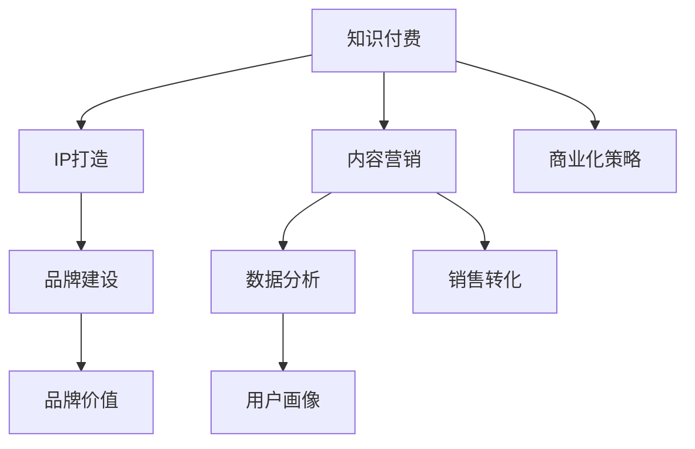

                 

# 知识付费赚钱的关键：打造个人IP与品牌

> 关键词：知识付费, 个人品牌, IP打造, 商业化策略, 内容营销, 平台选择, 数据分析, 用户画像, 销售转化, 品牌价值

## 1. 背景介绍

在数字化经济时代，知识付费成为了一种全新的商业模式，吸引了越来越多的创作者和用户参与。平台如得到、喜马拉雅、知乎等，纷纷推出付费课程、音频、视频等内容，满足了人们对高质量、专业化知识的迫切需求。据艾媒咨询数据，2020年中国知识付费用户规模达4.8亿，同比增长34.6%，市场规模达387亿元。

然而，在知识付费市场迅猛发展的同时，用户获取信息的渠道也愈发多元。那么，如何才能在竞争激烈的知识付费市场中脱颖而出，打造出属于自己的IP品牌？本文将从品牌定位、内容创作、商业模式、营销策略等维度，深入探讨知识付费赚钱的关键。

## 2. 核心概念与联系

### 2.1 核心概念概述

本节将介绍几个与知识付费赚钱相关的主要概念：

- **知识付费（Knowledge-based Subscription）**：用户为获取知识内容而支付的费用，包括付费课程、订阅专栏、咨询服务等。

- **IP（Intellectual Property）**：即知识产权，代表创作者的个人品牌价值和专业能力。IP与品牌紧密关联，共同构成创作者的核心竞争力。

- **品牌（Brand）**：通过独特的标识和传播方式，在用户心中建立认知和信任。优秀的品牌能提升创作者的商业价值和社会影响力。

- **内容营销（Content Marketing）**：通过创造有价值的内容，吸引、教育并最终转化用户。内容是知识付费的核心，其质量与影响力直接决定了用户的留存率和付费率。

- **商业化策略（Monetization Strategy）**：包括流量获取、用户转化、定价模式、平台选择等环节，确保内容变现的最大化。

- **数据分析（Data Analytics）**：利用用户行为数据，分析用户画像，优化内容策略，提高转化效果。

- **用户画像（User Persona）**：创建符合实际用户需求和兴趣的虚拟角色，辅助内容定位和营销策略的制定。

- **销售转化（Sales Conversion）**：通过特定技巧和工具，提升用户从免费到付费的转化率。

- **品牌价值（Brand Value）**：品牌知名度、信任度、美誉度等价值指标，是衡量品牌竞争力的重要标准。

这些概念之间的联系可以通过以下Mermaid流程图来展示：



这个流程图展示了知识付费的各个关键环节及其相互关系：

1. **知识付费**：为品牌IP的打造和内容营销提供基础，是整个商业模式的起点。
2. **IP打造**：核心在于提升个人品牌价值，增强市场竞争力。
3. **品牌建设**：通过独特的标识和传播方式，建立用户认知。
4. **内容营销**：以优质内容吸引用户，奠定用户基础。
5. **商业化策略**：确保内容变现最大化，需兼顾流量获取、用户转化等环节。
6. **数据分析**：利用用户行为数据优化内容策略，提高转化率。
7. **用户画像**：创建符合用户需求的虚拟角色，辅助内容定位。
8. **销售转化**：通过特定技巧提升用户转化率。
9. **品牌价值**：提升品牌的知名度、信任度和美誉度，是最终目标。

## 3. 核心算法原理 & 具体操作步骤

### 3.1 算法原理概述

知识付费的商业成功，依赖于高效的内容创作、精准的用户匹配和有效的销售转化。因此，基于知识付费模型的核心算法可以概括为以下三步：

1. **内容推荐算法**：通过分析用户历史行为数据，推荐用户感兴趣的内容，增加用户停留时间和付费概率。
2. **用户画像算法**：构建用户画像，精准定位用户需求，优化内容策略。
3. **销售转化算法**：通过个性化推荐、折扣优惠等方式，提升用户从免费到付费的转化率。

### 3.2 算法步骤详解

以下是知识付费商业成功的具体算法步骤：

#### 3.2.1 内容推荐算法

**输入**：用户行为数据（浏览记录、搜索历史、评价反馈等）

**步骤**：
1. **数据预处理**：清洗、标准化数据，去除噪声，生成特征向量。
2. **模型训练**：选择合适算法（如协同过滤、深度学习等）训练推荐模型。
3. **实时推荐**：根据用户当前行为数据，实时计算推荐结果。

**输出**：推荐内容列表

#### 3.2.2 用户画像算法

**输入**：用户行为数据、社交网络数据、人口统计信息等

**步骤**：
1. **数据集成**：整合各类数据源，构建统一的用户画像。
2. **特征工程**：提取有意义的特征，如兴趣、偏好、行为等。
3. **模型训练**：训练用户画像模型（如聚类算法、分类算法等）。

**输出**：用户画像描述

#### 3.2.3 销售转化算法

**输入**：用户画像、推荐内容、促销信息等

**步骤**：
1. **个性化推荐**：根据用户画像推荐个性化的内容或产品。
2. **折扣优惠**：设计合理的折扣和优惠策略，激励用户付费。
3. **用户反馈**：收集用户反馈，优化推荐和转化策略。

**输出**：用户转化率

### 3.3 算法优缺点

知识付费推荐算法的优点包括：
1. 提高用户留存率和付费率，增加平台收入。
2. 个性化推荐提升用户满意度，增加品牌忠诚度。
3. 降低内容创作的试错成本，提高创作效率。

缺点则包括：
1. 对数据的依赖性高，需确保数据质量。
2. 模型复杂度增加，对算力和计算资源要求高。
3. 需要不断优化算法，适应用户行为的变化。

### 3.4 算法应用领域

知识付费推荐算法在以下领域有广泛应用：
- **在线教育平台**：如得到、新东方等，通过个性化推荐提高课程购买率。
- **知识分享社区**：如知乎、豆瓣等，增加高质量内容的曝光率。
- **音频和视频平台**：如喜马拉雅、B站等，提升用户对付费内容的消费意愿。
- **健康管理应用**：如医典、好大夫在线等，推荐个性化健康方案，提高用户粘性。

## 4. 数学模型和公式 & 详细讲解 & 举例说明

### 4.1 数学模型构建

假设用户数量为 $N$，内容数量为 $M$。用户对内容的评分矩阵为 $R$，$R_{ij}$ 表示用户 $i$ 对内容 $j$ 的评分（0-5分）。

目标函数为最大化用户满意度，即最大化用户评分的期望值。设用户 $i$ 的兴趣向量为 $u_i$，内容 $j$ 的特征向量为 $v_j$，推荐算法通过计算 $u_i$ 和 $v_j$ 的相似度，预测用户对内容的评分，模型为：

$$
R_{ij} = u_i \times v_j
$$

其中，$\times$ 表示向量内积。

### 4.2 公式推导过程

根据目标函数，最大化期望评分：

$$
\max_{u_i,v_j} \mathbb{E}[R_{ij}]
$$

将目标函数拆分为两部分：

$$
\max_{u_i} \min_{v_j} \mathbb{E}[R_{ij}]
$$

通过最大化用户兴趣向量 $u_i$，并最小化内容特征向量 $v_j$，得到最优推荐。

利用协同过滤算法，根据用户历史评分数据 $R_{ij}$ 进行推荐，算法步骤如下：

1. 用户 $i$ 对内容 $j$ 评分 $R_{ij}$
2. 计算用户 $i$ 的兴趣向量 $u_i$
3. 计算内容 $j$ 的特征向量 $v_j$
4. 计算用户 $i$ 对内容 $j$ 的预测评分 $R_{ij}^{\hat{}}
5. 对所有内容 $j$ 排序，推荐评分最高的前 $k$ 个内容

### 4.3 案例分析与讲解

以得到平台为例，其内容推荐算法主要基于协同过滤和深度学习。在用户行为数据（浏览记录、搜索历史、评价反馈等）的基础上，构建用户画像和内容画像，通过矩阵分解算法求解用户兴趣向量 $u_i$ 和内容特征向量 $v_j$，最终得到推荐结果。

深度学习算法使用序列推荐模型（如RNN、GRU、LSTM等），通过分析用户的历史行为序列，预测其对新内容的评分和购买概率。

## 5. 项目实践：代码实例和详细解释说明

### 5.1 开发环境搭建

进行知识付费项目开发，需要搭建Python环境，安装必要的库和工具。具体步骤如下：

1. 安装Anaconda：从官网下载并安装Anaconda，用于创建独立的Python环境。
2. 创建并激活虚拟环境：
```bash
conda create -n knowledgepy-env python=3.8 
conda activate knowledgepy-env
```
3. 安装相关库：
```bash
pip install pandas numpy scikit-learn matplotlib seaborn scipy jupyter notebook
```

完成上述步骤后，即可在`knowledgepy-env`环境中开始项目开发。

### 5.2 源代码详细实现

以下是一个使用Python实现协同过滤推荐算法的示例代码，详细解释说明如下：

```python
import pandas as pd
import numpy as np
from scipy.sparse import csr_matrix
from scipy.sparse.linalg import svds

# 读取用户评分数据
data = pd.read_csv('ratings.csv', sep=',')
user_ids = data['user_id'].values
item_ids = data['item_id'].values
ratings = data['rating'].values

# 构建用户-内容评分矩阵
R = csr_matrix((ratings, (user_ids, item_ids)), shape=(len(user_ids), len(item_ids)))

# 使用奇异值分解(SVD)求解用户兴趣向量
U, S, V = svds(R, k=10)

# 计算内容特征向量
Vt = V.T

# 构建推荐矩阵
recommend_matrix = U * Vt

# 计算用户对内容的预测评分
recommend_matrix = recommend_matrix.todense()
recommend_matrix = np.dot(recommend_matrix, np.diag(S))

# 排序并推荐内容
top_k = np.argsort(recommend_matrix, axis=1)[-10:]
print(top_k)
```

此代码首先从CSV文件中读取用户评分数据，构建用户-内容评分矩阵 $R$。然后，使用奇异值分解求解用户兴趣向量 $U$ 和内容特征向量 $V$，计算推荐矩阵。最后，通过排序并推荐评分最高的前10个内容。

### 5.3 代码解读与分析

**用户评分数据**：
- 用户ID：unique用户标识符
- 内容ID：unique内容标识符
- 评分：用户对内容的评分，0-5分

**评分矩阵构建**：
- 使用稀疏矩阵 $R$ 存储用户评分数据，节省存储空间和计算资源。

**奇异值分解**：
- 利用SVD分解评分矩阵 $R$，求解用户兴趣向量 $U$ 和内容特征向量 $V$，并计算权重矩阵 $S$。

**推荐矩阵计算**：
- 通过矩阵乘法和向量点积计算推荐矩阵。

**排序并推荐内容**：
- 通过排序选择评分最高的内容，生成推荐列表。

### 5.4 运行结果展示

运行代码后，输出前10个推荐内容ID，展示了用户可能感兴趣的Top10个内容。

## 6. 实际应用场景

### 6.1 在线教育平台

在线教育平台如得到、新东方等，利用推荐算法为用户提供个性化学习路径，提高课程购买率。平台通过分析用户历史学习记录、评价反馈等数据，推荐适合用户水平和兴趣的课程。通过个性化推荐和折扣优惠，平台可以大幅提升用户转化率。

### 6.2 知识分享社区

知识分享社区如知乎、豆瓣等，利用推荐算法增加高质量内容的曝光率，吸引更多用户关注和参与。通过分析用户行为数据，推荐与用户兴趣相关的问答、文章、视频等内容，提升用户粘性和社区活跃度。

### 6.3 音频和视频平台

音频和视频平台如喜马拉雅、B站等，利用推荐算法提高用户对付费内容的消费意愿。平台通过分析用户观看历史、收藏记录等数据，推荐个性化音频和视频内容，提升用户付费率和满意度。

### 6.4 健康管理应用

健康管理应用如医典、好大夫在线等，利用推荐算法推荐个性化健康方案，提高用户粘性。通过分析用户健康数据、生活习惯等，推荐合适的健康建议、运动方案、营养计划等，提升用户健康管理效果。

## 7. 工具和资源推荐

### 7.1 学习资源推荐

为了帮助开发者掌握知识付费推荐算法，推荐以下学习资源：

1. **Coursera《推荐系统》课程**：由斯坦福大学开设的推荐系统课程，详细讲解协同过滤、深度学习等算法。
2. **Kaggle推荐系统竞赛**：参与Kaggle竞赛，实践推荐算法，提升实战能力。
3. **《推荐系统实战》书籍**：详细介绍了推荐算法的实现方法和代码示例。
4. **PyTorch官方文档**：介绍如何使用PyTorch实现推荐算法。

### 7.2 开发工具推荐

进行知识付费推荐系统开发，需要选择合适的开发工具。以下是几款推荐的工具：

1. **PyTorch**：基于Python的开源深度学习框架，灵活、易用。
2. **TensorFlow**：由Google主导的深度学习框架，性能优秀，支持大规模工程应用。
3. **Scikit-learn**：用于数据预处理、特征工程、模型训练等环节。
4. **Pandas**：用于数据处理和分析。
5. **Jupyter Notebook**：用于交互式编程和可视化。

### 7.3 相关论文推荐

知识付费推荐算法的研究涉及多个领域，以下是几篇具有代表性的论文：

1. **《基于协同过滤的电影推荐算法》**：介绍协同过滤算法的原理和实现方法。
2. **《深度学习推荐系统：架构与算法》**：全面介绍深度学习推荐系统的架构和算法。
3. **《用户画像与推荐系统》**：讨论用户画像在推荐系统中的应用，提升推荐效果。
4. **《基于序列推荐模型的知识付费推荐系统》**：介绍序列推荐模型在知识付费推荐中的应用。

## 8. 总结：未来发展趋势与挑战

### 8.1 研究成果总结

本文从品牌定位、内容创作、商业模式、营销策略等维度，系统介绍了知识付费的关键技术和方法。通过内容推荐算法、用户画像算法和销售转化算法，提升用户满意度和转化率，增加平台收入。具体案例包括在线教育、知识分享、音频视频平台和健康管理应用等。

### 8.2 未来发展趋势

知识付费的商业成功，将呈现以下发展趋势：

1. **算法模型的不断优化**：深度学习和大数据技术的应用，将推动推荐算法更加精准和高效。
2. **多模态数据的融合**：结合文本、图像、语音等多模态数据，提升内容推荐效果。
3. **社交网络的应用**：利用社交网络数据，增加内容的多样性和个性化推荐。
4. **用户反馈的实时分析**：通过实时收集用户反馈，动态调整推荐策略，提升用户满意度和转化率。
5. **个性化定制服务**：结合用户画像和内容画像，提供个性化的定制服务，增加用户粘性。
6. **商业模式的创新**：探索新的商业模式，如内容订阅、知识打赏、直播互动等，增加用户付费意愿。

### 8.3 面临的挑战

知识付费领域仍面临诸多挑战：

1. **数据隐私问题**：用户数据的隐私保护是当前亟待解决的问题，需要确保用户数据的安全性和隐私性。
2. **模型泛化能力不足**：现有算法在应对长尾数据和复杂用户需求时，仍需提高模型的泛化能力。
3. **算法模型的可解释性**：推荐算法的黑箱特性，需要进一步提高其可解释性和可理解性。
4. **用户粘性难以保持**：如何持续吸引和保持用户，防止用户流失，是知识付费平台的重要课题。
5. **内容版权问题**：如何平衡内容的版权保护和共享，避免侵权和抄袭，需要法律和技术的双重保障。

### 8.4 研究展望

面对知识付费领域的挑战，未来的研究方向可以从以下几个方面突破：

1. **提升数据隐私保护技术**：开发更加安全和透明的隐私保护技术，确保用户数据的隐私安全。
2. **增强算法模型的泛化能力**：探索新算法模型和技术，提高算法的泛化能力和鲁棒性。
3. **提高模型的可解释性**：结合符号推理和因果分析，提高算法的可解释性和可理解性。
4. **优化用户粘性保持策略**：利用游戏化设计、个性化推荐、社交互动等方式，提升用户粘性。
5. **制定完善的版权保护机制**：结合法律和技术手段，制定完善的版权保护机制，确保内容共享和传播的公平合理。

综上所述，知识付费领域的发展前景广阔，但同时也面临诸多挑战。只有通过不断的技术创新和实践探索，才能在竞争激烈的市场中脱颖而出，实现商业成功。

## 9. 附录：常见问题与解答

**Q1：知识付费与免费内容相比，有何优势？**

A: 知识付费的优势在于以下几个方面：
1. 内容质量高：付费内容通常经过专业审核和编辑，质量更有保障。
2. 服务个性化：付费内容根据用户需求量身定制，更具针对性。
3. 无广告干扰：付费内容无广告，用户体验更佳。
4. 高效便捷：付费内容整合在平台上，随时可访问，节省时间。

**Q2：如何设计内容营销策略？**

A: 内容营销策略的设计主要包括以下几个步骤：
1. 明确目标用户：分析用户画像，了解用户需求和兴趣。
2. 选择合适平台：选择与目标用户群体匹配的平台，如得到、知乎、B站等。
3. 制定内容策略：制定内容定位和主题，如视频讲解、文字教程、直播互动等。
4. 推广渠道选择：选择有效的推广渠道，如社交媒体、SEO、广告投放等。
5. 效果监测优化：实时监测推广效果，优化内容和策略，提升转化率。

**Q3：如何衡量知识付费的商业成功？**

A: 衡量知识付费商业成功的主要指标包括：
1. 用户留存率：衡量用户对平台的长期粘性。
2. 用户转化率：衡量用户从免费到付费的转化效果。
3. 收入增长率：衡量平台的整体收入增长情况。
4. 用户满意度：通过用户反馈和评分，衡量用户对内容的满意程度。
5. 内容曝光率：衡量内容被用户访问和传播的频率。

**Q4：如何平衡内容版权和用户分享？**

A: 平衡内容版权和用户分享的策略主要包括以下几点：
1. 明确版权归属：在内容中明确版权归属，确保内容所有者的权益。
2. 合理使用授权：在符合法律和版权规定的前提下，允许用户合理使用内容。
3. 引导用户分享：通过社交分享功能，引导用户分享有价值的内容，扩大内容影响力。
4. 打击侵权行为：利用技术手段，如水印、IP核验等，打击和防范侵权行为。
5. 建立激励机制：通过打赏、奖励等方式，激励用户分享优质内容。

综上所述，知识付费平台要想成功，必须在品牌定位、内容创作、商业化策略、营销策略等方面进行全面优化，同时关注数据隐私、算法模型、用户粘性保持、版权保护等挑战，不断创新和改进，才能在竞争激烈的市场中脱颖而出。

