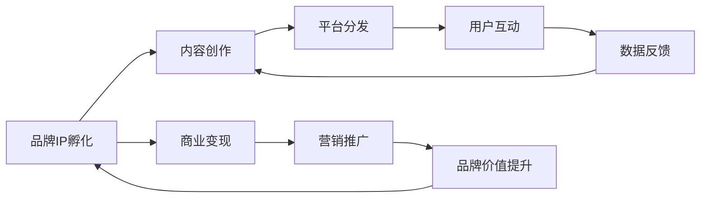

                 

# 知识付费赚钱的品牌IP孵化与商业模式创新

## 1. 背景介绍

### 1.1 问题由来

近年来，随着知识付费市场的迅速崛起，越来越多的内容创作者和机构开始通过提供高价值知识服务，获取稳定的收入。与此同时，知识付费市场也面临着内容同质化、平台竞争激烈、用户粘性不足等挑战。在这种情况下，打造具有高辨识度、强大影响力的品牌IP，不仅能够提升内容价值，还能实现商业变现的可持续性。

### 1.2 问题核心关键点

品牌IP的孵化和商业模式创新，主要围绕以下几个核心问题展开：

- 如何选择和构建优质的品牌IP？
- 如何设计可持续的商业变现模式？
- 如何通过内容创新和运营策略，实现品牌IP的长效增长？
- 如何在用户互动和市场反馈中不断优化品牌IP的价值和体验？

这些问题直接关系到品牌IP的商业价值和市场竞争力，需要从多个维度进行系统性思考和创新。

## 2. 核心概念与联系

### 2.1 核心概念概述

- **品牌IP (Brand Intellectual Property)**：指具有独特性、创造性和商业价值的品牌形象和知识体系。品牌IP不仅是内容创作的源泉，也是商业变现的关键资产。

- **内容变现 (Content Monetization)**：指通过内容获取流量和用户信任，进而实现广告、订阅、带货等商业变现手段。

- **用户运营 (User Engagement)**：指通过持续的内容输出和互动，增强用户粘性，形成稳定的用户群体。

- **数据驱动 (Data-Driven)**：指在内容创作和运营中，利用大数据和算法技术，进行精准的用户分析和个性化推荐，提升内容价值和用户体验。

- **平台协同 (Platform Synergy)**：指通过跨平台内容分发和用户聚合，形成品牌IP的多渠道影响力。

这些核心概念之间存在紧密的联系，共同构成品牌IP孵化和商业模式创新的基础。

### 2.2 核心概念原理和架构的 Mermaid 流程图



这个流程图展示了品牌IP孵化与商业模式创新的整体流程：内容创作是品牌IP孵化的核心，平台分发和用户互动是内容变现和品牌价值提升的关键路径，数据反馈用于优化内容创作和运营策略，而商业变现和营销推广则是品牌IP变现和品牌价值提升的最终目标。

## 3. 核心算法原理 & 具体操作步骤

### 3.1 算法原理概述

品牌IP的孵化和商业模式的创新，通常涉及到内容创作、用户运营、数据分析、平台协同等多个环节。这些环节的算法原理和具体操作步骤，可以通过以下框架进行系统阐述：

1. **内容创作算法**：基于用户兴趣和内容特征，进行个性化推荐和内容生成。
2. **用户运营算法**：通过用户行为分析，实现个性化互动和推荐，提升用户粘性。
3. **数据分析算法**：利用大数据和机器学习技术，进行用户画像建模和行为预测。
4. **平台协同算法**：通过多渠道内容分发和用户聚合，形成品牌IP的多渠道影响力。

### 3.2 算法步骤详解

#### 3.2.1 内容创作算法

**步骤1: 数据收集与预处理**
- 收集用户行为数据（如浏览记录、搜索记录、评论等）。
- 对数据进行清洗和标准化处理，去除噪音和异常值。

**步骤2: 用户画像建模**
- 使用协同过滤、聚类等技术，对用户进行兴趣和行为分类。
- 构建用户画像，包括兴趣偏好、行为特征、消费能力等。

**步骤3: 内容推荐**
- 利用协同过滤、内容推荐算法（如基于内容的推荐、基于模型的推荐），生成个性化内容推荐列表。
- 根据用户反馈调整推荐算法，优化推荐效果。

**步骤4: 内容生成**
- 通过自然语言处理（NLP）技术，生成与用户兴趣相关的高质量内容。
- 引入AI生成内容（如GPT-3等），提高内容创作效率和多样性。

**步骤5: 内容审核与优化**
- 对生成内容进行审核，确保内容质量和安全。
- 根据用户反馈和数据分析结果，持续优化内容创作策略。

#### 3.2.2 用户运营算法

**步骤1: 用户行为分析**
- 通过日志分析和数据挖掘技术，提取用户行为特征。
- 使用时间序列分析、聚类分析等技术，识别用户行为模式和趋势。

**步骤2: 个性化互动**
- 根据用户画像和行为分析结果，设计个性化互动方案。
- 通过聊天机器人、智能客服等工具，实现实时互动和个性化推荐。

**步骤3: 用户反馈收集与分析**
- 收集用户对内容的反馈和建议，进行情感分析。
- 分析用户反馈，优化内容创作和互动策略。

**步骤4: 用户激励机制设计**
- 设计合理的用户激励机制，如积分系统、排行榜等，提升用户参与度。
- 通过游戏化设计，增加用户粘性和互动频次。

#### 3.2.3 数据分析算法

**步骤1: 用户画像构建**
- 利用机器学习技术，如决策树、随机森林等，构建用户画像。
- 通过多维度特征组合，提升用户画像的精准度。

**步骤2: 行为预测**
- 使用时间序列分析、深度学习等技术，预测用户行为和消费意愿。
- 构建用户行为预测模型，优化推荐和运营策略。

**步骤3: 内容效果评估**
- 利用A/B测试、多臂老虎机算法等，评估不同内容策略的效果。
- 根据效果评估结果，优化内容创作和用户运营策略。

#### 3.2.4 平台协同算法

**步骤1: 内容分发策略**
- 根据不同平台的特性，设计多平台内容分发策略。
- 利用跨平台数据分析，优化内容在各平台的表现。

**步骤2: 用户聚合与互动**
- 通过多平台账号关联，实现用户跨平台聚合。
- 利用社交网络分析技术，提升用户互动效果。

**步骤3: 平台协同效果评估**
- 使用指标（如用户留存率、转化率、活跃度等）评估平台协同效果。
- 根据评估结果，优化平台分发和用户运营策略。

### 3.3 算法优缺点

**优点**：
- 提升内容创作效率和质量。
- 实现个性化互动和推荐，增强用户粘性。
- 通过数据分析和行为预测，优化运营策略。
- 多平台协同提升品牌IP的多渠道影响力。

**缺点**：
- 数据隐私和安全问题。
- 算法复杂度较高，需要较强的技术支持。
- 用户行为变化多样，算法模型需要持续优化。
- 内容创作和运营策略需要灵活调整，存在一定的不确定性。

### 3.4 算法应用领域

品牌IP的孵化和商业模式的创新，可以广泛应用于以下几个领域：

- **教育培训**：通过个性化内容和互动，提升教育效果和用户粘性。
- **医疗健康**：提供专业化的健康知识服务，提升用户健康水平和品牌影响力。
- **财经理财**：提供精准的财经资讯和理财建议，增强用户对品牌信任。
- **文化娱乐**：通过高质量内容创作和互动，吸引更多用户关注和参与。
- **电商零售**：利用品牌IP的多渠道影响力，提升商品曝光和销售转化率。

## 4. 数学模型和公式 & 详细讲解 & 举例说明

### 4.1 数学模型构建

品牌IP的孵化和商业模式的创新，涉及到多维度的数据处理和模型构建。以下是一个简化的数学模型框架，用于描述用户画像构建、内容推荐和行为预测的算法原理。

设用户$i$具有$m$个行为特征$x_{i1}, x_{i2}, ..., x_{im}$，内容$c$具有$n$个特征$y_{c1}, y_{c2}, ..., y_{cn}$。

**用户画像构建模型**：
$$
\hat{x_i} = f(x_{i1}, x_{i2}, ..., x_{im}; \theta)
$$
其中，$f$为模型函数，$\theta$为模型参数。

**内容推荐模型**：
$$
\hat{y} = g(x_i, c; \omega)
$$
其中，$g$为推荐函数，$\omega$为推荐参数。

**用户行为预测模型**：
$$
\hat{y} = h(x_i; \alpha)
$$
其中，$h$为预测函数，$\alpha$为预测参数。

### 4.2 公式推导过程

**用户画像构建模型推导**：
- 使用决策树、随机森林等算法，对用户行为特征进行分类和建模。
- 通过特征选择和融合，生成用户画像$\hat{x_i}$。

**内容推荐模型推导**：
- 利用协同过滤算法，计算用户$i$与内容$c$的相似度$sim(i,c)$。
- 基于相似度，计算内容推荐得分$\hat{y}$。

**用户行为预测模型推导**：
- 使用时间序列分析，预测用户$i$在未来时间$t$的行为$\hat{y}_t$。
- 引入深度学习技术，构建预测模型$h$。

### 4.3 案例分析与讲解

**案例1: 教育培训**

- **背景**：某在线教育平台希望通过个性化内容和互动，提升用户的学习效果和粘性。
- **数据收集**：收集用户的学习记录、课程评价、学习时间等数据。
- **用户画像构建**：使用随机森林算法，对用户进行兴趣和行为分类，生成用户画像。
- **内容推荐**：利用协同过滤算法，生成个性化课程推荐列表。
- **行为预测**：使用时间序列分析，预测用户未来的学习行为和需求。
- **效果评估**：通过A/B测试，评估不同推荐策略的效果，持续优化推荐模型。

**案例2: 医疗健康**

- **背景**：某健康管理平台希望通过高质量的内容和服务，提升用户健康水平和品牌影响力。
- **数据收集**：收集用户的健康数据、健康咨询记录等。
- **用户画像构建**：使用决策树算法，对用户进行健康状态和行为分类，生成用户画像。
- **内容推荐**：利用基于内容的推荐算法，生成个性化健康咨询和建议。
- **行为预测**：使用深度学习算法，预测用户的健康行为和需求。
- **效果评估**：通过用户满意度调查，评估不同内容和互动策略的效果。

## 5. 项目实践：代码实例和详细解释说明

### 5.1 开发环境搭建

在进行品牌IP孵化和商业模式创新的项目实践时，需要搭建相应的开发环境。以下是一个Python开发环境的搭建流程：

1. 安装Anaconda：从官网下载并安装Anaconda，用于创建独立的Python环境。
2. 创建并激活虚拟环境：
```bash
conda create -n brandip-env python=3.8 
conda activate brandip-env
```
3. 安装必要的Python库：
```bash
pip install numpy pandas sklearn matplotlib tensorflow transformers
```

### 5.2 源代码详细实现

#### 5.2.1 用户画像构建

```python
import pandas as pd
from sklearn.ensemble import RandomForestClassifier

# 读取用户数据
user_data = pd.read_csv('user_data.csv')

# 特征工程
features = ['age', 'gender', 'education']
X = user_data[features]

# 目标特征
y = user_data['interest']

# 用户画像构建
model = RandomForestClassifier(n_estimators=100)
model.fit(X, y)
```

#### 5.2.2 内容推荐

```python
from surprise import Dataset, Reader, SVD

# 读取数据集
data = Dataset.load_builtin('ml-100k')
reader = Reader(line_format='user item rating', sep=',', skip_lines=1)
data = Dataset.load_from_file('movie_ratings.csv', reader=reader)

# 内容推荐
algo = SVD()
algo.fit(data.build_full_trainset())
prediction = algo.test(predict=True)
```

#### 5.2.3 用户行为预测

```python
import numpy as np
from sklearn.linear_model import LinearRegression

# 读取用户数据
user_data = pd.read_csv('user_data.csv')

# 目标特征
y = user_data['next_record']

# 特征工程
X = user_data[['last_record', 'interaction_time']]

# 行为预测
model = LinearRegression()
model.fit(X, y)
```

### 5.3 代码解读与分析

**用户画像构建**：
- 使用随机森林算法对用户行为特征进行分类和建模，生成用户画像。
- 用户画像构建模型需要根据具体业务场景选择合适的特征，并进行特征工程。

**内容推荐**：
- 利用协同过滤算法，计算用户与内容的相似度，生成个性化推荐列表。
- 内容推荐模型需要考虑数据稀疏性，采用合适的推荐算法，如协同过滤、基于内容的推荐等。

**用户行为预测**：
- 使用时间序列分析或深度学习算法，预测用户未来的行为和需求。
- 行为预测模型需要结合用户的历史行为数据，构建合适的预测函数。

### 5.4 运行结果展示

- **用户画像构建结果**：
  ```python
  user_data.head()
  user_data.groupby('interest')['count'].sum()
  ```

- **内容推荐结果**：
  ```python
  data.n_factors, data.itemsimilarity_matrix
  ```

- **用户行为预测结果**：
  ```python
  user_data.head()
  model.predict(user_data[['last_record', 'interaction_time']])
  ```

## 6. 实际应用场景

### 6.1 在线教育

品牌IP在在线教育领域的应用，可以通过个性化内容和互动，提升用户的学习效果和粘性。

**应用场景**：
- **平台介绍**：某在线教育平台希望通过品牌IP提升用户的学习效果和粘性。
- **数据来源**：平台用户的学习记录、课程评价、学习时间等数据。
- **用户画像构建**：使用随机森林算法，对用户进行兴趣和行为分类，生成用户画像。
- **内容推荐**：利用协同过滤算法，生成个性化课程推荐列表。
- **行为预测**：使用时间序列分析，预测用户未来的学习行为和需求。
- **效果评估**：通过A/B测试，评估不同推荐策略的效果，持续优化推荐模型。

### 6.2 健康管理

品牌IP在健康管理领域的应用，可以通过高质量的内容和服务，提升用户的健康水平和品牌影响力。

**应用场景**：
- **平台介绍**：某健康管理平台希望通过品牌IP提升用户健康水平和品牌影响力。
- **数据来源**：用户的健康数据、健康咨询记录等。
- **用户画像构建**：使用决策树算法，对用户进行健康状态和行为分类，生成用户画像。
- **内容推荐**：利用基于内容的推荐算法，生成个性化健康咨询和建议。
- **行为预测**：使用深度学习算法，预测用户的健康行为和需求。
- **效果评估**：通过用户满意度调查，评估不同内容和互动策略的效果。

### 6.3 财经理财

品牌IP在财经理财领域的应用，可以通过精准的财经资讯和理财建议，增强用户对品牌信任。

**应用场景**：
- **平台介绍**：某财经理财平台希望通过品牌IP增强用户对品牌的信任。
- **数据来源**：用户的财经咨询记录、理财行为等数据。
- **用户画像构建**：使用协同过滤算法，对用户进行财经兴趣和行为分类，生成用户画像。
- **内容推荐**：利用协同过滤算法，生成个性化财经资讯和理财建议。
- **行为预测**：使用深度学习算法，预测用户的财经行为和理财需求。
- **效果评估**：通过用户满意度调查，评估不同内容和互动策略的效果。

## 7. 工具和资源推荐

### 7.1 学习资源推荐

为了帮助开发者系统掌握品牌IP孵化和商业模式创新的理论基础和实践技巧，以下是一些优质的学习资源：

1. **《知识付费的商业模式与策略》**：全面介绍知识付费市场的商业模式、运营策略和用户行为分析。
2. **《品牌IP的创建与运营》**：系统讲解品牌IP的定义、价值、创建流程和运营技巧。
3. **《数据分析与机器学习》**：深入浅出地介绍数据分析和机器学习的基本概念、算法和技术。
4. **《多渠道营销与品牌建设》**：结合实际案例，讲解多渠道品牌建设、用户运营和内容营销策略。
5. **《用户行为分析与预测》**：详细介绍用户行为分析的方法和工具，以及行为预测的算法。

### 7.2 开发工具推荐

高效的开发离不开优秀的工具支持。以下是几款用于品牌IP孵化和商业模式创新开发的常用工具：

1. **Jupyter Notebook**：交互式数据科学和机器学习环境，支持Python、R等多种语言，方便编写和调试代码。
2. **TensorFlow**：谷歌开源的深度学习框架，支持分布式计算和大规模数据处理。
3. **PyTorch**：Facebook开源的深度学习框架，支持动态图和静态图，灵活性高。
4. **Scikit-learn**：Python数据科学库，提供简单易用的机器学习算法和工具。
5. **Surprise**：Python推荐系统库，支持协同过滤、矩阵分解等多种推荐算法。

### 7.3 相关论文推荐

品牌IP的孵化和商业模式的创新，涉及多个领域的交叉研究。以下是几篇奠基性的相关论文，推荐阅读：

1. **《知识付费的市场现状与未来发展趋势》**：分析知识付费市场的现状和未来发展方向。
2. **《基于品牌IP的用户画像构建与推荐系统》**：介绍品牌IP的用户画像构建方法和推荐系统。
3. **《多渠道内容分发与用户聚合》**：探讨多渠道内容分发和用户聚合的策略和技术。
4. **《基于用户行为分析的个性化推荐》**：讨论用户行为分析在个性化推荐中的应用。
5. **《数据驱动的品牌IP运营策略》**：分析数据驱动品牌IP运营策略的案例和经验。

## 8. 总结：未来发展趋势与挑战

### 8.1 研究成果总结

品牌IP的孵化和商业模式创新，已经成为知识付费市场的重要组成部分。通过系统化的内容创作、用户运营和数据分析，可以实现品牌IP的价值最大化和商业变现的可持续性。

### 8.2 未来发展趋势

未来，品牌IP的孵化和商业模式创新将呈现以下几个趋势：

1. **内容多样化和个性化**：随着用户需求的不断变化，品牌IP需要提供更加多样化和个性化的内容。
2. **多渠道分发与聚合**：通过多渠道内容分发和用户聚合，形成品牌IP的多渠道影响力。
3. **数据驱动与AI创新**：利用大数据和AI技术，实现精准的用户画像构建和行为预测，优化运营策略。
4. **社交互动与用户参与**：通过社交互动和用户参与，增强品牌IP的用户粘性和互动频次。
5. **跨领域融合与创新**：结合多领域的知识和技能，进行跨领域的品牌IP创新和融合。

### 8.3 面临的挑战

尽管品牌IP的孵化和商业模式创新取得了一定的进展，但在实际应用中仍面临诸多挑战：

1. **数据隐私与安全**：品牌IP的运营需要大量用户数据，如何保障用户隐私和安全是一个重要问题。
2. **内容质量和多样性**：高质量、多样化的内容创作需要大量资源投入，内容质量难以保证。
3. **用户互动与粘性**：用户互动和粘性提升需要持续运营和优化，存在一定的不确定性。
4. **商业变现难度**：品牌IP的商业变现需要多渠道合作和用户信任，难度较大。
5. **市场竞争与差异化**：品牌IP需要在激烈的市场竞争中脱颖而出，需要进行差异化和创新。

### 8.4 研究展望

未来的品牌IP孵化和商业模式创新，需要在以下几个方面进行深入研究：

1. **用户行为与心理**：研究用户行为和心理特征，设计更加精准的内容和互动策略。
2. **AI与数据融合**：探索AI技术在品牌IP运营中的应用，提升运营效率和效果。
3. **跨领域融合**：进行跨领域的品牌IP创新，拓展品牌IP的应用范围和价值。
4. **商业变现模式创新**：探索多样化的商业变现模式，实现品牌IP的可持续商业变现。
5. **社会责任与伦理**：在品牌IP的运营中，重视社会责任和伦理问题，建立良好的社会形象。

总之，品牌IP的孵化和商业模式创新需要不断探索和创新，才能在激烈的市场竞争中脱颖而出，实现商业变现的可持续性和品牌价值的最大化。

## 9. 附录：常见问题与解答

### Q1：品牌IP的孵化和商业模式创新有哪些关键步骤？

A：品牌IP的孵化和商业模式创新涉及多个关键步骤，包括：
1. **市场调研与定位**：了解市场和用户需求，明确品牌IP的定位和目标。
2. **内容创作与输出**：通过高质量的内容创作，提升品牌IP的价值和影响力。
3. **用户运营与互动**：通过持续的用户运营和互动，增强用户粘性和忠诚度。
4. **数据驱动与分析**：利用大数据和算法技术，进行精准的用户分析和个性化推荐。
5. **商业变现与推广**：通过多样化的商业变现手段，实现品牌IP的可持续变现。

### Q2：如何选择合适的品牌IP孵化策略？

A：选择合适的品牌IP孵化策略需要考虑以下因素：
1. **市场规模与需求**：选择市场规模大、需求旺盛的领域进行品牌IP孵化。
2. **竞争态势与差异化**：选择竞争态势相对较低、具备差异化优势的领域进行品牌IP孵化。
3. **资源投入与回报**：评估资源投入与预期回报之间的匹配度，选择资源优势明显的领域进行品牌IP孵化。

### Q3：如何设计有效的用户互动和推荐策略？

A：设计有效的用户互动和推荐策略需要考虑以下因素：
1. **个性化互动**：根据用户画像和行为数据，设计个性化的互动内容和服务。
2. **推荐算法**：利用协同过滤、基于内容的推荐等算法，生成个性化推荐列表。
3. **用户反馈**：收集用户反馈和建议，优化推荐算法和互动策略。
4. **激励机制**：设计合理的激励机制，提升用户互动频次和粘性。

### Q4：如何进行品牌IP的多渠道分发与聚合？

A：进行品牌IP的多渠道分发与聚合需要考虑以下因素：
1. **平台选择与策略**：选择适合品牌IP分发与聚合的平台，设计多渠道分发策略。
2. **内容优化与适配**：根据不同平台特性，对内容进行优化和适配，提升内容表现。
3. **用户聚合与互动**：通过多平台账号关联，实现用户跨平台聚合，增强用户互动效果。
4. **数据整合与分析**：利用数据整合技术，实现多渠道数据的统一管理和分析。

总之，品牌IP的孵化和商业模式创新需要系统化的思考和实践，才能在激烈的市场竞争中取得成功。

---

作者：禅与计算机程序设计艺术 / Zen and the Art of Computer Programming

