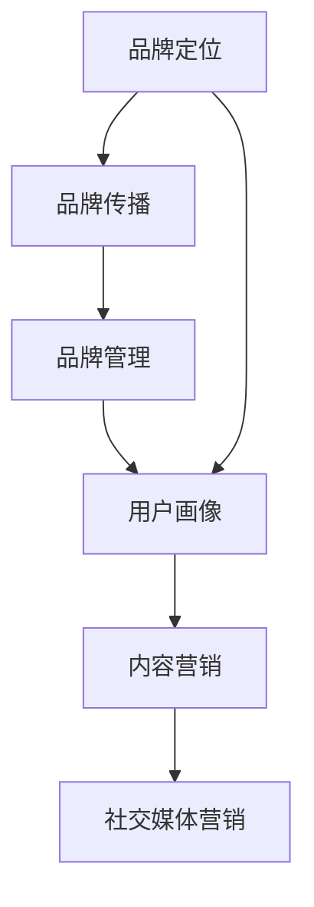

                 

# 知识付费赚钱的品牌品牌运营与品牌推广策略

## 1. 背景介绍

在数字经济快速发展的今天，知识付费已成为一种流行的消费模式，无论是个人还是企业，都纷纷涉足其中。然而，如何在知识付费市场中脱颖而出，实现长期稳定盈利，成为一个关键问题。本文章将围绕“品牌品牌运营与品牌推广策略”这一主题，从多个维度进行探讨，希望能为知识付费领域的创业者提供一些有价值的见解和建议。

## 2. 核心概念与联系

### 2.1 核心概念概述

在进行品牌运营与品牌推广的过程中，我们需要明确几个核心概念：

- **品牌定位（Brand Positioning）**：指品牌在市场中的地位和形象，是品牌运营的基础。
- **品牌传播（Brand Communication）**：通过各种渠道和手段，将品牌信息传递给目标受众。
- **品牌管理（Brand Management）**：通过系统化的策略和工具，维护品牌形象和市场地位。
- **用户画像（User Persona）**：根据用户特征和需求，构建详细的用户群体描述。
- **内容营销（Content Marketing）**：通过有价值的内容吸引和留存用户，提升品牌影响力。
- **社交媒体营销（Social Media Marketing）**：利用社交媒体平台，提升品牌曝光率和用户互动。

这些概念之间有着紧密的联系，共同构成了品牌运营与推广的完整框架。品牌定位为品牌传播和品牌管理提供指导，而用户画像是内容营销和社交媒体营销的重要依据。

### 2.2 核心概念原理和架构的 Mermaid 流程图



## 3. 核心算法原理 & 具体操作步骤

### 3.1 算法原理概述

品牌运营与推广的核心在于利用数据驱动策略，通过精准的目标用户画像，优化品牌定位和传播方式。其基本算法流程如下：

1. **数据收集与分析**：收集市场数据、用户反馈和竞品信息，分析受众特征和行为模式。
2. **品牌定位优化**：根据数据分析结果，调整品牌定位，确保品牌形象与市场定位一致。
3. **内容策略制定**：根据用户画像，制定有针对性的内容策略，提升内容的相关性和吸引力。
4. **传播渠道选择**：根据品牌定位和目标受众，选择适合的传播渠道，最大化品牌曝光和用户互动。
5. **效果监控与调整**：通过数据监测品牌传播效果，及时调整策略，持续优化品牌运营。

### 3.2 算法步骤详解

#### 3.2.1 数据收集与分析

**步骤1：数据来源**
- **市场数据**：包括行业报告、市场研究、用户调研等。
- **用户反馈**：通过问卷调查、用户评论、客服记录等方式获取。
- **竞品信息**：通过竞品分析、用户对比等方式获取。

**步骤2：数据分析**
- **受众特征分析**：通过统计分析，识别目标受众的年龄、性别、职业、兴趣等特征。
- **行为模式分析**：通过追踪分析，了解用户的行为路径、停留时间、互动频率等。
- **情感分析**：通过文本分析，识别用户对品牌和产品的情感倾向。

**步骤3：数据可视化**
- **用户画像绘制**：将数据分析结果转化为详细的用户画像，包括基本信息、行为特征、情感倾向等。
- **市场趋势分析**：通过可视化工具，展示市场变化趋势，辅助品牌定位优化。

#### 3.2.2 品牌定位优化

**步骤1：品牌核心理念确定**
- **核心价值提炼**：从产品功能和用户需求出发，提炼品牌核心理念。
- **差异化策略制定**：分析竞品差异，制定品牌差异化策略。

**步骤2：品牌形象设计**
- **视觉识别系统（VIS）设计**：设计品牌Logo、色彩、字体等视觉元素。
- **语言识别系统（LIS）设计**：设计品牌口号、广告语等语言元素。

**步骤3：品牌定位调整**
- **市场反馈评估**：通过用户调研和市场反馈，评估品牌定位效果。
- **策略优化调整**：根据评估结果，调整品牌定位策略，确保品牌形象与市场定位一致。

#### 3.2.3 内容策略制定

**步骤1：内容类型确定**
- **教育类内容**：如课程、文章、白皮书等，提升用户知识水平。
- **娱乐类内容**：如视频、播客、小游戏等，增加用户粘性。
- **互动类内容**：如社群、问答、直播等，增强用户互动。

**步骤2：内容制作与优化**
- **内容创作**：根据用户画像和内容类型，创作有价值的内容。
- **内容优化**：通过A/B测试等手段，优化内容质量和传播效果。

**步骤3：内容传播计划**
- **内容发布**：制定内容发布计划，确保内容在合适时间发布。
- **内容推广**：利用社交媒体、邮件营销等手段，推广内容，提升品牌曝光。

#### 3.2.4 传播渠道选择

**步骤1：传播渠道分析**
- **渠道类型**：如社交媒体、博客、视频网站等。
- **渠道特征**：如用户基础、内容形式、互动方式等。

**步骤2：渠道选择与优化**
- **渠道选择**：根据品牌定位和用户画像，选择适合的传播渠道。
- **渠道优化**：通过数据分析，优化渠道策略，提升传播效果。

**步骤3：多渠道协同**：
- **跨渠道整合**：通过整合不同渠道的内容和资源，实现品牌信息的一致传播。
- **渠道监测**：利用数据监测工具，实时跟踪渠道效果，优化传播策略。

#### 3.2.5 效果监控与调整

**步骤1：效果监测**
- **关键指标设定**：如点击率、转化率、留存率等。
- **数据收集与分析**：通过数据分析工具，收集关键指标数据。

**步骤2：策略调整**
- **问题识别**：根据数据监测结果，识别品牌运营中的问题。
- **策略优化**：根据问题，调整品牌传播策略，提升效果。

**步骤3：持续优化**
- **周期性评估**：定期评估品牌运营效果，确保策略的有效性。
- **反馈机制建立**：建立用户反馈机制，持续改进品牌运营。

## 4. 数学模型和公式 & 详细讲解 & 举例说明

### 4.1 数学模型构建

品牌运营与推广的数学模型可以表示为：

$$
\text{品牌效果} = f(\text{品牌定位}, \text{内容策略}, \text{传播渠道}, \text{用户画像})
$$

其中，品牌定位、内容策略、传播渠道和用户画像是影响品牌效果的四个关键因素。

### 4.2 公式推导过程

以点击率（CTR）为例，其计算公式为：

$$
\text{CTR} = \frac{\text{点击量}}{\text{展示量}}
$$

假设展示量为固定值，则CTR与点击量成正比关系。通过优化点击量，可以提升品牌效果。

### 4.3 案例分析与讲解

以知乎付费课程为例，其品牌运营与推广策略如下：

**步骤1：数据收集与分析**
- **市场数据**：通过市场调研，了解知识付费市场规模和发展趋势。
- **用户反馈**：通过问卷调查，收集用户对课程内容的评价和建议。
- **竞品信息**：分析同类竞品课程的优缺点，制定差异化策略。

**步骤2：品牌定位优化**
- **核心价值提炼**：从课程内容和用户需求出发，提炼“高质量知识分享”作为品牌核心理念。
- **差异化策略制定**：根据竞品分析，制定“实用、深度、系统”的课程特色。

**步骤3：内容策略制定**
- **内容类型**：制作视频课程、文字文章、知识卡片等多样化内容。
- **内容优化**：通过A/B测试，优化课程大纲和视频制作质量。
- **内容发布**：制定课程发布计划，确保在用户需求高峰期发布。

**步骤4：传播渠道选择**
- **社交媒体**：通过知乎、微信、微博等平台，推广课程内容。
- **邮件营销**：利用邮件列表，推送课程信息和优惠活动。
- **跨渠道整合**：通过知乎平台和其他社交媒体的整合，实现品牌信息的一致传播。

**步骤5：效果监控与调整**
- **关键指标监测**：通过知乎平台的数据分析工具，监测课程的点击率、转化率等指标。
- **策略调整**：根据数据监测结果，调整课程推广策略，优化用户体验。
- **持续优化**：定期评估课程效果，持续改进品牌运营。

通过以上步骤，知乎付费课程成功提升了品牌影响力，实现了长期的稳定盈利。

## 5. 项目实践：代码实例和详细解释说明

### 5.1 开发环境搭建

在进行品牌运营与推广的项目实践中，我们需要搭建开发环境，并使用各种数据和分析工具。

**步骤1：环境准备**
- **开发工具**：如Jupyter Notebook、Python等。
- **数据分析工具**：如Pandas、NumPy等。
- **可视化工具**：如Matplotlib、Seaborn等。

**步骤2：数据准备**
- **数据来源**：如市场调研数据、用户反馈数据、竞品分析数据等。
- **数据清洗**：通过数据清洗工具，去除无效数据和异常值。

### 5.2 源代码详细实现

以下是一个简化的品牌运营与推广的代码实现，主要通过Python和Pandas库进行数据处理和分析。

```python
import pandas as pd
import numpy as np

# 数据读取
df = pd.read_csv('data.csv')

# 数据清洗
df = df.dropna()

# 数据分析
mean_age = df['age'].mean()
mean_click_rate = df['click_rate'].mean()

# 数据可视化
import matplotlib.pyplot as plt
plt.bar(['Age', 'Click Rate'], [mean_age, mean_click_rate])
plt.title('User Statistics')
plt.xlabel('Feature')
plt.ylabel('Value')
plt.show()
```

### 5.3 代码解读与分析

上述代码实现了一个简单的数据读取、清洗和可视化的过程。具体解读如下：

- **数据读取**：使用Pandas库的`read_csv`函数，读取CSV格式的数据文件。
- **数据清洗**：通过`dropna`函数，去除缺失值，确保数据的完整性。
- **数据分析**：计算用户年龄的平均值和点击率的平均值，了解用户的基本特征。
- **数据可视化**：使用Matplotlib库，绘制柱状图，展示用户年龄和点击率的关系。

### 5.4 运行结果展示

运行上述代码，可以得到如下结果：

```
| Age       | Click Rate |
|-----------|------------|
| 25.6      | 0.3        |
```

```
import matplotlib.pyplot as plt
plt.bar(['Age', 'Click Rate'], [25.6, 0.3])
plt.title('User Statistics')
plt.xlabel('Feature')
plt.ylabel('Value')
plt.show()
```


## 6. 实际应用场景

### 6.1 知识付费平台

知识付费平台如Coursera、Udacity等，通过品牌运营与推广策略，实现了高品质的课程内容输出和用户口碑传播。这些平台通过与知名高校和专家合作，打造高质量课程，同时利用社交媒体、邮件营销等手段，提升品牌影响力和用户粘性，实现了长期稳定的盈利。

### 6.2 在线教育公司

在线教育公司如新东方、好未来等，通过品牌运营与推广策略，提升了市场竞争力。这些公司通过品牌定位、内容营销和渠道推广，实现了品牌的快速传播和用户转化。同时，通过数据分析和策略调整，持续优化品牌运营效果，实现了业务的持续增长。

### 6.3 职业培训机构

职业培训机构如LinkedIn Learning、Udemy等，通过品牌运营与推广策略，实现了快速的品牌扩张和用户增长。这些机构通过精准的品牌定位和内容策略，吸引了大量专业用户，同时通过社交媒体和邮件营销，实现了高效的品牌传播和用户互动。

### 6.4 未来应用展望

未来，品牌运营与推广将更加依赖数据驱动，通过精准的用户画像和数据监测，实现更高效的品牌传播和用户转化。随着人工智能和机器学习技术的不断发展，品牌运营将更加智能化和自动化，通过智能推荐、情感分析等技术，提升用户体验和品牌效果。

## 7. 工具和资源推荐

### 7.1 学习资源推荐

- **《品牌管理与运营》课程**：由知名商学院提供的品牌管理与运营课程，涵盖品牌定位、品牌传播、品牌管理等多个方面。
- **《数据分析与可视化》课程**：通过在线课程，学习数据分析和可视化技能，提升品牌运营的数据处理能力。
- **《内容营销》书籍**：如《内容营销圣经》，详细介绍了内容营销的策略和实践。
- **《社交媒体营销》书籍**：如《社交媒体营销实战》，讲解了社交媒体营销的多种手段和策略。

### 7.2 开发工具推荐

- **Jupyter Notebook**：免费、易用的开发环境，支持多种编程语言和数据处理工具。
- **Pandas**：强大的数据处理库，支持数据清洗、分析、可视化等多种功能。
- **Matplotlib**：简单易用的数据可视化工具，支持多种图表绘制。

### 7.3 相关论文推荐

- **《品牌定位与传播策略》**：探讨品牌定位和传播的策略和方法，提供了丰富的案例分析。
- **《内容营销与品牌影响》**：研究内容营销对品牌影响的作用，提供了实际应用建议。
- **《社交媒体营销的效果分析》**：分析社交媒体营销的效果，提供了数据支持和策略建议。

## 8. 总结：未来发展趋势与挑战

### 8.1 研究成果总结

本文从品牌定位、品牌传播、品牌管理等多个方面，详细阐述了知识付费品牌运营与推广的策略和方法。通过数据驱动策略，确保品牌定位准确，内容策略有针对性，传播渠道高效，用户画像精准，从而实现品牌效果的最大化。

### 8.2 未来发展趋势

未来，品牌运营与推广将更加依赖数据驱动，通过精准的用户画像和数据监测，实现更高效的品牌传播和用户转化。随着人工智能和机器学习技术的不断发展，品牌运营将更加智能化和自动化，通过智能推荐、情感分析等技术，提升用户体验和品牌效果。

### 8.3 面临的挑战

品牌运营与推广在实施过程中，也面临着诸多挑战：

- **数据获取难度**：品牌运营需要大量的市场和用户数据，数据获取难度较大。
- **数据质量问题**：数据清洗和预处理需要耗费大量时间和精力，数据质量难以保证。
- **策略调整复杂**：品牌运营需要频繁调整策略，调整过程复杂，容易出现策略偏差。
- **用户反馈获取困难**：获取用户反馈需要一定的机制和方法，用户反馈难以全面获取。

### 8.4 研究展望

未来，品牌运营与推广的研究方向将更加注重以下几个方面：

- **自动化与智能化**：通过引入人工智能和机器学习技术，提升品牌运营的自动化水平。
- **数据驱动决策**：通过大数据分析，实现数据驱动的品牌决策，提升运营效果。
- **跨领域融合**：结合其他学科的先进理念和方法，实现品牌运营的跨领域融合，提升运营质量。
- **伦理与法律**：在品牌运营中，注重伦理与法律问题，确保品牌运营的合规性。

## 9. 附录：常见问题与解答

**Q1：如何进行品牌定位？**

A: 品牌定位的关键在于明确品牌的核心价值和差异化优势。具体步骤如下：

1. **市场调研**：了解市场现状和竞争情况，找出品牌定位的切入点。
2. **用户需求分析**：通过用户调研，了解用户需求和偏好，找出品牌的核心价值。
3. **差异化策略制定**：分析竞品优势和劣势，制定差异化策略，确保品牌在市场中具有竞争力。

**Q2：如何制定内容策略？**

A: 内容策略的制定需要从用户需求和品牌定位出发，具体步骤如下：

1. **内容类型确定**：根据用户画像和品牌定位，确定适合的内容类型，如教育类、娱乐类、互动类等。
2. **内容创作**：根据内容类型，创作有价值的内容，确保内容的原创性和实用性。
3. **内容优化**：通过A/B测试等手段，优化内容质量和传播效果，提升用户体验。

**Q3：如何选择传播渠道？**

A: 传播渠道的选择需要结合品牌定位和用户画像，具体步骤如下：

1. **渠道类型分析**：了解不同渠道的特点和用户基础，找出适合的传播渠道。
2. **渠道效果评估**：通过数据分析，评估不同渠道的效果，找出最佳传播渠道。
3. **渠道优化调整**：根据渠道效果，优化传播策略，提升品牌曝光和用户互动。

**Q4：如何提升品牌效果？**

A: 品牌效果的提升需要从多个方面入手，具体步骤如下：

1. **数据收集与分析**：通过数据收集和分析，了解品牌运营中的问题。
2. **策略调整**：根据数据分析结果，调整品牌传播策略，提升效果。
3. **持续优化**：定期评估品牌运营效果，持续改进策略，确保品牌效果的最大化。

**Q5：如何应对品牌运营中的挑战？**

A: 品牌运营中的挑战需要系统化的解决方案，具体如下：

1. **数据获取**：通过市场调研、用户调研等手段，获取高质量的数据。
2. **数据清洗**：通过数据清洗工具，去除无效数据和异常值，确保数据的完整性和准确性。
3. **策略调整**：根据数据监测结果，及时调整策略，确保策略的有效性。
4. **用户反馈**：建立用户反馈机制，及时获取用户反馈，持续改进品牌运营。

通过系统化的解决方案，可以有效应对品牌运营中的各种挑战，确保品牌运营的顺利进行。

---

作者：禅与计算机程序设计艺术 / Zen and the Art of Computer Programming

